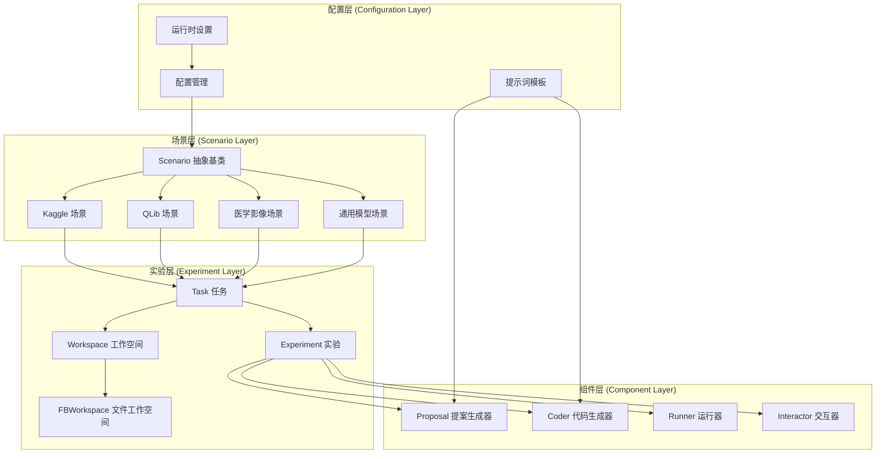
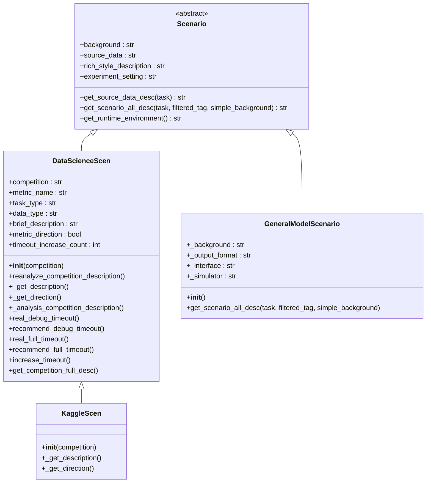
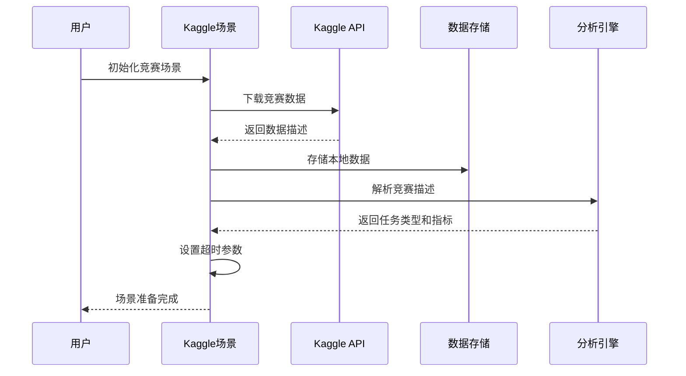
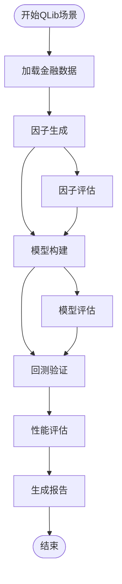
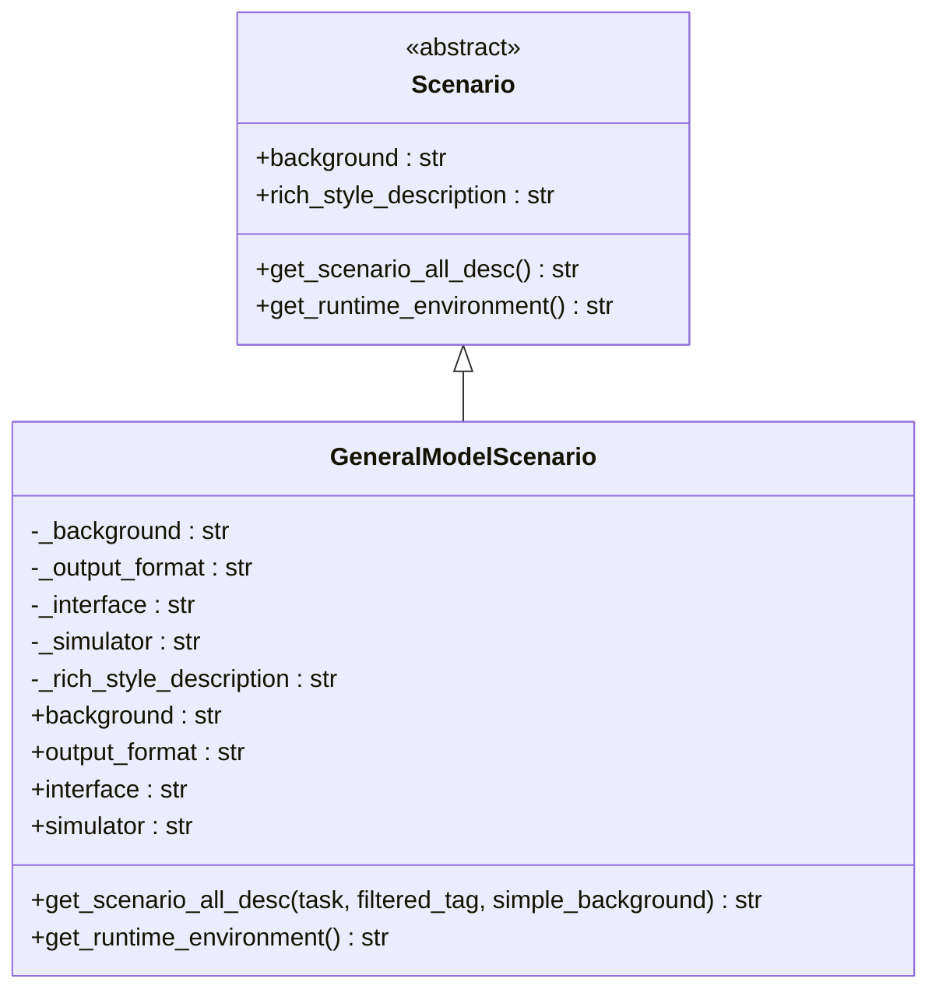
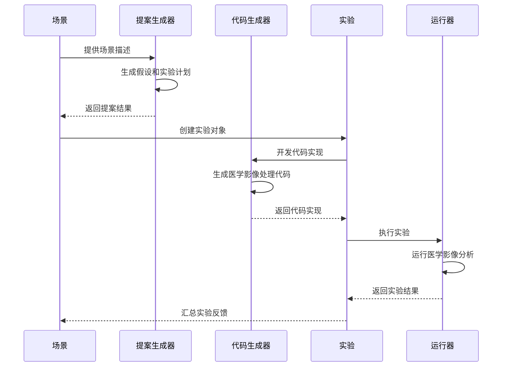
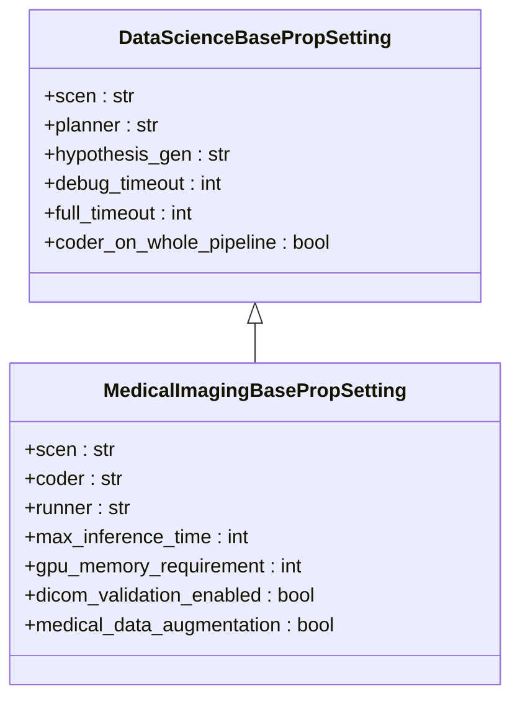

# 扩展场景

<cite>
**本文档中引用的文件**
- [rdagent/core/scenario.py](file://rdagent/core/scenario.py)
- [rdagent/scenarios/kaggle/scenario.py](file://rdagent/scenarios/kaggle/scenario.py)
- [rdagent/scenarios/qlib/scenario.py](file://rdagent/scenarios/qlib/scenario.py)
- [rdagent/scenarios/data_science/scen/__init__.py](file://rdagent/scenarios/data_science/scen/__init__.py)
- [rdagent/scenarios/general_model/scenario.py](file://rdagent/scenarios/general_model/scenario.py)
- [rdagent/core/experiment.py](file://rdagent/core/experiment.py)
- [rdagent/app/cli.py](file://rdagent/app/cli.py)
- [rdagent/app/data_science/conf.py](file://rdagent/app/data_science/conf.py)
- [rdagent/components/developer.py](file://rdagent/components/developer.py)
</cite>

## 目录
1. [简介](#简介)
2. [场景架构概述](#场景架构概述)
3. [核心抽象基类分析](#核心抽象基类分析)
4. [现有场景实现案例](#现有场景实现案例)
5. [创建新场景的完整教程](#创建新场景的完整教程)
6. [场景组件协调机制](#场景组件协调机制)
7. [配置文件设置](#配置文件设置)
8. [CLI命令集成](#cli命令集成)
9. [最佳实践与注意事项](#最佳实践与注意事项)
10. [故障排除指南](#故障排除指南)

## 简介

RD-Agent框架是一个强大的自动化研发平台，通过场景（Scenario）系统支持多种应用领域的智能开发。场景是框架的核心抽象，它定义了特定领域的问题描述、数据源、评估标准和执行环境，协调着提案生成（Proposal）、代码编写（Coder）和实验执行（Experiment）等核心组件。

本指南将详细介绍如何为RD-Agent框架添加全新的应用场景，以`kaggle`和`qlib`场景为例，说明如何继承`rdagent.core.scenario.Scenario`抽象基类，并实现核心方法。同时提供一个从零开始创建新场景（如医学影像分析）的完整分步教程。

## 场景架构概述

RD-Agent的场景系统采用分层架构设计，确保了高度的可扩展性和模块化：



**图表来源**
- [rdagent/core/scenario.py](file://rdagent/core/scenario.py#L1-L65)
- [rdagent/core/experiment.py](file://rdagent/core/experiment.py#L1-L483)

## 核心抽象基类分析

### Scenario抽象基类

`Scenario`类是所有场景实现的基础抽象类，定义了场景必须实现的核心接口：



**图表来源**
- [rdagent/core/scenario.py](file://rdagent/core/scenario.py#L5-L65)
- [rdagent/scenarios/data_science/scen/__init__.py](file://rdagent/scenarios/data_science/scen/__init__.py#L15-L290)
- [rdagent/scenarios/general_model/scenario.py](file://rdagent/scenarios/general_model/scenario.py#L6-L56)

### 核心方法详解

#### 1. 背景信息方法

- **`background`属性**: 提供场景的基本背景信息，描述问题领域和目标
- **`rich_style_description`属性**: 提供富文本格式的场景描述，用于用户界面展示

#### 2. 数据描述方法

- **`get_source_data_desc()`方法**: 返回指定任务的数据源描述，支持动态数据选择
- **`source_data`属性**: 简化的数据源描述快捷方式

#### 3. 场景描述方法

- **`get_scenario_all_desc()`方法**: 组合所有描述信息，返回完整的场景说明
- 支持过滤标签（`filtered_tag`）和简单背景模式（`simple_background`）

#### 4. 运行时环境

- **`get_runtime_environment()`方法**: 获取运行时环境信息，包括依赖项和配置

**章节来源**
- [rdagent/core/scenario.py](file://rdagent/core/scenario.py#L5-L65)

## 现有场景实现案例

### Kaggle场景实现

Kaggle场景是最复杂的场景实现之一，展示了完整的竞赛数据分析和建模流程：



**图表来源**
- [rdagent/scenarios/kaggle/scenario.py](file://rdagent/scenarios/kaggle/scenario.py#L1-L50)

#### 关键特性

1. **自动数据下载**: 从Kaggle API下载竞赛数据
2. **智能描述解析**: 使用LLM分析竞赛描述，提取关键信息
3. **动态超时管理**: 根据任务复杂度调整执行时间限制
4. **指标方向检测**: 自动识别评估指标的方向性

**章节来源**
- [rdagent/scenarios/kaggle/scenario.py](file://rdagent/scenarios/kaggle/scenario.py#L1-L50)

### QLib场景实现

QLib场景专注于量化金融领域的因子挖掘和模型构建：



**图表来源**
- [rdagent/scenarios/qlib/scenario.py](file://rdagent/scenarios/qlib/scenario.py#L1-L50)

#### 关键特性

1. **因子工程**: 自动生成和评估金融因子
2. **模型优化**: 基于历史数据的模型训练
3. **风险控制**: 内置风险管理机制
4. **报告生成**: 自动生成投资策略报告

**章节来源**
- [rdagent/scenarios/qlib/scenario.py](file://rdagent/scenarios/qlib/scenario.py#L1-L50)

### 通用模型场景

通用模型场景提供了最简单的场景实现模板：



**图表来源**
- [rdagent/scenarios/general_model/scenario.py](file://rdagent/scenarios/general_model/scenario.py#L6-L56)

**章节来源**
- [rdagent/scenarios/general_model/scenario.py](file://rdagent/scenarios/general_model/scenario.py#L1-L56)

## 创建新场景的完整教程

### 步骤1：确定场景需求

以医学影像分析场景为例，我们需要考虑以下要素：

- **问题领域**: 医学影像诊断、分割、分类
- **数据类型**: DICOM图像、标注文件、患者信息
- **评估指标**: Dice系数、IoU、敏感性、特异性
- **输出格式**: 标注掩码、诊断报告、置信度分数
- **运行环境**: GPU加速、医疗数据安全要求

### 步骤2：创建场景目录结构

在`rdagent/scenarios/`目录下创建新的场景子模块：

```
rdagent/scenarios/
├── medical_imaging/
│   ├── __init__.py
│   ├── scenario.py
│   ├── developer/
│   │   ├── coder.py
│   │   ├── feedback.py
│   │   └── runner.py
│   ├── experiment/
│   │   ├── experiment.py
│   │   └── workspace.py
│   ├── proposal/
│   │   └── proposal.py
│   ├── conf.py
│   ├── loop.py
│   └── prompts.yaml
```

### 步骤3：实现核心场景类

创建`scenario.py`文件，继承`Scenario`基类：

```python
# 示例路径: rdagent/scenarios/medical_imaging/scenario.py
from rdagent.core.experiment import Task
from rdagent.core.scenario import Scenario
from rdagent.utils.agent.tpl import T

class MedicalImagingScenario(Scenario):
    def __init__(self, study_type: str, dataset_path: str):
        super().__init__()
        self.study_type = study_type
        self.dataset_path = dataset_path
        self._initialize_scenario()
    
    def _initialize_scenario(self):
        """初始化场景配置"""
        self._background = self._load_background()
        self._evaluation_metrics = self._detect_evaluation_metrics()
        self._runtime_environment = self._setup_runtime_environment()
    
    @property
    def background(self) -> str:
        return self._background
    
    @property
    def rich_style_description(self) -> str:
        return T(".prompts:medical_imaging_description").r(
            study_type=self.study_type,
            dataset_path=self.dataset_path
        )
    
    def get_scenario_all_desc(self, task: Task | None = None, 
                             filtered_tag: str | None = None, 
                             simple_background: bool | None = None) -> str:
        """获取完整的场景描述"""
        return T(".prompts:full_medical_imaging_description").r(
            background=self.background,
            study_type=self.study_type,
            evaluation_metrics=self._evaluation_metrics,
            runtime_environment=self.get_runtime_environment()
        )
    
    def get_runtime_environment(self) -> str:
        """获取运行时环境信息"""
        return T(".prompts:runtime_environment").r(
            gpu_available=True,
            memory_requirement=">=16GB",
            dicom_support=True
        )
    
    def get_source_data_desc(self, task: Task | None = None) -> str:
        """获取数据源描述"""
        return T(".prompts:data_description").r(
            study_type=self.study_type,
            dataset_path=self.dataset_path,
            patient_count=self._count_patients(),
            image_count=self._count_images()
        )
```

### 步骤4：实现开发者组件

创建`developer/coder.py`文件：

```python
# 示例路径: rdagent/scenarios/medical_imaging/developer/coder.py
from rdagent.components.developer import Developer
from rdagent.core.experiment import Experiment, FBWorkspace
from rdagent.utils.agent.tpl import T

class MedicalImagingCoder(Developer[Experiment]):
    def develop(self, exp: Experiment) -> Experiment:
        """开发医学影像分析代码"""
        for i, task in enumerate(exp.sub_tasks):
            workspace = FBWorkspace(task)
            workspace.prepare()
            
            # 生成医学影像处理代码
            code = self._generate_medical_code(task)
            workspace.inject_files(**{"model.py": code})
            
            exp.sub_workspace_list[i] = workspace
        
        return exp
    
    def _generate_medical_code(self, task) -> str:
        """根据任务生成医学影像处理代码"""
        template = T(".prompts:model_template").r(
            task_description=task.description,
            study_type=self.scen.study_type,
            metrics=self.scen._evaluation_metrics
        )
        return template
```

### 步骤5：配置文件设置

创建`conf.py`文件：

```python
# 示例路径: rdagent/scenarios/medical_imaging/conf.py
from pydantic_settings import SettingsConfigDict
from rdagent.app.data_science.conf import DataScienceBasePropSetting

class MedicalImagingBasePropSetting(DataScienceBasePropSetting):
    model_config = SettingsConfigDict(env_prefix="MEDICAL_IMAGING_", protected_namespaces=())
    
    # 场景特定配置
    scen: str = "rdagent.scenarios.medical_imaging.scenario.MedicalImagingScenario"
    coder: str = "rdagent.scenarios.medical_imaging.developer.coder.MedicalImagingCoder"
    runner: str = "rdagent.scenarios.medical_imaging.developer.runner.MedicalImagingRunner"
    
    # 医学影像特定设置
    max_inference_time: int = 300  # 5分钟最大推理时间
    gpu_memory_requirement: int = 16  # 16GB GPU内存需求
    dicom_validation_enabled: bool = True
    medical_data_augmentation: bool = True
```

### 步骤6：实现工作空间

创建`experiment/workspace.py`文件：

```python
# 示例路径: rdagent/scenarios/medical_imaging/experiment/workspace.py
from rdagent.core.experiment import FBWorkspace
from pathlib import Path

class MedicalImagingWorkspace(FBWorkspace):
    def __init__(self, *args, **kwargs):
        super().__init__(*args, **kwargs)
        self.dicom_files = []
        self.annotations = []
    
    def prepare(self):
        """准备医学影像工作空间"""
        super().prepare()
        self._validate_dicom_files()
        self._extract_metadata()
    
    def _validate_dicom_files(self):
        """验证DICOM文件完整性"""
        dicom_dir = Path(self.workspace_path) / "dicom_data"
        if dicom_dir.exists():
            self.dicom_files = list(dicom_dir.glob("*.dcm"))
            # 执行DICOM文件验证逻辑
    
    def _extract_metadata(self):
        """提取DICOM元数据"""
        # 实现DICOM元数据提取逻辑
        pass
```

### 步骤7：集成CLI命令

修改`rdagent/app/cli.py`文件：

```python
# 在适当位置添加新的命令导入
from rdagent.scenarios.medical_imaging.loop import main as medical_imaging

# 在app.command()部分添加新命令
app.command(name="medical_imaging")(medical_imaging)
```

创建`loop.py`文件：

```python
# 示例路径: rdagent/scenarios/medical_imaging/loop.py
import typer
from rdagent.app.data_science.conf import DS_RD_SETTING
from rdagent.scenarios.medical_imaging.conf import MedicalImagingBasePropSetting

app = typer.Typer()

@app.command()
def main(
    study_type: str = typer.Option(..., help="医学影像研究类型"),
    dataset_path: str = typer.Option(..., help="数据集路径"),
    output_path: str = typer.Option("./output", help="输出路径"),
):
    """启动医学影像分析循环"""
    # 配置场景设置
    settings = MedicalImagingBasePropSetting()
    settings.local_data_path = dataset_path
    settings.workspace_path = output_path
    
    # 启动分析循环
    # 实现具体的分析逻辑
    pass

if __name__ == "__main__":
    app()
```

## 场景组件协调机制

### Proposal、Coder和Experiment的协作



**图表来源**
- [rdagent/components/workflow/rd_loop.py](file://rdagent/components/workflow/rd_loop.py#L39-L71)

### 组件间的数据流

1. **场景到提案**: 场景提供问题描述和约束条件
2. **提案到代码**: 提案生成具体的实验方案和假设
3. **代码到实验**: 开发者根据提案生成可执行代码
4. **实验到运行**: 实验包含完整的执行环境和数据
5. **运行到反馈**: 运行器提供性能评估和错误信息

**章节来源**
- [rdagent/components/workflow/rd_loop.py](file://rdagent/components/workflow/rd_loop.py#L39-L71)

## 配置文件设置

### 环境变量配置

创建`.env`文件：

```bash
# 医学影像场景专用配置
MEDICAL_IMAGING_LOCAL_DATA_PATH=/path/to/medical/dataset
MEDICAL_IMAGING_WORKSPACE_PATH=./medical_output
MEDICAL_IMAGING_MAX_INFERENCE_TIME=300
MEDICAL_IMAGING_GPU_MEMORY_REQUIREMENT=16
MEDICAL_IMAGING_DICOM_VALIDATION_ENABLED=true
```

### 配置继承和覆盖

医学影像场景配置继承自基础数据科学配置：



**图表来源**
- [rdagent/app/data_science/conf.py](file://rdagent/app/data_science/conf.py#L10-L207)
- [rdagent/scenarios/medical_imaging/conf.py](file://rdagent/scenarios/medical_imaging/conf.py#L8-L50)

## CLI命令集成

### 添加新命令

在`rdagent/app/cli.py`中添加医学影像分析命令：

```python
# 导入新的命令
from rdagent.scenarios.medical_imaging.loop import main as medical_imaging

# 在app实例中添加命令
app.command(name="medical_imaging")(medical_imaging)
```

### 命令使用示例

```bash
# 基本用法
python -m rdagent.app.cli medical_imaging \
    --study-type "ct-lung-segmentation" \
    --dataset-path "/data/medical/lung_ct" \
    --output-path "./lung_segmentation_results"

# 带详细参数的用法
python -m rdagent.app.cli medical_imaging \
    --study-type "mri-brain-tumor-detection" \
    --dataset-path "/data/medical/brain_mri" \
    --output-path "./tumor_detection_results" \
    --verbose
```

### 命令参数验证

实现参数验证逻辑：

```python
@app.command()
def main(
    study_type: str = typer.Option(..., help="医学影像研究类型"),
    dataset_path: str = typer.Option(..., help="数据集路径"),
    output_path: str = typer.Option("./output", help="输出路径"),
    verbose: bool = typer.Option(False, help="启用详细输出"),
):
    """启动医学影像分析循环"""
    
    # 参数验证
    if not Path(dataset_path).exists():
        raise ValueError(f"数据集路径不存在: {dataset_path}")
    
    if not study_type in ["ct", "mri", "xr", "us"]:
        raise ValueError(f"不支持的研究类型: {study_type}")
    
    # 启动分析
    settings = MedicalImagingBasePropSetting()
    # ... 实现具体逻辑
```

## 最佳实践与注意事项

### 1. 场景设计原则

- **单一职责**: 每个场景专注于特定的应用领域
- **可扩展性**: 设计时考虑未来功能扩展
- **模块化**: 将不同功能分离到独立模块
- **配置驱动**: 使用配置文件管理场景参数

### 2. 错误处理策略

```python
def safe_initialize_scenario(self):
    """安全的场景初始化"""
    try:
        self._initialize_scenario()
    except Exception as e:
        logger.error(f"场景初始化失败: {e}")
        raise RuntimeError(f"无法初始化医学影像场景: {e}")
```

### 3. 性能优化

- **延迟加载**: 只在需要时加载大型数据集
- **缓存机制**: 缓存重复计算的结果
- **资源管理**: 合理管理GPU和内存资源

### 4. 安全考虑

- **数据隐私**: 确保医疗数据的安全传输和存储
- **访问控制**: 实现适当的权限检查
- **审计日志**: 记录关键操作和变更

## 故障排除指南

### 常见问题及解决方案

#### 1. 场景初始化失败

**症状**: 场景对象创建时抛出异常

**可能原因**:
- 数据集路径不存在
- 权限不足
- 配置文件格式错误

**解决方案**:
```python
# 添加路径存在性检查
if not Path(dataset_path).exists():
    raise FileNotFoundError(f"数据集路径不存在: {dataset_path}")

# 添加权限检查
if not os.access(dataset_path, os.R_OK):
    raise PermissionError(f"无权访问数据集路径: {dataset_path}")
```

#### 2. 内存不足错误

**症状**: 运行时出现OOM错误

**解决方案**:
```python
# 动态调整批处理大小
def optimize_batch_size(self, available_memory_gb):
    if available_memory_gb >= 32:
        return 32
    elif available_memory_gb >= 16:
        return 16
    else:
        return 8
```

#### 3. GPU资源竞争

**症状**: 多个进程争夺GPU资源

**解决方案**:
```python
# 实现GPU资源管理
def acquire_gpu_resources(gpu_id):
    # 检查GPU可用性
    if not is_gpu_available(gpu_id):
        raise RuntimeError(f"GPU {gpu_id} 不可用")
    
    # 设置CUDA设备
    os.environ["CUDA_VISIBLE_DEVICES"] = str(gpu_id)
```

### 调试技巧

1. **启用详细日志**: 设置日志级别为DEBUG
2. **分步测试**: 逐个测试场景组件
3. **单元测试**: 为每个组件编写单元测试
4. **集成测试**: 测试整个场景流程

### 性能监控

```python
import psutil
import GPUtil

def monitor_resources():
    """监控系统资源使用情况"""
    cpu_percent = psutil.cpu_percent()
    memory = psutil.virtual_memory()
    gpus = GPUtil.getGPUs()
    
    logger.info(f"CPU使用率: {cpu_percent}%")
    logger.info(f"内存使用率: {memory.percent}%")
    logger.info(f"GPU使用情况: {[gpu.load for gpu in gpus]}")
```

通过遵循这些指导原则和最佳实践，开发者可以成功地为RD-Agent框架添加新的应用场景，特别是针对医学影像分析这样的专业领域。记住要始终保持代码的可维护性、可扩展性和安全性，特别是在处理敏感的医疗数据时。