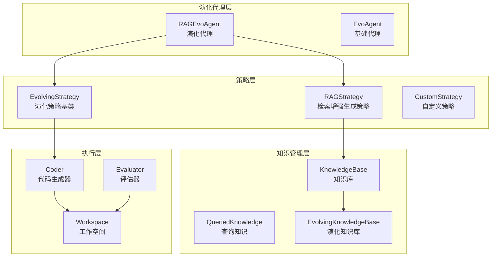
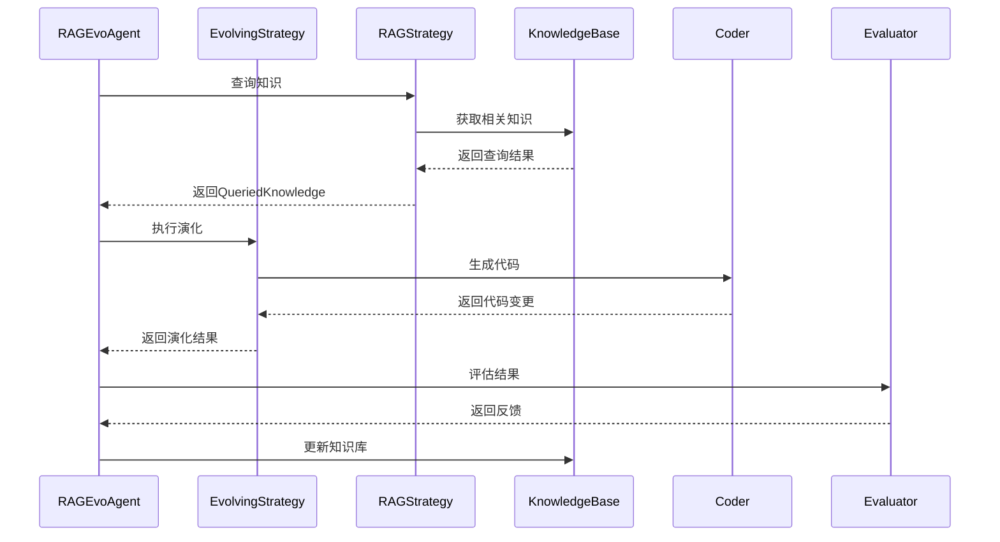
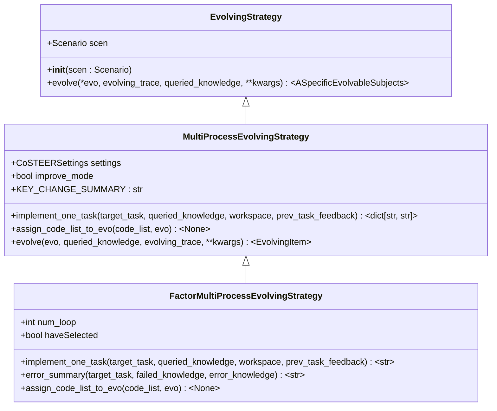
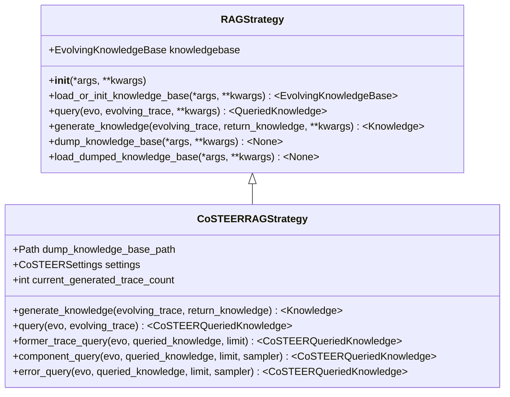
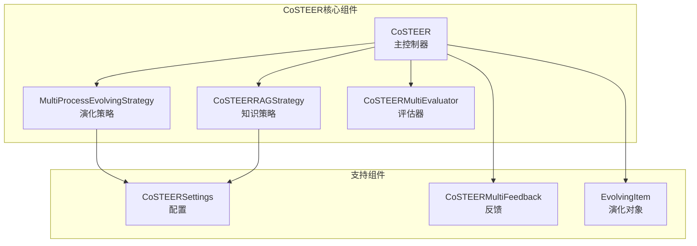
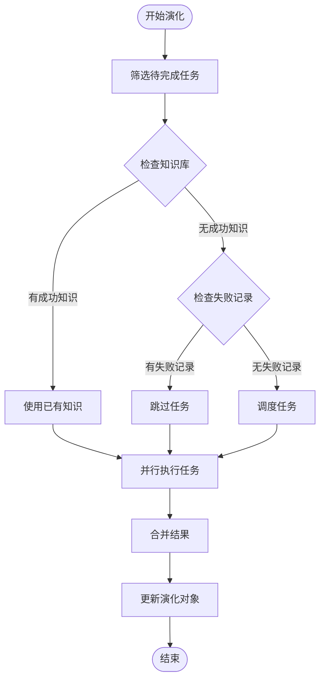
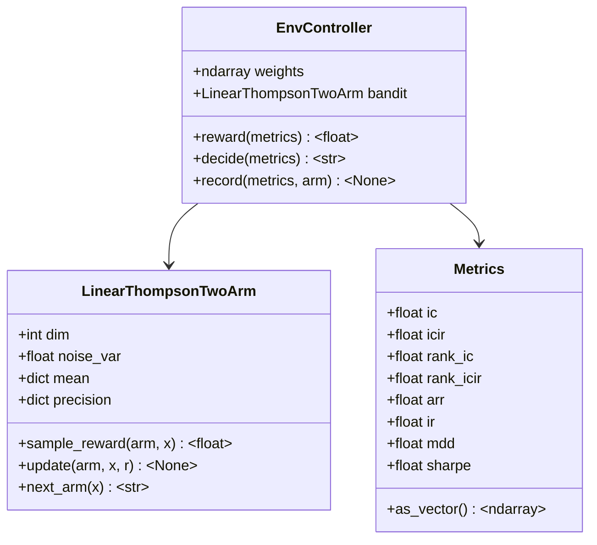
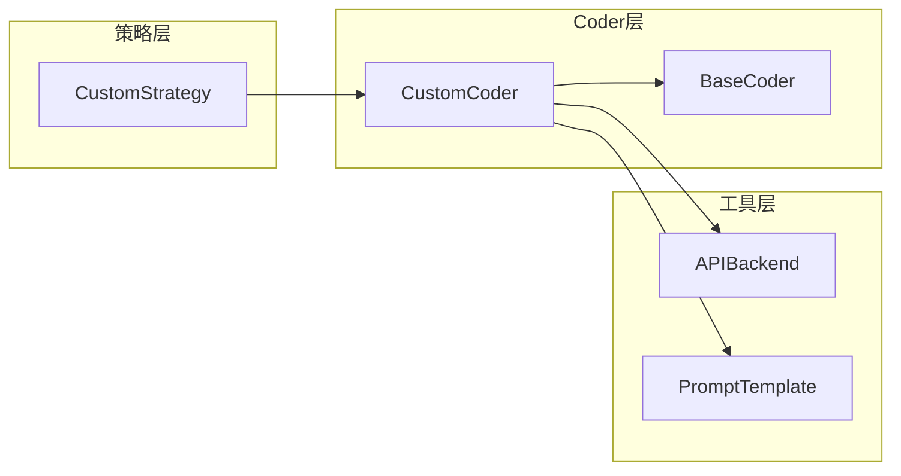

# 扩展演化策略

<cite>
**本文档中引用的文件**
- [evolving_framework.py](file://rdagent/core/evolving_framework.py)
- [evolving_agent.py](file://rdagent/core/evolving_agent.py)
- [CoSTEER evolving_strategy.py](file://rdagent/components/coder/CoSTEER/evolving_strategy.py)
- [CoSTEER __init__.py](file://rdagent/components/coder/CoSTEER/__init__.py)
- [factor evolving_strategy.py](file://rdagent/components/coder/factor_coder/evolving_strategy.py)
- [bandit.py](file://rdagent/scenarios/qlib/proposal/bandit.py)
- [knowledge_management.py](file://rdagent/components/coder/CoSTEER/knowledge_management.py)
- [config.py](file://rdagent/components/coder/CoSTEER/config.py)
- [conf.py](file://rdagent/app/data_science/conf.py)
</cite>

## 目录
1. [概述](#概述)
2. [核心架构设计](#核心架构设计)
3. [抽象类详解](#抽象类详解)
4. [CoSTEER策略实现](#costeer策略实现)
5. [创建新策略](#创建新策略)
6. [与现有组件集成](#与现有组件集成)
7. [配置和部署](#配置和部署)
8. [最佳实践](#最佳实践)
9. [故障排除](#故障排除)

## 概述

RD-Agent的演化策略系统提供了一个灵活且可扩展的框架，用于定义和执行代码演化逻辑。该系统的核心思想是通过迭代优化过程，结合知识管理、评估反馈和智能决策机制，实现代码质量的持续提升。

### 系统特点

- **模块化设计**：清晰分离策略定义、知识管理和执行逻辑
- **可扩展性**：支持自定义演化策略的快速开发和部署
- **智能决策**：基于多臂赌博机算法等先进方法进行探索策略
- **知识驱动**：利用历史经验和上下文信息指导演化过程

## 核心架构设计

RD-Agent的演化策略系统采用分层架构设计，主要包含以下核心组件：



**图表来源**
- [evolving_agent.py](file://rdagent/core/evolving_agent.py#L46-L114)
- [evolving_framework.py](file://rdagent/core/evolving_framework.py#L59-L126)

### 核心流程

演化过程遵循以下标准流程：



**图表来源**
- [evolving_agent.py](file://rdagent/core/evolving_agent.py#L70-L114)

## 抽象类详解

### EvolvingStrategy抽象类

`EvolvingStrategy`是所有演化策略的基础抽象类，定义了演化过程的核心接口：



**图表来源**
- [evolving_framework.py](file://rdagent/core/evolving_framework.py#L59-L77)
- [CoSTEER evolving_strategy.py](file://rdagent/components/coder/CoSTEER/evolving_strategy.py#L20-L134)
- [factor evolving_strategy.py](file://rdagent/components/coder/factor_coder/evolving_strategy.py#L15-L173)

#### 核心方法说明

- **`evolve()`方法**：定义演化逻辑的核心入口点，接收演化对象、知识查询结果和演化历史
- **`implement_one_task()`方法**：处理单个任务的实现逻辑，返回代码修改内容
- **`assign_code_list_to_evo()`方法**：将代码列表分配给演化对象

**章节来源**
- [evolving_framework.py](file://rdagent/core/evolving_framework.py#L63-L77)
- [CoSTEER evolving_strategy.py](file://rdagent/components/coder/CoSTEER/evolving_strategy.py#L35-L55)

### RAGStrategy抽象类

`RAGStrategy`实现了检索增强生成策略，负责知识的查询、生成和管理：



**图表来源**
- [evolving_framework.py](file://rdagent/core/evolving_framework.py#L80-L126)
- [knowledge_management.py](file://rdagent/components/coder/CoSTEER/knowledge_management.py#L54-L276)

**章节来源**
- [evolving_framework.py](file://rdagent/core/evolving_framework.py#L80-L126)

## CoSTEER策略实现

CoSTEER（Collaborative Software Testing and Evolution with Reinforcement）是RD-Agent的核心演化策略实现，展示了如何构建复杂的演化逻辑。

### CoSTEER架构概览



**图表来源**
- [CoSTEER __init__.py](file://rdagent/components/coder/CoSTEER/__init__.py#L20-L176)

### evolve方法实现详解

以CoSTEER策略中的`evolve`方法为例，展示如何实现独特的代码演化逻辑：

#### 关键实现步骤

1. **任务筛选**：根据知识库状态筛选需要处理的任务
2. **并行处理**：使用多进程并行执行任务实现
3. **知识利用**：整合查询到的相关知识
4. **结果整合**：将并行结果整合到演化对象中



**图表来源**
- [CoSTEER evolving_strategy.py](file://rdagent/components/coder/CoSTEER/evolving_strategy.py#L75-L134)

**章节来源**
- [CoSTEER evolving_strategy.py](file://rdagent/components/coder/CoSTEER/evolving_strategy.py#L75-L134)

### 多臂赌博机探索策略

基于`bandit.py`中的线性汤普森采样算法，展示如何实现基于多臂赌博机的探索策略：

#### 策略核心组件



**图表来源**
- [bandit.py](file://rdagent/scenarios/qlib/proposal/bandit.py#L45-L109)

**章节来源**
- [bandit.py](file://rdagent/scenarios/qlib/proposal/bandit.py#L45-L109)

## 创建新策略

### 步骤1：继承基础策略类

创建新的演化策略需要继承相应的抽象类：

```python
# 示例：自定义演化策略
from rdagent.components.coder.CoSTEER.evolving_strategy import MultiProcessEvolvingStrategy
from rdagent.components.coder.CoSTEER.config import CoSTEERSettings
from rdagent.core.scenario import Scenario

class CustomEvolvingStrategy(MultiProcessEvolvingStrategy):
    def __init__(self, scen: Scenario, settings: CoSTEERSettings, **kwargs):
        super().__init__(scen, settings, **kwargs)
        # 自定义初始化逻辑
        
    def implement_one_task(self, target_task, queried_knowledge=None, workspace=None, prev_task_feedback=None):
        # 实现任务执行逻辑
        pass
        
    def assign_code_list_to_evo(self, code_list, evo):
        # 实现代码分配逻辑
        pass
```

### 步骤2：实现核心方法

#### implement_one_task方法

这是策略的核心方法，负责单个任务的具体实现：

```python
def implement_one_task(self, target_task, queried_knowledge=None, workspace=None, prev_task_feedback=None):
    """
    实现单个任务的逻辑
    
    参数:
        target_task: 目标任务对象
        queried_knowledge: 查询到的知识
        workspace: 工作空间
        prev_task_feedback: 前一次任务的反馈
    
    返回:
        dict: 包含文件名和内容的字典
    """
    # 1. 分析任务需求
    task_info = target_task.get_task_information()
    
    # 2. 利用查询到的知识
    if queried_knowledge:
        similar_solutions = queried_knowledge.get_similar_solutions(task_info)
        failed_attempts = queried_knowledge.get_failed_attempts(task_info)
    
    # 3. 生成解决方案
    solution = self._generate_solution(
        task_info=task_info,
        similar_solutions=similar_solutions,
        failed_attempts=failed_attempts,
        prev_feedback=prev_task_feedback
    )
    
    # 4. 返回结果
    return {"solution.py": solution}
```

#### evolve方法

实现整体演化逻辑：

```python
def evolve(self, *, evo, queried_knowledge=None, evolving_trace=None, **kwargs):
    """
    执行演化过程
    
    参数:
        evo: 演化对象
        queried_knowledge: 查询到的知识
        evolving_trace: 演化历史
    
    返回:
        EvolvingItem: 更新后的演化对象
    """
    # 1. 筛选需要处理的任务
    tasks_to_process = self._filter_tasks(evo, queried_knowledge, evolving_trace)
    
    # 2. 并行处理任务
    results = self._parallel_process(tasks_to_process, queried_knowledge, evolving_trace)
    
    # 3. 整合结果
    updated_evo = self._merge_results(evo, results)
    
    return updated_evo
```

### 步骤3：实现知识查询策略

```python
class CustomRAGStrategy(RAGStrategy):
    def query(self, evo, evolving_trace, **kwargs):
        """
        查询相关知识
        """
        queried_knowledge = CustomQueriedKnowledge()
        
        # 1. 查询相似任务的成功案例
        queried_knowledge.similar_solutions = self._find_similar_solutions(evo, evolving_trace)
        
        # 2. 查询失败模式
        queried_knowledge.failure_patterns = self._analyze_failure_patterns(evo, evolving_trace)
        
        # 3. 查询最佳实践
        queried_knowledge.best_practices = self._extract_best_practices(evo, evolving_trace)
        
        return queried_knowledge
```

## 与现有组件集成

### 集成到CoSTEER框架

要将新策略集成到CoSTEER框架中：

```python
# 1. 导入必要的组件
from rdagent.components.coder.CoSTEER import CoSTEER
from rdagent.components.coder.CoSTEER.config import CoSTEERSettings
from rdagent.components.coder.CoSTEER.evaluators import CoSTEERMultiEvaluator

# 2. 创建自定义策略
custom_strategy = CustomEvolvingStrategy(
    scen=scen,
    settings=CoSTEERSettings()
)

# 3. 创建评估器
evaluator = CoSTEERMultiEvaluator(custom_strategy, scen=scen)

# 4. 初始化CoSTEER实例
costeer_agent = CoSTEER(
    settings=CoSTEERSettings(),
    eva=evaluator,
    es=custom_strategy,
    scen=scen
)
```

### 与Coder组件集成



### 与KnowledgeBase组件集成

```python
class CustomKnowledgeBase(EvolvingKnowledgeBase):
    def __init__(self, path=None):
        self.knowledge_store = {}
        self.embedding_index = {}
        super().__init__(path)
    
    def query(self, query_text, top_k=5):
        """
        查询相关知识
        """
        query_embedding = self._compute_embedding(query_text)
        similarities = self._compute_similarities(query_embedding)
        return self._retrieve_top_k(similarities, top_k)
    
    def add_knowledge(self, task_info, solution, feedback):
        """
        添加新知识
        """
        knowledge_item = {
            'task_info': task_info,
            'solution': solution,
            'feedback': feedback,
            'embedding': self._compute_embedding(task_info)
        }
        self.knowledge_store[task_info] = knowledge_item
```

**章节来源**
- [CoSTEER __init__.py](file://rdagent/components/coder/CoSTEER/__init__.py#L20-L50)

## 配置和部署

### 配置文件设置

在配置文件中注册新的策略：

```yaml
# 在配置文件中添加
coder: "rdagent.components.coder.custom_coder.CustomCoSTEER"
evolving_strategy: "rdagent.components.coder.custom_coder.CustomEvolvingStrategy"
rag_strategy: "rdagent.components.coder.custom_coder.CustomRAGStrategy"

# 自定义配置参数
custom_strategy:
  max_iterations: 15
  exploration_rate: 0.2
  knowledge_threshold: 0.7
  
# 知识库配置
knowledge_base:
  path: "./knowledge/custom_knowledge.pkl"
  version: "v2"
  auto_update: true
```

### 环境变量配置

```bash
# 设置环境变量
export CUSTOM_STRATEGY_MAX_ITERATIONS=15
export CUSTOM_STRATEGY_EXPLORATION_RATE=0.2
export KNOWLEDGE_BASE_PATH="./knowledge/custom_knowledge.pkl"
export ENABLE_CUSTOM_STRATEGY=true
```

### 启用新策略

```python
# 在应用启动时启用
from rdagent.components.coder.custom_coder import CustomCoSTEER
from rdagent.components.coder.custom_coder.config import CustomSettings

# 加载配置
custom_settings = CustomSettings()

# 初始化策略
custom_strategy = CustomCoSTEER(
    settings=custom_settings,
    eva=evaluator,
    es=custom_strategy,
    scen=scen
)

# 开始演化
for evolved_item in custom_strategy.develop(experiment):
    # 处理演化结果
    pass
```

**章节来源**
- [conf.py](file://rdagent/app/data_science/conf.py#L1-L206)
- [config.py](file://rdagent/components/coder/CoSTEER/config.py#L1-L42)

## 最佳实践

### 策略设计原则

1. **单一职责**：每个策略专注于特定的演化场景
2. **可测试性**：确保策略方法可以独立测试
3. **可配置性**：提供丰富的配置选项
4. **性能优化**：合理使用缓存和并行处理

### 代码组织结构

```
rdagent/
├── components/
│   └── coder/
│       └── custom_coder/
│           ├── __init__.py          # 主入口
│           ├── evolving_strategy.py  # 演化策略
│           ├── config.py             # 配置类
│           ├── evaluators.py         # 评估器
│           ├── knowledge_management.py # 知识管理
│           └── prompts.yaml         # 提示模板
```

### 错误处理策略

```python
def implement_one_task_with_fallback(self, target_task, **kwargs):
    """
    带回退机制的任务实现
    """
    try:
        return self.implement_one_task(target_task, **kwargs)
    except Exception as e:
        logger.warning(f"Primary implementation failed: {e}")
        # 尝试回退方案
        return self._fallback_implementation(target_task, **kwargs)
```

### 性能监控

```python
import time
from functools import wraps

def monitor_performance(func):
    @wraps(func)
    def wrapper(*args, **kwargs):
        start_time = time.time()
        try:
            result = func(*args, **kwargs)
            duration = time.time() - start_time
            logger.info(f"{func.__name__} took {duration:.2f} seconds")
            return result
        except Exception as e:
            duration = time.time() - start_time
            logger.error(f"{func.__name__} failed after {duration:.2f} seconds: {e}")
            raise
    return wrapper
```

## 故障排除

### 常见问题及解决方案

#### 1. 策略初始化失败

**问题症状**：策略无法正确初始化或加载

**解决方案**：
```python
# 检查依赖项
try:
    from rdagent.components.coder.custom_coder import CustomEvolvingStrategy
except ImportError as e:
    logger.error(f"Failed to import custom strategy: {e}")
    # 检查PYTHONPATH设置
    import sys
    logger.info(f"Python paths: {sys.path}")
```

#### 2. 内存溢出

**问题症状**：大规模演化过程中内存使用过高

**解决方案**：
```python
# 实现内存管理
class MemoryEfficientStrategy(MultiProcessEvolvingStrategy):
    def __init__(self, *args, max_memory_mb=1024, **kwargs):
        self.max_memory_mb = max_memory_mb
        super().__init__(*args, **kwargs)
    
    def _check_memory_usage(self):
        import psutil
        process = psutil.Process()
        memory_mb = process.memory_info().rss / 1024 / 1024
        if memory_mb > self.max_memory_mb:
            logger.warning(f"Memory usage exceeded {self.max_memory_mb}MB: {memory_mb:.2f}MB")
            # 清理缓存
            self._cleanup_cache()
```

#### 3. 并行处理问题

**问题症状**：多进程处理导致数据竞争或死锁

**解决方案**：
```python
# 使用进程安全的数据结构
from multiprocessing import Manager

class ThreadSafeStrategy(MultiProcessEvolvingStrategy):
    def __init__(self, *args, **kwargs):
        self.manager = Manager()
        self.shared_state = self.manager.dict()
        super().__init__(*args, **kwargs)
    
    def _safe_update_state(self, key, value):
        with self.manager.Lock():
            self.shared_state[key] = value
```

#### 4. 知识库同步问题

**问题症状**：多个进程间知识库不一致

**解决方案**：
```python
# 实现知识库同步
class SyncedRAGStrategy(RAGStrategy):
    def __init__(self, *args, sync_interval=30, **kwargs):
        self.sync_interval = sync_interval
        self.last_sync = time.time()
        super().__init__(*args, **kwargs)
    
    def query(self, *args, **kwargs):
        # 定期同步知识库
        if time.time() - self.last_sync > self.sync_interval:
            self.load_dumped_knowledge_base()
            self.last_sync = time.time()
        return super().query(*args, **kwargs)
```

### 调试技巧

1. **启用详细日志**：
```python
import logging
logging.getLogger('rdagent.components.coder.custom_coder').setLevel(logging.DEBUG)
```

2. **使用断点调试**：
```python
import pdb
pdb.set_trace()  # 在关键位置设置断点
```

3. **性能分析**：
```python
import cProfile
profiler = cProfile.Profile()
profiler.enable()

# 执行策略
result = strategy.evolve(evo, queried_knowledge)

profiler.disable()
profiler.print_stats()
```

**章节来源**
- [CoSTEER evolving_strategy.py](file://rdagent/components/coder/CoSTEER/evolving_strategy.py#L75-L134)

## 结论

RD-Agent的演化策略系统提供了一个强大而灵活的框架，支持开发者创建定制化的代码演化策略。通过理解核心架构、掌握抽象类设计、学习实际案例实现，以及遵循最佳实践，开发者可以有效地扩展系统的功能，满足特定领域的演化需求。

关键要点：
- 理解`EvolvingStrategy`和`RAGStrategy`的设计原理
- 掌握CoSTEER策略的实现细节
- 学会创建和集成新的演化策略
- 遵循最佳实践确保策略的有效性和稳定性

随着AI技术的发展，这个框架将继续演进，为更复杂的代码演化任务提供支持。