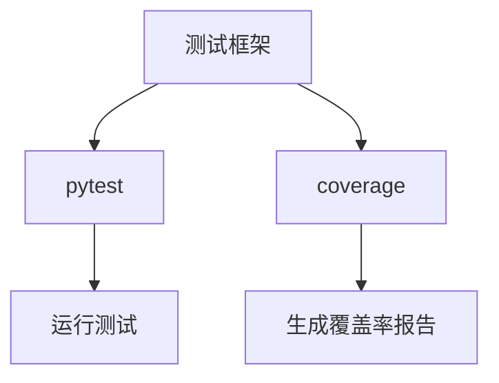
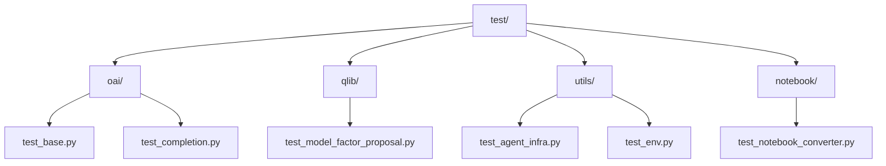
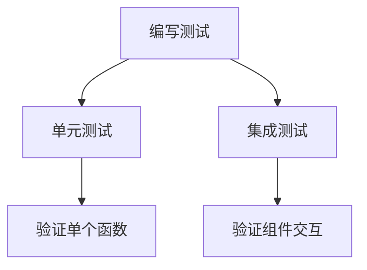
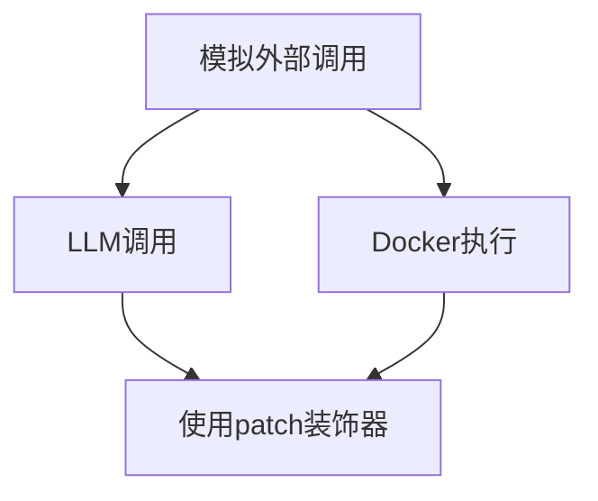

# 测试指南

<cite>
**本文档中引用的文件**  
- [pyproject.toml](file://pyproject.toml)
- [test.txt](file://requirements/test.txt)
- [test_base.py](file://test/oai/test_base.py)
- [test_agent_infra.py](file://test/utils/test_agent_infra.py)
- [test_model_factor_proposal.py](file://test/qlib/test_model_factor_proposal.py)
- [test_CoSTEER.py](file://test/utils/coder/test_CoSTEER.py)
- [test_notebook_converter.py](file://test/notebook/test_notebook_converter.py)
- [test_env.py](file://test/utils/test_env.py)
- [Makefile](file://Makefile)
</cite>

## 目录
1. [简介](#简介)
2. [测试框架与依赖](#测试框架与依赖)
3. [测试目录结构](#测试目录结构)
4. [编写单元测试和集成测试](#编写单元测试和集成测试)
5. [使用unittest.mock模拟外部调用](#使用unittestmock模拟外部调用)
6. [运行测试](#运行测试)
7. [生成代码覆盖率报告](#生成代码覆盖率报告)
8. [测试在框架可靠性中的作用](#测试在框架可靠性中的作用)

## 简介
本指南旨在为RD-Agent项目提供全面的测试编写和执行指导。文档将介绍项目使用的测试框架、测试目录结构，并详细说明如何为新的`Scenario`或`EvolvingStrategy`编写单元测试和集成测试。此外，还将演示如何使用`unittest.mock`来模拟LLM调用和Docker执行，以确保测试的稳定性和速度。最后，文档将说明如何运行特定测试以及如何生成代码覆盖率报告，强调测试在保证框架可靠性和防止回归中的重要性。

**Section sources**
- [README.md](file://README.md)

## 测试框架与依赖
RD-Agent项目使用`pytest`作为主要的测试框架，并通过`coverage`工具生成代码覆盖率报告。这些依赖项在`requirements/test.txt`文件中定义，并在`pyproject.toml`中配置了测试相关的选项。`pytest`被配置为在运行时显示详细的输出信息，并启用日志记录功能，以便更好地调试测试用例。



**Diagram sources**
- [requirements/test.txt](file://requirements/test.txt)
- [pyproject.toml](file://pyproject.toml)

**Section sources**
- [requirements/test.txt](file://requirements/test.txt)
- [pyproject.toml](file://pyproject.toml)

## 测试目录结构
项目的测试代码位于`test/`目录下，该目录包含多个子目录，分别对应不同的功能模块：
- `oai`: 包含与OAI（Open AI）相关的测试。
- `qlib`: 包含与Qlib相关的测试。
- `utils`: 包含工具类和辅助功能的测试。
- `notebook`: 包含笔记本转换器相关的测试。

每个子目录中都包含了具体的测试文件，这些文件通常以`test_`开头，并遵循`unittest`或`pytest`的命名约定。



**Diagram sources**
- [test/oai/test_base.py](file://test/oai/test_base.py)
- [test/qlib/test_model_factor_proposal.py](file://test/qlib/test_model_factor_proposal.py)
- [test/utils/test_agent_infra.py](file://test/utils/test_agent_infra.py)
- [test/utils/test_env.py](file://test/utils/test_env.py)
- [test/notebook/test_notebook_converter.py](file://test/notebook/test_notebook_converter.py)

**Section sources**
- [test/oai/test_base.py](file://test/oai/test_base.py)
- [test/qlib/test_model_factor_proposal.py](file://test/qlib/test_model_factor_proposal.py)
- [test/utils/test_agent_infra.py](file://test/utils/test_agent_infra.py)
- [test/utils/test_env.py](file://test/utils/test_env.py)
- [test/notebook/test_notebook_converter.py](file://test/notebook/test_notebook_converter.py)

## 编写单元测试和集成测试
为了确保新添加的`Scenario`或`EvolvingStrategy`能够正确工作，需要编写相应的单元测试和集成测试。单元测试主要用于验证单个函数或方法的行为，而集成测试则用于验证多个组件之间的交互。

例如，在`test_model_factor_proposal.py`中，通过`pytest.fixture`定义了测试数据，并使用`@pytest.mark.parametrize`装饰器来参数化测试用例，从而提高测试的覆盖率。



**Diagram sources**
- [test/qlib/test_model_factor_proposal.py](file://test/qlib/test_model_factor_proposal.py)

**Section sources**
- [test/qlib/test_model_factor_proposal.py](file://test/qlib/test_model_factor_proposal.py)

## 使用unittest.mock模拟外部调用
为了确保测试的稳定性和速度，可以使用`unittest.mock`库来模拟外部调用，如LLM调用和Docker执行。这可以通过`patch`装饰器实现，它允许临时替换指定的对象或方法。

在`test_model_factor_proposal.py`中，使用`@patch("rdagent.utils.agent.tpl.T.r", return_value="mocked")`来模拟模板渲染过程，避免实际调用外部服务。



**Diagram sources**
- [test/qlib/test_model_factor_proposal.py](file://test/qlib/test_model_factor_proposal.py)

**Section sources**
- [test/qlib/test_model_factor_proposal.py](file://test/qlib/test_model_factor_proposal.py)

## 运行测试
可以通过`Makefile`中的目标来运行测试。例如，`make test-run`会清除之前的覆盖率数据，运行所有测试，并合并结果。`make test-offline`则只运行不需要API调用的离线测试。

```bash
make test-run
make test-offline
```

**Section sources**
- [Makefile](file://Makefile)

## 生成代码覆盖率报告
使用`coverage`工具可以生成代码覆盖率报告。`make test`目标会在运行测试后生成终端报告和XML格式的覆盖率报告。可以通过`--fail-under`参数设置最低覆盖率要求。

```bash
make test
```

**Section sources**
- [Makefile](file://Makefile)

## 测试在框架可靠性中的作用
测试是保证RD-Agent框架可靠性的关键环节。通过编写全面的单元测试和集成测试，可以有效防止代码回归，确保新功能的正确性。同时，使用`unittest.mock`模拟外部调用可以提高测试的速度和稳定性，使开发人员能够更快地迭代和验证代码。

**Section sources**
- [README.md](file://README.md)