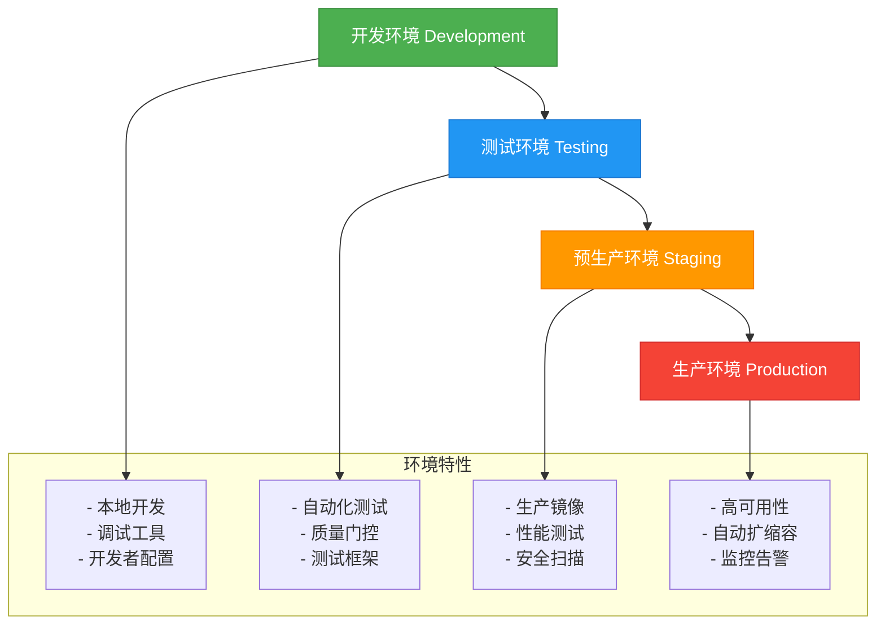

# 部署自动化

<cite>
**本文档中引用的文件**   
- [README.md](file://README.md)
- [DEPLOYMENT.md](file://DEPLOYMENT.md)
- [Dockerfile](file://Dockerfile)
- [scripts/deploy.sh](file://scripts/deploy.sh)
- [Makefile](file://Makefile)
- [rdagent/scenarios/kaggle/docker/DS_docker/Dockerfile](file://rdagent/scenarios/kaggle/docker/DS_docker/Dockerfile)
- [rdagent/scenarios/kaggle/docker/kaggle_docker/Dockerfile](file://rdagent/scenarios/kaggle/docker/kaggle_docker/Dockerfile)
- [rdagent/scenarios/qlib/docker/Dockerfile](file://rdagent/scenarios/qlib/docker/Dockerfile)
- [rdagent/scenarios/data_science/sing_docker/Dockerfile](file://rdagent/scenarios/data_science/sing_docker/Dockerfile)
- [rdagent/scenarios/data_science/sing_docker/entrypoint.sh](file://rdagent/scenarios/data_science/sing_docker/entrypoint.sh)
- [pyproject.toml](file://pyproject.toml)
- [requirements.txt](file://requirements.txt)
- [deployment/CLAUDE.md](file://deployment/CLAUDE.md)
</cite>

## 目录
1. [简介](#简介)
2. [部署架构](#部署架构)
3. [容器化部署](#容器化部署)
4. [CI/CD流水线](#cicd流水线)
5. [环境配置管理](#环境配置管理)
6. [部署策略](#部署策略)
7. [监控与日志](#监控与日志)
8. [性能优化](#性能优化)
9. [故障排除](#故障排除)
10. [最佳实践](#最佳实践)

## 简介

RD-Agent是一个面向机器学习工程（MLE）的自主代理系统，旨在自动化研究和开发流程。该项目支持多种部署方式，包括本地开发、Docker容器化和生产环境自动化部署。通过完整的CI/CD流水线，RD-Agent实现了从开发到生产的全生命周期管理，确保系统在不同环境中的可靠运行。

**部署特性**：
- **多环境支持**：开发、测试、预生产、生产环境
- **容器化部署**：基于Docker的完整容器化解决方案
- **自动化CI/CD**：GitHub Actions驱动的持续集成和持续部署
- **灵活的部署策略**：支持蓝绿部署和金丝雀发布
- **全面的监控**：系统、应用和业务指标的全面监控

**Section sources**
- [README.md](file://README.md#L1-L108)
- [DEPLOYMENT.md](file://DEPLOYMENT.md#L1-L116)

## 部署架构

RD-Agent采用多层次的部署架构，支持从开发到生产的全生命周期管理。系统架构分为四个主要环境层级，每个层级都有特定的配置和用途。



**架构特点**：
- **渐进式部署**：代码从开发环境逐步推进到生产环境
- **环境隔离**：每个环境有独立的配置和资源
- **质量保障**：在每个阶段都有相应的质量检查
- **风险控制**：通过预生产环境验证生产部署

**Diagram sources**
- [DEPLOYMENT.md](file://DEPLOYMENT.md#L14-L25)
- [deployment/CLAUDE.md](file://deployment/CLAUDE.md#L14-L25)

**Section sources**
- [DEPLOYMENT.md](file://DEPLOYMENT.md#L3-L25)
- [deployment/CLAUDE.md](file://deployment/CLAUDE.md#L12-L25)

## 容器化部署

RD-Agent为不同的应用场景提供专门的容器化解决方案。系统采用多阶段构建策略，确保镜像的轻量化和安全性。

### 基础容器配置

项目根目录的Dockerfile定义了基础容器配置，采用多阶段构建策略：

```dockerfile
FROM python:3.10-slim

WORKDIR /app

RUN apt-get update && apt-get install -y \
    git \
    build-essential \
    curl \
    && rm -rf /var/lib/apt/lists/*

COPY requirements.txt .
RUN pip install --no-cache-dir -r requirements.txt

COPY . .

ENV PYTHONPATH=/app
ENV PYTHONUNBUFFERED=1

EXPOSE 8000

HEALTHCHECK --interval=30s --timeout=10s --start-period=5s --retries=3 CMD python -c "import rdagent; print('OK')" || exit 1

CMD ["python", "rdagent", "ui", "--port", "8000"]
```

**Section sources**
- [Dockerfile](file://Dockerfile#L1-L32)

### 场景专用容器

#### Kaggle数据科学容器

RD-Agent为Kaggle竞赛提供了专门的容器化解决方案：

**DS_docker容器** - 通用数据科学环境
```dockerfile
FROM gcr.io/kaggle-gpu-images/python:latest

RUN apt-get clean && apt-get update && apt-get install -y \  
    curl \  
    vim \  
    git \  
    build-essential \
    strace \
    && rm -rf /var/lib/apt/lists/* 
```

**kaggle_docker容器** - 竞赛专用环境
```dockerfile
FROM pytorch/pytorch:2.2.1-cuda12.1-cudnn8-runtime

RUN apt-get clean && apt-get update && apt-get install -y \  
    curl \  
    vim \  
    git \  
    build-essential \
    && rm -rf /var/lib/apt/lists/* 

WORKDIR /workspace

RUN python -m pip install numpy
RUN python -m pip install pandas
RUN pip install torch_geometric
RUN pip install pytorch_lightning
RUN pip install ogb
RUN pip install networkx
RUN pip install scikit-learn
RUN pip install catboost
RUN pip install xgboost
RUN pip install sparse
RUN pip install lightgbm==3.3.5
RUN pip install pyarrow
RUN pip install fastparquet
RUN pip install optuna
```

#### Qlib量化交易容器

```dockerfile
FROM pytorch/pytorch:2.2.1-cuda12.1-cudnn8-runtime

RUN apt-get clean && apt-get update && apt-get install -y \  
    curl \  
    vim \  
    git \  
    build-essential \
    coreutils \
    && rm -rf /var/lib/apt/lists/* 

RUN git clone https://github.com/microsoft/qlib.git

WORKDIR /workspace/qlib

RUN git fetch && git reset 3e72593b8c985f01979bebcf646658002ac43b00 --hard

RUN python -m pip install --upgrade cython
RUN python -m pip install -e .

RUN pip install catboost
RUN pip install xgboost
RUN pip install scipy==1.11.4
RUN pip install tables
```

#### 数据科学专用容器

```dockerfile
FROM pytorch/pytorch:latest

RUN apt-get update && apt-get install -y \  
    curl \  
    vim \  
    git \  
    build-essential \  
    git-lfs \  
    unzip && \  
    rm -rf /var/lib/apt/lists/*  

ENTRYPOINT ["/workspace/run/entrypoint.sh"]

RUN conda init bash

RUN conda create -n mlebench python==3.11 pip -y
RUN cd /workspace && git clone https://github.com/openai/mle-bench.git
RUN cd /workspace/mle-bench && git lfs fetch --all
RUN cd /workspace/mle-bench && git lfs pull
RUN cd /workspace/mle-bench && conda run -n mlebench pip install -e .

COPY ./kaggle_environment.yaml /workspace
RUN cd /workspace && conda env create -f /workspace/kaggle_environment.yaml

RUN cd /workspace && git clone https://github.com/microsoft/RD-Agent
RUN cd RD-Agent && git fetch && make dev

RUN cd /workspace && mkdir -p litellm-srv
RUN cd /workspace/litellm-srv && curl https://raw.githubusercontent.com/you-n-g/deploy/refs/heads/master/configs/python/litellm.trapi.yaml -o litellm.trapi.yaml
RUN pip install 'litellm[proxy]'
RUN pip install git+https://github.com/you-n-g/litellm@add_mi_cred_pr

run cd /workspace && mkdir -p run
COPY ./entrypoint.sh /workspace/run

WORKDIR /workspace/RD-Agent/
```

**Section sources**
- [rdagent/scenarios/kaggle/docker/DS_docker/Dockerfile](file://rdagent/scenarios/kaggle/docker/DS_docker/Dockerfile#L1-L9)
- [rdagent/scenarios/kaggle/docker/kaggle_docker/Dockerfile](file://rdagent/scenarios/kaggle/docker/kaggle_docker/Dockerfile#L1-L30)
- [rdagent/scenarios/qlib/docker/Dockerfile](file://rdagent/scenarios/qlib/docker/Dockerfile#L1-L26)
- [rdagent/scenarios/data_science/sing_docker/Dockerfile](file://rdagent/scenarios/data_science/sing_docker/Dockerfile#L1-L48)

### 容器管理策略

RD-Agent采用多环境容器矩阵策略，为不同环境提供优化的容器配置：

```yaml
containers:
  development:
    base_image: python:3.10-slim
    gpu_support: false
    debugging_tools: true

  testing:
    base_image: python:3.11-slim
    gpu_support: false
    test_frameworks: true

  production:
    base_image: python:3.11-slim
    gpu_support: true
    security_hardening: true

  kaggle_gpu:
    base_image: gcr.io/kaggle-gpu-images/python:latest
    gpu_support: true
    kaggle_tools: true
```

**容器特性**：
- **开发环境**：包含调试工具，便于开发者使用
- **测试环境**：预装测试框架，支持自动化测试
- **生产环境**：安全强化，支持GPU加速
- **Kaggle专用**：基于Kaggle官方GPU镜像，预装竞赛工具

**Section sources**
- [deployment/CLAUDE.md](file://deployment/CLAUDE.md#L107-L130)

## CI/CD流水线

RD-Agent采用GitHub Actions驱动的CI/CD流水线，实现从代码提交到生产部署的自动化流程。

### 主要CI流水线

```yaml
concurrency:
  cancel-in-progress: true
  group: ${{ github.workflow }}-${{ github.ref }}

jobs:
  ci:
    if: ${{ !cancelled() && !failure() }}
    needs: dependabot
    runs-on: ubuntu-latest
    strategy:
      matrix:
        python-version: ['3.10', '3.11']

    steps:
      - name: checkout
        uses: actions/checkout@v4
        with:
          fetch-depth: 0
          submodules: recursive

      - name: Set up Python
        uses: actions/setup-python@v5
        with:
          cache: pip
          python-version: ${{ matrix.python-version }}

      - name: Install dependencies
        run: make dev

      - name: Run tests and checks
        run: make lint docs-gen test-offline
```

**流水线特性**：
- **多Python版本并行测试**：支持Python 3.10和3.11
- **智能缓存策略**：利用GitHub Actions缓存加速构建
- **自动取消过时运行**：避免资源浪费
- **依赖管理自动化**：自动处理依赖更新

### PR质量门控

```yaml
name: Lint pull request title

on:
  pull_request:
    types: [opened, synchronize, reopened, edited]

jobs:
  lint-title:
    runs-on: ubuntu-latest
    steps:
      - name: Checkout Repository
        uses: actions/checkout@v4

      - name: Setup Node.js
        uses: actions/setup-node@v4
        with:
          node-version: '16'

      - name: Install commitlint
        run: npm install --save-dev @commitlint/{config-conventional,cli}

      - name: Validate PR Title
        env:
          BODY: ${{ github.event.pull_request.title }}
        run: |
          echo "$BODY" | npx commitlint --config .commitlintrc.js
```

**质量门控规则**：
- **PR标题验证**：确保PR标题符合约定式提交规范
- **自动化检查**：在PR创建或更新时自动执行
- **即时反馈**：为开发者提供即时的格式反馈

### 文档预览流水线

RD-Agent还包含文档预览流水线，用于：
- 自动构建文档
- 部署预览环境
- 生成文档链接
- 确保文档与代码同步

**Section sources**
- [deployment/CLAUDE.md](file://deployment/CLAUDE.md#L165-L244)

## 环境配置管理

RD-Agent采用分层配置管理系统，确保不同环境的配置一致性。

### 环境变量策略

```bash
# .env.development
DEBUG=true
LOG_LEVEL=DEBUG
REDIS_URL=redis://localhost:6379
DATABASE_URL=postgresql://localhost/rdagent_dev

# .env.production
DEBUG=false
LOG_LEVEL=INFO
REDIS_URL=${REDIS_PROD_URL}
DATABASE_URL=${DATABASE_PROD_URL}
SSL_CERT_PATH=/etc/ssl/certs/rdagent.crt
```

**配置管理原则**：
- **环境分离**：不同环境使用不同的配置文件
- **敏感信息保护**：敏感配置通过环境变量或密钥管理服务获取
- **默认值设置**：为配置项提供合理的默认值
- **配置验证**：在应用启动时验证配置完整性

### 分层配置系统

```python
class DeploymentConfig:
    # 基础配置
    base_config = "config/base.yaml"

    # 环境特定配置
    env_configs = {
        "development": "config/dev.yaml",
        "testing": "config/test.yaml",
        "production": "config/prod.yaml"
    }

    # 敏感配置（从环境变量或密钥管理服务获取）
    sensitive_configs = [
        "database_url",
        "redis_url",
        "llm_api_keys",
        "ssl_certificates"
    ]
```

**Section sources**
- [deployment/CLAUDE.md](file://deployment/CLAUDE.md#L291-L331)

## 部署策略

RD-Agent支持多种部署策略，以满足不同场景的需求。

### 蓝绿部署

```yaml
blue_green_deployment:
  strategy:
    type: RollingUpdate
    rollingUpdate:
      maxSurge: 1
      maxUnavailable: 0

  health_check:
    path: /health
    port: 19899
    initial_delay_seconds: 30
    period_seconds: 10

  traffic_switch:
    type: weighted
    initial_weight: 10
    increment: 20
    threshold: 95
```

**蓝绿部署流程**：
1. 准备新的"绿色"环境
2. 在"绿色"环境部署新版本
3. 进行健康检查和验证
4. 逐步将流量从"蓝色"环境切换到"绿色"环境
5. 确认稳定后，完全切换流量
6. 关闭旧的"蓝色"环境

### 金丝雀发布

```yaml
canary_deployment:
  stages:
    - weight: 5
      duration: 5m
      metrics:
        - success_rate > 99%
        - response_time < 200ms

    - weight: 25
      duration: 15m
      metrics:
        - error_rate < 0.1%

    - weight: 100
      duration: 30m
      auto_promote: true
```

**金丝雀发布流程**：
1. 将新版本部署到一小部分实例
2. 将5%的流量导向新版本
3. 监控关键指标（成功率、响应时间、错误率）
4. 如果指标达标，逐步增加流量比例
5. 最终将100%流量导向新版本
6. 自动或手动确认发布成功

**Section sources**
- [deployment/CLAUDE.md](file://deployment/CLAUDE.md#L245-L289)

## 监控与日志

RD-Agent提供全面的监控和日志解决方案，确保系统的可观测性。

### 应用监控配置

```python
monitoring_config = {
    "metrics": {
        "system": ["cpu_usage", "memory_usage", "disk_usage"],
        "application": ["request_count", "response_time", "error_rate"],
        "business": ["experiment_count", "model_accuracy", "task_completion"]
    },

    "alerts": {
        "cpu_usage": {"threshold": 80, "operator": "gt"},
        "memory_usage": {"threshold": 90, "operator": "gt"},
        "error_rate": {"threshold": 5, "operator": "gt"}
    },

    "dashboards": {
        "system_overview": "system_dashboard.json",
        "application_metrics": "app_dashboard.json",
        "business_metrics": "business_dashboard.json"
    }
}
```

**监控指标分类**：
- **系统指标**：CPU、内存、磁盘使用率
- **应用指标**：请求量、响应时间、错误率
- **业务指标**：实验数量、模型准确率、任务完成率

### 日志聚合配置

```yaml
logging:
  version: 1
  formatters:
    standard:
      format: "%(asctime)s [%(levelname)s] %(name)s: %(message)s"
    json:
      format: '{"timestamp": "%(asctime)s", "level": "%(levelname)s", "logger": "%(name)s", "message": "%(message)s"}'

  handlers:
    console:
      class: logging.StreamHandler
      formatter: standard

    file:
      class: logging.handlers.RotatingFileHandler
      filename: /app/logs/rdagent.log
      maxBytes: 10485760  # 10MB
      backupCount: 5
      formatter: json

    elk:
      class: logstash.TCPLogstashHandler
      host: logstash.internal
      port: 5959
      version: 1
```

**日志策略**：
- **多格式输出**：同时支持标准格式和JSON格式
- **文件轮转**：防止日志文件过大
- **集中式聚合**：通过Logstash将日志发送到ELK栈
- **分级处理**：不同环境使用不同的日志级别

**Section sources**
- [deployment/CLAUDE.md](file://deployment/CLAUDE.md#L380-L434)

## 性能优化

RD-Agent通过多种性能优化策略，确保系统在高负载下的稳定运行。

### 资源配置优化

```yaml
apiVersion: v1
kind: Pod
spec:
  containers:
  - name: rdagent
    image: rdagent:latest
    resources:
      requests:
        memory: "2Gi"
        cpu: "1000m"
        nvidia.com/gpu: 1
      limits:
        memory: "8Gi"
        cpu: "4000m"
        nvidia.com/gpu: 2

    # 性能调优参数
    env:
      - name: OMP_NUM_THREADS
        value: "4"
      - name: CUDA_VISIBLE_DEVICES
        value: "0,1"
```

**资源管理策略**：
- **合理设置请求和限制**：避免资源争用和过度分配
- **GPU资源管理**：明确指定GPU数量和可见设备
- **并行计算优化**：设置适当的线程数
- **内存管理**：防止内存泄漏和OOM

### 缓存策略

```python
cache_config = {
    "l1_cache": {
        "type": "memory",
        "size": "1GB",
        "ttl": 300  # 5分钟
    },

    "l2_cache": {
        "type": "redis",
        "host": "redis.internal",
        "port": 6379,
        "size": "10GB",
        "ttl": 3600  # 1小时
    },

    "l3_cache": {
        "type": "disk",
        "path": "/app/cache",
        "size": "100GB",
        "ttl": 86400  # 24小时
    }
}
```

**多层缓存架构**：
- **L1缓存**：内存缓存，最快但容量有限
- **L2缓存**：Redis缓存，平衡速度和容量
- **L3缓存**：磁盘缓存，容量大但速度较慢

**Section sources**
- [deployment/CLAUDE.md](file://deployment/CLAUDE.md#L436-L489)

## 故障排除

### 常见部署问题

#### 1. 容器启动失败
```bash
# 问题：容器无法启动
# 排查步骤：
docker logs <container_id>
docker inspect <container_id>
kubectl describe pod <pod_name>
kubectl logs <pod_name>
```

#### 2. 网络连接问题
```bash
# 问题：服务间无法通信
# 排查步骤：
kubectl get svc
kubectl describe svc <service_name>
kubectl exec -it <pod_name> -- nslookup <service_name>
```

#### 3. 资源不足
```bash
# 问题：Pod处于Pending状态
# 排查步骤：
kubectl describe pod <pod_name> | grep -A 10 "Events"
kubectl top nodes
kubectl describe node <node_name>
```

### 监控告警

```yaml
groups:
- name: rdagent.rules
  rules:
  - alert: HighCPUUsage
    expr: cpu_usage_percent > 80
    for: 5m
    labels:
      severity: warning
    annotations:
      summary: "High CPU usage detected"
      description: "CPU usage is above 80% for more than 5 minutes"

  - alert: HighMemoryUsage
    expr: memory_usage_percent > 90
    for: 2m
    labels:
      severity: critical
    annotations:
      summary: "High memory usage detected"
      description: "Memory usage is above 90% for more than 2 minutes"
```

**告警策略**：
- **分级告警**：根据严重程度设置不同的告警级别
- **持续时间检查**：避免瞬时波动触发告警
- **详细描述**：提供清晰的告警摘要和描述
- **自动恢复**：当指标恢复正常时自动解除告警

**Section sources**
- [deployment/CLAUDE.md](file://deployment/CLAUDE.md#L626-L681)

## 最佳实践

### 部署清单

```markdown
## 部署前检查清单

- [ ] 环境变量配置正确
- [ ] 密钥和证书已更新
- [ ] 数据库迁移脚本准备就绪
- [ ] 回滚策略已制定
- [ ] 监控告警已配置
- [ ] 备份策略已确认
- [ ] 性能基准测试完成
- [ ] 安全扫描通过
```

### 版本管理

```bash
# 语义化版本控制
VERSION="v1.2.3"

# 版本标签管理
git tag -a $VERSION -m "Release version $VERSION"
git push origin $VERSION

# 构建镜像
docker build -t rdagent:$VERSION .
docker tag rdagent:$VERSION rdagent:latest
```

### 安全配置

```dockerfile
# 安全强化配置示例
FROM python:3.11-slim as base

# 创建非root用户
RUN groupadd -r rdagent && useradd -r -g rdagent rdagent

# 安装安全更新
RUN apt-get update && apt-get upgrade -y && apt-get clean

# 设置安全的文件权限
COPY --chown=rdagent:rdagent . /app
WORKDIR /app

# 切换到非root用户
USER rdagent

# 健康检查
HEALTHCHECK --interval=30s --timeout=10s --start-period=5s --retries=3 \
  CMD python -c "import requests; requests.get('http://localhost:19899/health')" \
  || exit 1
```

**安全最佳实践**：
- **最小权限原则**：使用非root用户运行容器
- **定期更新**：及时应用安全补丁
- **网络策略**：限制不必要的网络访问
- **密钥管理**：使用密钥管理服务存储敏感信息

**Section sources**
- [deployment/CLAUDE.md](file://deployment/CLAUDE.md#L683-L711)