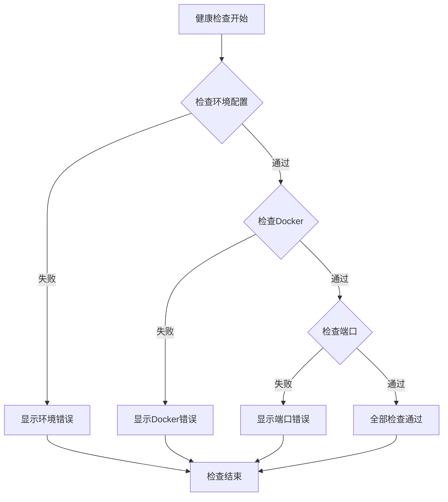
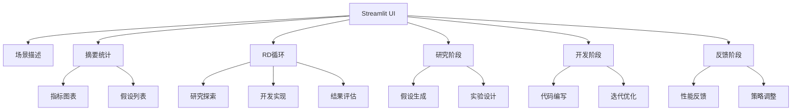
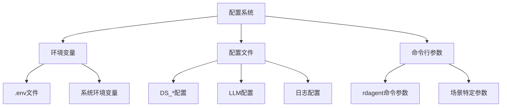
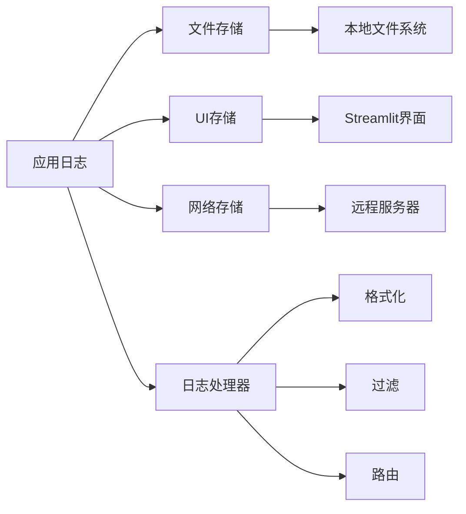
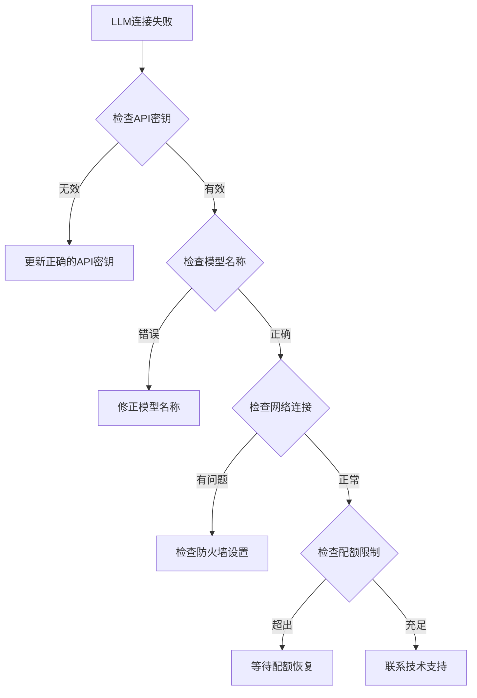

# 快速入门指南

<cite>
**本文档中引用的文件**
- [README.md](file://README.md)
- [pyproject.toml](file://pyproject.toml)
- [requirements.txt](file://requirements.txt)
- [rdagent/app/cli.py](file://rdagent/app/cli.py)
- [rdagent/app/utils/health_check.py](file://rdagent/app/utils/health_check.py)
- [rdagent/app/data_science/loop.py](file://rdagent/app/data_science/loop.py)
- [rdagent/app/qlib_rd_loop/quant.py](file://rdagent/app/qlib_rd_loop/quant.py)
- [rdagent/log/ui/app.py](file://rdagent/log/ui/app.py)
- [rdagent/app/data_science/conf.py](file://rdagent/app/data_science/conf.py)
- [rdagent/oai/llm_conf.py](file://rdagent/oai/llm_conf.py)
- [rdagent/log/logger.py](file://rdagent/log/logger.py)
- [rdagent/core/exception.py](file://rdagent/core/exception.py)
- [rdagent/utils/env.py](file://rdagent/utils/env.py)
</cite>

## 目录
1. [简介](#简介)
2. [系统要求](#系统要求)
3. [安装步骤](#安装步骤)
4. [环境配置](#环境配置)
5. [健康检查](#健康检查)
6. [最小可运行示例](#最小可运行示例)
7. [Streamlit UI监控](#streamlit-ui监控)
8. [配置文件详解](#配置文件详解)
9. [日志输出机制](#日志输出机制)
10. [常见问题排查](#常见问题排查)
11. [进阶使用](#进阶使用)

## 简介

RD-Agent是一个基于大型语言模型的自动研究与开发代理框架，旨在自动化数据驱动的研发过程。本指南将帮助您快速完成RD-Agent的本地部署与首次运行。

### 核心特性
- **多场景支持**：支持量化交易、数据科学、Kaggle竞赛等多种应用场景
- **自动化循环**：具备研究-开发-反馈的完整闭环
- **可视化监控**：提供Streamlit界面实时监控执行流程
- **灵活配置**：支持多种LLM提供商和自定义配置

## 系统要求

### 操作系统支持
RD-Agent目前仅支持Linux操作系统。

### Python版本要求
- **推荐版本**：Python 3.10 或 3.11（经过充分测试）
- **最低要求**：Python ≥ 3.10

### 依赖工具
- **Docker**：用于容器化运行环境（必需）
- **Git**：用于源码克隆（可选）

**Section sources**
- [README.md](file://README.md#L250-L260)
- [pyproject.toml](file://pyproject.toml#L15-L16)

## 安装步骤

### 方法一：通过PyPI安装（推荐）

```bash
# 创建并激活conda环境
conda create -n rdagent python=3.10
conda activate rdagent

# 安装RD-Agent
pip install rdagent
```

### 方法二：从源码安装（开发者模式）

```bash
# 克隆仓库
git clone https://github.com/microsoft/RD-Agent
cd RD-Agent

# 开发环境安装
make dev
```

### 验证安装

```bash
# 检查安装是否成功
rdagent --help
```

**Section sources**
- [README.md](file://README.md#L261-L280)
- [pyproject.toml](file://pyproject.toml#L1-L20)

## 环境配置

### LLM API配置

RD-Agent支持多种LLM提供商，以下是主要配置方式：

#### 1. 使用LiteLLM（默认推荐）

**选项1：统一API基础地址**

```bash
cat << EOF > .env
# 设置任意LiteLLM支持的模型
CHAT_MODEL=gpt-4o 
EMBEDDING_MODEL=text-embedding-3-small
# 配置统一API基础地址
OPENAI_API_BASE=<your_unified_api_base>
OPENAI_API_KEY=<replace_with_your_openai_api_key>
EOF
```

**选项2：分离的聊天和嵌入模型API**

```bash
cat << EOF > .env
# 设置任意LiteLLM支持的模型
# 配置分离的聊天和嵌入API基础地址

# 聊天模型配置
CHAT_MODEL=gpt-4o 
OPENAI_API_BASE=<your_chat_api_base>
OPENAI_API_KEY=<replace_with_your_openai_api_key>

# 嵌入模型配置
# 以SiliconFlow为例，可以使用其他提供商
# 注意：嵌入需要litellm_proxy前缀
EMBEDDING_MODEL=litellm_proxy/BAAI/bge-large-en-v1.5
LITELLM_PROXY_API_KEY=<replace_with_your_siliconflow_api_key>
LITELLM_PROXY_API_BASE=https://api.siliconflow.cn/v1
EOF
```

#### 2. DeepSeek模型配置（实验性支持）

```bash
cat << EOF > .env
# 聊天模型：使用DeepSeek官方API
CHAT_MODEL=deepseek/deepseek-chat 
DEEPSEEK_API_KEY=<replace_with_your_deepseek_api_key>

# 嵌入模型：使用SiliconFlow，因为DeepSeek没有原生嵌入模型
# 注意：嵌入需要litellm_proxy前缀
EMBEDDING_MODEL=litellm_proxy/BAAI/bge-m3
LITELLM_PROXY_API_KEY=<replace_with_your_siliconflow_api_key>
LITELLM_PROXY_API_BASE=https://api.siliconflow.cn/v1
EOF
```

#### 3. Azure OpenAI配置

```bash
cat << EOF > .env
EMBEDDING_MODEL=azure/<支持嵌入的模型部署>
CHAT_MODEL=azure/<您的部署名称>
AZURE_API_KEY=<替换为您的Azure API密钥>
AZURE_API_BASE=<您的统一API基础地址>
AZURE_API_VERSION=<Azure API版本>
EOF
```

### 关键配置说明

| 配置项 | 描述 | 必需性 |
|--------|------|--------|
| `CHAT_MODEL` | 聊天模型名称 | 必需 |
| `EMBEDDING_MODEL` | 嵌入模型名称 | 必需 |
| `OPENAI_API_KEY` | OpenAI API密钥 | 取决于提供商 |
| `LITELLM_PROXY_API_KEY` | LiteLLM代理API密钥 | 嵌入模型专用 |
| `REASONING_THINK_RM` | 移除推理标签 | 可选 |

**Section sources**
- [README.md](file://README.md#L162-L248)
- [rdagent/oai/llm_conf.py](file://rdagent/oai/llm_conf.py#L1-L50)

## 健康检查

RD-Agent提供了全面的健康检查工具，确保所有组件正常工作。

### 基本健康检查

```bash
# 运行完整健康检查（包括环境、Docker、端口）
rdagent health_check

# 仅检查环境配置
rdagent health_check --no-check-docker --no-check-ports

# 仅检查Docker状态
rdagent health_check --no-check-env --no-check-ports

# 仅检查端口占用
rdagent health_check --no-check-env --no-check-docker
```

### 健康检查内容



**图表来源**
- [rdagent/app/utils/health_check.py](file://rdagent/app/utils/health_check.py#L140-L171)

### 常见健康检查结果

| 检查项目 | 正常状态 | 异常状态 |
|----------|----------|----------|
| 环境配置 | ✅ API密钥和模型配置正确 | ❌ 缺少必要配置 |
| Docker状态 | ✅ Docker服务正常运行 | ❌ Docker未安装或配置错误 |
| 端口占用 | ✅ 默认端口19899可用 | ❌ 端口被占用 |

**Section sources**
- [rdagent/app/utils/health_check.py](file://rdagent/app/utils/health_check.py#L140-L171)
- [README.md](file://README.md#L281-L285)

## 最小可运行示例

### 示例1：数据科学自动化任务

```bash
# 1. 下载示例数据集
wget https://github.com/SunsetWolf/rdagent_resource/releases/download/ds_data/arf-12-hours-prediction-task.zip
unzip arf-12-hours-prediction-task.zip -d ./git_ignore_folder/ds_data/

# 2. 配置环境变量
cat << EOF > .env
DS_LOCAL_DATA_PATH=$(pwd)/git_ignore_folder/ds_data
DS_CODER_ON_WHOLE_PIPELINE=True
DS_IF_USING_MLE_DATA=False
DS_SAMPLE_DATA_BY_LLM=False
DS_SCEN=rdagent.scenarios.data_science.scen.DataScienceScen
EOF

# 3. 运行数据科学任务
rdagent data_science --competition arf-12-hours-prediction-task
```

### 示例2：Kaggle竞赛解决方案

```bash
# 1. 注册并登录Kaggle网站
# 2. 配置Kaggle API
mkdir -p ~/.config/kaggle
chmod 600 ~/.config/kaggle/kaggle.json

# 3. 加入竞赛
# 访问竞赛页面，点击"Join the competition" -> "I Understand and Accept"

# 4. 配置环境
cat << EOF > .env
DS_LOCAL_DATA_PATH=$(pwd)/git_ignore_folder/ds_data
DS_CODER_ON_WHOLE_PIPELINE=True
DS_IF_USING_MLE_DATA=True
DS_SAMPLE_DATA_BY_LLM=True
DS_SCEN=rdagent.scenarios.data_science.scen.KaggleScen
EOF

# 5. 运行Kaggle竞赛
rdagent data_science --competition tabular-playground-series-dec-2021
```

### 示例3：量化交易自动化

```bash
# 运行量化交易迭代因子和模型联合演化
rdagent fin_quant

# 或者单独运行因子演化
rdagent fin_factor

# 或者单独运行模型演化
rdagent fin_model
```

### 参数详解

| 参数 | 类型 | 描述 | 示例值 |
|------|------|------|--------|
| `--competition` | 字符串 | 竞赛名称 | `tabular-playground-series-dec-2021` |
| `--step_n` | 整数 | 运行步骤数量 | `5` |
| `--loop_n` | 整数 | 运行循环次数 | `3` |
| `--timeout` | 字符串 | 超时时间 | `2h` |

**Section sources**
- [README.md](file://README.md#L286-L350)
- [rdagent/app/data_science/loop.py](file://rdagent/app/data_science/loop.py#L15-L80)

## Streamlit UI监控

### 启动监控界面

```bash
# 启动基本监控界面
rdagent ui --port 19899 --log-dir <你的日志目录>

# 启动数据科学专用界面
rdagent ui --port 19899 --log-dir <你的日志目录> --data-science
```

### UI界面功能



**图表来源**
- [rdagent/log/ui/app.py](file://rdagent/log/ui/app.py#L747-L779)

### UI界面导航

| 功能区域 | 快捷键 | 描述 |
|----------|--------|------|
| 场景描述 | `_scenario` | 当前运行场景的详细说明 |
| 摘要统计 | `_summary` | 性能指标和假设进展概览 |
| 研究阶段 | `_research` | 假设生成和实验设计过程 |
| 开发阶段 | `_development` | 代码编写和迭代优化过程 |
| 反馈阶段 | `_feedback` | 结果评估和策略调整过程 |

### 实时监控技巧

1. **自动刷新**：界面会自动检测新的日志条目
2. **历史回放**：可以查看之前的运行记录
3. **过滤功能**：支持按标签和类型过滤日志
4. **下载功能**：可导出性能指标数据

**Section sources**
- [rdagent/log/ui/app.py](file://rdagent/log/ui/app.py#L1-L100)
- [rdagent/app/cli.py](file://rdagent/app/cli.py#L38-L50)

## 配置文件详解

### 主要配置文件

RD-Agent使用分层配置系统，支持多种配置方式：



**图表来源**
- [rdagent/app/data_science/conf.py](file://rdagent/app/data_science/conf.py#L1-L50)
- [rdagent/oai/llm_conf.py](file://rdagent/oai/llm_conf.py#L1-L50)

### 数据科学配置

| 配置项 | 默认值 | 描述 |
|--------|--------|------|
| `DS_CODER_ON_WHOLE_PIPELINE` | `True` | 是否在整个管道上进行代码编写 |
| `DS_SAMPLE_DATA_BY_LLM` | `True` | 是否让LLM采样数据 |
| `DS_IF_USING_MLE_DATA` | `False` | 是否使用MLE基准数据 |
| `DS_TIMEOUT` | `3600` | 单次运行超时时间（秒） |
| `DS_MAX_TRACE_NUM` | `1` | 最大跟踪数量 |

### LLM配置

| 配置项 | 默认值 | 描述 |
|--------|--------|------|
| `CHAT_MODEL` | `gpt-4-turbo` | 聊天模型名称 |
| `EMBEDDING_MODEL` | `text-embedding-3-small` | 嵌入模型名称 |
| `CHAT_TEMPERATURE` | `0.5` | 聊天模型温度 |
| `MAX_RETRY` | `10` | 最大重试次数 |
| `TIMEOUT_FAIL_LIMIT` | `10` | 超时失败限制 |

### 日志配置

| 配置项 | 默认值 | 描述 |
|--------|--------|------|
| `TRACE_PATH` | `./log/YYYY-MM-DD_HH-MM-SS-ffffff` | 日志存储路径 |
| `FORMAT_CONSOLE` | `None` | 控制台格式 |
| `UI_SERVER_PORT` | `None` | UI服务器端口 |

**Section sources**
- [rdagent/app/data_science/conf.py](file://rdagent/app/data_science/conf.py#L10-L100)
- [rdagent/oai/llm_conf.py](file://rdagent/oai/llm_conf.py#L10-L80)

## 日志输出机制

### 日志架构



**图表来源**
- [rdagent/log/logger.py](file://rdagent/log/logger.py#L50-L123)

### 日志路径结构

默认日志路径格式：
```
./log/YYYY-MM-DD_HH-MM-SS-ffffff/
├── __session__/
│   ├── 0_propose/
│   ├── 1_execute/
│   └── 2_evaluate/
└── logs/
    ├── debug.log
    ├── info.log
    └── error.log
```

### 日志级别

| 级别 | 用途 | 示例 |
|------|------|------|
| DEBUG | 详细调试信息 | 组件内部状态 |
| INFO | 一般信息 | 任务开始/结束 |
| WARNING | 警告信息 | 配置问题 |
| ERROR | 错误信息 | 执行失败 |

### 日志监控

```bash
# 查看实时日志
tail -f ./log/*/logs/info.log

# 搜索特定事件
grep "hypothesis generation" ./log/*/logs/info.log

# 分析错误
grep "ERROR" ./log/*/logs/error.log
```

**Section sources**
- [rdagent/log/logger.py](file://rdagent/log/logger.py#L50-L123)
- [rdagent/log/conf.py](file://rdagent/log/conf.py#L1-L26)

## 常见问题排查

### 依赖冲突问题

#### 问题症状
```bash
# 安装时出现依赖冲突
ERROR: pip's dependency resolver does not currently consider all the packages that are installed
```

#### 解决方案
```bash
# 清理pip缓存
pip cache purge

# 强制重新安装
pip install --force-reinstall rdagent

# 使用虚拟环境隔离
conda create -n rdagent_clean python=3.10
conda activate rdagent_clean
pip install rdagent
```

### LLM连接失败

#### 问题症状
```bash
# 健康检查显示LLM连接失败
❌ Chat test failed: AuthenticationError
❌ Embedding test failed: RateLimitError
```

#### 排查步骤



**图表来源**
- [rdagent/app/utils/health_check.py](file://rdagent/app/utils/health_check.py#L73-L109)

#### 常见解决方法

| 问题类型 | 解决方法 | 配置示例 |
|----------|----------|----------|
| API密钥错误 | 检查.env文件中的密钥 | `OPENAI_API_KEY=sk-...` |
| 模型不存在 | 使用支持的模型名称 | `CHAT_MODEL=gpt-4o` |
| 网络超时 | 增加超时时间 | `timeout: 60` |
| 配额限制 | 检查账户余额 | 联系服务商充值 |

### Docker相关问题

#### 问题症状
```bash
# Docker健康检查失败
Docker status is exception, please check the docker configuration
```

#### 解决方案

```bash
# 检查Docker服务状态
sudo systemctl status docker

# 添加用户到docker组（无需sudo运行）
sudo usermod -aG docker $USER
newgrp docker

# 重启Docker服务
sudo systemctl restart docker

# 测试Docker安装
docker run hello-world
```

### 内存不足问题

#### 问题症状
```bash
# 运行时内存不足
MemoryError: Unable to allocate array
```

#### 解决方案

```bash
# 检查可用内存
free -h

# 增加Docker内存限制
# 在Docker Desktop设置中增加内存分配
# 或在Linux系统中修改Docker配置

# 临时减少并发任务
export DS_MAX_TRACE_NUM=1
```

### 权限问题

#### 问题症状
```bash
# 文件权限错误
PermissionError: [Errno 13] Permission denied
```

#### 解决方案

```bash
# 检查文件权限
ls -la ./log/

# 修复权限
chmod -R 755 ./log/
chown -R $USER:$USER ./log/

# 清理临时文件
rm -rf ./git_ignore_folder/*
```

**Section sources**
- [rdagent/core/exception.py](file://rdagent/core/exception.py#L1-L67)
- [rdagent/utils/env.py](file://rdagent/utils/env.py#L804-L896)

## 进阶使用

### 自定义场景配置

```python
# 创建自定义场景配置
from rdagent.scenarios.data_science.scen import DataScienceScen

class CustomDataScienceScen(DataScienceScen):
    def __init__(self):
        super().__init__()
        # 自定义配置
        self.custom_param = "custom_value"
```

### 批量处理脚本

```bash
#!/bin/bash
# 批量运行多个数据科学任务

LOG_DIR="./batch_logs"
mkdir -p $LOG_DIR

for competition in "dataset1" "dataset2" "dataset3"; do
    echo "Running $competition..."
    
    # 配置特定参数
    export DS_COMETITION=$competition
    export DS_TIMEOUT=7200
    
    # 运行任务
    rdagent data_science --competition $competition \
        --log-dir $LOG_DIR/$competition &
    
    sleep 10  # 避免资源竞争
done

# 等待所有任务完成
wait
echo "Batch processing completed!"
```

### 性能优化

```bash
# 启用缓存机制
export USE_CHAT_CACHE=True
export USE_EMBEDDING_CACHE=True

# 调整并发数量
export DS_MAX_TRACE_NUM=2

# 优化超时设置
export DS_FULL_TIMEOUT=7200
export DS_DEBUG_TIMEOUT=1800
```

### 监控和告警

```bash
# 日志监控脚本
#!/bin/bash
LOG_FILE="./log/*/logs/error.log"

while true; do
    if grep -q "ERROR" $LOG_FILE; then
        echo "Error detected in logs!"
        # 发送告警通知
        notify-send "RD-Agent Error" "Check logs for details"
    fi
    sleep 60
done
```

### 集成开发环境

```bash
# VS Code集成配置
# .vscode/settings.json
{
    "python.defaultInterpreterPath": "./venv/bin/python",
    "python.envFile": "${workspaceFolder}/.env",
    "terminal.integrated.env.linux": {
        "PATH": "${env:PATH}:${workspaceFolder}/bin"
    }
}
```

这个快速入门指南涵盖了RD-Agent部署和使用的各个方面，从基础安装到高级配置都有详细说明。建议新用户先从简单的数据科学任务开始，逐步熟悉各个功能模块。