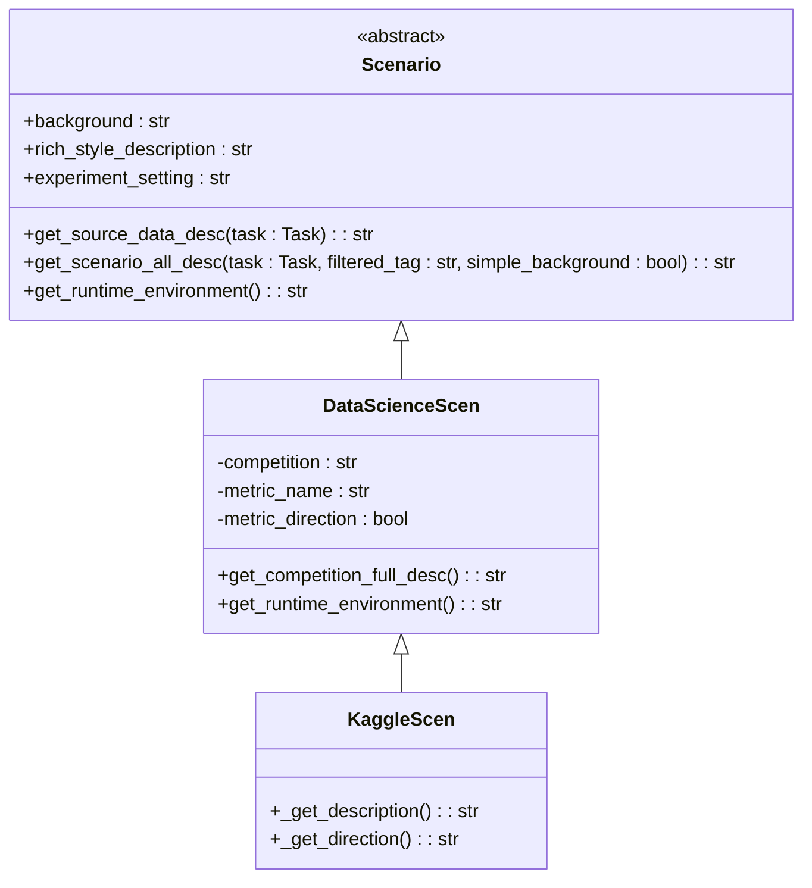
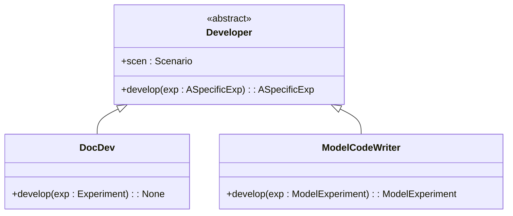
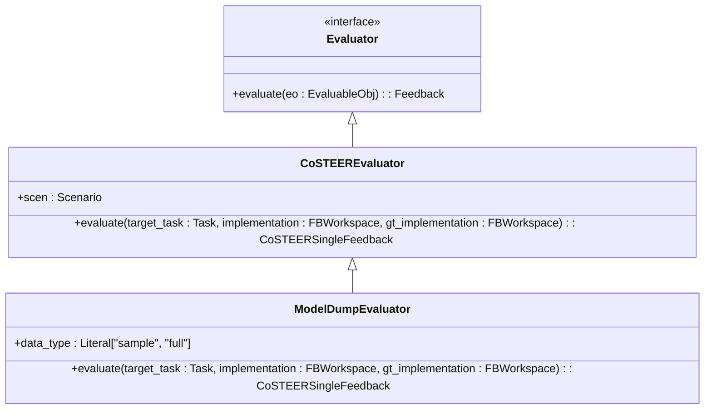
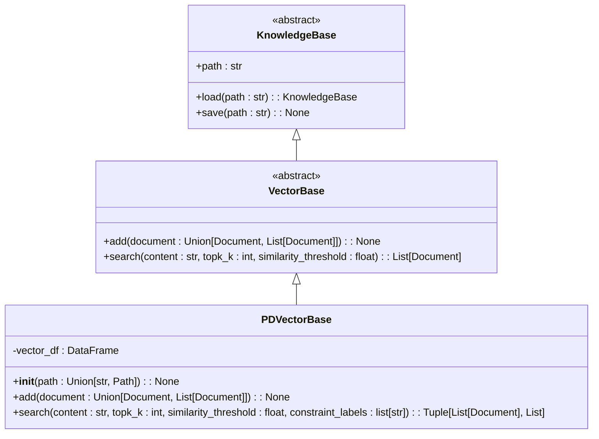
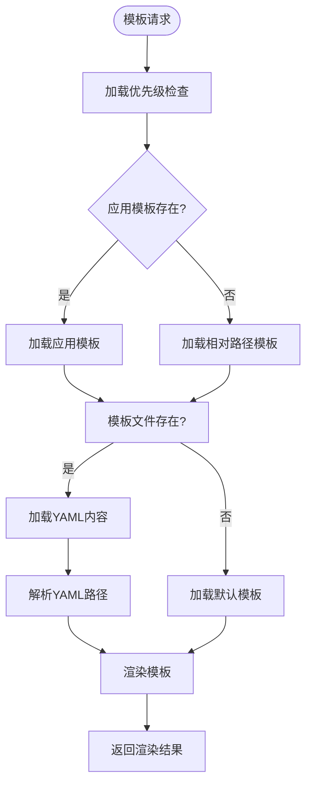

# 扩展开发

<cite>
**本文档中引用的文件**  
- [scenario.py](file://rdagent/core/scenario.py)
- [developer.py](file://rdagent/core/developer.py)
- [conf.py](file://rdagent/core/conf.py)
- [vector_base.py](file://rdagent/components/knowledge_management/vector_base.py)
- [prompts.py](file://rdagent/core/prompts.py)
- [tpl.py](file://rdagent/utils/agent/tpl.py)
- [__init__.py](file://rdagent/scenarios/data_science/scen/__init__.py)
- [eval.py](file://rdagent/components/coder/data_science/share/eval.py)
- [doc.py](file://rdagent/components/coder/data_science/share/doc.py)
</cite>

## 目录
1. [自定义场景开发](#自定义场景开发)
2. [组件扩展](#组件扩展)
3. [知识管理系统扩展](#知识管理系统扩展)
4. [提示模板定制](#提示模板定制)
5. [插件注册与配置加载](#插件注册与配置加载)
6. [医疗影像分析场景示例](#医疗影像分析场景示例)

## 自定义场景开发

RD-Agent框架通过`Scenario`基类支持自定义场景开发。开发者需要继承`rdagent.core.scenario.Scenario`抽象基类并实现必要方法来创建新的业务场景。



**图源**
- [scenario.py](file://rdagent/core/scenario.py#L1-L64)
- [__init__.py](file://rdagent/scenarios/data_science/scen/__init__.py#L1-L289)

### 场景基类接口

`Scenario`抽象基类定义了以下必须实现的属性和方法：

- **background**: 场景背景信息，描述业务上下文
- **rich_style_description**: 富文本格式的场景描述
- **get_scenario_all_desc()**: 组合所有描述信息的综合方法
- **get_runtime_environment()**: 获取运行环境信息
- **get_source_data_desc()**: 获取源数据描述

开发者需要根据具体业务需求实现这些接口。例如，`DataScienceScen`类在初始化时会准备数据、收集竞赛信息，并通过LLM分析竞赛描述来提取任务类型、数据类型、评估指标等关键信息。

### 场景注册机制

新创建的场景类需要通过配置系统进行注册。框架使用基于YAML的配置文件和模板系统来管理场景配置。场景的配置信息存储在`rdagent/core/conf.py`中，通过`RDAgentSettings`类进行管理。

**节源**
- [scenario.py](file://rdagent/core/scenario.py#L1-L64)
- [conf.py](file://rdagent/core/conf.py#L1-L109)

## 组件扩展

RD-Agent框架支持通过继承基类的方式创建新的组件类型，如自定义Coder或Evaluator。核心组件基类位于`rdagent.core`模块中。

### 开发者组件

`Developer`基类是所有开发者组件的抽象基类，定义了`develop()`方法作为核心接口：



**图源**
- [developer.py](file://rdagent/core/developer.py#L1-L34)
- [doc.py](file://rdagent/components/coder/data_science/share/doc.py#L1-L37)

`DocDev`类是一个具体的开发者实现，负责为工作空间编写文档。它通过调用LLM API生成README.md文件，展示了如何利用框架提供的工具进行组件开发。

### 评估器组件

评估器组件用于评估代码实现的质量，继承自`Evaluator`基类。以`ModelDumpEvaluator`为例，它检查模型是否正确导出：



**图源**
- [evaluation.py](file://rdagent/core/evaluation.py#L1-L56)
- [eval.py](file://rdagent/components/coder/data_science/share/eval.py#L1-L176)

**节源**
- [developer.py](file://rdagent/core/developer.py#L1-L34)
- [eval.py](file://rdagent/components/coder/data_science/share/eval.py#L1-L176)

## 知识管理系统扩展

RD-Agent的知识管理系统基于向量数据库实现，支持通过继承`VectorBase`基类进行扩展。

### 向量数据库实现

`PDVectorBase`类使用Pandas实现了向量存储和查询功能：



**图源**
- [vector_base.py](file://rdagent/components/knowledge_management/vector_base.py#L1-L208)

### 知识提取规则

知识提取规则可以通过重写`KnowledgeMetaData`类的方法进行扩展。该类负责处理内容分块、嵌入生成等操作：

- `split_into_trunk()`: 将内容分割成指定大小的块
- `create_embedding()`: 为内容创建嵌入向量
- `from_dict()`: 从字典加载元数据

开发者可以继承`KnowledgeMetaData`类并重写这些方法来实现特定领域的知识提取规则。

**节源**
- [vector_base.py](file://rdagent/components/knowledge_management/vector_base.py#L1-L208)

## 提示模板定制

RD-Agent使用基于YAML的模板系统支持提示模板的定制，允许进行多语言或特定领域优化。

### 模板系统架构

模板系统通过`RDAT`类实现，支持多级模板加载和继承：



**图源**
- [tpl.py](file://rdagent/utils/agent/tpl.py#L1-L148)

### 模板加载机制

模板加载遵循以下优先级顺序：
1. 应用模板路径（由`app_tpl`配置指定）
2. 调用者目录的相对路径模板
3. RD-Agent包目录的默认模板

这种机制允许开发者在不修改核心代码的情况下覆盖默认模板，实现特定领域的优化。

**节源**
- [tpl.py](file://rdagent/utils/agent/tpl.py#L1-L148)
- [conf.py](file://rdagent/core/conf.py#L1-L109)

## 插件注册与配置加载

RD-Agent的插件注册和配置加载机制基于Python的模块导入系统和配置管理。

### 配置加载顺序

配置加载遵循以下顺序：
1. 环境变量
2. `.env`文件
3. YAML配置文件
4. 默认配置值

`RDAgentSettings`类使用`ExtendedBaseSettings`基类实现了配置的层级覆盖机制，确保更具体的配置可以覆盖通用配置。

### 插件注册流程

插件注册主要通过以下方式实现：
1. 在相应模块目录中创建新的Python文件
2. 继承对应的基类并实现必要方法
3. 在配置文件中添加插件引用
4. 系统启动时自动发现和加载插件

框架使用`import_class`工具函数动态导入类，支持灵活的插件架构。

**节源**
- [conf.py](file://rdagent/core/conf.py#L1-L109)
- [utils.py](file://rdagent/core/utils.py#L1-L210)

## 医疗影像分析场景示例

以下是一个新增医疗影像分析场景的完整示例：

```python
from rdagent.core.scenario import Scenario
from rdagent.core.experiment import Task

class MedicalImageAnalysisScen(Scenario):
    """医疗影像分析场景"""
    
    def __init__(self, dataset_name: str):
        self.dataset_name = dataset_name
        self._load_dataset_info()
        
    def _load_dataset_info(self):
        """加载数据集信息"""
        # 实现数据集信息加载逻辑
        pass
        
    @property
    def background(self) -> str:
        return f"医疗影像分析场景，数据集：{self.dataset_name}"
        
    @property
    def rich_style_description(self) -> str:
        return f"医学影像分析：{self.dataset_name}"
        
    def get_scenario_all_desc(self, task: Task = None) -> str:
        # 实现场景描述逻辑
        pass
        
    def get_runtime_environment(self) -> str:
        # 返回运行环境信息
        return "Medical Imaging Environment with DICOM support"
        
    def get_source_data_desc(self, task: Task = None) -> str:
        # 返回源数据描述
        return f"Medical images in {self.dataset_name} dataset"
```

此示例展示了如何创建一个专门用于医疗影像分析的新场景，包括必要的方法实现和属性定义。

**节源**
- [scenario.py](file://rdagent/core/scenario.py#L1-L64)
- [__init__.py](file://rdagent/scenarios/data_science/scen/__init__.py#L1-L289)