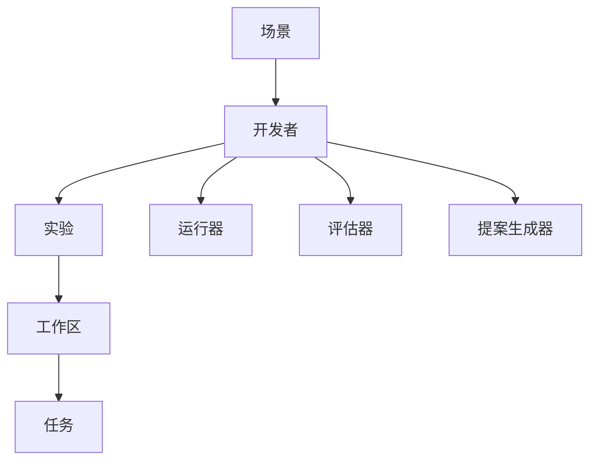
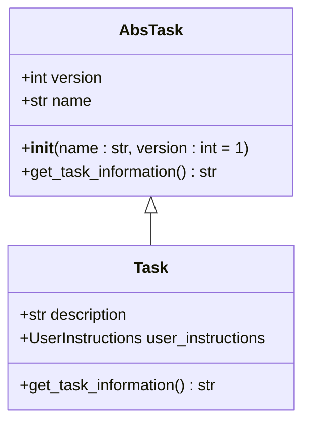
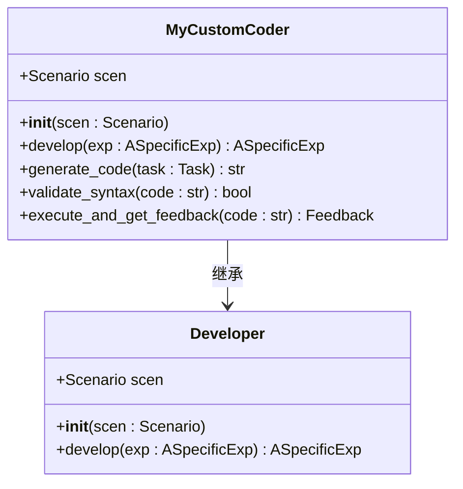
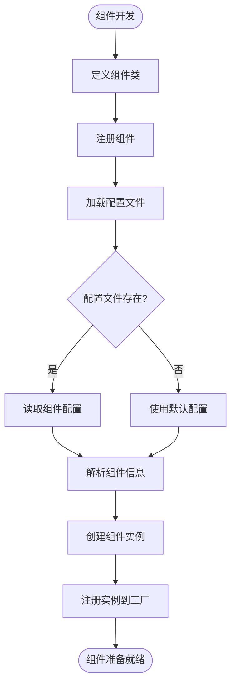
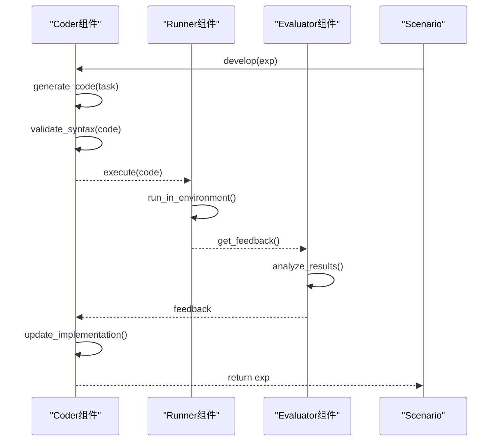

# 新组件开发

<cite>
**本文档引用的文件**  
- [developer.py](file://rdagent/core/developer.py)
- [scenario.py](file://rdagent/core/scenario.py)
- [experiment.py](file://rdagent/core/experiment.py)
- [CoSTEER.py](file://rdagent/components/coder/CoSTEER/__init__.py)
- [factor.py](file://rdagent/components/coder/factor_coder/factor.py)
- [runner.py](file://rdagent/components/runner/__init__.py)
- [proposal.py](file://rdagent/components/proposal/__init__.py)
- [tpl.py](file://rdagent/utils/agent/tpl.py)
- [task_loader.py](file://rdagent/components/loader/task_loader.py)
- [data_science\scen\__init__.py](file://rdagent/scenarios/data_science/scen/__init__.py)
</cite>

## 目录
1. [引言](#引言)
2. [组件系统架构](#组件系统架构)
3. [核心接口规范](#核心接口规范)
4. [自定义Coder实现示例](#自定义coder实现示例)
5. [工厂模式与动态加载](#工厂模式与动态加载)
6. [组件间通信机制](#组件间通信机制)
7. [配置与模板系统](#配置与模板系统)
8. [错误处理与反馈](#错误处理与反馈)
9. [最佳实践与注意事项](#最佳实践与注意事项)
10. [结论](#结论)

## 引言
RD-Agent的组件系统采用模块化设计，允许开发者通过实现特定接口来扩展功能。本指南将详细介绍如何创建新的Coder、Runner、Evaluator或Proposal生成器组件，确保它们能够被Scenario动态加载并与其他组件正确交互。我们将重点介绍组件接口规范、工厂模式集成方式以及组件间通信机制。

## 组件系统架构
RD-Agent的组件系统基于面向对象的设计模式，通过继承和多态实现组件的可扩展性。核心架构包括开发者（Developer）、实验（Experiment）、工作区（Workspace）和场景（Scenario）等关键组件。



**图源**  
- [scenario.py](file://rdagent/core/scenario.py)
- [developer.py](file://rdagent/core/developer.py)
- [experiment.py](file://rdagent/core/experiment.py)

**本节来源**  
- [scenario.py](file://rdagent/core/scenario.py#L1-L65)
- [developer.py](file://rdagent/core/developer.py#L1-L35)

## 核心接口规范
RD-Agent的组件系统基于抽象基类定义了统一的接口规范。所有自定义组件都必须遵循这些接口，以确保与核心框架的兼容性。

### 开发者接口
所有Coder组件都必须继承`Developer`类并实现`develop`方法。该方法负责生成或修改实验，是组件的核心逻辑入口。

```python
class Developer(ABC, Generic[ASpecificExp]):
    def __init__(self, scen: Scenario) -> None:
        self.scen: Scenario = scen

    @abstractmethod
    def develop(self, exp: ASpecificExp) -> ASpecificExp:
        """
        开发者接口的核心方法
        - 参数: exp - 要开发的实验
        - 返回: 修改后的实验
        - 注意: 应就地修改exp而不是返回新实例
        """
        error_message = "generate method is not implemented."
        raise NotImplementedError(error_message)
```

### 任务接口
任务类必须继承`AbsTask`或`Task`基类，实现`get_task_information`方法以提供任务的唯一标识信息。



**图源**  
- [experiment.py](file://rdagent/core/experiment.py#L1-L50)

**本节来源**  
- [developer.py](file://rdagent/core/developer.py#L1-L35)
- [experiment.py](file://rdagent/core/experiment.py#L1-L50)

## 自定义Coder实现示例
以下是一个自定义Coder的实现示例，展示了如何创建一个继承自CoSTEER的Coder类，覆盖代码生成、语法验证和执行反馈等关键环节。

### 基础Coder类结构


**图源**  
- [CoSTEER.py](file://rdagent/components/coder/CoSTEER/__init__.py)
- [developer.py](file://rdagent/core/developer.py)

### 实现步骤
1. **创建任务类**：定义一个继承自`CoSTEERTask`的特定任务类
2. **实现Coder类**：创建继承自`Developer`的Coder类
3. **重写develop方法**：实现核心的代码生成逻辑
4. **集成验证机制**：添加语法验证和执行反馈处理

```python
from rdagent.components.coder.CoSTEER.task import CoSTEERTask
from rdagent.core.developer import Developer
from rdagent.core.experiment import Experiment

class MyTask(CoSTEERTask):
    def __init__(self, name: str, description: str, *args, **kwargs):
        super().__init__(name=name, description=description, *args, **kwargs)

class MyCustomCoder(Developer):
    def __init__(self, scen: Scenario):
        super().__init__(scen)
    
    def develop(self, exp: Experiment) -> Experiment:
        # 实现代码生成逻辑
        for task in exp.sub_tasks:
            if isinstance(task, MyTask):
                code = self.generate_code(task)
                if self.validate_syntax(code):
                    feedback = self.execute_and_get_feedback(code)
                    # 处理反馈并更新实验
                    exp.feedback = feedback
        return exp
    
    def generate_code(self, task: MyTask) -> str:
        # 生成代码的逻辑
        pass
    
    def validate_syntax(self, code: str) -> bool:
        # 语法验证逻辑
        pass
    
    def execute_and_get_feedback(self, code: str) -> Feedback:
        # 执行代码并获取反馈
        pass
```

**本节来源**  
- [CoSTEER.py](file://rdagent/components/coder/CoSTEER/__init__.py)
- [factor.py](file://rdagent/components/coder/factor_coder/factor.py)
- [experiment.py](file://rdagent/core/experiment.py)

## 工厂模式与动态加载
RD-Agent使用工厂模式和动态加载机制来管理组件的创建和注册。这种设计模式允许系统在运行时动态加载和实例化组件。

### 组件注册机制
系统通过配置文件和装饰器模式实现组件的自动注册。开发者可以通过简单的配置将新组件集成到系统中。



### 动态加载实现
```python
from rdagent.core.scenario import Scenario
from rdagent.utils.agent.tpl import T

class ComponentFactory:
    _components = {}
    
    @classmethod
    def register(cls, name: str, component_class: type):
        """注册组件"""
        cls._components[name] = component_class
    
    @classmethod
    def create(cls, name: str, scen: Scenario, **kwargs):
        """创建组件实例"""
        if name not in cls._components:
            raise ValueError(f"Unknown component: {name}")
        return cls._components[name](scen, **kwargs)

# 使用模板系统动态加载组件
def load_component_from_template(component_name: str, scen: Scenario):
    """从模板加载组件"""
    try:
        # 使用模板系统渲染组件配置
        config = T(f"components.{component_name}.conf").r()
        # 解析配置并创建组件
        component_class = globals()[config["class_name"]]
        return ComponentFactory.create(component_class.__name__, scen)
    except Exception as e:
        logger.error(f"Failed to load component {component_name}: {e}")
        raise
```

**本节来源**  
- [tpl.py](file://rdagent/utils/agent/tpl.py)
- [scenario.py](file://rdagent/core/scenario.py)
- [task_loader.py](file://rdagent/components/loader/task_loader.py)

## 组件间通信机制
RD-Agent的组件通过标准化的消息传递和共享状态机制进行通信。这种设计确保了组件间的松耦合和高内聚。

### 通信协议
组件间通信遵循以下协议：
1. **消息格式**：使用JSON格式传递结构化数据
2. **错误处理**：统一的异常处理机制
3. **状态同步**：通过共享工作区同步状态



### 共享工作区模式
```python
class FBWorkspace(Workspace):
    """
    文件基础工作区
    - 存储任务实现的相关元素
    - 包括数据、代码和输出
    """
    
    def __init__(self, *args, **kwargs):
        super().__init__(*args, **kwargs)
        self.file_dict: dict[str, Any] = {}
        self.workspace_path: Path = RD_AGENT_SETTINGS.workspace_path / uuid.uuid4().hex
    
    @property
    def all_codes(self) -> str:
        """获取工作区中所有代码文件"""
        filtered_dict = {k: v for k, v in self.file_dict.items() if k.endswith(".py") and "test" not in k}
        return self._format_code_dict(filtered_dict)
    
    def inject_files(self, **files: str):
        """注入文件到工作区"""
        self.file_dict.update(files)
    
    def execute(self, *args, **kwargs) -> object | None:
        """执行工作区中的代码"""
        # 执行逻辑
        pass
```

**本节来源**  
- [experiment.py](file://rdagent/core/experiment.py#L1-L200)
- [runner.py](file://rdagent/components/runner/__init__.py)
- [proposal.py](file://rdagent/components/proposal/__init__.py)

## 配置与模板系统
RD-Agent使用YAML配置文件和Jinja2模板系统来管理组件配置和代码生成。这种设计分离了配置和代码，提高了系统的可维护性。

### 配置文件结构
```yaml
# components/coder/data_science/ensemble/conf.py
# 集成组件配置文件
# 目前为空，因为不需要特定配置
```

### 模板系统
```python
from rdagent.utils.agent.tpl import T

class TemplateRenderer:
    """
    模板渲染器
    使用Jinja2模板系统渲染配置和代码
    """
    
    def render_template(self, template_uri: str, **context) -> str:
        """
        渲染模板
        - template_uri: 模板URI
        - context: 渲染上下文
        """
        return T(template_uri).r(**context)
    
    def include_template(self, parent_template: str, child_template: str) -> str:
        """
        在父模板中包含子模板
        支持跨模块模板引用
        """
        parent = T(parent_template).r()
        child = T(child_template).r()
        return parent.replace("<!-- INCLUDE -->", child)
```

**本节来源**  
- [tpl.py](file://rdagent/utils/agent/tpl.py)
- [conf.py](file://rdagent/components/coder/data_science/ensemble/conf.py)
- [data_science\scen\__init__.py](file://rdagent/scenarios/data_science/scen/__init__.py)

## 错误处理与反馈
RD-Agent的组件系统实现了完善的错误处理和反馈机制，确保系统在遇到问题时能够优雅地恢复。

### 错误处理策略
```python
from rdagent.core.exception import CodeFormatError, CustomRuntimeError, NoOutputError

class ErrorHandlingMixin:
    """
    错误处理混入类
    提供统一的错误处理接口
    """
    
    def handle_code_format_error(self, error_msg: str):
        """处理代码格式错误"""
        logger.error(f"Code format error: {error_msg}")
        raise CodeFormatError(error_msg)
    
    def handle_runtime_error(self, error_msg: str):
        """处理运行时错误"""
        logger.error(f"Runtime error: {error_msg}")
        raise CustomRuntimeError(error_msg)
    
    def handle_no_output_error(self, error_msg: str):
        """处理无输出错误"""
        logger.error(f"No output error: {error_msg}")
        raise NoOutputError(error_msg)
```

### 反馈机制
```python
class FeedbackProcessor:
    """
    反馈处理器
    处理来自Runner和Evaluator的反馈
    """
    
    def process_feedback(self, feedback: str) -> dict:
        """
        处理反馈信息
        - 解析反馈内容
        - 提取关键信息
        - 生成改进建议
        """
        # 反馈处理逻辑
        pass
    
    def generate_improvement_suggestions(self, feedback: dict) -> list:
        """
        基于反馈生成改进建议
        """
        # 生成建议逻辑
        pass
```

**本节来源**  
- [factor.py](file://rdagent/components/coder/factor_coder/factor.py#L1-L232)
- [experiment.py](file://rdagent/core/experiment.py)
- [core/exception.py](file://rdagent/core/exception.py)

## 最佳实践与注意事项
在开发RD-Agent组件时，应遵循以下最佳实践以确保代码质量和系统稳定性。

### 设计原则
1. **单一职责原则**：每个组件应只负责一个特定功能
2. **开闭原则**：对扩展开放，对修改关闭
3. **依赖倒置原则**：依赖抽象而不是具体实现

### 性能优化
- **缓存机制**：使用`@cache_with_pickle`装饰器缓存计算结果
- **异步处理**：对于耗时操作，考虑使用异步处理
- **资源管理**：及时释放文件锁和内存资源

### 测试策略
1. **单元测试**：为每个组件编写单元测试
2. **集成测试**：测试组件间的交互
3. **回归测试**：确保新功能不影响现有功能

```python
# 示例：缓存机制的使用
from rdagent.core.utils import cache_with_pickle

class MyComponent:
    @cache_with_pickle(hash_func)
    def expensive_operation(self, data_type: str = "Debug") -> Tuple[str, pd.DataFrame]:
        """
        耗时操作的缓存实现
        """
        # 耗时操作逻辑
        pass
```

**本节来源**  
- [factor.py](file://rdagent/components/coder/factor_coder/factor.py)
- [core/utils.py](file://rdagent/core/utils.py)
- [test/utils/test_misc.py](file://test/utils/test_misc.py)

## 结论
通过遵循本文档中的指南，开发者可以成功扩展RD-Agent的组件系统。关键要点包括：
- 严格遵守核心接口规范
- 正确实现工厂模式和动态加载
- 遵循组件间通信协议
- 使用配置和模板系统管理组件行为
- 实现完善的错误处理和反馈机制

遵循这些最佳实践将确保新组件与现有系统无缝集成，同时保持代码的可维护性和可扩展性。