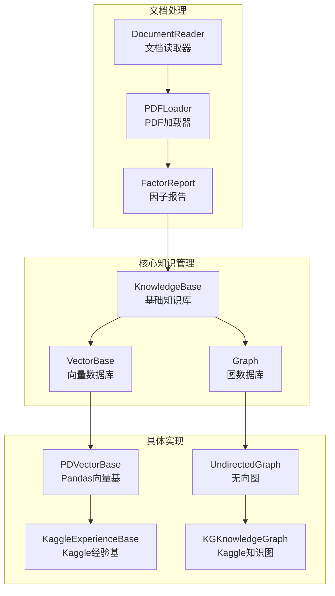
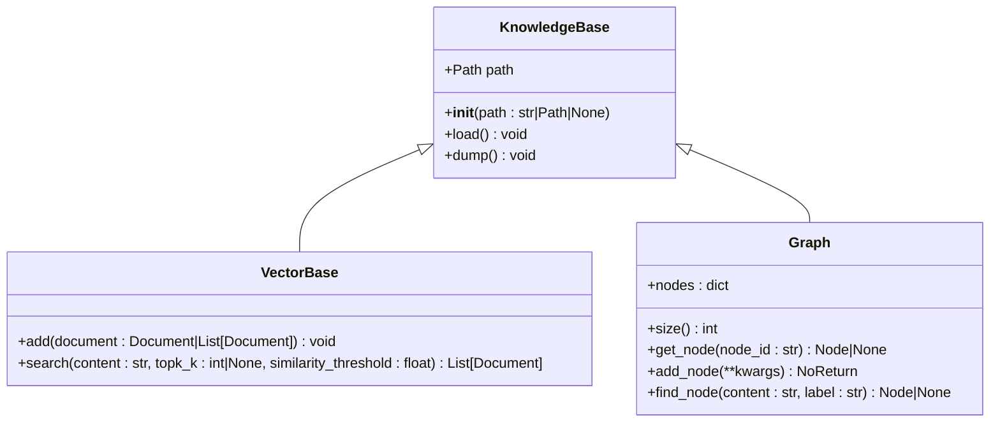
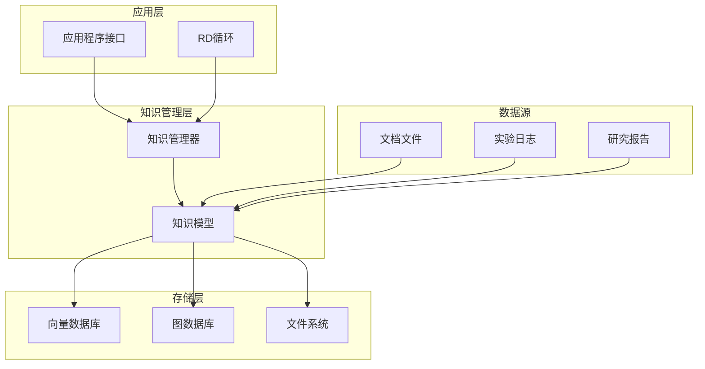
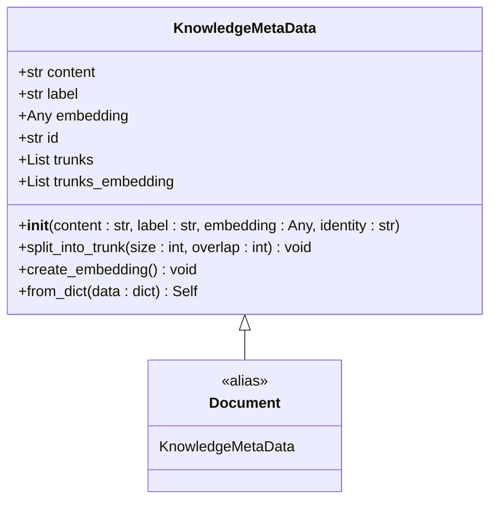
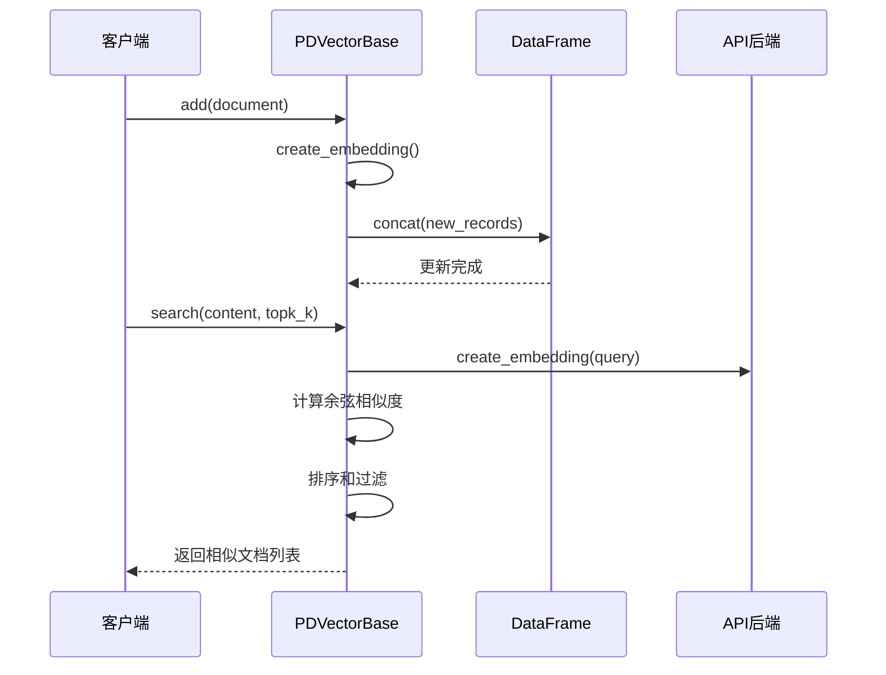
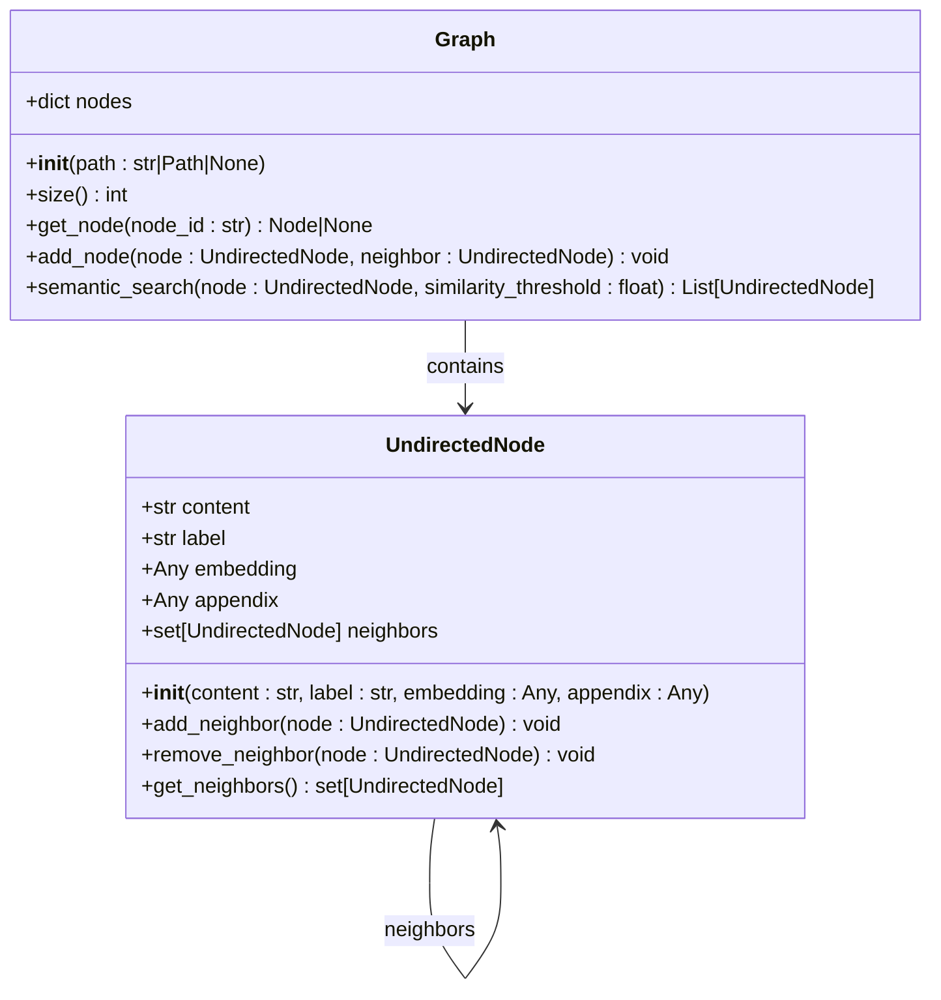
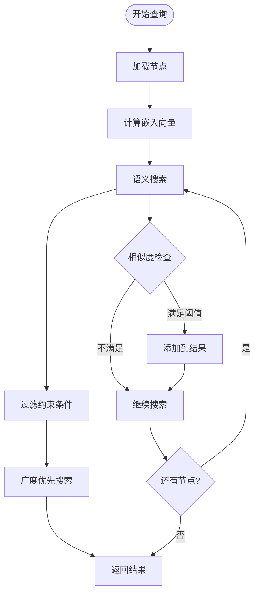
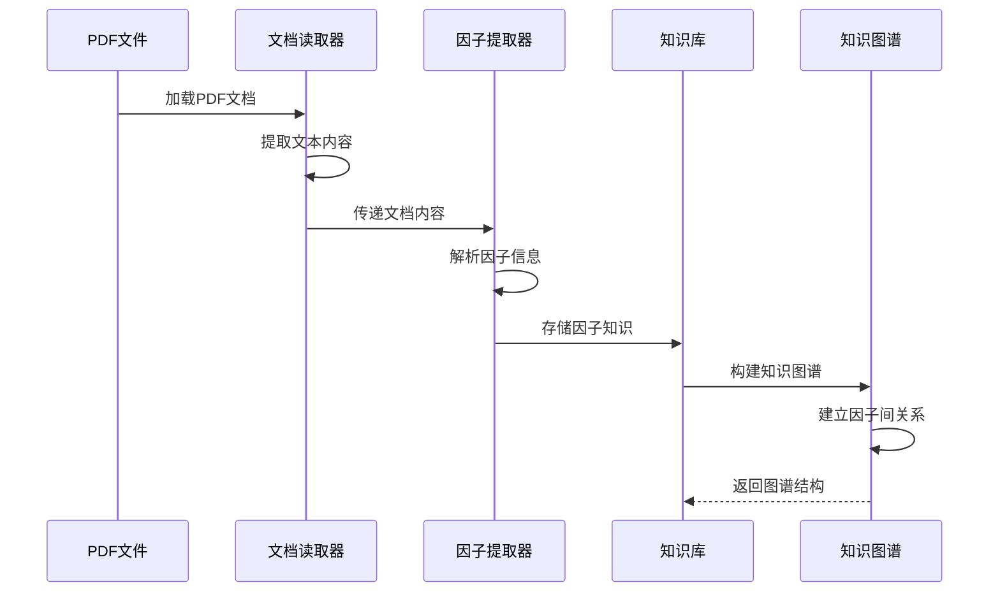

# 知识管理扩展

<cite>
**本文档引用的文件**
- [knowledge_base.py](file://rdagent/core/knowledge_base.py)
- [vector_base.py](file://rdagent/components/knowledge_management/vector_base.py)
- [graph.py](file://rdagent/components/knowledge_management/graph.py)
- [factor_from_report.py](file://rdagent/app/qlib_rd_loop/factor_from_report.py)
- [pdf_loader.py](file://rdagent/scenarios/qlib/experiment/factor_experiment_loader/pdf_loader.py)
- [document_reader.py](file://rdagent/components/document_reader/document_reader.py)
- [kaggle_vector_base.py](file://rdagent/scenarios/kaggle/knowledge_management/vector_base.py)
- [kaggle_graph.py](file://rdagent/scenarios/kaggle/knowledge_management/graph.py)
- [prompts.yaml](file://rdagent/scenarios/qlib/experiment/prompts.yaml)
- [kaggle_prompts.yaml](file://rdagent/scenarios/kaggle/knowledge_management/prompts.yaml)
</cite>

## 目录
1. [简介](#简介)
2. [项目结构概览](#项目结构概览)
3. [核心组件分析](#核心组件分析)
4. [架构概览](#架构概览)
5. [详细组件分析](#详细组件分析)
6. [知识提取规则扩展](#知识提取规则扩展)
7. [向量数据库集成](#向量数据库集成)
8. [图数据库集成](#图数据库集成)
9. [实际案例：QLib金融报告解析](#实际案例qlib金融报告解析)
10. [知识更新策略](#知识更新策略)
11. [检索优化技巧](#检索优化技巧)
12. [故障排除指南](#故障排除指南)
13. [总结](#总结)

## 简介

RD-Agent是一个基于人工智能的自动化研发平台，其知识管理系统是整个系统的核心组件之一。该系统通过KnowledgeBase类提供了强大的知识持久化机制，支持向量数据库和图数据库两种存储后端，并能够从各种来源（如实验日志、外部文档）中提取有价值的信息。

本文档将详细介绍如何扩展RD-Agent的知识管理系统，包括：
- KnowledgeBase类的持久化机制与数据结构设计
- 新知识提取规则的添加方法
- 向量数据库和图数据库的集成方案
- 基于QLib金融报告解析的实际案例
- 知识更新策略与检索优化技巧

## 项目结构概览

RD-Agent的知识管理系统采用模块化设计，主要包含以下核心模块：



**图表来源**
- [knowledge_base.py](file://rdagent/core/knowledge_base.py#L1-L28)
- [vector_base.py](file://rdagent/components/knowledge_management/vector_base.py#L1-L50)
- [graph.py](file://rdagent/components/knowledge_management/graph.py#L1-L50)

## 核心组件分析

### KnowledgeBase类

KnowledgeBase是整个知识管理系统的基础类，提供了基本的持久化机制：



**图表来源**
- [knowledge_base.py](file://rdagent/core/knowledge_base.py#L8-L27)
- [vector_base.py](file://rdagent/components/knowledge_management/vector_base.py#L68-L83)
- [graph.py](file://rdagent/components/knowledge_management/graph.py#L50-L80)

**章节来源**
- [knowledge_base.py](file://rdagent/core/knowledge_base.py#L1-L28)
- [vector_base.py](file://rdagent/components/knowledge_management/vector_base.py#L1-L209)
- [graph.py](file://rdagent/components/knowledge_management/graph.py#L1-L498)

## 架构概览

RD-Agent的知识管理系统采用分层架构设计，支持多种存储后端和查询方式：



## 详细组件分析

### 向量数据库组件

#### KnowledgeMetaData类

KnowledgeMetaData是向量数据库中的基本单元，包含了内容、标签、嵌入向量等信息：



**图表来源**
- [vector_base.py](file://rdagent/components/knowledge_management/vector_base.py#L15-L50)

#### PDVectorBase类

PDVectorBase是基于Pandas的向量数据库实现，提供了高效的向量存储和查询功能：



**图表来源**
- [vector_base.py](file://rdagent/components/knowledge_management/vector_base.py#L90-L150)

**章节来源**
- [vector_base.py](file://rdagent/components/knowledge_management/vector_base.py#L1-L209)

### 图数据库组件

#### UndirectedNode类

UndirectedNode表示图数据库中的节点，支持邻居关系的建立和维护：



**图表来源**
- [graph.py](file://rdagent/components/knowledge_management/graph.py#L15-L50)
- [graph.py](file://rdagent/components/knowledge_management/graph.py#L50-L100)

#### UndirectedGraph类

UndirectedGraph实现了完整的图数据库功能，支持语义搜索和路径查询：



**图表来源**
- [graph.py](file://rdagent/components/knowledge_management/graph.py#L200-L300)

**章节来源**
- [graph.py](file://rdagent/components/knowledge_management/graph.py#L1-L498)

## 知识提取规则扩展

### 添加新的知识提取规则

要添加新的知识提取规则，需要遵循以下步骤：

#### 1. 创建自定义文档处理器

```python
# 示例：创建PDF文档处理器
class CustomPDFProcessor:
    def __init__(self, path: str):
        self.path = path
        self.content = {}
    
    def process(self) -> dict:
        # 实现自定义的PDF处理逻辑
        pass
    
    def extract_knowledge(self) -> list:
        # 提取特定领域的知识
        pass
```

#### 2. 扩展KnowledgeBase类

```python
# 示例：扩展KnowledgeBase以支持新格式
class ExtendedKnowledgeBase(KnowledgeBase):
    def __init__(self, path: str | Path | None = None):
        super().__init__(path)
        self.custom_extractors = {}
    
    def register_extractor(self, format_type: str, extractor_func):
        """注册新的知识提取器"""
        self.custom_extractors[format_type] = extractor_func
    
    def extract_from_custom_format(self, content: str, format_type: str):
        """从自定义格式提取知识"""
        if format_type in self.custom_extractors:
            return self.custom_extractors[format_type](content)
        raise ValueError(f"Unsupported format: {format_type}")
```

#### 3. 集成到现有流程

```python
# 在文档读取器中集成新提取器
def load_and_process_custom_format(path: str) -> dict:
    processor = CustomPDFProcessor(path)
    content_dict = processor.process()
    
    # 使用扩展的知识库进行知识提取
    kb = ExtendedKnowledgeBase()
    kb.register_extractor("custom_format", processor.extract_knowledge)
    
    for doc_name, doc_content in content_dict.items():
        kb.extract_from_custom_format(doc_content, "custom_format")
    
    return content_dict
```

**章节来源**
- [document_reader.py](file://rdagent/components/document_reader/document_reader.py#L1-L122)
- [pdf_loader.py](file://rdagent/scenarios/qlib/experiment/factor_experiment_loader/pdf_loader.py)

## 向量数据库集成

### 替换默认存储后端

#### 1. 实现新的向量数据库接口

```python
# 示例：实现Neo4j向量数据库接口
class Neo4jVectorBase(VectorBase):
    def __init__(self, uri: str, user: str, password: str):
        self.driver = GraphDatabase.driver(uri, auth=(user, password))
        super().__init__(None)
    
    def add(self, document: Union[Document, List[Document]]):
        """添加文档到Neo4j"""
        with self.driver.session() as session:
            if isinstance(document, Document):
                session.write_transaction(self._create_document, document)
            else:
                for doc in document:
                    session.write_transaction(self._create_document, doc)
    
    def search(self, content: str, topk_k: int = None, similarity_threshold: float = 0):
        """从Neo4j搜索相似文档"""
        query_doc = Document(content=content)
        query_doc.create_embedding()
        
        with self.driver.session() as session:
            results = session.read_transaction(
                self._search_similar_documents, 
                query_doc.embedding, 
                topk_k, 
                similarity_threshold
            )
            return results
    
    @staticmethod
    def _create_document(tx, document: Document):
        tx.run("""
        CREATE (d:Document {
            id: $id,
            content: $content,
            label: $label,
            embedding: $embedding
        })
        """, id=document.id, content=document.content, 
               label=document.label, embedding=document.embedding)
    
    @staticmethod
    def _search_similar_documents(tx, query_embedding, topk_k, threshold):
        # 实现Neo4j向量相似度查询
        pass
```

#### 2. 配置向量数据库

```python
# 配置文件示例
VECTOR_DB_CONFIG = {
    "default": {
        "type": "pandas",
        "path": "data/vector_base.pkl"
    },
    "neo4j": {
        "type": "neo4j",
        "uri": "bolt://localhost:7687",
        "credentials": {
            "user": "neo4j",
            "password": "password"
        }
    },
    "milvus": {
        "type": "milvus",
        "host": "localhost",
        "port": "19530",
        "collection": "knowledge_vectors"
    }
}

# 动态选择向量数据库
def create_vector_base(config: dict):
    db_type = config["type"]
    
    if db_type == "pandas":
        return PDVectorBase(config.get("path"))
    elif db_type == "neo4j":
        return Neo4jVectorBase(
            config["uri"], 
            config["credentials"]["user"],
            config["credentials"]["password"]
        )
    elif db_type == "milvus":
        return MilvusVectorBase(config)
    else:
        raise ValueError(f"Unsupported vector database: {db_type}")
```

**章节来源**
- [vector_base.py](file://rdagent/components/knowledge_management/vector_base.py#L68-L150)

## 图数据库集成

### 集成新的图数据库

#### 1. 实现Graph接口

```python
# 示例：实现ArangoDB图数据库
class ArangoDBGraph(Graph):
    def __init__(self, host: str, port: int, dbname: str, username: str, password: str):
        self.client = arango.ArangoClient(hosts=f"http://{host}:{port}")
        self.db = self.client.db(dbname, username=username, password=password)
        super().__init__(None)
    
    def add_node(self, node: UndirectedNode, neighbor: UndirectedNode = None):
        """在ArangoDB中添加节点和边"""
        # 添加节点
        self.db.collection('nodes').insert({
            '_key': node.id,
            'content': node.content,
            'label': node.label,
            'embedding': node.embedding
        })
        
        # 添加邻居关系
        if neighbor:
            self.db.collection('edges').insert({
                '_from': f'nodes/{node.id}',
                '_to': f'nodes/{neighbor.id}'
            })
    
    def semantic_search(self, node: UndirectedNode, similarity_threshold: float = 0.0):
        """使用ArangoDB向量索引进行语义搜索"""
        # 实现向量相似度查询
        pass
    
    def get_nodes_within_steps(self, start_node: UndirectedNode, steps: int = 1):
        """使用AQL查询获取指定步数内的节点"""
        query = """
        FOR node IN GRAPH_TRAVERSAL(
            'knowledge_graph', 
            @startNodeId, 
            'any', 
            {minDepth: @minSteps, maxDepth: @maxSteps}
        )
        RETURN node.vertex
        """
        
        cursor = self.db.aql.execute(query, bind_vars={
            'startNodeId': start_node.id,
            'minSteps': 1,
            'maxSteps': steps
        })
        
        return [self.get_node(record['_key']) for record in cursor]
```

#### 2. 图数据库配置

```python
# 图数据库配置
GRAPH_DB_CONFIG = {
    "neo4j": {
        "driver": "neo4j",
        "uri": "bolt://localhost:7687",
        "auth": ["username", "password"]
    },
    "arangodb": {
        "driver": "arangodb",
        "host": "localhost",
        "port": 8529,
        "database": "knowledge_graph",
        "credentials": {
            "username": "root",
            "password": "password"
        }
    },
    "tigergraph": {
        "driver": "tigergraph",
        "host": "localhost",
        "port": 9000,
        "graph": "KnowledgeGraph"
    }
}

# 创建图数据库实例
def create_graph_database(config: dict):
    driver = config["driver"]
    
    if driver == "neo4j":
        return Neo4jGraph(
            config["uri"],
            config["auth"][0],
            config["auth"][1]
        )
    elif driver == "arangodb":
        return ArangoDBGraph(
            config["host"],
            config["port"],
            config["database"],
            config["credentials"]["username"],
            config["credentials"]["password"]
        )
    # 其他图数据库...
```

**章节来源**
- [graph.py](file://rdagent/components/knowledge_management/graph.py#L50-L200)

## 实际案例：QLib金融报告解析

### 基于QLib的因子知识图谱构建

#### 1. 文档处理流程



**图表来源**
- [factor_from_report.py](file://rdagent/app/qlib_rd_loop/factor_from_report.py#L50-L100)
- [document_reader.py](file://rdagent/components/document_reader/document_reader.py#L20-L50)

#### 2. 因子知识提取

```python
# 因子知识提取示例
class FactorKnowledgeExtractor:
    def __init__(self):
        self.factor_patterns = {
            "momentum": r"(momentum|动量)",
            "value": r"(value|价值)",
            "growth": r"(growth|增长)",
            "quality": r"(quality|质量)"
        }
    
    def extract_factor_knowledge(self, report_content: str) -> dict:
        """从金融报告中提取因子知识"""
        knowledge = {
            "factors": [],
            "relationships": [],
            "metrics": {}
        }
        
        # 提取因子名称和描述
        for factor_type, pattern in self.factor_patterns.items():
            matches = re.findall(pattern, report_content, re.IGNORECASE)
            if matches:
                knowledge["factors"].append({
                    "type": factor_type,
                    "count": len(matches),
                    "examples": matches[:5]  # 只保留前5个示例
                })
        
        # 提取因子间的相关性
        correlation_patterns = [
            r"correlat(?:ion|e)", 
            r"relationship",
            r"impact"
        ]
        
        for pattern in correlation_patterns:
            correlations = re.findall(pattern, report_content, re.IGNORECASE)
            if correlations:
                knowledge["relationships"].extend(correlations)
        
        return knowledge
    
    def build_factor_graph(self, factor_knowledge: dict) -> UndirectedGraph:
        """构建因子知识图谱"""
        graph = UndirectedGraph()
        
        for factor in factor_knowledge["factors"]:
            node = UndirectedNode(
                content=f"{factor['type']} factor",
                label="factor",
                embedding=self._create_embedding(f"{factor['type']} factor")
            )
            graph.add_node(node)
        
        # 添加因子间的关系
        for rel in factor_knowledge["relationships"]:
            # 这里应该实现更复杂的推理逻辑
            pass
        
        return graph
```

#### 3. 知识库集成

```python
# QLib因子知识库集成
class QLibFactorKnowledgeBase(KnowledgeBase):
    def __init__(self, path: str | Path | None = None):
        super().__init__(path)
        self.factor_graph = UndirectedGraph()
        self.factor_vectors = PDVectorBase()
    
    def add_factor_report(self, report_path: str):
        """添加因子报告到知识库"""
        # 1. 读取和处理PDF报告
        docs_dict = load_and_process_pdfs_by_langchain(report_path)
        report_content = "\n".join(docs_dict.values())
        
        # 2. 提取因子知识
        extractor = FactorKnowledgeExtractor()
        factor_knowledge = extractor.extract_factor_knowledge(report_content)
        
        # 3. 构建知识图谱
        factor_graph = extractor.build_factor_graph(factor_knowledge)
        
        # 4. 存储到知识库
        self.factor_graph = factor_graph
        self.factor_vectors = factor_graph.vector_base
        
        # 5. 持久化
        self.dump()
    
    def search_factors(self, query: str, topk: int = 5):
        """搜索相关因子"""
        # 使用向量搜索找到相似因子
        similar_factors, similarities = self.factor_vectors.search(
            query, topk_k=topk, similarity_threshold=0.7
        )
        
        # 使用图搜索找到相关概念
        query_node = UndirectedNode(content=query)
        related_concepts = self.factor_graph.semantic_search(
            query_node, similarity_threshold=0.7, topk_k=topk
        )
        
        return {
            "vector_search": similar_factors,
            "graph_search": related_concepts,
            "scores": similarities
        }
```

**章节来源**
- [factor_from_report.py](file://rdagent/app/qlib_rd_loop/factor_from_report.py#L1-L178)
- [pdf_loader.py](file://rdagent/scenarios/qlib/experiment/factor_experiment_loader/pdf_loader.py)

## 知识更新策略

### 动态知识更新机制

#### 1. 增量更新策略

```python
# 增量知识更新
class IncrementalKnowledgeUpdater:
    def __init__(self, knowledge_base: KnowledgeBase):
        self.knowledge_base = knowledge_base
        self.last_update_time = datetime.min
    
    def update_knowledge(self, new_sources: list):
        """增量更新知识库"""
        updated_items = []
        
        for source in new_sources:
            # 检查是否需要更新
            if self._needs_update(source):
                updated_item = self._process_new_source(source)
                updated_items.append(updated_item)
        
        if updated_items:
            self._merge_updates(updated_items)
            self.knowledge_base.dump()
            self.last_update_time = datetime.now()
    
    def _needs_update(self, source: dict) -> bool:
        """判断是否需要更新"""
        if 'last_modified' not in source:
            return True
        
        return source['last_modified'] > self.last_update_time
    
    def _process_new_source(self, source: dict):
        """处理新的知识源"""
        # 实现具体的处理逻辑
        pass
    
    def _merge_updates(self, updates: list):
        """合并更新"""
        # 实现合并逻辑
        pass
```

#### 2. 版本控制策略

```python
# 知识版本控制
class KnowledgeVersionControl:
    def __init__(self, knowledge_base: KnowledgeBase):
        self.knowledge_base = knowledge_base
        self.versions = {}
    
    def create_version(self, version_name: str):
        """创建知识库版本"""
        # 备份当前状态
        backup_path = f"backup/{version_name}_{datetime.now().isoformat()}.pkl"
        self.knowledge_base.dump(backup_path)
        
        # 记录版本信息
        self.versions[version_name] = {
            'created_at': datetime.now(),
            'backup_path': backup_path,
            'size': self.knowledge_base.size()
        }
    
    def rollback_to_version(self, version_name: str):
        """回滚到指定版本"""
        if version_name not in self.versions:
            raise ValueError(f"Version {version_name} not found")
        
        version_info = self.versions[version_name]
        self.knowledge_base.load(version_info['backup_path'])
    
    def compare_versions(self, version1: str, version2: str):
        """比较两个版本的差异"""
        # 实现版本比较逻辑
        pass
```

#### 3. 自动化更新触发器

```python
# 自动更新触发器
class KnowledgeUpdateTrigger:
    def __init__(self, polling_interval: int = 3600):
        self.polling_interval = polling_interval
        self.running = False
    
    async def start_auto_update(self, source_dirs: list):
        """启动自动更新"""
        self.running = True
        while self.running:
            await self._check_for_updates(source_dirs)
            await asyncio.sleep(self.polling_interval)
    
    async def _check_for_updates(self, source_dirs: list):
        """检查更新"""
        for source_dir in source_dirs:
            new_files = self._get_new_files(source_dir)
            if new_files:
                await self._process_new_files(new_files)
    
    def _get_new_files(self, source_dir: str) -> list:
        """获取新文件"""
        # 实现文件监控逻辑
        pass
    
    async def _process_new_files(self, new_files: list):
        """处理新文件"""
        # 实现文件处理逻辑
        pass
```

## 检索优化技巧

### 查询性能优化

#### 1. 向量搜索优化

```python
# 向量搜索优化
class OptimizedVectorSearch:
    def __init__(self, vector_base: PDVectorBase):
        self.vector_base = vector_base
        self._build_index()
    
    def _build_index(self):
        """构建向量索引"""
        # 使用FAISS或类似库构建索引
        import faiss
        import numpy as np
        
        embeddings = np.array([
            np.array(doc.embedding) for _, doc in self.vector_base.vector_df.iterrows()
        ])
        
        dimension = embeddings.shape[1]
        self.index = faiss.IndexFlatL2(dimension)
        self.index.add(embeddings.astype('float32'))
    
    def fast_search(self, query_embedding: list, topk: int = 10):
        """快速向量搜索"""
        query = np.array([query_embedding]).astype('float32')
        distances, indices = self.index.search(query, topk)
        
        results = []
        for idx, dist in zip(indices[0], distances[0]):
            row = self.vector_base.vector_df.iloc[idx]
            doc = Document().from_dict(row.to_dict())
            doc.similarity_score = 1 - (dist / 2)  # 转换为相似度
            results.append(doc)
        
        return results
```

#### 2. 图搜索优化

```python
# 图搜索优化
class OptimizedGraphSearch:
    def __init__(self, graph: UndirectedGraph):
        self.graph = graph
        self._optimize_search()
    
    def _optimize_search(self):
        """优化图搜索"""
        # 实现图缓存和预计算
        self._build_shortest_paths_cache()
    
    def _build_shortest_paths_cache(self):
        """构建最短路径缓存"""
        self.path_cache = {}
        for node_id in self.graph.nodes.keys():
            self.path_cache[node_id] = self._compute_shortest_paths(node_id)
    
    def cached_graph_search(self, start_node: UndirectedNode, steps: int):
        """使用缓存的图搜索"""
        if start_node.id in self.path_cache:
            return self.path_cache[start_node.id].get(steps, [])
        
        # 如果缓存中没有，执行普通搜索并更新缓存
        results = self.graph.get_nodes_within_steps(start_node, steps)
        self.path_cache[start_node.id] = {steps: results}
        return results
    
    def hybrid_search(self, query: str, vector_weight: float = 0.7):
        """混合搜索：结合向量搜索和图搜索"""
        # 向量搜索
        vector_results, vector_scores = self.graph.vector_base.search(query, topk_k=20)
        
        # 图搜索
        query_node = UndirectedNode(content=query)
        graph_results = self.graph.semantic_search(query_node, topk_k=20)
        
        # 结合两种结果
        combined_results = self._combine_results(
            vector_results, graph_results, 
            vector_scores, vector_weight
        )
        
        return combined_results
```

#### 3. 缓存策略

```python
# 检索缓存
class RetrievalCache:
    def __init__(self, max_size: int = 1000):
        self.cache = {}
        self.max_size = max_size
        self.access_order = []
    
    def get(self, key: str):
        """获取缓存结果"""
        if key in self.cache:
            # 更新访问顺序
            self.access_order.remove(key)
            self.access_order.append(key)
            return self.cache[key]
        return None
    
    def set(self, key: str, value):
        """设置缓存"""
        if len(self.cache) >= self.max_size:
            # 移除最旧的条目
            oldest_key = self.access_order.pop(0)
            del self.cache[oldest_key]
        
        self.cache[key] = value
        self.access_order.append(key)
    
    def clear(self):
        """清空缓存"""
        self.cache.clear()
        self.access_order.clear()
```

**章节来源**
- [vector_base.py](file://rdagent/components/knowledge_management/vector_base.py#L150-L209)
- [graph.py](file://rdagent/components/knowledge_management/graph.py#L300-L400)

## 故障排除指南

### 常见问题及解决方案

#### 1. 内存不足问题

```python
# 内存管理
class MemoryOptimizedKnowledgeBase(KnowledgeBase):
    def __init__(self, path: str | Path | None = None, max_memory_mb: int = 1024):
        super().__init__(path)
        self.max_memory_mb = max_memory_mb
        self._monitor_memory_usage()
    
    def _monitor_memory_usage(self):
        """监控内存使用情况"""
        import psutil
        import os
        
        process = psutil.Process(os.getpid())
        memory_mb = process.memory_info().rss / 1024 / 1024
        
        if memory_mb > self.max_memory_mb:
            self._trigger_memory_cleanup()
    
    def _trigger_memory_cleanup(self):
        """触发内存清理"""
        # 清理未使用的缓存
        if hasattr(self, 'cache'):
            self.cache.clear()
        
        # 触发垃圾回收
        import gc
        gc.collect()
    
    def add(self, document: Union[Document, List[Document]]):
        """添加文档时检查内存"""
        self._monitor_memory_usage()
        super().add(document)
```

#### 2. 性能问题诊断

```python
# 性能监控
class PerformanceMonitor:
    def __init__(self):
        self.metrics = {}
    
    def measure_search_performance(self, func):
        """测量搜索性能"""
        def wrapper(*args, **kwargs):
            start_time = time.time()
            result = func(*args, **kwargs)
            end_time = time.time()
            
            duration = end_time - start_time
            self._record_metric(func.__name__, duration)
            
            return result
        
        return wrapper
    
    def _record_metric(self, operation: str, duration: float):
        """记录性能指标"""
        if operation not in self.metrics:
            self.metrics[operation] = []
        
        self.metrics[operation].append(duration)
    
    def get_average_performance(self, operation: str):
        """获取平均性能"""
        if operation in self.metrics and self.metrics[operation]:
            return sum(self.metrics[operation]) / len(self.metrics[operation])
        return 0
```

#### 3. 数据一致性检查

```python
# 数据一致性验证
class KnowledgeConsistencyChecker:
    def __init__(self, knowledge_base: KnowledgeBase):
        self.knowledge_base = knowledge_base
    
    def validate_vector_consistency(self):
        """验证向量一致性"""
        inconsistencies = []
        
        for _, row in self.knowledge_base.vector_df.iterrows():
            doc = Document().from_dict(row.to_dict())
            
            # 检查嵌入向量维度
            if hasattr(doc, 'embedding') and doc.embedding is not None:
                expected_dim = len(doc.embedding)
                actual_content = doc.content
                
                # 重新计算嵌入向量
                test_doc = Document(content=actual_content)
                test_doc.create_embedding()
                
                if hasattr(test_doc, 'embedding') and test_doc.embedding is not None:
                    actual_dim = len(test_doc.embedding)
                    
                    if expected_dim != actual_dim:
                        inconsistencies.append({
                            'id': doc.id,
                            'expected_dim': expected_dim,
                            'actual_dim': actual_dim,
                            'content': actual_content[:100]
                        })
        
        return inconsistencies
    
    def validate_graph_consistency(self):
        """验证图一致性"""
        inconsistencies = []
        
        for node_id, node in self.knowledge_base.nodes.items():
            # 检查邻居关系对称性
            for neighbor_id in node.neighbors:
                if node not in self.knowledge_base.nodes[neighbor_id].neighbors:
                    inconsistencies.append({
                        'node_id': node_id,
                        'neighbor_id': neighbor_id,
                        'issue': 'Asymmetric neighbor relationship'
                    })
        
        return inconsistencies
```

## 总结

RD-Agent的知识管理系统提供了强大而灵活的扩展能力，支持多种存储后端和查询方式。通过本文档的详细介绍，开发者可以：

1. **理解核心架构**：掌握KnowledgeBase、VectorBase和Graph类的设计原理
2. **扩展知识提取**：添加新的知识提取规则和文档处理能力
3. **集成新存储后端**：替换或扩展向量数据库和图数据库
4. **构建专业领域知识图谱**：如QLib金融报告解析案例所示
5. **优化检索性能**：实现高效的查询和缓存策略
6. **维护知识质量**：确保知识的一致性和准确性

该系统的设计充分考虑了可扩展性和性能优化，为构建智能化的研发平台奠定了坚实的基础。随着AI技术的发展，这个知识管理系统将继续演进，为更多的应用场景提供支持。