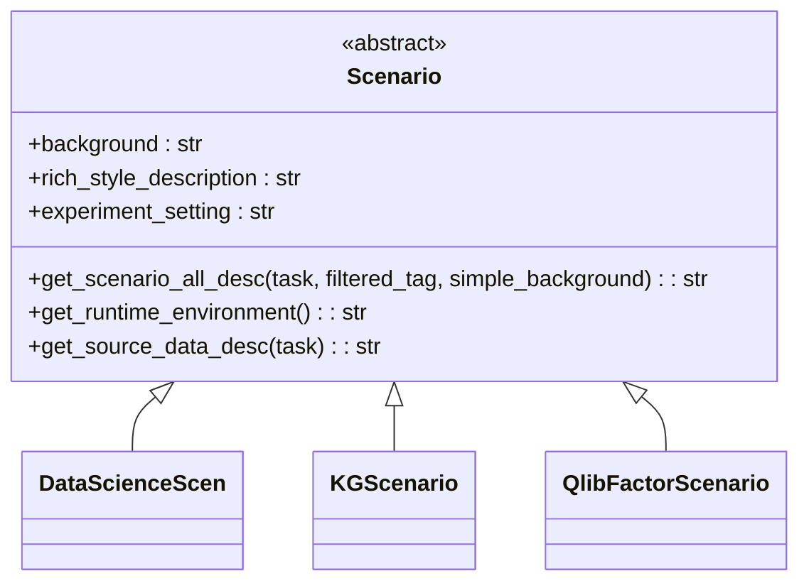
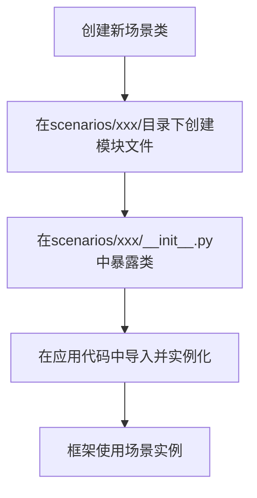

# 自定义场景开发

<cite>
**本文档引用的文件**
- [scenario.py](file://rdagent/core/scenario.py)
- [data_science\scen\__init__.py](file://rdagent/scenarios/data_science/scen/__init__.py)
- [kaggle\experiment\scenario.py](file://rdagent/scenarios/kaggle/experiment/scenario.py)
- [qlib\experiment\factor_experiment.py](file://rdagent/scenarios/qlib/experiment/factor_experiment.py)
- [data_science\scen\utils.py](file://rdagent/scenarios/data_science/scen/utils.py)
</cite>

## 目录
1. [场景基类与抽象方法](#场景基类与抽象方法)
2. [核心抽象方法详解](#核心抽象方法详解)
3. [具体场景实现示例](#具体场景实现示例)
4. [场景注册与加载机制](#场景注册与加载机制)
5. [调试技巧与常见错误](#调试技巧与常见错误)

## 场景基类与抽象方法

`rdagent.core.scenario.Scenario` 是所有自定义场景的基类，它定义了框架中场景的核心接口。开发者必须继承此类并实现其抽象方法，以确保新场景能够被框架正确识别和使用。

该基类通过抽象方法强制子类提供场景相关的背景信息、数据描述、运行环境等关键元数据，这些信息将被用于指导AI代理在特定领域内进行任务规划和代码生成。



**Diagram sources**
- [scenario.py](file://rdagent/core/scenario.py#L5-L63)

**Section sources**
- [scenario.py](file://rdagent/core/scenario.py#L5-L63)

## 核心抽象方法详解

### background 属性
`background` 是一个抽象属性，必须返回一个字符串，描述该场景的背景信息。这是AI代理理解任务上下文的基础。

### rich_style_description 属性
`rich_style_description` 也是一个抽象属性，返回一个富文本风格的描述，通常用于在用户界面中展示场景的概览。

### get_scenario_all_desc 方法
`get_scenario_all_desc` 是一个抽象方法，用于组合生成场景的完整描述。它接受 `task`、`filtered_tag` 和 `simple_background` 等参数，可以根据不同的任务和过滤条件动态生成描述文本。

### get_runtime_environment 方法
`get_runtime_environment` 是一个抽象方法，必须返回一个字符串，描述该场景所需的运行时环境信息，如依赖的库、版本、硬件要求等。

### get_source_data_desc 方法
`get_source_data_desc` 方法（及其便捷属性 `source_data`）用于描述场景可用的数据源。该方法可以接收一个可选的 `task` 参数，以便根据具体任务返回不同的数据描述。

**Section sources**
- [scenario.py](file://rdagent/core/scenario.py#L5-L63)

## 具体场景实现示例

### 数据科学场景 (DataScienceScen)
`DataScienceScen` 类继承自 `Scenario`，为数据科学竞赛场景提供了具体实现。它通过读取本地的 `description.md` 文件或JSON文件来获取竞赛描述，并利用LLM分析描述以提取任务类型、数据类型、评估指标等关键信息。

```python
class DataScienceScen(Scenario):
    def __init__(self, competition: str) -> None:
        # 初始化逻辑，包括数据准备和信息提取
        ...

    @property
    def background(self) -> str:
        # 基于提取的信息生成背景描述
        return background_prompt

    @property
    def rich_style_description(self) -> str:
        return T(".prompts:rich_style_description").r(name="Data Science", competition=self.competition)
```

### Kaggle场景 (KGScenario)
`KGScenario` 类专门用于Kaggle竞赛场景。它通过网络爬虫从Kaggle网站抓取竞赛描述，并分析其内容。该类还集成了向量数据库（RAG）来检索过往竞赛的经验。

```python
class KGScenario(Scenario):
    def __init__(self, competition: str) -> None:
        # 从Kaggle抓取描述并分析
        self.competition_descriptions = crawl_descriptions(competition, ...)
        self._analysis_competition_description()

    @property
    def source_data(self) -> str:
        # 描述预处理后的数据集
        return data_info
```

### Qlib因子场景 (QlibFactorScenario)
`QlibFactorScenario` 类为量化金融中的因子研究场景提供了实现。它使用模板（T）从配置文件中加载预定义的提示词（prompts），确保描述的一致性和可配置性。

```python
class QlibFactorScenario(Scenario):
    def __init__(self) -> None:
        super().__init__()
        self._background = deepcopy(T(".prompts:qlib_factor_background").r(...))
        # ... 其他属性的初始化

    def get_scenario_all_desc(self, ...) -> str:
        # 组合所有描述信息
        return f"""Background of the scenario:
{self.background}
The source data you can use:
{self.get_source_data_desc(task)}
...
"""
```

**Section sources**
- [data_science\scen\__init__.py](file://rdagent/scenarios/data_science/scen/__init__.py#L30-L289)
- [kaggle\experiment\scenario.py](file://rdagent/scenarios/kaggle/experiment/scenario.py#L40-L199)
- [qlib\experiment\factor_experiment.py](file://rdagent/scenarios/qlib/experiment/factor_experiment.py#L30-L90)

## 场景注册与加载机制

新创建的场景类需要在 `scenarios` 包中创建对应的模块（Python文件），并在该包的 `__init__.py` 文件中将其暴露出来，以便框架的其他部分能够导入和使用。

例如，在 `rdagent/scenarios/data_science/` 目录下创建 `my_custom_scenario.py` 文件，并在 `rdagent/scenarios/data_science/__init__.py` 中添加：
```python
from .my_custom_scenario import MyCustomScenario
```

框架的其他组件（如应用入口、循环控制器）会通过标准的Python导入机制来加载这些场景。例如，在 `app/kaggle/loop.py` 中可以看到对 `KGScenario` 的导入和使用。



**Diagram sources**
- [data_science\scen\__init__.py](file://rdagent/scenarios/data_science/scen/__init__.py#L0-L289)
- [kaggle\experiment\scenario.py](file://rdagent/scenarios/kaggle/experiment/scenario.py#L0-L199)

**Section sources**
- [data_science\scen\__init__.py](file://rdagent/scenarios/data_science/scen/__init__.py#L0-L289)
- [app\kaggle\loop.py](file://rdagent/app/kaggle/loop.py#L18-L25)

## 调试技巧与常见错误

### 常见错误：抽象方法未实现
最常见的错误是忘记实现基类中的某个抽象方法。这会导致在尝试实例化场景时抛出 `TypeError`，提示“Can't instantiate abstract class”。

**解决方法**：仔细检查 `Scenario` 基类中所有标记为 `@abstractmethod` 的方法，并确保在子类中都已正确实现。

### 调试数据描述
`get_source_data_desc` 方法的输出对AI代理理解数据至关重要。如果输出不清晰或格式错误，可能导致生成的代码无法正确处理数据。

**调试技巧**：可以使用 `describe_data_folder_v2` 等工具函数来生成结构化的数据目录描述，确保包含文件树、数据预览和关键统计信息。

### 验证运行环境
`get_runtime_environment` 方法返回的信息应准确反映实际环境。可以使用 `get_runtime_environment_by_env` 工具函数来获取环境的详细信息。

**调试技巧**：在开发环境中运行 `get_runtime_environment()` 并检查输出，确保所有必要的依赖项和版本都已正确列出。

**Section sources**
- [scenario.py](file://rdagent/core/scenario.py#L5-L63)
- [data_science\scen\utils.py](file://rdagent/scenarios/data_science/scen/utils.py#L0-L199)
- [scenarios\shared\get_runtime_info.py](file://rdagent/scenarios/shared/get_runtime_info.py)