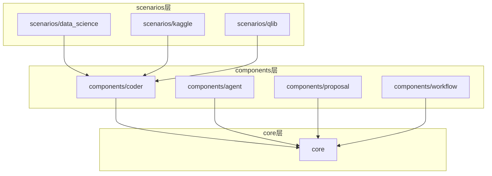
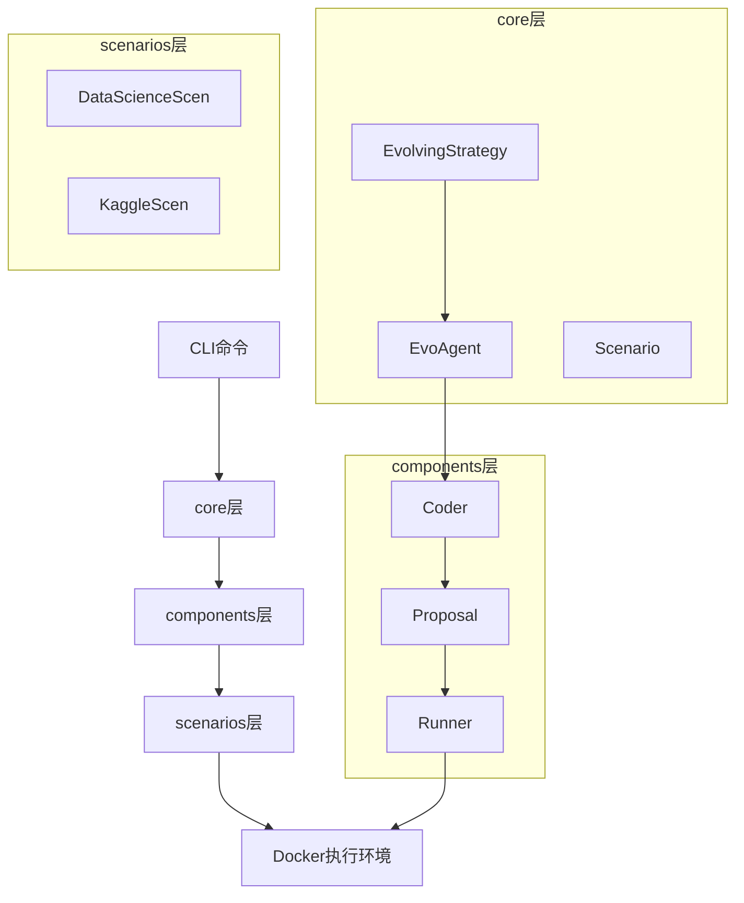
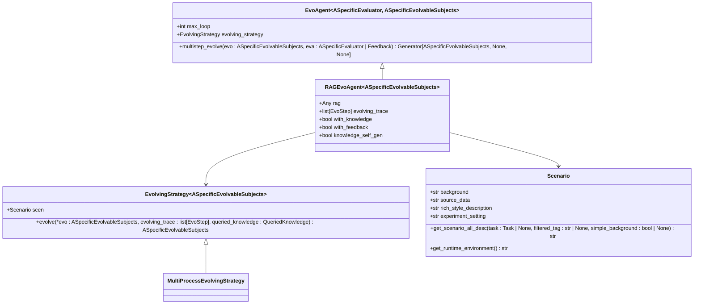
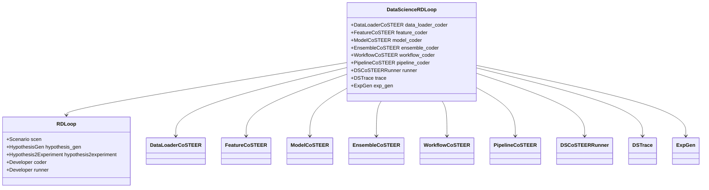
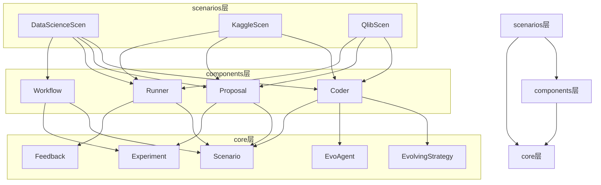

# 技术架构

<cite>
**本文档中引用的文件**  
- [cli.py](file://rdagent/app/cli.py)
- [evolving_framework.py](file://rdagent/core/evolving_framework.py)
- [evolving_agent.py](file://rdagent/core/evolving_agent.py)
- [scenario.py](file://rdagent/core/scenario.py)
- [CoSTEER/evolving_strategy.py](file://rdagent/components/coder/CoSTEER/evolving_strategy.py)
- [data_science/loop.py](file://rdagent/scenarios/data_science/loop.py)
- [conf.py](file://rdagent/core/conf.py)
- [data_science/conf.py](file://rdagent/components/coder/data_science/conf.py)
- [rd_loop.py](file://rdagent/components/workflow/rd_loop.py)
- [env.py](file://rdagent/utils/env.py)
</cite>

## 目录
1. [引言](#引言)
2. [项目结构](#项目结构)
3. [核心组件](#核心组件)
4. [架构概述](#架构概述)
5. [详细组件分析](#详细组件分析)
6. [依赖关系分析](#依赖关系分析)
7. [性能考虑](#性能考虑)
8. [故障排除指南](#故障排除指南)
9. [结论](#结论)

## 引言
RD-Agent是一个基于分层架构的自动化研发系统，旨在通过AI代理自动完成从问题分析到代码实现的完整研发流程。该系统采用面向对象的设计模式，结合策略模式和模板方法模式，实现了高度可扩展和可复用的架构。本技术架构文档将深入解析系统的分层设计、核心设计模式、数据流和控制流，以及各组件之间的依赖关系，帮助开发者理解系统的组织方式和扩展点。

## 项目结构
RD-Agent的项目结构遵循清晰的分层架构，主要分为`core`、`components`和`scenarios`三个核心层次。`core`层提供抽象基类和框架骨架，`components`层提供可复用的功能模块，`scenarios`层实现具体应用逻辑。

**图表来源**
- [data_science/loop.py](file://rdagent/scenarios/data_science/loop.py#L0-L383)
- [rd_loop.py](file://rdagent/components/workflow/rd_loop.py#L0-L37)

**章节来源**
- [data_science/loop.py](file://rdagent/scenarios/data_science/loop.py#L0-L383)
- [rd_loop.py](file://rdagent/components/workflow/rd_loop.py#L0-L37)

## 核心组件
RD-Agent的核心组件包括`core`层的抽象基类、`components`层的可复用模块和`scenarios`层的具体实现。`core`层定义了系统的基础框架，如`EvolvingStrategy`和`EvoAgent`，为上层组件提供统一的接口和骨架。`components`层实现了具体的编码器、提案生成器等可复用功能模块。`scenarios`层则针对不同应用场景（如数据科学、Kaggle竞赛）实现了具体的应用逻辑。

**章节来源**
- [evolving_framework.py](file://rdagent/core/evolving_framework.py#L0-L127)
- [evolving_agent.py](file://rdagent/core/evolving_agent.py#L0-L115)
- [data_science/loop.py](file://rdagent/scenarios/data_science/loop.py#L0-L383)

## 架构概述
RD-Agent采用分层架构设计，从CLI命令到Docker执行环境形成完整的数据流和控制流。系统通过`core`层提供抽象基类和框架骨架，`components`层提供可复用的功能模块（如编码器、提案生成器），`scenarios`层实现具体应用逻辑。

**图表来源**
- [cli.py](file://rdagent/app/cli.py#L0-L87)
- [evolving_framework.py](file://rdagent/core/evolving_framework.py#L0-L127)
- [evolving_agent.py](file://rdagent/core/evolving_agent.py#L0-L115)
- [env.py](file://rdagent/utils/env.py#L202-L220)

**章节来源**
- [cli.py](file://rdagent/app/cli.py#L0-L87)
- [evolving_framework.py](file://rdagent/core/evolving_framework.py#L0-L127)
- [evolving_agent.py](file://rdagent/core/evolving_agent.py#L0-L115)

## 详细组件分析

### 核心框架组件分析
RD-Agent的核心框架基于面向对象设计和依赖注入机制，通过抽象基类和泛型类型定义了系统的扩展点。`EvolvingStrategy`作为策略模式的实现，允许在运行时动态选择不同的演化策略。`EvoAgent`作为模板方法模式的实现，定义了算法的骨架，而将具体步骤的实现延迟到子类。

**图表来源**
- [evolving_framework.py](file://rdagent/core/evolving_framework.py#L0-L127)
- [evolving_agent.py](file://rdagent/core/evolving_agent.py#L0-L115)
- [scenario.py](file://rdagent/core/scenario.py#L0-L64)

**章节来源**
- [evolving_framework.py](file://rdagent/core/evolving_framework.py#L0-L127)
- [evolving_agent.py](file://rdagent/core/evolving_agent.py#L0-L115)
- [scenario.py](file://rdagent/core/scenario.py#L0-L64)

### 数据科学场景组件分析
数据科学场景通过`DataScienceRDLoop`实现了完整的研发循环，整合了多个编码器组件（如`DataLoaderCoSTEER`、`FeatureCoSTEER`）和运行器组件（`DSCoSTEERRunner`）。该场景通过配置驱动的方式，灵活组合不同的组件来适应不同的数据科学任务。

**图表来源**
- [data_science/loop.py](file://rdagent/scenarios/data_science/loop.py#L0-L383)
- [rd_loop.py](file://rdagent/components/workflow/rd_loop.py#L0-L37)

**章节来源**
- [data_science/loop.py](file://rdagent/scenarios/data_science/loop.py#L0-L383)

## 依赖关系分析
RD-Agent的各层之间存在明确的依赖关系，遵循从上到下的依赖原则。`scenarios`层依赖`core`和`components`层，`components`层依赖`core`层，形成清晰的依赖层次。

**图表来源**
- [data_science/loop.py](file://rdagent/scenarios/data_science/loop.py#L0-L383)
- [evolving_framework.py](file://rdagent/core/evolving_framework.py#L0-L127)
- [evolving_agent.py](file://rdagent/core/evolving_agent.py#L0-L115)

**章节来源**
- [data_science/loop.py](file://rdagent/scenarios/data_science/loop.py#L0-L383)
- [evolving_framework.py](file://rdagent/core/evolving_framework.py#L0-L127)
- [evolving_agent.py](file://rdagent/core/evolving_agent.py#L0-L115)

## 性能考虑
RD-Agent在设计时考虑了多方面的性能优化。通过`multi_proc_n`配置项支持多进程并行处理，提高编码效率。`workspace_ckp_size_limit`配置项控制工作空间检查点的大小，避免内存过度消耗。系统还通过`step_semaphore`配置项控制各步骤的并行度，平衡资源利用率和执行效率。

**章节来源**
- [conf.py](file://rdagent/core/conf.py#L0-L109)
- [data_science/conf.py](file://rdagent/components/coder/data_science/conf.py#L0-L87)

## 故障排除指南
当RD-Agent运行出现问题时，可以从以下几个方面进行排查：检查配置文件是否正确设置，特别是环境相关的配置；验证Docker环境是否正常运行；检查工作空间路径是否有足够的磁盘空间；确认网络连接是否正常，特别是需要访问外部API时。

**章节来源**
- [env.py](file://rdagent/utils/env.py#L255-L291)
- [conf.py](file://rdagent/core/conf.py#L0-L109)

## 结论
RD-Agent通过精心设计的分层架构和面向对象的设计模式，实现了高度可扩展和可复用的自动化研发系统。`core`层提供抽象基类和框架骨架，`components`层提供可复用的功能模块，`scenarios`层实现具体应用逻辑。系统采用策略模式和模板方法模式，结合依赖注入机制，使得各组件可以灵活组合和扩展。从CLI命令到Docker执行环境的完整数据流和控制流设计，确保了系统的完整性和可靠性。开发者可以通过理解这些架构设计和扩展点，有效地定制和扩展RD-Agent以适应不同的应用场景。