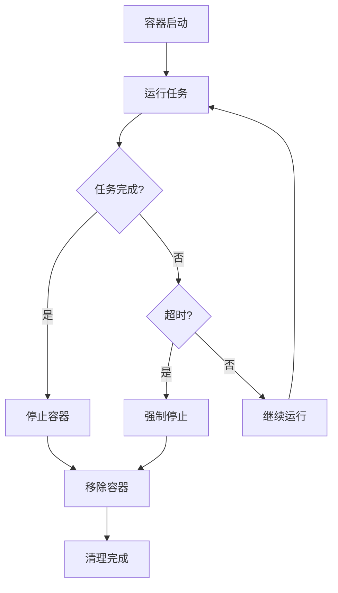
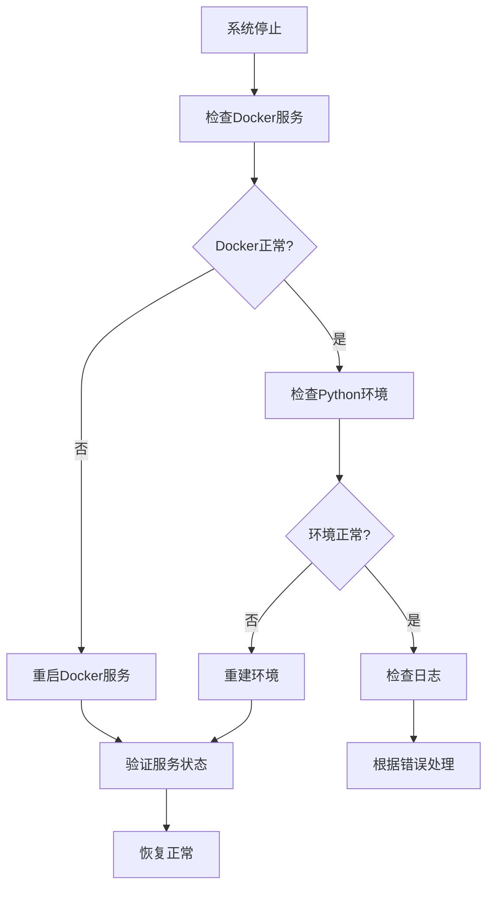

# 故障排除

<cite>
**本文档中引用的文件**
- [health_check.py](file://rdagent/app/utils/health_check.py)
- [logger.py](file://rdagent/log/logger.py)
- [exception.py](file://rdagent/core/exception.py)
- [env.py](file://rdagent/utils/env.py)
- [cli.py](file://rdagent/app/cli.py)
- [web.py](file://rdagent/log/ui/web.py)
- [app.py](file://rdagent/log/server/app.py)
- [conf.py](file://rdagent/log/conf.py)
- [README.md](file://README.md)
</cite>

## 目录
1. [简介](#简介)
2. [系统要求与环境检查](#系统要求与环境检查)
3. [常见安装问题](#常见安装问题)
4. [Docker相关问题](#docker相关问题)
5. [LLM API调用问题](#llm-api调用问题)
6. [知识库连接问题](#知识库连接问题)
7. [UI界面监控问题](#ui界面监控问题)
8. [日志分析与调试](#日志分析与调试)
9. [性能优化建议](#性能优化建议)
10. [紧急故障处理](#紧急故障处理)

## 简介

本故障排除指南旨在帮助用户快速识别和解决在安装、配置和运行RD-Agent过程中可能遇到的各种问题。通过系统化的诊断方法和具体的解决方案，用户可以有效定位问题根源并恢复系统的正常运行。

## 系统要求与环境检查

### 基本要求

RD-Agent目前仅支持Linux操作系统。确保您的系统满足以下基本要求：
- 操作系统：Linux（推荐Ubuntu 18.04+）
- 内存：至少4GB RAM
- 存储空间：至少10GB可用磁盘空间
- Python版本：3.10或3.11（推荐）

### 运行健康检查

使用内置的健康检查工具验证系统环境：

```bash
# 基本健康检查（不检查环境配置）
rdagent health_check --no-check-env

# 完整健康检查（包括环境配置检查）
rdagent health_check

# 仅检查特定项目
rdagent health_check --no-check-docker --no-check-ports
```

### 健康检查输出含义

健康检查工具会输出以下状态信息：

| 状态 | 含义 | 解决方案 |
|------|------|----------|
| ✅ Passed | 测试通过 | 正常状态，无需处理 |
| ❌ Failed | 测试失败 | 根据具体错误信息进行处理 |
| ⚠️ Warning | 警告状态 | 需要关注但不影响运行 |
| 🧪 Testing | 正在测试 | 等待测试完成 |

**节源码**
- [health_check.py](file://rdagent/app/utils/health_check.py#L150-L171)

## 常见安装问题

### Python环境问题

**问题症状：**
- `ModuleNotFoundError: No module named 'rdagent'`
- `pip install rdagent` 失败

**诊断步骤：**
1. 检查Python版本：`python --version`
2. 检查pip版本：`pip --version`
3. 检查虚拟环境状态

**解决方案：**
```bash
# 创建新的conda环境
conda create -n rdagent python=3.10
conda activate rdagent

# 升级pip
pip install --upgrade pip

# 安装RD-Agent
pip install rdagent
```

### 权限问题

**问题症状：**
- `Permission denied` 错误
- 无法运行Docker容器

**解决方案：**
```bash
# 添加当前用户到docker组
sudo usermod -aG docker $USER

# 重新登录或执行以下命令使更改生效
newgrp docker

# 验证Docker权限
docker run hello-world
```

### 依赖包冲突

**问题症状：**
- `ImportError: cannot import name 'xxx' from 'yyy'`
- 包版本不兼容错误

**解决方案：**
```bash
# 清理pip缓存
pip cache purge

# 卸载并重新安装
pip uninstall rdagent
pip install rdagent
```

## Docker相关问题

### Docker安装失败

**问题症状：**
- Docker服务未启动
- `docker: command not found`
- Docker守护进程无响应

**诊断步骤：**
1. 检查Docker服务状态：`sudo systemctl status docker`
2. 检查Docker版本：`docker --version`
3. 检查Docker守护进程：`ps aux | grep docker`

**解决方案：**
```bash
# Ubuntu/Debian系统
sudo apt update
sudo apt install docker.io
sudo systemctl enable docker
sudo systemctl start docker

# CentOS/RHEL系统
sudo yum install docker
sudo systemctl enable docker
sudo systemctl start docker
```

### Docker容器启动失败

**问题症状：**
- 容器创建失败
- 容器立即退出
- 内存不足错误

**常见原因及解决方案：**

| 错误类型 | 可能原因 | 解决方案 |
|----------|----------|----------|
| ContainerError | 镜像损坏 | 删除并重新拉取镜像 |
| ImageNotFound | 镜像不存在 | 手动拉取所需镜像 |
| APIError | Docker API访问被拒绝 | 检查Docker服务状态 |
| OutOfMemory | 内存限制过小 | 增加内存限制设置 |

**节源码**
- [env.py](file://rdagent/utils/env.py#L932-L948)

### 容器资源限制

**配置示例：**
```yaml
# 在Docker配置中设置资源限制
mem_limit: "4g"      # 内存限制
cpu_count: 2         # CPU核心数
shm_size: "2g"       # 共享内存大小
```

### 容器清理机制

系统提供了自动容器清理功能：



**节源码**
- [env.py](file://rdagent/utils/env.py#L40-L55)

## LLM API调用问题

### API密钥配置错误

**问题症状：**
- `No valid configuration was found`
- API密钥认证失败
- 请求被拒绝

**诊断步骤：**
1. 检查`.env`文件配置
2. 验证API密钥有效性
3. 测试网络连接

**配置示例：**

```bash
# OpenAI配置
cat << EOF > .env
CHAT_MODEL=gpt-4o
EMBEDDING_MODEL=text-embedding-3-small
OPENAI_API_KEY=your_api_key_here
OPENAI_API_BASE=https://api.openai.com/v1
EOF

# DeepSeek配置
cat << EOF > .env
CHAT_MODEL=deepseek/deepseek-chat
DEEPSEEK_API_KEY=your_deepseek_key
EMBEDDING_MODEL=litellm_proxy/BAAI/bge-m3
LITELLM_PROXY_API_KEY=your_siliconflow_key
LITELLM_PROXY_API_BASE=https://api.siliconflow.cn/v1
EOF
```

### API调用超时

**问题症状：**
- 请求超时错误
- 网络连接不稳定
- 服务端响应缓慢

**解决方案：**
```python
# 在代码中设置超时参数
LLM_SETTINGS.timeout = 30  # 设置为30秒
LLM_SETTINGS.max_retry = 5  # 最大重试次数
```

### 模型不支持

**问题症状：**
- `Unsupported model` 错误
- 特定功能不可用
- 模型参数不匹配

**解决方案：**
1. 检查模型是否支持所需功能
2. 更新模型版本
3. 使用兼容的模型配置

**节源码**
- [health_check.py](file://rdagent/app/utils/health_check.py#L102-L128)

## 知识库连接问题

### 向量数据库连接失败

**问题症状：**
- 知识库加载失败
- 向量检索超时
- 数据库连接断开

**诊断步骤：**
1. 检查向量数据库服务状态
2. 验证连接参数
3. 检查网络连通性

**解决方案：**
```python
# 检查知识库连接状态
from rdagent.components.knowledge_management.vector_base import VectorBase

vector_db = VectorBase()
try:
    vector_db.connect()
    print("知识库连接成功")
except Exception as e:
    print(f"知识库连接失败: {e}")
```

### 图数据库问题

**问题症状：**
- 图查询超时
- 节点关系丢失
- 图数据损坏

**解决方案：**
```python
# 重建图数据库索引
from rdagent.components.knowledge_management.graph import Graph

graph = Graph()
graph.rebuild_index()
```

### 知识库存储问题

**问题症状：**
- 知识库文件损坏
- 存储空间不足
- 文件权限错误

**解决方案：**
```bash
# 检查存储空间
df -h

# 清理临时文件
rm -rf /path/to/temp/*

# 修复权限
chmod -R 755 /path/to/knowledge_base
```

## UI界面监控问题

### Streamlit服务器启动失败

**问题症状：**
- 无法访问Web界面
- 端口占用错误
- 页面加载失败

**诊断步骤：**
1. 检查端口占用：`netstat -tulpn | grep 19899`
2. 验证Python环境
3. 检查防火墙设置

**解决方案：**
```bash
# 更换端口
rdagent ui --port 19900

# 启用调试模式
rdagent ui --debug

# 查看详细日志
rdagent ui --log-dir ./logs
```

### 实时日志显示异常

**问题症状：**
- 日志更新延迟
- 显示不完整
- 数据格式错误

**解决方案：**
```python
# 检查日志服务器状态
from rdagent.log.server.app import app

# 启动独立的日志服务器
python rdagent/log/server/app.py --port 19899
```

### WebSocket连接问题

**问题症状：**
- 实时更新失效
- 连接频繁断开
- 数据传输错误

**解决方案：**
```python
# 检查WebSocket配置
UI_SETTING.websocket_timeout = 30  # 设置为30秒
UI_SETTING.max_connections = 100   # 最大连接数
```

**节源码**
- [web.py](file://rdagent/log/ui/web.py#L1-L100)
- [app.py](file://rdagent/log/server/app.py#L36-L75)

## 日志分析与调试

### 日志级别配置

RD-Agent使用分层日志系统，支持多种日志级别：

| 级别 | 用途 | 示例场景 |
|------|------|----------|
| DEBUG | 详细调试信息 | 代码执行跟踪 |
| INFO | 一般信息记录 | 程序状态更新 |
| WARNING | 警告信息 | 配置问题提醒 |
| ERROR | 错误信息 | 异常情况记录 |

### 日志文件位置

默认日志路径：`./log/YYYY-MM-DD_HH-MM-SS-ffffff/`

**日志文件结构：**
```
log/
├── 2024-01-15_10-30-00-123456/
│   ├── common_logs.log          # 通用日志
│   ├── 12345-67890/            # 进程ID链
│   │   ├── 12345.pkl          # 对象日志
│   │   └── 67890.pkl          # 子进程日志
│   └── 12345-67890-54321/      # 嵌套进程
│       └── 54321.pkl
```

### 日志分析工具

**使用内置日志查看器：**
```bash
# 启动日志监控界面
rdagent ui --port 19899 --log-dir ./log/

# 查看实时日志流
tail -f ./log/*/common_logs.log
```

**节源码**
- [logger.py](file://rdagent/log/logger.py#L40-L136)

### 常见错误模式

**内存不足错误：**
```
ERROR: Out of memory when processing large dataset
SOLUTION: Increase memory limit or process data in chunks
```

**API调用失败：**
```
ERROR: LLM API timeout after 30 seconds
SOLUTION: Check network connection and increase timeout
```

**Docker容器错误：**
```
ERROR: Container exited with code 137
SOLUTION: Check memory limits and optimize resource usage
```

### 自定义日志配置

```python
# 在代码中配置日志
from rdagent.log import rdagent_logger as logger

# 设置日志级别
logger.setLevel("DEBUG")

# 添加自定义处理器
import logging
formatter = logging.Formatter('%(asctime)s - %(name)s - %(levelname)s - %(message)s')
handler = logging.FileHandler('custom.log')
handler.setFormatter(formatter)
logger.addHandler(handler)
```

**节源码**
- [conf.py](file://rdagent/log/conf.py#L10-L27)

## 性能优化建议

### 内存优化

**容器内存配置：**
```yaml
# docker配置优化
mem_limit: "8g"        # 根据系统内存调整
shm_size: "4g"        # 共享内存
enable_cache: true    # 启用缓存
```

**垃圾回收优化：**
```python
# 在代码中启用垃圾回收
import gc
gc.enable()
gc.set_threshold(700, 10, 10)
```

### 并发处理优化

**多进程配置：**
```yaml
# 并发处理设置
multi_proc_n: 4           # CPU核心数
workspace_ckp_size_limit: 100  # 检查点大小限制
```

### 网络优化

**API请求优化：**
```python
# 设置合理的超时和重试
LLM_SETTINGS.timeout = 30
LLM_SETTINGS.max_retry = 3
LLM_SETTINGS.retry_wait_seconds = 5
```

### 存储优化

**日志存储配置：**
```python
# 日志轮转配置
LOG_SETTINGS.truncate_days = 7      # 保留7天日志
LOG_SETTINGS.compress_old_logs = True  # 压缩旧日志
```

## 紧急故障处理

### 系统完全停止

**应急响应流程：**



**紧急命令：**
```bash
# 1. 重启Docker服务
sudo systemctl restart docker

# 2. 清理所有容器
docker system prune -f

# 3. 重建Python环境
conda deactivate
conda remove -n rdagent --all
conda create -n rdagent python=3.10
conda activate rdagent
pip install rdagent

# 4. 清理日志
rm -rf ./log/*

# 5. 重新初始化知识库
python -c "from rdagent.components.knowledge_management.vector_base import VectorBase; VectorBase().rebuild()"
```

### 数据恢复

**重要数据备份：**
```bash
# 备份工作空间
tar -czf workspace_backup_$(date +%Y%m%d).tar.gz ./git_ignore_folder/RD-Agent_workspace/

# 备份知识库
cp -r ./knowledge_base/ ./knowledge_base_backup_$(date +%Y%m%d)/

# 备份配置文件
cp .env .env.backup_$(date +%Y%m%d)
```

**数据恢复流程：**
1. 停止所有RD-Agent进程
2. 恢复备份文件
3. 重新启动服务
4. 验证数据完整性

### 紧急联系支持

当遇到无法解决的问题时，请准备以下信息以便技术支持：
- 完整的错误日志
- 系统环境信息
- 配置文件内容
- 重现步骤说明

**获取帮助：**
- GitHub Issues：https://github.com/microsoft/RD-Agent/issues
- Discord社区：https://discord.gg/ybQ97B6Jjy
- 技术支持邮箱：support@rdagent.com

## 结论

本故障排除指南涵盖了RD-Agent使用过程中可能遇到的主要问题及其解决方案。通过系统性的诊断方法和预防性措施，用户可以有效避免大多数常见问题，并在出现问题时快速定位和解决。

定期进行健康检查、保持系统更新、合理配置资源是确保RD-Agent稳定运行的关键。如果遇到本指南未涵盖的问题，请及时联系技术支持团队获取帮助。