# 常见问题解决

<cite>
**本文档引用的文件**
- [storage.py](file://rdagent/log/ui/storage.py)
- [evaluators.py](file://rdagent/components/coder/CoSTEER/evaluators.py)
- [health_check.py](file://rdagent/app/utils/health_check.py)
- [env.py](file://rdagent/utils/env.py)
- [exception.py](file://rdagent/core/exception.py)
- [conf.py](file://rdagent/app/data_science/conf.py)
- [base.py](file://rdagent/scenarios/data_science/proposal/exp_gen/base.py)
- [diversity_strategy.py](file://rdagent/scenarios/data_science/proposal/exp_gen/diversity_strategy.py)
- [knowledge_management.py](file://rdagent/components/coder/CoSTEER/knowledge_management.py)
</cite>

## 目录
1. [概述](#概述)
2. [LLM生成代码质量问题](#llm生成代码质量问题)
3. [代码执行超时和依赖冲突问题](#代码执行超时和依赖冲突问题)
4. [结果存储失败问题](#结果存储失败问题)
5. [评估器误判问题](#评估器误判问题)
6. [健康检查典型错误](#健康检查典型错误)
7. [问题诊断流程](#问题诊断流程)
8. [应急处理预案](#应急处理预案)

## 概述

RD-Agent在使用过程中可能遇到多种技术问题，本指南提供了系统性的问题识别、分析和解决方案。主要涵盖LLM生成质量、执行环境、存储系统、评估机制和系统健康等核心方面。

## LLM生成代码质量问题

### 问题表现
- 生成的代码语法错误频繁
- 逻辑实现与需求不符
- 代码可读性和效率低下
- 多次迭代后仍无法收敛

### 根本原因分析
LLM生成代码质量下降通常由以下因素导致：
1. **提示词设计不足**：缺乏明确的上下文和约束条件
2. **知识库过时**：历史成功案例和错误模式未及时更新
3. **多样性策略缺失**：重复相同的思维路径导致收敛过早

### 解决方案

#### 提示词优化策略

**基础提示词改进**
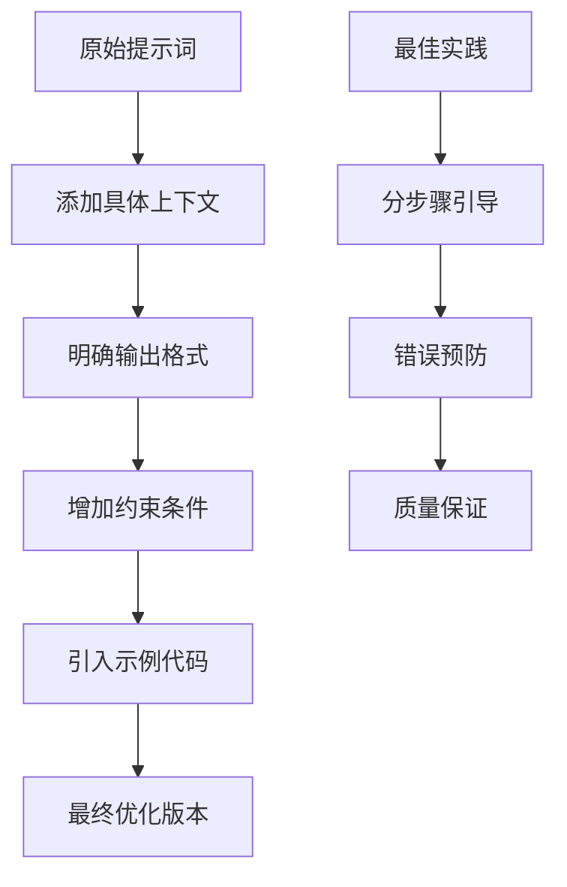

**关键优化要素**：
- **上下文丰富化**：包含完整的任务描述、输入输出格式、约束条件
- **结构化输出**：使用JSON格式确保解析一致性
- **渐进式复杂度**：从简单到复杂的任务分解
- **错误示例**：提供常见错误和正确做法对比

#### 知识库清理和维护

**知识库健康检查流程**：
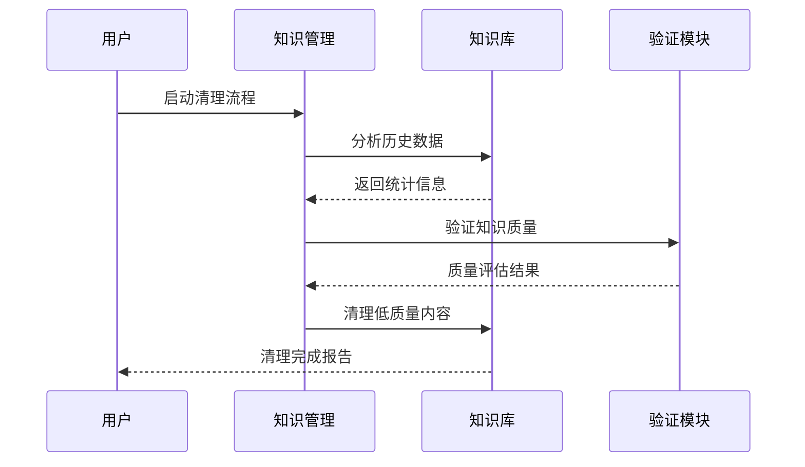

**清理策略**：
1. **定期清理**：每周自动清理超过3个月的历史记录
2. **质量评估**：基于成功率和实用性评分
3. **去重处理**：移除相似度高于阈值的重复内容
4. **分类整理**：按任务类型和难度级别组织知识

#### 多样性策略调整

**多样性注入机制**：
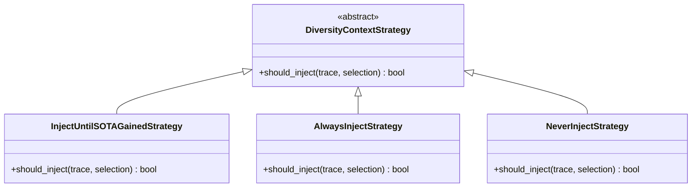

**策略选择指南**：
- **InjectUntilSOTAGainedStrategy**：适用于需要探索多种可能性的场景
- **AlwaysInjectStrategy**：适用于创新性任务，鼓励广泛尝试
- **NeverInjectStrategy**：适用于确定性任务，避免不必要的干扰

**配置建议**：
```yaml
# 多样性配置
enable_cross_trace_diversity: true
diversity_injection_strategy: "rdagent.scenarios.data_science.proposal.exp_gen.diversity_strategy.InjectUntilSOTAGainedStrategy"
max_sota_retrieved_num: 10
```

**节来源**
- [diversity_strategy.py](file://rdagent/scenarios/data_science/proposal/exp_gen/diversity_strategy.py#L37-L67)
- [base.py](file://rdagent/scenarios/data_science/proposal/exp_gen/base.py#L75-L85)

## 代码执行超时和依赖冲突问题

### 问题表现
- 代码运行时间超出预期
- 内存使用量持续增长
- 依赖包安装失败
- 环境变量配置错误

### 根本原因分析
执行环境问题主要源于：
1. **资源限制不当**：CPU、内存、磁盘空间配置不合理
2. **超时设置过短**：未能适应复杂任务的执行需求
3. **环境隔离不足**：不同任务间存在资源竞争
4. **依赖管理混乱**：版本冲突和兼容性问题

### 解决方案

#### 环境隔离配置

**容器化环境配置**：
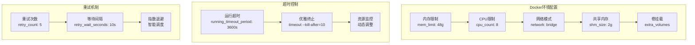

**关键配置参数**：
```python
# 环境配置示例
class DockerConf:
    mem_limit: str = "48g"           # 内存限制
    cpu_count: int = 8              # CPU核心数
    shm_size: str = "2g"            # 共享内存
    running_timeout_period: int = 3600  # 运行超时(秒)
    retry_count: int = 5            # 重试次数
    retry_wait_seconds: int = 10    # 重试等待时间
```

#### 资源限制配置

**动态资源分配策略**：
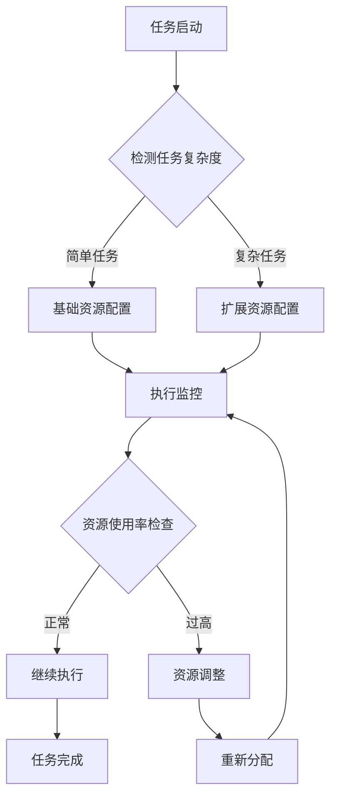

**配置优化建议**：
1. **内存管理**：根据任务规模动态调整内存限制
2. **CPU分配**：考虑多线程任务的并发需求
3. **磁盘空间**：预留足够的临时文件空间
4. **网络访问**：确保必要的外部连接权限

**节来源**
- [env.py](file://rdagent/utils/env.py#L637-L665)
- [env.py](file://rdagent/utils/env.py#L241-L270)

## 结果存储失败问题

### 问题表现
- 实验结果无法保存到数据库
- 文件上传中断或失败
- 存储服务连接超时
- 数据完整性验证失败

### 根本原因分析
存储系统故障通常由以下原因引起：
1. **网络连接不稳定**：客户端与服务器通信中断
2. **权限配置错误**：缺少必要的访问权限
3. **存储空间不足**：磁盘空间被占满
4. **并发访问冲突**：多个进程同时写入同一位置

### 解决方案

#### storage.py正确使用方式

**存储架构设计**：
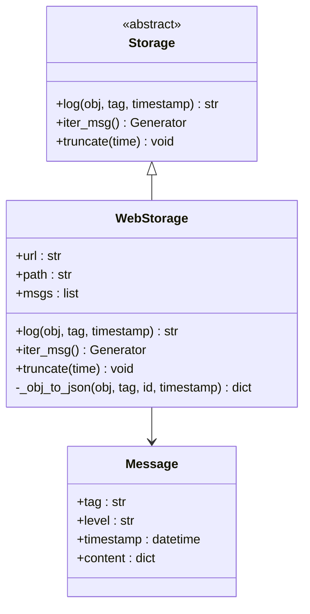

**核心功能实现**：
1. **对象序列化**：支持多种数据类型的JSON转换
2. **标签路由**：基于标签分类存储不同类型的数据
3. **时间戳管理**：精确的时间戳记录和查询
4. **批量操作**：高效的消息批量处理

**使用最佳实践**：
```python
# 正确的存储调用方式
storage = WebStorage(port=19899, path="/path/to/logs")

# 记录实验结果
result_data = {
    "experiment_id": "exp_001",
    "metrics": {"accuracy": 0.95, "loss": 0.05},
    "timestamp": datetime.now()
}

storage.log(
    obj=result_data,
    tag="experiment.results",
    timestamp=datetime.now()
)
```

#### 错误处理机制

**存储失败恢复策略**：
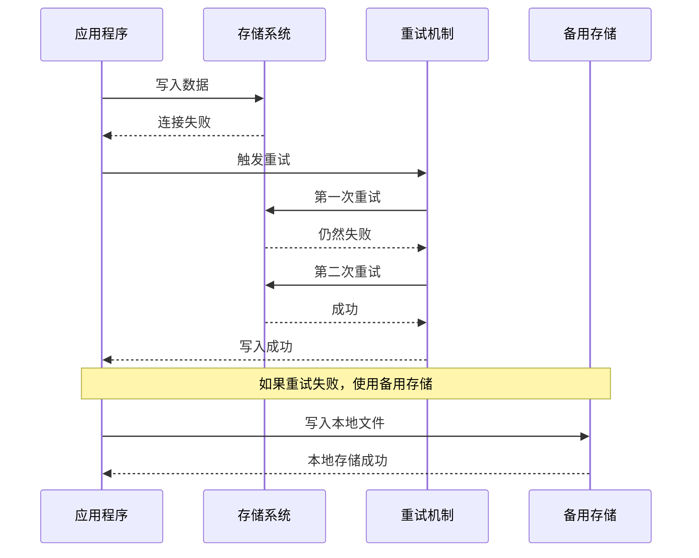

**配置建议**：
```yaml
# 存储配置
storage:
  timeout: 5  # 请求超时时间(秒)
  max_retries: 3  # 最大重试次数
  backup_storage: "local"  # 备用存储方式
  compression: true  # 启用压缩
```

**节来源**
- [storage.py](file://rdagent/log/ui/storage.py#L20-L40)
- [storage.py](file://rdagent/log/ui/storage.py#L150-L200)

## 评估器误判问题

### 问题表现
- 正确实现被判定为失败
- 错误代码被误认为有效
- 评估标准不一致
- 反馈信息误导性强

### 根本原因分析
评估器误判主要由于：
1. **评判标准不明确**：缺乏清晰的验收准则
2. **反馈机制缺陷**：错误信息不够具体和准确
3. **阈值设置不当**：评价指标的临界值不合理
4. **上下文理解不足**：未能充分理解任务背景

### 解决方案

#### evaluators.py评判标准调整

**评估器架构设计**：
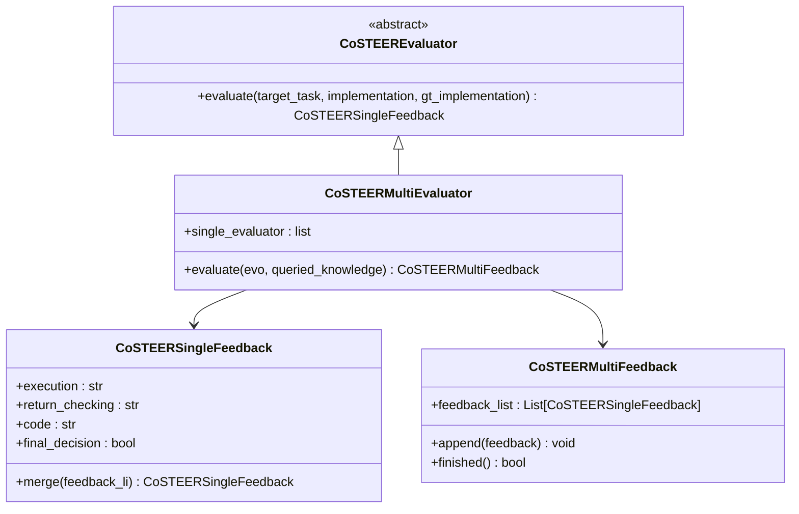

**评判标准优化**：
1. **多维度评估**：结合执行、返回值、代码质量等多个维度
2. **阈值动态调整**：根据历史数据自适应调整评判标准
3. **上下文感知**：考虑任务特定的评估要求
4. **专家反馈集成**：引入人工审核机制

**配置调整示例**：
```python
# 评估器配置优化
class OptimizedEvaluator:
    def evaluate(self, target_task, implementation, gt_implementation):
        # 执行阶段评估
        execution_feedback = self._check_execution(implementation)
        
        # 返回值验证
        return_checking = self._verify_return_values(implementation, gt_implementation)
        
        # 代码质量评估
        code_quality = self._assess_code_quality(implementation)
        
        # 综合决策
        final_decision = self._make_final_decision(
            execution_feedback, 
            return_checking, 
            code_quality
        )
        
        return CoSTEERSingleFeedback(
            execution=execution_feedback,
            return_checking=return_checking,
            code=code_quality,
            final_decision=final_decision
        )
```

#### 反馈机制改进

**反馈质量提升策略**：
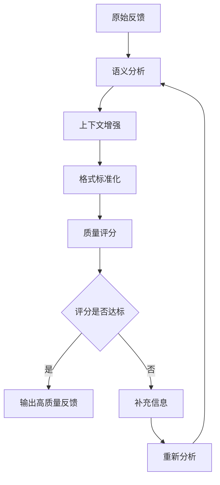

**反馈质量标准**：
1. **准确性**：反馈内容必须准确反映实际问题
2. **具体性**：提供具体的改进建议而非泛泛之谈
3. **可操作性**：建议应具有实际的可执行性
4. **建设性**：以积极的方式提出改进建议

**节来源**
- [evaluators.py](file://rdagent/components/coder/CoSTEER/evaluators.py#L66-L92)
- [evaluators.py](file://rdagent/components/coder/CoSTEER/evaluators.py#L286-L310)

## 健康检查典型错误

### 问题表现
- Docker服务不可用
- 端口占用冲突
- API密钥认证失败
- 网络连接异常

### 根本原因分析
健康检查失败通常由系统配置问题引起：
1. **Docker配置错误**：服务未启动或权限不足
2. **端口冲突**：默认端口被其他应用占用
3. **环境变量缺失**：关键配置参数未设置
4. **网络问题**：防火墙或代理阻止连接

### 解决方案

#### health_check.py典型错误及修复

**健康检查流程**：
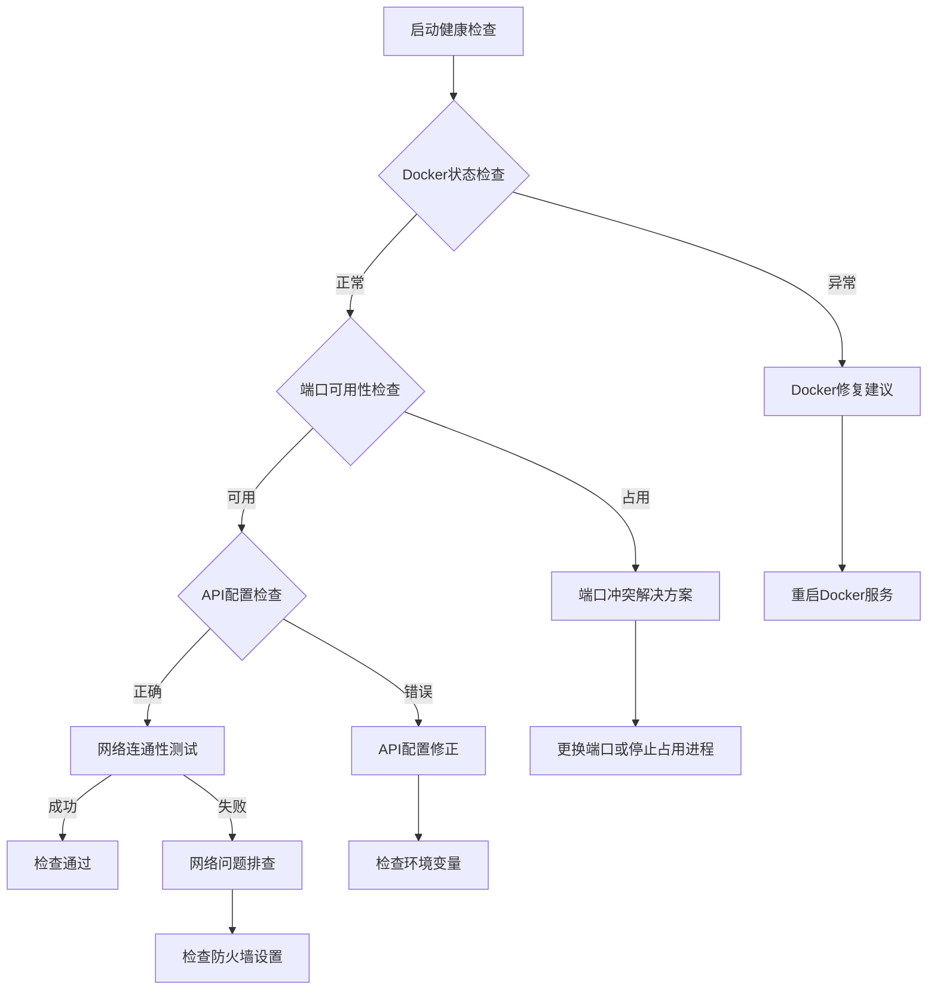

**常见错误及解决方案**：

| 错误类型 | 症状 | 解决方案 |
|---------|------|----------|
| Docker服务异常 | "Docker status is exception" | 1. 检查Docker服务状态<br/>2. 重启Docker服务<br/>3. 检查用户权限 |
| 端口占用 | "Port 19899 is occupied" | 1. 使用`check_and_list_free_ports()`查找可用端口<br/>2. 修改配置文件中的端口号<br/>3. 停止占用端口的进程 |
| API认证失败 | "Chat test failed" | 1. 检查API密钥有效性<br/>2. 验证模型名称正确性<br/>3. 确认网络连接 |
| 环境变量缺失 | "No valid configuration" | 1. 检查`.env`文件<br/>2. 设置必需的环境变量<br/>3. 重新加载配置 |

**健康检查配置**：
```python
# 健康检查配置示例
def health_check(
    check_env: bool = True,      # 检查环境配置
    check_docker: bool = True,   # 检查Docker状态
    check_ports: bool = True     # 检查端口可用性
):
    # 环境检查
    if check_env:
        env_check()
    
    # Docker检查
    if check_docker:
        check_docker_status()
    
    # 端口检查
    if check_ports:
        check_and_list_free_ports()
```

#### 修复步骤详解

**Docker问题修复**：
```bash
# 检查Docker服务状态
sudo systemctl status docker

# 重启Docker服务
sudo systemctl restart docker

# 检查Docker权限
docker run hello-world

# 查看Docker版本
docker --version
```

**端口问题修复**：
```bash
# 查找占用端口的进程
sudo lsof -i :19899

# 杀死占用进程
sudo kill -9 <PID>

# 或者更换端口
export RDAGENT_UI_PORT=19900
```

**节来源**
- [health_check.py](file://rdagent/app/utils/health_check.py#L15-L45)
- [health_check.py](file://rdagent/app/utils/health_check.py#L50-L80)

## 问题诊断流程

### 诊断框架设计

**系统化诊断流程**：
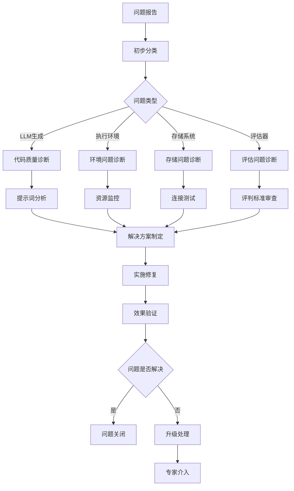

### 诊断工具集

**自动化诊断脚本**：
```python
class DiagnosticEngine:
    def __init__(self):
        self.problems = []
        self.solutions = []
    
    def diagnose(self, issue_type: str, context: dict):
        """统一诊断接口"""
        diagnostic_methods = {
            "llm_quality": self._diagnose_llm_quality,
            "execution_timeout": self._diagnose_execution_timeout,
            "storage_failure": self._diagnose_storage_failure,
            "evaluator_mistake": self._diagnose_evaluator_mistake
        }
        
        if issue_type in diagnostic_methods:
            return diagnostic_methods[issue_type](context)
        return {"status": "unknown_issue", "solution": "请提供更多详细信息"}
    
    def _diagnose_llm_quality(self, context: dict):
        """LLM生成质量诊断"""
        # 分析提示词质量
        # 检查知识库状态
        # 评估多样性策略
        return {
            "status": "needs_optimization",
            "solutions": [
                "优化提示词模板",
                "更新知识库内容",
                "调整多样性策略"
            ]
        }
```

### 问题优先级评估

**优先级矩阵**：
| 影响程度 | 发生频率 | 优先级 | 处理策略 |
|---------|---------|--------|----------|
| 高 | 高 | P1 | 立即修复 |
| 高 | 中 | P2 | 快速修复 |
| 高 | 低 | P3 | 计划修复 |
| 中 | 高 | P2 | 优先处理 |
| 中 | 中 | P3 | 正常处理 |
| 中 | 低 | P4 | 后续优化 |
| 低 | 高 | P3 | 适当关注 |
| 低 | 中 | P4 | 轻微调整 |
| 低 | 低 | P5 | 监控观察 |

## 应急处理预案

### 应急响应流程

**快速响应机制**：
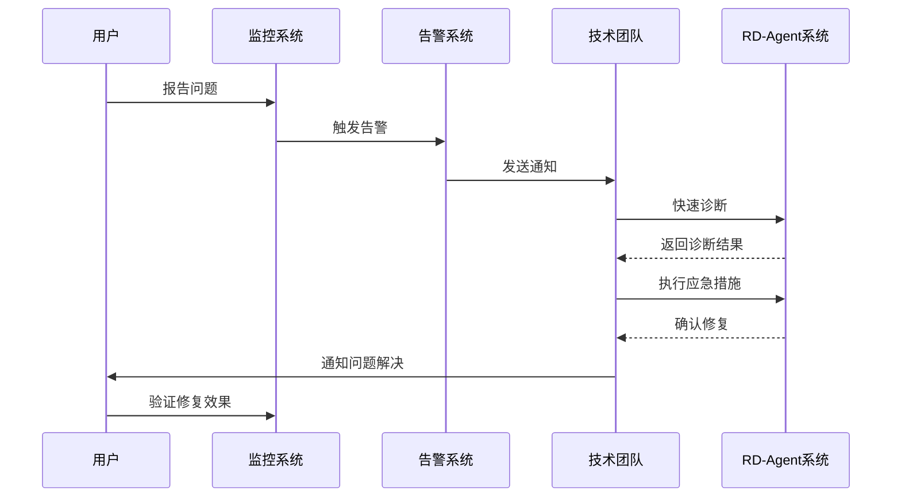

### 应急措施清单

**1. LLM生成问题应急**
```bash
# 快速重置知识库
python -m rdagent.components.coder.CoSTEER.knowledge_management \
    --reset-knowledge-base \
    --backup-current

# 临时禁用高级特性
export DS_RD_SETTING.enable_cross_trace_diversity=false
export DS_RD_SETTING.enable_research_rag=false
```

**2. 执行环境问题应急**
```bash
# 切换到本地环境
export RD_AGENT_ENV_TYPE=local

# 降低资源限制
export RUNNING_TIMEOUT_PERIOD=1800
export MEM_LIMIT=16g

# 禁用缓存机制
export ENABLE_CACHE=false
```

**3. 存储系统问题应急**
```bash
# 切换到本地存储
export STORAGE_BACKEND=local

# 增加存储超时
export STORAGE_TIMEOUT=30

# 启用备份存储
export BACKUP_STORAGE=true
```

**4. 评估器问题应急**
```bash
# 临时放宽评判标准
export EVALUATOR_STRICTNESS=low

# 启用人工审核
export ENABLE_HUMAN_REVIEW=true

# 重置评估器状态
python -m rdagent.components.coder.CoSTEER.evaluators \
    --reset-evaluator-state
```

### 预防性措施

**系统健康维护**：
1. **定期备份**：每日自动备份知识库和配置
2. **性能监控**：实时监控系统资源使用情况
3. **容量规划**：提前预测和准备扩容资源
4. **版本管理**：严格控制系统更新和配置变更

**持续改进机制**：
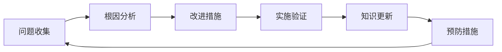

通过系统性的问题识别、分析和解决，RD-Agent能够提供稳定可靠的人工智能研发服务。本指南提供的解决方案和应急措施将帮助用户快速应对各种技术挑战，确保系统的持续稳定运行。