# 性能优化

<cite>
**本文档引用的文件**
- [rdagent/app/data_science/conf.py](file://rdagent/app/data_science/conf.py)
- [rdagent/app/finetune/data_science/conf.py](file://rdagent/app/finetune/data_science/conf.py)
- [rdagent/components/coder/CoSTEER/config.py](file://rdagent/components/coder/CoSTEER/config.py)
- [rdagent/core/conf.py](file://rdagent/core/conf.py)
- [rdagent/oai/llm_conf.py](file://rdagent/oai/llm_conf.py)
- [rdagent/components/coder/CoSTEER/evolving_strategy.py](file://rdagent/components/coder/CoSTEER/evolving_strategy.py)
- [rdagent/app/data_science/loop.py](file://rdagent/app/data_science/loop.py)
- [rdagent/components/workflow/rd_loop.py](file://rdagent/components/workflow/rd_loop.py)
- [rdagent/log/timer.py](file://rdagent/log/timer.py)
- [rdagent/utils/workflow/tracking.py](file://rdagent/utils/workflow/tracking.py)
- [rdagent/scenarios/data_science/proposal/exp_gen/trace_scheduler.py](file://rdagent/scenarios/data_science/proposal/exp_gen/trace_scheduler.py)
</cite>

## 目录
1. [概述](#概述)
2. [迭代次数优化](#迭代次数优化)
3. [结果缓存机制](#结果缓存机制)
4. [并行执行策略](#并行执行策略)
5. [LLM调用成本控制](#llm调用成本控制)
6. [计算资源管理](#计算资源管理)
7. [CoSTEER演化策略](#costeer演化策略)
8. [性能监控与基准测试](#性能监控与基准测试)
9. [配置示例](#配置示例)
10. [最佳实践建议](#最佳实践建议)

## 概述

RD-Agent是一个基于人工智能的自动化研发平台，其性能优化涉及多个层面：迭代次数控制、结果缓存、并行执行、LLM成本管理、资源调度等。本指南详细阐述了各种性能优化策略及其配置方法。

## 迭代次数优化

### max_loop参数调优

迭代次数是影响系统性能的关键参数，直接影响运行时间和资源消耗。


**图表来源**
- [rdagent/components/coder/CoSTEER/config.py](file://rdagent/components/coder/CoSTEER/config.py#L15-L20)
- [rdagent/app/data_science/conf.py](file://rdagent/app/data_science/conf.py#L75-L80)

#### CoSTEER迭代优化

CoSTEER框架中的最大迭代次数配置：

| 参数名称 | 默认值 | 调优建议 | 影响范围 |
|---------|--------|----------|----------|
| max_loop | 10 | 根据复杂度调整，简单任务可降至5-7 | 单次演化过程 |
| coder_max_loop | 10 | 数据科学任务推荐8-12 | 编码阶段 |
| runner_max_loop | 3 | 评估阶段通常3次即可 | 执行验证 |

#### 场景特定优化

不同场景下的迭代次数建议：

- **数据科学竞赛**：`coder_max_loop=10`, `runner_max_loop=3`
- **模型微调**：`max_loop=15`（需要更多尝试）
- **快速原型**：`max_loop=5`（追求速度）

**章节来源**
- [rdagent/components/coder/CoSTEER/config.py](file://rdagent/components/coder/CoSTEER/config.py#L15-L20)
- [rdagent/app/data_science/conf.py](file://rdagent/app/data_science/conf.py#L75-L80)

### 失败重试机制

系统内置失败重试机制，避免因偶发错误导致整个流程中断：


**图表来源**
- [rdagent/components/coder/CoSTEER/config.py](file://rdagent/components/coder/CoSTEER/config.py#L17-L18)

## 结果缓存机制

### 缓存架构设计

RD-Agent采用多层缓存架构，有效减少重复计算和LLM调用。


**图表来源**
- [rdagent/core/conf.py](file://rdagent/core/conf.py#L55-L65)
- [rdagent/oai/llm_conf.py](file://rdagent/oai/llm_conf.py#L45-L60)

#### 缓存配置参数

| 配置项 | 类型 | 默认值 | 说明 |
|--------|------|--------|------|
| cache_with_pickle | bool | True | 是否使用pickle缓存 |
| pickle_cache_folder_path_str | str | "pickle_cache/" | 缓存文件夹路径 |
| use_file_lock | bool | True | 是否使用文件锁避免重复执行 |
| use_chat_cache | bool | False | 是否启用聊天缓存 |
| use_embedding_cache | bool | False | 是否启用嵌入缓存 |

#### 缓存优化策略

1. **智能缓存键生成**：基于输入内容MD5哈希
2. **缓存失效机制**：支持手动清理和自动过期
3. **并发控制**：文件锁确保线程安全
4. **存储优化**：支持压缩和分片存储

**章节来源**
- [rdagent/core/conf.py](file://rdagent/core/conf.py#L55-L65)
- [rdagent/oai/llm_conf.py](file://rdagent/oai/llm_conf.py#L45-L60)

### 实验结果缓存

针对实验执行结果的专门缓存机制：


**图表来源**
- [rdagent/components/runner/__init__.py](file://rdagent/components/runner/__init__.py#L5-L20)

## 并行执行策略

### 多进程并行架构

RD-Agent支持多进程并行执行，显著提升大规模任务处理能力。


**图表来源**
- [rdagent/core/conf.py](file://rdagent/core/conf.py#L75-L85)
- [rdagent/components/coder/CoSTEER/evolving_strategy.py](file://rdagent/components/coder/CoSTEER/evolving_strategy.py#L100-L130)

#### 并行配置参数

| 参数名称 | 类型 | 默认值 | 说明 |
|---------|------|--------|------|
| multi_proc_n | int | 1 | 最大并行进程数 |
| step_semaphore | int/dict | 1 | 步骤级并发控制 |
| get_max_parallel() | method | 动态计算 | 获取最大并行度 |

#### 并行执行模式

1. **全局并行**：所有步骤同时执行
2. **步骤级并行**：按步骤类型分别控制
3. **任务级并行**：单个步骤内任务并行

**章节来源**
- [rdagent/core/conf.py](file://rdagent/core/conf.py#L75-L85)
- [rdagent/components/coder/CoSTEER/evolving_strategy.py](file://rdagent/components/coder/CoSTEER/evolving_strategy.py#L100-L130)

### 多线程优化

针对不同操作类型的线程池配置：


**图表来源**
- [rdagent/core/utils.py](file://rdagent/core/utils.py#L109-L154)

## LLM调用成本控制

### 模型选择策略

合理选择LLM模型是控制成本的关键因素。


**图表来源**
- [rdagent/oai/llm_conf.py](file://rdagent/oai/llm_conf.py#L15-L20)

#### 模型配置优化

| 配置项 | 推荐值 | 成本影响 | 性能权衡 |
|--------|--------|----------|----------|
| chat_model | gpt-4-turbo | 中等 | 平衡性能与成本 |
| embedding_model | text-embedding-3-small | 低 | 快速且经济 |
| chat_temperature | 0.3-0.5 | 固定 | 稳定输出 |
| chat_max_tokens | 4000-8000 | 可调 | 控制上下文长度 |

### 提示词优化

精简提示词可以显著降低token消耗和成本。


**图表来源**
- [rdagent/oai/backend/litellm.py](file://rdagent/oai/backend/litellm.py#L43-L76)

#### 提示词优化技术

1. **上下文压缩**：移除重复和不相关信息
2. **指令标准化**：使用标准格式减少歧义
3. **模板化**：建立可复用的提示词模板
4. **动态调整**：根据任务复杂度调整提示词长度

### 批处理请求优化

批量处理多个请求以提高效率和降低成本。


**图表来源**
- [rdagent/oai/backend/litellm.py](file://rdagent/oai/backend/litellm.py#L191-L227)

## 计算资源管理

### 内存限制控制

有效的内存管理防止系统资源耗尽。

```mermaid
graph TB
subgraph "内存监控体系"
A["内存使用检测"] --> B["阈值比较"]
B --> C{"超出限制?"}
C --> |否| D["正常运行"]
C --> |是| E["触发回收"]
E --> F["垃圾回收"]
F --> G["压缩存储"]
G --> H["释放缓存"]
H --> I["恢复运行"]
end
subgraph "资源限制参数"
J["workspace_ckp_size_limit"] --> K["文件大小限制"]
L["stdout_context_len"] --> M["输出缓冲区"]
N["multi_proc_n"] --> O["进程数量控制"]
end
A -.-> J
D -.-> L
I -.-> N
```



**图表来源**
- [rdagent/core/conf.py](file://rdagent/core/conf.py#L35-L45)

#### 内存管理配置

| 参数 | 默认值 | 优化建议 | 作用 |
|------|--------|----------|------|
| workspace_ckp_size_limit | 0 | 设置为100MB-1GB | 控制工作空间备份大小 |
| stdout_context_len | 400 | 根据任务调整 | 限制日志输出长度 |
| multi_proc_n | 1 | CPU核心数×0.8 | 避免过度占用 |

### 超时设置策略

合理的超时设置平衡性能和稳定性。


**图表来源**
- [rdagent/app/data_science/conf.py](file://rdagent/app/data_science/conf.py#L40-L55)

#### 超时配置详解

| 阶段 | 调试超时 | 生产超时 | 动态调整 |
|------|----------|----------|----------|
| debug_timeout | 600秒 | 3600秒 | 支持递增 |
| full_timeout | 600秒 | 3600秒 | 支持递增 |
| recommend_debug_timeout | 600秒 | 3600秒 | 无递增 |
| 全局超时 | 无限制 | 时间窗口内 | 基于剩余时间 |

**章节来源**
- [rdagent/app/data_science/conf.py](file://rdagent/app/data_science/conf.py#L40-L55)

### 任务队列管理

优先级和公平性兼顾的任务调度机制。


**图表来源**
- [rdagent/components/workflow/rd_loop.py](file://rdagent/components/workflow/rd_loop.py#L40-L70)

## CoSTEER演化策略

### 探索与利用平衡

CoSTEER框架通过多种调度策略实现探索与利用的动态平衡。


**图表来源**
- [rdagent/scenarios/data_science/proposal/exp_gen/trace_scheduler.py](file://rdagent/scenarios/data_science/proposal/exp_gen/trace_scheduler.py#L304-L334)

#### 调度策略对比

| 策略类型 | 探索程度 | 利用程度 | 适用场景 | 温度参数 |
|----------|----------|----------|----------|----------|
| RandomScheduler | 高 | 低 | 初期探索 | 1.0 |
| TraceLengthScheduler | 中 | 中 | 平衡考虑 | 0.5-1.5 |
| SOTABasedScheduler | 低 | 高 | 成熟项目 | 0.3-0.7 |
| MCTSScheduler | 动态 | 动态 | 复杂优化 | 1.0-3.0 |

#### PUCT算法实现

MCTS调度器采用PUCT（Upper Confidence Bound for Trees）算法：

```
U(s,a) = Q(s,a) + c_puct × P(s,a) × √(N(s)) / (1 + N(s,a))
```

其中：
- Q(s,a)：平均奖励值
- P(s,a)：先验概率  
- N(s)：节点访问总数
- N(s,a)：动作访问次数
- c_puct：探索常数

**章节来源**
- [rdagent/scenarios/data_science/proposal/exp_gen/trace_scheduler.py](file://rdagent/scenarios/data_science/proposal/exp_gen/trace_scheduler.py#L333-L394)

### 多轨迹合并策略

随着探索深入，系统需要适时合并相似轨迹以提高效率。


**图表来源**
- [rdagent/app/data_science/conf.py](file://rdagent/app/data_science/conf.py#L120-L130)

## 性能监控与基准测试

### 监控指标体系

全面的性能监控帮助识别瓶颈和优化机会。


**图表来源**
- [rdagent/utils/workflow/tracking.py](file://rdagent/utils/workflow/tracking.py#L40-L80)

#### 关键性能指标

| 指标类别 | 具体指标 | 监控方式 | 优化目标 |
|----------|----------|----------|----------|
| 执行效率 | 总执行时间 | 定时采样 | 减少50% |
| 资源利用 | CPU使用率 | 实时监控 | 保持在70%以下 |
| 成本控制 | LLM调用费用 | 实时统计 | 降低30% |
| 缓存效果 | 命中率 | 每次访问 | 提升至80%以上 |

### 基准测试框架

标准化的测试方法确保优化效果可量化。


**图表来源**
- [rdagent/log/timer.py](file://rdagent/log/timer.py#L10-L50)

#### 测试场景设计

1. **标准任务测试**：固定数据集上的典型任务
2. **边界条件测试**：极端输入情况
3. **压力测试**：高并发和大数据量
4. **回归测试**：版本间性能对比

**章节来源**
- [rdagent/log/timer.py](file://rdagent/log/timer.py#L10-L50)

### 实时性能追踪

集成MLflow进行实时性能追踪和历史数据分析。


**图表来源**
- [rdagent/utils/workflow/tracking.py](file://rdagent/utils/workflow/tracking.py#L25-L50)

## 配置示例

### 基础性能优化配置

以下是基于conf.py的完整性能优化配置示例：

```python
# 性能优化配置示例
class PerformanceOptimizedSettings(DataScienceBasePropSetting):
    # 迭代次数优化
    coder_max_loop: int = 8          # 编码阶段迭代次数
    runner_max_loop: int = 2          # 执行阶段迭代次数
    max_trace_num: int = 3           # 最大并行轨迹数
    
    # 缓存优化
    cache_with_pickle: bool = True    # 启用pickle缓存
    use_chat_cache: bool = True       # 启用LLM响应缓存
    use_file_lock: bool = True        # 文件锁保护
    
    # 并行执行
    multi_proc_n: int = 4             # 并行进程数
    step_semaphore: dict = {
        "coding": 3,                  # 编码阶段并发数
        "running": 2                  # 执行阶段并发数
    }
    
    # 超时设置
    debug_timeout: int = 300         # 调试模式超时
    full_timeout: int = 1800         # 生产模式超时
    
    # LLM优化
    chat_model: str = "gpt-4-turbo"  # 性能与成本平衡模型
    chat_temperature: float = 0.3    # 降低随机性
    chat_max_tokens: int = 4000      # 控制上下文长度
    
    # CoSTEER优化
    scheduler_temperature: float = 0.7  # 探索平衡温度
    scheduler_c_puct: float = 1.5       # MCTS探索常数
    enable_score_reward: bool = True    # 启用分数奖励
```

**章节来源**
- [rdagent/app/data_science/conf.py](file://rdagent/app/data_science/conf.py#L1-L207)

### 高性能集群配置

适用于大规模部署的高性能配置：

```python
class HighPerformanceSettings(DataScienceBasePropSetting):
    # 扩展并行能力
    multi_proc_n: int = 8
    step_semaphore: int = 6
    
    # 增强缓存能力
    cache_with_pickle: bool = True
    pickle_cache_folder_path_str: str = "/shared/cache/"
    
    # 优化LLM配置
    chat_model: str = "gpt-4o"
    chat_temperature: float = 0.1
    chat_max_tokens: int = 8000
    
    # CoSTEER高级配置
    max_trace_num: int = 5
    scheduler_c_puct: float = 2.0
    enable_score_reward: bool = True
    sota_count_window: int = 10
```

### 成本敏感配置

针对成本敏感场景的优化配置：

```python
class CostSensitiveSettings(DataScienceBasePropSetting):
    # 减少迭代次数
    coder_max_loop: int = 5
    runner_max_loop: int = 1
    
    # 优化LLM使用
    chat_model: str = "gpt-3.5-turbo"
    chat_temperature: float = 0.5
    chat_max_tokens: int = 2000
    
    # 强化缓存
    use_chat_cache: bool = True
    use_embedding_cache: bool = True
    
    # 平衡性能与成本
    scheduler_temperature: float = 1.0
    max_trace_num: int = 2
```

## 最佳实践建议

### 性能优化原则

1. **渐进式优化**：从最明显的瓶颈开始
2. **测量驱动**：基于实际数据进行优化
3. **平衡考虑**：在性能、成本、质量间找到平衡
4. **持续监控**：建立完善的监控体系

### 优化实施步骤


### 常见问题解决

1. **内存不足**：减少batch size，启用压缩
2. **执行缓慢**：优化提示词，使用更快模型
3. **成本过高**：启用缓存，减少不必要的调用
4. **资源竞争**：调整并发参数，使用资源池

### 性能调优检查清单

- [ ] ✅ 迭代次数设置合理
- [ ] ✅ 缓存机制正确配置
- [ ] ✅ 并行度适中
- [ ] ✅ LLM模型选择恰当
- [ ] ✅ 超时设置合适
- [ ] ✅ 监控指标完善
- [ ] ✅ 基准测试覆盖充分
- [ ] ✅ 优化效果可量化

通过系统性的性能优化，RD-Agent能够在保证质量的前提下显著提升运行效率，降低运营成本，为用户提供更优质的服务体验。