# RD-Agent 最佳实践指南

<cite>
**本文档引用的文件**
- [README.md](file://README.md)
- [pyproject.toml](file://pyproject.toml)
- [rdagent/app/cli.py](file://rdagent/app/cli.py)
- [rdagent/app/data_science/conf.py](file://rdagent/app/data_science/conf.py)
- [rdagent/components/coder/data_science/conf.py](file://rdagent/components/coder/data_science/conf.py)
- [rdagent/utils/env.py](file://rdagent/utils/env.py)
- [rdagent/log/logger.py](file://rdagent/log/logger.py)
- [rdagent/log/base.py](file://rdagent/log/base.py)
- [rdagent/log/conf.py](file://rdagent/log/conf.py)
- [rdagent/oai/backend/base.py](file://rdagent/oai/backend/base.py)
- [rdagent/utils/workflow/misc.py](file://rdagent/utils/workflow/misc.py)
- [rdagent/components/knowledge_management/vector_base.py](file://rdagent/components/knowledge_management/vector_base.py)
- [rdagent/components/knowledge_management/graph.py](file://rdagent/components/knowledge_management/graph.py)
</cite>

## 目录
1. [简介](#简介)
2. [性能优化最佳实践](#性能优化最佳实践)
3. [调试技巧与监控](#调试技巧与监控)
4. [常见问题解决方案](#常见问题解决方案)
5. [知识积累与加速](#知识积累与加速)
6. [项目组织与版本控制](#项目组织与版本控制)
7. [生产环境部署](#生产环境部署)
8. [总结](#总结)

## 简介

RD-Agent是一个基于大型语言模型的自动化研发代理系统，旨在实现数据驱动的研发过程自动化。本指南提供了RD-Agent高效使用的最佳实践，涵盖性能优化、调试技巧、问题解决、知识管理以及生产环境部署等方面。

## 性能优化最佳实践

### 合理设置迭代次数

RD-Agent的核心工作流程涉及多个迭代循环，合理配置迭代参数对性能至关重要：

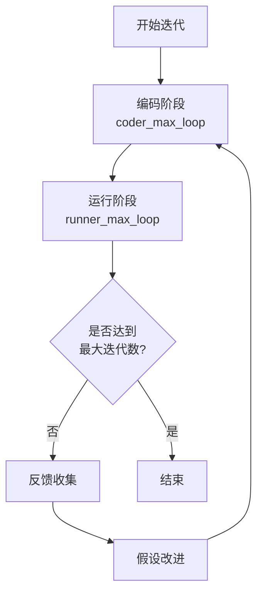

**图表来源**
- [rdagent/app/data_science/conf.py](file://rdagent/app/data_science/conf.py#L85-L86)

#### 配置建议

| 场景类型 | 编码最大循环 | 运行最大循环 | 推荐原因 |
|---------|------------|------------|---------|
| 快速原型 | 3-5 | 2 | 减少计算成本 |
| 复杂任务 | 8-10 | 3 | 平衡质量和效率 |
| 生产部署 | 5-7 | 2 | 稳定性和可靠性优先 |

### 启用缓存机制

RD-Agent提供了多层次的缓存策略来提升性能：

#### 环境缓存配置

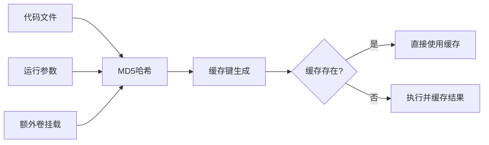

**图表来源**
- [rdagent/utils/env.py](file://rdagent/utils/env.py#L358-L390)

#### 缓存配置参数

| 参数 | 默认值 | 建议值 | 说明 |
|------|-------|-------|------|
| `enable_cache` | `True` | `True` | 启用环境级缓存 |
| `DS_Coder_CoSTEER_max_seconds_multiplier` | `4` | `2-4` | 调整超时倍数 |
| `retry_count` | `5` | `3-5` | 错误重试次数 |
| `retry_wait_seconds` | `10` | `5-10` | 重试等待时间 |

### 并行执行配置

对于支持并行处理的任务，合理配置并发参数可以显著提升性能：

#### 内存和CPU限制

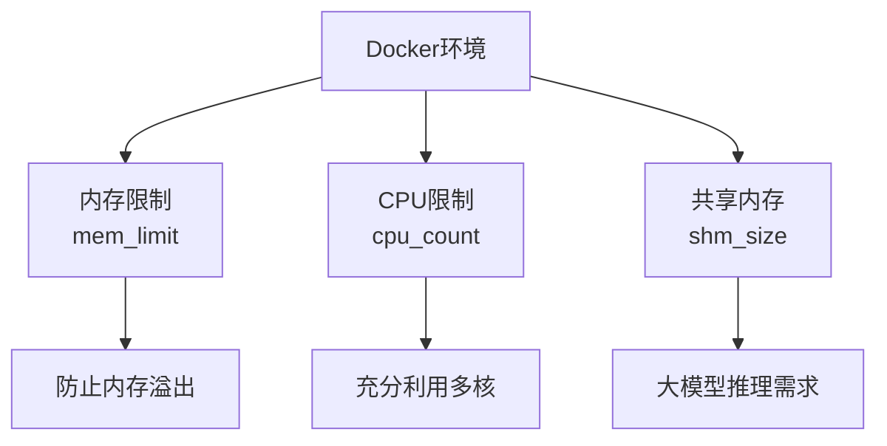

**图表来源**
- [rdagent/utils/env.py](file://rdagent/utils/env.py#L896-L922)

#### 资源配置建议

| 任务类型 | 内存限制 | CPU数量 | 共享内存 | 适用场景 |
|---------|---------|--------|---------|---------|
| 数据科学 | `48g` | `4-8` | `16g` | 中等规模数据分析 |
| 模型训练 | `128g` | `8-16` | `32g` | 深度学习模型 |
| 股票因子 | `32g` | `4-6` | `8g` | 量化交易研究 |

**段落来源**
- [rdagent/utils/env.py](file://rdagent/utils/env.py#L896-L922)

## 调试技巧与监控

### 日志分析策略

RD-Agent提供了完善的日志系统，支持多层级的日志记录和分析：

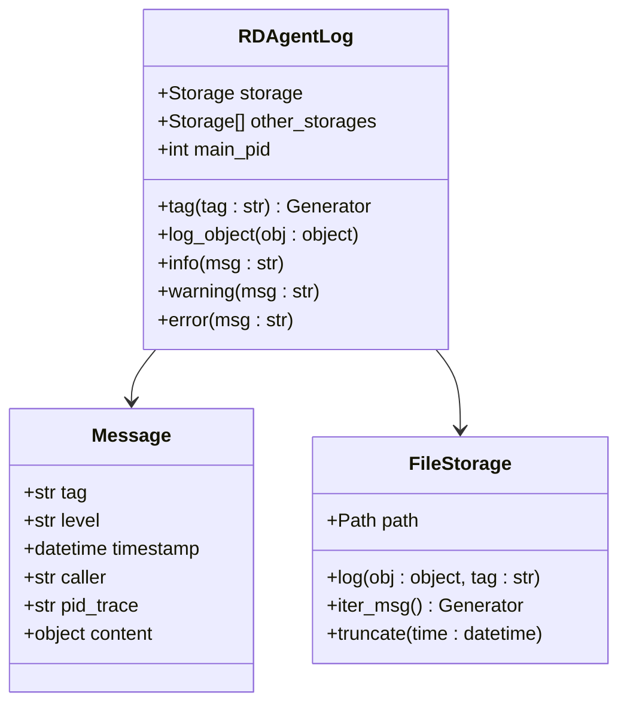

**图表来源**
- [rdagent/log/logger.py](file://rdagent/log/logger.py#L25-L50)
- [rdagent/log/base.py](file://rdagent/log/base.py#L10-L30)

#### 日志级别配置

| 级别 | 用途 | 示例场景 |
|------|------|---------|
| DEBUG | 详细调试信息 | 单步执行跟踪 |
| INFO | 一般信息记录 | 关键步骤标记 |
| WARNING | 警告信息 | 资源不足警告 |
| ERROR | 错误信息 | 执行失败记录 |

### 中间结果检查

#### 环境状态监控

RD-Agent提供了多种方式来监控执行状态：

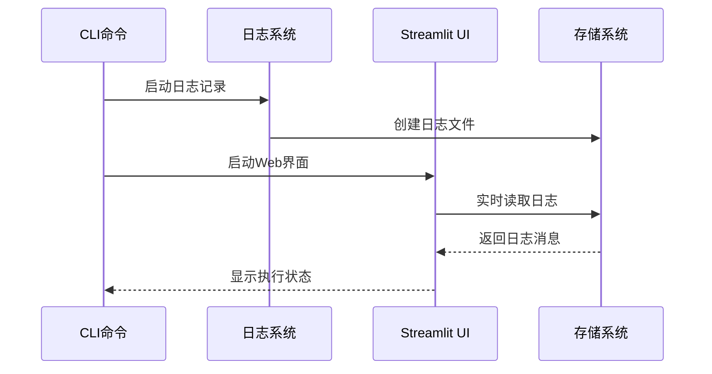

**图表来源**
- [rdagent/log/ui/app.py](file://rdagent/log/ui/app.py#L747-L779)

#### 关键检查点

| 检查点 | 命令 | 输出位置 | 检查内容 |
|-------|------|---------|---------|
| 环境健康 | `rdagent health_check` | 控制台 | Docker、端口占用 |
| 执行状态 | `rdagent ui` | Web界面 | 实时进度跟踪 |
| 日志详情 | `rdagent ui --log-dir ./log` | 文件系统 | 详细执行记录 |

### Streamlit UI监控使用

#### 实时监控界面

RD-Agent提供了直观的Streamlit界面用于实时监控：

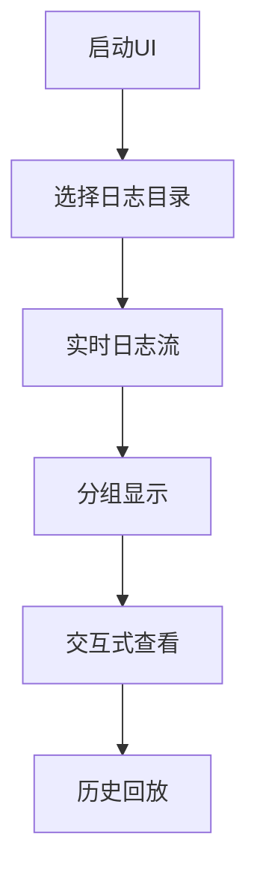

**图表来源**
- [rdagent/log/ui/app.py](file://rdagent/log/ui/app.py#L747-L779)

#### UI功能特性

| 功能 | 描述 | 使用场景 |
|------|------|---------|
| 实时更新 | 自动刷新最新日志 | 监控执行进度 |
| 分组浏览 | 按标签分类显示 | 快速定位问题 |
| 进度控制 | 上一步/下一步导航 | 逐步调试分析 |
| 过滤功能 | 排除特定日志类型 | 清晰关注重点 |

**段落来源**
- [rdagent/log/ui/app.py](file://rdagent/log/ui/app.py#L747-L779)

## 常见问题解决方案

### LLM响应质量下降

#### 问题诊断流程

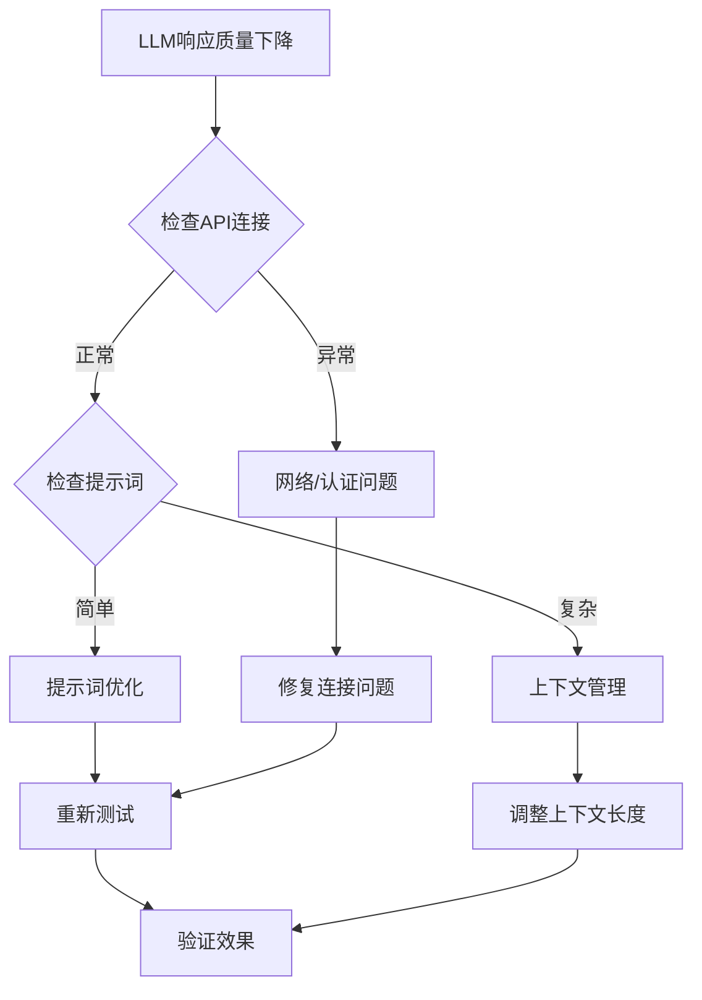

#### 解决方案配置

| 问题类型 | 可能原因 | 解决方案 | 配置参数 |
|---------|---------|---------|---------|
| 响应超时 | 网络延迟 | 增加超时时间 | `LLM_SETTINGS.timeout` |
| 内容过滤 | 敏感词汇 | 修改提示词 | `system_prompt` |
| 格式错误 | 输出格式 | 添加格式要求 | `json_mode` |
| 质量不稳定 | 上下文过长 | 截断上下文 | `max_tokens` |

### 代码执行超时

#### 超时处理机制

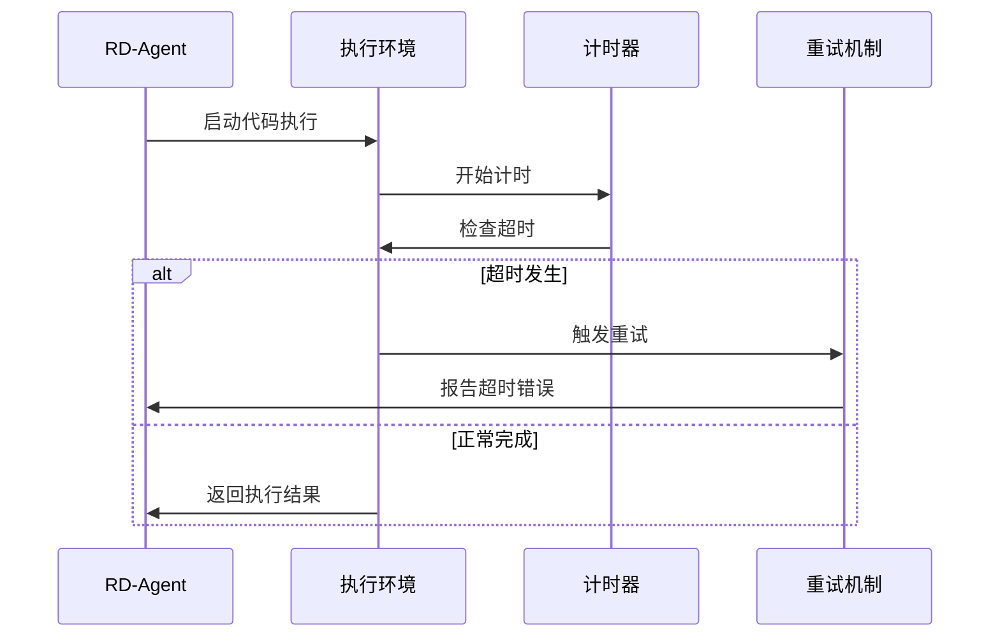

**图表来源**
- [rdagent/utils/env.py](file://rdagent/utils/env.py#L323-L358)

#### 超时配置优化

| 场景 | 默认超时 | 推荐值 | 调整策略 |
|------|---------|-------|---------|
| 调试模式 | 600秒 | 300-600秒 | 根据数据规模调整 |
| 生产环境 | 3600秒 | 1800-3600秒 | 平衡稳定性和速度 |
| 大模型训练 | 7200秒 | 3600-7200秒 | 充分利用计算资源 |

### 依赖冲突解决

#### 环境隔离策略

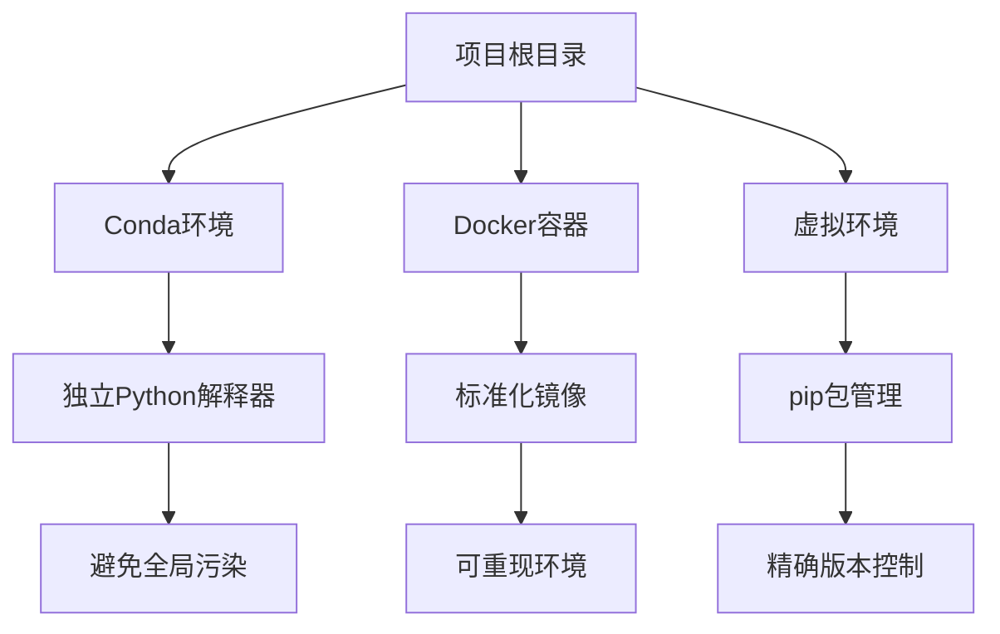

**图表来源**
- [rdagent/utils/env.py](file://rdagent/utils/env.py#L444-L488)

#### 依赖管理最佳实践

| 环境类型 | 优势 | 适用场景 | 注意事项 |
|---------|------|---------|---------|
| Conda | 包管理完善 | 数据科学项目 | 环境切换开销 |
| Docker | 完全隔离 | 生产部署 | 镜像构建时间 |
| 虚拟环境 | 轻量级 | 开发测试 | 版本兼容性 |

**段落来源**
- [rdagent/utils/env.py](file://rdagent/utils/env.py#L444-L488)

## 知识积累与加速

### 知识管理系统

RD-Agent内置了完善的知识管理系统，支持向量存储和图谱构建：

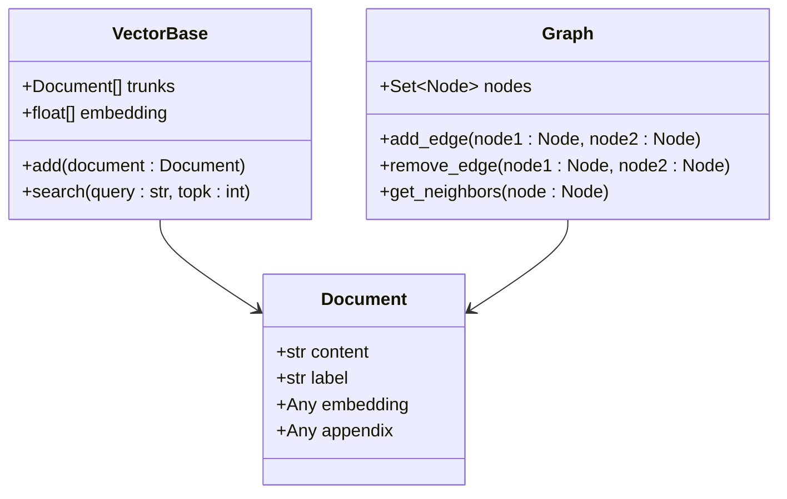

**图表来源**
- [rdagent/components/knowledge_management/vector_base.py](file://rdagent/components/knowledge_management/vector_base.py#L37-L83)
- [rdagent/components/knowledge_management/graph.py](file://rdagent/components/knowledge_management/graph.py#L0-L41)

### 知识积累策略

#### 向量知识库配置

| 组件 | 功能 | 配置参数 | 优化建议 |
|------|------|---------|---------|
| 文档嵌入 | 语义表示 | `embedding_model` | 选择高质量嵌入模型 |
| 向量存储 | 持久化 | `vector_db_path` | 定期备份重要知识 |
| 搜索算法 | 相似度匹配 | `similarity_threshold` | 根据精度需求调整 |
| 图谱构建 | 关联关系 | `neighbor_threshold` | 平衡完整性和效率 |

#### 知识更新机制

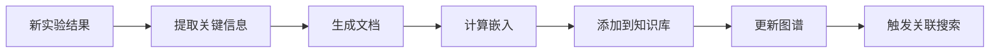

**图表来源**
- [rdagent/components/knowledge_management/vector_base.py](file://rdagent/components/knowledge_management/vector_base.py#L37-L83)

### 加速后续实验

#### 知识复用策略

| 策略 | 实现方式 | 效果 | 适用场景 |
|------|---------|------|---------|
| 模板复用 | 代码模板库 | 减少重复开发 | 相似任务 |
| 参数调优 | 历史最优参数 | 提升收敛速度 | 超参数优化 |
| 结果迁移 | 成功案例复制 | 快速获得基准 | 新任务启动 |
| 关联预测 | 知识图谱推理 | 发现潜在机会 | 创新探索 |

**段落来源**
- [rdagent/components/knowledge_management/graph.py](file://rdagent/components/knowledge_management/graph.py#L0-L41)

## 项目组织与版本控制

### 项目结构最佳实践

#### 推荐目录结构

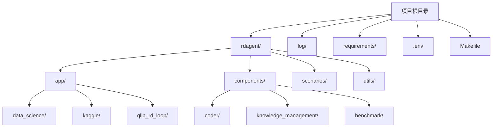

#### 配置文件管理

| 文件类型 | 用途 | 示例 | 注意事项 |
|---------|------|------|---------|
| `.env` | 环境变量 | `CHAT_MODEL=gpt-4o` | 不要提交到版本控制 |
| `pyproject.toml` | 项目配置 | 依赖管理 | 包含所有必要信息 |
| `requirements/` | 依赖清单 | `requirements.txt` | 分环境管理 |
| `Makefile` | 构建脚本 | 自动化任务 | 简化开发流程 |

### 版本控制策略

#### Git工作流程

#### 提交规范

| 类型 | 格式 | 示例 | 说明 |
|------|------|------|------|
| 功能 | `feat(component): description` | `feat(coder): add caching` | 新功能开发 |
| 修复 | `fix(component): description` | `fix(ui): resolve timeout` | Bug修复 |
| 文档 | `docs(component): description` | `docs(readme): update guide` | 文档更新 |
| 性能 | `perf(component): description` | `perf(env): optimize docker` | 性能优化 |

**段落来源**
- [CONTRIBUTING.md](file://CONTRIBUTING.md#L42-L50)

## 生产环境部署

### 资源限制配置

#### 容器资源管理

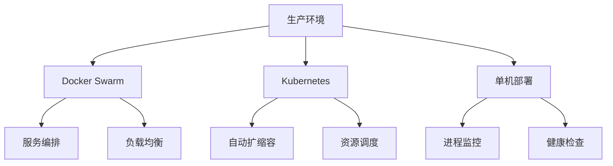

#### 资源配额设置

| 组件 | CPU限制 | 内存限制 | 存储限制 | 网络带宽 |
|------|---------|---------|---------|---------|
| LLM服务 | 2-4核心 | 8-16GB | 100GB | 1Gbps |
| 数据处理 | 4-8核心 | 32-64GB | 500GB | 100Mbps |
| Web服务 | 1-2核心 | 4-8GB | 50GB | 10Mbps |
| 监控服务 | 0.5-1核心 | 2-4GB | 10GB | 1Mbps |

### 错误重试机制

#### 重试策略配置

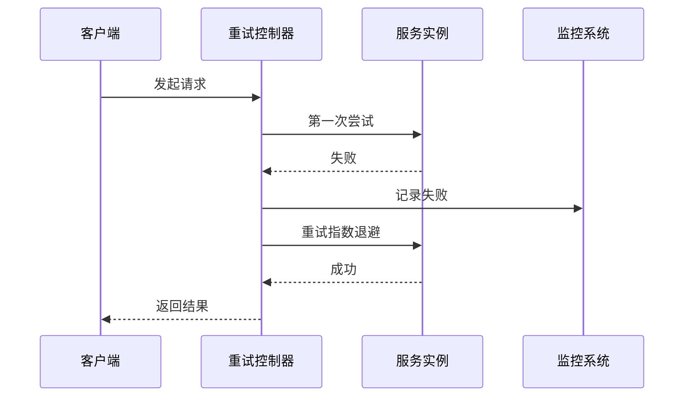

**图表来源**
- [rdagent/utils/workflow/misc.py](file://rdagent/utils/workflow/misc.py#L0-L40)

#### 重试参数优化

| 场景 | 最大重试次数 | 退避策略 | 超时时间 | 适用情况 |
|------|-------------|---------|---------|---------|
| 网络请求 | 5次 | 指数退避 | 30秒 | API调用 |
| 文件操作 | 3次 | 固定间隔 | 60秒 | 数据处理 |
| 模型推理 | 2次 | 立即重试 | 120秒 | 计算密集 |
| 状态查询 | 10次 | 线性增长 | 10秒 | 实时监控 |

### 监控告警设置

#### 监控指标体系

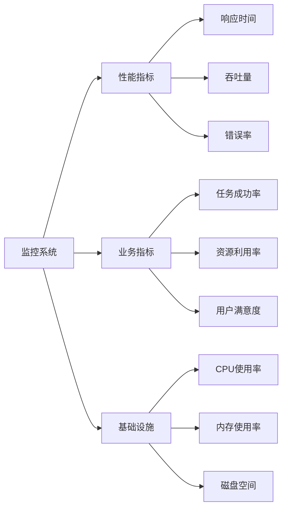

#### 告警规则配置

| 指标 | 告警阈值 | 通知方式 | 处理动作 |
|------|---------|---------|---------|
| 响应时间 | >5秒 | 邮件+短信 | 自动重启 |
| 错误率 | >5% | 邮件+Slack | 人工介入 |
| 内存使用率 | >85% | 邮件 | 扩容或清理 |
| 磁盘空间 | <10% | 邮件 | 清理日志 |

**段落来源**
- [rdagent/oai/backend/base.py](file://rdagent/oai/backend/base.py#L526-L547)

## 总结

RD-Agent作为一个复杂的自动化研发系统，其高效使用需要综合考虑性能优化、调试监控、问题解决、知识管理和生产部署等多个方面。通过遵循本指南中的最佳实践，用户可以：

1. **提升性能**：合理配置迭代参数、启用缓存机制、优化资源使用
2. **增强调试能力**：掌握日志分析技巧、熟练使用Streamlit UI、建立有效的监控体系
3. **快速解决问题**：识别常见问题模式、应用标准解决方案、建立知识库
4. **加速实验进程**：有效管理知识积累、复用成功经验、建立关联预测
5. **确保生产稳定**：实施合理的资源限制、配置完善的重试机制、建立全面的监控告警

持续的实践和优化将使RD-Agent在实际应用中发挥更大的价值，为数据驱动的研发过程带来革命性的改变。