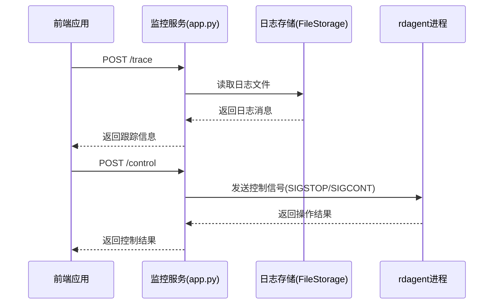
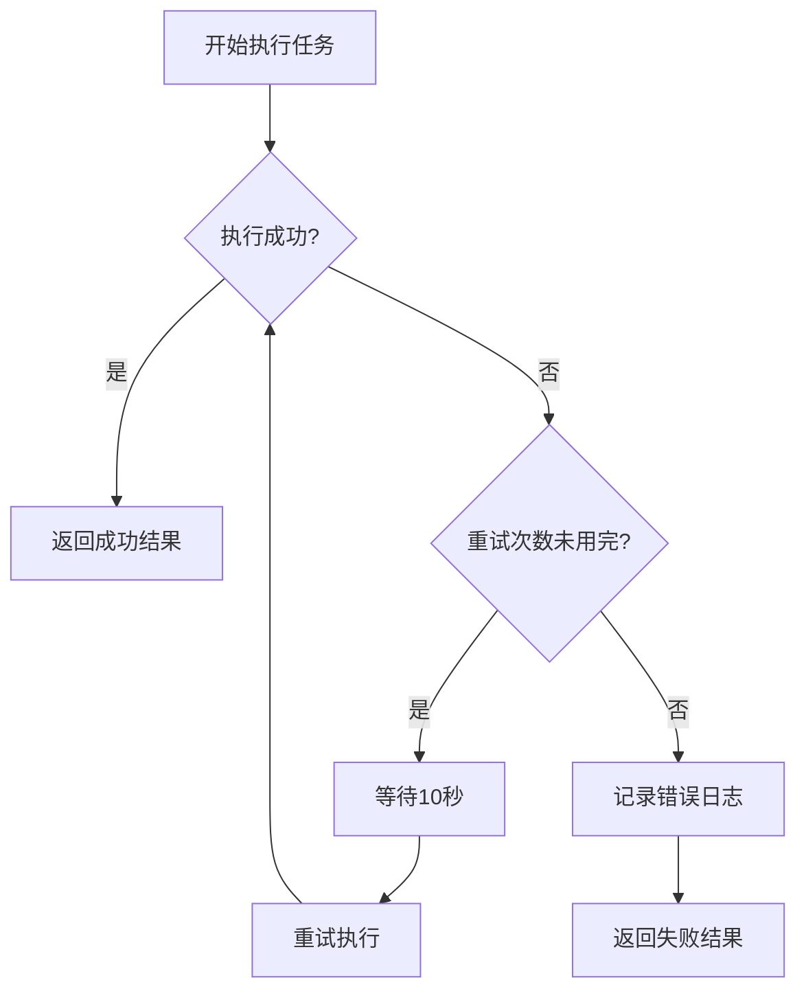
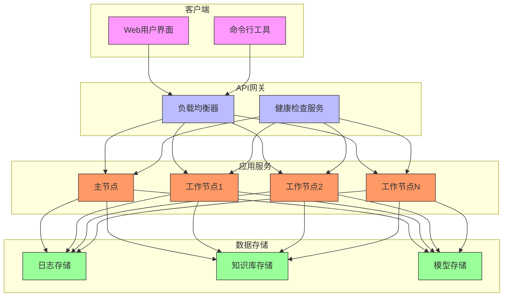

# 生产部署

<cite>
**本文档中引用的文件**  
- [app.py](file://rdagent/log/server/app.py)
- [health_check.py](file://rdagent/app/utils/health_check.py)
- [env.py](file://rdagent/utils/env.py)
- [Dockerfile](file://rdagent/scenarios/qlib/docker/Dockerfile)
- [storage.py](file://rdagent/log/storage.py)
- [ui/app.py](file://rdagent/log/ui/app.py)
</cite>

## 目录
1. [简介](#简介)
2. [Docker容器化运行环境配置](#docker容器化运行环境配置)
3. [多实例部署与负载均衡策略](#多实例部署与负载均衡策略)
4. [监控告警系统搭建](#监控告警系统搭建)
5. [知识库持久化与备份恢复方案](#知识库持久化与备份恢复方案)
6. [错误重试机制和熔断策略](#错误重试机制和熔断策略)
7. [安全防护措施](#安全防护措施)
8. [高可用部署架构图](#高可用部署架构图)
9. [运维手册模板](#运维手册模板)

## 简介
RD-Agent是一个研究与开发智能体系统，旨在自动化科研和开发流程。本指南提供完整的生产环境部署说明，涵盖容器化配置、多实例部署、监控告警、知识库管理、容错机制和安全防护等方面，确保系统在生产环境中的稳定性和可靠性。

## Docker容器化运行环境配置

RD-Agent支持Docker容器化部署，通过Docker实现环境隔离和资源管理。系统提供了多种Docker配置，包括Qlib、Kaggle等场景专用的Docker环境。

### 资源限制配置
在`env.py`中定义了Docker容器的资源限制参数，确保容器不会过度消耗系统资源：

```python
class DockerConf(EnvConf):
    mem_limit: str | None = "48g"  # 内存限制
    cpu_count: int | None = None  # CPU核心数限制
    shm_size: str | None = "16g"  # 共享内存大小
```

这些配置确保每个容器实例有明确的资源边界，防止资源争用导致的系统不稳定。

### 持久化存储配置
系统通过卷挂载实现数据持久化，关键配置如下：

```python
class DockerConf(EnvConf):
    extra_volumes: dict = {
        str(Path("~/.qlib/").expanduser().resolve().absolute()): {"bind": "/root/.qlib/", "mode": "rw"}
    }
    mount_path: str = "/workspace/qlib_workspace/"
```

持久化存储策略包括：
- 主工作区挂载到`/workspace/qlib_workspace/`
- Qlib数据目录挂载到`/root/.qlib/`
- 所有重要数据在容器外部存储，确保容器重启后数据不丢失

### 网络设置
Docker网络配置采用桥接模式，确保容器间通信和外部访问：

```python
class DockerConf(EnvConf):
    network: str | None = "bridge"
```

监控服务使用固定端口19899，可通过环境变量配置：

```python
server_port = 19899
app.run(debug=False, host="0.0.0.0", port=port)
```

**Section sources**
- [env.py](file://rdagent/utils/env.py#L300-L350)
- [app.py](file://rdagent/log/server/app.py#L267-L270)

## 多实例部署与负载均衡策略

RD-Agent支持多实例并行部署，通过负载均衡分发任务请求，提高系统吞吐量和可用性。

### 多实例部署架构
系统采用主从架构，一个主节点负责任务调度，多个工作节点执行具体任务：

```python
rdagent_processes = defaultdict()
```

每个任务运行在独立的子进程中，通过进程ID进行管理，实现任务隔离。

### 负载均衡策略
负载均衡通过以下机制实现：
1. **任务队列管理**：使用`defaultdict`存储所有运行中的进程
2. **端口动态分配**：当默认端口19899被占用时，系统自动检测可用端口

```python
def is_port_in_use(port):
    with socket.socket(socket.AF_INET, socket.SOCK_STREAM) as s:
        return s.connect_ex(("127.0.0.1", port)) == 0

def check_and_list_free_ports(start_port=19899, max_ports=10):
    free_ports = []
    for port in range(start_port, start_port + max_ports):
        if not is_port_in_use(port):
            free_ports.append(port)
    return free_ports
```

3. **健康检查集成**：定期检查各实例的运行状态

```python
def check_docker_status():
    try:
        client = docker.from_env()
        client.images.pull("hello-world")
        container = client.containers.run("hello-world", detach=True)
        return True
    except docker.errors.DockerException as e:
        return False
```

**Section sources**
- [app.py](file://rdagent/log/server/app.py#L15-L16)
- [health_check.py](file://rdagent/app/utils/health_check.py#L20-L45)

## 监控告警系统搭建

RD-Agent内置了完善的监控系统，基于`app.py`实现服务状态监控和实时告警。

### 服务状态监控
监控系统通过Flask Web服务暴露API接口，提供实时状态查询：



**Diagram sources**
- [app.py](file://rdagent/log/server/app.py#L100-L250)

### 监控API接口
系统提供以下监控API：

| 接口 | 方法 | 功能 |
|------|------|------|
| `/trace` | POST | 获取任务跟踪信息 |
| `/upload` | POST | 上传新任务 |
| `/receive` | POST | 接收日志消息 |
| `/control` | POST | 控制进程（暂停/恢复/停止） |
| `/test` | GET | 测试服务状态 |

### 告警机制
告警系统通过日志分析和异常检测实现：

```python
@app.route("/control", methods=["POST"])
def control_process():
    data = request.get_json()
    id = str(log_folder_path / data["id"])
    action = data["action"]
    
    if id not in rdagent_processes:
        return jsonify({"error": "No running process for given id"}), 400
        
    if process.poll() is not None:
        return jsonify({"error": "Process has already terminated"}), 400
```

当检测到异常时，系统会返回相应的错误码和消息，便于上层监控系统捕获和处理。

**Section sources**
- [app.py](file://rdagent/log/server/app.py#L100-L250)

## 知识库持久化与备份恢复方案

RD-Agent实现了知识库的持久化存储和备份恢复机制，确保知识资产的安全和可恢复性。

### 知识库持久化
系统使用`KnowledgeBase`类实现知识库的序列化存储：

```python
class KnowledgeBase:
    def __init__(self, path: str | Path | None = None) -> None:
        self.path = Path(path) if path else None
        self.load()

    def load(self) -> None:
        if self.path is not None and self.path.exists():
            with self.path.open("rb") as f:
                loaded = pickle.load(f)
                if isinstance(loaded, dict):
                    self.__dict__.update({k: v for k, v in loaded.items() if k != "path"})
                else:
                    self.__dict__.update({k: v for k, v in loaded.__dict__.items() if k != "path"})

    def dump(self) -> None:
        if self.path is not None:
            self.path.parent.mkdir(parents=True, exist_ok=True)
            pickle.dump(self.__dict__, self.path.open("wb"))
        else:
            logger.warning("KnowledgeBase path is not set, dump failed.")
```

### 备份恢复方案
备份恢复通过以下机制实现：
1. **自动备份**：在知识库更新时自动保存
2. **定期快照**：结合外部备份系统定期创建快照
3. **灾难恢复**：从备份文件快速恢复知识库

```python
def dump_knowledge_base(self):
    if self.dump_knowledge_base_path is None:
        logger.warning("Dump knowledge base path is not set, skip dumping.")
    else:
        if not self.dump_knowledge_base_path.parent.exists():
            self.dump_knowledge_base_path.parent.mkdir(parents=True, exist_ok=True)
        with open(self.dump_knowledge_base_path, "wb") as f:
            pickle.dump(self.knowledgebase, f)

def load_dumped_knowledge_base(self, *args, **kwargs):
    if self.dump_knowledge_base_path is None:
        logger.warning("Dump knowledge base path is not set, skip dumping.")
    elif not Path(self.dump_knowledge_base_path).exists():
        logger.info(f"Dumped knowledge base {self.dump_knowledge_base_path} does not exist, skip loading.")
    else:
        with open(self.dump_knowledge_base_path, "rb") as f:
            self.knowledgebase = pickle.load(f)
```

### 数据完整性保障
系统通过以下方式确保数据完整性：
- 路径存在性检查
- 父目录自动创建
- 异常处理和日志记录
- 原子性写操作

**Section sources**
- [knowledge_base.py](file://rdagent/core/knowledge_base.py#L1-L26)
- [knowledge_management.py](file://rdagent/components/coder/CoSTEER/knowledge_management.py#L71-L101)

## 错误重试机制和熔断策略

RD-Agent实现了健壮的错误处理机制，包括重试策略和熔断保护。

### 错误重试机制
系统在`env.py`中定义了统一的重试机制：

```python
class EnvConf(ExtendedBaseSettings):
    retry_count: int = 5  # 重试次数
    retry_wait_seconds: int = 10  # 重试等待时间

def __run_with_retry(
    self,
    entry: str | None = None,
    local_path: str = ".",
    env: dict | None = None,
    running_extra_volume: Mapping = MappingProxyType({}),
) -> EnvResult:
    for retry_index in range(self.conf.retry_count + 1):
        try:
            start = time.time()
            log_output, return_code = self._run(
                entry,
                local_path,
                env,
                running_extra_volume=running_extra_volume,
            )
            end = time.time()
            return EnvResult(log_output, return_code, end - start)
        except Exception as e:
            if retry_index == self.conf.retry_count:
                raise
            logger.warning(
                f"Error while running the container: {e}, current try index: {retry_index + 1}, {self.conf.retry_count - retry_index - 1} retries left."
            )
            time.sleep(self.conf.retry_wait_seconds)
```

### 熔断策略
熔断策略通过超时控制和资源限制实现：

```python
class DockerConf(EnvConf):
    running_timeout_period: int | None = 3600  # 运行超时时间（秒）
    
def run(self, entry: str | None = None, local_path: str = ".", env: dict | None = None, **kwargs: dict) -> EnvResult:
    if self.conf.running_timeout_period is None:
        timeout_cmd = entry
    else:
        timeout_cmd = f"timeout --kill-after=10 {self.conf.running_timeout_period} {entry}"
```

当任务执行时间超过3600秒时，系统会强制终止进程，防止长时间运行的任务影响整体系统性能。

### 异常处理流程


**Diagram sources**
- [env.py](file://rdagent/utils/env.py#L200-L250)

## 安全防护措施

RD-Agent实施了多层次的安全防护措施，包括API密钥管理、输入验证和访问控制。

### API密钥管理
系统通过环境变量管理API密钥，支持多种后端服务：

```python
def env_check():
    if "BACKEND" not in os.environ:
        logger.warning("We did not find BACKEND in your configuration...")
        
    if "DEEPSEEK_API_KEY" in os.environ:
        chat_api_key = os.getenv("DEEPSEEK_API_KEY")
        chat_model = os.getenv("CHAT_MODEL")
        embedding_model = os.getenv("EMBEDDING_MODEL")
    elif "OPENAI_API_KEY" in os.environ:
        chat_api_key = os.getenv("OPENAI_API_KEY")
        chat_api_base = os.getenv("OPENAI_API_BASE")
    else:
        logger.error("No valid configuration was found...")
```

### 输入验证
系统对所有用户输入进行严格验证：

```python
@app.route("/upload", methods=["POST"])
def upload_file():
    scenario = request.form.get("scenario")
    files = request.files.getlist("files")
    competition = request.form.get("competition")
    
    # 验证场景参数
    if not scenario:
        return jsonify({"error": "Scenario is required"}), 400
        
    # 验证文件类型
    for file in files:
        if file and not file.filename.lower().endswith(".pdf"):
            return jsonify({"error": "Invalid file type"}), 400
            
    # 路径安全检查
    target_path = (p / sanitized_filename).resolve()
    if os.path.commonpath([str(target_path), str(p)]) != str(p):
        return jsonify({"error": "Invalid file path"}), 400
```

### 访问控制
访问控制通过以下机制实现：
1. **进程级隔离**：每个任务在独立进程中运行
2. **文件系统隔离**：使用Docker容器隔离文件系统
3. **网络访问控制**：限制容器网络访问权限

```python
class DockerConf(EnvConf):
    extra_volume_mode: str = "ro"  # 额外卷默认为只读模式
    network: str | None = "bridge"  # 使用桥接网络模式
```

**Section sources**
- [health_check.py](file://rdagent/app/utils/health_check.py#L80-L150)
- [app.py](file://rdagent/log/server/app.py#L150-L200)

## 高可用部署架构图



**Diagram sources**
- [app.py](file://rdagent/log/server/app.py)
- [env.py](file://rdagent/utils/env.py)

## 运维手册模板

### 日常运维检查清单
1. **服务状态检查**
   - 检查主节点和工作节点是否正常运行
   - 验证API端口19899是否可访问
   - 确认Docker服务正常运行

2. **资源使用监控**
   - 监控内存使用情况（不超过48GB限制）
   - 检查CPU使用率
   - 监控磁盘空间使用

3. **日志检查**
   - 查看系统日志是否有错误信息
   - 检查任务执行日志
   - 监控知识库更新日志

### 故障处理流程
1. **服务不可用**
   ```bash
   # 检查Docker状态
   rdagent health_check --no-check-env
   
   # 检查端口占用
   rdagent health_check --check-ports
   ```

2. **任务执行失败**
   - 检查容器日志
   - 验证API密钥配置
   - 检查输入文件格式

3. **性能下降**
   - 检查资源限制配置
   - 优化任务队列大小
   - 调整重试策略参数

### 备份恢复操作
1. **知识库备份**
   ```python
   # 手动触发知识库备份
   knowledge_base.dump()
   ```

2. **数据恢复**
   ```python
   # 从备份文件恢复知识库
   knowledge_base.load_dumped_knowledge_base()
   ```

3. **灾难恢复**
   - 重新部署Docker容器
   - 恢复持久化存储数据
   - 重启监控服务

**Section sources**
- [app.py](file://rdagent/log/server/app.py)
- [health_check.py](file://rdagent/app/utils/health_check.py)
- [env.py](file://rdagent/utils/env.py)