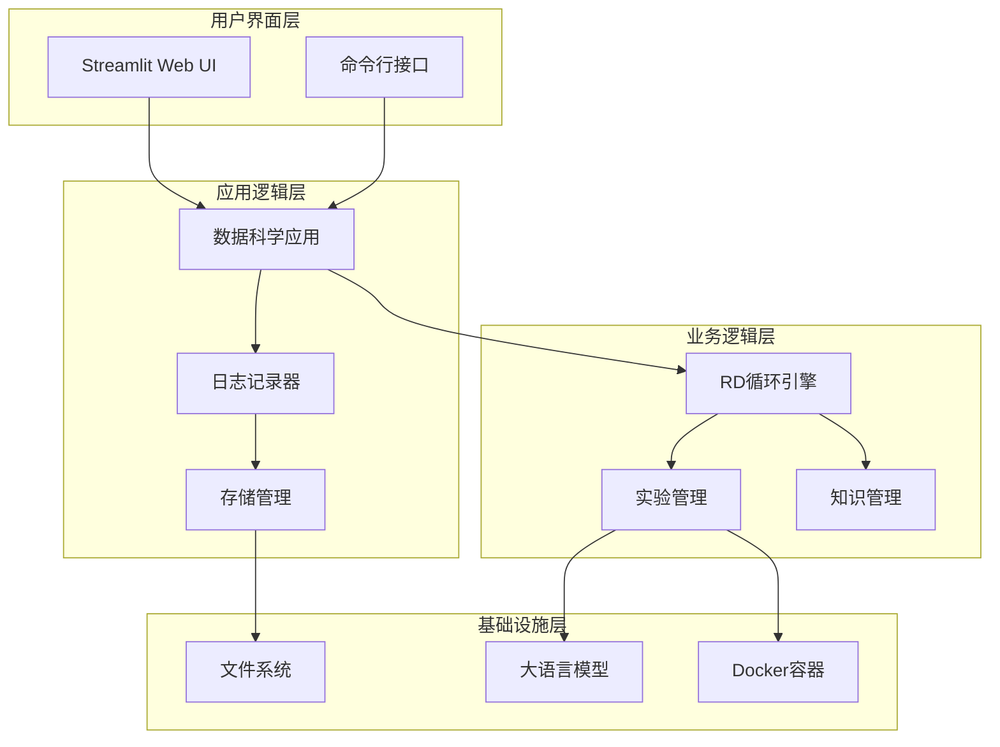
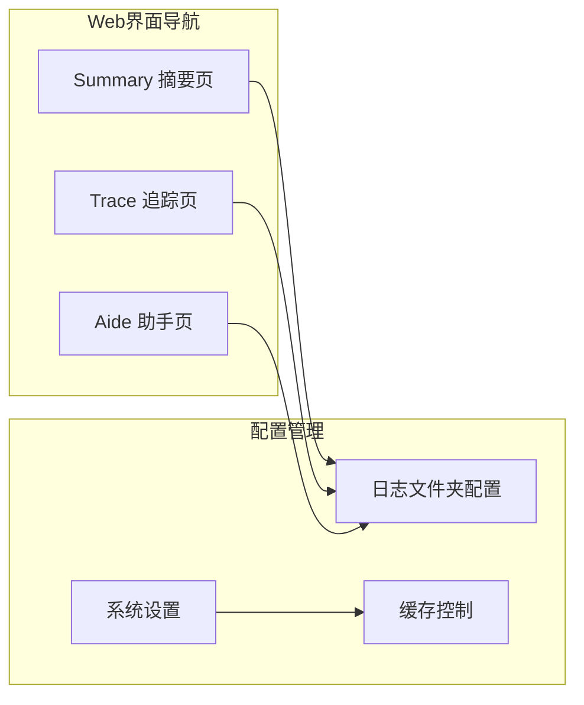
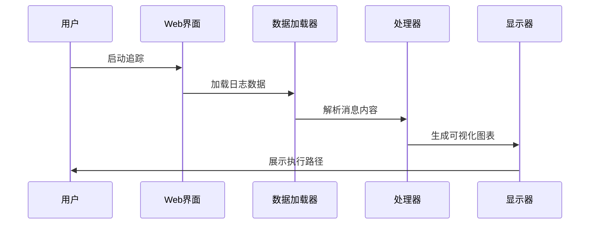
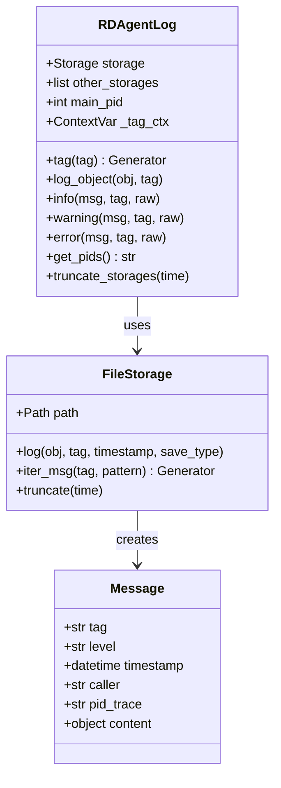
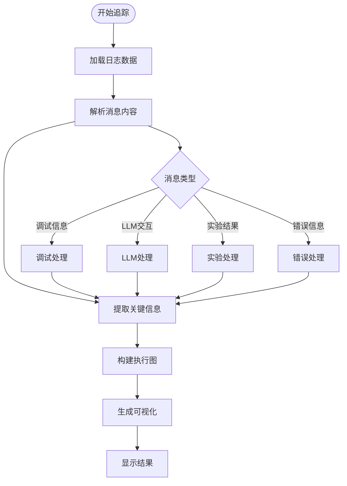
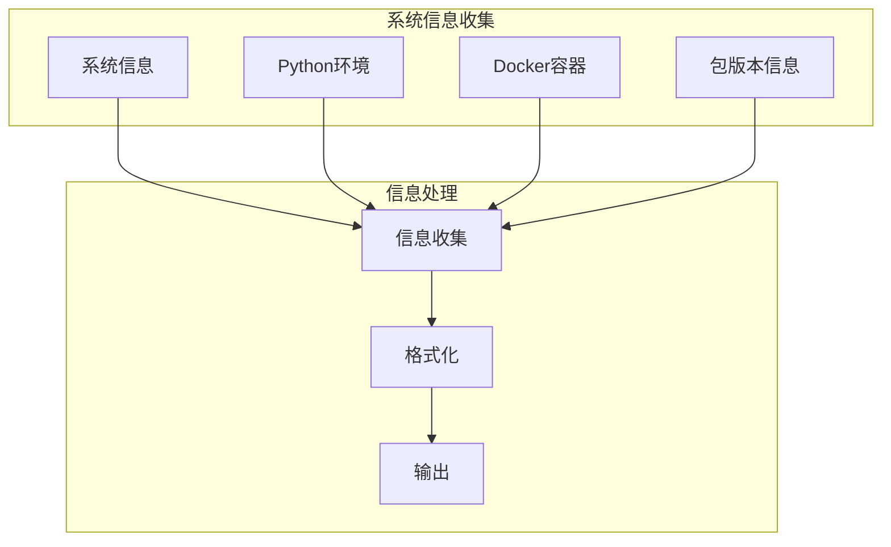
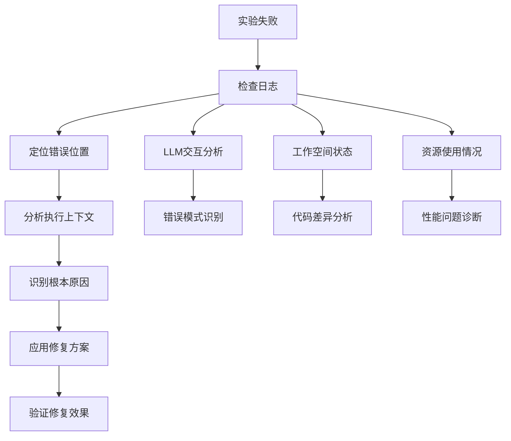
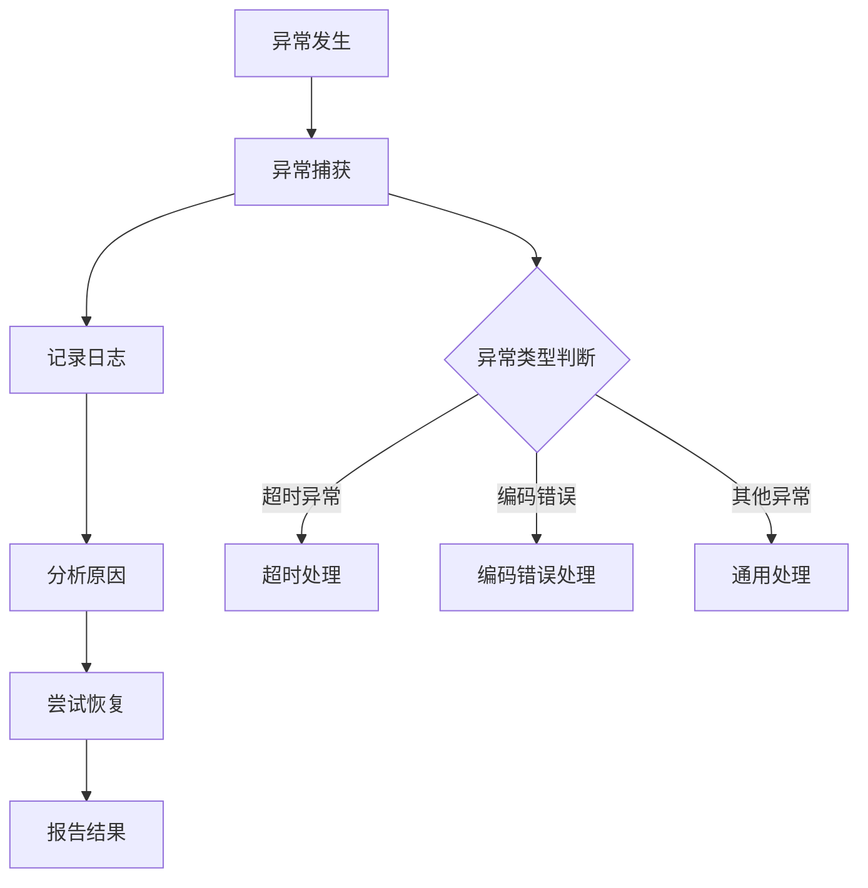

# RD-Agent 调试方法论

<cite>
**本文档引用的文件**
- [dsapp.py](file://rdagent/log/ui/dsapp.py)
- [ds_trace.py](file://rdagent/log/ui/ds_trace.py)
- [info.py](file://rdagent/app/utils/info.py)
- [logger.py](file://rdagent/log/logger.py)
- [storage.py](file://rdagent/log/storage.py)
- [conf.py](file://rdagent/log/ui/conf.py)
- [utils.py](file://rdagent/log/ui/utils.py)
- [base.py](file://rdagent/log/base.py)
- [aide.py](file://rdagent/log/ui/aide.py)
- [ds_summary.py](file://rdagent/log/ui/ds_summary.py)
- [conf.py](file://rdagent/log/conf.py)
- [__init__.py](file://rdagent/log/utils/__init__.py)
</cite>

## 目录
1. [概述](#概述)
2. [系统架构](#系统架构)
3. [Streamlit Web UI 调试界面](#streamlit-web-ui-调试界面)
4. [日志系统与追踪机制](#日志系统与追踪机制)
5. [执行路径追踪技术](#执行路径追踪技术)
6. [系统运行时信息获取](#系统运行时信息获取)
7. [典型调试场景](#典型调试场景)
8. [代码级调试技巧](#代码级调试技巧)
9. [故障排除指南](#故障排除指南)
10. [最佳实践建议](#最佳实践建议)

## 概述

RD-Agent是一个复杂的自主研发系统，采用多层架构设计，包含数据科学实验循环、知识管理系统、LLM交互模块等核心组件。本调试方法论提供了系统性的调试策略，涵盖从Web界面可视化追踪到底层代码级调试的全方位解决方案。

## 系统架构

RD-Agent采用分层架构设计，主要包含以下核心层次：



**图表来源**
- [dsapp.py](file://rdagent/log/ui/dsapp.py#L1-L52)
- [logger.py](file://rdagent/log/logger.py#L1-L137)
- [storage.py](file://rdagent/log/storage.py#L1-L117)

## Streamlit Web UI 调试界面

### dsapp.py 主界面

dsapp.py是RD-Agent的核心Web调试界面，提供三个主要功能页面：



**图表来源**
- [dsapp.py](file://rdagent/log/ui/dsapp.py#L25-L52)

#### 实验流程监控

Web界面提供实时的实验流程监控功能：

1. **日志文件夹管理**：支持多路径配置和动态切换
2. **实验状态概览**：显示当前实验的执行进度和状态
3. **性能指标展示**：包括LLM调用次数、超时统计等

#### 中间结果查看

通过Trace页面可以查看详细的中间结果：

- **代码演进过程**：跟踪代码的迭代变化
- **实验工作空间**：查看每次实验的文件状态
- **反馈信息**：显示LLM提供的改进建议

#### 知识库状态检查

Aide页面用于检查知识库的状态和推理过程：

- **节点关系分析**：查看知识节点之间的关联
- **推理轨迹**：跟踪智能体的决策过程
- **差异对比**：比较不同版本的代码差异

**章节来源**
- [dsapp.py](file://rdagent/log/ui/dsapp.py#L1-L52)
- [aide.py](file://rdagent/log/ui/aide.py#L1-L54)

### ds_trace.py 执行追踪

ds_trace.py是专门的执行路径追踪工具，提供深度的执行过程可视化：



**图表来源**
- [ds_trace.py](file://rdagent/log/ui/ds_trace.py#L1-L100)

#### 日志数据解析

追踪系统能够解析多种类型的消息：

1. **调试信息**：包含详细的执行上下文
2. **LLM交互**：记录与大语言模型的对话
3. **实验结果**：保存实验的最终输出
4. **错误信息**：捕获和记录异常情况

#### 可视化展示

- **时间线图**：展示各阶段的执行时间分布
- **决策树**：显示实验分支的选择过程
- **性能曲线**：跟踪指标随时间的变化趋势

**章节来源**
- [ds_trace.py](file://rdagent/log/ui/ds_trace.py#L1-L799)

## 日志系统与追踪机制

### RDAgentLog 核心类

RD-Agent的日志系统基于RDAgentLog类实现，提供结构化的日志记录能力：



**图表来源**
- [logger.py](file://rdagent/log/logger.py#L20-L137)
- [storage.py](file://rdagent/log/storage.py#L25-L117)
- [base.py](file://rdagent/log/base.py#L10-L25)

### 日志级别与格式

系统支持标准的日志级别：

| 级别 | 用途 | 示例场景 |
|------|------|----------|
| DEBUG | 详细调试信息 | 变量值、函数参数 |
| INFO | 一般信息记录 | 实验开始、完成通知 |
| WARNING | 警告信息 | 性能问题、潜在风险 |
| ERROR | 错误信息 | 异常捕获、失败处理 |
| CRITICAL | 严重错误 | 系统崩溃、数据丢失 |

### 标签系统

日志标签采用层次化命名规范：
- `experiment.coding.evolution_1`：表示实验编码阶段的第一次演化
- `direct_exp_gen.hypothesis`：直接实验生成的假设信息
- `running.mle_score`：运行阶段的模型评估分数

**章节来源**
- [logger.py](file://rdagent/log/logger.py#L1-L137)
- [storage.py](file://rdagent/log/storage.py#L1-L117)
- [base.py](file://rdagent/log/base.py#L1-L104)

## 执行路径追踪技术

### ds_trace.py 核心功能

ds_trace.py提供了强大的执行路径追踪能力：



**图表来源**
- [ds_trace.py](file://rdagent/log/ui/ds_trace.py#L80-L200)

### 追踪数据分析

系统能够分析多种类型的追踪数据：

1. **时间统计分析**：计算各阶段的执行时间
2. **成功率分析**：统计实验的成功率和失败原因
3. **性能瓶颈识别**：找出执行过程中的性能瓶颈
4. **资源消耗分析**：监控内存和CPU使用情况

### 可视化图表生成

- **甘特图**：展示任务的时间分布
- **热力图**：显示执行频率和强度
- **网络图**：描绘任务间的依赖关系

**章节来源**
- [ds_trace.py](file://rdagent/log/ui/ds_trace.py#L200-L400)

## 系统运行时信息获取

### info.py 工具模块

info.py提供了系统运行时信息的收集和展示功能：



**图表来源**
- [info.py](file://rdagent/app/utils/info.py#L1-L87)

### 收集的信息类型

#### 系统基本信息
- 操作系统名称和版本
- 处理器架构信息
- 系统平台详情
- 版本号信息

#### Python环境信息
- Python版本号
- 环境配置详情

#### Docker容器信息
- 容器ID和名称
- 容器状态和标签
- 端口映射配置
- 启动命令

#### 包版本信息
- RD-Agent版本
- 依赖包列表和版本
- GitHub仓库信息

### 使用方法

通过命令行工具可以快速获取系统信息：
```bash
python -m rdagent.app.utils.info
```

**章节来源**
- [info.py](file://rdagent/app/utils/info.py#L1-L87)

## 典型调试场景

### 场景一：实验执行失败

当实验执行失败时，可按以下步骤进行调试：



#### 操作流程

1. **启动Web界面**：运行 `python -m rdagent.app.cli data_science`
2. **选择日志文件夹**：在界面中指定包含失败实验的日志目录
3. **查看失败实验**：在Summary页面找到失败的实验记录
4. **分析错误详情**：进入Trace页面查看详细的错误信息
5. **检查工作空间**：对比成功和失败实验的工作空间差异

### 场景二：性能优化调试

针对性能问题的调试流程：

1. **收集性能数据**：使用info.py获取系统配置信息
2. **分析时间统计**：在Web界面查看各阶段的执行时间
3. **识别瓶颈**：通过可视化图表定位性能瓶颈
4. **优化策略**：根据分析结果调整配置或算法

### 场景三：知识库问题调试

当知识库出现问题时：

1. **检查知识节点**：使用Aide页面查看知识节点状态
2. **分析推理轨迹**：跟踪智能体的决策过程
3. **验证知识质量**：检查知识的有效性和准确性
4. **更新知识库**：根据调试结果更新知识内容

**章节来源**
- [ds_summary.py](file://rdagent/log/ui/ds_summary.py#L1-L209)
- [aide.py](file://rdagent/log/ui/aide.py#L1-L54)

## 代码级调试技巧

### 断点设置与变量检查

虽然RD-Agent主要通过日志进行调试，但在必要时也可以进行代码级调试：

#### 调试装饰器

```python
# 示例：函数执行信息打印装饰器
def debug_info_print(func):
    def wrapper(*args, **kwargs):
        # 打印函数入口信息
        print(f"Entering {func.__name__} with args: {args}, kwargs: {kwargs}")
        
        # 设置调试跟踪
        def local_trace(frame, event, arg):
            if event == 'line':
                print(f"Line {frame.f_lineno}: {frame.f_code.co_name}")
            return local_trace
            
        sys.settrace(local_trace)
        
        try:
            return func(*args, **kwargs)
        finally:
            sys.settrace(None)
            
    return wrapper
```

#### 变量检查技巧

1. **局部变量访问**：通过`frame.f_locals`访问函数局部变量
2. **全局变量检查**：使用`frame.f_globals`查看全局命名空间
3. **对象状态分析**：使用`vars()`函数查看对象属性

### 异常捕获与处理

系统提供了完善的异常处理机制：



**图表来源**
- [logger.py](file://rdagent/log/logger.py#L120-L137)

### 日志级别调试

合理使用不同级别的日志：

1. **DEBUG级别**：用于详细的调试信息，通常只在开发环境中启用
2. **INFO级别**：记录重要的程序事件和状态变化
3. **WARNING级别**：记录潜在的问题但不影响程序继续运行
4. **ERROR级别**：记录错误事件，可能影响部分功能
5. **CRITICAL级别**：记录严重错误，可能导致程序终止

**章节来源**
- [logger.py](file://rdagent/log/logger.py#L120-L137)
- [__init__.py](file://rdagent/log/utils/__init__.py#L1-L130)

## 故障排除指南

### 常见问题及解决方案

#### Web界面无法启动

**症状**：Streamlit界面无法正常启动或显示空白页面

**排查步骤**：
1. 检查端口占用情况：`netstat -an | grep 8501`
2. 验证日志文件夹路径是否正确
3. 检查浏览器控制台错误信息
4. 尝试使用不同的浏览器

**解决方案**：
```bash
# 更换端口
python -m rdagent.app.cli data_science --port 8502

# 清理缓存
export UI_ENABLE_CACHE=false
```

#### 日志文件读取失败

**症状**：Web界面无法加载日志数据或显示错误信息

**排查步骤**：
1. 检查日志文件权限：`ls -la log/`
2. 验证文件格式是否正确
3. 检查磁盘空间是否充足
4. 确认文件编码格式

**解决方案**：
```python
# 手动验证日志文件
from rdagent.log.storage import FileStorage
storage = FileStorage("log/path")
for msg in storage.iter_msg():
    print(f"Tag: {msg.tag}, Content: {type(msg.content)}")
```

#### 实验执行超时

**症状**：实验在某个阶段长时间无响应

**排查步骤**：
1. 检查系统资源使用情况
2. 分析LLM调用耗时
3. 查看工作空间文件大小
4. 检查网络连接状态

**解决方案**：
```python
# 增加超时时间
DS_RD_SETTING.allow_longer_timeout = True
DS_RD_SETTING.coding_timeout = 3600  # 1小时
```

### 性能问题诊断

#### 内存泄漏检测

1. **监控内存使用**：定期检查Python进程的内存占用
2. **分析对象引用**：使用`gc.get_objects()`分析内存中的对象
3. **清理临时数据**：及时删除不需要的日志文件和中间结果

#### CPU使用率过高

1. **分析热点函数**：使用性能分析工具定位CPU密集型操作
2. **优化算法复杂度**：改进关键算法的实现
3. **并发处理**：合理使用多进程或多线程

### 网络连接问题

#### LLM服务连接失败

**症状**：与大语言模型服务的连接经常失败

**排查步骤**：
1. 检查网络连接状态
2. 验证API密钥有效性
3. 测试服务可用性
4. 检查防火墙设置

**解决方案**：
```python
# 配置重试机制
from rdagent.utils.workflow.misc import wait_retry

@wait_retry(retry_n=3, sleep_time=5)
def call_llm_api():
    # LLM API调用代码
    pass
```

**章节来源**
- [dsapp.py](file://rdagent/log/ui/dsapp.py#L40-L52)
- [logger.py](file://rdagent/log/logger.py#L85-L123)

## 最佳实践建议

### 日志管理最佳实践

1. **合理的日志级别使用**
   - 开发阶段使用DEBUG级别获取详细信息
   - 生产环境使用INFO级别记录重要事件
   - 关键错误使用ERROR级别确保不被遗漏

2. **结构化日志记录**
   ```python
   # 推荐的结构化日志格式
   logger.info("Experiment started", 
               extra={"experiment_id": exp_id, 
                      "stage": "coding", 
                      "timestamp": datetime.now()})
   ```

3. **日志轮转策略**
   - 定期清理过期的日志文件
   - 按大小或时间进行日志分割
   - 保留关键时期的完整日志

### 调试效率提升

1. **自动化调试脚本**
   - 编写自动化的日志分析脚本
   - 创建重复使用的调试工具
   - 建立标准化的调试流程

2. **可视化辅助工具**
   - 利用Web界面进行实时监控
   - 创建自定义的图表和仪表板
   - 集成第三方可视化工具

3. **团队协作调试**
   - 建立共享的调试知识库
   - 制定统一的调试标准和流程
   - 定期进行调试经验分享

### 系统维护建议

1. **定期健康检查**
   - 检查系统资源使用情况
   - 验证关键功能的正常运行
   - 监控性能指标的变化趋势

2. **备份和恢复策略**
   - 定期备份重要的日志和配置文件
   - 建立快速恢复机制
   - 测试灾难恢复流程

3. **持续优化**
   - 基于调试经验优化系统配置
   - 更新调试工具和脚本
   - 改进监控和报警机制

通过遵循这些最佳实践，可以显著提高RD-Agent系统的可维护性和调试效率，确保系统的稳定运行和持续改进。