# RD-Agent系统核心数据流分析

<cite>
**本文档引用的文件**
- [scenario.py](file://rdagent/core/scenario.py)
- [experiment.py](file://rdagent/core/experiment.py)
- [proposal.py](file://rdagent/core/proposal.py)
- [knowledge_base.py](file://rdagent/core/knowledge_base.py)
- [rd_loop.py](file://rdagent/components/workflow/rd_loop.py)
- [loop.py](file://rdagent/utils/workflow/loop.py)
- [evolving_framework.py](file://rdagent/core/evolving_framework.py)
- [tracking.py](file://rdagent/utils/workflow/tracking.py)
- [base.py](file://rdagent/scenarios/data_science/propagation/exp_gen/base.py)
- [experiment.py](file://rdagent/scenarios/data_science/experiment/experiment.py)
- [pipeline.py](file://rdagent/components/coder/data_science/pipeline/__init__.py)
</cite>

## 目录
1. [引言](#引言)
2. [系统架构概览](#系统架构概览)
3. [核心数据流路径](#核心数据流路径)
4. [LoopBase异步循环机制](#loopbase异步循环机制)
5. [WorkflowTracker状态跟踪](#workflowtracker状态跟踪)
6. [EvoStep泛型类设计](#evostep泛型类设计)
7. [数据序列化与反序列化](#数据序列化与反序列化)
8. [完整的数据流图](#完整的数据流图)
9. [总结](#总结)

## 引言

RD-Agent是一个基于演化的智能代理系统，通过循环迭代的方式不断优化解决方案。本文档深入分析系统的核心数据流路径，从用户输入配置开始，经过Scenario初始化、Experiment对象创建、Proposal生成、代码生成、实验执行、反馈评估，最终更新知识库并影响下一轮提案的完整数据流转过程。

## 系统架构概览

RD-Agent采用分层架构设计，主要包含以下核心组件：

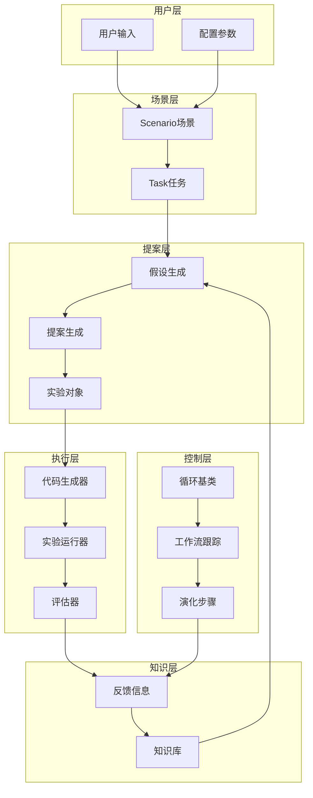

**图表来源**
- [scenario.py](file://rdagent/core/scenario.py#L1-L65)
- [experiment.py](file://rdagent/core/experiment.py#L1-L483)
- [proposal.py](file://rdagent/core/proposal.py#L1-L390)

## 核心数据流路径

### 1. 用户输入配置阶段

系统从用户输入和配置参数开始，通过Scenario类初始化场景信息：

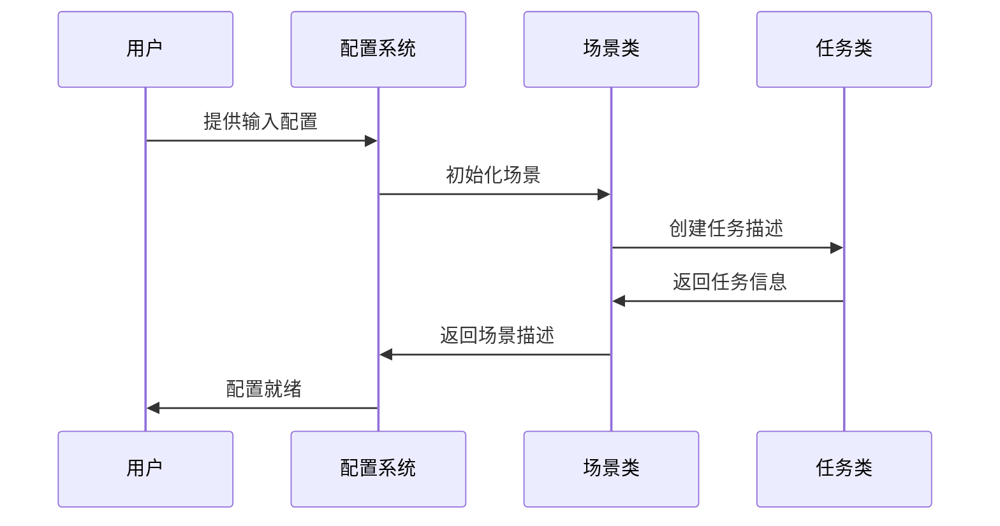

**节来源**
- [scenario.py](file://rdagent/core/scenario.py#L10-L65)

### 2. Scenario初始化与Experiment对象创建

Scenario负责提供背景信息、数据描述和运行环境，为后续的Experiment对象创建奠定基础：

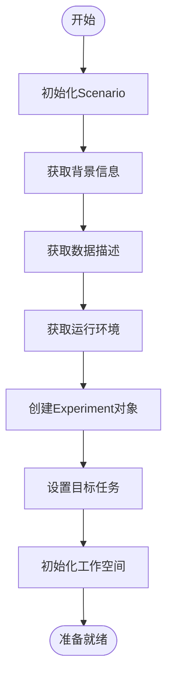

**节来源**
- [experiment.py](file://rdagent/core/experiment.py#L200-L300)

### 3. Proposal生成新假设

Proposal模块负责根据当前Trace历史生成新的假设：

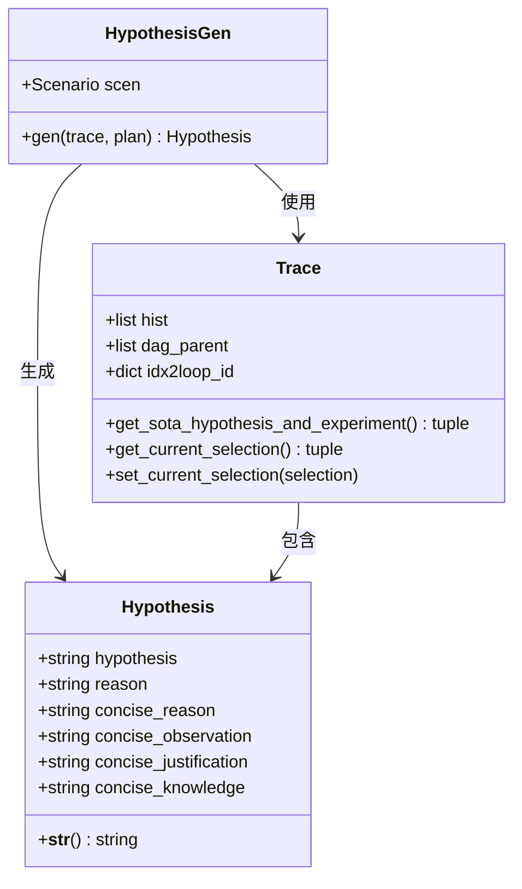

**图表来源**
- [proposal.py](file://rdagent/core/proposal.py#L20-L50)
- [proposal.py](file://rdagent/core/proposal.py#L100-L150)

**节来源**
- [proposal.py](file://rdagent/core/proposal.py#L350-L390)

### 4. Coder生成代码

Coder模块根据假设生成具体的代码实现：

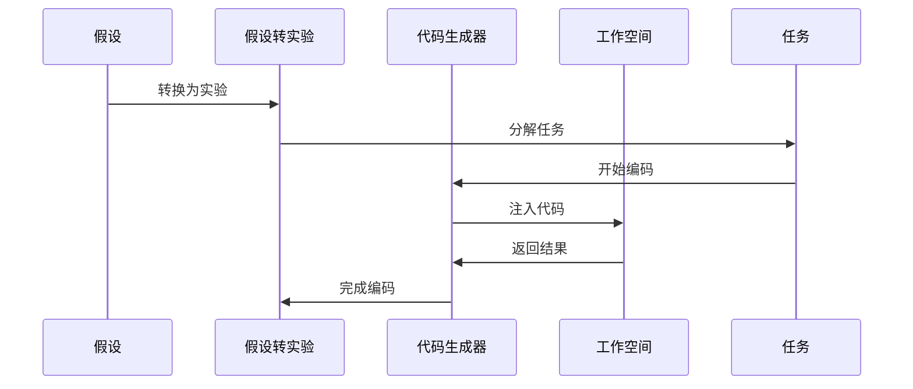

**节来源**
- [proposal.py](file://rdagent/core/proposal.py#L300-L350)

### 5. Runner执行实验并产生结果

Runner负责执行生成的代码并收集实验结果：

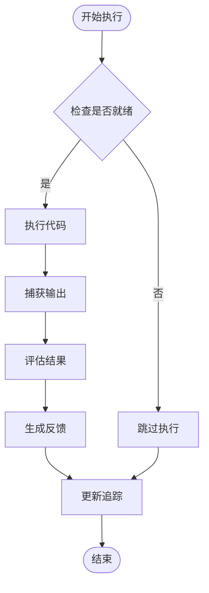

**节来源**
- [experiment.py](file://rdagent/scenarios/data_science/experiment/experiment.py#L30-L44)

### 6. Evaluator生成Feedback

评估器对实验结果进行评估并生成反馈信息：

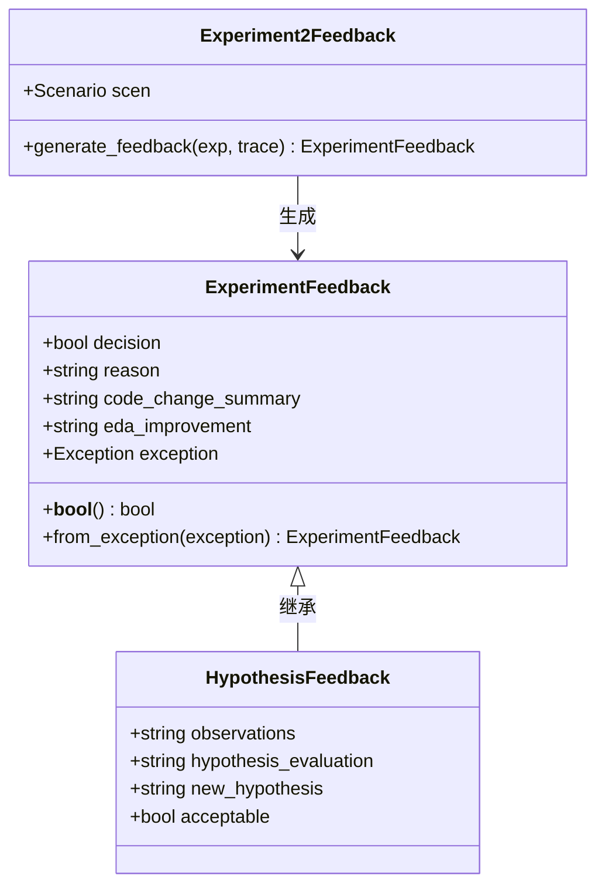

**图表来源**
- [proposal.py](file://rdagent/core/proposal.py#L50-L100)

**节来源**
- [proposal.py](file://rdagent/core/proposal.py#L320-L390)

### 7. KnowledgeBase更新知识

反馈信息被存储到知识库中，为后续的假设生成提供参考：

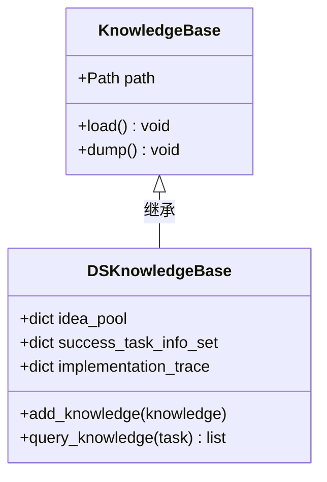

**图表来源**
- [knowledge_base.py](file://rdagent/core/knowledge_base.py#L1-L28)

**节来源**
- [knowledge_base.py](file://rdagent/core/knowledge_base.py#L1-L28)

## LoopBase异步循环机制

LoopBase是整个系统的核心控制类，负责管理异步循环和上下文数据传递：

### loop_prev_out字典的设计

loop_prev_out是一个嵌套字典结构，用于在异步循环中传递上下文数据：

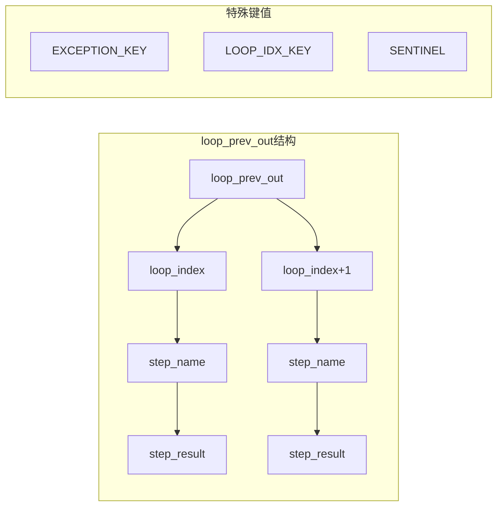

**图表来源**
- [loop.py](file://rdagent/utils/workflow/loop.py#L100-L150)

### 异步执行流程

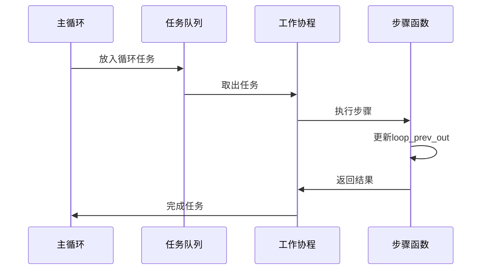

**节来源**
- [loop.py](file://rdagent/utils/workflow/loop.py#L200-L300)

### 并发控制机制

系统使用信号量控制并发度，确保资源合理分配：

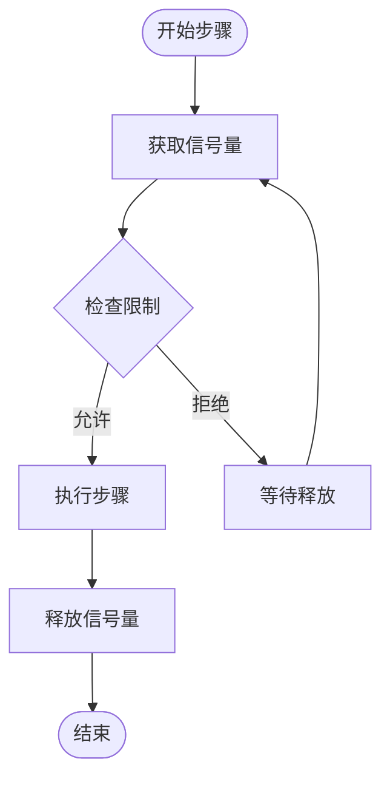

**节来源**
- [loop.py](file://rdagent/utils/workflow/loop.py#L150-L200)

## WorkflowTracker状态跟踪

WorkflowTracker负责记录工作流的状态变迁，支持可选的MLflow集成：

### 状态记录机制

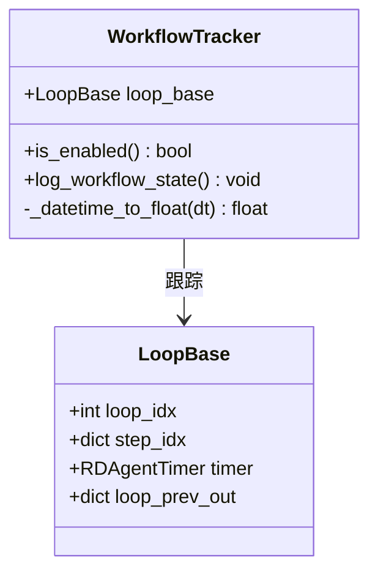

**图表来源**
- [tracking.py](file://rdagent/utils/workflow/tracking.py#L20-L50)

### 性能指标监控

WorkflowTracker记录关键性能指标：

| 指标名称 | 描述 | 数据类型 |
|---------|------|----------|
| loop_index | 当前循环索引 | int |
| step_index | 当前步骤索引 | int |
| current_datetime | 当前时间戳 | float |
| api_fail_count | API失败次数 | int |
| remain_time | 剩余执行时间 | timedelta |
| remain_percent | 剩余时间百分比 | float |

**节来源**
- [tracking.py](file://rdagent/utils/workflow/tracking.py#L50-L97)

## EvoStep泛型类设计

EvoStep封装了演化过程中的输入输出与反馈信息：

### 泛型设计模式

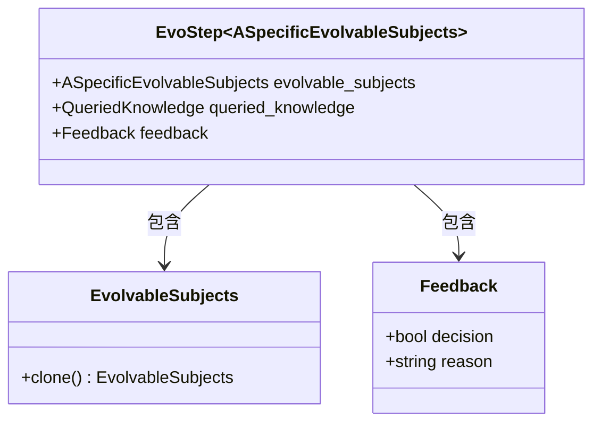

**图表来源**
- [evolving_framework.py](file://rdagent/core/evolving_framework.py#L40-L60)

### 演化流程

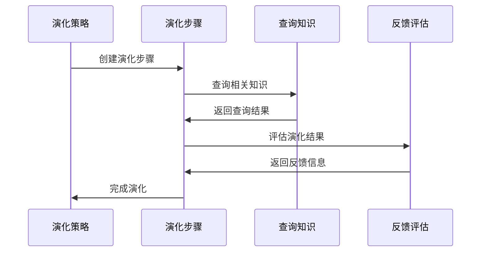

**节来源**
- [evolving_framework.py](file://rdagent/core/evolving_framework.py#L40-L128)

## 数据序列化与反序列化

系统采用多种机制确保状态的持久化和恢复：

### pickle序列化

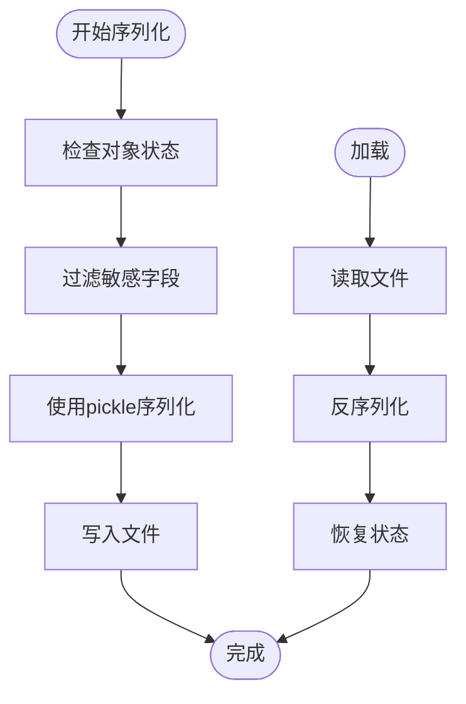

### 工作空间检查点

FBWorkspace实现了完整的检查点机制：

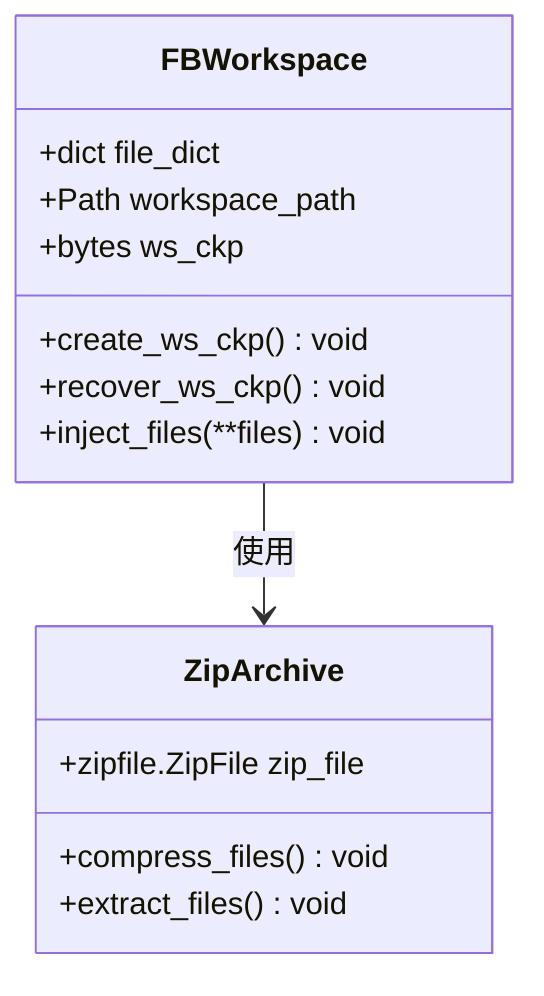

**图表来源**
- [experiment.py](file://rdagent/core/experiment.py#L250-L350)

**节来源**
- [experiment.py](file://rdagent/core/experiment.py#L300-L400)

## 完整的数据流图

以下是RD-Agent系统中关键数据实体在系统组件间的流动路径：

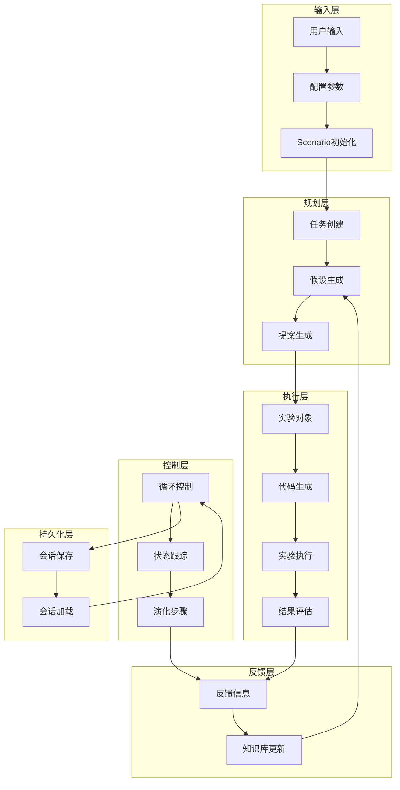

**图表来源**
- [rd_loop.py](file://rdagent/components/workflow/rd_loop.py#L1-L93)
- [loop.py](file://rdagent/utils/workflow/loop.py#L1-L538)

### 数据流向详细说明

1. **正向数据流**：从用户输入到知识库更新
   - 用户输入 → 配置参数 → Scenario初始化 → 任务创建 → 假设生成 → 提案生成 → 实验对象 → 代码生成 → 实验执行 → 结果评估 → 反馈信息 → 知识库更新

2. **控制数据流**：LoopBase维护的上下文数据
   - loop_prev_out字典 → 各个步骤函数 → 上下文传递 → 状态更新

3. **跟踪数据流**：WorkflowTracker记录的状态变化
   - 循环索引 → 步骤索引 → 时间戳 → 性能指标 → 状态快照

4. **演化数据流**：EvoStep封装的演化信息
   - 演化主体 → 查询知识 → 反馈评估 → 演化步骤 → 追踪记录

## 总结

RD-Agent系统通过精心设计的数据流架构，实现了高效的智能演化过程。核心特点包括：

1. **模块化设计**：各组件职责明确，便于扩展和维护
2. **异步执行**：利用asyncio实现高并发处理
3. **状态管理**：通过loop_prev_out字典实现上下文传递
4. **持久化机制**：支持会话保存和恢复
5. **跟踪监控**：提供完整的状态跟踪和性能监控

这种设计使得RD-Agent能够在复杂的演化过程中保持高效、稳定和可追溯性，为智能代理系统的实际应用提供了可靠的基础设施。