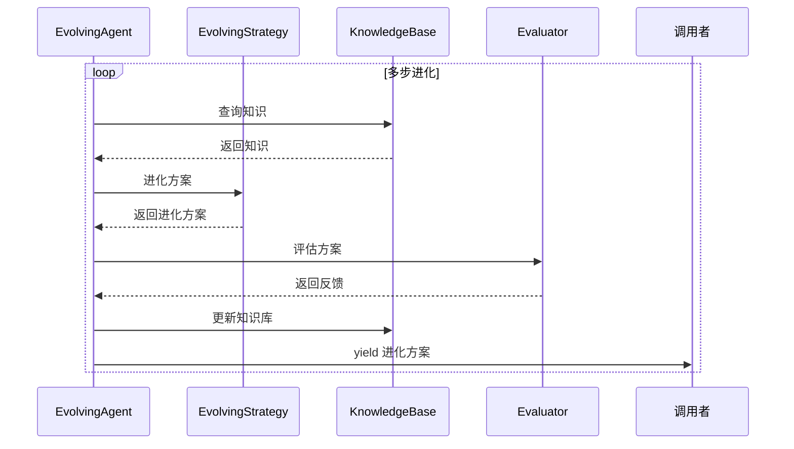
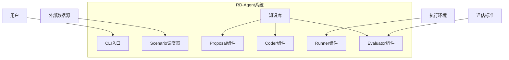
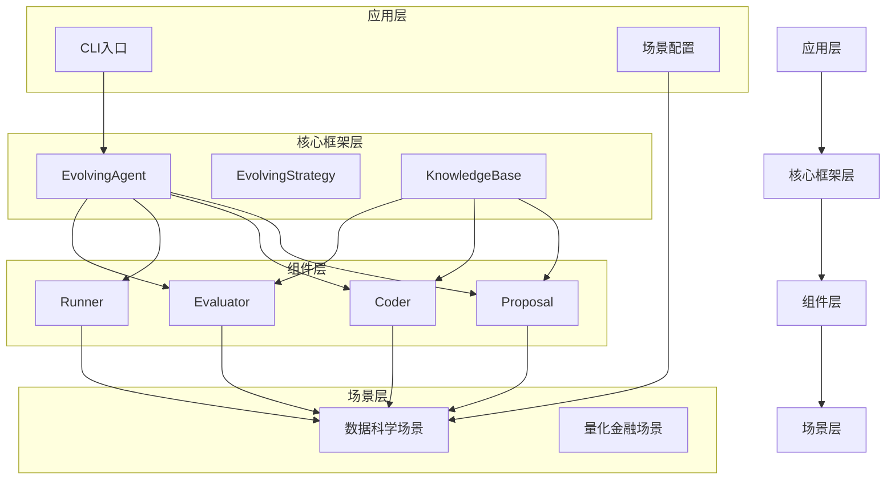

# 整体架构图

<cite>
**本文档引用的文件**  
- [cli.py](file://rdagent/app/cli.py)
- [loop.py](file://rdagent/app/data_science/loop.py)
- [evolving_agent.py](file://rdagent/core/evolving_agent.py)
- [evolving_framework.py](file://rdagent/core/evolving_framework.py)
- [knowledge_base.py](file://rdagent/core/knowledge_base.py)
- [scenario.py](file://rdagent/core/scenario.py)
- [experiment.py](file://rdagent/core/experiment.py)
- [proposal.py](file://rdagent/components/proposal/__init__.py)
- [CoSTEER/__init__.py](file://rdagent/components/coder/CoSTEER/__init__.py)
- [pipeline/__init__.py](file://rdagent/components/coder/data_science/pipeline/__init__.py)
- [runner/__init__.py](file://rdagent/components/runner/__init__.py)
- [base.py](file://rdagent/scenarios/data_science/proposal/exp_gen/base.py)
- [conf.py](file://rdagent/app/data_science/conf.py)
</cite>

## 目录
1. [引言](#引言)
2. [四层模块化分层架构](#四层模块化分层架构)
3. [自动化研发流程](#自动化研发流程)
4. [R&D双循环架构](#rnd双循环架构)
5. [EvolvingAgent闭环流程](#evolvingagent闭环流程)
6. [系统上下文图](#系统上下文图)
7. [容器图](#容器图)
8. [知识库持续积累](#知识库持续积累)

## 引言

RD-Agent是一个自动化研发系统，采用四层模块化分层架构，包括应用层（app）、核心框架层（core）、组件层（components）和场景层（scenarios）。该系统通过CLI入口启动，利用Scenario调度器驱动自动化研发流程。系统实现了研究（Proposal）与开发（Development）的协同进化机制，通过Coder、Runner、Evaluator之间的数据流动，以及知识库的持续积累，形成一个完整的闭环研发流程。

## 四层模块化分层架构

RD-Agent采用清晰的四层模块化分层架构：

1. **应用层（app）**：提供CLI入口和具体应用场景的配置，如数据科学、量化金融等。
2. **核心框架层（core）**：包含系统的核心抽象和框架，如EvolvingAgent、EvolvingStrategy、KnowledgeBase等。
3. **组件层（components）**：实现具体的组件功能，包括Coder、Runner、Evaluator、Proposal等。
4. **场景层（scenarios）**：针对特定场景的实现，如数据科学、Kaggle竞赛等。

这种分层架构使得系统具有良好的可扩展性和可维护性，各层之间通过清晰的接口进行交互。

**Section sources**
- [cli.py](file://rdagent/app/cli.py)
- [evolving_agent.py](file://rdagent/core/evolving_agent.py)
- [evolving_framework.py](file://rdagent/core/evolving_framework.py)
- [knowledge_base.py](file://rdagent/core/knowledge_base.py)

## 自动化研发流程

自动化研发流程从CLI入口开始，通过Scenario调度器启动：

1. **CLI入口**：用户通过命令行启动特定场景的自动化研发流程。
2. **Scenario调度**：根据配置选择合适的Scenario，启动相应的研发循环。
3. **任务生成**：通过Proposal组件生成研究假设和实验计划。
4. **代码开发**：Coder组件根据实验计划开发代码。
5. **代码执行**：Runner组件执行开发的代码。
6. **结果评估**：Evaluator组件评估执行结果，生成反馈。

这个流程在DataScienceRDLoop中实现，通过direct_exp_gen、coding、running、feedback等步骤形成一个完整的研发循环。

**Section sources**
- [cli.py](file://rdagent/app/cli.py)
- [loop.py](file://rdagent/app/data_science/loop.py)
- [base.py](file://rdagent/scenarios/data_science/proposal/exp_gen/base.py)

## R&D双循环架构

R&D双循环架构是RD-Agent的核心设计理念，实现了研究（Proposal）与开发（Development）的协同进化：

1. **研究循环**：通过Proposal组件生成假设和实验计划，探索新的解决方案。
2. **开发循环**：通过Coder、Runner、Evaluator组件实现和验证实验计划。

这两个循环相互促进，研究循环为开发循环提供新的方向，开发循环的反馈又指导研究循环的优化。这种双循环机制使得系统能够不断进化，找到更优的解决方案。

**Section sources**
- [proposal.py](file://rdagent/components/proposal/__init__.py)
- [CoSTEER/__init__.py](file://rdagent/components/coder/CoSTEER/__init__.py)
- [runner/__init__.py](file://rdagent/components/runner/__init__.py)

## EvolvingAgent闭环流程

EvolvingAgent是驱动整个闭环流程的核心组件：

1. **初始化**：设置最大循环次数和进化策略。
2. **知识检索**：从知识库中检索相关信息。
3. **方案进化**：根据检索到的知识和历史反馈，进化当前方案。
4. **方案评估**：执行进化后的方案，评估其效果。
5. **知识更新**：将新的知识更新到知识库中。

这个流程在RAGEvoAgent的multistep_evolve方法中实现，通过yield机制将控制权交给调用者，便于过程控制和日志记录。

**Diagram sources**
- [evolving_agent.py](file://rdagent/core/evolving_agent.py)
- [evolving_framework.py](file://rdagent/core/evolving_framework.py)

**Section sources**
- [evolving_agent.py](file://rdagent/core/evolving_agent.py)
- [evolving_framework.py](file://rdagent/core/evolving_framework.py)

## 系统上下文图

系统上下文图展示了RD-Agent与外部环境的交互关系：

**Diagram sources**
- [cli.py](file://rdagent/app/cli.py)
- [loop.py](file://rdagent/app/data_science/loop.py)

## 容器图

容器图展示了RD-Agent内部各组件的边界和交互关系：

**Diagram sources**
- [cli.py](file://rdagent/app/cli.py)
- [evolving_agent.py](file://rdagent/core/evolving_agent.py)
- [evolving_framework.py](file://rdagent/core/evolving_framework.py)
- [proposal.py](file://rdagent/components/proposal/__init__.py)
- [CoSTEER/__init__.py](file://rdagent/components/coder/CoSTEER/__init__.py)
- [runner/__init__.py](file://rdagent/components/runner/__init__.py)

## 知识库持续积累

知识库在迭代中持续积累，为系统的自我进化提供支持：

1. **知识检索**：在每次进化前，从知识库中检索相关信息。
2. **知识生成**：根据进化过程中的反馈，生成新的知识。
3. **知识存储**：将生成的知识存储到知识库中，供后续使用。

这种持续积累机制使得系统能够从历史经验中学习，不断提高研发效率和质量。知识库的实现基于KnowledgeBase类，支持序列化和反序列化，确保知识的持久化存储。

**Section sources**
- [knowledge_base.py](file://rdagent/core/knowledge_base.py)
- [evolving_framework.py](file://rdagent/core/evolving_framework.py)
- [evolving_agent.py](file://rdagent/core/evolving_agent.py)