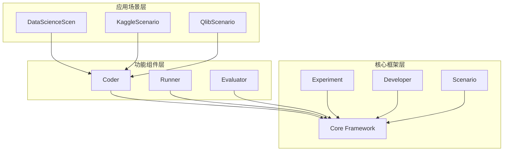
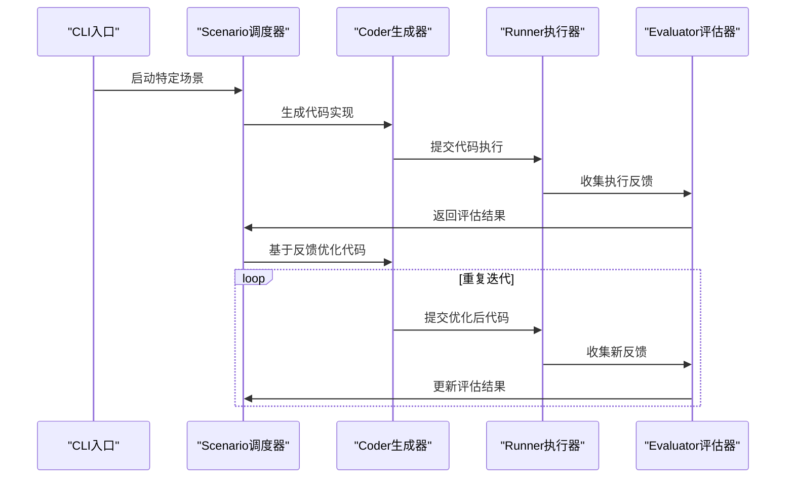
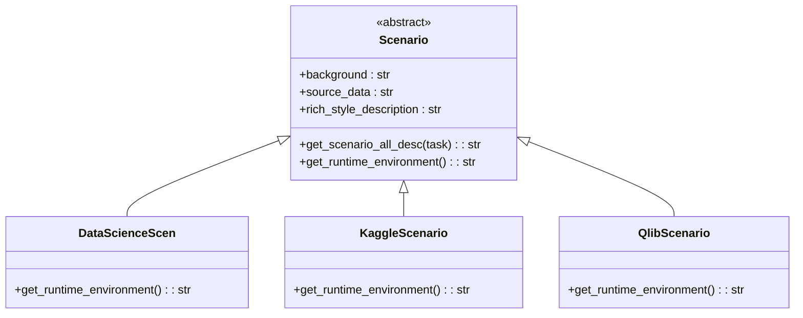
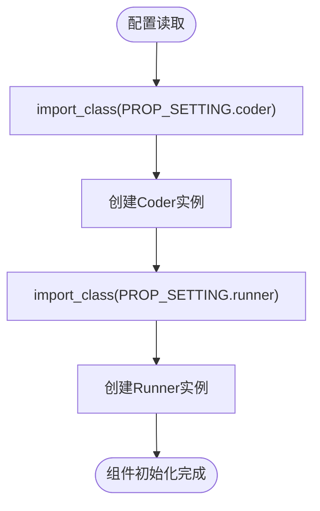
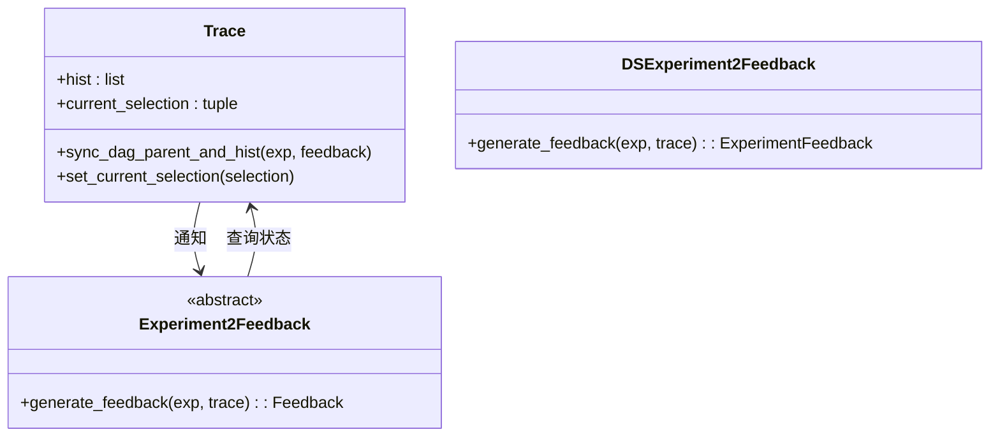
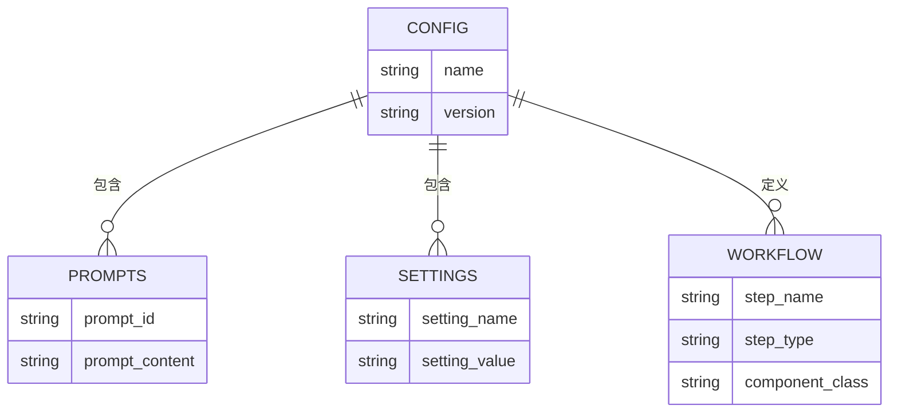
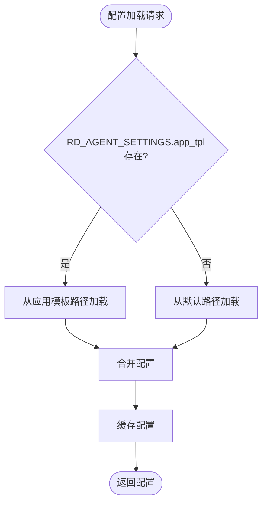
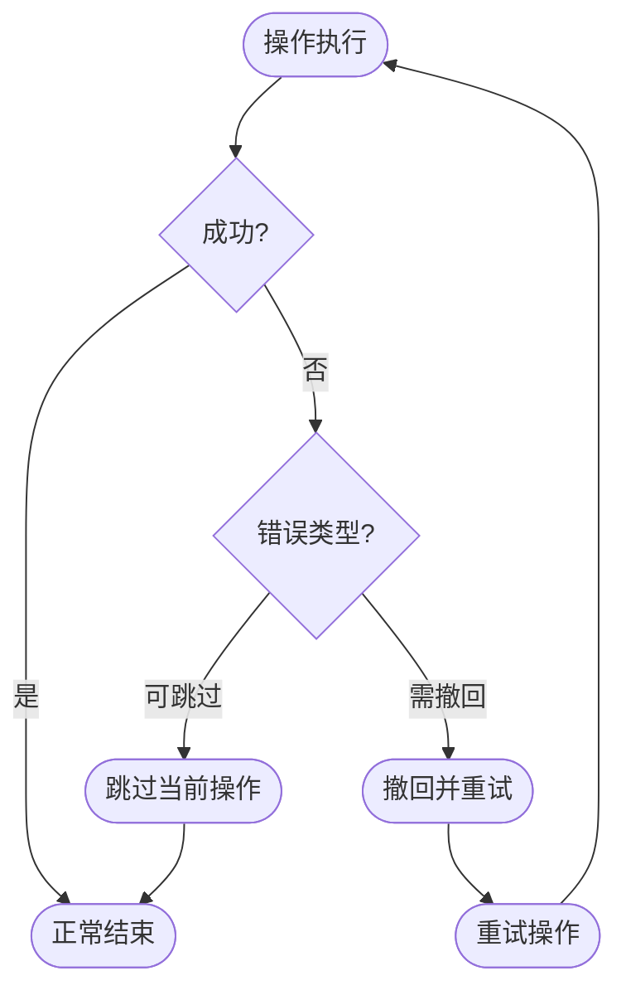
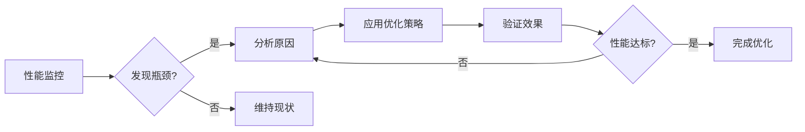

# 架构设计

<cite>
**本文档引用的文件**
- [cli.py](file://rdagent/app/cli.py)
- [scenario.py](file://rdagent/core/scenario.py)
- [conf.py](file://rdagent/core/conf.py)
- [evaluation.py](file://rdagent/core/evaluation.py)
- [experiment.py](file://rdagent/core/experiment.py)
- [rd_loop.py](file://rdagent/components/workflow/rd_loop.py)
- [loop.py](file://rdagent/scenarios/data_science/loop.py)
- [interactor.py](file://rdagent/core/interactor.py)
- [prompts.py](file://rdagent/core/prompts.py)
- [tpl.py](file://rdagent/utils/agent/tpl.py)
</cite>

## 目录
1. [引言](#引言)
2. [模块化分层架构](#模块化分层架构)
3. [核心组件与交互模式](#核心组件与交互模式)
4. [设计模式应用](#设计模式应用)
5. [配置驱动设计](#配置驱动设计)
6. [可扩展性与容错机制](#可扩展性与容错机制)
7. [性能瓶颈分析](#性能瓶颈分析)

## 引言
RD-Agent是一个数据驱动的多智能体框架，旨在自动化研发过程。该系统采用模块化分层架构，将核心框架、功能组件和应用场景分离，实现了高度的可扩展性和灵活性。本架构设计文档详细描述了系统的高层设计原则、组件交互模式以及关键技术实现。

**Section sources**
- [cli.py](file://rdagent/app/cli.py#L1-L87)
- [scenario.py](file://rdagent/core/scenario.py#L5-L63)

## 模块化分层架构
RD-Agent采用三层模块化架构：核心框架层、功能组件层和应用场景层。这种分层设计确保了各层之间的清晰边界和职责划分。

### 核心框架层
核心框架层提供了系统的基础能力，包括实验管理、开发者抽象、评估机制和工作流控制。`rdagent.core`包中的`Experiment`、`Developer`、`Evaluator`和`Scenario`等抽象基类构成了系统的核心骨架。

### 功能组件层
功能组件层实现了具体的研发能力，包括代码生成器（Coder）、执行器（Runner）和评估器（Evaluator）。这些组件通过继承核心框架的抽象类来实现特定功能，如`DataLoaderCoSTEER`、`FeatureCoSTEER`等。

### 应用场景层
应用场景层针对不同的研发场景（如data_science、kaggle、qlib）提供具体的实现。每个场景通过继承`Scenario`基类来定义其特定的背景信息、数据描述和运行环境。

**Diagram sources**
- [scenario.py](file://rdagent/core/scenario.py#L5-L63)
- [experiment.py](file://rdagent/core/experiment.py#L41-L482)

**Section sources**
- [scenario.py](file://rdagent/core/scenario.py#L5-L63)
- [experiment.py](file://rdagent/core/experiment.py#L41-L482)

## 核心组件与交互模式
系统的核心组件包括CLI入口、Scenario调度器、Coder生成器、Runner执行器和Evaluator评估器，它们通过明确的调用链路协同工作。

### 组件关系图

**Diagram sources**
- [cli.py](file://rdagent/app/cli.py#L1-L87)
- [rd_loop.py](file://rdagent/components/workflow/rd_loop.py#L0-L92)

**Section sources**
- [cli.py](file://rdagent/app/cli.py#L1-L87)
- [rd_loop.py](file://rdagent/components/workflow/rd_loop.py#L0-L92)

## 设计模式应用
RD-Agent在系统设计中广泛应用了多种设计模式，包括策略模式、工厂模式和观察者模式，以实现灵活的架构和可扩展的功能。

### 策略模式在不同场景中的应用
策略模式被用于实现不同场景下的差异化行为。`Scenario`基类定义了抽象方法，各个具体场景类（如`DataScienceScen`、`KaggleScenario`）提供具体的实现策略。

**Diagram sources**
- [scenario.py](file://rdagent/core/scenario.py#L5-L63)

### 工厂模式动态创建实例
工厂模式通过配置驱动的方式动态创建coder和runner实例。`RDLoop`类根据配置中的类路径动态导入并实例化相应的组件。

**Diagram sources**
- [rd_loop.py](file://rdagent/components/workflow/rd_loop.py#L0-L92)

### 观察者模式在实验反馈闭环中的实现
观察者模式用于实现实验反馈的闭环控制。`Trace`对象作为被观察者，记录实验历史和状态变化，而`summarizer`作为观察者，基于历史数据生成反馈和决策。

**Diagram sources**
- [loop.py](file://rdagent/scenarios/data_science/loop.py#L0-L383)
- [interactor.py](file://rdagent/core/interactor.py#L0-L26)

**Section sources**
- [loop.py](file://rdagent/scenarios/data_science/loop.py#L0-L383)
- [interactor.py](file://rdagent/core/interactor.py#L0-L26)

## 配置驱动设计
系统采用配置驱动的设计理念，通过YAML配置文件控制LLM提示、评估指标和执行流程，实现了高度的可定制性和灵活性。

### YAML配置结构

**Diagram sources**
- [prompts.py](file://rdagent/core/prompts.py#L0-L18)
- [tpl.py](file://rdagent/utils/agent/tpl.py#L41-L124)

### 配置加载机制
系统通过模板加载机制实现配置的优先级管理，支持从多个位置加载配置文件，并按照预定义的优先级顺序进行合并。

**Diagram sources**
- [tpl.py](file://rdagent/utils/agent/tpl.py#L41-L124)

**Section sources**
- [prompts.py](file://rdagent/core/prompts.py#L0-L18)
- [tpl.py](file://rdagent/utils/agent/tpl.py#L41-L124)

## 可扩展性与容错机制
系统设计充分考虑了可扩展性和容错性，通过模块化设计和异常处理机制确保系统的稳定运行。

### 可扩展性设计
- **插件式架构**：通过继承抽象基类实现新功能的无缝集成
- **配置驱动**：通过YAML配置文件快速调整系统行为
- **动态加载**：支持运行时动态加载和实例化组件

### 容错机制
- **异常分类处理**：区分可跳过错误和需撤回错误
- **重试机制**：对关键操作实现自动重试
- **状态恢复**：支持从检查点恢复实验状态

**Diagram sources**
- [loop.py](file://rdagent/scenarios/data_science/loop.py#L0-L383)
- [conf.py](file://rdagent/core/conf.py#L0-L109)

**Section sources**
- [loop.py](file://rdagent/scenarios/data_science/loop.py#L0-L383)
- [conf.py](file://rdagent/core/conf.py#L0-L109)

## 性能瓶颈分析
系统在设计时充分考虑了性能因素，但仍存在一些潜在的性能瓶颈需要关注。

### 主要性能瓶颈
1. **LLM调用延迟**：代码生成和评估依赖LLM，调用延迟可能影响整体性能
2. **并行执行限制**：虽然支持并行执行，但资源竞争可能导致性能下降
3. **状态同步开销**：大规模实验中的状态同步可能成为瓶颈

### 性能优化策略
- **缓存机制**：通过`cache_with_pickle`配置启用结果缓存
- **并行控制**：通过`step_semaphore`配置控制并行度
- **检查点管理**：合理设置检查点大小限制以平衡性能和存储

**Diagram sources**
- [conf.py](file://rdagent/core/conf.py#L0-L109)
- [loop.py](file://rdagent/scenarios/data_science/loop.py#L0-L383)

**Section sources**
- [conf.py](file://rdagent/core/conf.py#L0-L109)
- [loop.py](file://rdagent/scenarios/data_science/loop.py#L0-L383)