# 反馈闭环中的模块协同

<cite>
**本文档引用的文件**
- [base.py](file://rdagent/scenarios/data_science/proposal/exp_gen/base.py)
- [proposal.py](file://rdagent/scenarios/data_science/proposal/exp_gen/proposal.py)
- [feedback.py](file://rdagent/scenarios/data_science/dev/feedback.py)
- [ds_costeer.py](file://rdagent/components/coder/data_science/share/ds_costeer.py)
- [ds_trace.py](file://rdagent/log/ui/ds_trace.py)
- [experiment.py](file://rdagent/core/experiment.py)
- [proposal.py](file://rdagent/core/proposal.py)
- [knowledge_management.py](file://rdagent/components/coder/CoSTEER/knowledge_management.py)
- [loop.py](file://rdagent/scenarios/data_science/loop.py)
- [conf.py](file://rdagent/app/data_science/conf.py)
- [prompts_v2.yaml](file://rdagent/scenarios/data_science/proposal/exp_gen/prompts_v2.yaml)
- [dev_prompts.yaml](file://rdagent/scenarios/data_science/dev/prompts.yaml)
</cite>

## 目录
1. [引言](#引言)
2. [系统架构概览](#系统架构概览)
3. [Proposal系统：假设生成与迭代](#proposal系统假设生成与迭代)
4. [Experiment2Feedback：反馈生成机制](#experiment2feedback反馈生成机制)
5. [Coder模块：代码进化驱动](#coder模块代码进化驱动)
6. [DSTrace与HypothesisFeedback：知识积累](#dstrace与hypothesisfeedback知识积累)
7. [数据流图：闭环过程可视化](#数据流图闭环过程可视化)
8. [模块间协同机制](#模块间协同机制)
9. [性能优化与扩展性](#性能优化与扩展性)
10. [总结](#总结)

## 引言

RD-Agent是一个基于人工智能的数据科学研发自动化平台，其核心创新在于构建了一个完整的反馈闭环系统，实现了从假设生成到代码演化的智能循环。该系统通过四个核心模块的协同工作：Proposal系统负责生成新的研究假设，Experiment2Feedback模块将实验结果转化为结构化反馈，Coder模块根据反馈进行代码进化，以及DSTrace和HypothesisFeedback模块实现知识的累积与迭代。

这种设计使得系统能够像人类数据科学家一样，通过不断的试错、学习和改进来提升模型性能，形成了一个自我优化的闭环生态系统。

## 系统架构概览

RD-Agent的反馈闭环系统采用分层架构设计，包含以下核心组件：

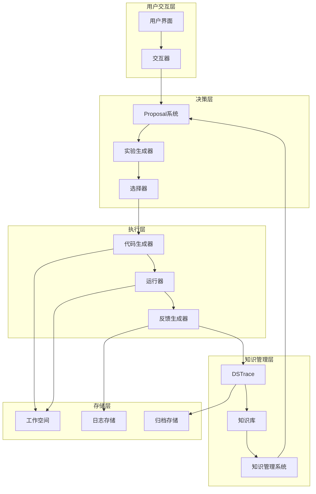

**图表来源**
- [loop.py](file://rdagent/scenarios/data_science/loop.py#L1-L50)
- [proposal.py](file://rdagent/scenarios/data_science/proposal/exp_gen/proposal.py#L1-L100)

**章节来源**
- [loop.py](file://rdagent/scenarios/data_science/loop.py#L50-L150)
- [conf.py](file://rdagent/app/data_science/conf.py#L1-L100)

## Proposal系统：假设生成与迭代

### 假设生成机制

Proposal系统是反馈闭环的核心驱动力，负责基于历史Trace和知识库生成新的研究假设。系统采用多层次的问题识别和假设生成策略：

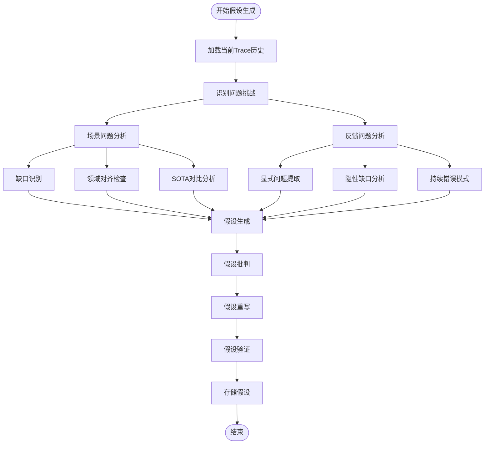

**图表来源**
- [proposal.py](file://rdagent/scenarios/data_science/proposal/exp_gen/proposal.py#L400-L600)
- [base.py](file://rdagent/scenarios/data_science/proposal/exp_gen/base.py#L200-L300)

### DSTrace核心数据结构

DSTrace作为系统的核心数据结构，维护着完整的实验历史和知识图谱：

| 属性 | 类型 | 描述 | 用途 |
|------|------|------|------|
| hist | List[Tuple[Experiment, ExperimentFeedback]] | 实验历史记录 | 存储所有实验及其反馈 |
| dag_parent | List[Tuple[int, ...]] | 有向无环图父节点关系 | 维护实验间的依赖关系 |
| knowledge_base | KnowledgeBase | 知识库实例 | 提供上下文知识检索 |
| current_selection | Tuple[int, ...] | 当前选择状态 | 跟踪当前活跃的实验路径 |

### 多层次问题识别

系统通过两个维度识别问题挑战：

1. **场景驱动问题**（SCENARIO_PROBLEM）：
   - 数据集特性分析
   - 领域知识应用
   - 竞赛规则理解

2. **反馈驱动问题**（FEEDBACK_PROBLEM）：
   - 实验失败模式
   - 性能瓶颈识别
   - 实现缺陷分析

**章节来源**
- [proposal.py](file://rdagent/scenarios/data_science/proposal/exp_gen/proposal.py#L300-L500)
- [base.py](file://rdagent/scenarios/data_science/proposal/exp_gen/base.py#L100-L200)

## Experiment2Feedback：反馈生成机制

### 结构化反馈生成流程

Experiment2Feedback模块负责将实验执行结果转化为结构化的反馈信息，为后续的假设改进提供指导：

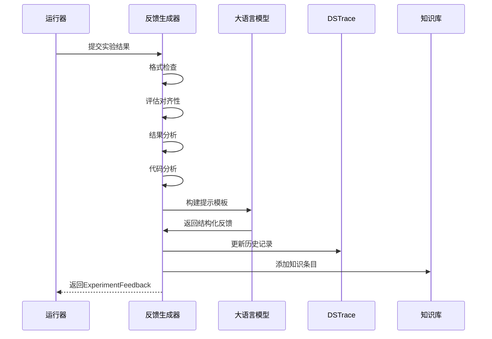

**图表来源**
- [feedback.py](file://rdagent/scenarios/data_science/dev/feedback.py#L20-L80)
- [loop.py](file://rdagent/scenarios/data_science/loop.py#L200-L250)

### 反馈质量评估维度

系统采用多维度的质量评估体系：

| 评估维度 | 描述 | 权重 | 应用场景 |
|----------|------|------|----------|
| Submission Format | 提交格式正确性 | 高 | 初步筛选 |
| Evaluation Alignment | 评估方法一致性 | 高 | 方法论验证 |
| Performance Improvement | 性能提升效果 | 中 | 结果导向评估 |
| Code Quality | 代码质量和实践 | 中 | 工程质量评估 |
| Novelty | 创新性和独特性 | 低 | 长期价值评估 |

### HypothesisFeedback核心结构

HypothesisFeedback继承自ExperimentFeedback，增加了专门针对假设层面的反馈信息：

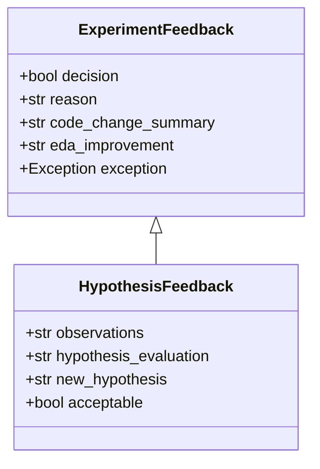

**图表来源**
- [proposal.py](file://rdagent/core/proposal.py#L50-L100)
- [feedback.py](file://rdagent/scenarios/data_science/dev/feedback.py#L40-L80)

**章节来源**
- [feedback.py](file://rdagent/scenarios/data_science/dev/feedback.py#L1-L127)
- [proposal.py](file://rdagent/core/proposal.py#L50-L150)

## Coder模块：代码进化驱动

### CoSTEER架构设计

Coder模块基于CoSTEER（Collaborative Software Testing and Evolution with Reinforcement）框架，实现了智能化的代码进化：

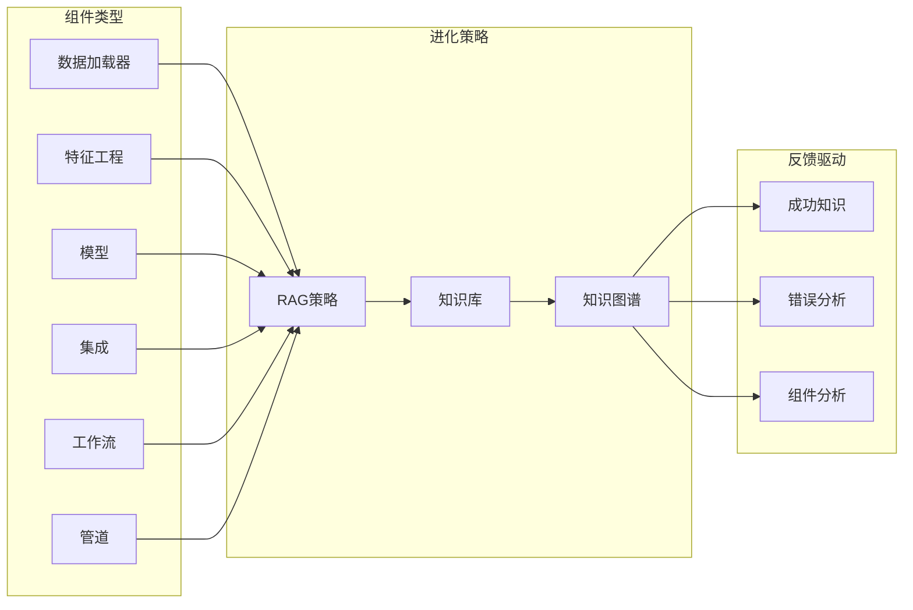

**图表来源**
- [ds_costeer.py](file://rdagent/components/coder/data_science/share/ds_costeer.py#L1-L10)
- [knowledge_management.py](file://rdagent/components/coder/CoSTEER/knowledge_management.py#L100-L200)

### 知识管理机制

CoSTEER采用多层次的知识管理策略：

1. **成功知识存储**：记录经过验证的成功实现
2. **错误知识分析**：分析失败原因并形成解决方案
3. **组件知识关联**：建立组件间的语义关联
4. **时间序列追踪**：跟踪知识的演化过程

### 智能代码生成流程

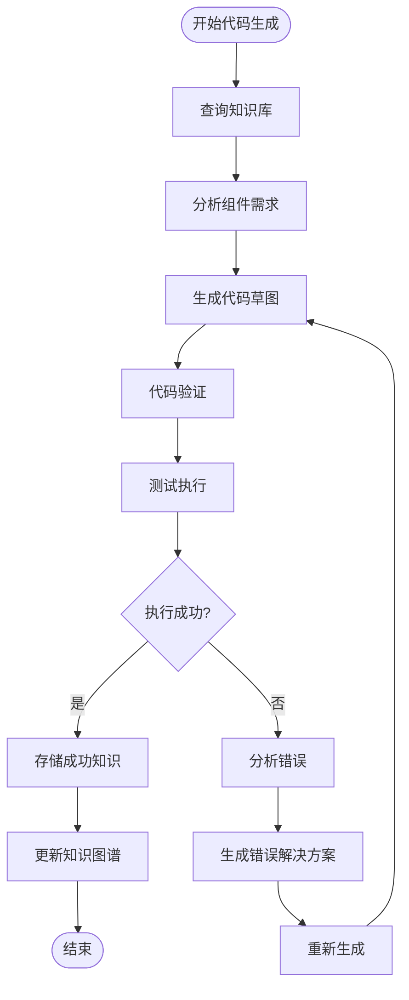

**图表来源**
- [knowledge_management.py](file://rdagent/components/coder/CoSTEER/knowledge_management.py#L300-L500)

**章节来源**
- [ds_costeer.py](file://rdagent/components/coder/data_science/share/ds_costeer.py#L1-L10)
- [knowledge_management.py](file://rdagent/components/coder/CoSTEER/knowledge_management.py#L1-L200)

## DSTrace与HypothesisFeedback：知识积累

### DSTrace的演化机制

DSTrace作为知识积累的核心载体，实现了从实验到知识的转化过程：

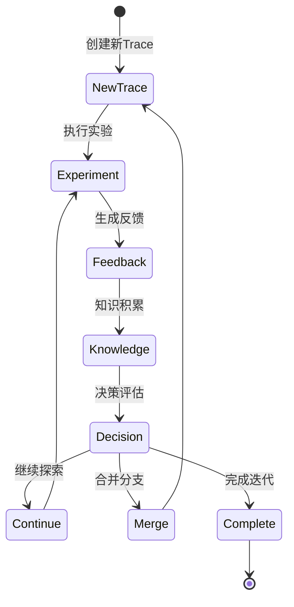

**图表来源**
- [base.py](file://rdagent/scenarios/data_science/proposal/exp_gen/base.py#L150-L250)

### 知识积累的层次结构

系统采用分层的知识积累策略：

| 层次 | 内容 | 存储方式 | 访问频率 |
|------|------|----------|----------|
| 原子级知识 | 单个成功/失败案例 | CoSTEERKnowledge | 高 |
| 组件级知识 | 特定组件的最佳实践 | 组件图谱节点 | 中 |
| 算法级知识 | 算法选择和参数调优 | 算法图谱 | 中 |
| 策略级知识 | 整体实验策略 | 策略图谱 | 低 |

### HypothesisFeedback的反馈循环

HypothesisFeedback实现了从假设到实现再到反馈的完整循环：

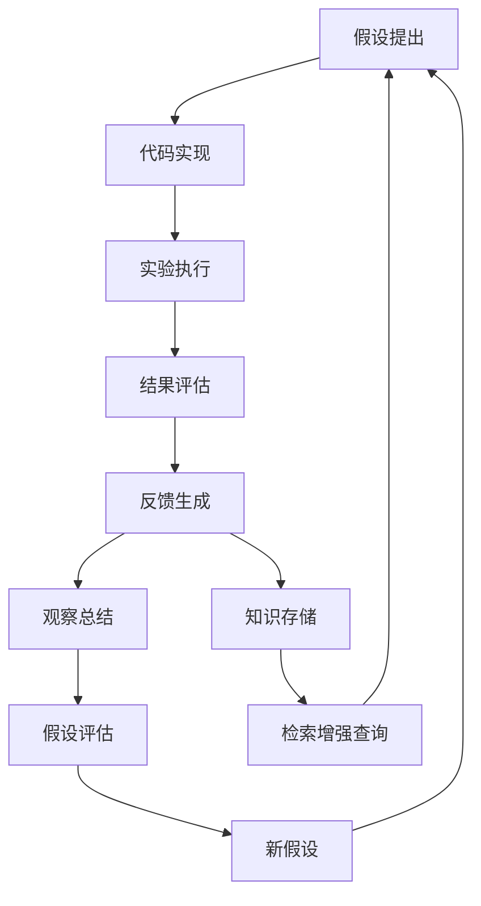

**图表来源**
- [proposal.py](file://rdagent/core/proposal.py#L200-L300)
- [feedback.py](file://rdagent/scenarios/data_science/dev/feedback.py#L50-L100)

**章节来源**
- [base.py](file://rdagent/scenarios/data_science/proposal/exp_gen/base.py#L300-L349)
- [proposal.py](file://rdagent/core/proposal.py#L300-L390)

## 数据流图：闭环过程可视化

### 完整闭环流程

整个反馈闭环遵循以下数据流向：

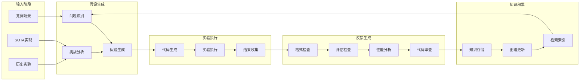

**图表来源**
- [loop.py](file://rdagent/scenarios/data_science/loop.py#L100-L200)
- [proposal.py](file://rdagent/scenarios/data_science/proposal/exp_gen/proposal.py#L600-L800)

### 关键数据转换点

系统在以下关键节点进行数据格式转换：

1. **从假设到实验**：将抽象的假设转化为具体的代码实现
2. **从实验到反馈**：将执行结果转化为结构化的评估信息
3. **从反馈到知识**：将经验教训转化为可复用的知识条目
4. **从知识到假设**：将历史知识转化为新的假设生成依据

### 并发执行与同步机制

系统支持多Trace并发执行，并通过以下机制保证数据一致性：

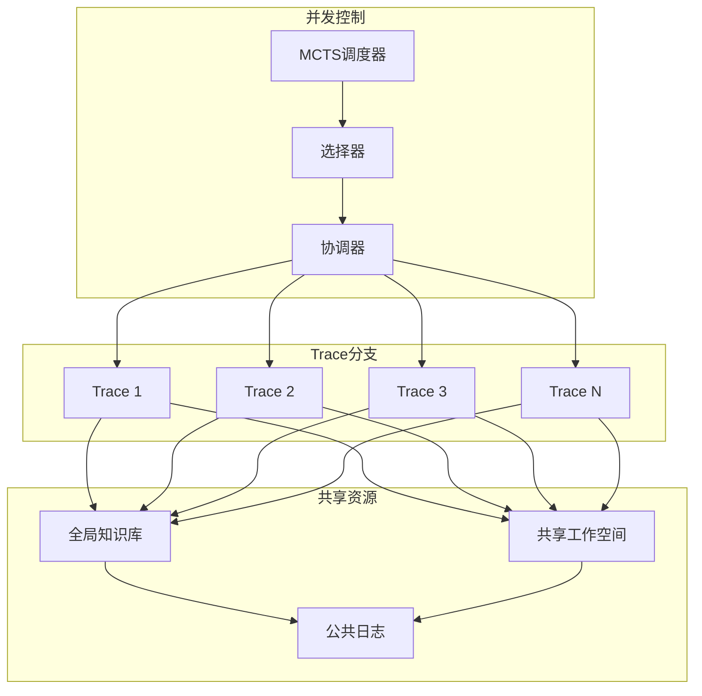

**图表来源**
- [loop.py](file://rdagent/scenarios/data_science/loop.py#L250-L350)

**章节来源**
- [loop.py](file://rdagent/scenarios/data_science/loop.py#L150-L300)
- [proposal.py](file://rdagent/scenarios/data_science/proposal/exp_gen/proposal.py#L800-L1000)

## 模块间协同机制

### 信息传递协议

各模块间通过标准化的信息传递协议进行协作：

```mermaid
sequenceDiagram
participant Loop as RD循环
participant Proposal as 假设生成器
participant Coder as 代码生成器
participant Runner as 运行器
participant Feedback as 反馈生成器
participant Trace as DSTrace
Loop->>Proposal : 请求新实验
Proposal->>Trace : 查询历史
Trace-->>Proposal : 返回历史数据
Proposal->>Proposal : 分析问题
Proposal-->>Loop : 返回实验计划
Loop->>Coder : 执行实验
Coder->>Coder : 生成代码
Coder-->>Loop : 返回代码实现
Loop->>Runner : 运行实验
Runner->>Runner : 执行代码
Runner-->>Loop : 返回执行结果
Loop->>Feedback : 生成反馈
Feedback->>Trace : 更新历史
Feedback-->>Loop : 返回反馈信息
Loop->>Trace : 存储知识
Trace-->>Loop : 确认存储
```

**图表来源**
- [loop.py](file://rdagent/scenarios/data_science/loop.py#L100-L200)
- [feedback.py](file://rdagent/scenarios/data_science/dev/feedback.py#L20-L60)

### 冲突解决机制

当多个模块产生冲突时，系统采用以下优先级机制：

1. **用户指令优先**：用户明确的指示具有最高优先级
2. **性能指标优先**：基于客观性能指标的决策
3. **知识库推荐**：基于历史知识的经验建议
4. **默认策略**：系统预设的标准处理流程

### 动态调整机制

系统具备动态调整能力，根据执行情况自动优化各模块的工作参数：

| 调整维度 | 触发条件 | 调整策略 | 影响范围 |
|----------|----------|----------|----------|
| 假设生成复杂度 | 连续失败次数 | 简化假设生成逻辑 | Proposal模块 |
| 代码生成约束 | 时间超限 | 放宽代码生成限制 | Coder模块 |
| 反馈评估严格度 | 结果波动大 | 调整评估标准 | Feedback模块 |
| 知识库检索深度 | 检索效率低 | 优化检索算法 | Knowledge模块 |

**章节来源**
- [loop.py](file://rdagent/scenarios/data_science/loop.py#L200-L350)
- [conf.py](file://rdagent/app/data_science/conf.py#L100-L200)

## 性能优化与扩展性

### 并行化优化

系统采用多层次的并行化策略：

1. **Trace级别并行**：多个独立的Trace同时执行
2. **组件级别并行**：不同组件的代码生成和执行并行
3. **实验级别并行**：同一Trace内的多个实验并行执行

### 缓存与索引优化

为了提高系统响应速度，系统实现了多级缓存机制：

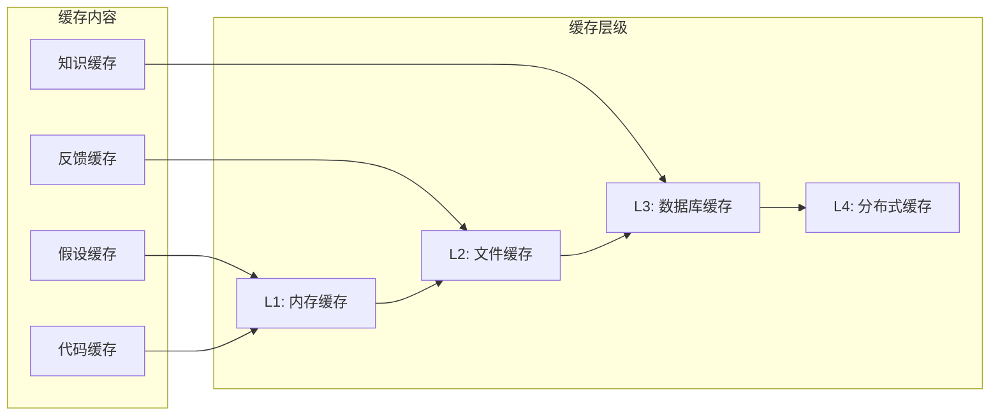

### 可扩展性设计

系统采用插件化架构，支持功能模块的动态扩展：

1. **新组件支持**：通过继承基础类即可添加新的代码组件
2. **新知识源**：支持接入外部知识库和数据库
3. **新评估指标**：可自定义实验评估指标和权重
4. **新调度策略**：支持不同的Trace调度和选择策略

**章节来源**
- [conf.py](file://rdagent/app/data_science/conf.py#L150-L207)
- [knowledge_management.py](file://rdagent/components/coder/CoSTEER/knowledge_management.py#L700-L964)

## 总结

RD-Agent的反馈闭环系统通过四个核心模块的紧密协作，实现了从假设生成到代码演化的完整自动化流程。该系统的主要优势包括：

1. **智能假设生成**：基于历史经验和知识库的智能假设生成机制
2. **结构化反馈**：全面的实验结果分析和改进建议
3. **自主代码进化**：基于知识库的智能代码生成和优化
4. **知识累积迭代**：持续的知识积累和经验传承

这种设计不仅提高了数据科学实验的效率，更重要的是模拟了人类专家的学习过程，为AI驱动的研发提供了新的范式。随着系统的不断完善，它将在更多领域发挥重要作用，推动人工智能在科学研究和工程实践中的广泛应用。