# 执行反馈分析系统设计与实现

<cite>
**本文档引用的文件**
- [proposal.py](file://rdagent/core/proposal.py)
- [feedback.py](file://rdagent/scenarios/data_science/dev/feedback.py)
- [feedback.py](file://rdagent/scenarios/qlib/developer/feedback.py)
- [evaluators.py](file://rdagent/components/coder/CoSTEER/evaluators.py)
- [experiment.py](file://rdagent/scenarios/data_science/experiment/experiment.py)
- [task.py](file://rdagent/components/coder/CoSTEER/task.py)
- [share.yaml](file://rdagent/scenarios/data_science/share.yaml)
</cite>

## 目录
1. [引言](#引言)
2. [系统架构概览](#系统架构概览)
3. [核心抽象基类设计](#核心抽象基类设计)
4. [数据科学场景实现](#数据科学场景实现)
5. [反馈生成流程](#反馈生成流程)
6. [多维度评估机制](#多维度评估机制)
7. [CoSTEER框架集成](#costeer框架集成)
8. [性能优化策略](#性能优化策略)
9. [故障排除指南](#故障排除指南)
10. [总结](#总结)

## 引言

RD-Agent的执行反馈分析系统是一个高度模块化的智能反馈生成框架，专门设计用于数据科学场景下的实验评估和迭代优化。该系统通过Experiment2Feedback抽象基类定义了统一的反馈契约，并在数据科学场景中实现了具体的DSExperiment2Feedback类，为机器学习实验提供了全面的性能分析和改进建议。

系统的核心价值在于：
- **统一的反馈契约**：通过抽象基类确保不同场景下反馈生成的一致性
- **多维度评估**：整合代码质量、功能正确性和性能表现等多个评估维度
- **智能决策支持**：基于历史实验和当前结果生成可操作的改进建议
- **自适应优化**：支持动态调整实验策略和参数配置

## 系统架构概览

执行反馈分析系统采用分层架构设计，从底层的实验执行到顶层的智能反馈生成，形成了完整的闭环优化体系。

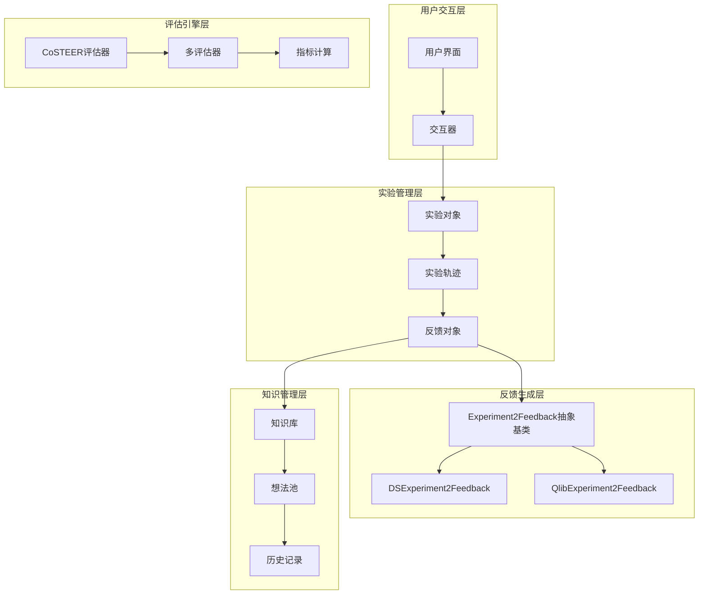

**图表来源**
- [proposal.py](file://rdagent/core/proposal.py#L362-L389)
- [feedback.py](file://rdagent/scenarios/data_science/dev/feedback.py#L24-L126)
- [evaluators.py](file://rdagent/components/coder/CoSTEER/evaluators.py#L280-L311)

## 核心抽象基类设计

### Experiment2Feedback抽象基类

Experiment2Feedback是整个反馈系统的核心抽象基类，定义了所有实验反馈生成器必须遵循的标准契约。

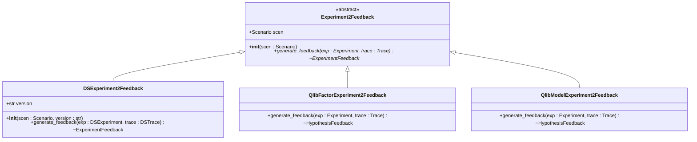

**图表来源**
- [proposal.py](file://rdagent/core/proposal.py#L362-L389)
- [feedback.py](file://rdagent/scenarios/data_science/dev/feedback.py#L24-L36)
- [feedback.py](file://rdagent/scenarios/qlib/developer/feedback.py#L58-L186)

#### 契约定义要素

1. **场景绑定**：每个反馈生成器都与特定的场景(scen)绑定，确保上下文一致性
2. **输入要求**：接收已执行的实验对象和对应的实验轨迹
3. **输出规范**：返回标准化的ExperimentFeedback或其子类实例
4. **抽象方法**：generate_feedback方法必须由子类实现

**节来源**
- [proposal.py](file://rdagent/core/proposal.py#L362-L389)

### HypothesisFeedback对象结构

HypothesisFeedback是反馈系统中最丰富的数据结构，包含了完整的实验评估信息。

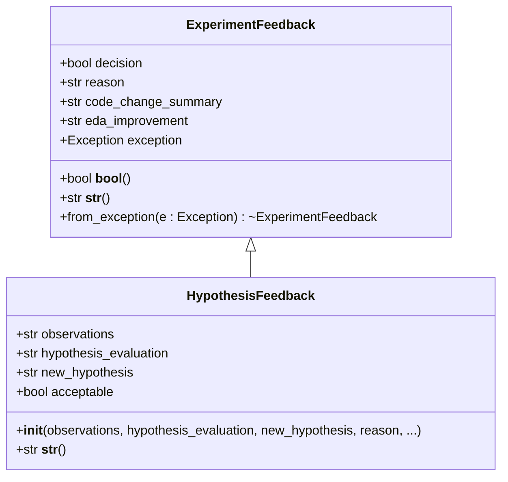

**图表来源**
- [proposal.py](file://rdagent/core/proposal.py#L60-L125)

#### 字段语义详解

| 字段名 | 类型 | 语义说明 | 生成逻辑 |
|--------|------|----------|----------|
| observations | str | 实验观察结果和发现 | 基于实验结果和历史对比分析生成 |
| hypothesis_evaluation | str | 对当前假设的评估意见 | 结合性能指标和业务逻辑判断 |
| new_hypothesis | str | 新的假设建议 | 基于失败原因和改进方向提出 |
| reason | str | 决策理由和思考过程 | 综合考虑多个因素后的权衡结果 |
| decision | bool | 是否采纳当前实验结果 | 基于预设阈值和业务规则决定 |
| acceptable | bool | 实验结果是否可接受 | 考虑性能、稳定性等多维度评估 |

**节来源**
- [proposal.py](file://rdagent/core/proposal.py#L88-L125)

## 数据科学场景实现

### DSExperiment2Feedback具体实现

DSExperiment2Feedback是针对Kaggle竞赛场景的专门实现，重点关注代码质量和竞赛表现的双重评估。

#### 核心工作流程

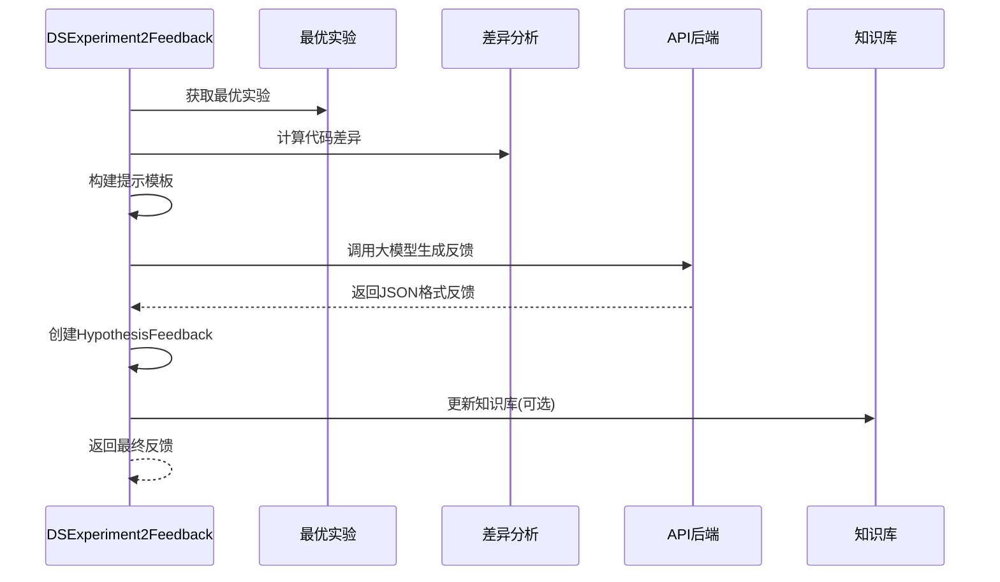

**图表来源**
- [feedback.py](file://rdagent/scenarios/data_science/dev/feedback.py#L24-L126)

#### 关键实现细节

1. **信息收集策略**：
   - 当前实验的任务描述和假设
   - 相对于最优实验的改动分析
   - 实验结果的量化评估
   - 历史反馈的上下文信息

2. **差异分析机制**：
   - 使用generate_diff_from_dict计算代码变更
   - 比较实验工作区的文件差异
   - 提取关键的修改点和新增功能

3. **性能对比逻辑**：
   - 基于ensemble指标进行评分对比
   - 考虑竞赛的评分方向（更高越好/更低越好）
   - 生成直观的性能报告

**节来源**
- [feedback.py](file://rdagent/scenarios/data_science/dev/feedback.py#L34-L126)

### Qlib场景反馈实现

Qlib场景的反馈实现专注于金融量化投资领域的专业评估。

#### 重要指标处理

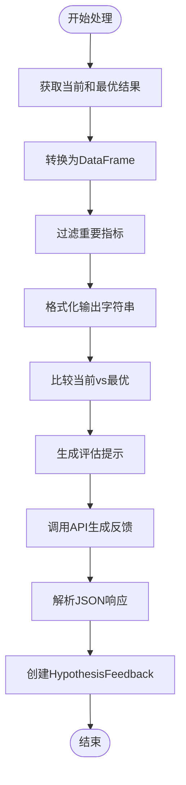

**图表来源**
- [feedback.py](file://rdagent/scenarios/qlib/developer/feedback.py#L15-L57)

#### 金融领域特殊考量

1. **指标标准化**：
   - IC（信息系数）：衡量预测能力
   - 收益率指标：年化收益、最大回撤
   - 风险调整后的绩效指标

2. **场景适配**：
   - 支持因子研究和模型开发两种场景
   - 针对不同任务类型定制评估标准
   - 考虑市场环境和数据特征的影响

**节来源**
- [feedback.py](file://rdagent/scenarios/qlib/developer/feedback.py#L58-L186)

## 反馈生成流程

### 完整生成链路

反馈生成是一个复杂的多阶段过程，涉及数据收集、分析推理和结果封装。

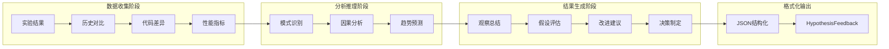

**图表来源**
- [feedback.py](file://rdagent/scenarios/data_science/dev/feedback.py#L34-L126)
- [feedback.py](file://rdagent/scenarios/qlib/developer/feedback.py#L65-L186)

### 性能对比分析机制

#### 数据科学场景对比

在数据科学竞赛中，性能对比主要基于以下维度：

1. **评分指标**：
   - 当前实验的ensemble得分
   - 最优实验的历史最佳得分
   - 评分方向的正负号处理

2. **统计显著性**：
   - 显著性检验支持
   - 置信区间估计
   - 多次运行的一致性验证

3. **相对优势评估**：
   - 性能提升百分比
   - 绝对改善量
   - 相对排名变化

#### Qlib场景对比机制

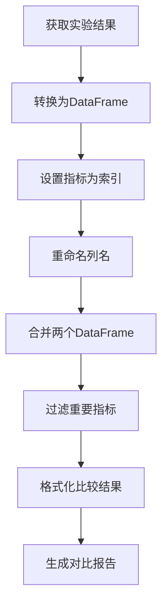

**图表来源**
- [feedback.py](file://rdagent/scenarios/qlib/developer/feedback.py#L15-L57)

**节来源**
- [feedback.py](file://rdagent/scenarios/qlib/developer/feedback.py#L15-L57)

### 结构化结果转化

反馈生成的最终输出需要符合严格的结构化标准，以便后续处理和存储。

#### JSON输出格式

```json
{
    "Observations": "详细的实验观察结果",
    "Feedback for Hypothesis": "对当前假设的评估意见",
    "New Hypothesis": "新的假设建议",
    "Reasoning": "决策的详细理由",
    "Replace Best Result": false,
    "Code Change Summary": "代码变更摘要",
    "EDA Improvement": "EDA改进建议",
    "Acceptable": true
}
```

#### 质量控制机制

1. **完整性检查**：确保所有必需字段都有有效值
2. **一致性验证**：检查字段间逻辑关系的合理性
3. **格式标准化**：统一文本格式和编码规范
4. **异常处理**：优雅处理生成过程中的各种异常情况

**节来源**
- [feedback.py](file://rdagent/scenarios/data_science/dev/feedback.py#L85-L126)

## 多维度评估机制

### CoSTEER评估框架

CoSTEER（Collaborative Software Testing and Evolutionary Evaluation）是RD-Agent中的核心评估框架，提供了全面的代码质量评估能力。

#### 评估层次结构

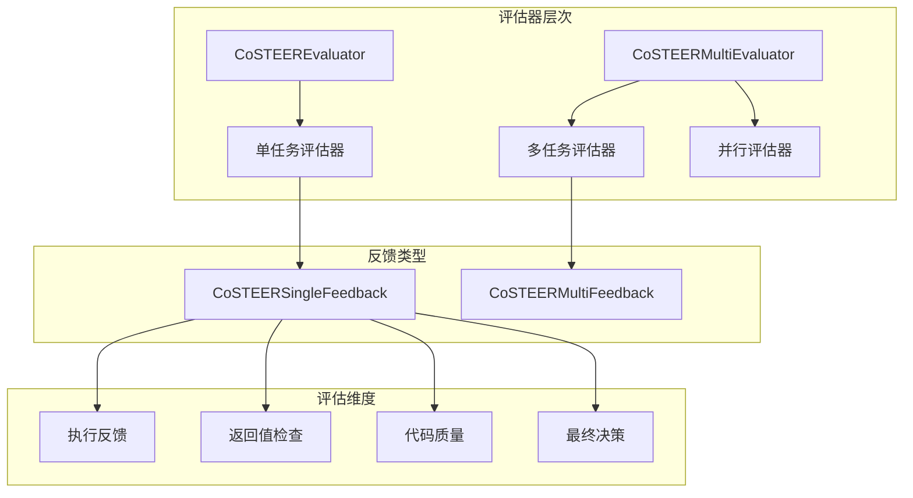

**图表来源**
- [evaluators.py](file://rdagent/components/coder/CoSTEER/evaluators.py#L280-L311)

#### 评估指标体系

| 评估维度 | 具体指标 | 评估标准 | 权重分配 |
|----------|----------|----------|----------|
| 执行质量 | 代码可执行性 | 语法正确性、依赖完整性 | 30% |
| 功能正确性 | 输出准确性 | 与预期结果的一致性 | 40% |
| 性能效率 | 运行时间和资源消耗 | 符合性能基准要求 | 20% |
| 代码规范性 | 遵循编程规范程度 | 代码风格、注释完整性 | 10% |

#### 并行评估机制

CoSTEER支持多评估器并行工作，提高评估效率：

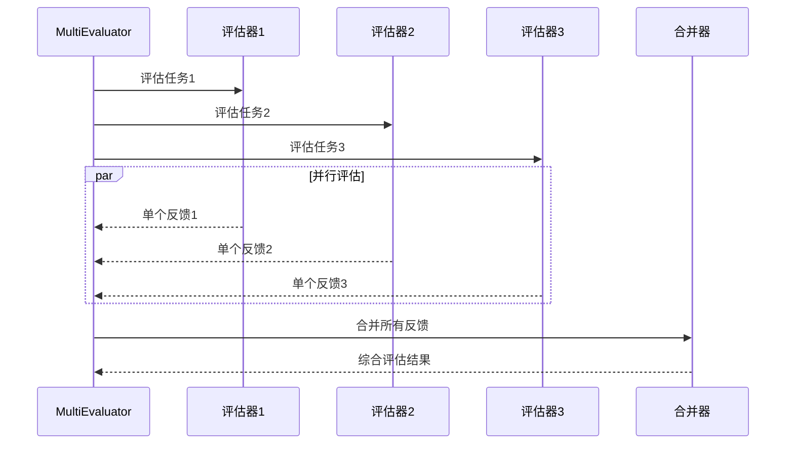

**图表来源**
- [evaluators.py](file://rdagent/components/coder/CoSTEER/evaluators.py#L280-L311)

**节来源**
- [evaluators.py](file://rdagent/components/coder/CoSTEER/evaluators.py#L280-L311)

### 任务级评估机制

#### CoSTEERTask基础类

CoSTEERTask扩展了基础Task类，为评估提供额外的上下文信息：

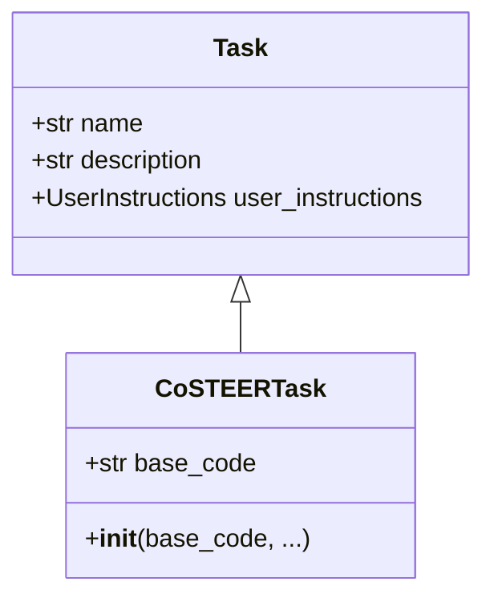

**图表来源**
- [task.py](file://rdagent/components/coder/CoSTEER/task.py#L3-L9)

#### 评估反馈结构

CoSTEERSingleFeedback提供了详细的评估反馈信息：

1. **执行反馈**：代码执行过程中的问题和警告
2. **返回值检查**：输出结果的准确性和完整性
3. **代码质量评估**：代码风格和最佳实践遵循情况
4. **最终决策**：是否通过评估的明确结论

**节来源**
- [evaluators.py](file://rdagent/components/coder/CoSTEER/evaluators.py#L15-L100)

## CoSTEER框架集成

### 演化项目支持

CoSTEER框架与RD-Agent的演化框架深度集成，支持持续的代码改进和优化。

#### 演化策略

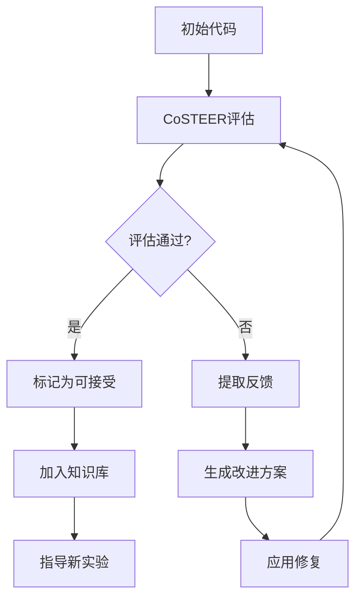

#### 知识管理

CoSTEER框架维护了一个完善的查询知识库，支持：

1. **历史经验查询**：检索类似问题的解决方案
2. **最佳实践推荐**：基于成功案例的指导建议
3. **风险预警**：识别潜在的问题和陷阱
4. **性能基准**：提供性能优化的参考标准

**节来源**
- [evaluators.py](file://rdagent/components/coder/CoSTEER/evaluators.py#L280-L311)

### 多模态评估支持

CoSTEER框架支持多种类型的评估任务：

#### 数据加载器评估
- 文件格式兼容性检查
- 数据完整性验证
- 内存使用优化建议

#### 特征工程评估
- 特征变换的合理性
- 数据泄露检测
- 特征选择的有效性

#### 模型评估
- 模型性能指标
- 过拟合检测
- 超参数优化建议

**节来源**
- [evaluators.py](file://rdagent/components/coder/CoSTEER/evaluators.py#L15-L100)

## 性能优化策略

### 并行处理机制

为了提高大规模实验的评估效率，系统采用了多层次的并行处理策略：

#### 多进程并行评估

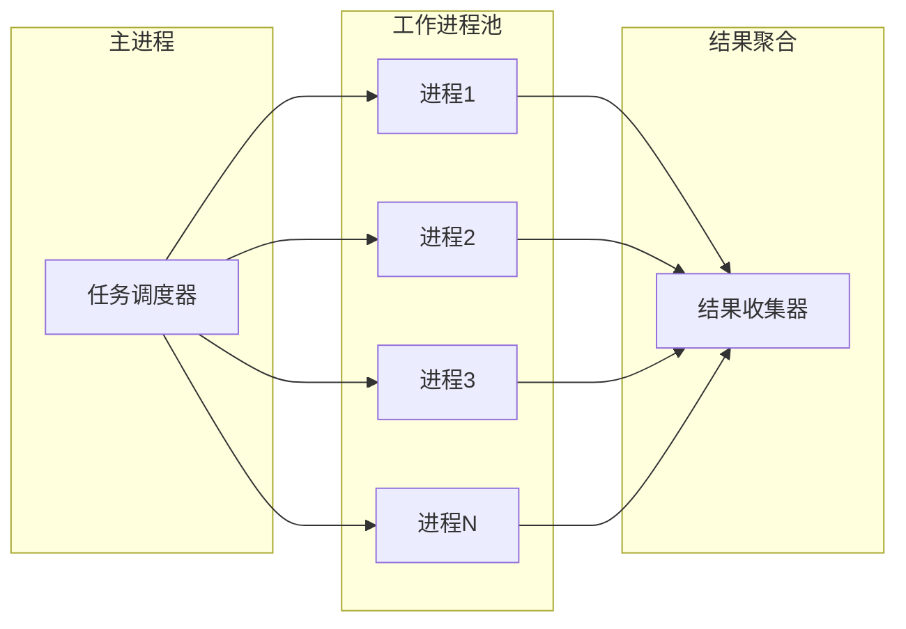

#### 缓存策略

1. **结果缓存**：避免重复计算相同的评估结果
2. **模型缓存**：重用大型语言模型的响应
3. **中间状态缓存**：保存评估过程中的中间结果

### 内存优化

#### 流式处理

对于大规模数据集，系统采用流式处理技术：

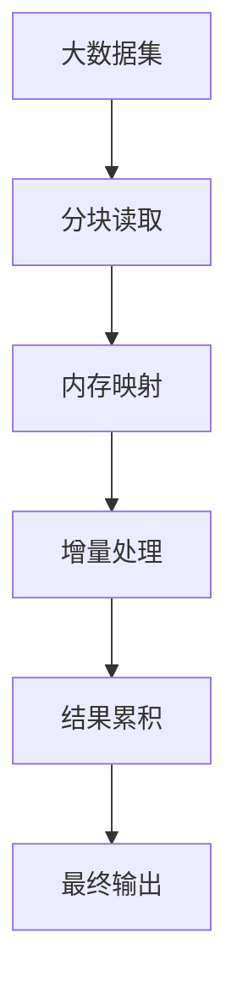

#### 资源监控

系统实时监控内存使用情况，自动调整处理策略：

1. **内存压力检测**：监控可用内存和使用率
2. **动态调整**：根据内存状况调整批处理大小
3. **垃圾回收**：及时释放不再需要的对象

## 故障排除指南

### 常见问题诊断

#### 反馈生成失败

**症状**：generate_feedback方法抛出异常
**可能原因**：
1. 实验对象状态不完整
2. API调用失败
3. 输入数据格式错误

**解决步骤**：
1. 检查实验对象的完整性
2. 验证API连接和认证
3. 格式化输入数据

#### 评估结果不一致

**症状**：相同输入产生不同的评估结果
**可能原因**：
1. 随机种子未固定
2. 环境变量影响
3. 并发访问冲突

**解决步骤**：
1. 设置固定的随机种子
2. 清理环境变量
3. 使用同步机制

### 性能调优建议

#### 评估速度优化

1. **减少API调用频率**：合并多个请求
2. **启用结果缓存**：避免重复计算
3. **优化数据传输**：压缩和序列化优化

#### 内存使用优化

1. **及时释放资源**：使用上下文管理器
2. **分批处理数据**：避免一次性加载大量数据
3. **监控内存使用**：定期检查内存占用

**节来源**
- [evaluators.py](file://rdagent/components/coder/CoSTEER/evaluators.py#L280-L311)

## 总结

RD-Agent的执行反馈分析系统代表了智能实验优化领域的先进实践。通过Experiment2Feedback抽象基类的统一契约设计，系统实现了跨场景的反馈生成标准化；DSExperiment2Feedback和QlibExperiment2Feedback的具体实现则展示了如何在不同领域中应用这一通用框架。

系统的核心创新体现在：

1. **模块化架构**：清晰的分层设计使得系统易于扩展和维护
2. **多维度评估**：结合代码质量、功能正确性和性能表现的全面评估
3. **智能决策支持**：基于历史数据和当前结果的智能化反馈生成
4. **CoSTEER集成**：深度集成的评估框架提供了强大的代码质量保证

该系统不仅为数据科学实验提供了高效的反馈机制，更为其他领域的自动化实验优化提供了可借鉴的设计模式和实现思路。随着人工智能技术的不断发展，这样的智能反馈系统将在科学研究和工程实践中发挥越来越重要的作用。