# 提案生成与选择

<cite>
**本文档引用的文件**
- [proposal.py](file://rdagent/scenarios/data_science/proposal/exp_gen/proposal.py)
- [prompts_v2.yaml](file://rdagent/scenarios/data_science/proposal/exp_gen/prompts_v2.yaml)
- [base.py](file://rdagent/scenarios/data_science/proposal/exp_gen/base.py)
- [idea_pool.py](file://rdagent/scenarios/data_science/proposal/exp_gen/idea_pool.py)
- [trace_scheduler.py](file://rdagent/scenarios/data_science/proposal/exp_gen/trace_scheduler.py)
</cite>

## 目录
1. [引言](#引言)
2. [项目结构概述](#项目结构概述)
3. [核心类分析](#核心类分析)
4. [架构概览](#架构概览)
5. [详细组件分析](#详细组件分析)
6. [依赖关系分析](#依赖关系分析)
7. [性能考虑](#性能考虑)
8. [故障排除指南](#故障排除指南)
9. [结论](#结论)

## 引言

RD-Agent的提案生成与选择机制是其核心智能决策系统，负责在数据科学竞赛环境中自动生成、评估和选择最优的实验假设。该系统通过两代提案生成器（DSProposalV1ExpGen和DSProposalV2ExpGen）实现了从问题识别到实验创建的完整闭环，结合RAG（检索增强生成）机制和智能评分算法，为机器学习模型优化提供了强大的自动化支持。

## 项目结构概述

提案生成与选择模块的核心文件组织如下：

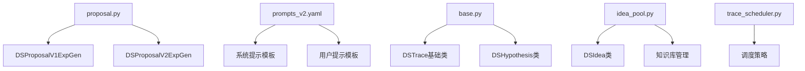

**图表来源**
- [proposal.py](file://rdagent/scenarios/data_science/proposal/exp_gen/proposal.py#L1-L50)
- [base.py](file://rdagent/scenarios/data_science/proposal/exp_gen/base.py#L1-L50)

**章节来源**
- [proposal.py](file://rdagent/scenarios/data_science/proposal/exp_gen/proposal.py#L1-L100)
- [base.py](file://rdagent/scenarios/data_science/proposal/exp_gen/base.py#L1-L100)

## 核心类分析

### DSProposalV1ExpGen类

DSProposalV1ExpGen是第一代提案生成器，采用传统的组件化方法进行实验设计：

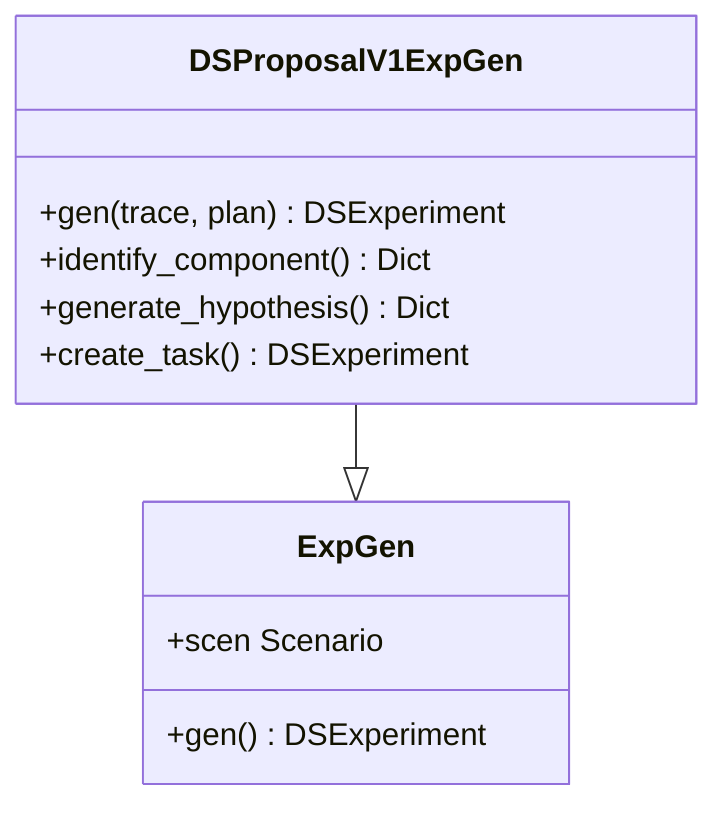

**图表来源**
- [proposal.py](file://rdagent/scenarios/data_science/proposal/exp_gen/proposal.py#L316-L488)

该类的主要工作流程包括：
1. **草稿阶段检查**：首先检查是否需要针对特定组件进行草稿生成
2. **组件识别**：基于当前最佳解决方案和反馈信息确定下一个要改进的组件
3. **假设生成**：为选定的组件生成具体的改进假设
4. **任务创建**：根据假设创建可执行的实验任务

### DSProposalV2ExpGen类

DSProposalV2ExpGen是第二代提案生成器，引入了更复杂的多阶段推理和评估机制：

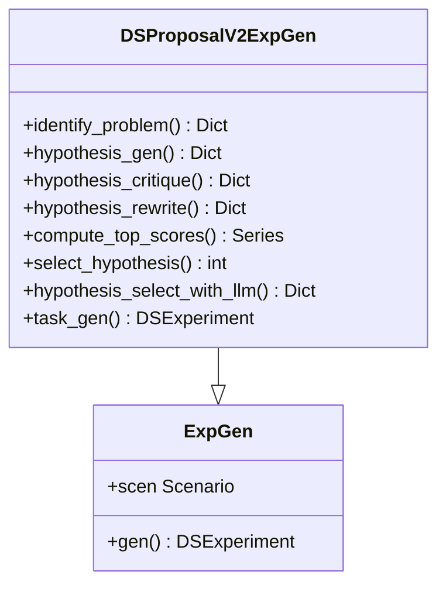

**图表来源**
- [proposal.py](file://rdagent/scenarios/data_science/proposal/exp_gen/proposal.py#L491-L1500)

**章节来源**
- [proposal.py](file://rdagent/scenarios/data_science/proposal/exp_gen/proposal.py#L316-L1500)

## 架构概览

提案生成与选择系统采用分层架构设计，包含以下核心层次：

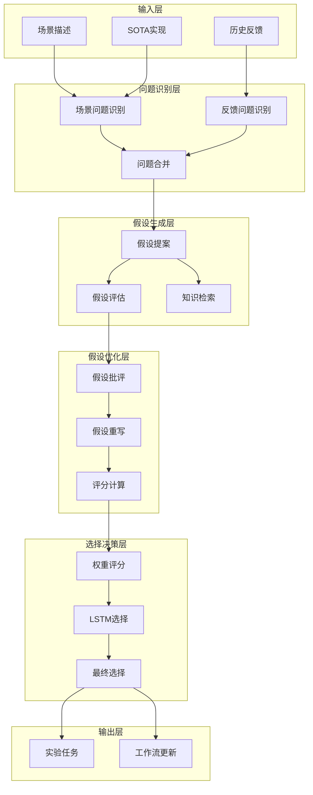

**图表来源**
- [proposal.py](file://rdagent/scenarios/data_science/proposal/exp_gen/proposal.py#L1200-L1500)

## 详细组件分析

### 问题识别机制

问题识别是提案生成的第一步，分为场景问题识别和反馈问题识别两个子过程：

#### 场景问题识别

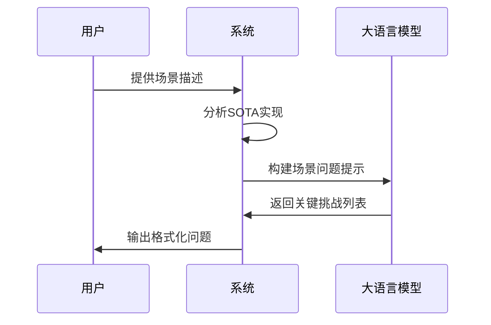

**图表来源**
- [proposal.py](file://rdagent/scenarios/data_science/proposal/exp_gen/proposal.py#L491-L530)

#### 反馈问题识别

反馈问题识别利用历史实验数据和失败案例来发现潜在改进点：

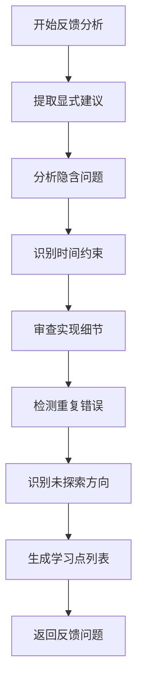

**图表来源**
- [proposal.py](file://rdagent/scenarios/data_science/proposal/exp_gen/proposal.py#L532-L570)

**章节来源**
- [proposal.py](file://rdagent/scenarios/data_science/proposal/exp_gen/proposal.py#L491-L600)

### 假设生成与评估

假设生成过程包含多个阶段，确保生成的假设既创新又可行：

#### 假设提案阶段

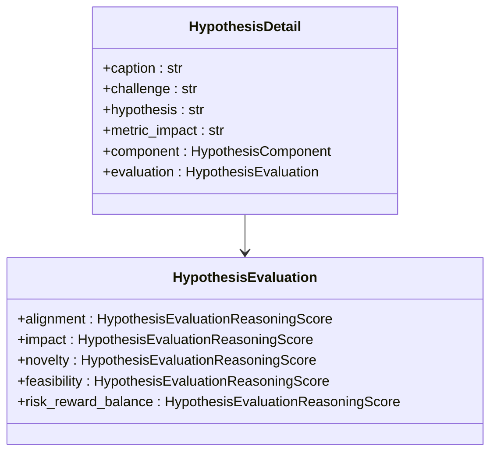

**图表来源**
- [proposal.py](file://rdagent/scenarios/data_science/proposal/exp_gen/proposal.py#L250-L350)

#### 加权评分算法

系统使用加权评分算法对假设进行排序：

| 评分维度 | 权重 | 描述 |
|---------|------|------|
| 对齐度 | 0.2 | 假设与问题的相关性 |
| 影响度 | 0.4 | 预期改进幅度 |
| 创新性 | 0.2 | 新颖程度 |
| 可行性 | 0.1 | 实现难度 |
| 风险收益平衡 | 0.1 | 风险与回报比 |

**章节来源**
- [proposal.py](file://rdagent/scenarios/data_science/proposal/exp_gen/proposal.py#L872-L928)

### RAG知识检索机制

系统集成了RAG（检索增强生成）机制来增强知识检索能力：

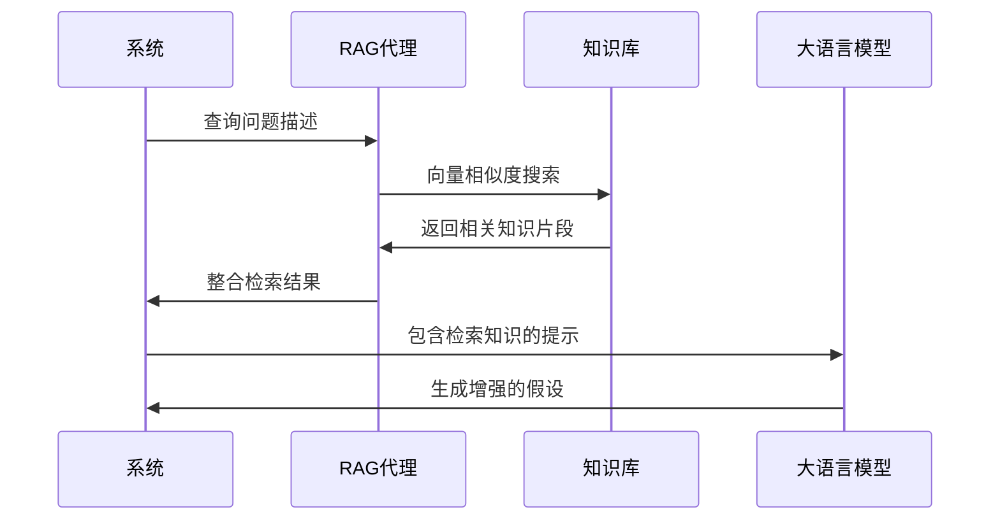

**图表来源**
- [proposal.py](file://rdagent/scenarios/data_science/proposal/exp_gen/proposal.py#L650-L670)

**章节来源**
- [proposal.py](file://rdagent/scenarios/data_science/proposal/exp_gen/proposal.py#L650-L700)

### 组件选择策略

系统采用多层次的组件选择策略：

#### 组件元数据配置

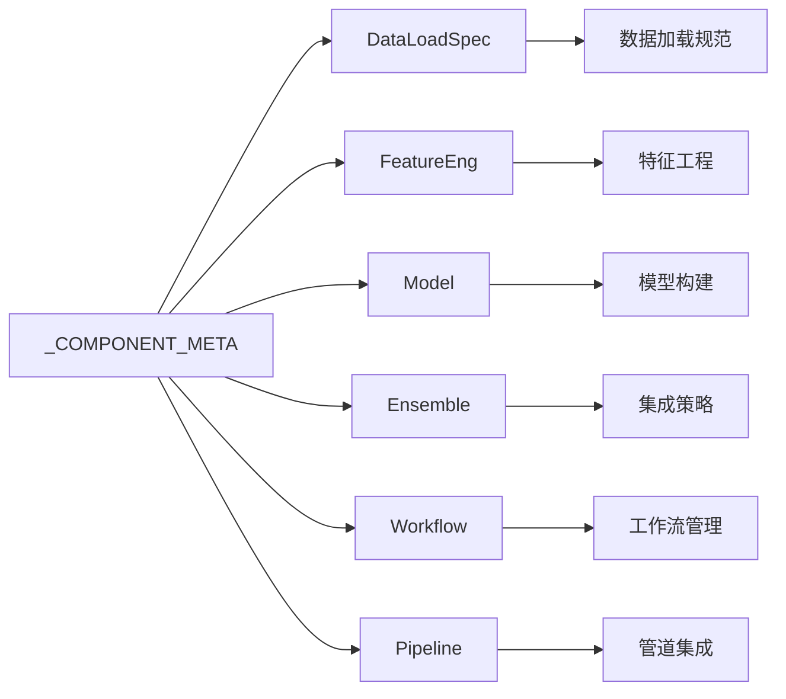

**图表来源**
- [proposal.py](file://rdagent/scenarios/data_science/proposal/exp_gen/proposal.py#L55-L101)

#### 完成顺序控制

系统维护一个标准的组件完成顺序：

```python
COMPLETE_ORDER = ("DataLoadSpec", "FeatureEng", "Model", "Ensemble", "Workflow")
```

**章节来源**
- [proposal.py](file://rdagent/scenarios/data_science/proposal/exp_gen/proposal.py#L103-L110)
- [base.py](file://rdagent/scenarios/data_science/proposal/exp_gen/base.py#L176-L215)

### 智能选择机制

#### 基于LSTM的选择算法

系统实现了基于概率分布的LSTM选择算法：

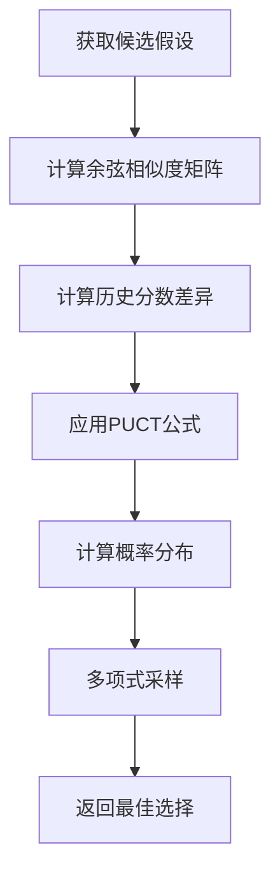

**图表来源**
- [proposal.py](file://rdagent/scenarios/data_science/proposal/exp_gen/proposal.py#L950-L1050)

#### 时间约束处理

系统考虑时间限制进行智能选择：

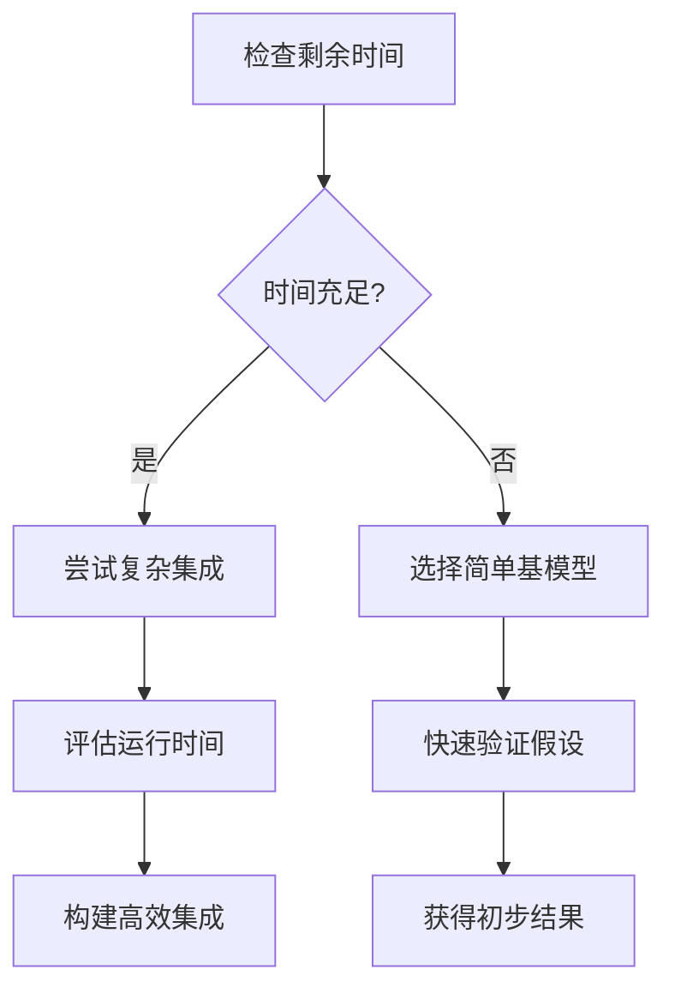

**图表来源**
- [proposal.py](file://rdagent/scenarios/data_science/proposal/exp_gen/proposal.py#L1130-L1200)

**章节来源**
- [proposal.py](file://rdagent/scenarios/data_science/proposal/exp_gen/proposal.py#L950-L1200)

### 知识库与想法池

#### DSIdea类设计

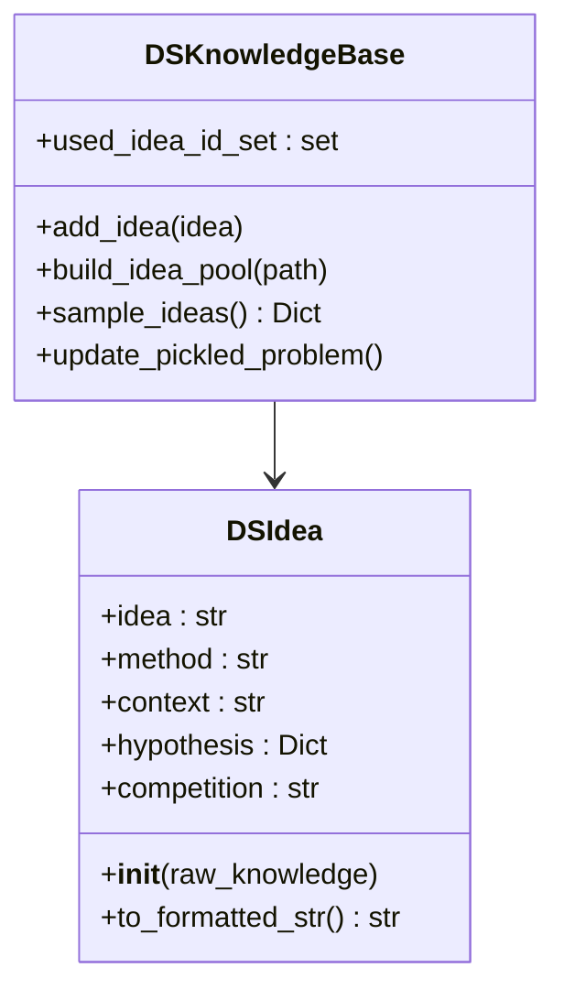

**图表来源**
- [idea_pool.py](file://rdagent/scenarios/data_science/proposal/exp_gen/idea_pool.py#L15-L80)

#### 意图采样机制

系统通过语义相似度搜索和LLM筛选相结合的方式选择最有价值的想法：

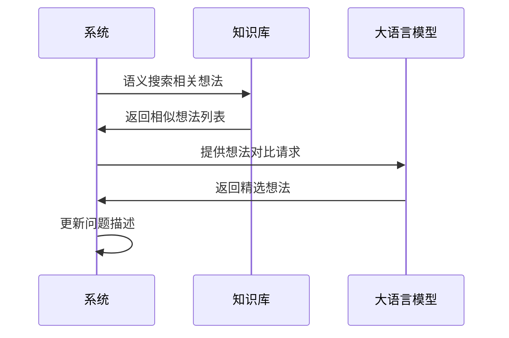

**图表来源**
- [idea_pool.py](file://rdagent/scenarios/data_science/proposal/exp_gen/idea_pool.py#L120-L185)

**章节来源**
- [idea_pool.py](file://rdagent/scenarios/data_science/proposal/exp_gen/idea_pool.py#L1-L185)

### 调度策略

#### Trace调度器架构

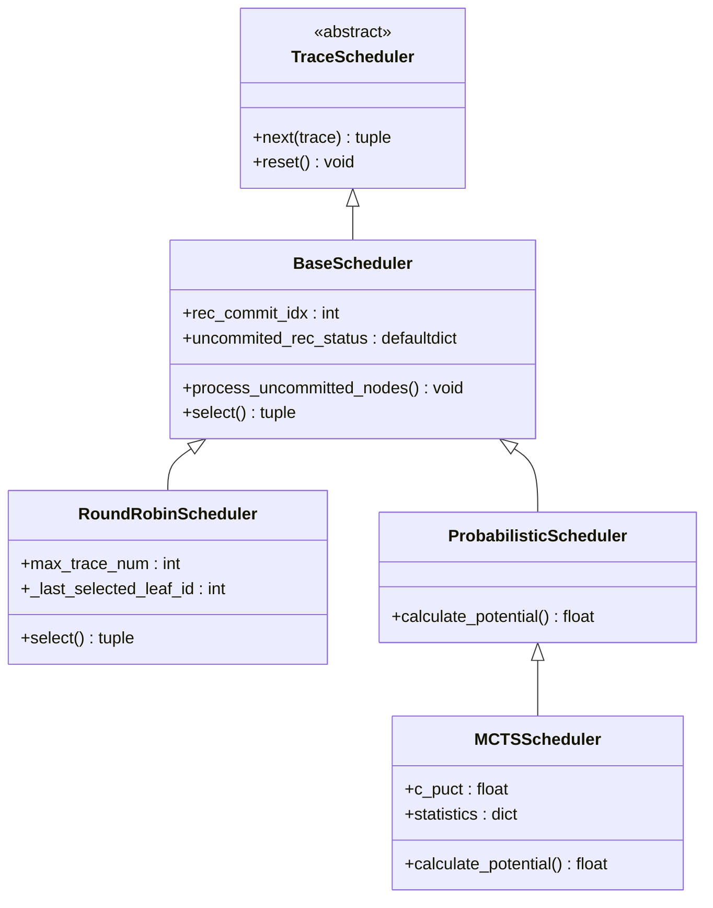

**图表来源**
- [trace_scheduler.py](file://rdagent/scenarios/data_science/proposal/exp_gen/trace_scheduler.py#L38-L143)

#### 调度策略类型

| 策略类型 | 描述 | 适用场景 |
|---------|------|----------|
| RoundRobin | 轮询调度 | 平衡资源使用 |
| TraceLength | 基于长度 | 优先探索短路径 |
| SOTABased | 基于SOTA | 优先高潜力分支 |
| MCTS | 蒙特卡洛树搜索 | 动态探索策略 |

**章节来源**
- [trace_scheduler.py](file://rdagent/scenarios/data_science/proposal/exp_gen/trace_scheduler.py#L38-L334)

## 依赖关系分析

提案生成与选择系统的依赖关系如下：

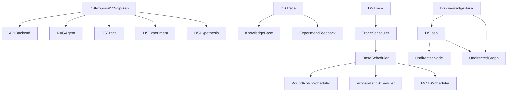

**图表来源**
- [proposal.py](file://rdagent/scenarios/data_science/proposal/exp_gen/proposal.py#L1-L50)
- [base.py](file://rdagent/scenarios/data_science/proposal/exp_gen/base.py#L1-L50)

**章节来源**
- [proposal.py](file://rdagent/scenarios/data_science/proposal/exp_gen/proposal.py#L1-L100)
- [base.py](file://rdagent/scenarios/data_science/proposal/exp_gen/base.py#L1-L100)

## 性能考虑

### 时间复杂度分析

提案生成过程的时间复杂度主要取决于以下因素：

1. **问题识别**：O(n × log n)，其中n为问题数量
2. **假设生成**：O(m × k)，其中m为组件数量，k为假设数量
3. **评分计算**：O(p × q)，其中p为假设数量，q为评分维度数
4. **选择决策**：O(r)，其中r为候选假设总数

### 内存优化策略

1. **延迟加载**：仅在需要时加载大型知识库
2. **缓存机制**：缓存频繁访问的嵌入向量
3. **流式处理**：对大规模数据集采用流式处理
4. **内存池**：复用对象以减少GC压力

### 并行化优化

系统支持多种并行化策略：

- **组件并行**：不同组件可以并行生成假设
- **假设并行**：同一问题的不同假设可以并行评估
- **知识库并行**：多个知识库可以并行查询
- **调度器并行**：多个调度器可以独立工作

## 故障排除指南

### 常见问题及解决方案

#### 假设生成失败

**症状**：假设生成返回空结果或无效假设
**原因**：问题描述不清晰或知识库为空
**解决方案**：
1. 检查输入的问题描述格式
2. 验证知识库是否正确初始化
3. 调整RAG检索参数

#### 评分异常

**症状**：假设评分出现NaN或异常值
**原因**：评分维度缺失或数值格式错误
**解决方案**：
1. 检查评分维度的完整性
2. 验证数值转换的正确性
3. 添加异常值处理逻辑

#### 时间超限

**症状**：实验创建过程耗时过长
**原因**：假设数量过多或计算复杂度过高
**解决方案**：
1. 限制同时处理的假设数量
2. 优化评分计算算法
3. 使用近似方法加速计算

**章节来源**
- [proposal.py](file://rdagent/scenarios/data_science/proposal/exp_gen/proposal.py#L872-L928)

## 结论

RD-Agent的提案生成与选择机制代表了自动化机器学习领域的重要进展。通过DSProposalV1ExpGen和DSProposalV2ExpGen两代系统的演进，系统实现了从简单的组件化改进到复杂的多阶段推理和评估的跨越。

该系统的核心优势包括：

1. **智能化程度高**：通过多阶段推理和评估确保假设质量
2. **知识融合能力强**：集成RAG机制提供丰富的背景知识
3. **适应性强**：支持多种调度策略和时间约束处理
4. **可扩展性好**：模块化设计便于功能扩展

未来发展方向可能包括：
- 更先进的大语言模型集成
- 自适应的学习策略
- 更精细的资源管理
- 更强的领域知识融合

这个提案生成与选择系统为数据科学竞赛中的自动化实验设计提供了强大而灵活的解决方案，显著提升了机器学习模型开发的效率和效果。