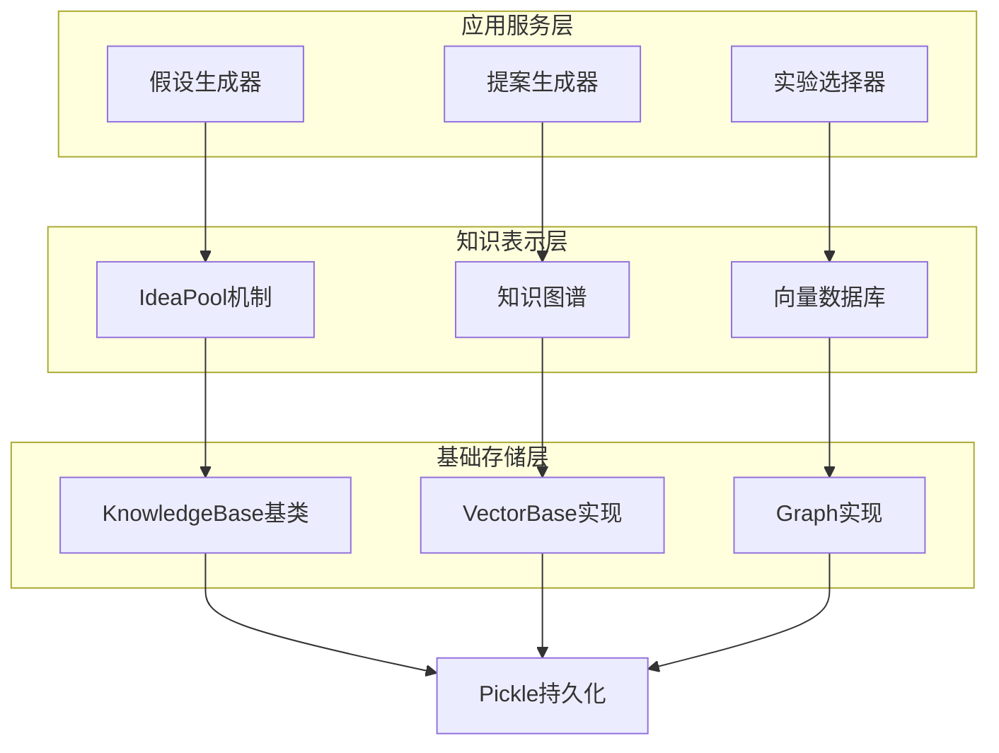
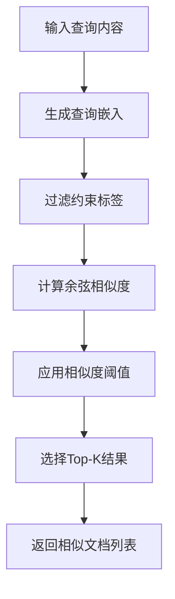
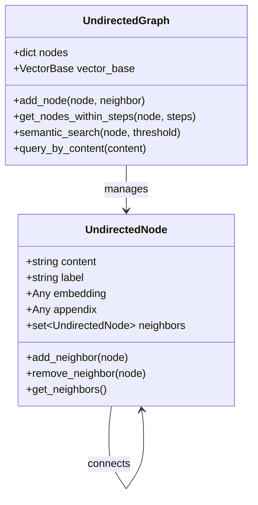
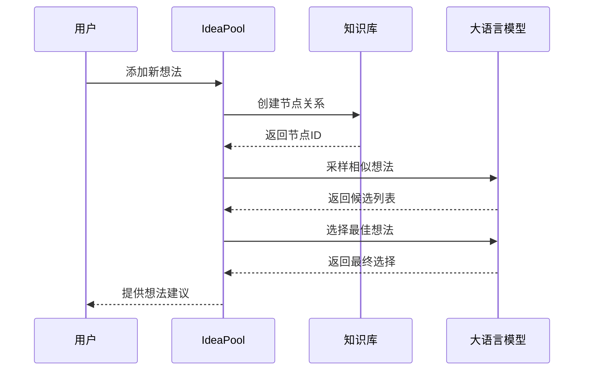
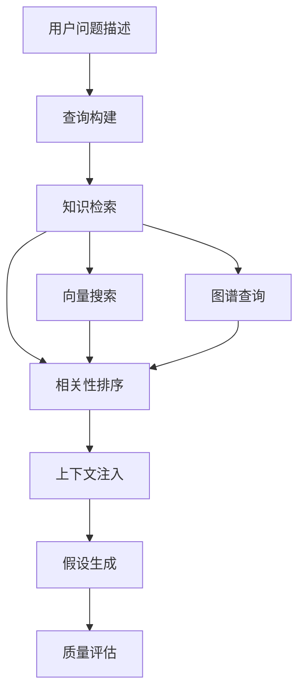
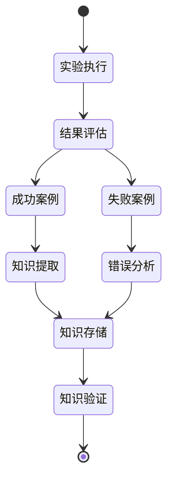
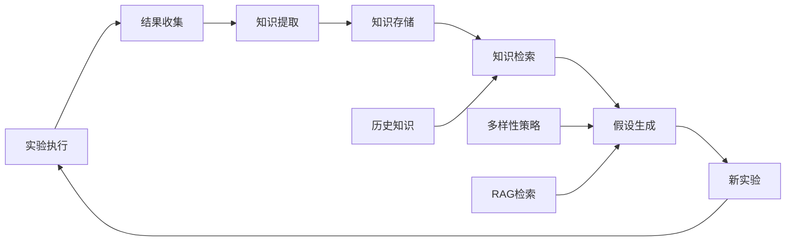

# 知识管理协同

<cite>
**本文档引用的文件**
- [knowledge_base.py](file://rdagent/core/knowledge_base.py)
- [vector_base.py](file://rdagent/components/knowledge_management/vector_base.py)
- [graph.py](file://rdagent/components/knowledge_management/graph.py)
- [idea_pool.py](file://rdagent/scenarios/data_science/proposal/exp_gen/idea_pool.py)
- [diversity_strategy.py](file://rdagent/scenarios/data_science/proposal/exp_gen/diversity_strategy.py)
- [base.py](file://rdagent/scenarios/data_science/proposal/exp_gen/base.py)
- [utils.py](file://rdagent/scenarios/data_science/proposal/exp_gen/utils.py)
- [proposal.py](file://rdagent/scenarios/data_science/proposal/exp_gen/proposal.py)
- [knowledge_management.py](file://rdagent/components/coder/CoSTEER/knowledge_management.py)
- [evolving_framework.py](file://rdagent/core/evolving_framework.py)
</cite>

## 目录
1. [引言](#引言)
2. [知识管理架构概览](#知识管理架构概览)
3. [KnowledgeBase核心类设计](#knowledgebase核心类设计)
4. [向量数据库与图谱存储后端](#向量数据库与图谱存储后端)
5. [IdeaPool机制与假设多样性](#ideapool机制与假设多样性)
6. [RAG知识检索在假设生成中的应用](#rag知识检索在假设生成中的应用)
7. [知识更新策略与生命周期管理](#知识更新策略与生命周期管理)
8. [反馈闭环中的协同作用](#反馈闭环中的协同作用)
9. [性能优化与最佳实践](#性能优化与最佳实践)
10. [总结](#总结)

## 引言

RD-Agent的知识管理模块是整个智能研发系统的核心基础设施，它通过多层次的知识存储、检索和更新机制，实现了从实验经验到假设生成再到实验验证的完整反馈闭环。该模块采用混合存储架构，结合向量数据库和图谱数据库的优势，为数据科学实验提供了强大的知识支撑能力。

## 知识管理架构概览

RD-Agent的知识管理架构采用分层设计，包含基础存储层、知识表示层和应用服务层三个主要层次。

**图表来源**
- [knowledge_base.py](file://rdagent/core/knowledge_base.py#L1-L28)
- [vector_base.py](file://rdagent/components/knowledge_management/vector_base.py#L1-L50)
- [graph.py](file://rdagent/components/knowledge_management/graph.py#L1-L100)

**章节来源**
- [knowledge_base.py](file://rdagent/core/knowledge_base.py#L1-L28)
- [vector_base.py](file://rdagent/components/knowledge_management/vector_base.py#L1-L209)
- [graph.py](file://rdagent/components/knowledge_management/graph.py#L1-L498)

## KnowledgeBase核心类设计

KnowledgeBase类作为整个知识管理系统的基础抽象，提供了统一的知识存储和检索接口。它采用Pickle序列化技术实现知识的持久化存储，并支持路径配置和自动加载功能。

### 核心设计特点

1. **统一接口设计**：所有具体的知识存储实现都继承自KnowledgeBase基类，确保了接口的一致性和可扩展性
2. **自动持久化**：通过构造函数自动加载已有的知识数据，通过dump方法自动保存当前状态
3. **灵活路径管理**：支持字符串和Path对象作为存储路径，提供灵活的文件组织方式
4. **类型安全**：通过类型注解确保知识对象的正确性

### 存储机制

KnowledgeBase采用以下存储策略：
- **二进制序列化**：使用dill库进行深度序列化，支持复杂对象的持久化
- **目录结构**：自动创建父目录，确保存储路径的完整性
- **条件保存**：只有在设置了有效路径时才执行保存操作

**章节来源**
- [knowledge_base.py](file://rdagent/core/knowledge_base.py#L1-L28)

## 向量数据库与图谱存储后端

RD-Agent采用混合存储架构，结合向量数据库和图谱数据库的优势，为不同类型的知识提供最优的存储和检索方案。

### 向量数据库（VectorBase）

VectorBase基于Pandas DataFrame实现，提供了高效的语义相似性搜索能力。

#### 核心组件

1. **KnowledgeMetaData**：知识元数据类，支持内容分割、嵌入生成和序列化
2. **PDVectorBase**：基于Pandas的向量数据库实现
3. **文档处理**：支持大文本的分块处理和批量嵌入生成

#### 搜索算法

向量数据库采用余弦相似度计算语义相似性：

**图表来源**
- [vector_base.py](file://rdagent/components/knowledge_management/vector_base.py#L120-L209)

#### 使用场景

- **语义搜索**：基于内容相似性的知识检索
- **内容分割**：长文档的智能分块处理
- **批量处理**：大规模知识的高效嵌入生成

### 图谱数据库（Graph）

图谱数据库基于UndirectedGraph实现，提供了丰富的关联关系表达能力。

#### 节点关系模型

**图表来源**
- [graph.py](file://rdagent/components/knowledge_management/graph.py#L15-L100)

#### 查询机制

图谱数据库支持多维度的查询策略：

1. **语义搜索**：基于嵌入相似性的内容检索
2. **邻域查询**：基于图结构的关联节点发现
3. **约束查询**：基于标签和距离的过滤机制

**章节来源**
- [vector_base.py](file://rdagent/components/knowledge_management/vector_base.py#L1-L209)
- [graph.py](file://rdagent/components/knowledge_management/graph.py#L1-L498)

## IdeaPool机制与假设多样性

IdeaPool机制是RD-Agent促进假设多样性的核心组件，通过结构化的知识池管理和智能采样策略，为实验生成提供丰富的创意来源。

### DSIdea结构设计

DSIdea类定义了假设的基本结构，包含以下核心字段：

- **idea**：假设的核心概念标签
- **method**：使用的具体方法描述  
- **context**：实施该假设的具体示例
- **hypothesis**：假设的具体内容，包含场景问题和反馈问题

### IdeaPool工作流程

**图表来源**
- [idea_pool.py](file://rdagent/scenarios/data_science/proposal/exp_gen/idea_pool.py#L80-L150)

### 多样性策略

IdeaPool集成了多种多样性注入策略：

1. **根节点注入**：仅在创建新子追踪时注入多样性上下文
2. **SOTA限制**：直到获得首个SOTA实验前持续注入多样性
3. **始终注入**：在整个过程中持续提供多样性支持

### 知识融合机制

IdeaPool通过以下机制实现知识的有效融合：

- **竞争隔离**：避免同一竞赛中的重复想法
- **标签约束**：基于问题类型的标签过滤
- **相似度控制**：防止过于相似的想法被重复使用

**章节来源**
- [idea_pool.py](file://rdagent/scenarios/data_science/proposal/exp_gen/idea_pool.py#L1-L186)
- [diversity_strategy.py](file://rdagent/scenarios/data_science/proposal/exp_gen/diversity_strategy.py#L1-L69)

## RAG知识检索在假设生成中的应用

RAG（Retrieval-Augmented Generation）知识检索在假设生成阶段发挥着关键作用，通过智能的知识检索和上下文注入，显著提升了假设生成的质量和相关性。

### RAG工作流程

**图表来源**
- [proposal.py](file://rdagent/scenarios/data_science/proposal/exp_gen/proposal.py#L629-L684)

### 查询构建策略

RAG系统采用多模态查询构建策略：

1. **问题格式化**：将用户输入的问题转换为标准化格式
2. **上下文整合**：结合历史实验反馈和当前场景描述
3. **目标明确化**：清晰定义需要检索的知识类型

### 相关性排序算法

系统采用以下排序策略：

- **语义相似度**：基于嵌入向量的余弦相似度计算
- **标签匹配**：优先考虑相关标签的文档
- **时间权重**：较新的知识具有更高的权重

### 上下文注入机制

RAG系统通过以下方式注入检索到的上下文：

1. **直接注入**：将检索到的相关文档直接作为提示内容
2. **摘要生成**：对大量检索结果生成综合摘要
3. **结构化组织**：按照主题和重要性对上下文进行结构化组织

**章节来源**
- [proposal.py](file://rdagent/scenarios/data_science/proposal/exp_gen/proposal.py#L629-L684)

## 知识更新策略与生命周期管理

RD-Agent采用多层次的知识更新策略，确保知识库的时效性和准确性。知识的生命周期管理涵盖了从产生、存储、检索到废弃的完整过程。

### 知识产生机制

**图表来源**
- [knowledge_management.py](file://rdagent/components/coder/CoSTEER/knowledge_management.py#L163-L191)

### 更新策略分类

1. **增量更新**：基于新实验结果的增量式知识添加
2. **版本控制**：支持知识库的版本演进和回滚
3. **冲突解决**：处理知识冲突和不一致情况
4. **清理策略**：定期清理过时和无效的知识条目

### 生命周期管理

知识的生命周期包括以下阶段：

- **创建阶段**：实验结果转化为结构化知识
- **验证阶段**：知识的有效性和准确性验证
- **存储阶段**：持久化存储和索引建立
- **检索阶段**：基于需求的知识查询和推荐
- **更新阶段**：新知识的合并和现有知识的修正
- **归档阶段**：不再活跃知识的归档处理

### 持久化机制

系统采用以下持久化策略：

- **自动保存**：每次知识更新后自动保存
- **增量备份**：只备份发生变化的部分
- **版本标记**：为每个保存点添加版本标识
- **故障恢复**：支持从任意保存点恢复

**章节来源**
- [knowledge_management.py](file://rdagent/components/coder/CoSTEER/knowledge_management.py#L71-L101)
- [evolving_framework.py](file://rdagent/core/evolving_framework.py#L88-L126)

## 反馈闭环中的协同作用

RD-Agent的知识管理模块在反馈闭环中发挥着关键的协同作用，通过知识的积累、共享和应用，形成了一个自我强化的学习循环。

### 协同作用机制

**图表来源**
- [base.py](file://rdagent/scenarios/data_science/proposal/exp_gen/base.py#L50-L100)

### 知识积累模式

1. **实验驱动**：每个实验都产生相应的知识条目
2. **分类存储**：按实验类型和领域进行知识分类
3. **关联建立**：建立知识之间的关联关系
4. **层次化组织**：形成从具体到抽象的知识层次

### 共享机制

知识在系统内部通过以下方式进行共享：

- **实时检索**：实验过程中实时获取相关知识
- **批量学习**：定期批量更新知识库
- **分布式存储**：支持多个实例间的知识同步
- **权限控制**：基于角色的知识访问控制

### 应用效果

知识管理模块的协同作用体现在：

- **效率提升**：减少重复性工作的投入
- **质量保证**：基于历史经验提高实验成功率
- **创新促进**：通过知识融合激发新的想法
- **一致性维护**：确保知识体系的连贯性

**章节来源**
- [base.py](file://rdagent/scenarios/data_science/proposal/exp_gen/base.py#L1-L349)
- [utils.py](file://rdagent/scenarios/data_science/proposal/exp_gen/utils.py#L1-L106)

## 性能优化与最佳实践

为了确保知识管理模块的高效运行，系统采用了多种性能优化策略和最佳实践。

### 存储优化

1. **内存映射**：对于大型知识库采用内存映射技术
2. **索引优化**：建立多级索引加速查询速度
3. **缓存策略**：实现智能缓存减少重复计算
4. **压缩存储**：采用压缩算法减少存储空间

### 查询优化

- **并行处理**：支持多线程并行知识检索
- **预计算**：预先计算常用查询的结果
- **智能路由**：根据查询特征选择最优的检索路径
- **结果缓存**：缓存相似查询的结果

### 扩展性设计

- **插件架构**：支持新的存储后端和检索算法
- **配置驱动**：通过配置文件调整系统行为
- **监控指标**：提供详细的性能监控和分析
- **容量规划**：支持动态扩容和容量预测

## 总结

RD-Agent的知识管理模块通过精心设计的架构和算法，实现了高效的知识积累、存储、检索和应用。该模块的协同作用不仅提升了单次实验的质量，更重要的是建立了整个系统的自我学习和进化能力。

### 核心优势

1. **混合存储架构**：向量数据库和图谱数据库的有机结合
2. **智能检索机制**：基于语义相似性和结构关联的知识检索
3. **多样性保障**：通过IdeaPool机制确保假设的多样性
4. **反馈闭环**：完整的知识产生、存储、应用和更新流程
5. **性能优化**：多层次的性能优化策略确保系统高效运行

### 应用价值

该知识管理模块为数据科学实验提供了强大的智能支撑，显著提升了实验效率和成功率，为AI驱动的研发过程奠定了坚实的基础。随着系统的不断演进，它将在更多的应用场景中发挥重要作用，推动人工智能在科学研究和工程实践中的深入应用。