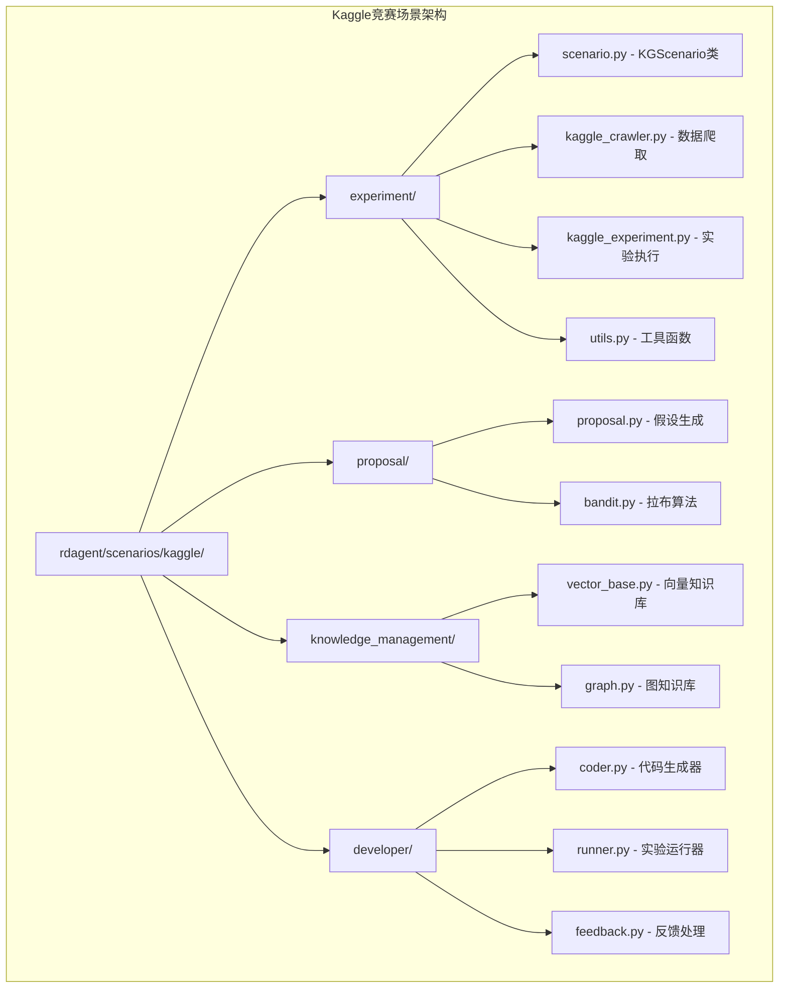
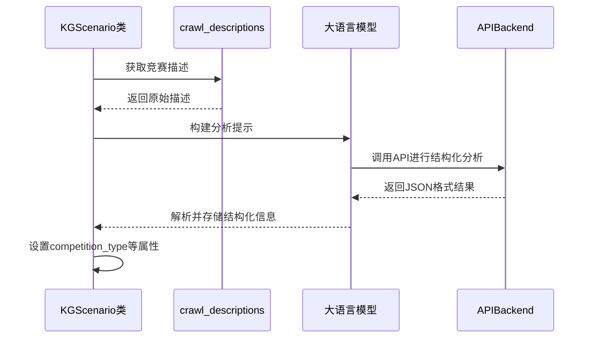
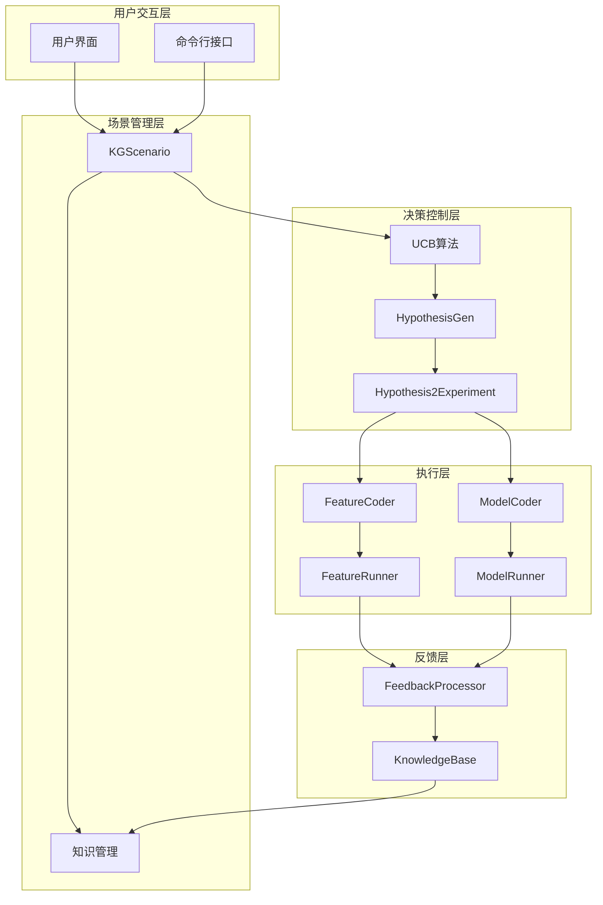
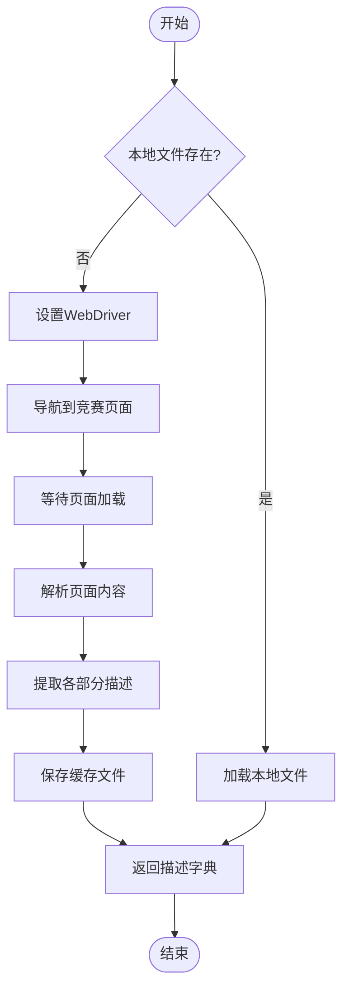
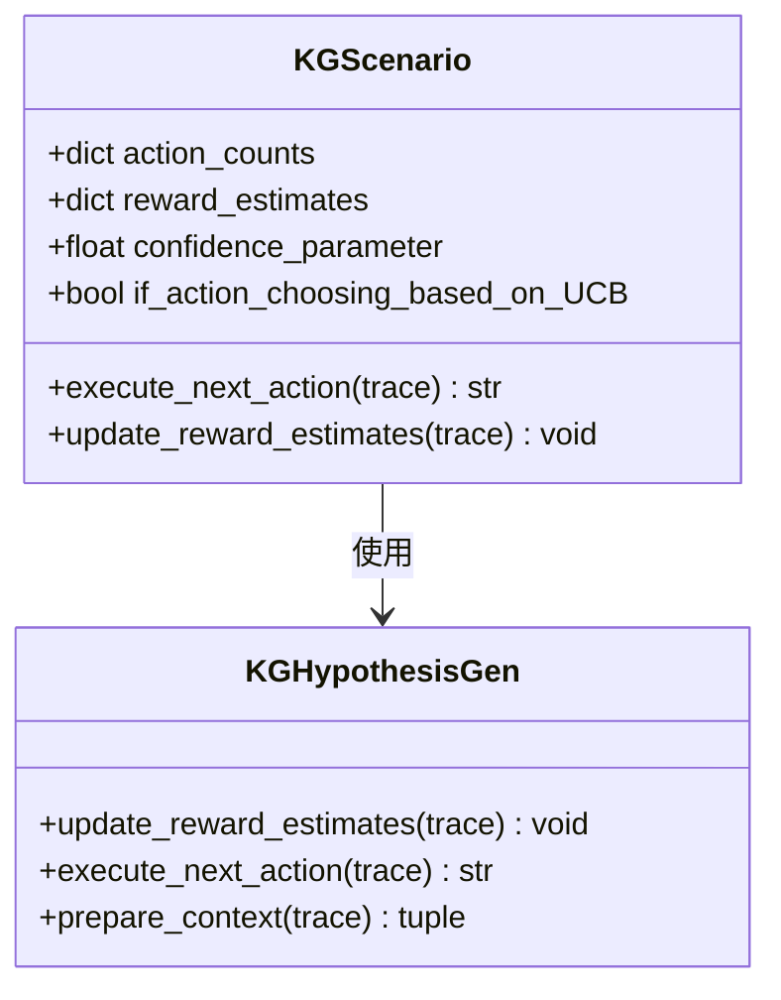
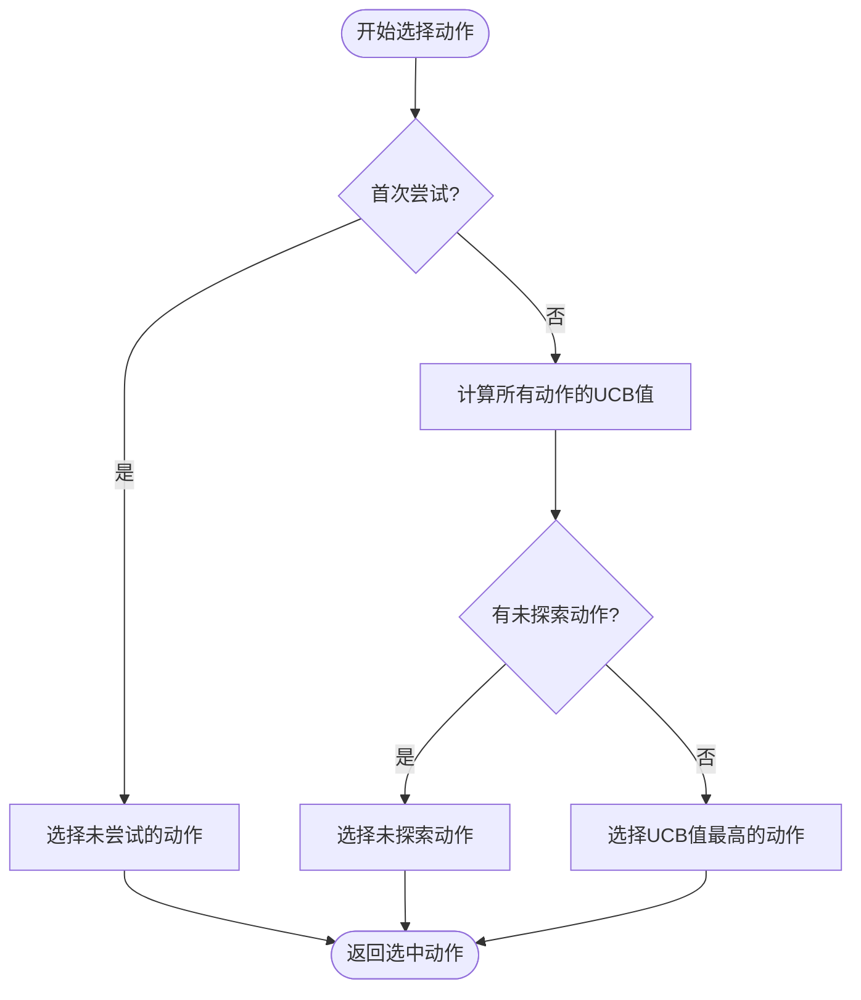
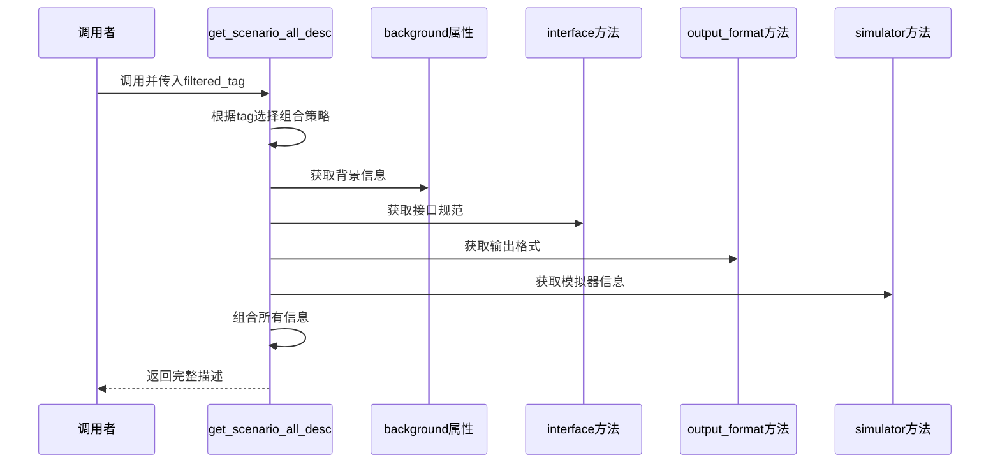
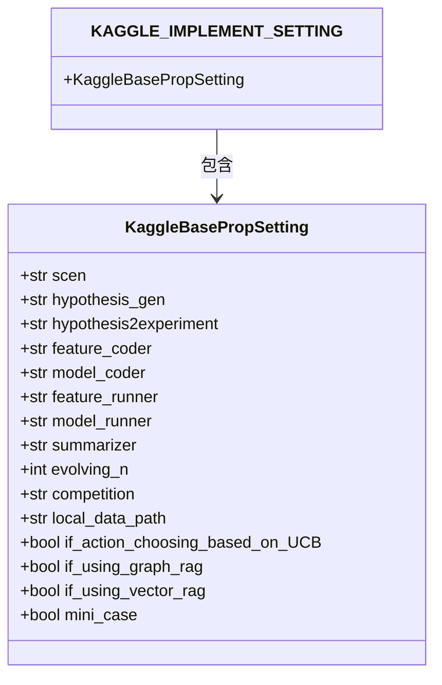
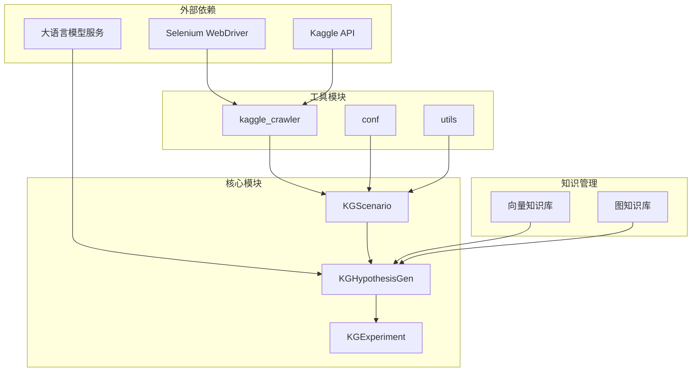

# Kaggle竞赛场景调度

<cite>
**本文档中引用的文件**
- [scenario.py](file://rdagent/scenarios/kaggle/experiment/scenario.py)
- [proposal.py](file://rdagent/scenarios/kaggle/proposal/proposal.py)
- [kaggle_crawler.py](file://rdagent/scenarios/kaggle/kaggle_crawler.py)
- [conf.py](file://rdagent/app/kaggle/conf.py)
- [kaggle_experiment.py](file://rdagent/scenarios/kaggle/experiment/kaggle_experiment.py)
- [utils.py](file://rdagent/scenarios/kaggle/experiment/utils.py)
</cite>

## 目录
1. [引言](#引言)
2. [项目结构概述](#项目结构概述)
3. [核心组件分析](#核心组件分析)
4. [架构概览](#架构概览)
5. [详细组件分析](#详细组件分析)
6. [依赖关系分析](#依赖关系分析)
7. [性能考虑](#性能考虑)
8. [故障排除指南](#故障排除指南)
9. [结论](#结论)

## 引言

RD-Agent是一个智能研发系统，专门设计用于自动化Kaggle竞赛中的特征工程和模型优化过程。该系统采用模块化的调度策略，通过KGScenario类为核心，结合UCB算法的动作选择机制，实现了高效的竞赛解决方案开发流程。

本文档深入分析了RD-Agent在Kaggle竞赛场景中的模块调度策略，重点关注KGScenario类如何利用crawl_descriptions获取竞赛描述，并通过_analysis_competition_description调用LLM提取结构化任务信息。同时详细说明了get_scenario_all_desc方法如何根据filtered_tag参数动态组合背景信息、接口规范和模拟器指令，以及action_counts和reward_estimates机制如何实现基于UCB算法的动作选择策略。

## 项目结构概述

RD-Agent的Kaggle竞赛场景模块采用分层架构设计，主要包含以下核心目录结构：



**图表来源**
- [scenario.py](file://rdagent/scenarios/kaggle/experiment/scenario.py#L1-L50)
- [proposal.py](file://rdagent/scenarios/kaggle/proposal/proposal.py#L1-L30)

**章节来源**
- [scenario.py](file://rdagent/scenarios/kaggle/experiment/scenario.py#L1-L100)
- [conf.py](file://rdagent/app/kaggle/conf.py#L1-L50)

## 核心组件分析

### KGScenario类的核心功能

KGScenario类是Kaggle竞赛场景调度的核心组件，负责管理整个竞赛解决方案的生命周期。该类继承自基础Scenario类，提供了竞赛描述分析、数据预处理、实验指导等功能。

#### 主要属性和初始化

KGScenario类在初始化时完成以下关键操作：

1. **竞赛描述获取**：通过`crawl_descriptions`函数从Kaggle网站获取竞赛详细信息
2. **评估指标方向确定**：根据排行榜分数计算评估指标的方向（更高越好或更低越好）
3. **奖励估计初始化**：为不同动作类型设置初始奖励估计值
4. **UCB参数配置**：启用基于UCB算法的动作选择机制

#### 竞赛描述分析机制

KGScenario类通过`_analysis_competition_description`方法实现竞赛描述的结构化分析：



**图表来源**
- [scenario.py](file://rdagent/scenarios/kaggle/experiment/scenario.py#L67-L95)
- [kaggle_crawler.py](file://rdagent/scenarios/kaggle/kaggle_crawler.py#L35-L120)

**章节来源**
- [scenario.py](file://rdagent/scenarios/kaggle/experiment/scenario.py#L35-L100)

## 架构概览

RD-Agent的Kaggle竞赛场景调度采用多层架构设计，实现了高度模块化和可扩展性：



**图表来源**
- [scenario.py](file://rdagent/scenarios/kaggle/experiment/scenario.py#L35-L80)
- [proposal.py](file://rdagent/scenarios/kaggle/proposal/proposal.py#L100-L150)

## 详细组件分析

### KGScenario类详细分析

#### 竞赛描述获取机制

KGScenario类通过`crawl_descriptions`函数实现竞赛描述的自动获取：



**图表来源**
- [kaggle_crawler.py](file://rdagent/scenarios/kaggle/kaggle_crawler.py#L35-L120)

#### 结构化任务信息提取

通过LLM分析竞赛描述，提取以下关键信息：

| 信息类型 | 描述 | 用途 |
|---------|------|------|
| 竞赛类型 | Classification, Regression, etc. | 决定使用的技术栈 |
| 竞赛描述 | 问题背景和目标 | 提供上下文信息 |
| 目标描述 | 预测目标变量 | 定义训练目标 |
| 竞赛特征 | 输入特征列表 | 特征工程指导 |
| 提交规范 | 输出格式要求 | 结果格式化 |
| 评估描述 | 性能指标定义 | 性能优化导向 |

**章节来源**
- [scenario.py](file://rdagent/scenarios/kaggle/experiment/scenario.py#L67-L95)

### UCB算法动作选择机制

#### 动作计数和奖励估计

KGScenario类维护两个关键数据结构来支持UCB算法：



**图表来源**
- [scenario.py](file://rdagent/scenarios/kaggle/experiment/scenario.py#L55-L75)
- [proposal.py](file://rdagent/scenarios/kaggle/proposal/proposal.py#L180-L250)

#### UCB算法实现逻辑

UCB算法通过以下公式计算每个动作的置信上界：

```
UCB = μ_o + c × √(ln(t) / n_o)
```

其中：
- μ_o 是动作o的平均奖励估计
- c 是置信参数（默认为1.0）
- t 是总尝试次数
- n_o 是动作o被选择的次数



**图表来源**
- [proposal.py](file://rdagent/scenarios/kaggle/proposal/proposal.py#L230-L250)

**章节来源**
- [proposal.py](file://rdagent/scenarios/kaggle/proposal/proposal.py#L180-L250)

### get_scenario_all_desc方法分析

该方法根据filtered_tag参数动态组合不同的场景描述信息：

#### 参数过滤机制

| filtered_tag | 组合内容 | 用途 |
|-------------|----------|------|
| None | 全部信息 | 完整的实验指导 |
| "hypothesis_and_experiment" | 背景+模拟器 | 假设验证环境 |
| "feature" | 特征工程相关信息 | 特征开发指导 |
| 其他 | 模型相关信息 | 模型开发指导 |

#### 动态信息组合流程



**图表来源**
- [scenario.py](file://rdagent/scenarios/kaggle/experiment/scenario.py#L250-L280)

**章节来源**
- [scenario.py](file://rdagent/scenarios/kaggle/experiment/scenario.py#L250-L280)

### 配置管理系统

#### KAGGLE_IMPLEMENT_SETTING配置

RD-Agent通过KAGGLE_IMPLEMENT_SETTING类管理所有Kaggle相关的配置：



**图表来源**
- [conf.py](file://rdagent/app/kaggle/conf.py#L5-L95)

#### 关键配置参数说明

| 配置项 | 类型 | 默认值 | 说明 |
|-------|------|--------|------|
| if_action_choosing_based_on_UCB | bool | False | 是否启用UCB算法 |
| if_using_graph_rag | bool | False | 是否使用图知识库 |
| if_using_vector_rag | bool | False | 是否使用向量知识库 |
| mini_case | bool | False | 是否启用小规模测试 |
| local_data_path | str | "" | 本地数据存储路径 |

**章节来源**
- [conf.py](file://rdagent/app/kaggle/conf.py#L5-L95)

## 依赖关系分析

RD-Agent的Kaggle竞赛场景模块具有清晰的依赖层次结构：



**图表来源**
- [scenario.py](file://rdagent/scenarios/kaggle/experiment/scenario.py#L1-L20)
- [proposal.py](file://rdagent/scenarios/kaggle/proposal/proposal.py#L1-L30)

**章节来源**
- [scenario.py](file://rdagent/scenarios/kaggle/experiment/scenario.py#L1-L30)
- [proposal.py](file://rdagent/scenarios/kaggle/proposal/proposal.py#L1-L30)

## 性能考虑

### 并发处理优化

RD-Agent在处理多个竞赛场景时采用以下优化策略：

1. **异步数据爬取**：使用Selenium WebDriver异步获取竞赛信息
2. **缓存机制**：本地缓存竞赛描述和排行榜数据
3. **增量更新**：只在必要时重新分析竞赛描述
4. **资源池管理**：复用LLM API连接和知识库实例

### 内存使用优化

- **延迟加载**：仅在需要时加载完整的竞赛数据
- **对象池**：重用KGScenario实例以减少内存分配
- **垃圾回收**：及时清理不再使用的实验对象

### 计算复杂度分析

| 操作 | 时间复杂度 | 空间复杂度 | 说明 |
|------|-----------|-----------|------|
| 竞赛描述爬取 | O(n) | O(1) | n为页面元素数量 |
| LLM分析 | O(1) | O(1) | 固定输入大小 |
| UCB计算 | O(a) | O(a) | a为动作数量 |
| 知识库查询 | O(log n) | O(k) | n为节点数，k为结果数 |

## 故障排除指南

### 常见问题及解决方案

#### 1. 竞赛描述获取失败

**症状**：无法从Kaggle网站获取竞赛描述
**原因**：网络连接问题或反爬虫机制
**解决方案**：
- 检查网络连接状态
- 更新ChromeDriver版本
- 增加等待时间参数
- 使用本地缓存文件

#### 2. UCB算法选择异常

**症状**：动作选择出现无限循环或错误
**原因**：奖励估计或动作计数数据异常
**解决方案**：
- 检查reward_estimates初始化
- 验证action_counts数据完整性
- 重置UCB参数配置

#### 3. 知识库访问失败

**症状**：RAG功能无法正常工作
**原因**：知识库文件损坏或路径配置错误
**解决方案**：
- 验证知识库文件完整性
- 检查rag_path配置
- 重新构建知识库索引

**章节来源**
- [kaggle_crawler.py](file://rdagent/scenarios/kaggle/kaggle_crawler.py#L35-L120)
- [proposal.py](file://rdagent/scenarios/kaggle/proposal/proposal.py#L230-L250)

## 结论

RD-Agent的Kaggle竞赛场景调度系统展现了现代AI驱动的研发自动化系统的先进设计理念。通过KGScenario类为核心的模块化架构，结合UCB算法的动作选择机制，该系统实现了高效、智能的竞赛解决方案开发流程。

### 主要优势

1. **模块化设计**：清晰的职责分离和可扩展的架构
2. **智能决策**：基于UCB算法的平衡探索与利用策略
3. **知识管理**：多层次的知识库支持（向量和图）
4. **自动化程度高**：从数据获取到解决方案提交的全流程自动化

### 技术创新点

- **动态场景描述生成**：根据竞赛特点实时调整实验指导
- **奖励反馈机制**：基于实际性能结果的持续学习
- **多模态知识融合**：结合结构化和非结构化知识源
- **并发处理能力**：支持多个竞赛场景的并行处理

### 应用前景

该系统不仅适用于Kaggle竞赛场景，其模块化设计和智能调度策略也为其他数据科学竞赛和自动化研发场景提供了宝贵的参考价值。随着AI技术的不断发展，这种基于强化学习和知识图谱的智能研发系统将成为未来数据科学领域的重要工具。