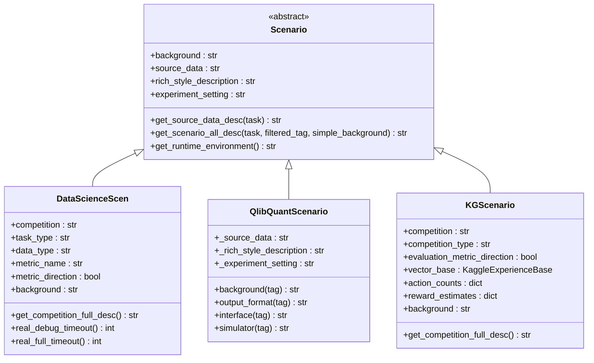
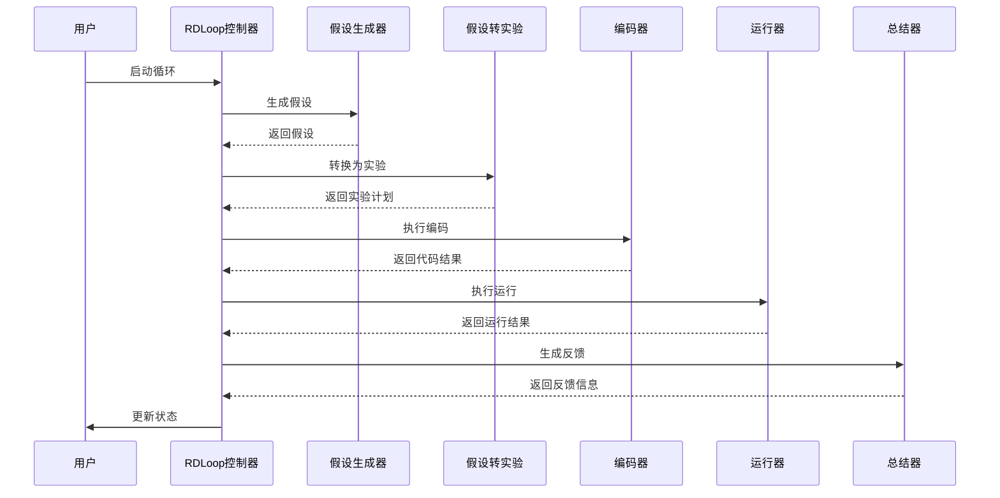
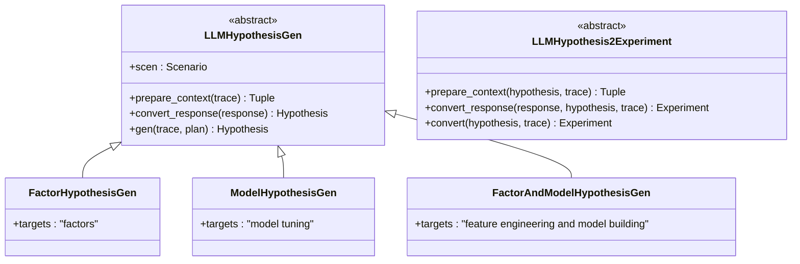
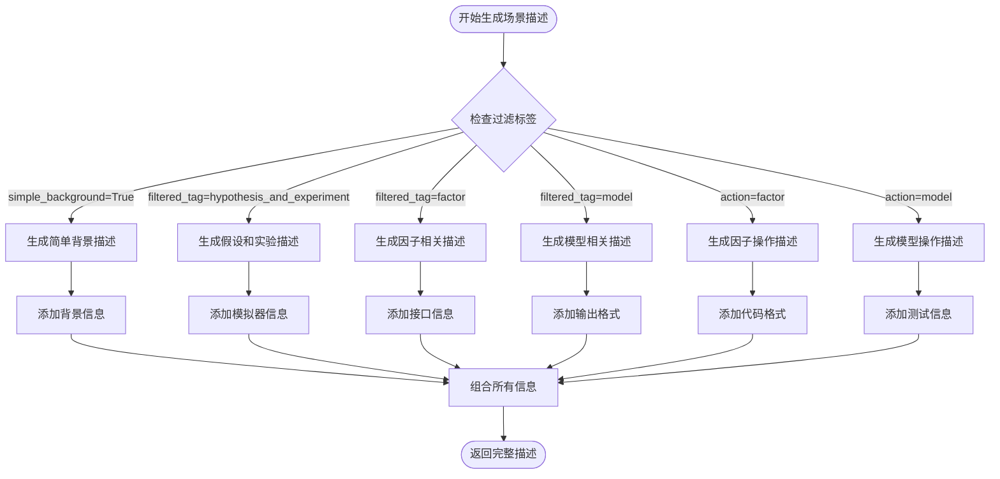
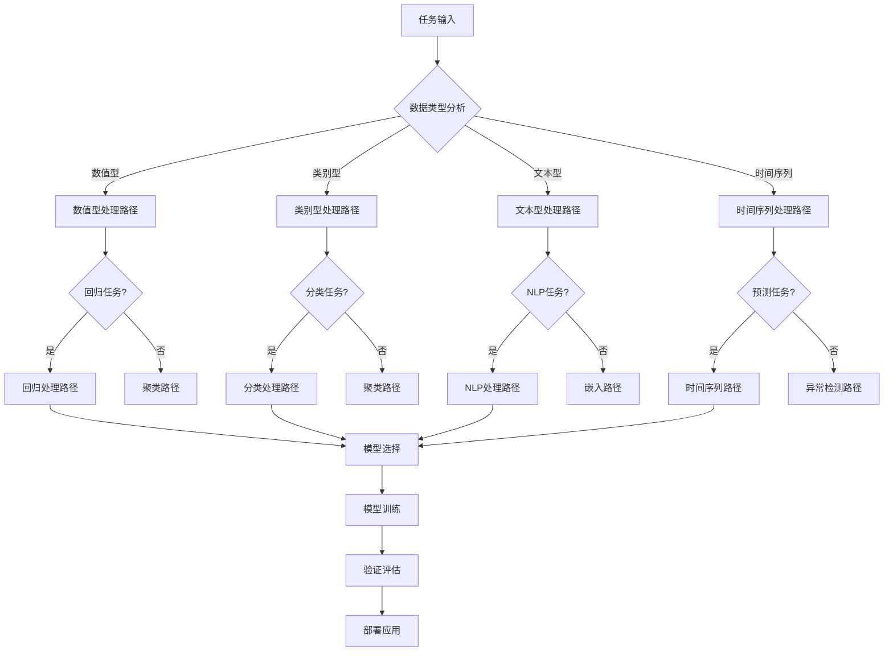
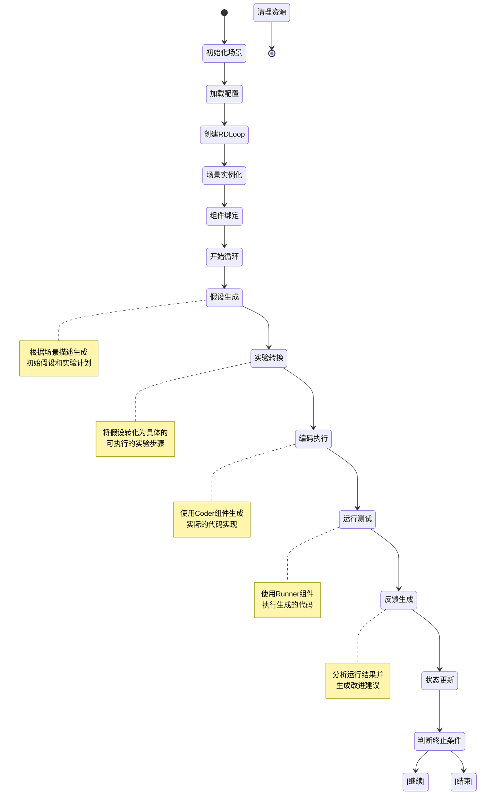

# 场景驱动的模块调度

<cite>
**本文档中引用的文件**
- [rdagent/core/scenario.py](file://rdagent/core/scenario.py)
- [rdagent/components/workflow/rd_loop.py](file://rdagent/components/workflow/rd_loop.py)
- [rdagent/components/proposal/__init__.py](file://rdagent/components/proposal/__init__.py)
- [rdagent/components/runner/__init__.py](file://rdagent/components/runner/__init__.py)
- [rdagent/scenarios/data_science/scen/__init__.py](file://rdagent/scenarios/data_science/scen/__init__.py)
- [rdagent/scenarios/qlib/experiment/quant_experiment.py](file://rdagent/scenarios/qlib/experiment/quant_experiment.py)
- [rdagent/scenarios/kaggle/experiment/scenario.py](file://rdagent/scenarios/kaggle/experiment/scenario.py)
- [rdagent/app/data_science/loop.py](file://rdagent/app/data_science/loop.py)
- [rdagent/app/data_science/conf.py](file://rdagent/app/data_science/conf.py)
- [rdagent/app/qlib_rd_loop/conf.py](file://rdagent/app/qlib_rd_loop/conf.py)
</cite>

## 目录
1. [引言](#引言)
2. [场景抽象基类设计](#场景抽象基类设计)
3. [具体场景实现](#具体场景实现)
4. [模块调度架构](#模块调度架构)
5. [场景描述信息动态生成](#场景描述信息动态生成)
6. [任务类型选择与执行路径](#任务类型选择与执行路径)
7. [状态图展示](#状态图展示)
8. [总结](#总结)

## 引言

RD-Agent采用场景驱动的模块调度机制，通过Scenario抽象基类作为适配器统一管理不同领域的研发流程。该机制能够根据具体场景的需求，智能地选择和调度Coder、Runner和Proposal等核心组件，实现针对不同任务类型（feature/model/factor）的差异化处理。

## 场景抽象基类设计

### Scenario抽象基类结构

Scenario抽象基类定义了所有场景实现必须遵循的标准接口，为场景驱动的模块调度提供了统一的抽象层。

**图表来源**
- [rdagent/core/scenario.py](file://rdagent/core/scenario.py#L5-L63)
- [rdagent/scenarios/data_science/scen/__init__.py](file://rdagent/scenarios/data_science/scen/__init__.py#L26-L255)
- [rdagent/scenarios/qlib/experiment/quant_experiment.py](file://rdagent/scenarios/qlib/experiment/quant_experiment.py#L38-L201)
- [rdagent/scenarios/kaggle/experiment/scenario.py](file://rdagent/scenarios/kaggle/experiment/scenario.py#L35-L280)

### 核心接口设计

Scenario基类定义了以下核心接口：

1. **背景信息接口**：提供场景的基本背景和上下文信息
2. **数据描述接口**：动态生成源数据的描述信息
3. **富文本描述接口**：提供格式化的场景描述
4. **运行时环境接口**：获取当前场景的运行环境信息
5. **综合描述接口**：组合所有场景信息生成完整的描述

**章节来源**
- [rdagent/core/scenario.py](file://rdagent/core/scenario.py#L5-L63)

## 具体场景实现

### DataScienceScen场景

DataScienceScen专门用于处理数据科学竞赛场景，支持Kaggle等平台的数据科学挑战。

#### 核心特性
- **自动数据分析**：通过LLM分析原始数据描述和数据集特征
- **任务类型识别**：自动识别回归、分类、聚类等任务类型
- **超时管理**：支持动态调整编码器和运行器的超时时间
- **多模态支持**：支持数值型、类别型、文本型等多种数据类型

#### 关键方法实现
- `background()`：生成包含任务类型、数据类型、评估指标的背景信息
- `get_competition_full_desc()`：生成完整的竞赛描述信息
- `real_debug_timeout()`：计算调试阶段的实际超时时间
- `real_full_timeout()`：计算完整数据集运行的实际超时时间

**章节来源**
- [rdagent/scenarios/data_science/scen/__init__.py](file://rdagent/scenarios/data_science/scen/__init__.py#L26-L255)

### QlibQuantScenario场景

QlibQuantScenario专为量化金融研究设计，支持因子开发和模型训练。

#### 核心特性
- **双环境支持**：同时支持因子生成和模型训练两种运行环境
- **任务分离**：明确区分factor和model两种不同类型的任务
- **标准化接口**：提供标准化的代码输出格式和接口规范
- **模拟器集成**：内置因子和模型的测试模拟器

#### 关键方法实现
- `background(tag)`：根据任务类型返回相应的背景信息
- `output_format(tag)`：返回指定任务类型的输出格式要求
- `interface(tag)`：返回指定任务类型的代码接口规范
- `simulator(tag)`：返回指定任务类型的测试模拟器信息

**章节来源**
- [rdagent/scenarios/qlib/experiment/quant_experiment.py](file://rdagent/scenarios/qlib/experiment/quant_experiment.py#L38-L201)

### KGScenario场景

KGScenario专门为Kaggle竞赛设计，实现了基于强化学习的动作选择机制。

#### 核心特性
- **动作选择**：基于UCB算法的智能动作选择机制
- **知识库集成**：支持向量检索和图谱知识库
- **奖励机制**：基于历史表现的奖励估计系统
- **多行动支持**：支持特征处理、特征工程、模型选择、模型调优等多种行动

#### 关键方法实现
- `_analysis_competition_description()`：分析竞赛描述信息
- `get_competition_full_desc()`：生成完整的竞赛描述
- `interface(tag)`：根据行动类型返回相应的接口规范

**章节来源**
- [rdagent/scenarios/kaggle/experiment/scenario.py](file://rdagent/scenarios/kaggle/experiment/scenario.py#L35-L280)

## 模块调度架构

### RDLoop工作流架构

RDLoop是RD-Agent的核心工作流控制器，负责协调各个组件的执行。

**图表来源**
- [rdagent/components/workflow/rd_loop.py](file://rdagent/components/workflow/rd_loop.py#L25-L92)

### 组件调度机制

#### 1. 场景初始化
RDLoop在初始化时会根据配置加载相应的场景实例，并建立与其他组件的连接关系。

#### 2. 循环控制
通过异步协程实现并行执行多个实验循环，支持动态调整并发数量。

#### 3. 状态管理
维护完整的执行历史记录，支持断点续传和状态恢复。

**章节来源**
- [rdagent/components/workflow/rd_loop.py](file://rdagent/components/workflow/rd_loop.py#L25-L92)

### Proposal组件集成

Proposal组件通过继承LLMHypothesisGen和LLMHypothesis2Experiment实现智能化的假设生成和转换。

**图表来源**
- [rdagent/components/proposal/__init__.py](file://rdagent/components/proposal/__init__.py#L12-L138)

**章节来源**
- [rdagent/components/proposal/__init__.py](file://rdagent/components/proposal/__init__.py#L12-L138)

## 场景描述信息动态生成

### get_scenario_all_desc方法详解

每个场景都实现了`get_scenario_all_desc`方法，用于动态生成场景描述信息。该方法支持多种过滤参数，可以根据需要生成不同粒度的描述信息。

#### 参数说明
- `task`: 当前任务对象（可选）
- `filtered_tag`: 过滤标签，支持"hypothesis_and_experiment"、"feedback"、"factor"、"model"等
- `simple_background`: 是否只返回简单的背景信息
- `action`: 特定的操作类型

#### 动态生成逻辑

**图表来源**
- [rdagent/scenarios/qlib/experiment/quant_experiment.py](file://rdagent/scenarios/qlib/experiment/quant_experiment.py#L130-L199)
- [rdagent/scenarios/kaggle/experiment/scenario.py](file://rdagent/scenarios/kaggle/experiment/scenario.py#L240-L280)

### 场景特定的描述生成

#### DataScienceScen的描述生成
DataScienceScen通过分析竞赛描述和数据集特征，自动生成包含任务类型、数据类型、评估指标等关键信息的描述。

#### QlibQuantScenario的描述生成
QlibQuantScenario根据不同任务类型（factor/model）生成差异化的描述信息，包括代码接口、输出格式、测试模拟器等。

#### KGScenario的描述生成
KGScenario根据竞赛类型和目标，生成包含特征工程、模型选择、性能评估等内容的描述信息。

**章节来源**
- [rdagent/scenarios/data_science/scen/__init__.py](file://rdagent/scenarios/data_science/scen/__init__.py#L220-L255)
- [rdagent/scenarios/qlib/experiment/quant_experiment.py](file://rdagent/scenarios/qlib/experiment/quant_experiment.py#L130-L199)
- [rdagent/scenarios/kaggle/experiment/scenario.py](file://rdagent/scenarios/kaggle/experiment/scenario.py#L240-L280)

## 任务类型选择与执行路径

### 任务类型识别机制

RD-Agent通过多种方式识别和处理不同类型的机器学习任务：

#### 1. 数据类型识别
- **数值型数据**：支持连续值和离散值的处理
- **类别型数据**：支持分类变量的编码和处理
- **文本型数据**：支持自然语言处理任务
- **时间序列数据**：支持时间相关特征的提取

#### 2. 任务类型映射
- **回归任务**：预测连续值输出
- **分类任务**：预测离散类别标签
- **聚类任务**：发现数据内在结构
- **异常检测**：识别异常样本

### 执行路径选择

### 场景特化处理

#### DataScienceScen的处理策略
- **自动特征工程**：基于数据类型自动选择特征工程技术
- **模型比较**：自动比较多种模型的性能
- **超参数优化**：使用贝叶斯优化等高级技术
- **集成学习**：支持多种集成方法

#### QlibQuantScenario的处理策略
- **因子开发**：专注于量化因子的生成和测试
- **模型训练**：支持多种机器学习模型
- **回测系统**：内置回测框架
- **风险管理**：考虑交易成本和流动性约束

#### KGScenario的处理策略
- **动作选择**：基于强化学习的智能动作选择
- **知识检索**：利用向量和图谱知识库
- **性能监控**：实时监控竞赛排名变化
- **策略优化**：动态调整实验策略

**章节来源**
- [rdagent/app/data_science/conf.py](file://rdagent/app/data_science/conf.py#L10-L20)
- [rdagent/app/qlib_rd_loop/conf.py](file://rdagent/app/qlib_rd_loop/conf.py#L5-L120)

## 状态图展示

### 完整的场景驱动模块调度流程

### 关键状态节点说明

1. **初始化场景**：根据配置创建相应的场景实例
2. **加载配置**：读取并验证模块配置参数
3. **创建RDLoop**：初始化主控制器实例
4. **场景实例化**：创建具体的场景对象
5. **组件绑定**：建立各组件间的依赖关系
6. **开始循环**：进入主要的工作循环
7. **假设生成**：生成初始的研究假设
8. **实验转换**：将假设转化为具体实验
9. **编码执行**：执行代码生成过程
10. **运行测试**：执行生成的代码
11. **反馈生成**：生成实验反馈信息
12. **状态更新**：更新系统状态和历史记录
13. **判断终止条件**：检查是否继续或结束循环
14. **清理资源**：释放系统资源

## 总结

RD-Agent的场景驱动模块调度机制通过以下核心设计实现了高效的自动化研发流程：

### 主要优势

1. **统一抽象**：Scenario基类提供了统一的接口标准，使得不同领域的场景可以无缝集成
2. **灵活配置**：通过配置文件支持灵活的组件选择和参数调整
3. **智能调度**：基于任务类型和场景特征的智能模块选择
4. **动态生成**：场景描述信息的动态生成确保了信息的准确性和时效性
5. **状态管理**：完善的状态跟踪和恢复机制保证了系统的可靠性

### 应用价值

- **降低使用门槛**：用户无需深入了解底层实现细节即可使用复杂的机器学习流程
- **提高研发效率**：自动化程度高，减少人工干预
- **保证质量**：通过标准化的流程和严格的验证机制确保输出质量
- **易于扩展**：模块化设计便于添加新的场景和功能

这种场景驱动的设计模式为RD-Agent在不同领域和任务中的成功应用奠定了坚实的基础，展现了现代AI辅助研发工具的发展方向。