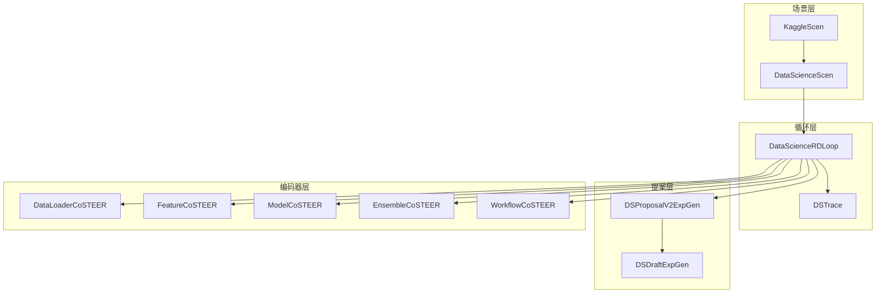
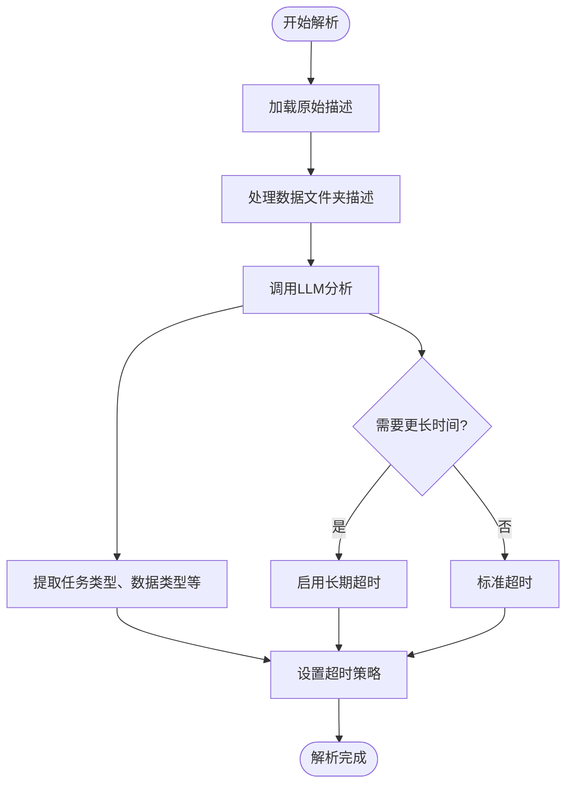
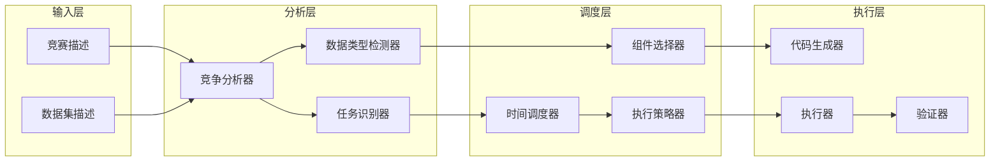
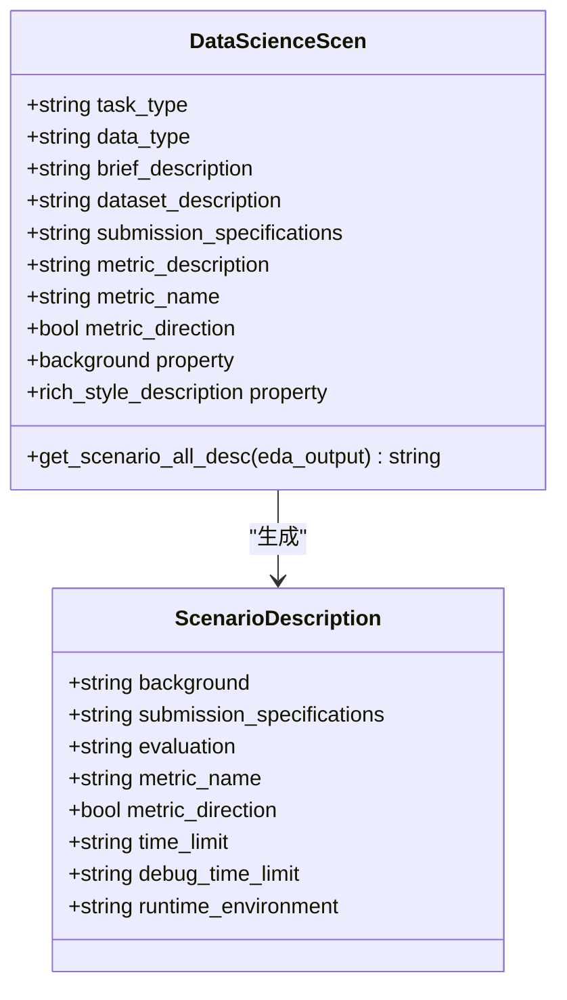
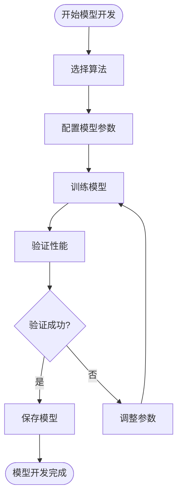
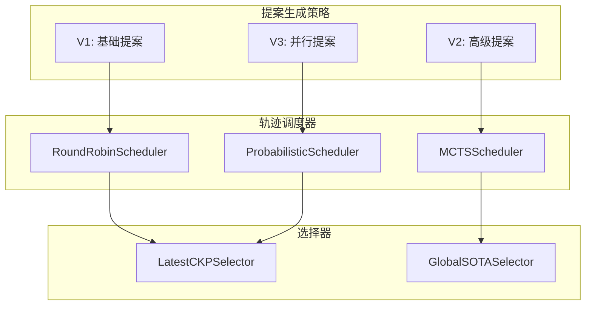
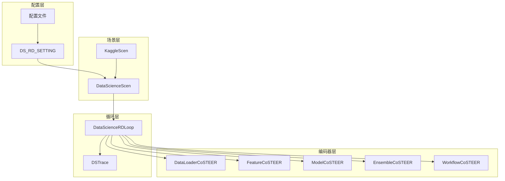

# 数据科学场景调度

<cite>
**本文档中引用的文件**
- [scen/__init__.py](file://rdagent/scenarios/data_science/scen/__init__.py)
- [loop.py](file://rdagent/scenarios/data_science/loop.py)
- [base.py](file://rdagent/scenarios/data_science/proposal/exp_gen/base.py)
- [proposal.py](file://rdagent/scenarios/data_science/proposal/exp_gen/proposal.py)
- [conf.py](file://rdagent/app/data_science/conf.py)
- [prompts.yaml](file://rdagent/scenarios/data_science/scen/prompts.yaml)
- [draft.py](file://rdagent/scenarios/data_science/proposal/exp_gen/draft/draft.py)
- [share.yaml](file://rdagent/scenarios/data_science/share.yaml)
</cite>

## 目录
1. [引言](#引言)
2. [项目结构概述](#项目结构概述)
3. [核心组件分析](#核心组件分析)
4. [架构概览](#架构概览)
5. [详细组件分析](#详细组件分析)
6. [依赖关系分析](#依赖关系分析)
7. [性能考虑](#性能考虑)
8. [故障排除指南](#故障排除指南)
9. [结论](#结论)

## 引言

RD-Agent是一个先进的自动化数据科学研发平台，专门设计用于处理机器学习竞赛和复杂的数据科学任务。该系统通过智能的模块调度机制，能够自动解析竞赛描述、提取关键信息、生成实验假设，并根据任务特征动态调整代码生成器和执行器的超时策略。

本文档详细阐述了RD-Agent在数据科学场景下的模块调度机制，重点分析DataScienceScen类如何通过_get_description和_analysis_competition_description方法解析竞赛描述，以及get_scenario_all_desc方法如何整合背景信息、提交要求和运行环境生成完整的场景描述。

## 项目结构概述

RD-Agent的数据科学场景调度系统采用分层架构设计，主要包含以下核心模块：



**图表来源**
- [scen/__init__.py](file://rdagent/scenarios/data_science/scen/__init__.py#L18-L290)
- [loop.py](file://rdagent/scenarios/data_science/loop.py#L70-L120)

**章节来源**
- [scen/__init__.py](file://rdagent/scenarios/data_science/scen/__init__.py#L1-L50)
- [loop.py](file://rdagent/scenarios/data_science/loop.py#L1-L70)

## 核心组件分析

### DataScienceScen类的核心功能

DataScienceScen类是整个数据科学场景调度系统的核心，负责解析竞赛描述、提取任务类型和数据类型等关键信息。

#### 竞赛描述解析机制

DataScienceScen类通过以下方法实现竞赛描述的智能解析：

1. **_get_description方法**：从本地文件系统或网络爬取竞赛描述信息
2. **_analysis_competition_description方法**：使用LLM分析竞赛描述并提取结构化信息
3. **_get_data_folder_description方法**：分析数据集结构和特征

#### 关键信息提取流程



**图表来源**
- [scen/__init__.py](file://rdagent/scenarios/data_science/scen/__init__.py#L87-L150)

**章节来源**
- [scen/__init__.py](file://rdagent/scenarios/data_science/scen/__init__.py#L87-L150)

## 架构概览

RD-Agent的数据科学场景调度采用多层架构设计，实现了高度模块化的任务管理：



**图表来源**
- [loop.py](file://rdagent/scenarios/data_science/loop.py#L70-L120)
- [proposal.py](file://rdagent/scenarios/data_science/proposal/exp_gen/proposal.py#L100-L200)

## 详细组件分析

### 场景描述生成机制

get_scenario_all_desc方法是生成完整场景描述的核心组件，它整合了多个维度的信息：

#### 背景信息整合



**图表来源**
- [scen/__init__.py](file://rdagent/scenarios/data_science/scen/__init__.py#L180-L250)

#### 动态超时策略

系统根据任务特征动态调整代码生成器和执行器的超时策略：

| 组件类型 | 基础超时 | 长期超时倍数 | 增长策略 |
|---------|---------|------------|---------|
| 代码生成器 | 600秒 | 3倍 | 指数增长 |
| 执行器 | 3600秒 | 2倍 | 线性增长 |
| 调试模式 | 600秒 | 无 | 固定值 |

**章节来源**
- [scen/__init__.py](file://rdagent/scenarios/data_science/scen/__init__.py#L150-L200)

### 不同任务路径的调度逻辑

#### 特征工程路径

特征工程任务通过FeatureCoSTEER组件进行调度，支持多种特征工程技术：

```mermaid
sequenceDiagram
participant Loop as DataScienceRDLoop
participant FC as FeatureCoSTEER
participant Task as FeatureTask
participant Spec as FeatureSpec
Loop->>FC : 开发特征工程
FC->>Task : 创建特征任务
Task->>Spec : 加载特征规范
Spec-->>Task : 返回特征配置
Task-->>FC : 特征工程完成
FC-->>Loop : 返回实验结果
```

**图表来源**
- [loop.py](file://rdagent/scenarios/data_science/loop.py#L150-L180)

#### 模型开发路径

模型开发路径支持多种机器学习算法和深度学习框架：



**图表来源**
- [loop.py](file://rdagent/scenarios/data_science/loop.py#L180-L210)

#### 集成学习路径

集成学习通过EnsembleCoSTEER组件实现，支持多种集成策略：

| 集成方法 | 适用场景 | 性能提升 | 计算成本 |
|---------|---------|---------|---------|
| Bagging | 高方差算法 | 中等 | 低 |
| Boosting | 高偏差算法 | 高 | 中等 |
| Stacking | 复杂任务 | 很高 | 高 |
| Voting | 多样化模型 | 中等 | 低 |

**章节来源**
- [loop.py](file://rdagent/scenarios/data_science/loop.py#L210-L240)

### 提案生成与选择机制

#### 多版本提案生成

系统支持多种提案生成策略，包括并行多轨迹探索：



**图表来源**
- [proposal.py](file://rdagent/scenarios/data_science/proposal/exp_gen/proposal.py#L300-L400)

**章节来源**
- [proposal.py](file://rdagent/scenarios/data_science/proposal/exp_gen/proposal.py#L300-L500)

## 依赖关系分析

系统的依赖关系呈现清晰的层次结构：



**图表来源**
- [conf.py](file://rdagent/app/data_science/conf.py#L1-L50)
- [scen/__init__.py](file://rdagent/scenarios/data_science/scen/__init__.py#L1-L30)

**章节来源**
- [conf.py](file://rdagent/app/data_science/conf.py#L1-L100)

## 性能考虑

### 时间优化策略

系统采用多层次的时间优化策略：

1. **自适应超时调整**：根据历史表现动态调整超时时间
2. **优先级调度**：重要任务优先获得计算资源
3. **并行执行**：支持多个组件并行开发

### 内存管理

- 工作空间清理机制
- 实验结果缓存策略
- 资源使用监控

## 故障排除指南

### 常见问题及解决方案

#### 超时错误处理

当发生超时错误时，系统会：
1. 增加超时倍数
2. 重新分析竞赛描述
3. 调整实验策略

#### 组件选择失败

如果某个组件开发失败，系统会：
1. 记录失败原因
2. 尝试替代方案
3. 更新知识库

**章节来源**
- [loop.py](file://rdagent/scenarios/data_science/loop.py#L220-L280)

## 结论

RD-Agent的数据科学场景调度机制通过智能的模块化设计，实现了高效的任务管理和资源分配。系统的核心优势包括：

1. **智能解析能力**：通过LLM技术自动解析竞赛描述和数据集特征
2. **动态调度策略**：根据任务特征和历史表现动态调整执行策略
3. **多路径探索**：支持并行多轨迹探索，提高创新概率
4. **自适应优化**：具备自我学习和优化能力

这种设计使得RD-Agent能够在复杂的机器学习竞赛环境中保持高效和稳定的表现，为数据科学家提供了强大的自动化研发工具。