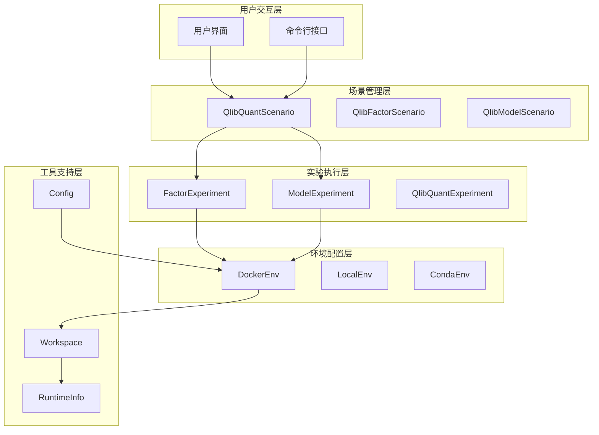
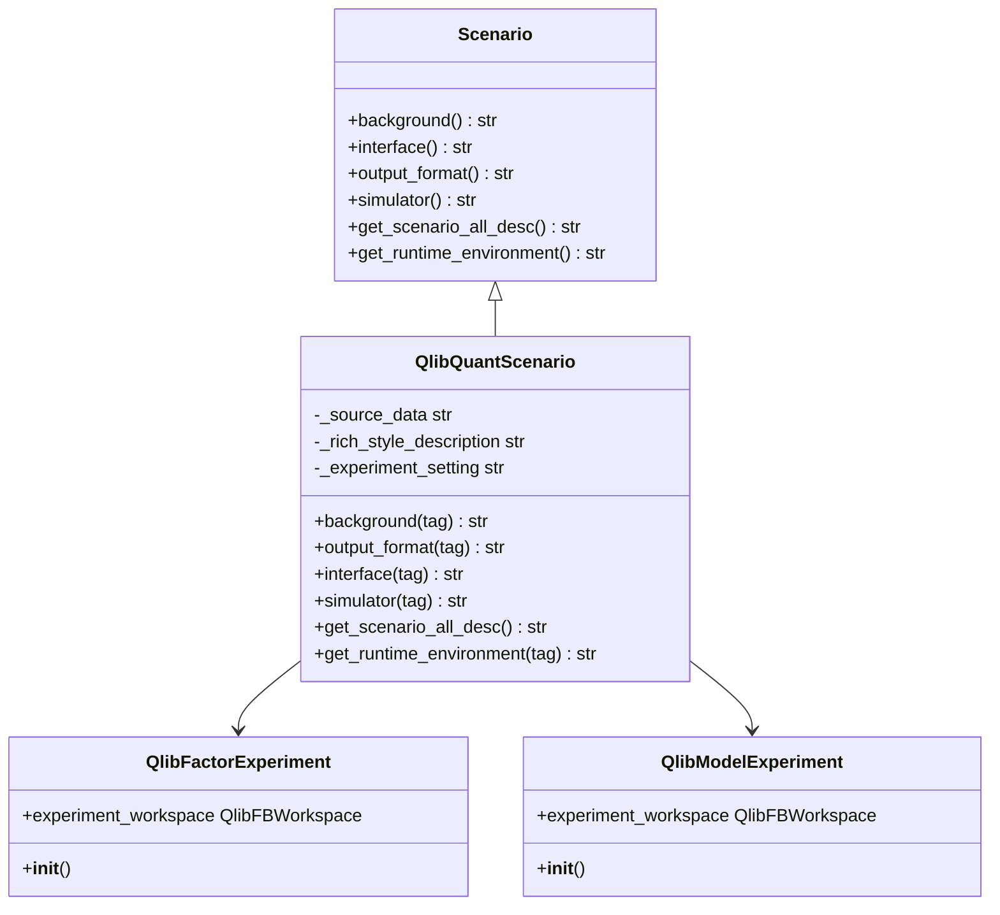
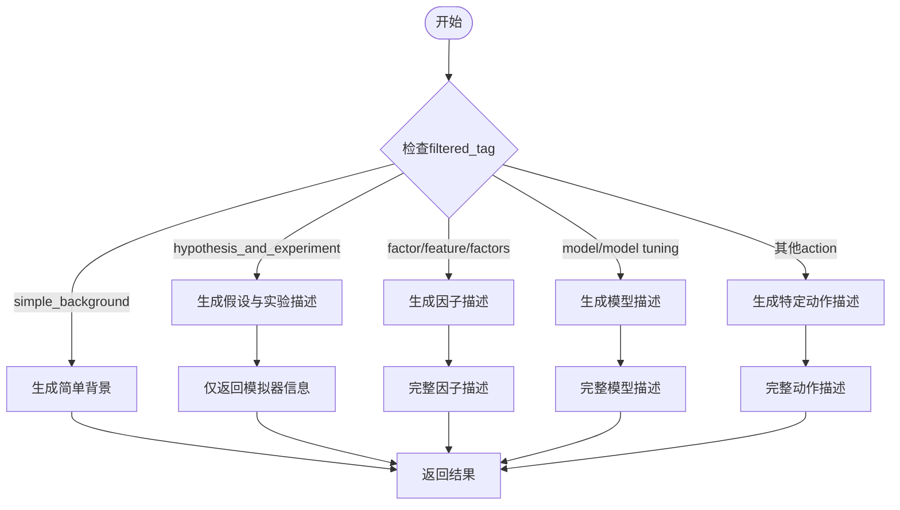
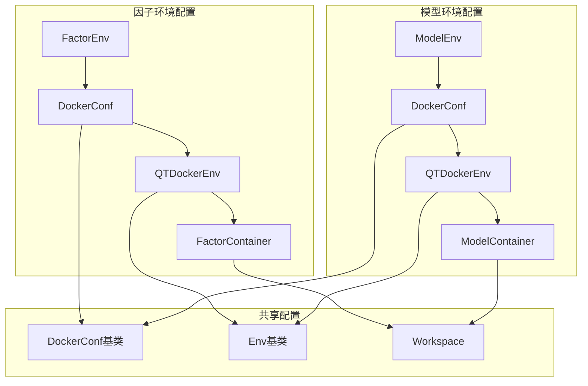
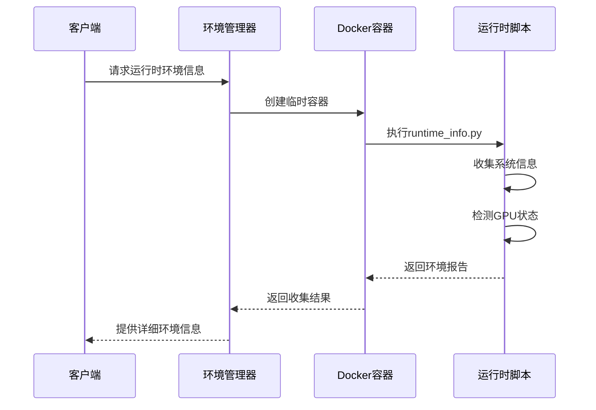
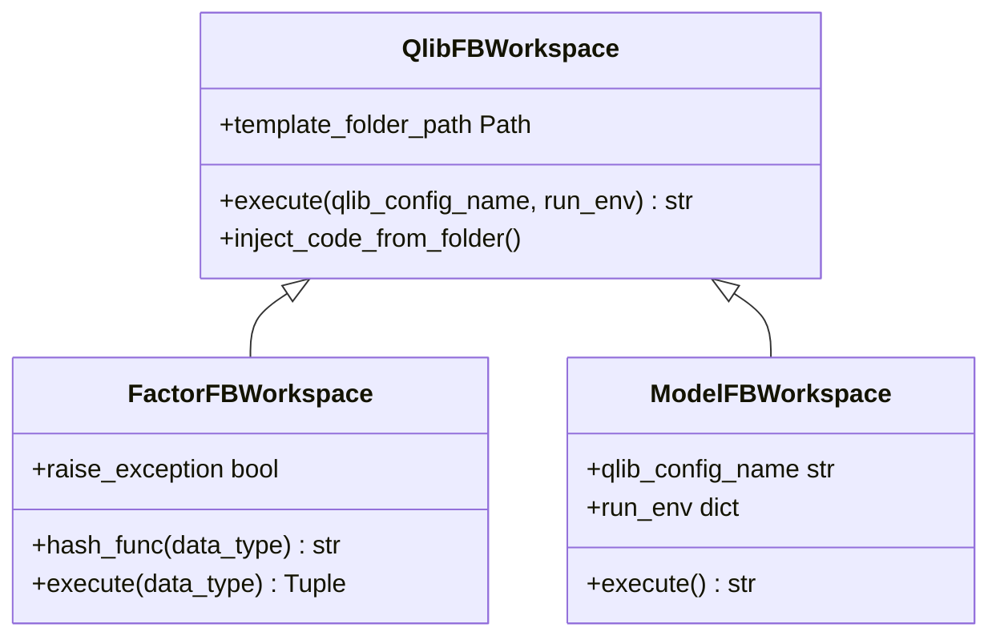

# 量化金融场景调度

<cite>
**本文档引用的文件**
- [quant_experiment.py](file://rdagent/scenarios/qlib/experiment/quant_experiment.py)
- [workspace.py](file://rdagent/scenarios/qlib/experiment/workspace.py)
- [config.py](file://rdagent/components/coder/factor_coder/config.py)
- [conf.py](file://rdagent/components/coder/model_coder/conf.py)
- [get_runtime_info.py](file://rdagent/scenarios/shared/get_runtime_info.py)
- [runtime_info.py](file://rdagent/scenarios/shared/runtime_info.py)
- [Dockerfile](file://rdagent/scenarios/qlib/docker/Dockerfile)
- [env.py](file://rdagent/utils/env.py)
</cite>

## 目录
1. [引言](#引言)
2. [项目架构概览](#项目架构概览)
3. [QlibQuantScenario核心实现](#qlibquantscenario核心实现)
4. [动态上下文环境生成](#动态上下文环境生成)
5. [Docker执行环境配置](#docker执行环境配置)
6. [模块间协作机制](#模块间协作机制)
7. [安全隔离与性能优化](#安全隔离与性能优化)
8. [故障排除指南](#故障排除指南)
9. [总结](#总结)

## 引言

RD-Agent是一个面向量化金融领域的智能研发平台，其核心通过QlibQuantScenario类实现了复杂的模块调度功能。该系统能够根据不同的研究需求（因子研究或模型开发），动态生成专属的上下文环境，并为LLM提供结构化的提示信息。同时，系统通过独立的Docker执行环境确保了研究与开发流程的安全隔离性。

## 项目架构概览

RD-Agent采用分层架构设计，主要包含以下几个核心层次：

**图表来源**
- [quant_experiment.py](file://rdagent/scenarios/qlib/experiment/quant_experiment.py#L38-L201)
- [workspace.py](file://rdagent/scenarios/qlib/experiment/workspace.py#L1-L60)

**章节来源**
- [quant_experiment.py](file://rdagent/scenarios/qlib/experiment/quant_experiment.py#L1-L203)

## QlibQuantScenario核心实现

QlibQuantScenario类是整个量化金融场景调度的核心组件，继承自基础Scenario类，提供了完整的因子和模型研究开发框架。

### 类结构设计

**图表来源**
- [quant_experiment.py](file://rdagent/scenarios/qlib/experiment/quant_experiment.py#L38-L201)

### 核心方法实现

QlibQuantScenario类提供了六个关键方法，每个方法都针对不同的使用场景进行了专门优化：

#### 1. 背景信息生成 (background)
该方法根据传入的tag参数生成相应的背景描述，支持三种模式：
- `None`: 生成完整的量化金融背景
- `"factor"`: 生成因子研究专用背景  
- `"model"`: 生成模型开发专用背景

#### 2. 接口规范定义 (interface)
提供标准化的代码编写接口，确保因子和模型代码的一致性。

#### 3. 输出格式规范 (output_format)
定义代码输出的标准格式，便于后续处理和验证。

#### 4. 模拟器配置 (simulator)
描述代码将在何种模拟环境中运行，提供测试和验证的基础设施。

#### 5. 动态描述生成 (get_scenario_all_desc)
这是系统的核心方法，根据过滤条件动态生成完整的场景描述。

#### 6. 运行时环境获取 (get_runtime_environment)
为因子和模型组件分别配置独立的执行环境。

**章节来源**
- [quant_experiment.py](file://rdagent/scenarios/qlib/experiment/quant_experiment.py#L40-L192)

## 动态上下文环境生成

get_scenario_all_desc方法是QlibQuantScenario的核心功能，它能够根据filtered_tag参数动态生成因子研究或模型开发的专属上下文环境。

### 方法逻辑流程

**图表来源**
- [quant_experiment.py](file://rdagent/scenarios/qlib/experiment/quant_experiment.py#L140-L186)

### 上下文环境组成

系统通过四个核心组件协同工作，为LLM提供结构化的提示信息：

#### 1. 背景信息 (Background)
提供量化金融领域的整体背景和当前任务的具体要求。

#### 2. 数据源描述 (Source Data Description)  
列出可用的数据集和数据访问方式。

#### 3. 接口规范 (Interface Specification)  
定义代码编写的标准化接口和约束条件。

#### 4. 输出格式 (Output Format)  
规定代码输出的标准格式和验证规则。

#### 5. 模拟器配置 (Simulator Configuration)  
描述代码运行的测试环境和验证机制。

**章节来源**
- [quant_experiment.py](file://rdagent/scenarios/qlib/experiment/quant_experiment.py#L140-L186)

## Docker执行环境配置

RD-Agent通过独立的Docker执行环境确保因子和模型组件的隔离性和安全性。系统支持两种主要的环境配置方式：Docker容器环境和本地Conda环境。

### 环境配置架构

**图表来源**
- [config.py](file://rdagent/components/coder/factor_coder/config.py#L31-L45)
- [conf.py](file://rdagent/components/coder/model_coder/conf.py#L15-L34)
- [env.py](file://rdagent/utils/env.py#L696-L712)

### Docker环境特性

#### 1. 镜像配置
系统使用预构建的PyTorch镜像作为基础环境，包含完整的量化金融计算库。

#### 2. 数据挂载
通过volume挂载机制，将本地数据目录映射到容器内部，确保数据访问的透明性。

#### 3. 资源限制
支持内存、CPU和GPU资源的精确控制，防止资源滥用。

#### 4. 网络配置
提供灵活的网络模式选择，支持桥接网络和主机网络。

### 运行时环境检测

系统通过get_runtime_environment_by_env函数获取详细的运行时环境信息：

**图表来源**
- [get_runtime_info.py](file://rdagent/scenarios/shared/get_runtime_info.py#L6-L11)
- [runtime_info.py](file://rdagent/scenarios/shared/runtime_info.py#L1-L47)

**章节来源**
- [config.py](file://rdagent/components/coder/factor_coder/config.py#L31-L48)
- [conf.py](file://rdagent/components/coder/model_coder/conf.py#L15-L34)
- [env.py](file://rdagent/utils/env.py#L696-L712)
- [get_runtime_info.py](file://rdagent/scenarios/shared/get_runtime_info.py#L6-L11)

## 模块间协作机制

RD-Agent通过精心设计的模块协作机制，实现了因子研究和模型开发的无缝集成。

### 工作空间管理

**图表来源**
- [workspace.py](file://rdagent/scenarios/qlib/experiment/workspace.py#L12-L59)

### 实验执行流程

系统支持多种实验执行模式，包括Docker容器执行和本地Conda环境执行：

#### 1. 因子实验执行
- 代码模板注入
- 独立Docker容器执行
- 结果文件读取和验证

#### 2. 模型实验执行  
- 配置文件生成
- Qlib框架调用
- 回测结果分析

**章节来源**
- [workspace.py](file://rdagent/scenarios/qlib/experiment/workspace.py#L12-L59)

## 安全隔离与性能优化

### 安全机制

#### 1. 环境隔离
每个因子和模型都在独立的环境中运行，防止相互干扰。

#### 2. 权限控制
Docker容器提供进程级别的权限隔离。

#### 3. 资源限制
精确的资源配额防止恶意程序消耗过多系统资源。

### 性能优化策略

#### 1. 缓存机制
支持环境缓存和结果缓存，减少重复初始化开销。

#### 2. 并行执行
支持多个实验并行执行，提高整体效率。

#### 3. 资源复用
通过volume挂载实现数据和依赖的复用。

## 故障排除指南

### 常见问题及解决方案

#### 1. Docker环境问题
- **症状**: 容器启动失败
- **原因**: Docker守护进程未运行或权限不足
- **解决**: 检查Docker服务状态，添加用户到docker组

#### 2. 环境配置错误
- **症状**: 依赖包安装失败
- **原因**: 网络连接问题或镜像版本不兼容
- **解决**: 检查网络连接，更新Docker镜像

#### 3. 内存不足
- **症状**: 容器被OOM杀死
- **原因**: 分配内存过小
- **解决**: 增加shm_size和mem_limit配置

**章节来源**
- [env.py](file://rdagent/utils/env.py#L951-L968)

## 总结

RD-Agent的量化金融场景调度系统通过QlibQuantScenario类实现了高度智能化的模块调度功能。系统的核心优势包括：

1. **动态上下文生成**: 通过get_scenario_all_desc方法根据需求动态生成专属的上下文环境
2. **多维度环境配置**: 支持因子和模型的独立Docker环境，确保研究与开发的隔离性
3. **标准化接口设计**: 提供统一的接口规范，保证代码质量和可维护性
4. **安全可靠的执行环境**: 通过容器化技术实现进程级隔离和资源控制
5. **灵活的协作机制**: 支持多种执行模式和环境配置，适应不同的使用场景

该系统为量化金融领域的AI驱动研发提供了强大的基础设施支持，显著提升了因子研究和模型开发的效率和质量。