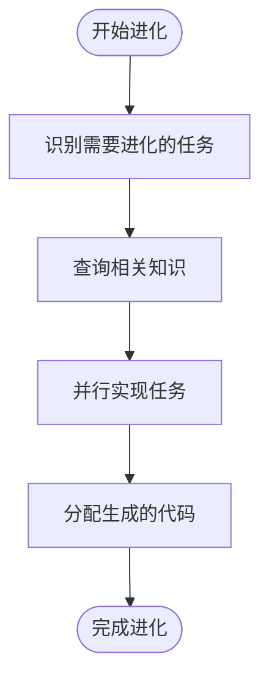
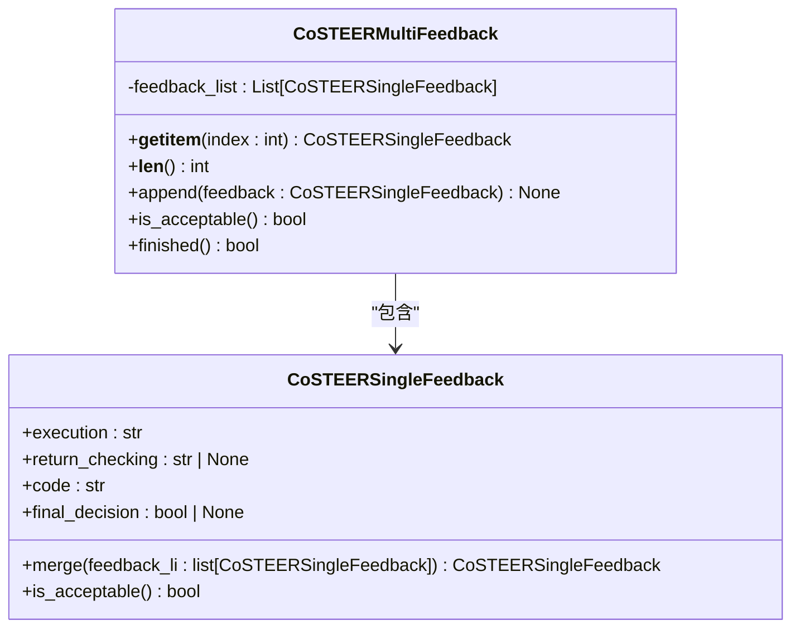
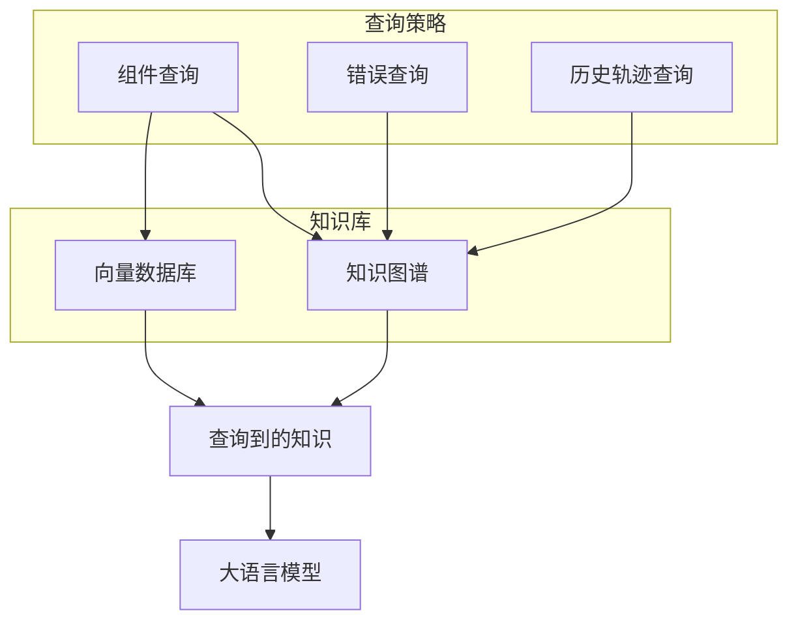
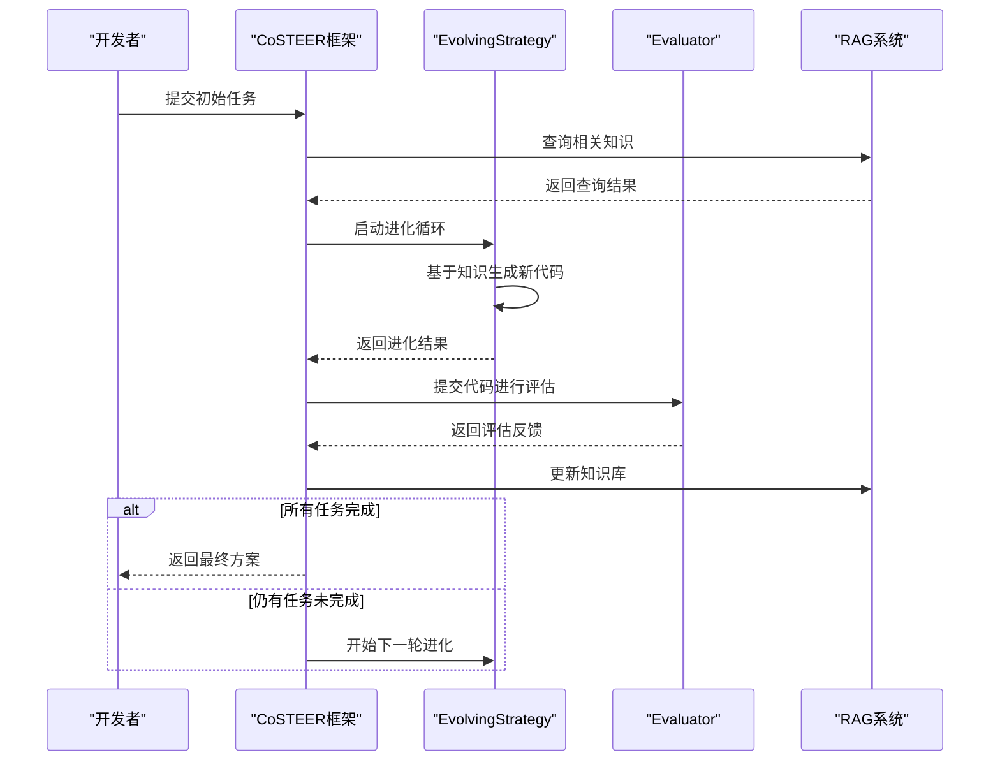
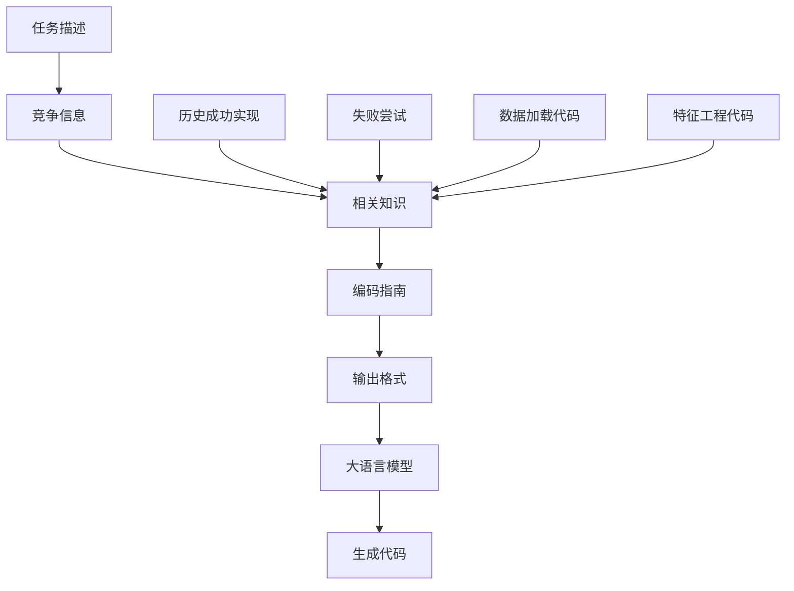

# CoSTEER代码进化框架

<cite>
**本文档引用的文件**
- [__init__.py](file://rdagent\components\coder\CoSTEER\__init__.py)
- [evolving_strategy.py](file://rdagent\components\coder\CoSTEER\evolving_strategy.py)
- [evaluators.py](file://rdagent\components\coder\CoSTEER\evaluators.py)
- [knowledge_management.py](file://rdagent\components\coder\CoSTEER\knowledge_management.py)
- [task.py](file://rdagent\components\coder\CoSTEER\task.py)
- [config.py](file://rdagent\components\coder\CoSTEER\config.py)
- [evolvable_subjects.py](file://rdagent\components\coder\CoSTEER\evolvable_subjects.py)
- [ds_costeer.py](file://rdagent\components\coder\data_science\share\ds_costeer.py)
- [prompts.yaml](file://rdagent\components\coder\CoSTEER\prompts.yaml)
- [model\prompts.yaml](file://rdagent\components\coder\data_science\model\prompts.yaml)
</cite>

## 目录
1. [引言](#引言)
2. [核心组件](#核心组件)
3. [EvolvingStrategy工作机制](#evolvingstrategy工作机制)
4. [Evaluator评估体系](#evaluator评估体系)
5. [RAG系统与知识图谱集成](#rag系统与知识图谱集成)
6. [代码进化过程与状态转换](#代码进化过程与状态转换)
7. [提示工程在LLM代码生成中的作用](#提示工程在llm代码生成中的作用)

## 引言
CoSTEER代码进化框架是一个基于反馈迭代优化的智能代码生成系统，旨在通过多轮进化过程持续改进代码方案。该框架结合了检索增强生成（RAG）技术、知识图谱和历史实验数据，实现了从初始代码生成到多轮优化的完整闭环。框架的核心在于其EvolutionStrategy组件，该组件基于反馈信息迭代优化代码方案，同时Evaluator组件提供多维度评估指标体系，包括功能正确性、性能指标和代码质量。通过与RAG系统和知识图谱的深度集成，CoSTEER能够利用历史实验数据指导新代码生成，实现知识的持续积累和复用。

## 核心组件
CoSTEER框架由多个核心组件构成，包括CoSTEER主类、EvolvingStrategy、Evaluator、KnowledgeManagement等。这些组件协同工作，形成了一个完整的代码进化闭环。CoSTEER主类继承自Developer，负责协调整个代码进化过程。EvolvingStrategy组件负责基于反馈迭代优化代码方案，而Evaluator组件则提供多维度评估指标体系。KnowledgeManagement组件实现了RAG系统与知识图谱的集成，利用历史实验数据指导新代码生成。此外，框架还包含Task、EvolvableSubjects等基础组件，用于表示和管理代码进化过程中的各种任务和可进化对象。

**本节来源**
- [__init__.py](file://rdagent\components\coder\CoSTEER\__init__.py#L1-L176)
- [evolving_strategy.py](file://rdagent\components\coder\CoSTEER\evolving_strategy.py#L1-L134)
- [evaluators.py](file://rdagent\components\coder\CoSTEER\evaluators.py#L1-L311)
- [knowledge_management.py](file://rdagent\components\coder\CoSTEER\knowledge_management.py#L1-L799)

## EvolvingStrategy工作机制
EvolvingStrategy是CoSTEER框架的核心组件之一，负责基于反馈迭代优化代码方案。该组件通过多进程方式实现任务的并行进化，每个任务的进化过程都基于历史反馈和知识库中的相关信息。EvolvingStrategy的工作机制主要包括以下几个步骤：

1. **任务识别**：首先识别需要进化的任务，这些任务可能是之前失败的任务，也可能是需要进一步优化的任务。
2. **知识查询**：从知识库中查询与当前任务相关的历史成功实现和失败尝试，为代码生成提供参考。
3. **并行实现**：使用多进程方式并行实现各个任务，每个任务的实现都基于查询到的知识和当前的反馈信息。
4. **代码分配**：将生成的代码分配给相应的进化项，完成代码的更新。

**图示来源**
- [evolving_strategy.py](file://rdagent\components\coder\CoSTEER\evolving_strategy.py#L1-L134)

**本节来源**
- [evolving_strategy.py](file://rdagent\components\coder\CoSTEER\evolving_strategy.py#L1-L134)
- [__init__.py](file://rdagent\components\coder\CoSTEER\__init__.py#L1-L176)

## Evaluator评估体系
Evaluator组件是CoSTEER框架的评估核心，提供了一个多维度的评估指标体系。该体系包括功能正确性、性能指标和代码质量三个主要方面，通过CoSTEERSingleFeedback和CoSTEERMultiFeedback两个反馈类来实现。

CoSTEERSingleFeedback类包含四个主要属性：execution（执行反馈）、return_checking（返回值检查）、code（代码质量）和final_decision（最终决策）。这些属性共同构成了对单个任务的完整评估。CoSTEERMultiFeedback则用于评估包含多个子任务的实验，它包含一个CoSTEERSingleFeedback对象列表，每个对象对应一个子任务的评估结果。

**图示来源**
- [evaluators.py](file://rdagent\components\coder\CoSTEER\evaluators.py#L1-L311)

**本节来源**
- [evaluators.py](file://rdagent\components\coder\CoSTEER\evaluators.py#L1-L311)
- [__init__.py](file://rdagent\components\coder\CoSTEER\__init__.py#L1-L176)

## RAG系统与知识图谱集成
CoSTEER框架通过RAG（Retrieval Augmented Generation）系统与知识图谱的深度集成，实现了历史实验数据的有效利用。该集成主要通过CoSTEERRAGStrategyV2类实现，它结合了知识图谱和向量数据库的优势，提供了多维度的知识检索能力。

RAG系统的工作机制包括三个主要查询策略：组件查询、错误查询和历史轨迹查询。组件查询通过分析任务描述中的组件，从知识图谱中检索相关的历史成功实现。错误查询则基于当前任务的错误信息，检索曾经成功解决类似错误的实现方案。历史轨迹查询则提供任务的进化历史，包括之前的失败尝试和成功实现。

**图示来源**
- [knowledge_management.py](file://rdagent\components\coder\CoSTEER\knowledge_management.py#L1-L799)

**本节来源**
- [knowledge_management.py](file://rdagent\components\coder\CoSTEER\knowledge_management.py#L1-L799)
- [config.py](file://rdagent\components\coder\CoSTEER\config.py#L1-L42)

## 代码进化过程与状态转换
CoSTEER框架的代码进化过程是一个多轮迭代的闭环系统，从初始代码生成到最终优化方案的完整过程。该过程通过RAGEvoAgent类实现，它协调EvolvingStrategy、Evaluator和RAG系统的工作，形成一个完整的进化循环。

**图示来源**
- [__init__.py](file://rdagent\components\coder\CoSTEER\__init__.py#L1-L176)
- [evolving_agent.py](file://rdagent\core\evolving_agent.py#L1-L115)

**本节来源**
- [__init__.py](file://rdagent\components\coder\CoSTEER\__init__.py#L1-L176)
- [evolving_agent.py](file://rdagent\core\evolving_agent.py#L1-L115)
- [knowledge_management.py](file://rdagent\components\coder\CoSTEER\knowledge_management.py#L1-L799)

## 提示工程在LLM代码生成中的作用
提示工程在CoSTEER框架中扮演着关键角色，它通过精心设计的提示模板引导大语言模型生成高质量的代码。框架使用YAML格式的提示模板文件，这些模板包含了任务描述、竞争信息、相关知识、编码指南和输出格式等关键信息。

提示模板的设计充分考虑了上下文信息的组织，将相关的历史成功实现、之前的失败尝试以及数据加载和特征工程代码作为上下文提供给大语言模型。这种设计使得模型能够在充分理解上下文的基础上生成代码，提高了代码的准确性和相关性。

**图示来源**
- [prompts.yaml](file://rdagent\components\coder\CoSTEER\prompts.yaml#L1-L9)
- [model\prompts.yaml](file://rdagent\components\coder\data_science\model\prompts.yaml#L1-L186)

**本节来源**
- [prompts.yaml](file://rdagent\components\coder\CoSTEER\prompts.yaml#L1-L9)
- [model\prompts.yaml](file://rdagent\components\coder\data_science\model\prompts.yaml#L1-L186)
- [ds_costeer.py](file://rdagent\components\coder\data_science\share\ds_costeer.py#L1-L9)