# EvolvingAgent核心控制器架构设计与运行机制

<cite>
**本文档引用的文件**
- [evolving_agent.py](file://rdagent/core/evolving_agent.py)
- [knowledge_base.py](file://rdagent/core/knowledge_base.py)
- [experiment.py](file://rdagent/core/experiment.py)
- [evolving_framework.py](file://rdagent/core/evolving_framework.py)
- [scenario.py](file://rdagent/core/scenario.py)
- [evaluation.py](file://rdagent/core/evaluation.py)
- [conf.py](file://rdagent/core/conf.py)
- [loop.py](file://rdagent/utils/workflow/loop.py)
- [cli.py](file://rdagent/app/cli.py)
</cite>

## 目录
1. [引言](#引言)
2. [项目结构概览](#项目结构概览)
3. [核心组件分析](#核心组件分析)
4. [架构设计](#架构设计)
5. [详细组件分析](#详细组件分析)
6. [知识管理系统](#知识管理系统)
7. [生命周期管理](#生命周期管理)
8. [异常恢复策略](#异常恢复策略)
9. [性能优化机制](#性能优化机制)
10. [故障排除指南](#故障排除指南)
11. [总结](#总结)

## 引言

EvolvingAgent是RD-Agent系统的核心控制器，作为R&D双循环架构的中枢节点，负责协调Proposal（假设生成）、Coder（代码编写）、Runner（实验执行）和Evaluation（评估）四大组件的协同工作。该控制器采用先进的RAG（检索增强生成）架构，实现了智能的知识提取、存储和检索功能，为科学研究和算法开发提供了强大的自动化支持。

## 项目结构概览

RD-Agent系统采用模块化架构设计，主要包含以下核心模块：

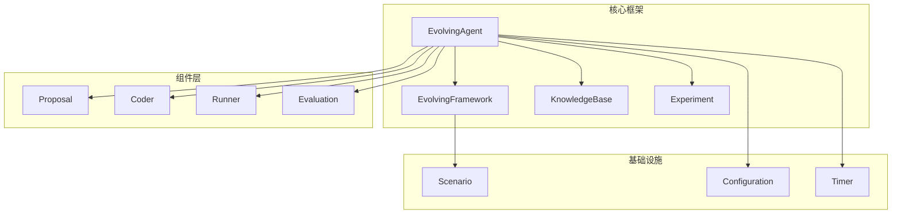

**图表来源**
- [evolving_agent.py](file://rdagent/core/evolving_agent.py#L1-L116)
- [evolving_framework.py](file://rdagent/core/evolving_framework.py#L1-L128)

**章节来源**
- [evolving_agent.py](file://rdagent/core/evolving_agent.py#L1-L116)
- [experiment.py](file://rdagent/core/experiment.py#L1-L483)

## 核心组件分析

### EvolvingAgent类层次结构

EvolvingAgent采用泛型设计，支持不同类型的具体实现：

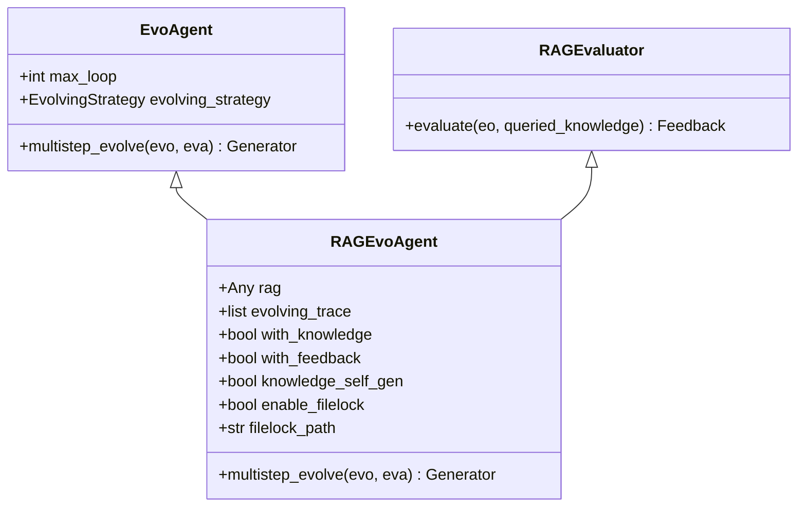

**图表来源**
- [evolving_agent.py](file://rdagent/core/evolving_agent.py#L15-L116)

### 实验生命周期管理

Experiment类定义了完整的实验生命周期，包括任务组织、工作空间管理和结果跟踪：

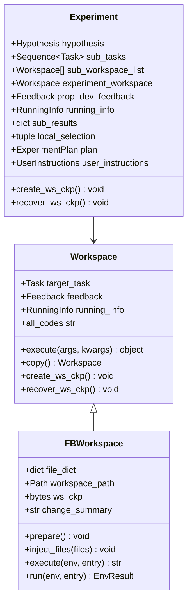

**图表来源**
- [experiment.py](file://rdagent/core/experiment.py#L250-L483)

**章节来源**
- [experiment.py](file://rdagent/core/experiment.py#L250-L483)
- [evolving_agent.py](file://rdagent/core/evolving_agent.py#L15-L116)

## 架构设计

### R&D双循环架构

EvolvingAgent作为R&D双循环架构的中枢，实现了以下核心功能：

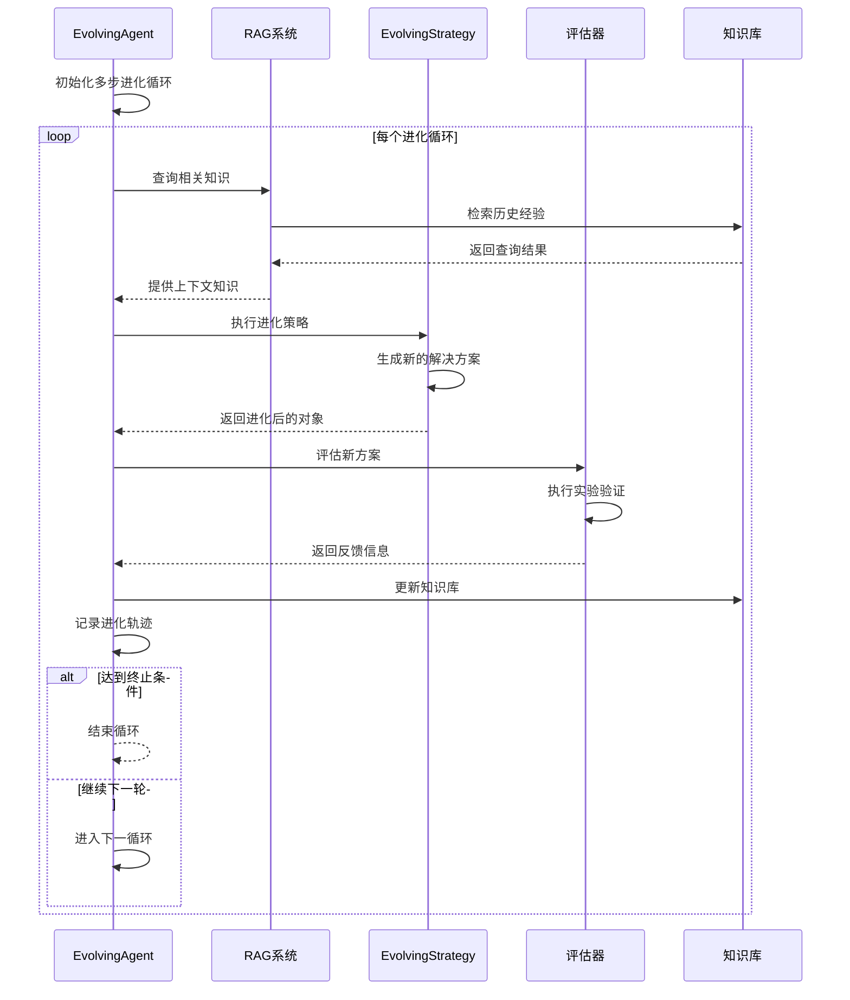

**图表来源**
- [evolving_agent.py](file://rdagent/core/evolving_agent.py#L75-L114)

### 状态转换机制

EvolvingAgent通过EvoStep记录每个进化步骤的状态变化：

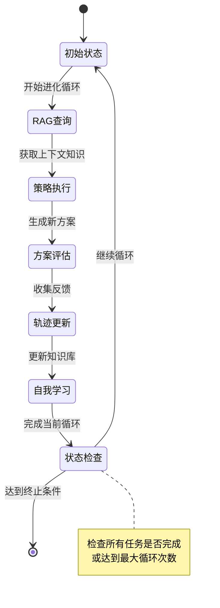

**章节来源**
- [evolving_agent.py](file://rdagent/core/evolving_agent.py#L75-L114)
- [evolving_framework.py](file://rdagent/core/evolving_framework.py#L40-L50)

## 详细组件分析

### Proposal组件集成

EvolvingAgent与Proposal组件的集成体现在知识查询阶段：

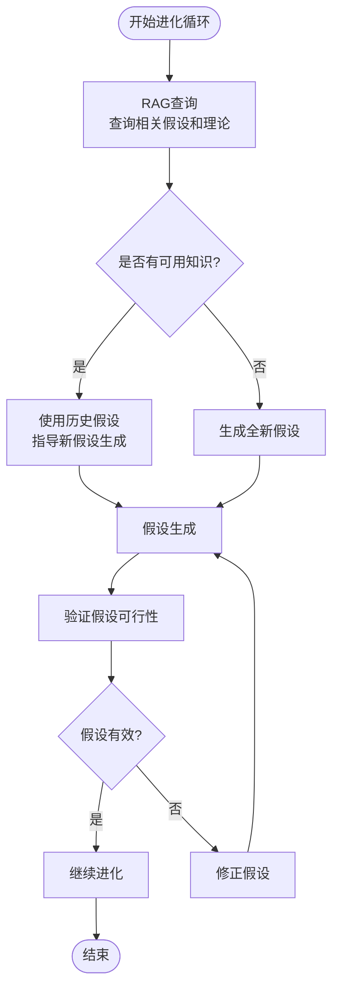

**图表来源**
- [evolving_agent.py](file://rdagent/core/evolving_agent.py#L77-L82)

### Coder组件协调

在Coder阶段，EvolvingAgent通过进化策略协调代码生成过程：

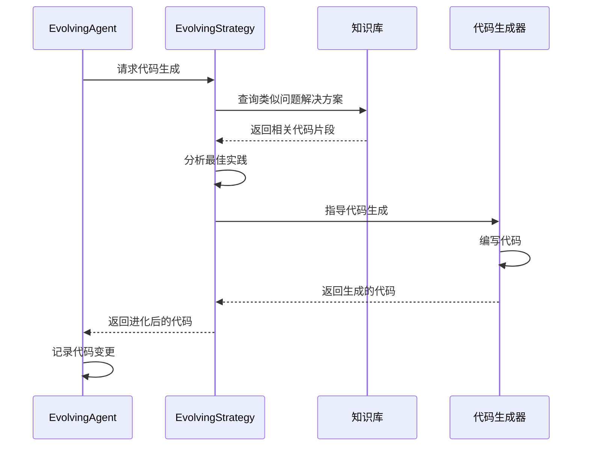

**图表来源**
- [evolving_framework.py](file://rdagent/core/evolving_framework.py#L60-L80)

### Runner组件集成

Runner组件的执行由EvolvingAgent的状态监控驱动：

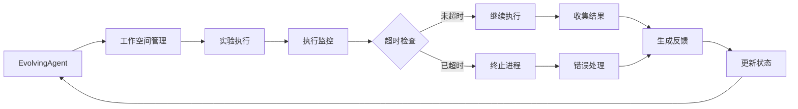

**图表来源**
- [experiment.py](file://rdagent/core/experiment.py#L300-L400)

### Evaluation组件反馈循环

评估组件通过反馈机制实现闭环控制：

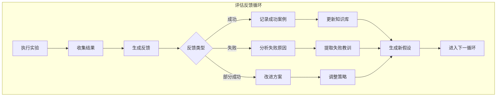

**图表来源**
- [evaluation.py](file://rdagent/core/evaluation.py#L1-L58)

**章节来源**
- [evolving_agent.py](file://rdagent/core/evolving_agent.py#L75-L114)
- [evaluation.py](file://rdagent/core/evaluation.py#L1-L58)

## 知识管理系统

### KnowledgeBase架构

KnowledgeBase提供了基础的知识存储和检索功能：

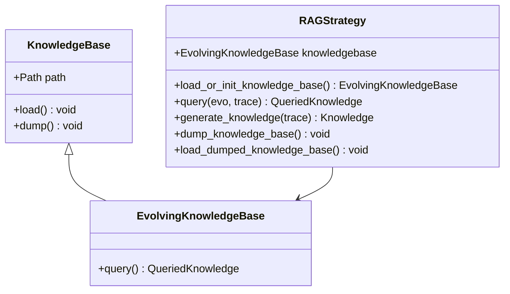

**图表来源**
- [knowledge_base.py](file://rdagent/core/knowledge_base.py#L1-L28)
- [evolving_framework.py](file://rdagent/core/evolving_framework.py#L15-L35)

### 知识提取流程

知识提取通过多阶段处理实现：

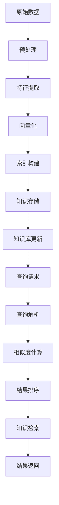

**图表来源**
- [knowledge_base.py](file://rdagent/core/knowledge_base.py#L10-L28)

### 知识检索机制

检索机制支持多种查询模式：

| 查询类型 | 描述 | 应用场景 |
|---------|------|----------|
| 直接匹配 | 基于关键词精确匹配 | 快速查找特定概念 |
| 语义相似度 | 基于向量嵌入的语义匹配 | 发现相关但不完全相同的知识 |
| 关联推理 | 基于知识图谱的关系推理 | 推导复杂概念间的联系 |
| 上下文感知 | 结合当前任务上下文的检索 | 提供最相关的知识建议 |

**章节来源**
- [knowledge_base.py](file://rdagent/core/knowledge_base.py#L1-L28)
- [evolving_framework.py](file://rdagent/core/evolving_framework.py#L15-L128)

## 生命周期管理

### 实验工作空间管理

FBWorkspace提供了完整的实验环境管理：

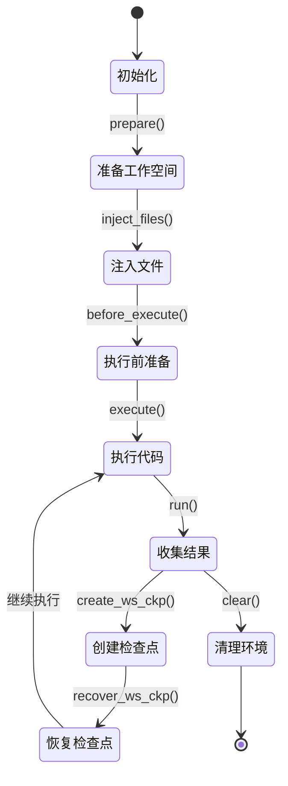

**图表来源**
- [experiment.py](file://rdagent/core/experiment.py#L150-L350)

### 检查点机制

工作空间检查点确保实验的可恢复性：

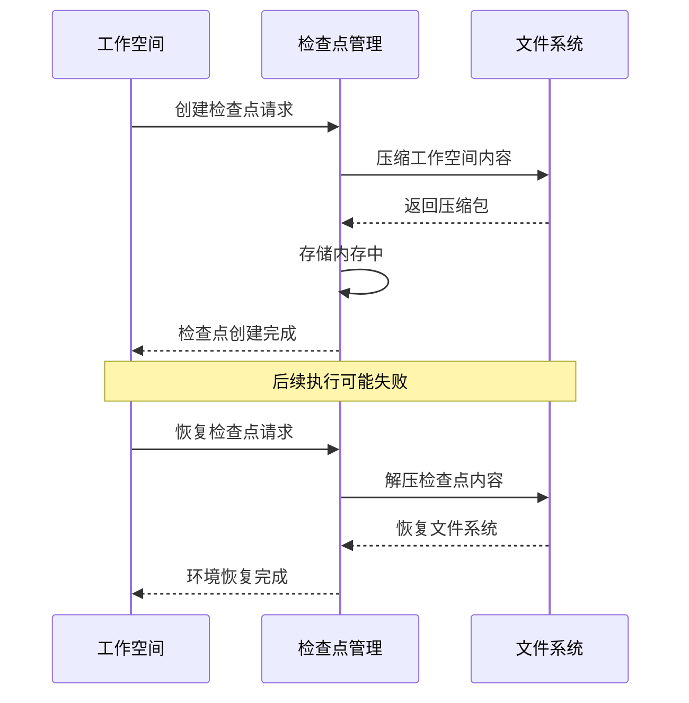

**图表来源**
- [experiment.py](file://rdagent/core/experiment.py#L300-L400)

### 并发执行控制

系统支持多线程并发执行，通过信号量控制资源访问：

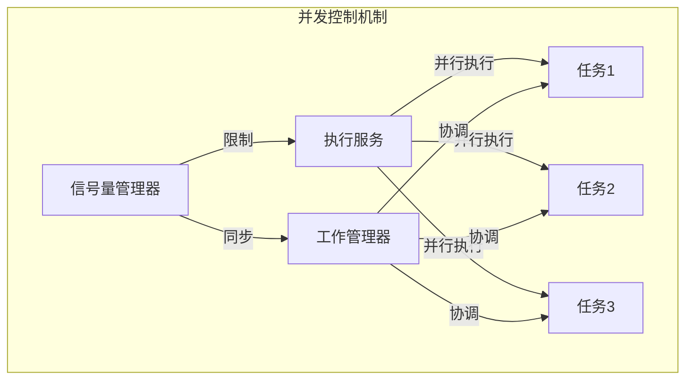

**图表来源**
- [loop.py](file://rdagent/utils/workflow/loop.py#L150-L200)

**章节来源**
- [experiment.py](file://rdagent/core/experiment.py#L150-L483)
- [loop.py](file://rdagent/utils/workflow/loop.py#L150-L250)

## 异常恢复策略

### 超时控制机制

系统实现了多层次的超时控制：

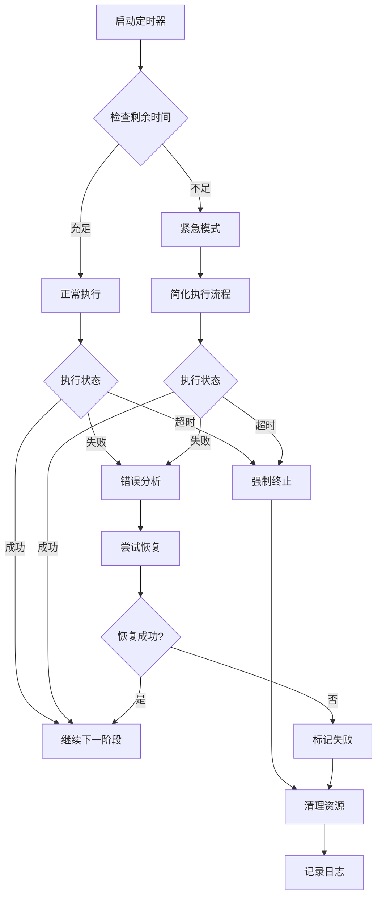

**图表来源**
- [loop.py](file://rdagent/utils/workflow/loop.py#L300-L400)

### 资源隔离策略

通过子进程隔离确保系统稳定性：

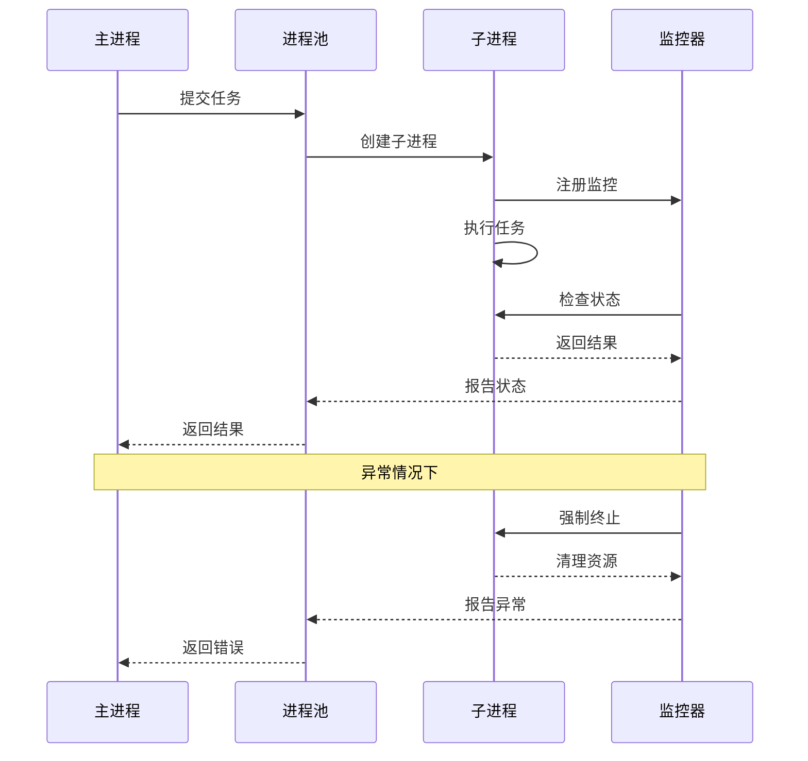

**图表来源**
- [loop.py](file://rdagent/utils/workflow/loop.py#L500-L538)

### 错误恢复流程

系统提供多层次的错误恢复机制：

| 错误级别 | 恢复策略 | 实施方式 |
|---------|----------|----------|
| 可恢复错误 | 自动重试 | 指数退避算法 |
| 部分错误 | 局部修复 | 模块级隔离 |
| 严重错误 | 系统重启 | 进程级隔离 |
| 致命错误 | 紧急停止 | 全局保护机制 |

**章节来源**
- [loop.py](file://rdagent/utils/workflow/loop.py#L300-L538)

## 性能优化机制

### 缓存策略

系统实现了多级缓存机制：

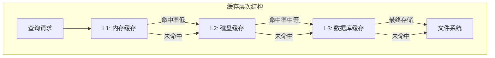

**图表来源**
- [conf.py](file://rdagent/core/conf.py#L50-L70)

### 并行处理优化

通过异步编程模型实现高效并行：

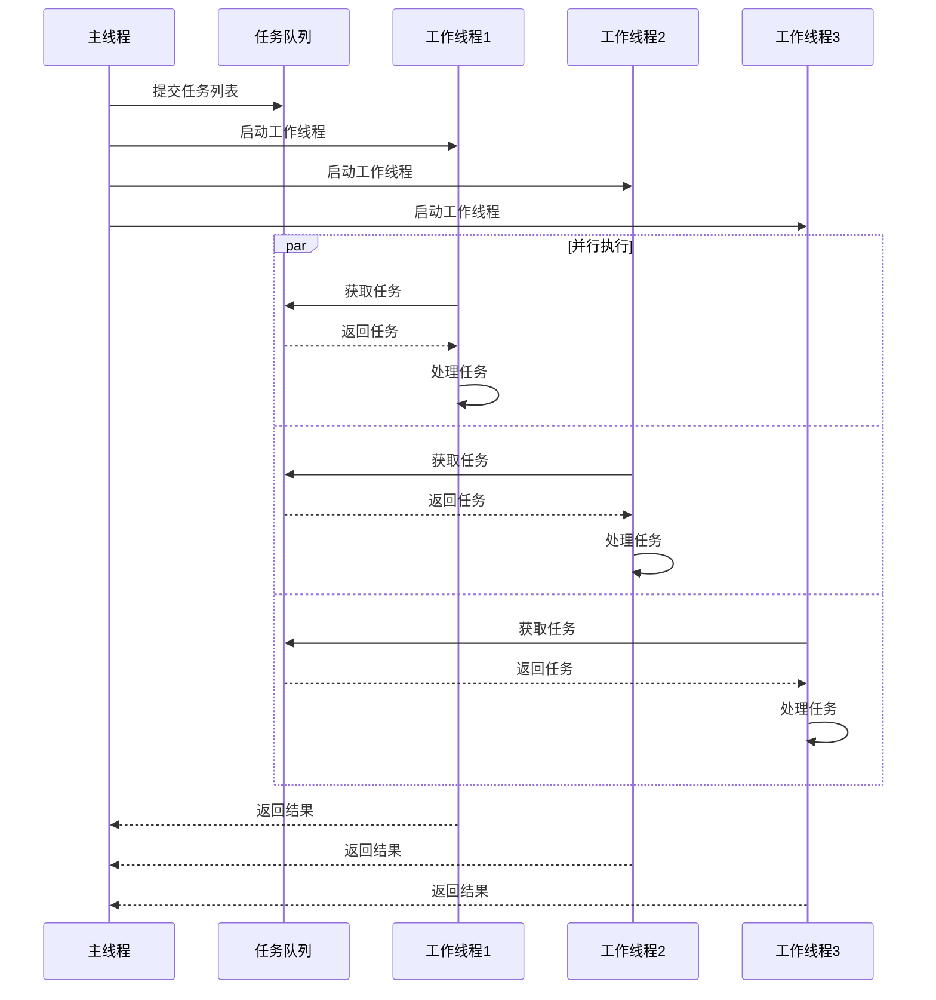

**图表来源**
- [loop.py](file://rdagent/utils/workflow/loop.py#L345-L380)

### 内存管理优化

系统采用多种策略优化内存使用：

- **惰性加载**: 按需加载大型数据结构
- **对象池**: 复用频繁创建的对象
- **垃圾回收**: 及时释放不再使用的资源
- **内存映射**: 对大文件使用内存映射技术

**章节来源**
- [conf.py](file://rdagent/core/conf.py#L50-L110)
- [loop.py](file://rdagent/utils/workflow/loop.py#L345-L400)

## 故障排除指南

### 常见问题诊断

| 问题症状 | 可能原因 | 解决方案 |
|---------|----------|----------|
| 进程卡死 | 死锁或无限循环 | 检查日志，启用调试模式 |
| 内存溢出 | 数据量过大或内存泄漏 | 增加内存限制，优化算法 |
| 超时错误 | 计算复杂度过高 | 优化算法，增加超时时间 |
| 知识库损坏 | 文件系统错误 | 重建知识库，检查磁盘空间 |

### 调试工具和技巧

系统提供了丰富的调试功能：

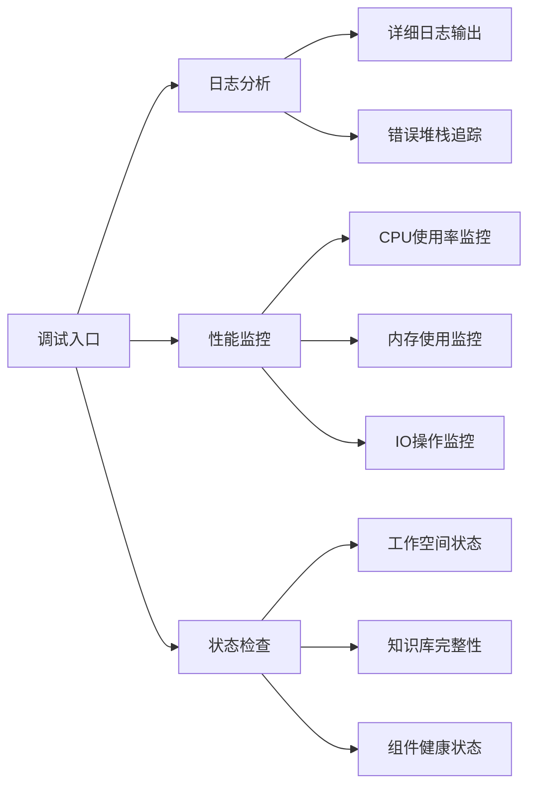

### 性能调优建议

1. **合理配置并发度**: 根据硬件资源调整并行任务数量
2. **优化缓存策略**: 根据使用模式调整缓存大小和策略
3. **监控资源使用**: 定期检查系统资源使用情况
4. **定期维护知识库**: 清理过期数据，优化索引结构

**章节来源**
- [conf.py](file://rdagent/core/conf.py#L1-L110)
- [cli.py](file://rdagent/app/cli.py#L1-L88)

## 总结

EvolvingAgent作为RD-Agent系统的核心控制器，展现了卓越的架构设计和实现能力。其主要特点包括：

1. **模块化设计**: 通过清晰的接口分离关注点，支持灵活的扩展和定制
2. **智能知识管理**: 集成RAG架构，实现知识的自动提取、存储和检索
3. **鲁棒性保证**: 提供完善的异常处理和恢复机制
4. **高性能优化**: 采用多层缓存、并行处理等技术提升系统性能
5. **可观察性**: 提供丰富的日志和监控功能，便于问题诊断和性能优化

该架构不仅满足了当前的研究需求，还为未来的功能扩展和技术演进奠定了坚实的基础。通过持续的优化和完善，EvolvingAgent将继续在自动化科学发现领域发挥重要作用。