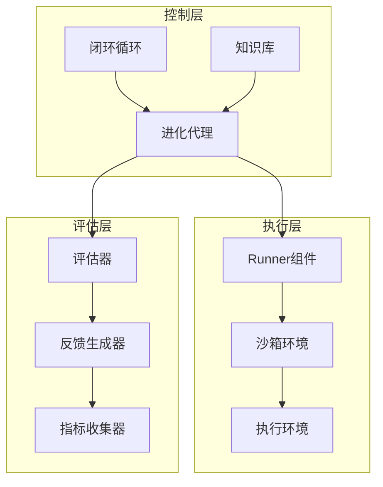
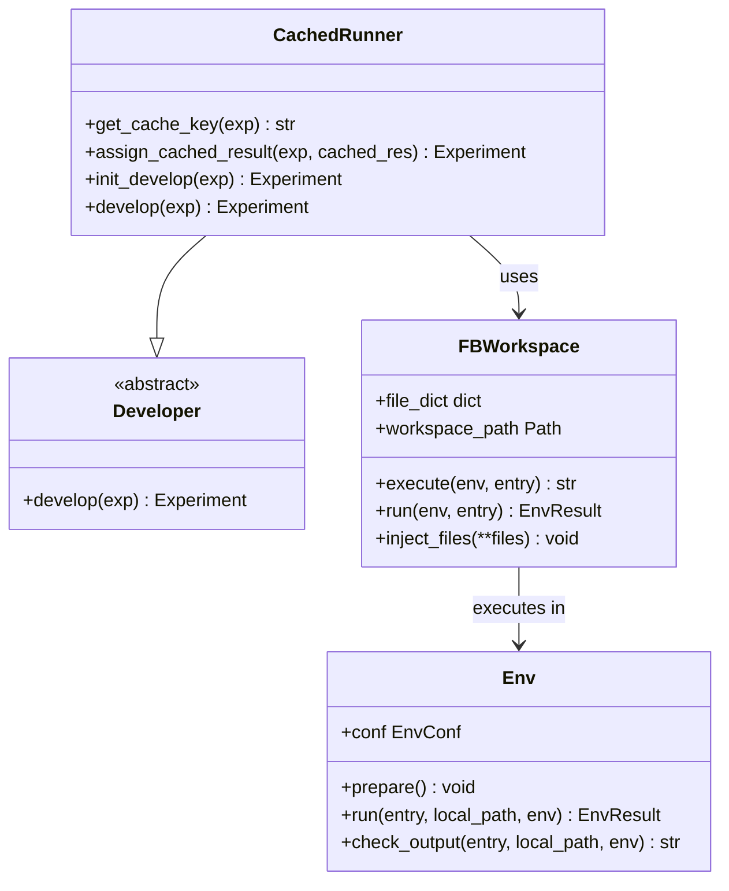
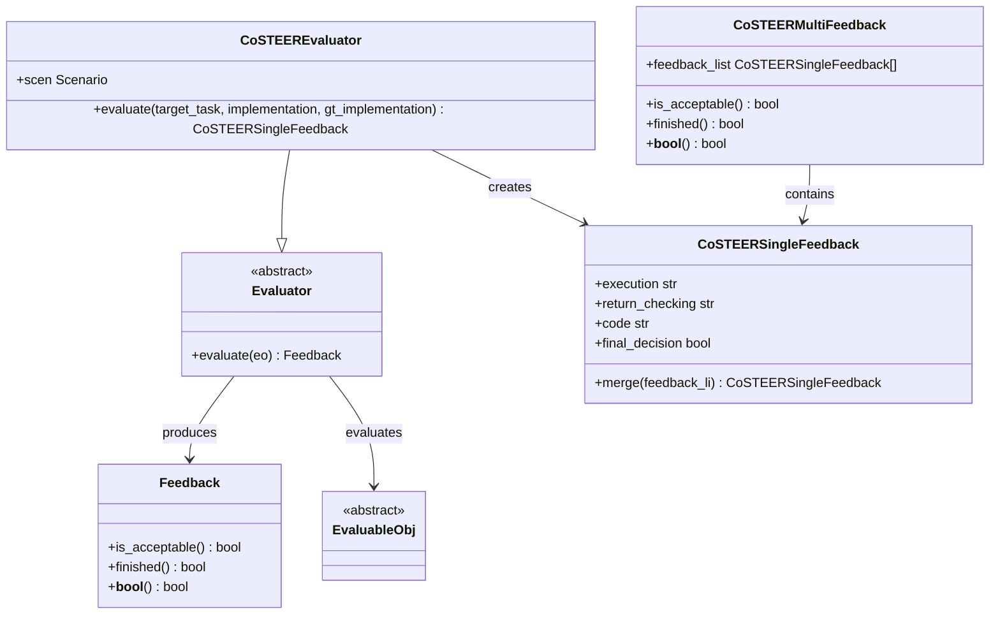
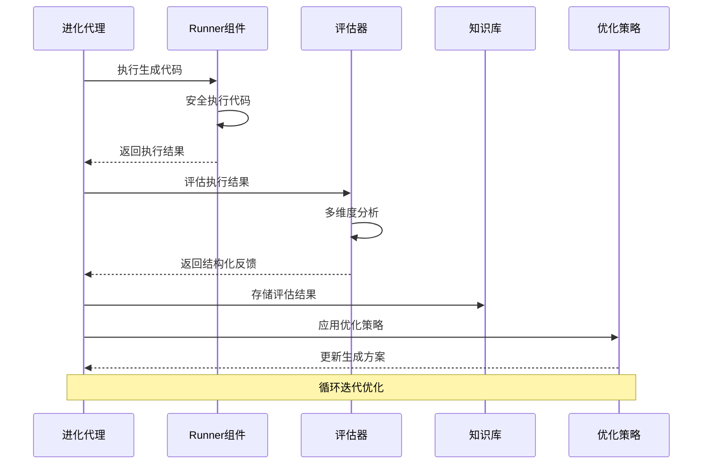
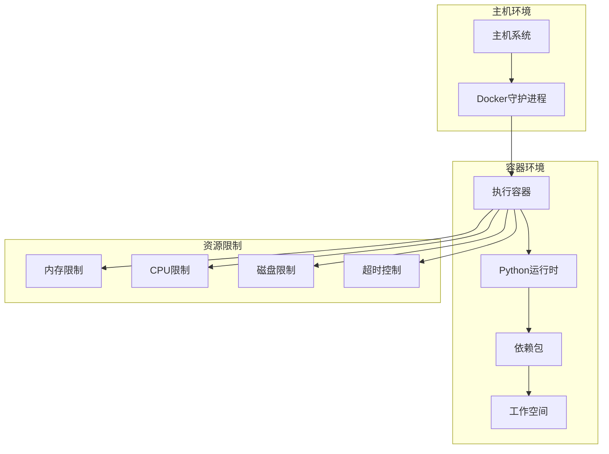
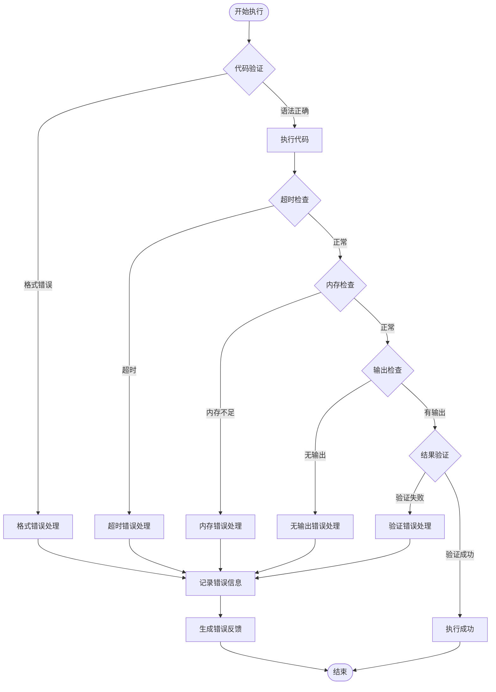
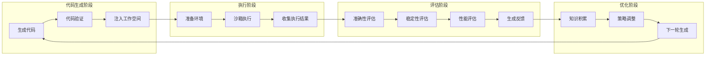
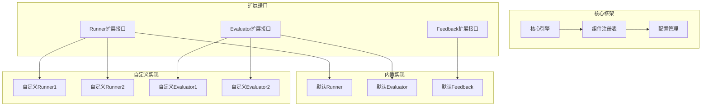

# 执行与评估闭环

<cite>
**本文档引用的文件**
- [rdagent/components/runner/__init__.py](file://rdagent/components/runner/__init__.py)
- [rdagent/core/evaluation.py](file://rdagent/core/evaluation.py)
- [rdagent/core/evolving_agent.py](file://rdagent/core/evolving_agent.py)
- [rdagent/core/experiment.py](file://rdagent/core/experiment.py)
- [rdagent/utils/env.py](file://rdagent/utils/env.py)
- [rdagent/core/exception.py](file://rdagent/core/exception.py)
- [rdagent/scenarios/data_science/dev/runner/eval.py](file://rdagent/scenarios/data_science/dev/runner/eval.py)
- [rdagent/scenarios/kaggle/developer/runner.py](file://rdagent/scenarios/kaggle/developer/runner.py)
- [rdagent/scenarios/qlib/developer/factor_runner.py](file://rdagent/scenarios/qlib/developer/factor_runner.py)
- [rdagent/components/coder/CoSTEER/evaluators.py](file://rdagent/components/coder/CoSTEER/evaluators.py)
- [rdagent/components/coder/factor_coder/factor.py](file://rdagent/components/coder/factor_coder/factor.py)
- [rdagent/scenarios/shared/get_runtime_info.py](file://rdagent/scenarios/shared/get_runtime_info.py)
</cite>

## 目录
1. [引言](#引言)
2. [系统架构概览](#系统架构概览)
3. [Runner组件：安全执行环境](#runner组件安全执行环境)
4. [Evaluation组件：多维度评估](#evaluation组件多维度评估)
5. [反馈机制与闭环优化](#反馈机制与闭环优化)
6. [沙箱执行环境设计](#沙箱执行环境设计)
7. [资源限制与错误处理](#资源限制与错误处理)
8. [数据流与评估指标](#数据流与评估指标)
9. [可扩展性设计](#可扩展性设计)
10. [总结](#总结)

## 引言

RD-Agent的执行与评估闭环是其核心智能优化系统的基础架构，通过安全的代码执行环境、全面的评估体系和智能反馈机制，实现了从代码生成到持续优化的完整生命周期管理。该闭环系统确保了生成代码的质量、稳定性和性能，为复杂的科学计算任务提供了可靠的自动化解决方案。

## 系统架构概览

RD-Agent的执行与评估闭环采用分层架构设计，包含以下核心组件：

**图表来源**
- [rdagent/core/evolving_agent.py](file://rdagent/core/evolving_agent.py#L75-L104)
- [rdagent/components/runner/__init__.py](file://rdagent/components/runner/__init__.py#L1-L21)

**章节来源**
- [rdagent/core/evolving_agent.py](file://rdagent/core/evolving_agent.py#L1-L116)
- [rdagent/core/evaluation.py](file://rdagent/core/evaluation.py#L1-L58)

## Runner组件：安全执行环境

### 核心功能与设计理念

Runner组件负责安全地执行生成的代码，提供隔离的执行环境以防止潜在的安全风险。该组件采用缓存机制和多层验证策略，确保执行过程的可靠性和效率。

**图表来源**
- [rdagent/components/runner/__init__.py](file://rdagent/components/runner/__init__.py#L5-L21)
- [rdagent/core/experiment.py](file://rdagent/core/experiment.py#L120-L180)
- [rdagent/utils/env.py](file://rdagent/utils/env.py#L150-L200)

### 缓存机制与性能优化

Runner组件实现了智能缓存机制，通过MD5哈希算法生成唯一标识符，避免重复执行相同的工作负载：

- **缓存键生成**：基于任务信息和代码内容生成唯一标识
- **结果复用**：检测到相同任务时直接返回缓存结果
- **增量更新**：支持部分结果的增量缓存和更新

### 多场景适配的执行策略

不同应用场景下的Runner组件具有特定的执行策略：

#### 数据科学场景
- 支持EDA（探索性数据分析）输出分离
- 集成覆盖率分析工具
- 提供详细的执行时间统计

#### Kaggle竞赛场景
- 特殊的特征工程和模型训练流程
- 支持混合模型生成（如LightGBM + XGBoost）
- 实现因子空值检测和错误处理

#### 量化金融场景
- 因子去重和相关性分析
- 支持多种模型类型的组合
- 实现信息系数（IC）计算

**章节来源**
- [rdagent/scenarios/data_science/dev/runner/eval.py](file://rdagent/scenarios/data_science/dev/runner/eval.py#L1-L277)
- [rdagent/scenarios/kaggle/developer/runner.py](file://rdagent/scenarios/kaggle/developer/runner.py#L1-L132)
- [rdagent/scenarios/qlib/developer/factor_runner.py](file://rdagent/scenarios/qlib/developer/factor_runner.py#L1-L186)

## Evaluation组件：多维度评估

### 评估框架设计

Evaluation组件采用模块化的评估框架，支持多种评估维度和自定义评估策略：

**图表来源**
- [rdagent/core/evaluation.py](file://rdagent/core/evaluation.py#L15-L58)
- [rdagent/components/coder/CoSTEER/evaluators.py](file://rdagent/components/coder/CoSTEER/evaluators.py#L20-L120)

### 多维度评估指标

#### 准确性评估
- **数值精度检查**：比较生成结果与预期结果的差异
- **格式验证**：确保输出符合指定的数据结构要求
- **边界条件测试**：验证极端输入情况的处理能力

#### 稳定性评估
- **执行成功率**：统计成功执行的比例
- **异常处理能力**：评估对各种异常情况的处理效果
- **资源使用稳定性**：监控内存和CPU使用情况

#### 性能评估
- **执行时间分析**：测量代码执行的耗时
- **资源消耗监控**：跟踪内存和磁盘使用情况
- **并发处理能力**：评估多任务处理的效率

### 智能反馈生成

评估组件能够生成结构化的反馈信息，包含以下关键要素：

1. **执行反馈**：代码执行过程中的详细信息
2. **返回值检查**：输出结果的验证和分析
3. **代码质量评估**：代码风格和最佳实践的遵循程度
4. **最终决策**：基于所有评估维度的综合判断

**章节来源**
- [rdagent/components/coder/CoSTEER/evaluators.py](file://rdagent/components/coder/CoSTEER/evaluators.py#L1-L312)
- [rdagent/scenarios/data_science/dev/runner/eval.py](file://rdagent/scenarios/data_science/dev/runner/eval.py#L60-L200)

## 反馈机制与闭环优化

### 反馈结构化设计

RD-Agent采用层次化的反馈结构，支持细粒度的优化指导：

**图表来源**
- [rdagent/core/evolving_agent.py](file://rdagent/core/evolving_agent.py#L75-L104)

### 知识积累与传承

反馈机制不仅提供即时的优化指导，还建立了长期的知识积累体系：

#### 错误模式识别
- 自动识别常见错误类型和模式
- 建立错误处理的最佳实践库
- 实现错误预防和修复建议

#### 成功案例提取
- 分析成功的实现模式和策略
- 提取可复用的代码模板和方法
- 构建领域特定的知识图谱

#### 性能基准建立
- 记录不同场景下的性能基准
- 建立性能优化的参考标准
- 支持性能回归检测

**章节来源**
- [rdagent/core/evolving_agent.py](file://rdagent/core/evolving_agent.py#L85-L115)

## 沙箱执行环境设计

### Docker容器化执行

RD-Agent采用Docker容器技术构建隔离的执行环境，确保代码执行的安全性和一致性：

**图表来源**
- [rdagent/utils/env.py](file://rdagent/utils/env.py#L862-L922)

### 环境配置与定制

#### 基础环境配置
- **镜像选择**：根据任务需求选择合适的基础镜像
- **依赖安装**：自动安装必要的Python包和系统依赖
- **环境变量**：设置标准化的环境变量

#### 资源配额管理
- **内存限制**：防止内存泄漏导致的系统崩溃
- **CPU配额**：控制计算资源的使用
- **磁盘空间**：限制临时文件和日志的大小
- **执行时间**：设置合理的超时时间

#### 安全隔离机制
- **网络隔离**：禁止不必要的网络访问
- **文件系统权限**：限制对敏感目录的访问
- **进程限制**：防止恶意进程的创建

**章节来源**
- [rdagent/utils/env.py](file://rdagent/utils/env.py#L296-L323)
- [rdagent/utils/env.py](file://rdagent/utils/env.py#L896-L922)

## 资源限制与错误处理

### 多层次错误处理机制

RD-Agent实现了完整的错误处理体系，涵盖从代码生成到执行的各个阶段：

**图表来源**
- [rdagent/core/exception.py](file://rdagent/core/exception.py#L1-L67)
- [rdagent/components/coder/factor_coder/factor.py](file://rdagent/components/coder/factor_coder/factor.py#L159-L186)

### 错误分类与处理策略

#### 工作流错误（WorkflowError）
- **格式错误**：无法获得正确格式的输出
- **执行中断**：多轮尝试后仍无法完成任务
- **系统级故障**：环境配置或基础设施问题

#### 代码生成错误（CoderError）
- **代码格式错误**：生成的代码不符合语法规范
- **运行时错误**：代码执行过程中出现异常
- **输出缺失**：未能生成预期的输出文件

#### 运行时错误（RunnerError）
- **项目级错误**：整个项目的执行失败
- **外部依赖错误**：第三方服务或API调用失败
- **资源访问错误**：文件读写或网络连接问题

### 自动恢复与重试机制

系统实现了智能的自动恢复机制：

1. **指数退避重试**：失败时采用指数增长的等待时间
2. **降级策略**：在部分功能失效时启用简化模式
3. **状态保存**：支持从中断点恢复执行
4. **错误传播控制**：防止错误在系统中扩散

**章节来源**
- [rdagent/core/exception.py](file://rdagent/core/exception.py#L1-L67)
- [rdagent/components/coder/factor_coder/factor.py](file://rdagent/components/coder/factor_coder/factor.py#L159-L186)

## 数据流与评估指标

### 完整的数据流图

从代码生成到反馈生成的完整数据流展示了执行与评估闭环的核心流程：

**图表来源**
- [rdagent/core/evolving_agent.py](file://rdagent/core/evolving_agent.py#L75-L104)
- [rdagent/scenarios/data_science/dev/runner/eval.py](file://rdagent/scenarios/data_science/dev/runner/eval.py#L60-L120)

### 评估指标体系

#### 核心评估指标
- **执行成功率**：成功完成任务的比例
- **平均执行时间**：代码执行的平均耗时
- **内存使用效率**：内存使用的优化程度
- **代码质量评分**：代码风格和可维护性的评分

#### 场景特定指标
- **数据科学任务**：模型性能指标、特征工程效果
- **Kaggle竞赛**：排行榜排名、提交成功率
- **量化金融**：信息系数（IC）、夏普比率

#### 质量保证指标
- **错误率趋势**：错误发生的频率变化
- **收敛速度**：达到满意结果所需的时间
- **多样性指标**：生成解决方案的多样性程度

### 动态指标调整

评估指标体系支持动态调整和个性化配置：

1. **自适应阈值**：根据历史数据自动调整评估阈值
2. **权重动态分配**：根据不同场景的重要性调整指标权重
3. **实时监控**：持续跟踪关键指标的变化趋势
4. **异常检测**：识别指标异常波动的原因

**章节来源**
- [rdagent/scenarios/data_science/dev/runner/eval.py](file://rdagent/scenarios/data_science/dev/runner/eval.py#L150-L200)
- [rdagent/components/coder/CoSTEER/evaluators.py](file://rdagent/components/coder/CoSTEER/evaluators.py#L250-L312)

## 可扩展性设计

### 插件化架构

RD-Agent的执行与评估闭环采用插件化架构，支持灵活的功能扩展：

**图表来源**
- [rdagent/core/evolving_agent.py](file://rdagent/core/evolving_agent.py#L1-L50)
- [rdagent/core/evaluation.py](file://rdagent/core/evaluation.py#L1-L58)

### 配置驱动的扩展

系统支持通过配置文件动态加载和切换不同的执行与评估策略：

#### 环境配置扩展
- **执行环境定制**：支持不同编程语言和框架的环境配置
- **资源限制参数**：灵活调整内存、CPU和存储限制
- **安全策略配置**：自定义安全隔离级别和访问控制

#### 评估策略扩展
- **评估维度自定义**：添加新的评估指标和维度
- **权重配置**：调整不同评估维度的重要程度
- **阈值设定**：自定义成功和失败的判断标准

#### 反馈格式扩展
- **反馈结构定制**：支持不同的反馈信息组织方式
- **多语言支持**：提供本地化的反馈信息
- **可视化配置**：自定义反馈结果的展示形式

### 性能优化扩展

系统提供了多层次的性能优化机制：

1. **并行执行**：支持多任务并行处理
2. **缓存策略**：智能缓存重复计算的结果
3. **资源调度**：动态调整资源分配策略
4. **监控告警**：实时监控系统性能指标

**章节来源**
- [rdagent/utils/env.py](file://rdagent/utils/env.py#L100-L200)
- [rdagent/components/coder/CoSTEER/evaluators.py](file://rdagent/components/coder/CoSTEER/evaluators.py#L200-L312)

## 总结

RD-Agent的执行与评估闭环系统通过精心设计的架构和完善的机制，实现了从代码生成到持续优化的智能化管理。该系统的核心优势包括：

### 技术创新点
- **安全执行环境**：采用Docker容器技术和多层隔离机制，确保代码执行的安全性
- **智能评估体系**：提供多维度、自动化的评估指标和反馈机制
- **闭环优化流程**：建立完整的知识积累和策略优化体系
- **可扩展架构**：支持插件化扩展和配置驱动的定制

### 应用价值
- **提高开发效率**：自动化代码生成和优化显著提升研发效率
- **保证代码质量**：全面的评估体系确保生成代码的可靠性和性能
- **降低维护成本**：智能反馈机制减少人工干预和调试时间
- **支持复杂场景**：适应数据科学、机器学习、量化金融等多个领域的特殊需求

### 发展前景
随着人工智能技术的不断发展，RD-Agent的执行与评估闭环系统将在以下方面持续演进：
- **更智能的评估**：引入深度学习技术提升评估的准确性和智能化程度
- **更广泛的适用性**：扩展到更多编程语言和应用领域
- **更高效的优化**：利用强化学习等技术实现更高效的自动优化
- **更完善的生态**：构建更加丰富的插件生态系统和社区支持

该系统为自动化软件开发和智能优化提供了强有力的技术支撑，代表了软件工程智能化发展的重要方向。