# 核心框架与组件协作

<cite>
**本文档引用的文件**
- [evolving_agent.py](file://rdagent/core/evolving_agent.py)
- [CoSTEER/__init__.py](file://rdagent/components/coder/CoSTEER/__init__.py)
- [evolving_strategy.py](file://rdagent/components/coder/CoSTEER/evolving_strategy.py)
- [evaluators.py](file://rdagent/components/coder/CoSTEER/evaluators.py)
- [evolving_framework.py](file://rdagent/core/evolving_framework.py)
- [knowledge_management.py](file://rdagent/components/coder/CoSTEER/knowledge_management.py)
- [evolvable_subjects.py](file://rdagent/components/coder/CoSTEER/evolvable_subjects.py)
- [experiment.py](file://rdagent/core/experiment.py)
- [developer.py](file://rdagent/core/developer.py)
- [runner/__init__.py](file://rdagent/components/runner/__init__.py)
- [config.py](file://rdagent/components/coder/CoSTEER/config.py)
- [exception.py](file://rdagent/core/exception.py)
- [loop.py](file://rdagent/scenarios/data_science/loop.py)
- [conf.py](file://rdagent/core/conf.py)
</cite>

## 目录
1. [引言](#引言)
2. [系统架构概览](#系统架构概览)
3. [EvolvingAgent核心控制器](#evolvingagent核心控制器)
4. [CoSTEER框架协同机制](#costeer框架协同机制)
5. [组件间协作流程](#组件间协作流程)
6. [异常处理与超时控制](#异常处理与超时控制)
7. [知识库更新策略](#知识库更新策略)
8. [序列图展示](#序列图展示)
9. [总结](#总结)

## 引言

RD-Agent是一个基于人工智能的实验开发框架，其核心设计理念是通过多智能体协作实现复杂科学计算任务的自动化开发。该框架采用分层架构设计，以EvolvingAgent为核心控制器，协调Coder、Runner和Evaluator三大功能组件的交互流程，形成了完整的代码生成、执行验证和反馈评估的生命周期。

## 系统架构概览

RD-Agent采用模块化架构设计，主要包含以下核心层次：

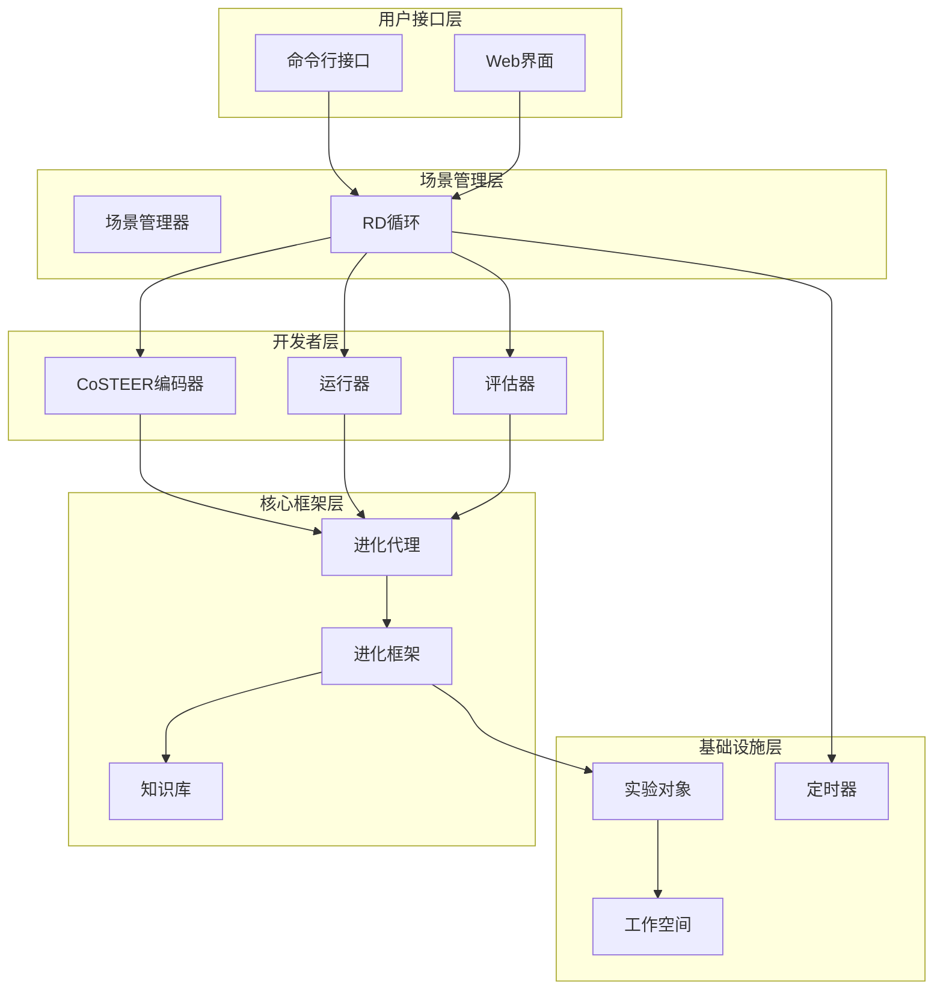

**图表来源**
- [loop.py](file://rdagent/scenarios/data_science/loop.py#L70-L120)
- [CoSTEER/__init__.py](file://rdagent/components/coder/CoSTEER/__init__.py#L20-L50)

## EvolvingAgent核心控制器

EvolvingAgent是整个框架的核心控制器，负责协调各个组件的交互流程。它采用泛型设计，支持不同类型的任务演化需求。

### 核心架构设计

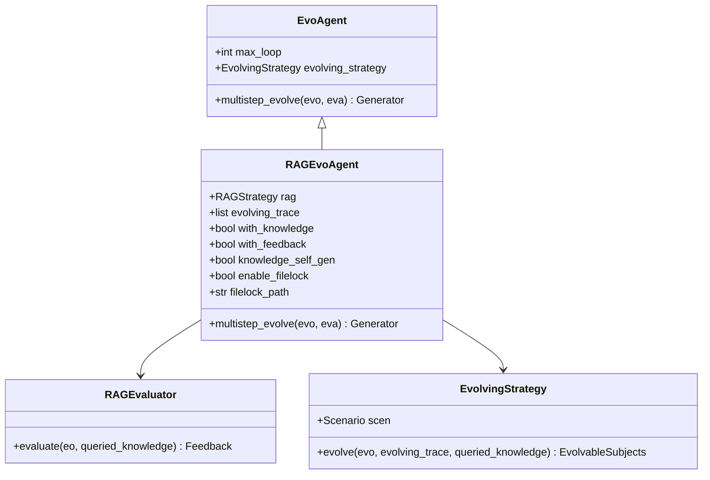

**图表来源**
- [evolving_agent.py](file://rdagent/core/evolving_agent.py#L15-L45)
- [evolving_framework.py](file://rdagent/core/evolving_framework.py#L60-L85)

### 多步演化机制

EvolvingAgent实现了多步演化机制，通过迭代优化实现任务的逐步改进：

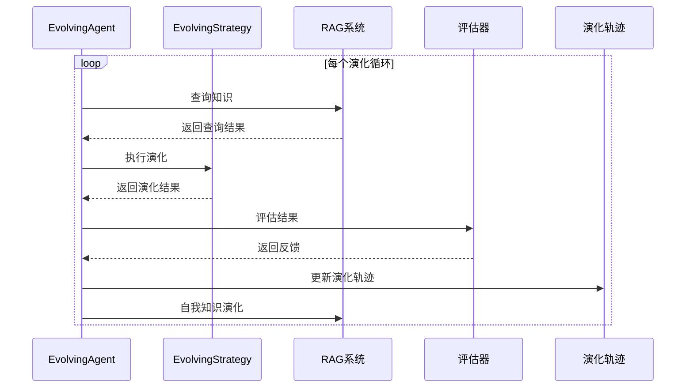

**图表来源**
- [evolving_agent.py](file://rdagent/core/evolving_agent.py#L75-L104)

**章节来源**
- [evolving_agent.py](file://rdagent/core/evolving_agent.py#L15-L116)

## CoSTEER框架协同机制

CoSTEER（Collaborative Software Testing and Evolutionary Experimentation）框架是RD-Agent的核心编码框架，实现了EvolvingStrategy、Evaluator和RAG系统的协同工作原理。

### EvolvingStrategy演化策略

EvolvingStrategy定义了任务演化的具体策略，支持多进程并行处理：

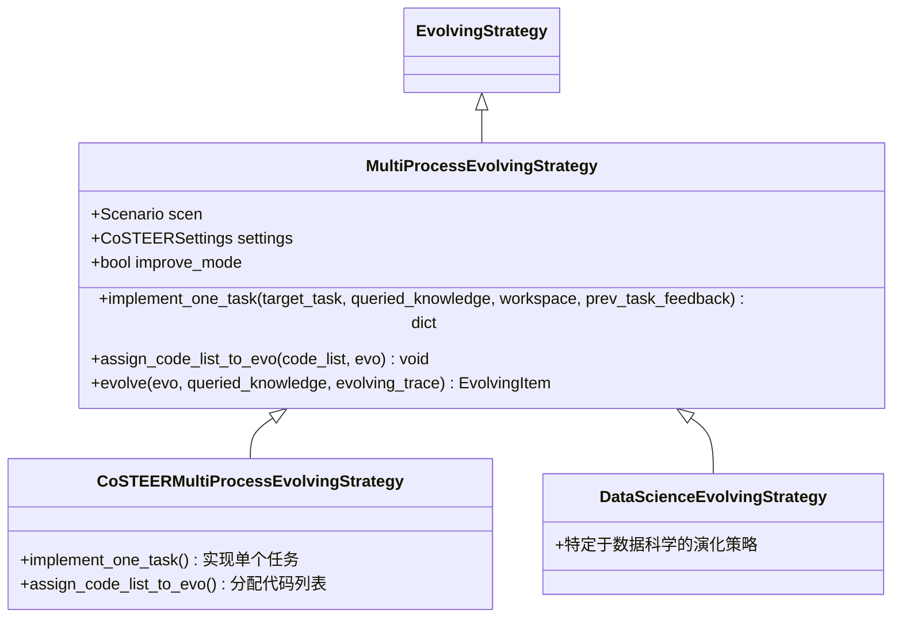

**图表来源**
- [evolving_strategy.py](file://rdagent/components/coder/CoSTEER/evolving_strategy.py#L15-L50)

### Evaluator评估机制

评估器负责对生成的代码进行质量评估，提供多维度的反馈信息：

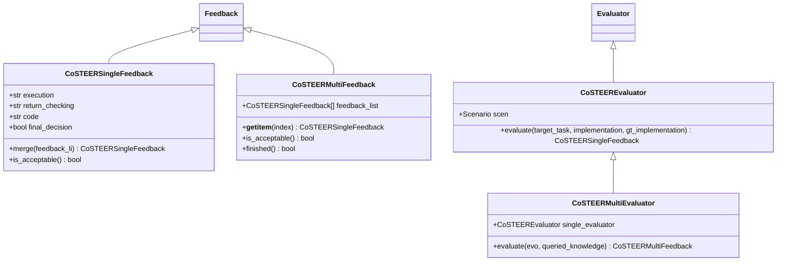

**图表来源**
- [evaluators.py](file://rdagent/components/coder/CoSTEER/evaluators.py#L25-L100)

### RAG知识管理系统

RAG（检索增强生成）系统提供了智能的知识查询和生成能力：

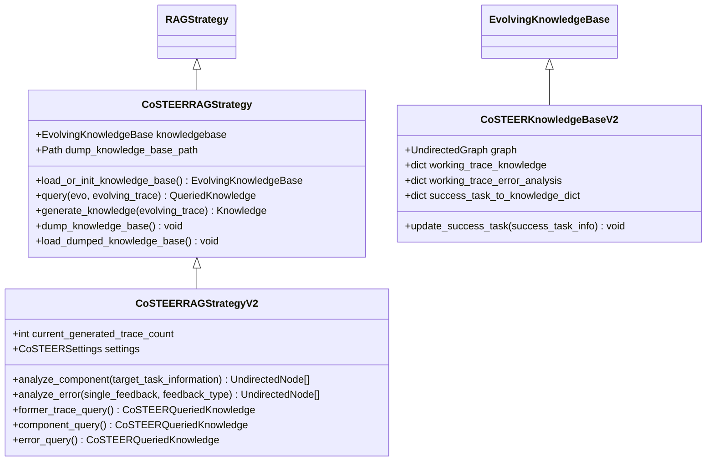

**图表来源**
- [knowledge_management.py](file://rdagent/components/coder/CoSTEER/knowledge_management.py#L50-L150)

**章节来源**
- [evolving_strategy.py](file://rdagent/components/coder/CoSTEER/evolving_strategy.py#L15-L135)
- [evaluators.py](file://rdagent/components/coder/CoSTEER/evaluators.py#L25-L312)
- [knowledge_management.py](file://rdagent/components/coder/CoSTEER/knowledge_management.py#L50-L200)

## 组件间协作流程

从Experiment创建到代码生成、执行验证和反馈评估的完整生命周期展示了各组件间的紧密协作关系。

### 完整生命周期流程

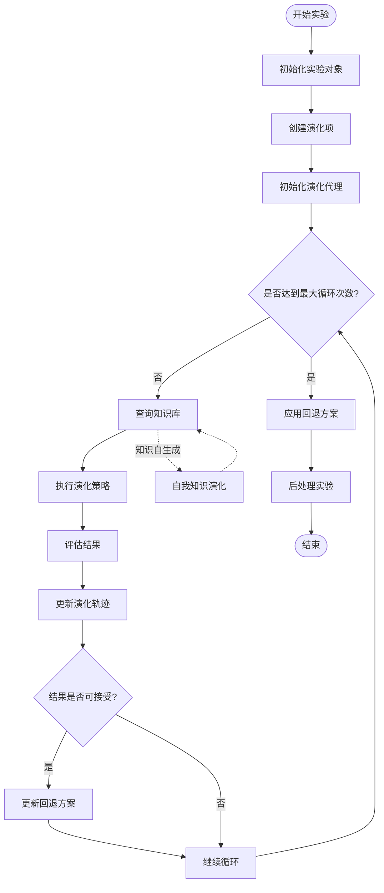

**图表来源**
- [CoSTEER/__init__.py](file://rdagent/components/coder/CoSTEER/__init__.py#L80-L150)

### 数据流转机制

各组件间的数据流转遵循严格的协议和格式规范：

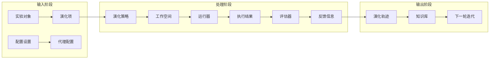

**图表来源**
- [experiment.py](file://rdagent/core/experiment.py#L300-L400)
- [evolving_agent.py](file://rdagent/core/evolving_agent.py#L75-L104)

**章节来源**
- [CoSTEER/__init__.py](file://rdagent/components/coder/CoSTEER/__init__.py#L60-L150)
- [experiment.py](file://rdagent/core/experiment.py#L300-L483)

## 异常处理与超时控制

RD-Agent实现了完善的异常处理机制和超时控制系统，确保系统的稳定性和可靠性。

### 异常类型体系

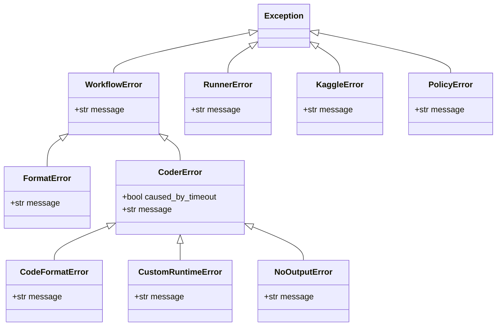

**图表来源**
- [exception.py](file://rdagent/core/exception.py#L1-L67)

### 超时控制机制

系统实现了多层次的超时控制策略：

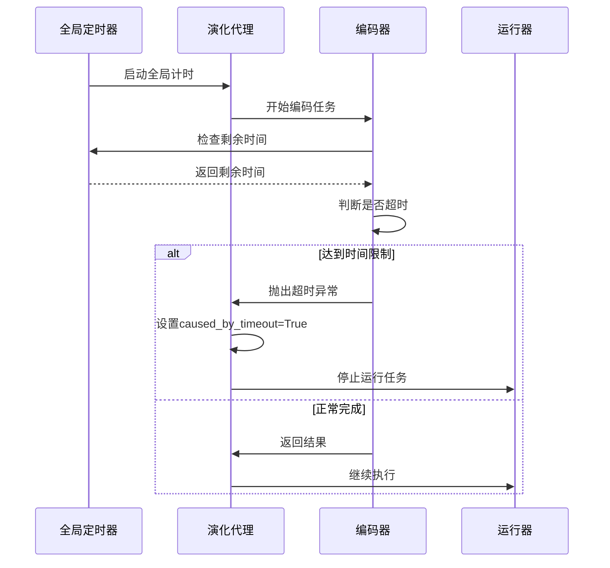

**图表来源**
- [CoSTEER/__init__.py](file://rdagent/components/coder/CoSTEER/__init__.py#L127-L135)

### 错误恢复策略

系统采用回退机制确保在异常情况下的稳定性：

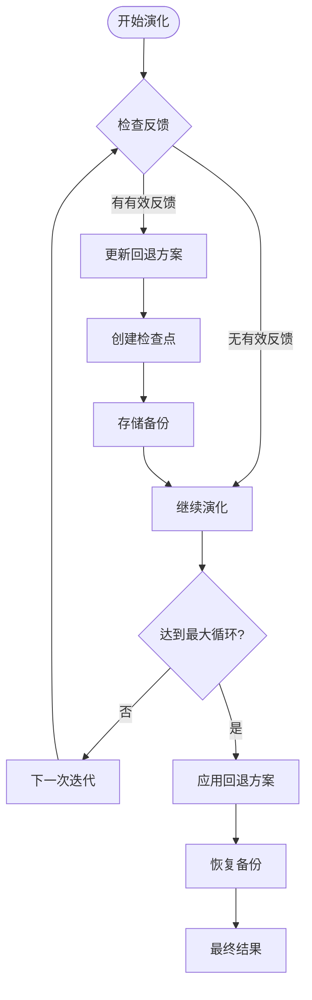

**图表来源**
- [CoSTEER/__init__.py](file://rdagent/components/coder/CoSTEER/__init__.py#L135-L150)

**章节来源**
- [exception.py](file://rdagent/core/exception.py#L1-L67)
- [CoSTEER/__init__.py](file://rdagent/components/coder/CoSTEER/__init__.py#L127-L150)

## 知识库更新策略

RD-Agent实现了动态的知识库更新机制，支持知识的自我演化和持续学习。

### 知识库架构

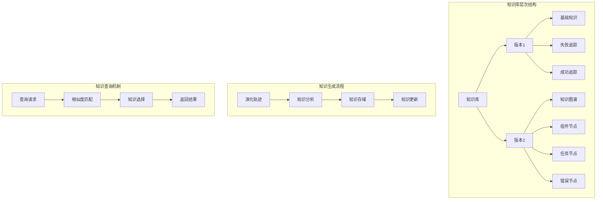

**图表来源**
- [knowledge_management.py](file://rdagent/components/coder/CoSTEER/knowledge_management.py#L200-L300)

### 动态知识演化

知识库支持自动化的知识生成和更新：

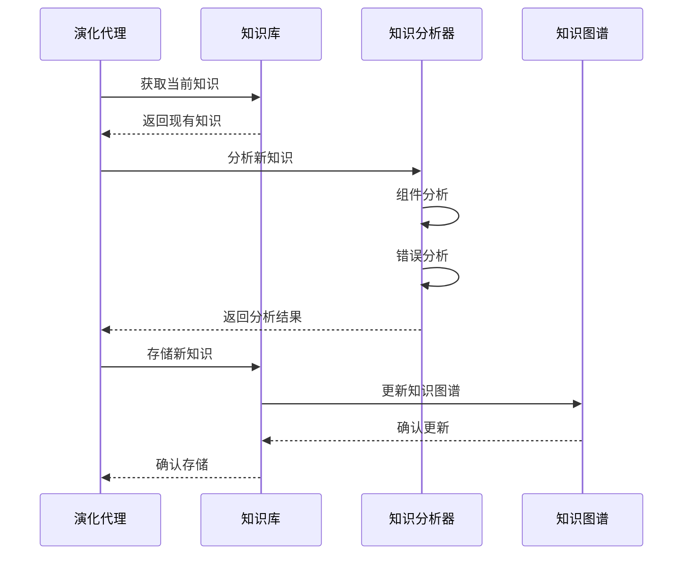

**图表来源**
- [knowledge_management.py](file://rdagent/components/coder/CoSTEER/knowledge_management.py#L400-L500)

### 并发控制机制

为确保知识库的一致性，系统实现了文件锁机制：

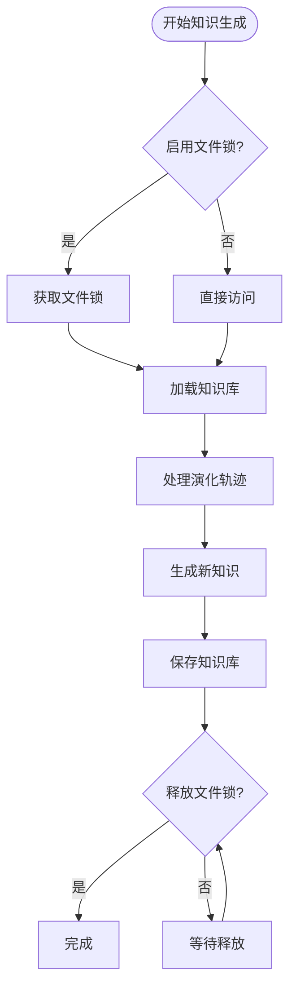

**图表来源**
- [evolving_agent.py](file://rdagent/core/evolving_agent.py#L95-L104)

**章节来源**
- [knowledge_management.py](file://rdagent/components/coder/CoSTEER/knowledge_management.py#L200-L600)
- [evolving_agent.py](file://rdagent/core/evolving_agent.py#L95-L104)

## 序列图展示

以下是核心组件间调用时序和数据流的详细序列图：

### 主要组件交互序列

```mermaid
sequenceDiagram
participant User as 用户
participant Loop as RD循环
participant CoSTEER as CoSTEER编码器
participant Agent as 演化代理
participant Strategy as 演化策略
participant RAG as RAG系统
participant Evaluator as 评估器
participant Runner as 运行器
User->>Loop : 启动实验
Loop->>CoSTEER : develop(experiment)
CoSTEER->>Agent : 初始化演化代理
Agent->>Agent : 创建演化项
loop 每个演化循环
Agent->>RAG : 查询知识
RAG-->>Agent : 返回查询结果
Agent->>Strategy : 执行演化
Strategy-->>Agent : 返回演化结果
Agent->>Evaluator : 评估结果
Evaluator-->>Agent : 返回反馈
Agent->>Agent : 更新演化轨迹
alt 需要知识自生成
Agent->>RAG : 自我知识演化
RAG->>RAG : 分析新知识
RAG->>RAG : 更新知识库
end
Agent->>Agent : 检查是否完成
end
Agent->>CoSTEER : 返回最终实验
CoSTEER->>Runner : 执行最终代码
Runner-->>CoSTEER : 返回执行结果
CoSTEER-->>Loop : 返回优化后的实验
Loop-->>User : 返回最终结果
```

**图表来源**
- [CoSTEER/__init__.py](file://rdagent/components/coder/CoSTEER/__init__.py#L80-L150)
- [loop.py](file://rdagent/scenarios/data_science/loop.py#L150-L200)

### 异常处理流程

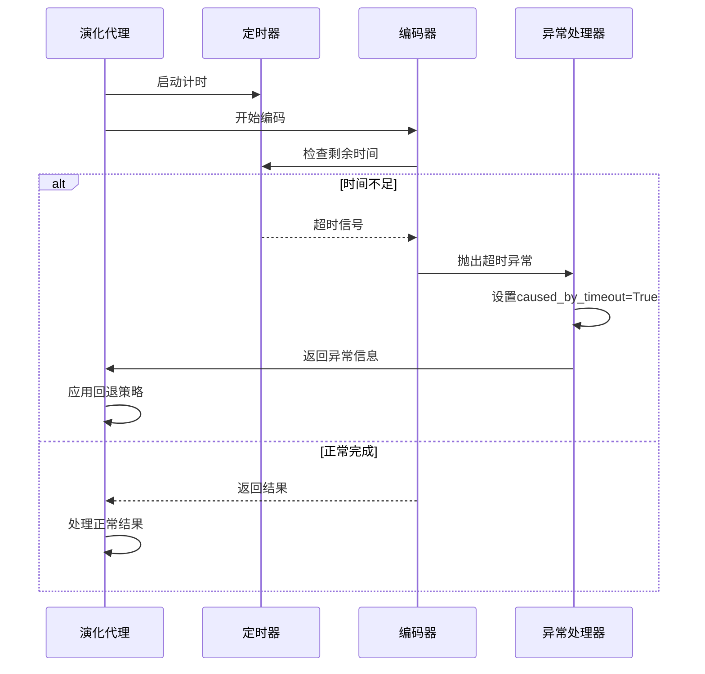

**图表来源**
- [CoSTEER/__init__.py](file://rdagent/components/coder/CoSTEER/__init__.py#L127-L150)

## 总结

RD-Agent的核心框架通过EvolvingAgent作为中央控制器，实现了Coder、Runner和Evaluator三大组件的高效协作。该框架的主要特点包括：

1. **模块化架构设计**：采用分层架构，各组件职责明确，便于扩展和维护
2. **智能知识管理**：通过RAG系统实现知识的动态查询和自我演化
3. **完善的异常处理**：多层次的异常处理和超时控制机制确保系统稳定性
4. **并发安全保障**：文件锁机制保证知识库更新的一致性
5. **灵活的演化策略**：支持多种演化策略和评估方法

这种设计使得RD-Agent能够适应复杂的科学计算任务，通过智能的迭代优化实现高质量的代码生成和实验开发。框架的开放性和可扩展性为未来的功能增强和应用场景拓展奠定了坚实的基础。