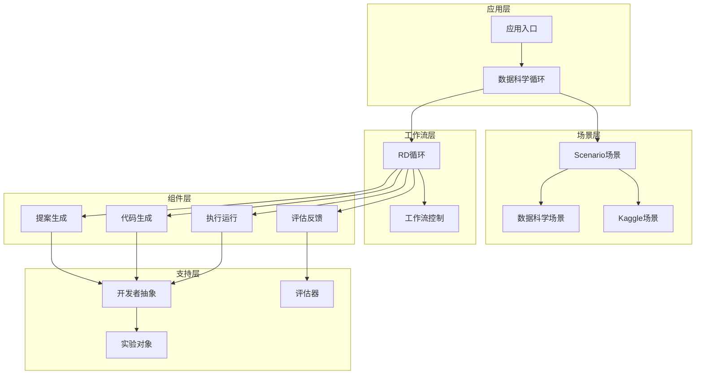
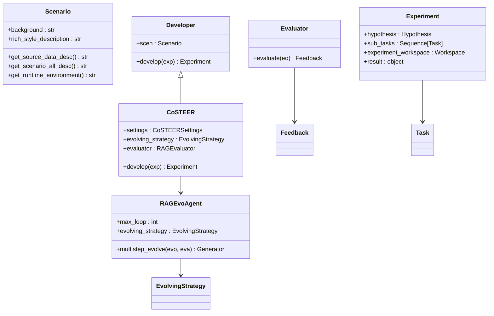
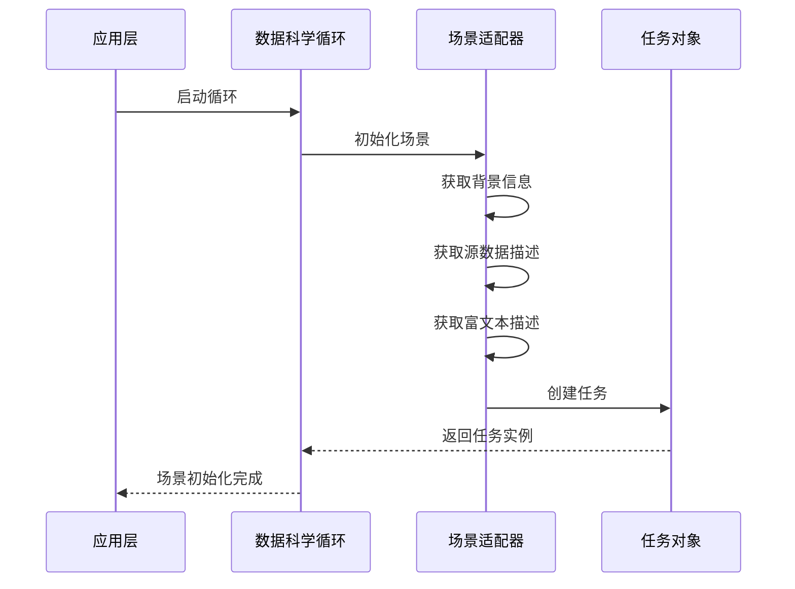
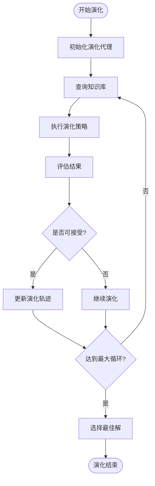
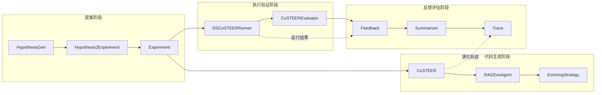
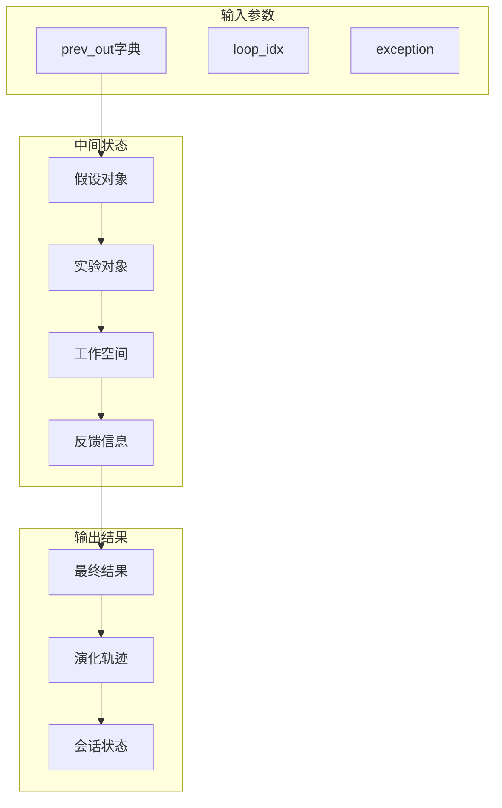
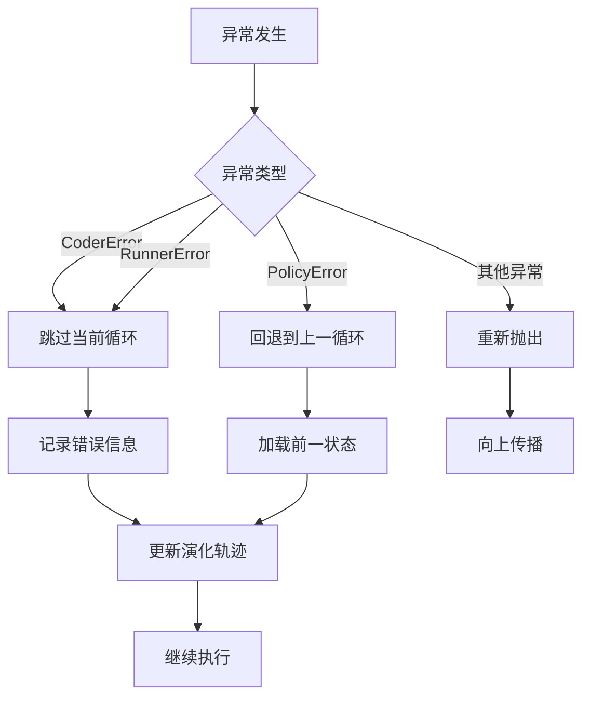
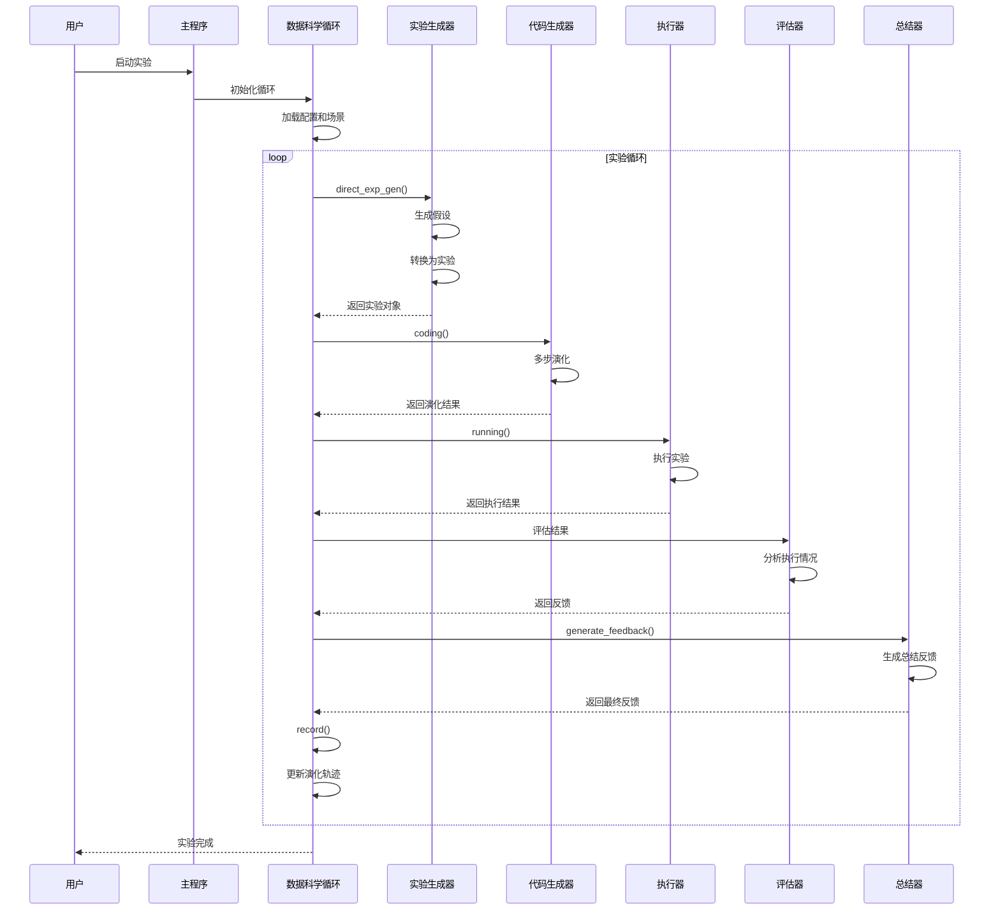

# RD-Agent模块交互关系深度分析

<cite>
**本文档引用的文件**
- [rdagent/core/scenario.py](file://rdagent/core/scenario.py)
- [rdagent/core/evolving_agent.py](file://rdagent/core/evolving_agent.py)
- [rdagent/app/data_science/loop.py](file://rdagent/app/data_science/loop.py)
- [rdagent/scenarios/data_science/loop.py](file://rdagent/scenarios/data_science/loop.py)
- [rdagent/components/proposal/__init__.py](file://rdagent/components/proposal/__init__.py)
- [rdagent/components/coder/CoSTEER/__init__.py](file://rdagent/components/coder/CoSTEER/__init__.py)
- [rdagent/components/runner/__init__.py](file://rdagent/components/runner/__init__.py)
- [rdagent/core/experiment.py](file://rdagent/core/experiment.py)
- [rdagent/components/workflow/rd_loop.py](file://rdagent/components/workflow/rd_loop.py)
- [rdagent/core/developer.py](file://rdagent/core/developer.py)
- [rdagent/core/evaluation.py](file://rdagent/core/evaluation.py)
- [rdagent/components/coder/data_science/share/doc.py](file://rdagent/components/coder/data_science/share/doc.py)
- [rdagent/utils/workflow/loop.py](file://rdagent/utils/workflow/loop.py)
</cite>

## 目录
1. [引言](#引言)
2. [系统架构概览](#系统架构概览)
3. [核心模块分析](#核心模块分析)
4. [Scenario场景适配器](#scenario场景适配器)
5. [EvolvingAgent演化代理](#evolvingagent演化代理)
6. [模块协作机制](#模块协作机制)
7. [完整调用链路分析](#完整调用链路分析)
8. [参数传递与状态同步](#参数传递与状态同步)
9. [异常处理机制](#异常处理机制)
10. [序列图展示](#序列图展示)
11. [总结](#总结)

## 引言

RD-Agent是一个基于多智能体框架的研发自动化系统，通过精心设计的模块化架构实现了从提案生成到代码实现、执行验证再到反馈评估的完整研发循环。本文档深入分析了该系统各核心模块之间的调用关系与协作机制，重点阐述了Scenario作为场景适配器、EvolvingAgent通过策略模式选择不同场景实现，以及从Proposal到Coder、Runner再到Evaluation的完整调用链路。

## 系统架构概览

RD-Agent采用分层架构设计，主要包含以下核心层次：



**图表来源**
- [rdagent/app/data_science/loop.py](file://rdagent/app/data_science/loop.py#L1-L81)
- [rdagent/scenarios/data_science/loop.py](file://rdagent/scenarios/data_science/loop.py#L1-L384)
- [rdagent/components/workflow/rd_loop.py](file://rdagent/components/workflow/rd_loop.py#L1-L93)

## 核心模块分析

### 模块关系图



**图表来源**
- [rdagent/core/scenario.py](file://rdagent/core/scenario.py#L6-L65)
- [rdagent/core/developer.py](file://rdagent/core/developer.py#L11-L33)
- [rdagent/core/evaluation.py](file://rdagent/core/evaluation.py#L41-L56)
- [rdagent/core/experiment.py](file://rdagent/core/experiment.py#L350-L482)
- [rdagent/components/coder/CoSTEER/__init__.py](file://rdagent/components/coder/CoSTEER/__init__.py#L15-L176)

**章节来源**
- [rdagent/core/scenario.py](file://rdagent/core/scenario.py#L1-L65)
- [rdagent/core/developer.py](file://rdagent/core/developer.py#L1-L35)
- [rdagent/core/evaluation.py](file://rdagent/core/evaluation.py#L1-L58)
- [rdagent/core/experiment.py](file://rdagent/core/experiment.py#L1-L483)

## Scenario场景适配器

### 场景适配器职责

Scenario作为场景适配器，负责为不同的应用场景提供统一的接口和配置。它定义了场景的基本信息、数据描述、运行环境等核心属性。

### 数据科学场景实现

在数据科学场景中，Scenario提供了完整的场景描述能力：



**图表来源**
- [rdagent/scenarios/data_science/loop.py](file://rdagent/scenarios/data_science/loop.py#L100-L120)

### 场景特性

| 特性 | 描述 | 实现位置 |
|------|------|----------|
| 背景信息 | 场景的基本背景和目标 | `background` 属性 |
| 数据描述 | 源数据的详细描述 | `get_source_data_desc()` 方法 |
| 运行环境 | 运行时环境信息 | `get_runtime_environment()` 方法 |
| 富文本描述 | 可视化的场景描述 | `rich_style_description` 属性 |

**章节来源**
- [rdagent/core/scenario.py](file://rdagent/core/scenario.py#L1-L65)

## EvolvingAgent演化代理

### 策略模式实现

EvolvingAgent采用策略模式，通过不同的演化策略选择适合特定场景的实现方式。RAGEvoAgent是其核心实现，提供了基于知识库的演化能力。

### 演化过程流程



**图表来源**
- [rdagent/core/evolving_agent.py](file://rdagent/core/evolving_agent.py#L60-L115)

### 核心特性

| 特性 | 描述 | 配置参数 |
|------|------|----------|
| 最大循环次数 | 演化过程的最大迭代次数 | `max_loop` |
| 知识库集成 | 基于知识库的智能演化 | `with_knowledge` |
| 反馈机制 | 基于反馈的演化控制 | `with_feedback` |
| 自学习能力 | 知识库的自我完善 | `knowledge_self_gen` |

**章节来源**
- [rdagent/core/evolving_agent.py](file://rdagent/core/evolving_agent.py#L1-L116)

## 模块协作机制

### 协作关系图



**图表来源**
- [rdagent/scenarios/data_science/loop.py](file://rdagent/scenarios/data_science/loop.py#L150-L200)
- [rdagent/components/coder/CoSTEER/__init__.py](file://rdagent/components/coder/CoSTEER/__init__.py#L70-L120)

### 协作模式

1. **顺序协作**: 提案生成 → 代码生成 → 执行验证 → 反馈评估
2. **并行协作**: 多个Coder并行处理不同子任务
3. **迭代协作**: 基于反馈的循环优化过程

**章节来源**
- [rdagent/scenarios/data_science/loop.py](file://rdagent/scenarios/data_science/loop.py#L1-L384)

## 完整调用链路分析

### Proposal到Coder的调用链路

```mermaid
sequenceDiagram
participant Loop as DataScienceRDLoop
participant ExpGen as ExpGen
participant Interactor as Interactor
participant Coder as CoSTEER
participant Task as Task
Loop->>ExpGen : direct_exp_gen()
ExpGen->>ExpGen : 生成实验计划
ExpGen-->>Loop : 返回实验对象
Loop->>Interactor : interact(exp)
Interactor-->>Loop : 返回交互后的实验
Loop->>Loop : coding()
Loop->>Task : 分发子任务
Task->>Coder : develop(exp)
Coder->>Coder : 多步演化
Coder-->>Loop : 返回演化后的实验
```

**图表来源**
- [rdagent/scenarios/data_science/loop.py](file://rdagent/scenarios/data_science/loop.py#L140-L180)

### 从提案到代码实现的完整流程

| 阶段 | 组件 | 主要功能 | 输入输出 |
|------|------|----------|----------|
| 提案生成 | ExpGen | 将假设转换为实验计划 | Hypothesis → Experiment |
| 交互调整 | Interactor | 用户交互和实验调整 | Experiment → Experiment |
| 代码生成 | CoSTEER | 基于演化策略生成代码 | Experiment → Experiment |
| 演化优化 | RAGEvoAgent | 多步演化优化解决方案 | Experiment → Experiment |

**章节来源**
- [rdagent/scenarios/data_science/loop.py](file://rdagent/scenarios/data_science/loop.py#L140-L220)

## 参数传递与状态同步

### 参数传递机制

RD-Agent采用字典形式的参数传递机制，确保各模块间的状态同步：



**图表来源**
- [rdagent/utils/workflow/loop.py](file://rdagent/utils/workflow/loop.py#L100-L150)

### 状态同步策略

1. **就地修改**: 开发者直接修改实验对象，避免返回值传递
2. **异常传播**: 通过特殊键名传递异常信息
3. **进度跟踪**: 使用索引键名跟踪当前执行状态
4. **检查点机制**: 支持工作空间的检查点创建和恢复

**章节来源**
- [rdagent/core/developer.py](file://rdagent/core/developer.py#L15-L30)
- [rdagent/utils/workflow/loop.py](file://rdagent/utils/workflow/loop.py#L1-L538)

## 异常处理机制

### 异常分类与处理



**图表来源**
- [rdagent/scenarios/data_science/loop.py](file://rdagent/scenarios/data_science/loop.py#L250-L300)

### 异常处理策略

| 异常类型 | 处理策略 | 影响范围 |
|----------|----------|----------|
| CoderError | 跳过当前循环 | 当前循环 |
| RunnerError | 跳过当前循环 | 当前循环 |
| PolicyError | 回退到上一循环 | 整个循环 |
| 其他异常 | 向上传播 | 全局 |

**章节来源**
- [rdagent/scenarios/data_science/loop.py](file://rdagent/scenarios/data_science/loop.py#L80-L100)

## 序列图展示

### 一次完整实验周期的交互时序



**图表来源**
- [rdagent/scenarios/data_science/loop.py](file://rdagent/scenarios/data_science/loop.py#L140-L380)
- [rdagent/app/data_science/loop.py](file://rdagent/app/data_science/loop.py#L15-L80)

### 模块间参数传递时序

```mermaid
sequenceDiagram
participant Loop as RDLoop
participant PrevOut as prev_out字典
participant Coder as CoSTEER
participant Evolver as RAGEvoAgent
participant Strategy as EvolvingStrategy
participant Evaluator as RAGEvaluator
Loop->>PrevOut : 初始化参数
Loop->>Coder : develop(exp)
Coder->>Evolver : multistep_evolve()
loop 演化循环
Evolver->>Strategy : evolve()
Strategy-->>Evolver : 演化结果
Evolver->>Evaluator : evaluate()
Evaluator-->>Evolver : 反馈信息
Evolver-->>PrevOut : 更新状态
end
Evolver-->>Coder : 返回最终实验
Coder-->>Loop : 返回演化结果
```

**图表来源**
- [rdagent/components/coder/CoSTEER/__init__.py](file://rdagent/components/coder/CoSTEER/__init__.py#L70-L120)
- [rdagent/core/evolving_agent.py](file://rdagent/core/evolving_agent.py#L60-L115)

## 总结

RD-Agent通过精心设计的模块化架构实现了高效的多智能体协作机制。主要特点包括：

1. **清晰的职责分离**: Scenario负责场景适配，EvolvingAgent负责演化策略，各模块职责明确
2. **灵活的协作模式**: 支持顺序、并行和迭代等多种协作方式
3. **完善的异常处理**: 通过分类处理和状态回退机制确保系统稳定性
4. **有效的参数传递**: 采用字典形式的参数传递和状态同步机制
5. **强大的演化能力**: 基于知识库的智能演化和自我优化

这种架构设计使得RD-Agent能够在复杂的研发场景中保持高效、稳定和可扩展的特性，为自动化研发提供了强有力的支撑。