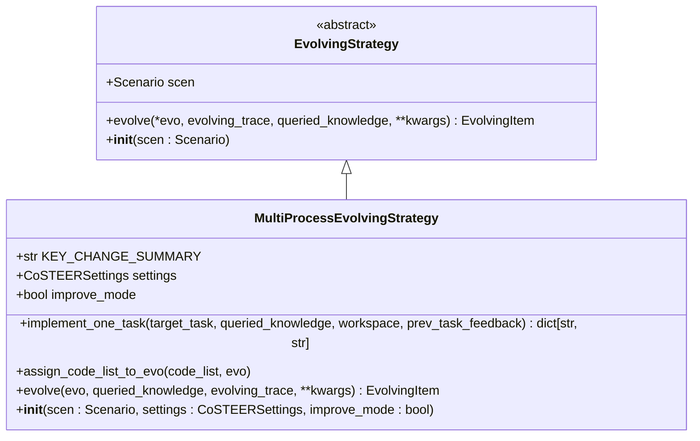
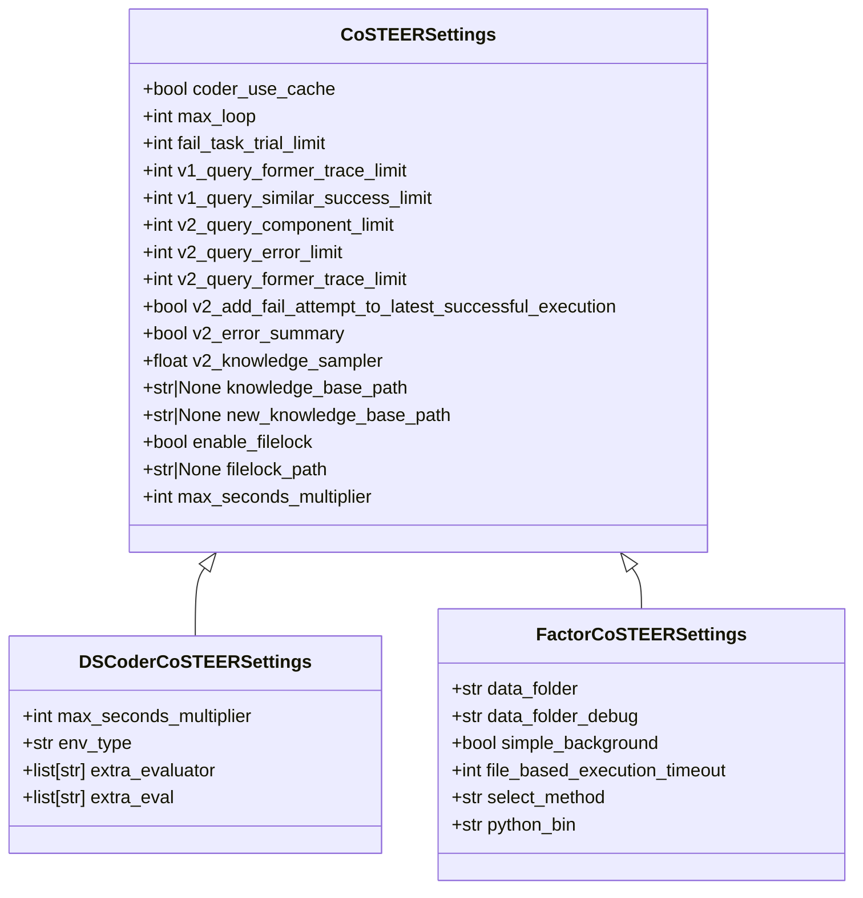
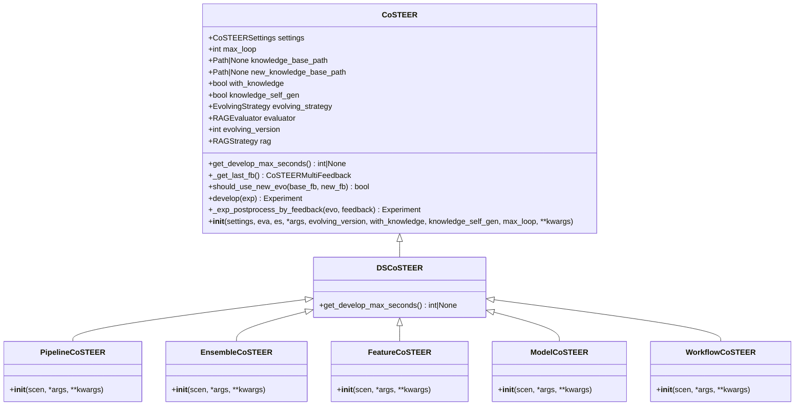
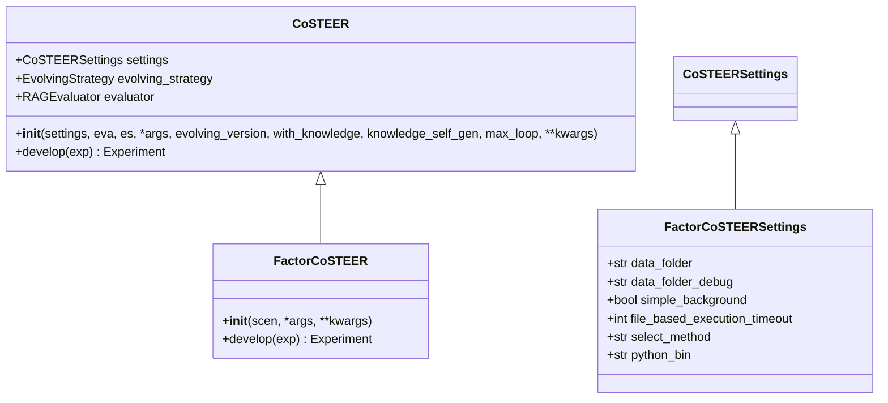
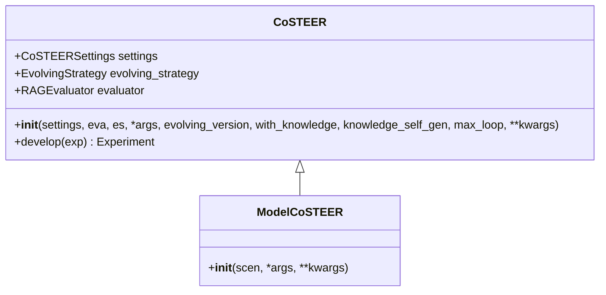

# 工厂模式

<cite>
**本文档中引用的文件**  
- [CoSTEER.py](file://rdagent\components\coder\CoSTEER\__init__.py)
- [config.py](file://rdagent\components\coder\CoSTEER\config.py)
- [evolving_strategy.py](file://rdagent\components\coder\CoSTEER\evolving_strategy.py)
- [ds_costeer.py](file://rdagent\components\coder\data_science\share\ds_costeer.py)
- [DSCoderCoSTEERSettings.py](file://rdagent\components\coder\data_science\conf.py)
- [DS_RD_SETTING.py](file://rdagent\app\data_science\conf.py)
- [FactorCoSTEERSettings.py](file://rdagent\components\coder\factor_coder\config.py)
- [ModelCoSTEER.py](file://rdagent\components\coder\model_coder\__init__.py)
- [FactorCoSTEER.py](file://rdagent\components\coder\factor_coder\__init__.py)
- [PipelineCoSTEER.py](file://rdagent\components\coder\data_science\pipeline\__init__.py)
- [EnsembleCoSTEER.py](file://rdagent\components\coder\data_science\ensemble\__init__.py)
- [FeatureCoSTEER.py](file://rdagent\components\coder\data_science\feature\__init__.py)
- [ModelCoSTEER.py](file://rdagent\components\coder\data_science\model\__init__.py)
- [WorkflowCoSTEER.py](file://rdagent\components\coder\data_science\workflow\__init__.py)
- [DSRunnerCoSTEERSettings.py](file://rdagent\scenarios\data_science\dev\runner\__init__.py)
</cite>

## 目录
1. [引言](#引言)
2. [工厂模式在组件初始化中的应用](#工厂模式在组件初始化中的应用)
3. [EvolvingStrategy继承体系](#evolvingstrategy继承体系)
4. [配置驱动的工厂方法实现](#配置驱动的工厂方法实现)
5. [代码示例分析](#代码示例分析)
6. [配置驱动架构的支持](#配置驱动架构的支持)
7. [依赖注入的简化作用](#依赖注入的简化作用)
8. [结论](#结论)

## 引言
RD-Agent系统采用工厂模式来实现组件的动态创建和初始化，特别是在CoSTEER框架中。该模式通过YAML配置文件和环境变量来驱动组件实例化过程，支持运行时根据不同的场景和参数创建Coder、Runner等组件。本文将深入解析工厂模式在RD-Agent中的应用，重点描述系统如何根据配置动态创建组件实例，以及EvolvingStrategy继承体系如何支持不同策略的演化引擎。

## 工厂模式在组件初始化中的应用

RD-Agent系统中的工厂模式主要体现在CoSTEER类的继承体系中。通过工厂模式，系统能够根据YAML配置动态创建Coder、Runner等组件实例。这种设计模式封装了对象创建逻辑，使得系统能够灵活地支持不同场景下的组件实例化。

在RD-Agent中，工厂模式的核心实现是通过继承CoSTEER基类来创建特定类型的组件。每个具体的组件类（如FactorCoSTEER、ModelCoSTEER等）都继承自CoSTEER类，并在构造函数中根据配置设置相应的参数。这种设计使得组件的创建过程与使用过程分离，提高了系统的灵活性和可扩展性。

工厂模式的应用主要体现在以下几个方面：
- **配置驱动**：组件的创建过程由YAML配置文件和环境变量驱动，支持运行时动态配置
- **继承体系**：通过继承CoSTEER基类，实现了组件的标准化创建流程
- **参数化配置**：每个组件可以根据特定的配置参数进行定制化实例化

**本节来源**
- [CoSTEER.py](file://rdagent\components\coder\CoSTEER\__init__.py#L19-L175)
- [config.py](file://rdagent\components\coder\CoSTEER\config.py#L5-L38)

## EvolvingStrategy继承体系

EvolvingStrategy是RD-Agent系统中演化策略的基类，定义了演化过程的核心接口。该类采用抽象基类（ABC）模式，为具体的演化策略提供了统一的接口规范。MultiProcessEvolvingStrategy作为EvolvingStrategy的具体实现，提供了多进程演化的基础功能。

EvolvingStrategy继承体系的主要特点包括：
- **抽象方法定义**：定义了evolve、implement_one_task等抽象方法，确保所有具体策略都实现相同的核心功能
- **通用逻辑封装**：在基类中封装了演化过程的通用逻辑，如任务调度、反馈处理等
- **可扩展性**：通过继承机制，支持创建各种特定场景的演化策略

MultiProcessEvolvingStrategy作为具体的实现类，提供了以下核心功能：
- **多进程支持**：利用multiprocessing_wrapper实现并行任务处理
- **任务调度**：根据任务状态和反馈决定需要处理的任务
- **知识查询**：集成知识管理系统，支持基于历史知识的决策



**图表来源**
- [evolving_strategy.py](file://rdagent\components\coder\CoSTEER\evolving_strategy.py#L20-L133)
- [EvolvingStrategy.py](file://rdagent\core\evolving_framework.py#L59-L77)

**本节来源**
- [evolving_strategy.py](file://rdagent\components\coder\CoSTEER\evolving_strategy.py#L20-L133)
- [EvolvingStrategy.py](file://rdagent\core\evolving_framework.py#L59-L77)

## 配置驱动的工厂方法实现

RD-Agent系统通过配置驱动的工厂方法实现了组件的动态创建。这种实现方式基于CoSTEERSettings类，该类继承自ExtendedBaseSettings，并通过环境变量前缀来区分不同组件的配置。

配置驱动的工厂方法实现主要包括以下关键组件：
- **CoSTEERSettings**：基础配置类，定义了通用的配置参数
- **特定组件配置类**：如DSCoderCoSTEERSettings、FactorCoSTEERSettings等，继承自CoSTEERSettings并添加特定配置
- **环境变量映射**：通过Config类的env_prefix属性，将环境变量映射到配置参数

DSCoderCoSTEERSettings作为数据科学场景下的Coder配置类，展示了配置驱动工厂方法的具体实现：



**图表来源**
- [config.py](file://rdagent\components\coder\CoSTEER\config.py#L5-L38)
- [DSCoderCoSTEERSettings.py](file://rdagent\components\coder\data_science\conf.py#L5-L38)
- [FactorCoSTEERSettings.py](file://rdagent\components\coder\factor_coder\config.py#L5-L38)

**本节来源**
- [config.py](file://rdagent\components\coder\CoSTEER\config.py#L5-L38)
- [DSCoderCoSTEERSettings.py](file://rdagent\components\coder\data_science\conf.py#L5-L38)
- [FactorCoSTEERSettings.py](file://rdagent\components\coder\factor_coder\config.py#L5-L38)

## 代码示例分析

通过分析RD-Agent中的具体代码实现，可以更深入地理解工厂模式的应用。以下是一些关键的代码示例分析：

### 数据科学组件的工厂实现

在数据科学场景中，各种组件都通过继承DSCoSTEER类来实现工厂模式。DSCoSTEER类本身继承自CoSTEER，为数据科学场景提供了特定的实现。



**图表来源**
- [CoSTEER.py](file://rdagent\components\coder\CoSTEER\__init__.py#L19-L175)
- [ds_costeer.py](file://rdagent\components\coder\data_science\share\ds_costeer.py#L3-L8)
- [PipelineCoSTEER.py](file://rdagent\components\coder\data_science\pipeline\__init__.py#L128-L164)
- [EnsembleCoSTEER.py](file://rdagent\components\coder\data_science\ensemble\__init__.py#L129-L163)
- [FeatureCoSTEER.py](file://rdagent\components\coder\data_science\feature\__init__.py#L124-L139)
- [ModelCoSTEER.py](file://rdagent\components\coder\data_science\model\__init__.py#L145-L172)
- [WorkflowCoSTEER.py](file://rdagent\components\coder\data_science\workflow\__init__.py#L88-L131)

**本节来源**
- [CoSTEER.py](file://rdagent\components\coder\CoSTEER\__init__.py#L19-L175)
- [ds_costeer.py](file://rdagent\components\coder\data_science\share\ds_costeer.py#L3-L8)
- [PipelineCoSTEER.py](file://rdagent\components\coder\data_science\pipeline\__init__.py#L128-L164)
- [EnsembleCoSTEER.py](file://rdagent\components\coder\data_science\ensemble\__init__.py#L129-L163)
- [FeatureCoSTEER.py](file://rdagent\components\coder\data_science\feature\__init__.py#L124-L139)
- [ModelCoSTEER.py](file://rdagent\components\coder\data_science\model\__init__.py#L145-L172)
- [WorkflowCoSTEER.py](file://rdagent\components\coder\data_science\workflow\__init__.py#L88-L131)

### 因子组件的工厂实现

因子组件的工厂实现展示了如何通过特定的配置类来定制化组件行为。FactorCoSTEER类继承自CoSTEER，并使用FACTOR_COSTEER_SETTINGS配置。



**图表来源**
- [FactorCoSTEER.py](file://rdagent\components\coder\factor_coder\__init__.py#L0-L31)
- [FactorCoSTEERSettings.py](file://rdagent\components\coder\factor_coder\config.py#L0-L49)

**本节来源**
- [FactorCoSTEER.py](file://rdagent\components\coder\factor_coder\__init__.py#L0-L31)
- [FactorCoSTEERSettings.py](file://rdagent\components\coder\factor_coder\config.py#L0-L49)

### 模型组件的工厂实现

模型组件的工厂实现与因子组件类似，但使用了不同的配置和演化策略。ModelCoSTEER类展示了如何通过工厂模式创建特定类型的组件。



**图表来源**
- [ModelCoSTEER.py](file://rdagent\components\coder\model_coder\__init__.py#L0-L20)

**本节来源**
- [ModelCoSTEER.py](file://rdagent\components\coder\model_coder\__init__.py#L0-L20)

## 配置驱动架构的支持

RD-Agent的工厂模式为配置驱动架构提供了强大的支持。通过环境变量和YAML配置文件，系统能够在运行时动态调整组件行为，而无需修改代码。

配置驱动架构的主要优势包括：
- **灵活性**：通过环境变量可以轻松调整系统行为，如超时时间、缓存策略等
- **可维护性**：配置与代码分离，便于维护和版本控制
- **可扩展性**：新的组件类型可以通过继承和配置轻松添加

在RD-Agent中，配置驱动架构的具体实现体现在以下几个方面：

### 环境变量前缀机制

每个配置类都通过Config类的env_prefix属性定义了环境变量前缀。这种机制确保了不同组件的配置不会相互干扰。

```python
class DSCoderCoSTEERSettings(CoSTEERSettings):
    class Config:
        env_prefix = "DS_Coder_CoSTEER_"
```

### 层次化配置继承

配置类采用层次化继承结构，基础配置类提供通用参数，特定场景的配置类在此基础上添加特定参数。这种设计既保证了配置的一致性，又提供了足够的灵活性。

```python
class CoSTEERSettings(ExtendedBaseSettings):
    # 通用配置参数
    pass

class DSCoderCoSTEERSettings(CoSTEERSettings):
    # 数据科学Coder特定配置
    pass
```

### 运行时配置加载

系统在运行时动态加载配置，支持环境变量覆盖默认配置。这种机制使得部署和调试更加方便。

```python
os.environ["DS_CODER_COSTEER_MAX_SECONDS_MULTIPLIER"] = "1000"
coder_conf = DSCoderCoSTEERSettings()
```

**本节来源**
- [DSCoderCoSTEERSettings.py](file://rdagent\components\coder\data_science\conf.py#L5-L38)
- [test_conf.py](file://test\utils\test_conf.py#L0-L44)
- [DS_RD_SETTING.py](file://rdagent\app\data_science\conf.py#L0-L206)

## 依赖注入的简化作用

工厂模式在RD-Agent中不仅实现了组件的动态创建，还简化了依赖注入过程。通过将依赖关系的创建和管理封装在工厂方法中，系统降低了组件间的耦合度。

依赖注入的简化作用主要体现在以下几个方面：

### 构造函数注入

组件的依赖关系通过构造函数参数注入，工厂方法负责创建和传递这些依赖。

```python
class FactorCoSTEER(CoSTEER):
    def __init__(self, scen: Scenario, *args, **kwargs) -> None:
        setting = FACTOR_COSTEER_SETTINGS
        eva = CoSTEERMultiEvaluator(FactorEvaluatorForCoder(scen=scen), scen=scen)
        es = FactorMultiProcessEvolvingStrategy(scen=scen, settings=FACTOR_COSTEER_SETTINGS)
        super().__init__(*args, settings=setting, eva=eva, es=es, evolving_version=2, scen=scen, **kwargs)
```

### 配置驱动的依赖创建

依赖的创建过程由配置驱动，工厂方法根据配置参数决定创建哪种类型的依赖。

```python
def get_ds_env(conf_type: Literal["kaggle", "mlebench"] = "kaggle", ...) -> Env:
    conf = DSCoderCoSTEERSettings()
    if conf.env_type == "docker":
        env_conf = DSDockerConf() if conf_type == "kaggle" else MLEBDockerConf()
        env = DockerEnv(conf=env_conf)
    elif conf.env_type == "conda":
        env = LocalEnv(conf=(CondaConf(conda_env_name=conf_type) if conf_type == "kaggle" else MLECondaConf(conda_env_name=conf_type)))
    else:
        raise ValueError(f"Unknown env type: {conf.env_type}")
    return env
```

### 运行时依赖替换

通过配置，系统可以在运行时替换依赖实现，支持A/B测试和灰度发布。

```python
# 通过环境变量切换不同的演化策略
os.environ["FACTOR_CoSTEER_select_method"] = "random"
```

**本节来源**
- [FactorCoSTEER.py](file://rdagent\components\coder\factor_coder\__init__.py#L0-L31)
- [DSCoderCoSTEERSettings.py](file://rdagent\components\coder\data_science\conf.py#L5-L87)
- [DS_RD_SETTING.py](file://rdagent\app\data_science\conf.py#L0-L206)

## 结论

RD-Agent系统通过工厂模式实现了组件的动态创建和初始化，为配置驱动架构提供了强大的支持。该模式的核心优势在于：

1. **配置驱动**：通过YAML配置文件和环境变量，系统能够在运行时动态调整组件行为，支持灵活的部署和调试。

2. **继承体系**：通过CoSTEER基类和EvolvingStrategy继承体系，实现了组件的标准化创建流程和演化策略的可扩展性。

3. **依赖注入简化**：工厂方法封装了依赖关系的创建和管理，降低了组件间的耦合度，提高了系统的可维护性和可测试性。

4. **可扩展性**：新的组件类型可以通过继承和配置轻松添加，支持系统的持续演进。

5. **运行时灵活性**：通过配置驱动的工厂方法，系统能够在运行时根据不同的场景和参数创建相应的组件实例，支持复杂的业务需求。

工厂模式在RD-Agent中的应用展示了如何通过设计模式提高系统的灵活性和可维护性。通过将对象创建逻辑与使用逻辑分离，系统能够更好地适应变化，支持快速迭代和创新。