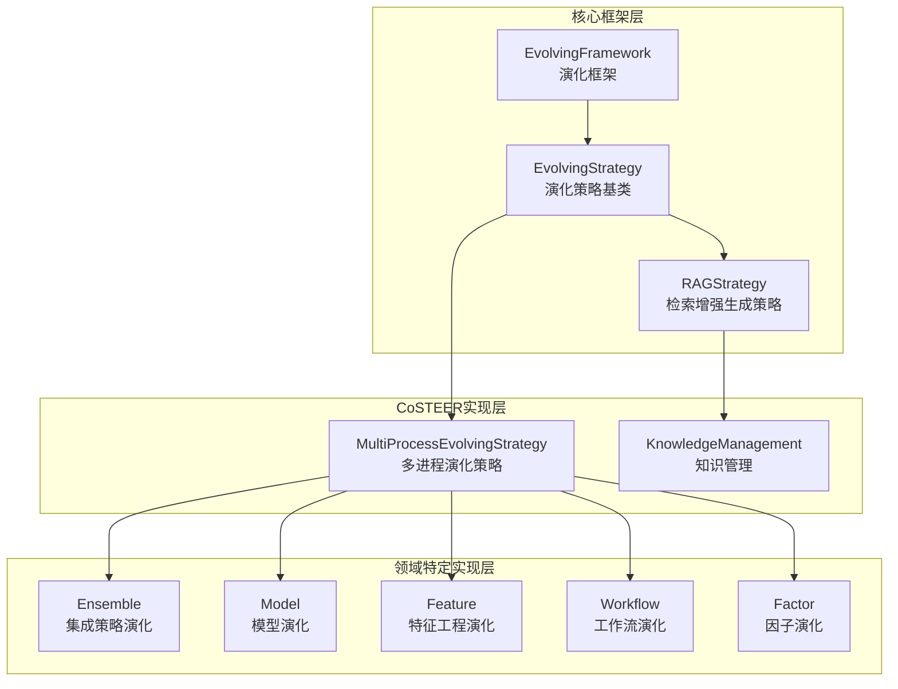
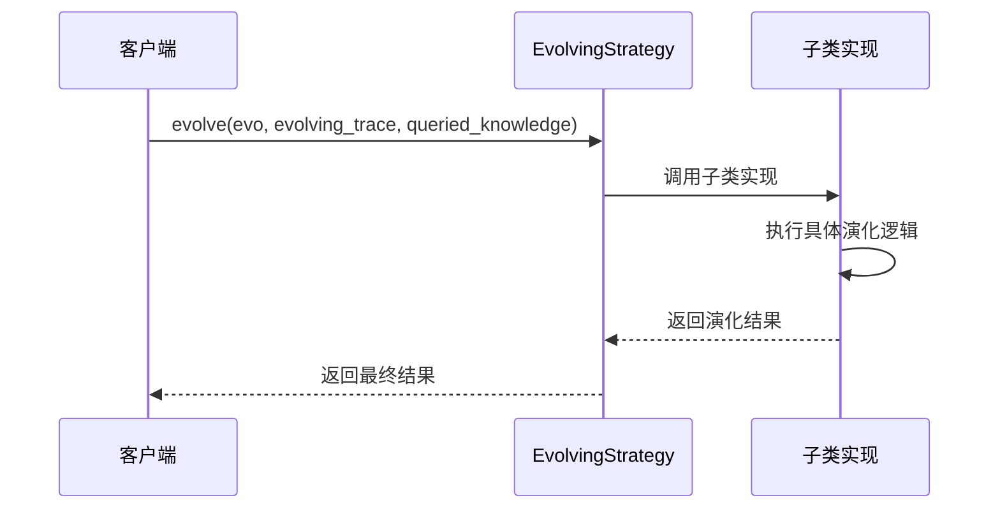
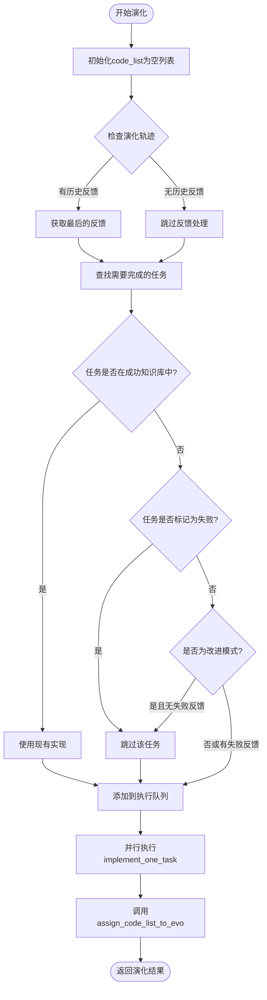
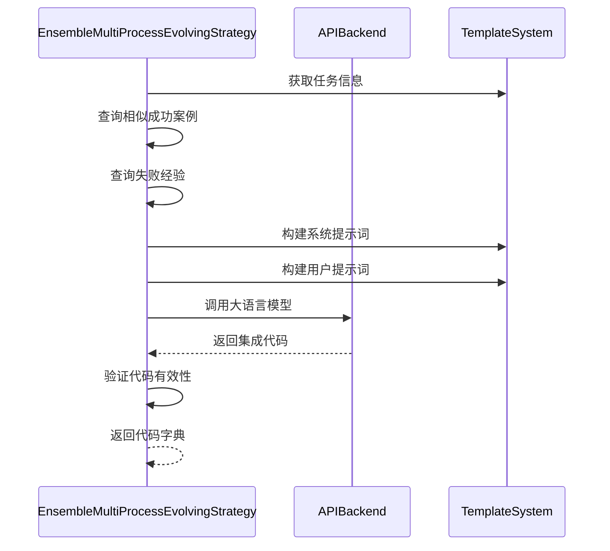
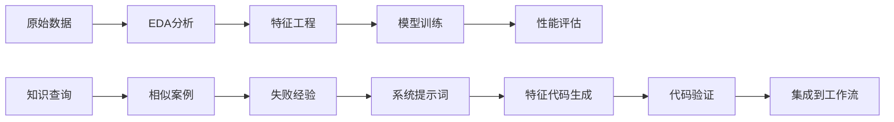

# 模板方法模式在RD-Agent演化框架中的应用

<cite>
**本文档引用的文件**
- [evolving_framework.py](file://rdagent/core/evolving_framework.py)
- [evolving_strategy.py](file://rdagent/components/coder/CoSTEER/evolving_strategy.py)
- [knowledge_management.py](file://rdagent/components/coder/CoSTEER/knowledge_management.py)
- [ensemble/__init__.py](file://rdagent/components/coder/data_science/ensemble/__init__.py)
- [model/__init__.py](file://rdagent/components/coder/data_science/model/__init__.py)
- [feature/__init__.py](file://rdagent/components/coder/data_science/feature/__init__.py)
- [workflow/__init__.py](file://rdagent/components/coder/data_science/workflow/__init__.py)
- [factor_coder/evolving_strategy.py](file://rdagent/components/coder/factor_coder/evolving_strategy.py)
</cite>

## 目录
1. [引言](#引言)
2. [项目结构概述](#项目结构概述)
3. [核心组件分析](#核心组件分析)
4. [架构概览](#架构概览)
5. [详细组件分析](#详细组件分析)
6. [模板方法模式实现](#模板方法模式实现)
7. [多进程演化策略应用](#多进程演化策略应用)
8. [扩展性与灵活性](#扩展性与灵活性)
9. [性能考虑](#性能考虑)
10. [故障排除指南](#故障排除指南)
11. [结论](#结论)

## 引言

RD-Agent演化框架是一个基于人工智能的自动化代码演化系统，采用了经典的模板方法设计模式来实现高度可扩展的演化策略。该框架通过定义算法骨架并延迟具体实现到子类，实现了核心流程的一致性同时提供了灵活的扩展点。

模板方法模式在RD-Agent中主要体现在`EvolvingStrategy`基类及其子类的实现上，特别是`MultiProcessEvolvingStrategy`作为核心的多进程演化策略基类，为不同的代码演化场景提供了统一的执行框架。

## 项目结构概述

RD-Agent演化框架采用分层架构设计，主要包含以下核心模块：

**图表来源**
- [evolving_framework.py](file://rdagent/core/evolving_framework.py#L59-L77)
- [evolving_strategy.py](file://rdagent/components/coder/CoSTEER/evolving_strategy.py#L20-L133)

**章节来源**
- [evolving_framework.py](file://rdagent/core/evolving_framework.py#L1-L128)
- [evolving_strategy.py](file://rdagent/components/coder/CoSTEER/evolving_strategy.py#L1-L135)

## 核心组件分析

### EvolvingStrategy基类

`EvolvingStrategy`是整个演化框架的核心抽象基类，定义了演化算法的基本接口和约束。该类采用泛型设计，支持不同类型的具体演化对象。

### MultiProcessEvolvingStrategy核心实现

`MultiProcessEvolvingStrategy`继承自`EvolvingStrategy`，专门处理多进程环境下的代码演化任务。它定义了两个关键的抽象方法：`implement_one_task`和`assign_code_list_to_evo`，这两个方法构成了模板方法的核心。

### 知识管理系统

知识管理系统负责存储和查询演化过程中的历史知识，包括成功案例、失败经验等，为演化策略提供智能决策支持。

**章节来源**
- [evolving_framework.py](file://rdagent/core/evolving_framework.py#L59-L77)
- [evolving_strategy.py](file://rdagent/components/coder/CoSTEER/evolving_strategy.py#L20-L133)
- [knowledge_management.py](file://rdagent/components/coder/CoSTEER/knowledge_management.py#L45-L101)

## 架构概览

RD-Agent演化框架采用分层架构，通过模板方法模式实现了高度的可扩展性和一致性：

```mermaid
classDiagram
class EvolvingStrategy {
<<abstract>>
+Scenario scen
+evolve(*evo, evolving_trace, queried_knowledge) ASpecificEvolvableSubjects
}
class MultiProcessEvolvingStrategy {
<<abstract>>
+CoSTEERSettings settings
+bool improve_mode
+implement_one_task(target_task, queried_knowledge, workspace, prev_task_feedback) dict[str, str]
+assign_code_list_to_evo(code_list, evo) EvolvingItem
+evolve(evo, queried_knowledge, evolving_trace) EvolvingItem
}
class EnsembleMultiProcessEvolvingStrategy {
+implement_one_task(target_task, queried_knowledge, workspace, prev_task_feedback) dict[str, str]
+assign_code_list_to_evo(code_list, evo) EvolvingItem
}
class ModelMultiProcessEvolvingStrategy {
+implement_one_task(target_task, queried_knowledge, workspace, prev_task_feedback) dict[str, str]
+assign_code_list_to_evo(code_list, evo) EvolvingItem
}
class FeatureMultiProcessEvolvingStrategy {
+implement_one_task(target_task, queried_knowledge, workspace, prev_task_feedback) dict[str, str]
+assign_code_list_to_evo(code_list, evo) EvolvingItem
}
class WorkflowMultiProcessEvolvingStrategy {
+implement_one_task(target_task, queried_knowledge, workspace, prev_task_feedback) dict[str, str]
+assign_code_list_to_evo(code_list, evo) EvolvingItem
}
class FactorMultiProcessEvolvingStrategy {
+implement_one_task(target_task, queried_knowledge, workspace, prev_task_feedback) str
+assign_code_list_to_evo(code_list, evo) EvolvingItem
+error_summary(target_task, queried_former_failed_knowledge_to_render, queried_similar_error_knowledge_to_render) str
}
EvolvingStrategy <|-- MultiProcessEvolvingStrategy
MultiProcessEvolvingStrategy <|-- EnsembleMultiProcessEvolvingStrategy
MultiProcessEvolvingStrategy <|-- ModelMultiProcessEvolvingStrategy
MultiProcessEvolvingStrategy <|-- FeatureMultiProcessEvolvingStrategy
MultiProcessEvolvingStrategy <|-- WorkflowMultiProcessEvolvingStrategy
MultiProcessEvolvingStrategy <|-- FactorMultiProcessEvolvingStrategy
```

**图表来源**
- [evolving_framework.py](file://rdagent/core/evolving_framework.py#L59-L77)
- [evolving_strategy.py](file://rdagent/components/coder/CoSTEER/evolving_strategy.py#L20-L133)
- [ensemble/__init__.py](file://rdagent/components/coder/data_science/ensemble/__init__.py#L37-L164)
- [model/__init__.py](file://rdagent/components/coder/data_science/model/__init__.py#L29-L173)

## 详细组件分析

### EvolvingStrategy基类详解

`EvolvingStrategy`基类定义了演化算法的核心接口，采用抽象方法确保所有子类都必须实现关键功能：

**图表来源**
- [evolving_framework.py](file://rdagent/core/evolving_framework.py#L68-L77)

### MultiProcessEvolvingStrategy核心算法

`MultiProcessEvolvingStrategy`实现了多进程并行演化的核心算法，其`evolve`方法展示了模板方法模式的经典应用：

**图表来源**
- [evolving_strategy.py](file://rdagent/components/coder/CoSTEER/evolving_strategy.py#L78-L133)

**章节来源**
- [evolving_framework.py](file://rdagent/core/evolving_framework.py#L59-L77)
- [evolving_strategy.py](file://rdagent/components/coder/CoSTEER/evolving_strategy.py#L20-L133)

## 模板方法模式实现

### 算法骨架定义

模板方法模式在RD-Agent中通过`MultiProcessEvolvingStrategy.evolve`方法体现，该方法定义了演化算法的整体流程：

1. **初始化阶段**：准备空的代码列表和必要的上下文信息
2. **任务筛选阶段**：根据知识库和历史反馈筛选需要执行的任务
3. **并行执行阶段**：使用多进程并行调用`implement_one_task`方法
4. **结果整合阶段**：通过`assign_code_list_to_evo`方法整合执行结果

### 钩子方法设计

框架定义了两个关键的钩子方法，允许子类定制具体行为：

#### implement_one_task方法

该方法是模板方法模式的核心钩子，负责单个任务的具体实现：

| 参数 | 类型 | 描述 |
|------|------|------|
| target_task | Task | 目标任务对象 |
| queried_knowledge | QueriedKnowledge \| None | 查询的知识信息 |
| workspace | FBWorkspace \| None | 当前工作空间 |
| prev_task_feedback | CoSTEERSingleFeedback \| None | 前一任务的反馈 |

该方法的返回值是一个字典，键为文件名，值为文件内容，支持批量文件更新。

#### assign_code_list_to_evo方法

该方法负责将多个任务的执行结果整合到演化项中：

| 参数 | 类型 | 描述 |
|------|------|------|
| code_list | list[dict[str, str]] | 代码列表，与子任务一一对应 |
| evo | EvolvingItem | 演化项对象 |

**章节来源**
- [evolving_strategy.py](file://rdagent/components/coder/CoSTEER/evolving_strategy.py#L29-L67)
- [evolving_strategy.py](file://rdagent/components/coder/CoSTEER/evolving_strategy.py#L78-L133)

## 多进程演化策略应用

### 具体实现类分析

不同领域的演化策略通过继承`MultiProcessEvolvingStrategy`并实现其抽象方法，形成了专门化的演化策略：

#### Ensemble演化策略

集成策略演化专注于组合多种模型的预测结果：

**图表来源**
- [ensemble/__init__.py](file://rdagent/components/coder/data_science/ensemble/__init__.py#L42-L128)

#### Model演化策略

模型演化策略针对机器学习模型的开发和优化：

| 特性 | 实现方式 | 优势 |
|------|----------|------|
| 批量编辑 | PythonBatchEditOut | 支持多个模型文件的原子性更新 |
| 文件命名规范 | 自动重命名机制 | 确保文件名与任务名称一致 |
| 错误检测 | 重复代码检测 | 避免生成相同的代码版本 |
| Token限制 | 动态截断策略 | 处理长提示词的Token限制 |

#### Feature演化策略

特征工程演化专注于数据预处理和特征提取：

**图表来源**
- [feature/__init__.py](file://rdagent/components/coder/data_science/feature/__init__.py#L27-L120)

#### Factor演化策略

因子演化策略专门用于量化投资中的因子开发：

| 功能特性 | 实现细节 | 技术特点 |
|----------|----------|----------|
| 错误总结 | error_summary方法 | 结构化错误分析 |
| 多版本知识库 | V1/V2版本支持 | 向后兼容性 |
| JSON模式输出 | 强制JSON格式 | 提高解析可靠性 |
| 动态提示词构建 | Token限制适配 | 大规模知识库处理 |

**章节来源**
- [ensemble/__init__.py](file://rdagent/components/coder/data_science/ensemble/__init__.py#L37-L164)
- [model/__init__.py](file://rdagent/components/coder/data_science/model/__init__.py#L29-L173)
- [feature/__init__.py](file://rdagent/components/coder/data_science/feature/__init__.py#L27-L140)
- [factor_coder/evolving_strategy.py](file://rdagent/components/coder/factor_coder/evolving_strategy.py#L10-L173)

## 扩展性与灵活性

### 策略扩展机制

模板方法模式为RD-Agent提供了强大的扩展能力：

1. **领域特定策略**：每个领域（集成、模型、特征、工作流、因子）都有专门的演化策略
2. **知识库版本管理**：支持V1和V2知识库版本，确保向后兼容
3. **改进模式**：支持仅对失败任务进行改进的优化模式
4. **并行处理**：内置多进程并行支持，提高演化效率

### 配置驱动的灵活性

框架通过配置文件和设置参数提供灵活的定制选项：

| 配置项 | 类型 | 默认值 | 作用 |
|--------|------|--------|------|
| multi_proc_n | int | 系统CPU核数 | 控制并行进程数量 |
| improve_mode | bool | False | 是否启用改进模式 |
| fail_task_trial_limit | int | 5 | 失败任务重试次数 |
| v1_query_former_trace_limit | int | 3 | V1版本历史查询限制 |

**章节来源**
- [knowledge_management.py](file://rdagent/components/coder/CoSTEER/knowledge_management.py#L45-L101)

## 性能考虑

### 并行执行优化

多进程演化策略通过以下机制优化性能：

1. **任务并行化**：不同任务可以并行执行，充分利用多核CPU
2. **动态负载均衡**：根据任务复杂度动态分配资源
3. **内存管理**：每个进程独立的工作空间，避免共享状态问题
4. **缓存机制**：知识库和API调用结果的智能缓存

### 内存和计算优化

| 优化策略 | 实现方式 | 效果 |
|----------|----------|------|
| 分页加载 | 知识库分批加载 | 减少内存占用 |
| 进程池管理 | 动态调整进程数量 | 避免资源浪费 |
| Token限制 | 提示词长度控制 | 防止API调用失败 |
| 结果缓存 | 成功案例缓存 | 避免重复计算 |

## 故障排除指南

### 常见问题及解决方案

#### 多进程执行失败

**问题描述**：多进程执行过程中出现进程崩溃或死锁

**解决方案**：
1. 检查系统资源是否充足
2. 调整`multi_proc_n`参数
3. 启用日志记录进行调试
4. 使用单进程模式进行问题定位

#### 知识库查询超时

**问题描述**：大规模知识库查询导致性能下降

**解决方案**：
1. 优化知识库索引结构
2. 调整查询限制参数
3. 启用知识库分片加载
4. 使用增量更新机制

#### 代码生成质量不稳定

**问题描述**：生成的代码质量波动较大

**解决方案**：
1. 增加相似成功案例的数量
2. 优化提示词模板
3. 启用多次尝试机制
4. 加强代码验证规则

**章节来源**
- [evolving_strategy.py](file://rdagent/components/coder/CoSTEER/evolving_strategy.py#L78-L133)

## 结论

RD-Agent演化框架通过模板方法模式实现了高度可扩展的代码演化系统。该框架的核心优势包括：

1. **一致性保证**：通过模板方法确保所有演化策略遵循相同的核心流程
2. **高度可扩展**：通过抽象方法和钩子函数支持领域特定的定制
3. **并行优化**：内置多进程支持，显著提升演化效率
4. **智能决策**：基于知识库的历史经验和失败案例进行智能指导
5. **容错机制**：完善的错误处理和重试机制确保系统稳定性

模板方法模式的应用使得RD-Agent能够在保持核心算法一致性的同时，为不同的代码演化场景提供专门化的解决方案，这种设计哲学体现了软件架构中"开闭原则"的最佳实践。