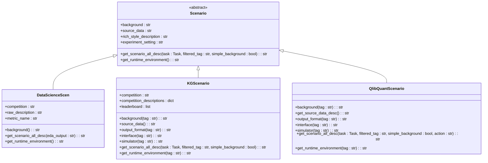

# 策略模式

<cite>
**本文档中引用的文件**   
- [scenario.py](file://rdagent/core/scenario.py)
- [data_science\scen\__init__.py](file://rdagent/scenarios/data_science/scen/__init__.py)
- [kaggle\experiment\scenario.py](file://rdagent/scenarios/kaggle/experiment/scenario.py)
- [qlib\experiment\quant_experiment.py](file://rdagent/scenarios/qlib/experiment/quant_experiment.py)
- [loop.py](file://rdagent/app/data_science/loop.py)
- [kaggle\loop.py](file://rdagent/app/kaggle/loop.py)
</cite>

## 目录
1. [引言](#引言)
2. [策略模式架构设计](#策略模式架构设计)
3. [核心组件分析](#核心组件分析)
4. [具体场景实现](#具体场景实现)
5. [客户端调用机制](#客户端调用机制)
6. [扩展性与解耦分析](#扩展性与解耦分析)
7. [结论](#结论)

## 引言
RD-Agent系统通过策略模式实现了不同应用场景的行为多态性，支持数据科学、Kaggle竞赛和量化金融等领域的自动化研发。该模式通过Scenario接口定义统一的行为契约，使系统能够以一致的方式处理不同领域的实验生成、代码开发和执行逻辑。

**Section sources**
- [scenario.py](file://rdagent/core/scenario.py#L1-L65)

## 策略模式架构设计



**Diagram sources**
- [scenario.py](file://rdagent/core/scenario.py#L1-L65)
- [data_science\scen\__init__.py](file://rdagent/scenarios/data_science/scen/__init__.py#L1-L290)
- [kaggle\experiment\scenario.py](file://rdagent/scenarios/kaggle/experiment/scenario.py#L1-L282)
- [qlib\experiment\quant_experiment.py](file://rdagent/scenarios/qlib/experiment/quant_experiment.py#L1-L203)

## 核心组件分析

### Scenario抽象基类
Scenario类作为策略模式的核心，定义了所有场景必须实现的接口，包括背景信息、源数据描述、富文本描述和场景完整描述等属性和方法。通过抽象基类的设计，确保了所有具体场景实现的一致性。

**Section sources**
- [scenario.py](file://rdagent/core/scenario.py#L1-L65)

### 行为多态性实现
系统通过继承Scenario基类实现不同应用场景的行为多态性。每个具体场景类根据其领域特性实现相应的方法，如背景信息生成、运行时环境获取和场景描述构建等，从而支持不同领域的特定需求。

## 具体场景实现

### 数据科学场景实现
DataScienceScen类实现了数据科学领域的特定逻辑，包括竞赛描述分析、数据文件夹描述获取和运行时环境信息获取等功能。该实现针对数据科学竞赛的特点，提供了详细的背景信息和评估指标描述。

**Section sources**
- [data_science\scen\__init__.py](file://rdagent/scenarios/data_science/scen/__init__.py#L1-L290)

### Kaggle竞赛场景实现
KGScenario类专门处理Kaggle竞赛场景，实现了竞赛描述爬取、排行榜分数获取和特征工程等功能。该实现通过UCB算法进行动作选择，并支持向量检索增强生成（RAG）技术。

**Section sources**
- [kaggle\experiment\scenario.py](file://rdagent/scenarios/kaggle/experiment/scenario.py#L1-L282)

### 量化金融场景实现
QlibQuantScenario类针对量化金融领域实现了因子和模型研发的特定逻辑。该实现支持因子实验和模型实验，并提供了相应的运行时环境信息。

**Section sources**
- [qlib\experiment\quant_experiment.py](file://rdagent/scenarios/qlib/experiment/quant_experiment.py#L1-L203)

## 客户端调用机制

```mermaid
sequenceDiagram
participant Client as "客户端"
participant Loop as "RDLoop"
participant Scenario as "Scenario"
participant HypothesisGen as "HypothesisGen"
Client->>Loop : 启动研发循环
Loop->>Scenario : 获取场景实例
Loop->>HypothesisGen : 初始化假设生成器
HypothesisGen->>Scenario : 获取场景描述
Scenario-->>HypothesisGen : 返回场景信息
HypothesisGen->>HypothesisGen : 生成假设
HypothesisGen-->>Loop : 返回假设
Loop->>Loop : 执行代码开发
Loop->>Loop : 运行实验
Loop->>Loop : 获取反馈
Loop->>Loop : 更新知识库
```

**Diagram sources**
- [loop.py](file://rdagent/app/data_science/loop.py#L1-L81)
- [kaggle\loop.py](file://rdagent/app/kaggle/loop.py#L1-L140)

## 扩展性与解耦分析
策略模式的实现使得RD-Agent系统具有良好的扩展性和解耦性。新场景的添加仅需继承Scenario基类并实现相应方法即可，无需修改现有代码。这种设计遵循开闭原则，支持系统的持续演进和功能扩展。

**Section sources**
- [scenario.py](file://rdagent/core/scenario.py#L1-L65)
- [data_science\scen\__init__.py](file://rdagent/scenarios/data_science/scen/__init__.py#L1-L290)

## 结论
RD-Agent通过策略模式成功实现了不同应用场景的行为多态性，支持数据科学、Kaggle竞赛和量化金融等领域的自动化研发。该模式通过统一接口抽象不同领域的特异性，提高了系统的可维护性和扩展性，为新场景的无缝集成提供了坚实的基础。