# 观察者模式在RD-Agent反馈闭环中的实现机制

<cite>
**本文档引用的文件**
- [evolving_framework.py](file://rdagent/core/evolving_framework.py)
- [evaluation.py](file://rdagent/core/evaluation.py)
- [evolving_agent.py](file://rdagent/core/evolving_agent.py)
- [CoSTEER/__init__.py](file://rdagent/components/coder/CoSTEER/__init__.py)
- [runner/__init__.py](file://rdagent/scenarios/data_science/dev/runner/__init__.py)
- [runner/eval.py](file://rdagent/scenarios/data_science/dev/runner/eval.py)
- [knowledge_management.py](file://rdagent/components/coder/CoSTEER/knowledge_management.py)
- [evolving_strategy.py](file://rdagent/components/coder/CoSTEER/evolving_strategy.py)
- [evaluators.py](file://rdagent/components/coder/CoSTEER/evaluators.py)
</cite>

## 目录
1. [引言](#引言)
2. [系统架构概览](#系统架构概览)
3. [核心组件分析](#核心组件分析)
4. [观察者模式实现机制](#观察者模式实现机制)
5. [实验执行到评估的完整流程](#实验执行到评估的完整流程)
6. [知识库更新机制](#知识库更新机制)
7. [解耦设计与可扩展性](#解耦设计与可扩展性)
8. [实际调用链路分析](#实际调用链路分析)
9. [总结](#总结)

## 引言

RD-Agent采用观察者模式构建了一个高度解耦的反馈闭环系统，实现了实验执行、结果评估和知识更新的自动化循环。该系统通过EvoStep和Feedback类的交互，使Runner作为被观察者能够通知Evaluator（观察者）进行结果评估，并将反馈注入后续演化循环，从而实现执行、评估与知识更新的分离，提升系统的响应性和可扩展性。

## 系统架构概览

RD-Agent的反馈闭环系统基于观察者模式设计，主要包含以下核心层次：

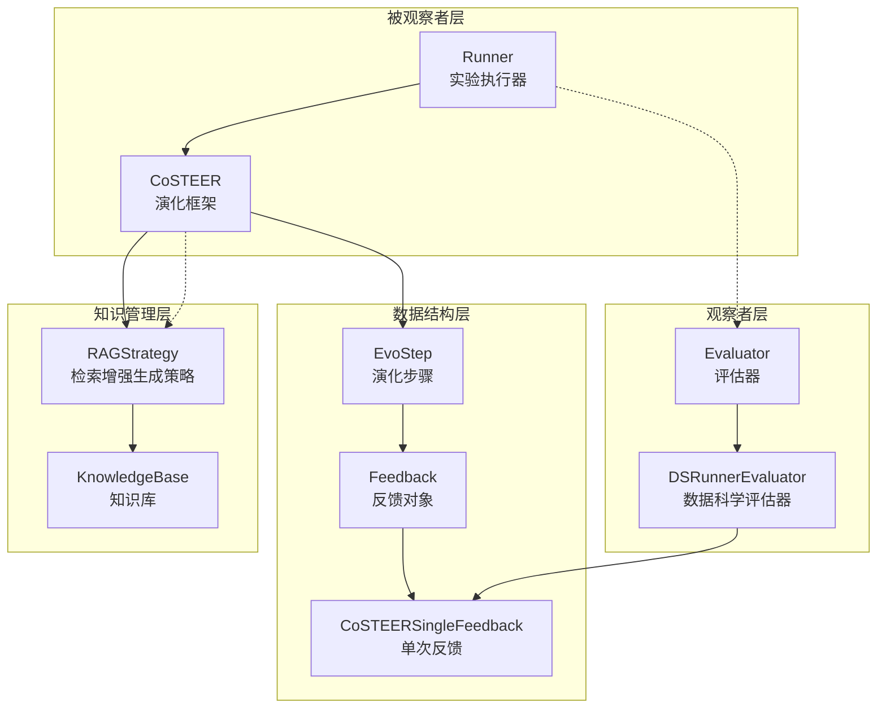

**图表来源**
- [evolving_framework.py](file://rdagent/core/evolving_framework.py#L42-L56)
- [evaluation.py](file://rdagent/core/evaluation.py#L7-L29)
- [CoSTEER/__init__.py](file://rdagent/components/coder/CoSTEER/__init__.py#L17-L36)

## 核心组件分析

### EvoStep：演化步骤容器

EvoStep是观察者模式的核心数据结构，它封装了演化过程中的关键信息：

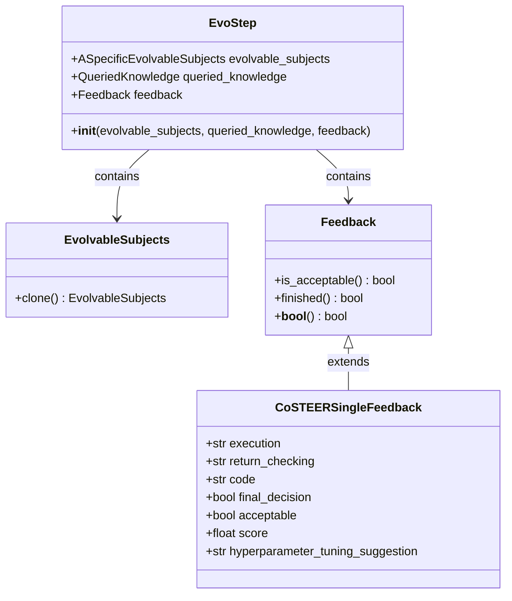

**图表来源**
- [evolving_framework.py](file://rdagent/core/evolving_framework.py#L42-L56)
- [evaluation.py](file://rdagent/core/evaluation.py#L7-L29)

**章节来源**
- [evolving_framework.py](file://rdagent/core/evolving_framework.py#L42-L56)
- [evaluation.py](file://rdagent/core/evaluation.py#L7-L29)

### Evaluator：评估器接口

Evaluator定义了评估器的基本接口，采用抽象基类模式确保所有评估器都遵循统一的评估规范：

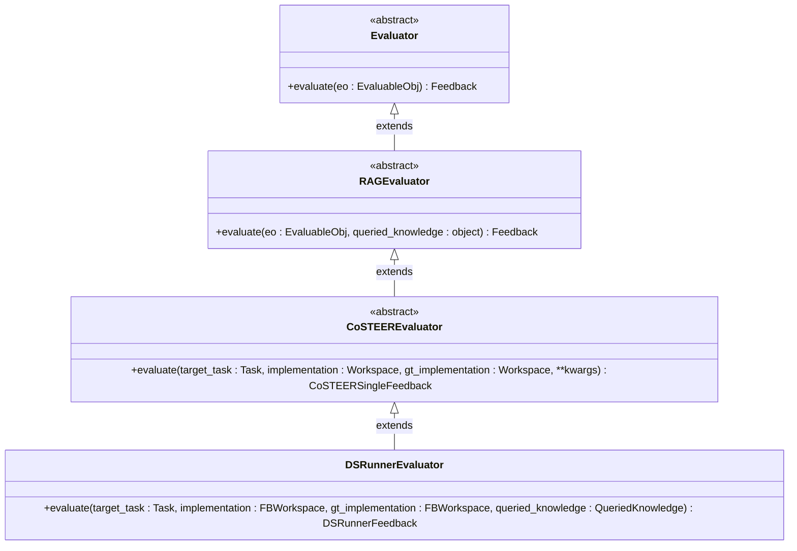

**图表来源**
- [evaluation.py](file://rdagent/core/evaluation.py#L41-L56)
- [runner/eval.py](file://rdagent/scenarios/data_science/dev/runner/eval.py#L67-L75)

**章节来源**
- [evaluation.py](file://rdagent/core/evaluation.py#L41-L56)
- [runner/eval.py](file://rdagent/scenarios/data_science/dev/runner/eval.py#L67-L75)

## 观察者模式实现机制

### 被观察者：Runner的通知机制

Runner作为被观察者，在实验执行完成后会触发评估流程。其核心机制体现在RAGEvoAgent的multistep_evolve方法中：

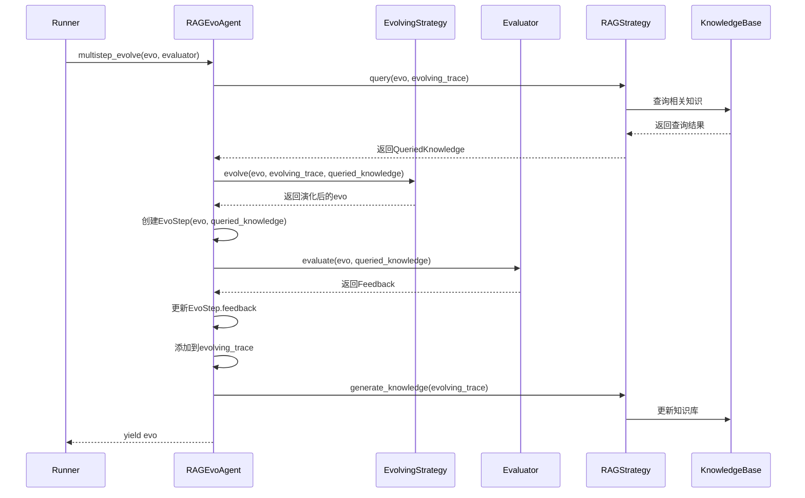

**图表来源**
- [evolving_agent.py](file://rdagent/core/evolving_agent.py#L69-L114)
- [CoSTEER/__init__.py](file://rdagent/components/coder/CoSTEER/__init__.py#L85-L130)

### 观察者：Evaluator的评估响应

Evaluator作为观察者，在接收到Runner的通知后执行评估逻辑。以DSRunnerEvaluator为例，其评估流程包括：

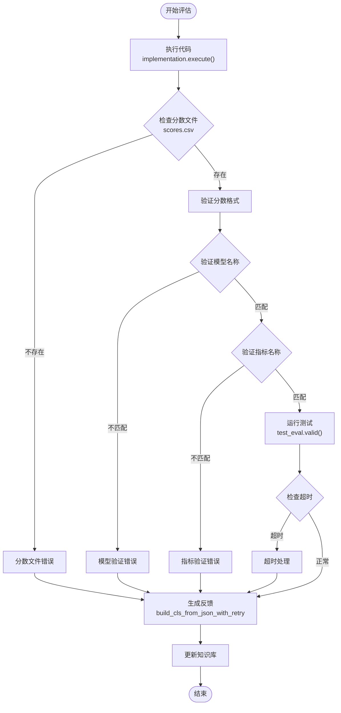

**图表来源**
- [runner/eval.py](file://rdagent/scenarios/data_science/dev/runner/eval.py#L75-L276)

**章节来源**
- [evolving_agent.py](file://rdagent/core/evolving_agent.py#L69-L114)
- [runner/eval.py](file://rdagent/scenarios/data_science/dev/runner/eval.py#L75-L276)

## 实验执行到评估的完整流程

### 数据科学场景的完整闭环

在数据科学场景中，从实验执行到评估的完整流程展现了观察者模式的典型应用：

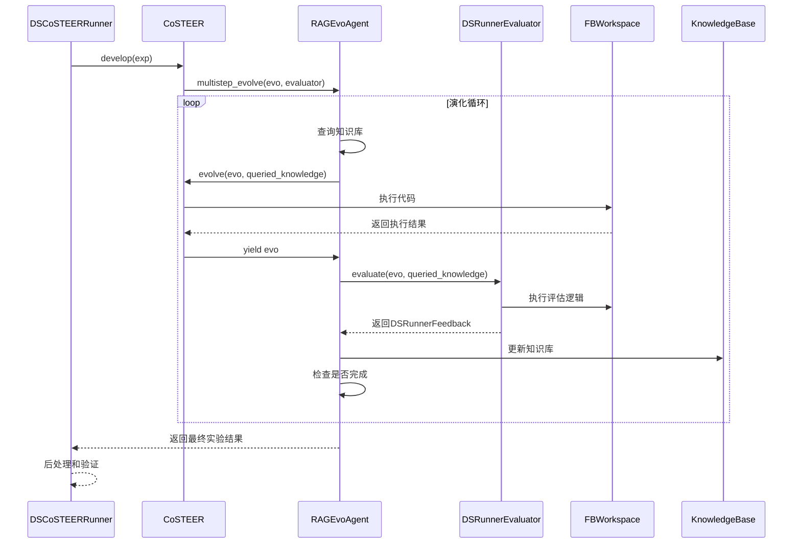

**图表来源**
- [runner/__init__.py](file://rdagent/scenarios/data_science/dev/runner/__init__.py#L134-L225)
- [CoSTEER/__init__.py](file://rdagent/components/coder/CoSTEER/__init__.py#L85-L130)

### 多进程并行评估机制

系统支持多进程并行评估以提高效率：

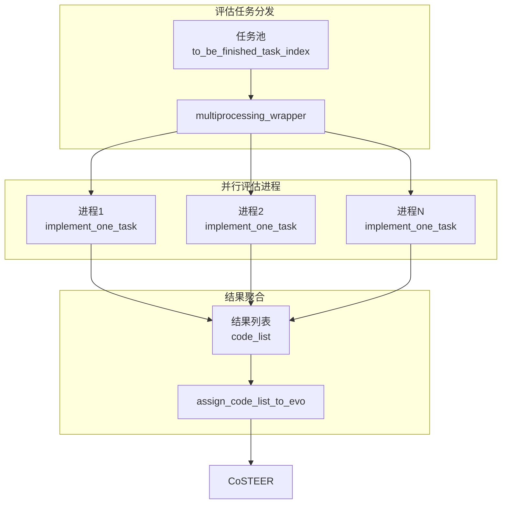

**图表来源**
- [evolving_strategy.py](file://rdagent/components/coder/CoSTEER/evolving_strategy.py#L95-L134)

**章节来源**
- [runner/__init__.py](file://rdagent/scenarios/data_science/dev/runner/__init__.py#L134-L225)
- [CoSTEER/__init__.py](file://rdagent/components/coder/CoSTEER/__init__.py#L85-L130)
- [evolving_strategy.py](file://rdagent/components/coder/CoSTEER/evolving_strategy.py#L95-L134)

## 知识库更新机制

### RAG策略的知识管理

RAGStrategy负责知识的检索、生成和存储，实现了知识的自我演化：

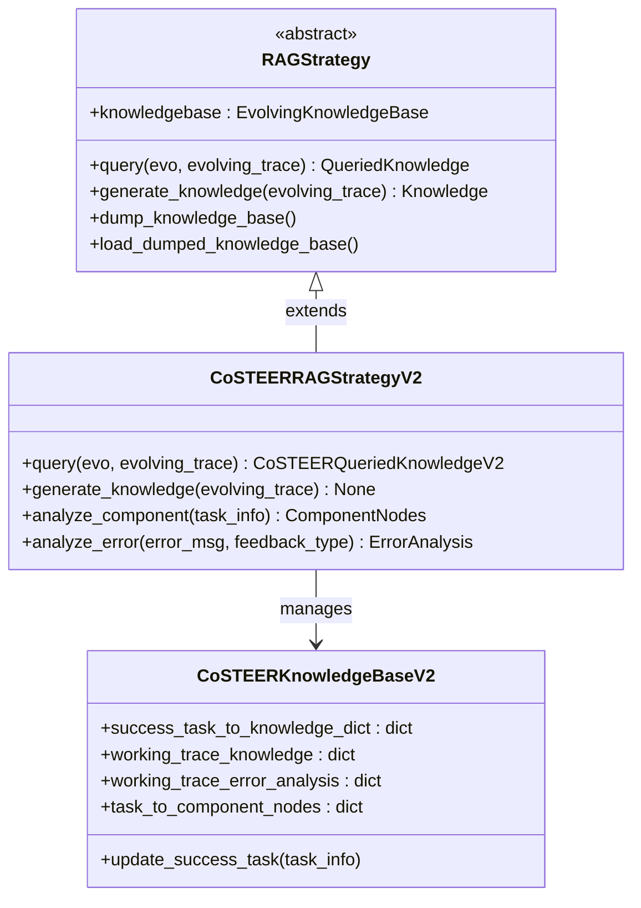

**图表来源**
- [evolving_framework.py](file://rdagent/core/evolving_framework.py#L95-L127)
- [knowledge_management.py](file://rdagent/components/coder/CoSTEER/knowledge_management.py#L269-L338)

### 知识更新的具体流程

知识库的更新遵循以下流程：

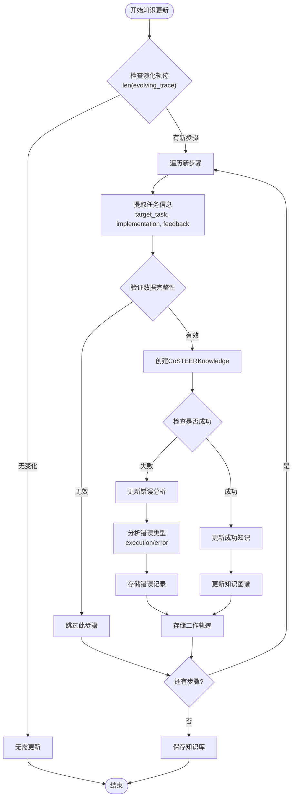

**图表来源**
- [knowledge_management.py](file://rdagent/components/coder/CoSTEER/knowledge_management.py#L269-L338)

**章节来源**
- [evolving_framework.py](file://rdagent/core/evolving_framework.py#L95-L127)
- [knowledge_management.py](file://rdagent/components/coder/CoSTEER/knowledge_management.py#L269-L338)

## 解耦设计与可扩展性

### 架构解耦的优势

观察者模式在RD-Agent中实现了以下解耦：

1. **执行与评估解耦**：Runner负责实验执行，Evaluator负责结果评估，两者独立演进
2. **不同评估器解耦**：支持多种评估器并存，如DSRunnerEvaluator、MypyEvaluator等
3. **知识管理解耦**：RAG策略独立于具体的应用场景，支持知识的跨领域迁移

### 可扩展性设计

系统通过以下方式支持扩展：

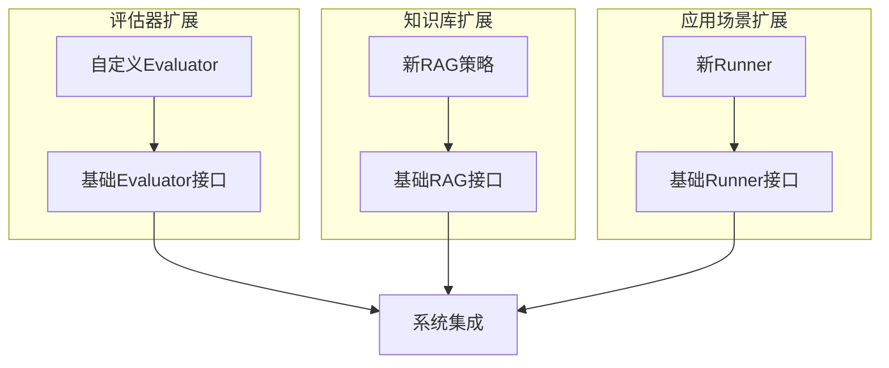

**章节来源**
- [evaluation.py](file://rdagent/core/evaluation.py#L41-L56)
- [evolving_framework.py](file://rdagent/core/evolving_framework.py#L95-L127)

## 实际调用链路分析

### 完整的调用序列

以下是观察者模式在RD-Agent中的实际调用链路：

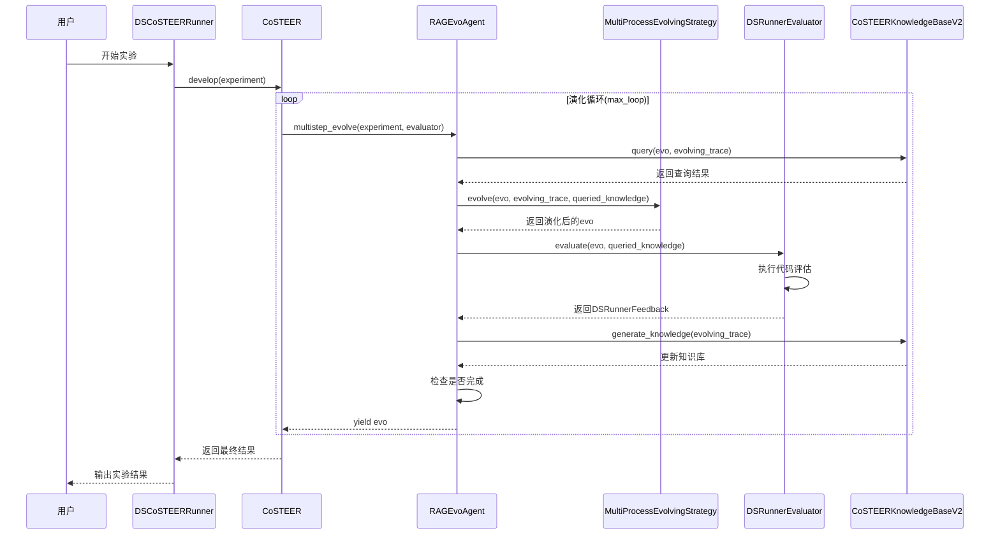

**图表来源**
- [runner/__init__.py](file://rdagent/scenarios/data_science/dev/runner/__init__.py#L134-L225)
- [CoSTEER/__init__.py](file://rdagent/components/coder/CoSTEER/__init__.py#L85-L130)
- [evolving_agent.py](file://rdagent/core/evolving_agent.py#L69-L114)

### 关键方法调用路径

系统中关键方法的调用路径如下：

| 方法名 | 调用层级 | 功能描述 |
|--------|----------|----------|
| `multistep_evolve` | RAGEvoAgent | 主要演化循环，控制整个评估流程 |
| `evaluate` | DSRunnerEvaluator | 具体的评估逻辑实现 |
| `evolve` | MultiProcessEvolvingStrategy | 代码实现和优化策略 |
| `query` | CoSTEERRAGStrategyV2 | 知识检索和查询 |
| `generate_knowledge` | CoSTEERRAGStrategyV2 | 知识生成和更新 |

**章节来源**
- [runner/__init__.py](file://rdagent/scenarios/data_science/dev/runner/__init__.py#L134-L225)
- [CoSTEER/__init__.py](file://rdagent/components/coder/CoSTEER/__init__.py#L85-L130)
- [evolving_agent.py](file://rdagent/core/evolving_agent.py#L69-L114)

## 总结

RD-Agent通过观察者模式构建了一个高度解耦且可扩展的反馈闭环系统。该系统的核心优势包括：

1. **清晰的职责分离**：Runner专注于实验执行，Evaluator专注于结果评估，RAG策略专注于知识管理
2. **高度的模块化**：每个组件都可以独立开发、测试和部署
3. **良好的可扩展性**：支持新的评估器、知识库策略和应用场景的快速集成
4. **高效的并行处理**：支持多进程并行评估，显著提升系统性能

这种设计不仅提高了系统的稳定性和可维护性，还为未来的功能扩展奠定了坚实的基础。观察者模式的成功应用使得RD-Agent能够在复杂的实验环境中保持高效、稳定的运行，同时为用户提供持续的学习和改进能力。