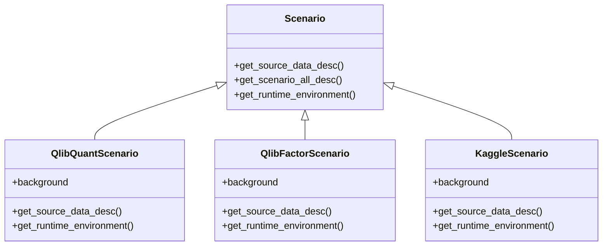
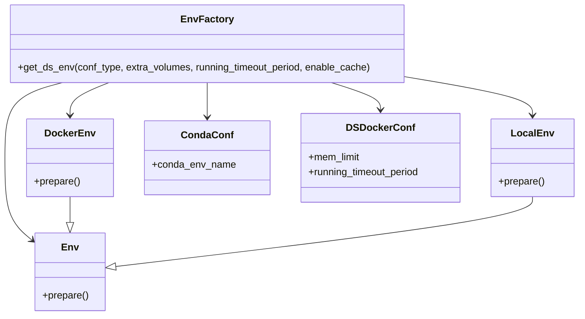
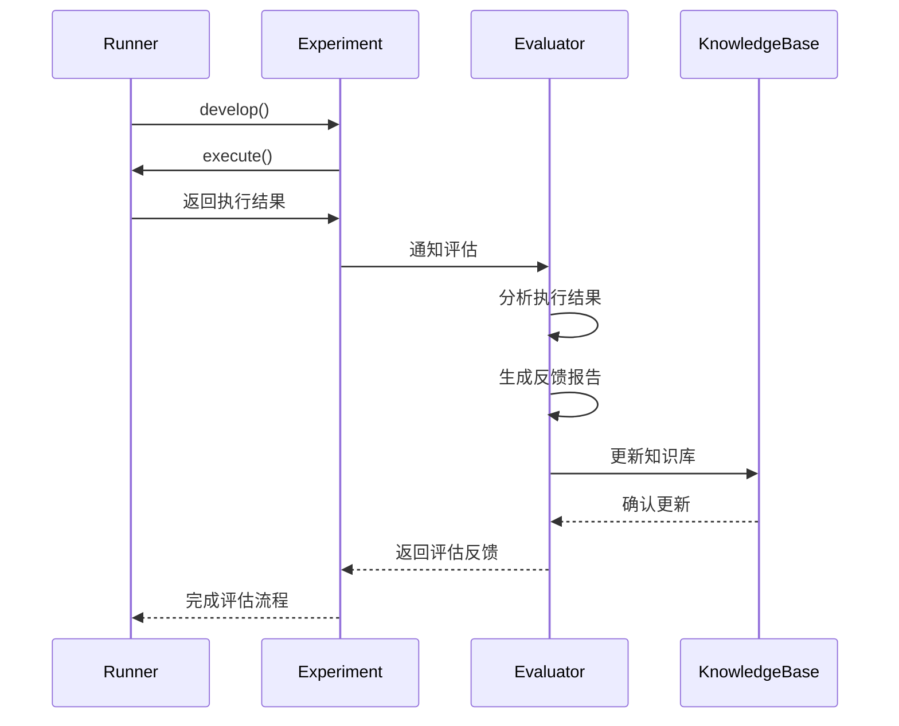
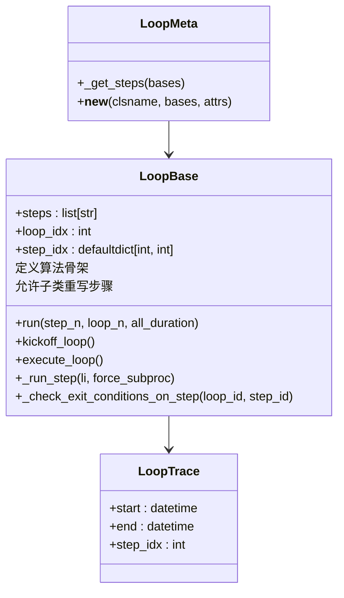

# 设计模式应用

<cite>
**本文档引用的文件**
- [scen.py](file://rdagent\app\finetune\data_science\scen.py)
- [scen.py](file://rdagent\app\finetune\llm\scen.py)
- [loop.py](file://rdagent\utils\workflow\loop.py)
- [conf.py](file://rdagent\components\coder\data_science\conf.py)
- [__init__.py](file://rdagent\components\runner\__init__.py)
- [evaluation.py](file://rdagent\core\evaluation.py)
</cite>

## 目录
1. [引言](#引言)
2. [策略模式在场景差异化中的应用](#策略模式在场景差异化中的应用)
3. [工厂模式在组件实例化中的应用](#工厂模式在组件实例化中的应用)
4. [观察者模式在实验反馈系统中的体现](#观察者模式在实验反馈系统中的体现)
5. [模板方法模式在LoopBase中的实现](#模板方法模式在loopbase中的实现)
6. [设计模式对系统可扩展性与可维护性的影响](#设计模式对系统可扩展性与可维护性的影响)
7. [结论](#结论)

## 引言
RD-Agent系统通过多种设计模式的组合应用，实现了高度灵活和可扩展的自动化研发框架。本文档将深入分析系统中关键设计模式的实现与应用，包括策略模式、工厂模式、观察者模式和模板方法模式。这些模式共同构建了一个能够适应不同场景（如data_science、kaggle、qlib）的智能系统，通过多态调度、动态实例化、事件通知和流程定制等机制，提升了系统的可维护性和可扩展性。

## 策略模式在场景差异化中的应用
策略模式在RD-Agent中通过`scen.py`文件中的具体实现，支持了不同场景（如data_science、kaggle、qlib）的差异化行为。系统通过定义统一的接口，允许在运行时根据具体场景选择不同的算法或行为实现。

在`scen.py`中，不同场景的类继承自共同的基类，并重写特定方法以提供场景特定的行为。例如，`QlibQuantScenario`和`QlibFactorScenario`等类通过重写`background`、`get_source_data_desc`等方法，为量化投资和因子研究等不同场景提供了定制化的背景描述和数据源信息。这种多态调度机制使得系统能够无缝切换不同场景的实现，而无需修改调用代码。

**图示来源**
- [scen.py](file://rdagent\app\finetune\llm\scen.py)

**本节来源**
- [scen.py](file://rdagent\app\finetune\llm\scen.py)

## 工厂模式在组件实例化中的应用
工厂模式在RD-Agent中用于Coder和Runner组件的实例化过程，通过配置动态创建对应组件。系统利用配置文件和环境变量来决定实例化的具体类型和参数，实现了组件创建的解耦。

在`conf.py`文件中，通过定义`DSCoderCoSTEERSettings`类和`get_ds_env`函数，系统可以根据配置动态创建不同类型的环境实例。`get_ds_env`函数根据`env_type`配置参数（如"docker"或"conda"）返回相应的环境对象，这种工厂方法模式使得系统能够灵活地在不同执行环境之间切换。

**图示来源**
- [conf.py](file://rdagent\components\coder\data_science\conf.py)

**本节来源**
- [conf.py](file://rdagent\components\coder\data_science\conf.py)

## 观察者模式在实验反馈系统中的体现
观察者模式在RD-Agent的实验反馈系统中得到了充分体现，实现了Runner执行完成后通知Evaluator进行评估并触发知识更新的机制。系统通过事件驱动的方式，将实验执行与结果评估解耦。

在系统架构中，当Runner完成实验执行后，会生成实验结果并触发反馈事件。Evaluator作为观察者订阅这些事件，一旦接收到结果，立即进行评估分析。评估结果不仅包含对当前实现的反馈，还可能触发知识库的更新，形成闭环的学习系统。

**图示来源**
- [evaluation.py](file://rdagent\core\evaluation.py)
- [__init__.py](file://rdagent\components\runner\__init__.py)

**本节来源**
- [evaluation.py](file://rdagent\core\evaluation.py)
- [__init__.py](file://rdagent\components\runner\__init__.py)

## 模板方法模式在LoopBase中的实现
模板方法模式在`LoopBase`类中得到了完整实现，通过定义算法骨架并允许子类重写特定步骤来支持定制化流程。`LoopBase`类定义了工作流执行的基本结构，包括步骤管理、进度控制和异常处理等核心功能。

在`loop.py`文件中，`LoopBase`类通过`steps`列表定义了工作流的执行步骤序列，并提供了`run`、`kickoff_loop`和`execute_loop`等方法来控制整个流程的执行。子类可以通过重写特定步骤方法来定制行为，同时保持整体流程的一致性。钩子方法如`_check_exit_conditions_on_step`允许在关键执行点插入自定义逻辑。

**图示来源**
- [loop.py](file://rdagent\utils\workflow\loop.py)

**本节来源**
- [loop.py](file://rdagent\utils\workflow\loop.py)

## 设计模式对系统可扩展性与可维护性的影响
RD-Agent中设计模式的综合应用显著提升了系统的可扩展性和可维护性。策略模式通过多态机制支持了场景的灵活扩展，新场景的添加只需实现相应的策略类而无需修改现有代码。工厂模式将对象创建与使用分离，使得组件配置和实例化更加灵活，便于系统适应不同的运行环境。

观察者模式实现了组件间的松耦合，Runner和Evaluator可以独立演化，只要保持事件接口的兼容性。模板方法模式提供了稳定的算法框架，同时允许通过钩子方法进行定制，平衡了标准化与灵活性的需求。

这些设计模式的协同作用使得RD-Agent能够快速适应新的应用场景，如从数据科学竞赛到量化投资研究的扩展，同时保持了代码的清晰结构和高内聚低耦合的特性，大大降低了系统的维护成本。

## 结论
RD-Agent通过策略模式、工厂模式、观察者模式和模板方法模式的有机结合，构建了一个高度灵活、可扩展且易于维护的自动化研发系统。这些设计模式不仅解决了特定的技术问题，更重要的是为系统的长期演进提供了坚实的基础架构。未来，可以进一步探索这些模式的组合应用，如在工厂模式中集成策略选择，或在观察者模式中应用责任链模式，以应对更加复杂的场景需求。