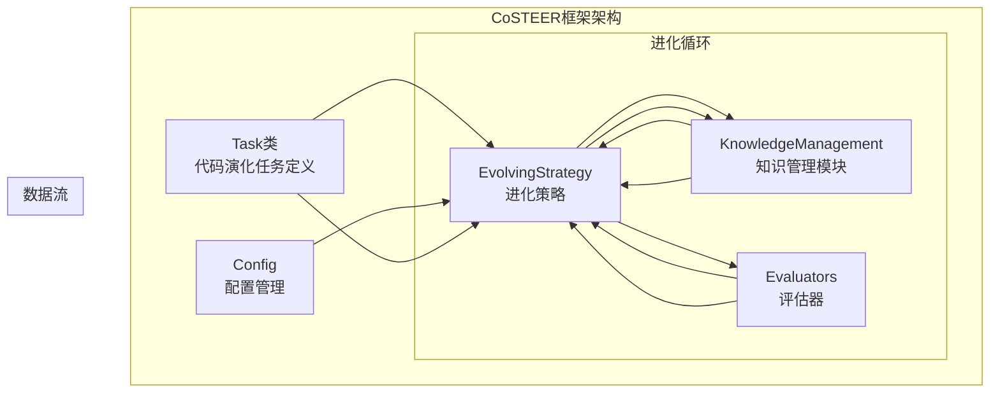
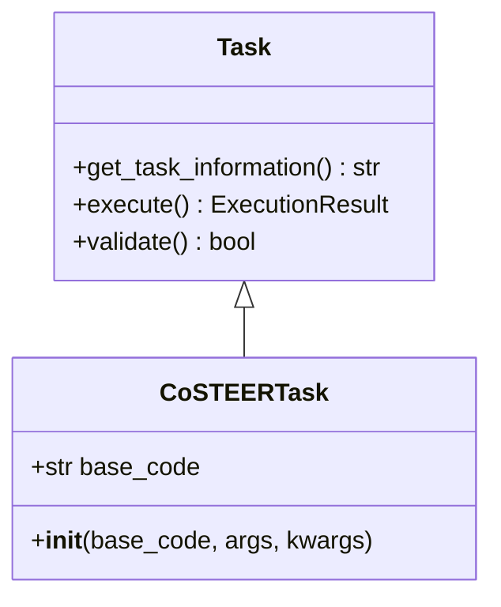
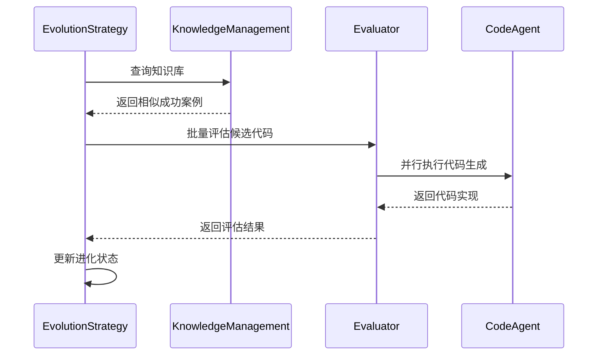
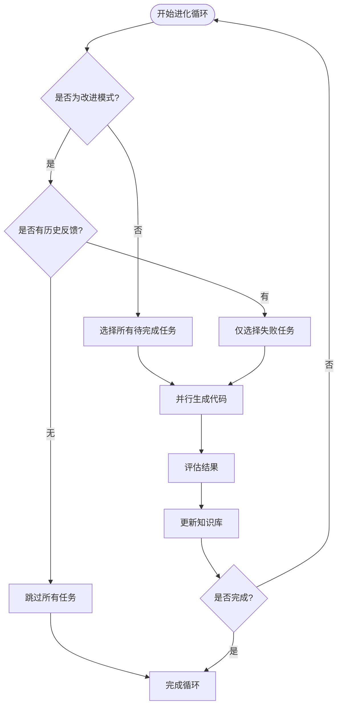
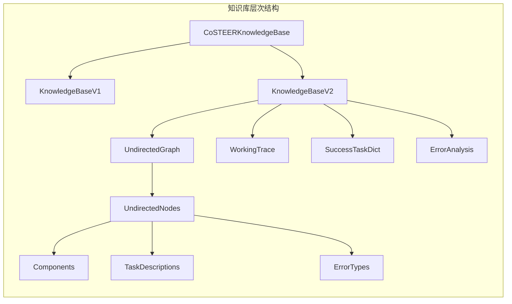
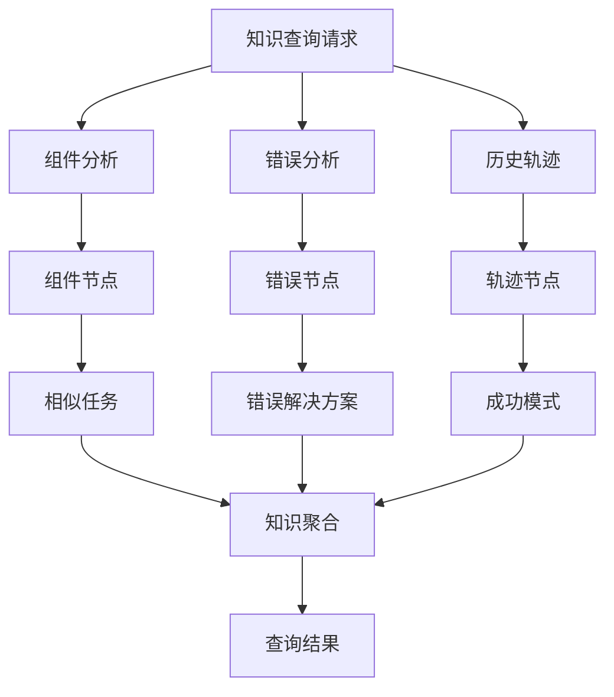
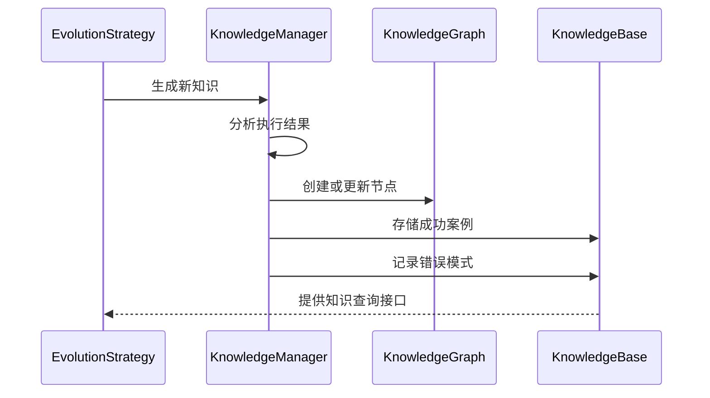
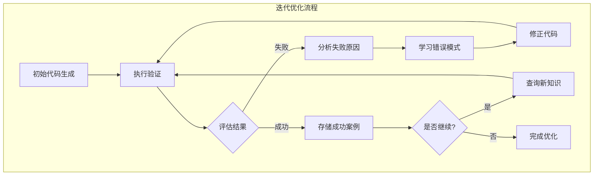
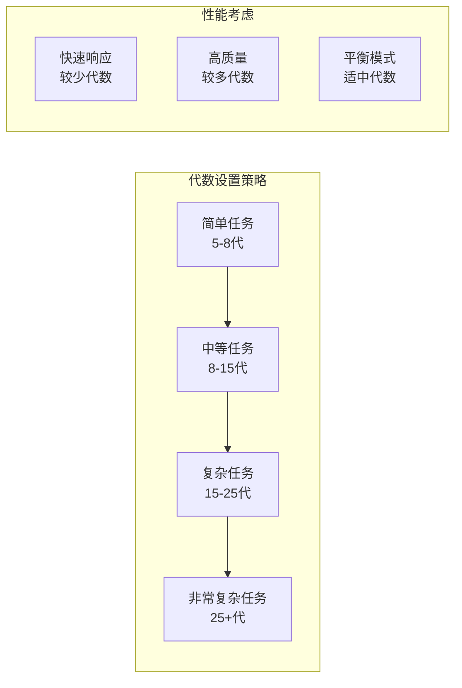

# CoSTEER框架代码生成与优化流程详解

<cite>
**本文档引用的文件**
- [task.py](file://rdagent/components/coder/CoSTEER/task.py)
- [evolving_strategy.py](file://rdagent/components/coder/CoSTEER/evolving_strategy.py)
- [knowledge_management.py](file://rdagent/components/coder/CoSTEER/knowledge_management.py)
- [evolvable_subjects.py](file://rdagent/components/coder/CoSTEER/evolvable_subjects.py)
- [evaluators.py](file://rdagent/components/coder/CoSTEER/evaluators.py)
- [config.py](file://rdagent/components/coder/CoSTEER/config.py)
- [prompts.yaml](file://rdagent/components/coder/CoSTEER/prompts.yaml)
- [ds_costeer.py](file://rdagent/components/coder/data_science/share/ds_costeer.py)
- [conf.py](file://rdagent/components/coder/data_science/conf.py)
</cite>

## 目录
1. [引言](#引言)
2. [系统架构概览](#系统架构概览)
3. [Task类：代码演化任务定义](#task类代码演化任务定义)
4. [进化策略：变异与交叉算法](#进化策略变异与交叉算法)
5. [知识管理模块：历史模式指导](#知识管理模块历史模式指导)
6. [完整迭代过程案例分析](#完整迭代过程案例分析)
7. [性能调优指南](#性能调优指南)
8. [故障排除与调试](#故障排除与调试)
9. [总结](#总结)

## 引言

CoSTEER（Code STEERING）是一个基于进化计算的代码生成与优化框架，通过模拟自然选择过程来自动改进代码质量。该框架采用知识驱动的方法，结合历史成功模式和智能搜索策略，实现从初始代码草案到优化版本的完整迭代过程。

## 系统架构概览

CoSTEER框架采用分层架构设计，包含以下核心组件：



**图表来源**
- [task.py](file://rdagent/components/coder/CoSTEER/task.py#L1-L10)
- [evolving_strategy.py](file://rdagent/components/coder/CoSTEER/evolving_strategy.py#L1-L50)
- [knowledge_management.py](file://rdagent/components/coder/CoSTEER/knowledge_management.py#L1-L50)

**章节来源**
- [task.py](file://rdagent/components/coder/CoSTEER/task.py#L1-L10)
- [evolving_strategy.py](file://rdagent/components/coder/CoSTEER/evolving_strategy.py#L1-L135)
- [knowledge_management.py](file://rdagent/components/coder/CoSTEER/knowledge_management.py#L1-L100)

## Task类：代码演化任务定义

Task类是CoSTEER框架的核心抽象，负责定义代码演化的基本单位和执行环境。

### 核心特性

Task类继承自基础Task类，扩展了代码演化所需的特定功能：



**图表来源**
- [task.py](file://rdagent/components/coder/CoSTEER/task.py#L4-L10)

### 任务信息提取

每个Task实例都包含任务描述信息，这些信息用于：
- 知识库查询匹配
- 进化策略决策
- 成功模式检索

**章节来源**
- [task.py](file://rdagent/components/coder/CoSTEER/task.py#L1-L10)

## 进化策略：变异与交叉算法

进化策略是CoSTEER框架的核心算法，实现了基于知识的智能代码生成和优化。

### 多进程进化策略



**图表来源**
- [evolving_strategy.py](file://rdagent/components/coder/CoSTEER/evolving_strategy.py#L40-L135)

### 进化算法流程

进化策略包含以下关键步骤：

1. **任务筛选**：根据知识库确定需要重新实现的任务
2. **知识查询**：检索相似成功案例和失败模式
3. **并行生成**：多进程并行生成候选代码
4. **评估反馈**：收集执行结果和性能指标
5. **状态更新**：更新知识库和进化轨迹

### 改进模式机制

框架支持改进模式（improve_mode），只对之前失败的任务进行重新尝试：



**图表来源**
- [evolving_strategy.py](file://rdagent/components/coder/CoSTEER/evolving_strategy.py#L70-L135)

**章节来源**
- [evolving_strategy.py](file://rdagent/components/coder/CoSTEER/evolving_strategy.py#L1-L135)

## 知识管理模块：历史模式指导

知识管理模块是CoSTEER框架的核心创新，通过构建和利用知识图谱来指导代码生成过程。

### 知识库结构



**图表来源**
- [knowledge_management.py](file://rdagent/components/coder/CoSTEER/knowledge_management.py#L750-L850)

### 知识查询策略

V2版本的知识查询策略包含三个维度：

1. **组件分析**：基于任务特征识别相关组件
2. **错误分析**：从失败模式中学习错误处理
3. **历史轨迹**：利用成功和失败的历史记录



**图表来源**
- [knowledge_management.py](file://rdagent/components/coder/CoSTEER/knowledge_management.py#L350-L500)

### 知识生成与更新

知识管理模块持续从进化过程中学习：



**图表来源**
- [knowledge_management.py](file://rdagent/components/coder/CoSTEER/knowledge_management.py#L280-L350)

**章节来源**
- [knowledge_management.py](file://rdagent/components/coder/CoSTEER/knowledge_management.py#L1-L964)

## 完整迭代过程案例分析

以数据科学特征工程为例，展示从初始代码到优化版本的完整迭代过程。

### 初始阶段

1. **任务定义**：明确特征工程的具体需求
2. **知识查询**：检索相似任务的成功模式
3. **代码生成**：基于查询结果生成初始代码

### 迭代优化



### 具体案例分析

以特征生成任务为例，展示典型的进化过程：

1. **第一轮生成**：基于通用特征工程模式
2. **第一次评估**：发现数据类型转换问题
3. **知识查询**：检索类似问题的成功解决方案
4. **第二次生成**：应用学到的错误处理模式
5. **最终评估**：获得满意的结果

**章节来源**
- [evolving_strategy.py](file://rdagent/components/coder/CoSTEER/evolving_strategy.py#L70-L135)
- [knowledge_management.py](file://rdagent/components/coder/CoSTEER/knowledge_management.py#L350-L500)

## 性能调优指南

### 关键配置参数

CoSTEER框架提供了丰富的配置选项来优化性能：

| 参数名称 | 默认值 | 说明 | 调优建议 |
|---------|--------|------|----------|
| max_loop | 10 | 最大进化代数 | 根据复杂度调整，简单任务可设为5-8 |
| fail_task_trial_limit | 20 | 失败任务重试限制 | 复杂任务可增加到30-50 |
| v2_query_component_limit | 1 | 组件查询限制 | 增加可提高多样性，但影响性能 |
| v2_query_error_limit | 1 | 错误查询限制 | 平衡学习效果和计算成本 |
| v2_knowledge_sampler | 1.0 | 知识采样率 | 高采样率提高质量，低采样率提高速度 |
| max_seconds_multiplier | 10^6 | 时间倍增因子 | 根据硬件性能调整 |

### 进化代数设置

合理的进化代数设置对性能至关重要：



### 变异率与探索策略

虽然框架主要依赖知识驱动，但可以通过以下方式控制探索程度：

- **知识采样率**：控制从知识库中选择案例的比例
- **随机性注入**：在知识查询中引入随机因素
- **混合策略**：结合随机生成和知识驱动

**章节来源**
- [config.py](file://rdagent/components/coder/CoSTEER/config.py#L1-L43)
- [ds_costeer.py](file://rdagent/components/coder/data_science/share/ds_costeer.py#L1-L10)

## 故障排除与调试

### 常见问题及解决方案

#### 代码生成失败

**症状**：多次进化后仍无法生成有效代码

**排查步骤**：
1. 检查知识库完整性
2. 验证任务描述准确性
3. 调整失败重试限制

**配置检查清单**：
```yaml
# CoSTEER配置检查
coder_use_cache: false  # 禁用缓存以确保最新结果
max_loop: 15           # 增加最大代数
fail_task_trial_limit: 30  # 增加重试次数
v2_knowledge_sampler: 0.8  # 提高知识采样率
```

#### 语法错误频发

**症状**：生成的代码频繁出现语法错误

**解决方案**：
1. **增强错误分析**：启用详细的错误报告
2. **知识库更新**：添加更多成功的语法模式
3. **提示词优化**：改进生成提示词

#### 性能问题

**症状**：进化过程过于缓慢

**优化策略**：
1. **减少查询限制**：降低组件和错误查询的数量
2. **启用缓存**：开启代码生成缓存
3. **并行优化**：调整多进程数量

### 调试工具与技巧

#### 日志分析

框架提供详细的日志输出，帮助诊断问题：

```python
# 启用详细日志
import logging
logging.getLogger('rdagent').setLevel(logging.DEBUG)
```

#### 知识库检查

定期检查知识库的质量和完整性：

```python
# 检查知识库状态
knowledge_base = rag_strategy.knowledgebase
print(f"成功案例数量: {len(knowledge_base.success_task_to_knowledge_dict)}")
print(f"工作轨迹数量: {len(knowledge_base.working_trace_knowledge)}")
```

#### 性能监控

监控关键性能指标：

- 进化代数执行时间
- 知识查询响应时间
- 代码生成成功率
- 内存使用情况

**章节来源**
- [config.py](file://rdagent/components/coder/CoSTEER/config.py#L1-L43)
- [knowledge_management.py](file://rdagent/components/coder/CoSTEER/knowledge_management.py#L70-L100)

## 总结

CoSTEER框架通过创新的进化计算方法，实现了智能化的代码生成与优化。其核心优势包括：

1. **知识驱动**：基于历史成功模式指导新代码生成
2. **智能搜索**：多维度知识查询提高搜索效率
3. **并行优化**：多进程并行加速进化过程
4. **自适应学习**：持续从经验中学习和改进

通过合理配置和使用，CoSTEER能够显著提高代码质量和开发效率，特别适用于复杂的代码生成任务。开发者应根据具体需求调整配置参数，并建立完善的监控和调试机制，以充分发挥框架的潜力。