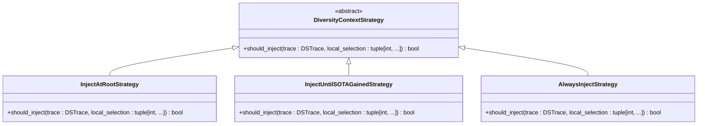
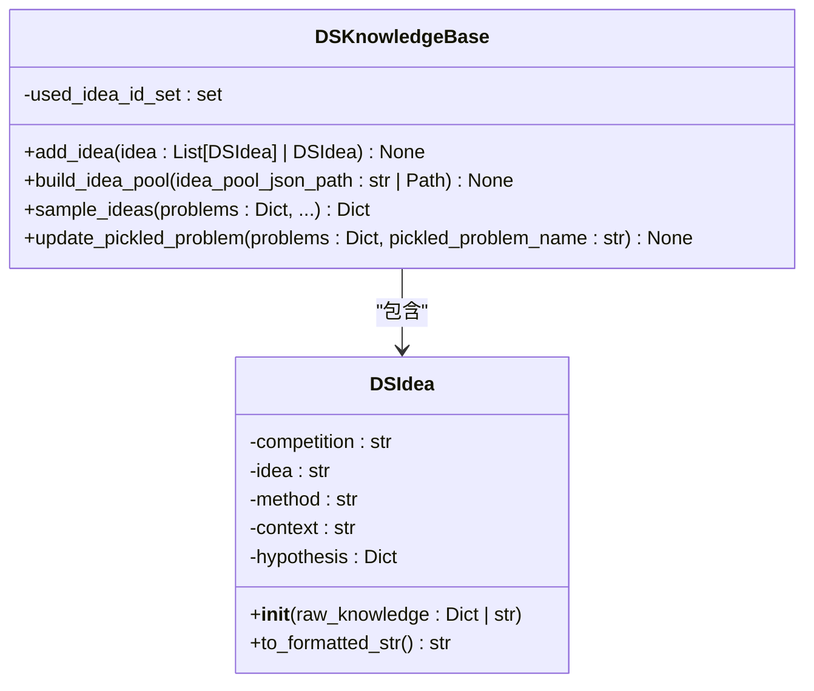
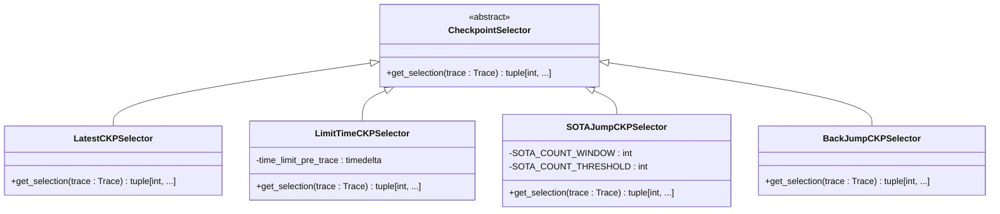
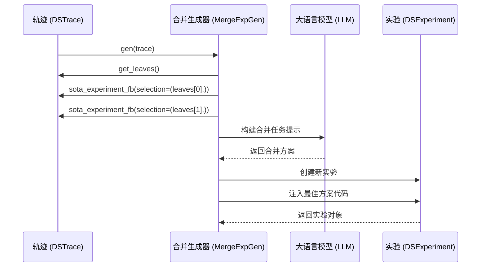
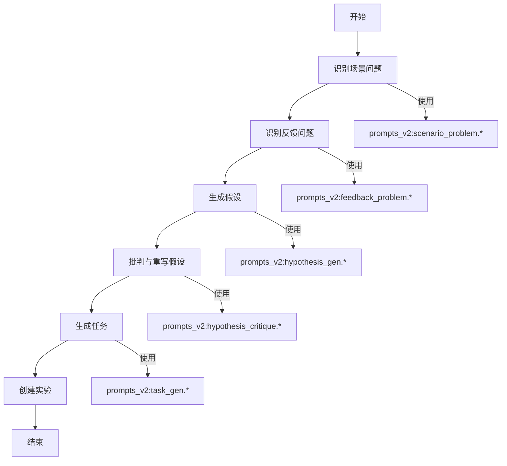

# 提案生成机制

<cite>
**本文档中引用的文件**  
- [diversity_strategy.py](file://rdagent/scenarios/data_science/proposal/exp_gen/diversity_strategy.py)
- [idea_pool.py](file://rdagent/scenarios/data_science/proposal/exp_gen/idea_pool.py)
- [merge.py](file://rdagent/scenarios/data_science/proposal/exp_gen/merge.py)
- [base.py](file://rdagent/scenarios/data_science/proposal/exp_gen/base.py)
- [proposal.py](file://rdagent/scenarios/data_science/proposal/exp_gen/proposal.py)
- [expand.py](file://rdagent/scenarios/data_science/proposal/exp_gen/select/expand.py)
- [conf.py](file://rdagent/app/data_science/conf.py)
- [prompts_v2.yaml](file://rdagent/scenarios/data_science/proposal/exp_gen/prompts_v2.yaml)
</cite>

## 目录
1. [引言](#引言)
2. [多样性策略](#多样性策略)
3. [创意池机制](#创意池机制)
4. [提案合并与扩展算法](#提案合并与扩展算法)
5. [data_science场景下的提案生成流程](#data_science场景下的提案生成流程)
6. [提升提案质量的实践技巧](#提升提案质量的实践技巧)
7. [问题解决方案](#问题解决方案)
8. [结论](#结论)

## 引言
提案生成系统是数据科学研发自动化的核心组件，它通过智能算法生成实验方案，驱动机器学习模型的持续优化。本系统采用多策略协同的架构，结合多样性策略、创意池管理和合并扩展算法，有效避免了创意同质化问题，确保了探索路径的丰富性和创新性。系统基于历史知识提取假设，并生成可执行的实验方案，实现了从问题分析到方案实施的完整闭环。

## 多样性策略

提案生成系统通过多样性策略（diversity_strategy）来避免创意同质化，确保在探索过程中能够发现多样化的解决方案。该策略的核心是`DiversityContextStrategy`抽象基类，它定义了何时向生成过程注入跨轨迹多样性上下文的决策逻辑。

系统实现了多种具体的多样性注入策略：

**Diagram sources**
- [diversity_strategy.py](file://rdagent/scenarios/data_science/proposal/exp_gen/diversity_strategy.py#L1-L68)

**Section sources**
- [diversity_strategy.py](file://rdagent/scenarios/data_science/proposal/exp_gen/diversity_strategy.py#L1-L68)
- [base.py](file://rdagent/scenarios/data_science/proposal/exp_gen/base.py#L1-L349)
- [conf.py](file://rdagent/app/data_science/conf.py#L1-L207)

### 注入策略详解

1.  **根节点注入策略 (InjectAtRootStrategy)**：仅在创建子轨迹的新根节点时注入多样性上下文。这种策略确保了每个新探索分支的起点都具有足够的差异性，从源头上避免了路径的重复。

2.  **SOTA前持续注入策略 (InjectUntilSOTAGainedStrategy)**：这是系统默认采用的策略。它会在当前子轨迹产生首个SOTA（State-of-the-Art）实验之前持续注入多样性上下文。一旦找到一个成功的方案，系统会暂时停止注入，专注于对该方案的深度优化，从而在探索（exploration）和利用（exploitation）之间取得平衡。

3.  **始终注入策略 (AlwaysInjectStrategy)**：无论何时都注入多样性上下文。这种策略最大化了探索的广度，适用于需要极高创新性的场景，但可能会牺牲一定的优化效率。

这些策略通过`DSTrace`类的`should_inject_diversity`方法被调用，其执行由配置文件中的`enable_cross_trace_diversity`和`diversity_injection_strategy`参数控制。

## 创意池机制

创意池（idea_pool）是系统实现知识复用和启发式创新的关键组件。它以图数据库的形式存储从历史竞赛和成功方案中提取的创意知识，为新提案的生成提供灵感和依据。

### 数据结构

创意池的核心数据结构是`DSKnowledgeBase`，它继承自`UndirectedGraph`（无向图），并管理着`DSIdea`（数据科学创意）对象。

**Diagram sources**
- [idea_pool.py](file://rdagent/scenarios/data_science/proposal/exp_gen/idea_pool.py#L1-L186)

**Section sources**
- [idea_pool.py](file://rdagent/scenarios/data_science/proposal/exp_gen/idea_pool.py#L1-L186)
- [base.py](file://rdagent/scenarios/data_science/proposal/exp_gen/base.py#L1-L349)

#### DSIdea (创意对象)
每个`DSIdea`对象包含以下关键信息：
-   **idea**: 创意的核心概念标签。
-   **method**: 可实现的通用方法描述（如“应用堆叠集成方法”），避免提及具体模型以保证泛化能力。
-   **context**: 该创意在具体实现中的详细示例（如“使用XGBoost、随机森林和LightGBM作为基础模型”）。
-   **hypothesis**: 包含`scenario_problem`（问题性质）和`feedback_problem`（数据特征）的假设字典，用于匹配当前场景。

#### DSKnowledgeBase (知识库)
`DSKnowledgeBase`负责管理创意的生命周期：
-   **构建 (build_idea_pool)**：从JSON文件批量加载创意，并将其构建成一个知识图谱。图中的节点包括“IDEA”、“competition”、“SCENARIO_PROBLEM”和“FEEDBACK_PROBLEM”，通过语义关系连接。
-   **采样 (sample_ideas)**：根据当前问题（problems）的描述，首先通过语义搜索（`semantic_search`）找到相关的“SCENARIO_PROBLEM”或“FEEDBACK_PROBLEM”节点，然后获取其关联的创意节点。
-   **筛选**：通过LLM对采样的创意进行筛选，选择最符合当前场景的创意。
-   **去重**：通过`used_idea_id_set`集合记录已使用的创意ID，确保同一创意不会被重复使用。

## 提案合并与扩展算法

提案的合并（merge）与扩展（expand）是系统实现方案进化的核心算法，它们共同构成了多轨迹探索与融合的闭环。

### 扩展算法 (Expand)

扩展算法由`CheckpointSelector`（检查点选择器）实现，它决定下一个实验应从哪个历史节点开始。系统提供了多种策略：

**Diagram sources**
- [expand.py](file://rdagent/scenarios/data_science/proposal/exp_gen/select/expand.py#L1-L245)

**Section sources**
- [expand.py](file://rdagent/scenarios/data_science/proposal/exp_gen/select/expand.py#L1-L245)
- [conf.py](file://rdagent/app/data_science/conf.py#L1-L207)

-   **最新选择器 (LatestCKPSelector)**：总是从最新的一次实验开始，进行连续迭代。
-   **限时选择器 (LimitTimeCKPSelector)**：为每个子轨迹分配固定时间预算，时间用尽后开启新轨迹，确保探索的广度。
-   **SOTA跳跃选择器 (SOTAJumpCKPSelector)**：监控一个时间窗口内的SOTA成功率，若低于阈值，则开启新轨迹，避免在无效路径上浪费资源。
-   **回跳选择器 (BackJumpCKPSelector)**：在SOTA成功率低时，有50%概率开启新轨迹，50%概率回退到倒数第二个SOTA节点，尝试不同的优化路径。

### 合并算法 (Merge)

合并算法在探索阶段结束后启动，将多个独立轨迹中产生的优秀方案进行融合。其核心是`MergeExpGen`类。

**Diagram sources**
- [merge.py](file://rdagent/scenarios/data_science/proposal/exp_gen/merge.py#L1-L448)

**Section sources**
- [merge.py](file://rdagent/scenarios/data_science/proposal/exp_gen/merge.py#L1-L448)
- [base.py](file://rdagent/scenarios/data_science/proposal/exp_gen/base.py#L1-L349)

工作流程如下：
1.  **识别最佳方案**：从第一个叶子节点（`leaves[0]`）的轨迹中找到SOTA实验（`sota_exp_fb`）。
2.  **识别待合并方案**：从第二个叶子节点（`leaves[1]`）的轨迹中找到另一个SOTA实验（`exp_to_merge_fb`）。
3.  **构建合并任务**：系统提示（system prompt）会明确指示“合并两个不同版本的解决方案以获得更好的结果”。用户提示（user prompt）则包含两个方案的详细描述和反馈。
4.  **生成新实验**：LLM根据提示生成一个`PipelineTask`，描述如何融合两个方案。系统创建一个新的`DSExperiment`，并将其假设（hypothesis）设置为合并策略。
5.  **代码注入**：将最佳方案的代码注入到新实验的工作空间中，作为合并的基础。

## data_science场景下的提案生成流程

在data_science场景下，提案生成是一个从历史知识提取假设到生成可执行实验方案的完整流程。该流程由`DSProposalV2ExpGen`类驱动，其工作流如下：

**Diagram sources**
- [proposal.py](file://rdagent/scenarios/data_science/proposal/exp_gen/proposal.py#L1-L1502)
- [prompts_v2.yaml](file://rdagent/scenarios/data_science/proposal/exp_gen/prompts_v2.yaml)

**Section sources**
- [proposal.py](file://rdagent/scenarios/data_science/proposal/exp_gen/proposal.py#L1-L1502)
- [base.py](file://rdagent/scenarios/data_science/proposal/exp_gen/base.py#L1-L349)

### 详细流程

1.  **问题识别**：
    -   **场景问题识别**：分析竞赛描述和SOTA方案，识别出未解决的挑战（`ScenarioChallenges`）。这通过`identify_scenario_problem`方法和`prompts_v2:scenario_problem.*`提示模板实现。
    -   **反馈问题识别**：分析历史实验的反馈和代码，识别出实现缺陷或可改进点（`TraceChallenges`）。这通过`identify_feedback_problem`方法实现，并可选择性地注入多样性上下文。

2.  **假设生成**：
    -   将识别出的问题（problems）与场景描述、历史反馈等信息一起输入LLM。
    -   LLM根据`prompts_v2:hypothesis_gen.*`提示模板，为每个问题生成一个详细的假设（`HypothesisDetail`），包括组件选择、假设陈述、预期影响和质量评估。

3.  **假设批判与重写**（可选）：
    -   如果启用了`enable_hypo_critique_rewrite`，系统会调用`hypothesis_critique`方法，让LLM对生成的假设进行批判，指出潜在缺陷。
    -   随后调用`hypothesis_rewrite`方法，基于批判意见生成改进后的假设。

4.  **任务生成**：
    -   调用`task_gen`方法，根据最终的假设生成具体的任务（如`ModelTask`、`FeatureTask`）。
    -   这个过程会参考`prompts_v2:task_gen.*`提示模板，确保任务描述清晰、可执行。

5.  **实验创建**：
    -   将生成的任务和假设封装成一个`DSExperiment`对象。
    -   如果存在SOTA方案，将其代码注入新实验的工作空间，作为新方案的基础。

## 提升提案质量的实践技巧

为了生成高质量的提案，可以调整系统的关键参数和策略。

### 调整多样性权重

多样性权重由`diversity_injection_strategy`和`enable_cross_trace_diversity`配置控制。
-   **提高创新性**：将`diversity_injection_strategy`设置为`AlwaysInjectStrategy`，并确保`enable_cross_trace_diversity=True`。这会强制系统在每次探索新路径时都引入多样性，最大化创新潜力。
-   **提高稳定性**：将`diversity_injection_strategy`设置为`InjectAtRootStrategy`。这仅在创建新分支时引入变化，其余时间专注于深度优化，适合在接近SOTA时进行精细调优。

### 优化合并策略

合并策略的优化主要通过调整合并前的探索阶段来实现。
-   **增加探索广度**：增大`max_trace_num`（最大轨迹数）和`merge_hours`（合并预留时间）。更多的独立轨迹意味着更多样化的候选方案，为合并提供更丰富的素材。
-   **控制探索深度**：调整`SOTA_COUNT_WINDOW`和`SOTA_COUNT_THRESHOLD`。较小的窗口和阈值会促使系统更频繁地开启新轨迹，避免陷入局部最优；较大的值则允许在单个路径上进行更深入的探索。
-   **选择合适的合并时机**：合理设置`merge_hours`，确保在预留时间内有足够的计算资源来完成合并和最终优化。

## 问题解决方案

针对提案生成过程中常见的问题，系统提供了相应的解决方案。

### 提案重复问题

提案重复的根本原因是探索路径的同质化。
-   **解决方案**：启用并强化多样性策略。确保`enable_cross_trace_diversity=True`，并选择`InjectUntilSOTAGainedStrategy`或`AlwaysInjectStrategy`。同时，增加`max_trace_num`，让系统并行探索更多独立路径，从根本上减少重复。

### 创新性不足问题

创新性不足通常源于知识库的局限或探索策略的保守。
-   **解决方案**：
    1.  **扩充创意池**：定期将新的成功竞赛方案转化为`DSIdea`格式，并更新`idea_pool_json_path`指向的文件，为系统注入新鲜知识。
    2.  **启用研究型RAG**：将`enable_research_rag`设置为`True`。这允许系统在生成假设时，主动查询外部社区讨论和公开代码，获取最新的技术洞见。
    3.  **鼓励简单假设**：将`enable_simple_hypothesis`设置为`True`，引导LLM生成更简洁、更聚焦的假设，有时能激发意想不到的创新。

## 结论

提案生成系统通过精巧的架构设计，实现了自动化机器学习研发的智能化。其核心在于多样性策略、创意池和合并扩展算法的协同工作。多样性策略确保了探索的广度，避免了创意枯竭；创意池实现了知识的沉淀与复用，为创新提供基础；合并扩展算法则完成了从分散探索到集中优化的闭环。通过深入理解并合理配置这些机制，可以显著提升提案的质量和创新性，有效解决重复和创新不足等问题，最终驱动数据科学项目取得突破性进展。