# 核心功能技术设计

<cite>
**本文档引用的文件**
- [evolving_agent.py](file://rdagent/core/evolving_agent.py)
- [CoSTEER/__init__.py](file://rdagent/components/coder/CoSTEER/__init__.py)
- [evolving_strategy.py](file://rdagent/components/coder/CoSTEER/evolving_strategy.py)
- [evaluators.py](file://rdagent/components/coder/CoSTEER/evaluators.py)
- [knowledge_management.py](file://rdagent/components/coder/CoSTEER/knowledge_management.py)
- [evolvable_subjects.py](file://rdagent/components/coder/CoSTEER/evolvable_subjects.py)
- [task.py](file://rdagent/components/coder/CoSTEER/task.py)
- [evolving_framework.py](file://rdagent/core/evolving_framework.py)
- [diversity_strategy.py](file://rdagent/scenarios/data_science/proposal/exp_gen/diversity_strategy.py)
- [idea_pool.py](file://rdagent/scenarios/data_science/proposal/exp_gen/idea_pool.py)
- [config.py](file://rdagent/components/coder/CoSTEER/config.py)
- [exp.py](file://rdagent/components/coder/data_science/model/exp.py)
- [exp.py](file://rdagent/components/coder/data_science/feature/exp.py)
- [exp.py](file://rdagent/components/coder/data_science/pipeline/exp.py)
- [conf.py](file://rdagent/app/data_science/conf.py)
</cite>

## 目录
1. [引言](#引言)
2. [系统架构概览](#系统架构概览)
3. [进化代理系统（EvolvingAgent）](#进化代理系统evolvingagent)
4. [CoSTEER框架核心组件](#costeer框架核心组件)
5. [知识管理系统](#知识管理系统)
6. [评估系统设计](#评估系统设计)
7. [提案生成机制](#提案生成机制)
8. [性能优化策略](#性能优化策略)
9. [故障处理与解决方案](#故障处理与解决方案)
10. [总结](#总结)

## 引言

RD-Agent是一个基于人工智能的进化代理系统，专门用于数据科学任务的自动化开发。该系统的核心是CoSTEER（Code, STEER, Evaluate, and Iterate）框架，它通过智能迭代和知识积累实现代码的持续优化。本文档深入分析系统的核心功能技术实现细节，包括状态管理、迭代控制、终止条件、提案生成机制、代码生成生命周期以及评估系统的设计原理。

## 系统架构概览

RD-Agent采用分层架构设计，主要包含以下几个核心层次：

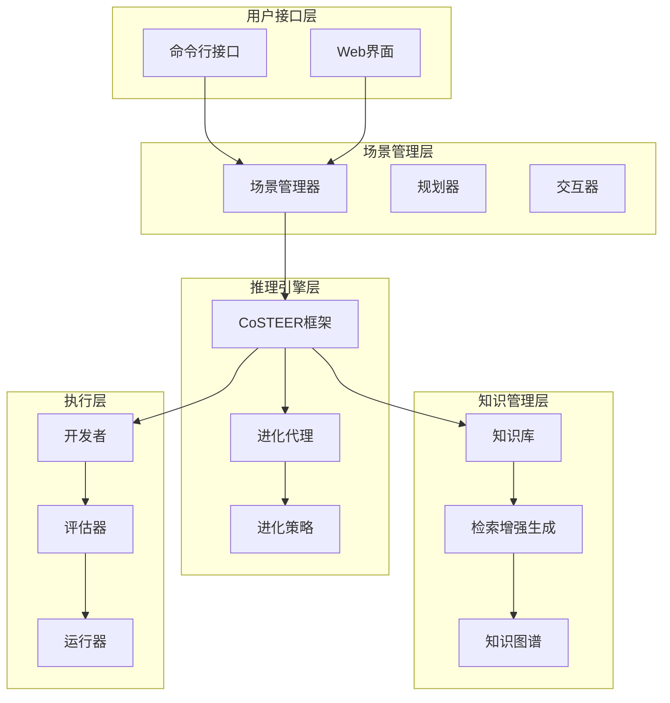

**图表来源**
- [CoSTEER/__init__.py](file://rdagent/components/coder/CoSTEER/__init__.py#L1-L177)
- [evolving_agent.py](file://rdagent/core/evolving_agent.py#L1-L116)

## 进化代理系统（EvolvingAgent）

### 状态管理机制

进化代理系统通过RAGEvoAgent类实现复杂的状态管理功能。该系统维护着完整的进化历史记录，包括每个迭代步骤的知识查询结果、反馈信息和演化对象。

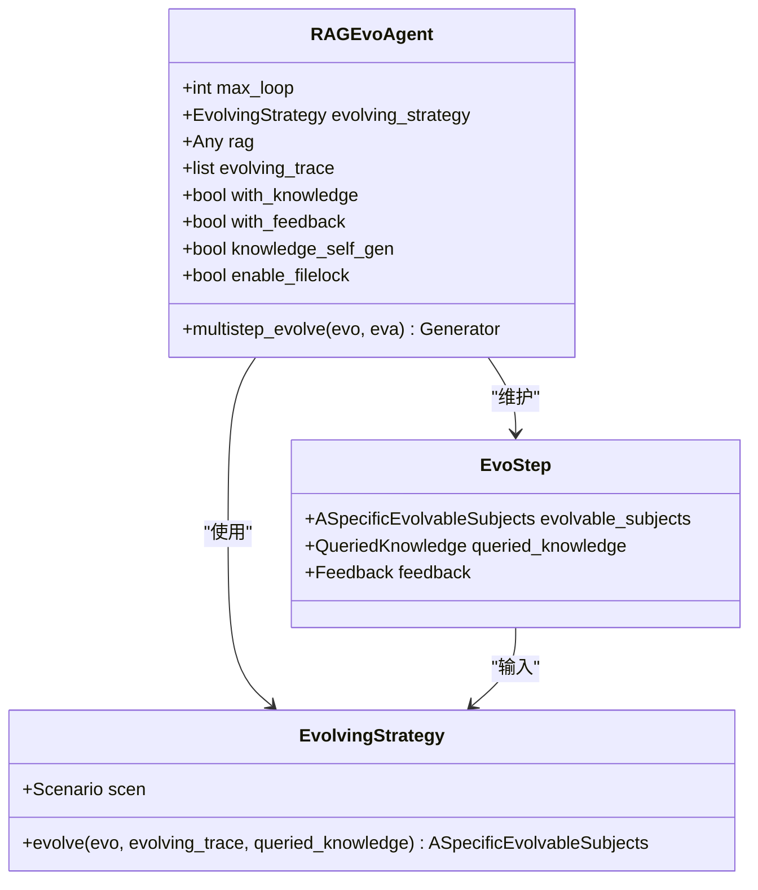

**图表来源**
- [evolving_agent.py](file://rdagent/core/evolving_agent.py#L25-L116)
- [evolving_framework.py](file://rdagent/core/evolving_framework.py#L40-L50)

### 迭代控制与终止条件

系统实现了多层次的迭代控制机制：

1. **最大循环限制**：通过`max_loop`参数控制总迭代次数
2. **反馈驱动终止**：当所有任务都完成时自动终止
3. **超时控制**：支持全局定时器和本地超时设置
4. **性能监控**：实时跟踪迭代进度和效果

**段落来源**
- [evolving_agent.py](file://rdagent/core/evolving_agent.py#L70-L116)

### 多进程进化策略

MultiProcessEvolvingStrategy类实现了并行化的进化策略，显著提升了系统效率：

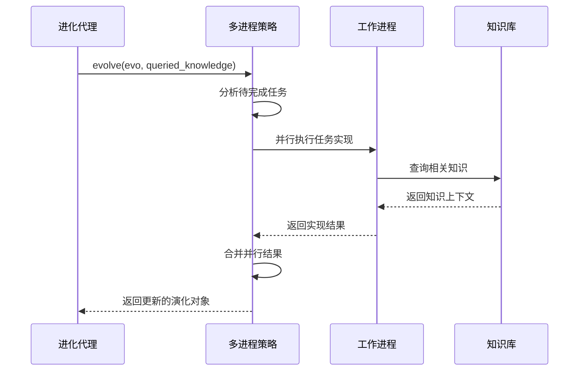

**图表来源**
- [evolving_strategy.py](file://rdagent/components/coder/CoSTEER/evolving_strategy.py#L60-L134)

**段落来源**
- [evolving_strategy.py](file://rdagent/components/coder/CoSTEER/evolving_strategy.py#L15-L134)

## CoSTEER框架核心组件

### 代码生成生命周期

CoSTEER框架定义了完整的代码生成、测试、评估与进化的生命周期：

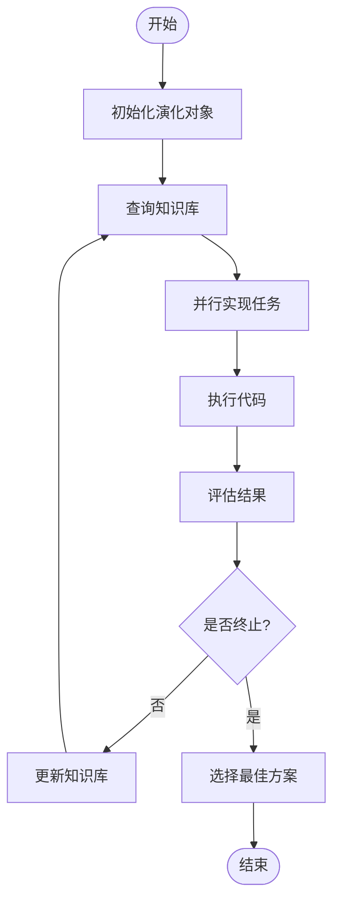

**图表来源**
- [CoSTEER/__init__.py](file://rdagent/components/coder/CoSTEER/__init__.py#L80-L176)

### 任务类型与实现

系统支持多种任务类型的专门化实现：

| 任务类型 | 描述 | 主要特征 |
|---------|------|----------|
| ModelTask | 模型构建任务 | 包含模型名称和描述信息 |
| FeatureTask | 特征工程任务 | 专注于数据预处理和特征提取 |
| PipelineTask | 流水线任务 | 整合多个组件的完整工作流 |
| DataLoaderTask | 数据加载任务 | 处理数据导入和基础预处理 |

**段落来源**
- [exp.py](file://rdagent/components/coder/data_science/model/exp.py#L1-L22)
- [exp.py](file://rdagent/components/coder/data_science/feature/exp.py#L1-L14)
- [exp.py](file://rdagent/components/coder/data_science/pipeline/exp.py#L1-L9)

### 开发者模式与工作空间管理

CoSTEER开发者类负责协调整个开发过程，包括工作空间管理和检查点机制：

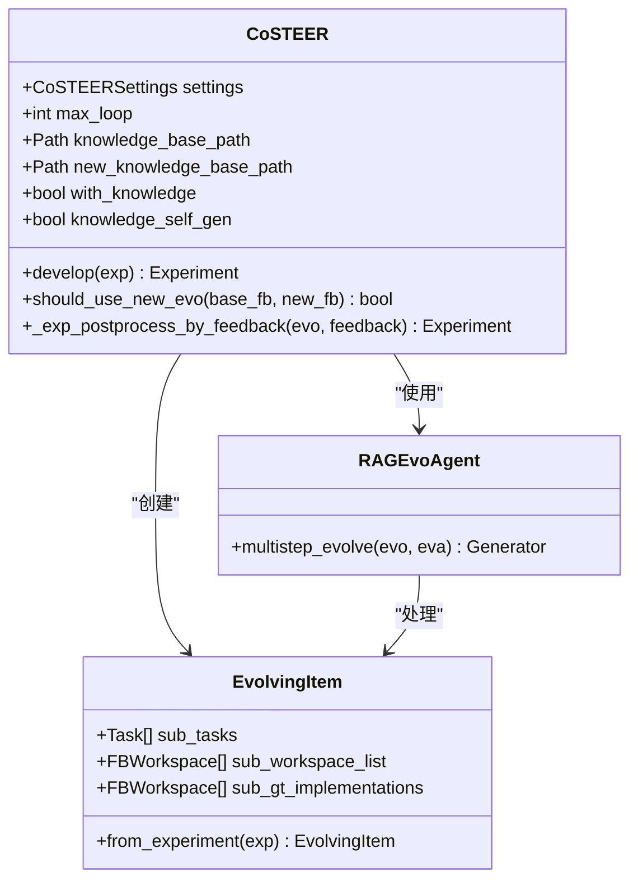

**图表来源**
- [CoSTEER/__init__.py](file://rdagent/components/coder/CoSTEER/__init__.py#L15-L80)
- [evolvable_subjects.py](file://rdagent/components/coder/CoSTEER/evolvable_subjects.py#L1-L33)

**段落来源**
- [CoSTEER/__init__.py](file://rdagent/components/coder/CoSTEER/__init__.py#L80-L176)

## 知识管理系统

### 知识库架构

CoSTEER实现了两版本的知识库系统，支持从V1到V2的平滑升级：

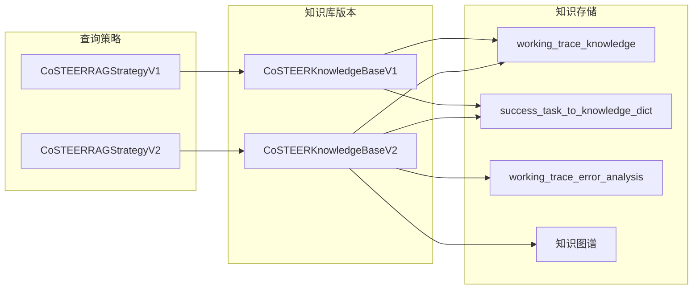

**图表来源**
- [knowledge_management.py](file://rdagent/components/coder/CoSTEER/knowledge_management.py#L100-L200)

### 知识检索与生成

V2版本引入了先进的知识检索机制：

1. **组件分析**：基于语义相似性分析任务组件
2. **错误分析**：自动识别和分类执行错误
3. **交叉引用**：建立任务间的关联关系
4. **动态采样**：智能选择相关知识进行融合

**段落来源**
- [knowledge_management.py](file://rdagent/components/coder/CoSTEER/knowledge_management.py#L300-L500)

### 知识图谱构建

系统通过UndirectedGraph实现知识图谱的构建和查询：

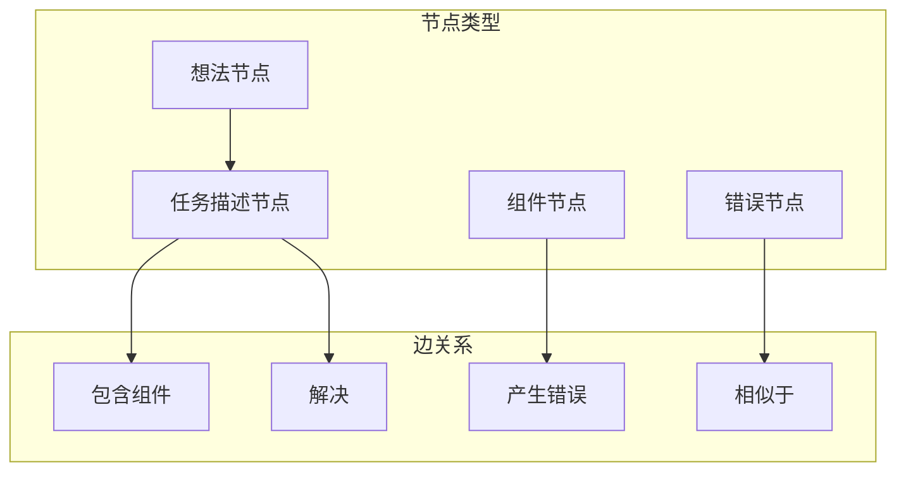

**图表来源**
- [knowledge_management.py](file://rdagent/components/coder/CoSTEER/knowledge_management.py#L700-L800)

## 评估系统设计

### 多维度评分机制

评估系统采用CoSTEERMultiFeedback结构，支持多维度的综合评估：

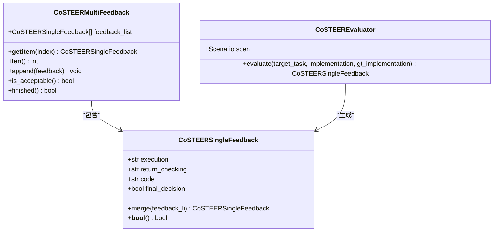

**图表来源**
- [evaluators.py](file://rdagent/components/coder/CoSTEER/evaluators.py#L20-L100)

### 自动化指标与LLM反馈

评估系统结合自动化指标和大语言模型反馈生成多维评分：

1. **执行验证**：检查代码是否成功运行
2. **返回值检查**：验证输出格式和内容正确性
3. **代码质量评估**：分析代码风格和最佳实践
4. **最终决策**：综合所有维度做出最终判断

**段落来源**
- [evaluators.py](file://rdagent/components/coder/CoSTEER/evaluators.py#L25-L150)

### 反馈聚合与决策

系统实现了智能的反馈聚合机制，能够处理来自多个评估器的结果：

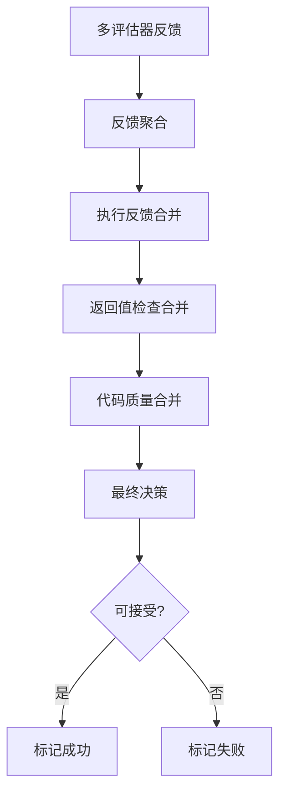

**图表来源**
- [evaluators.py](file://rdagent/components/coder/CoSTEER/evaluators.py#L250-L311)

**段落来源**
- [evaluators.py](file://rdagent/components/coder/CoSTEER/evaluators.py#L250-L311)

## 提案生成机制

### 多样性策略

系统提供了多种多样性注入策略，确保提案的创新性和广泛性：

| 策略类型 | 触发条件 | 作用机制 |
|---------|----------|----------|
| InjectAtRootStrategy | 创建新根节点时 | 在分支起点注入多样性 |
| InjectUntilSOTAGainedStrategy | 未获得SOTA时 | 直到首次获得最佳结果前持续注入 |
| AlwaysInjectStrategy | 总是 | 每次都注入多样性上下文 |

**段落来源**
- [diversity_strategy.py](file://rdagent/scenarios/data_science/proposal/exp_gen/diversity_strategy.py#L1-L69)

### 创意池管理

DSKnowledgeBase类实现了创意池的管理和检索：

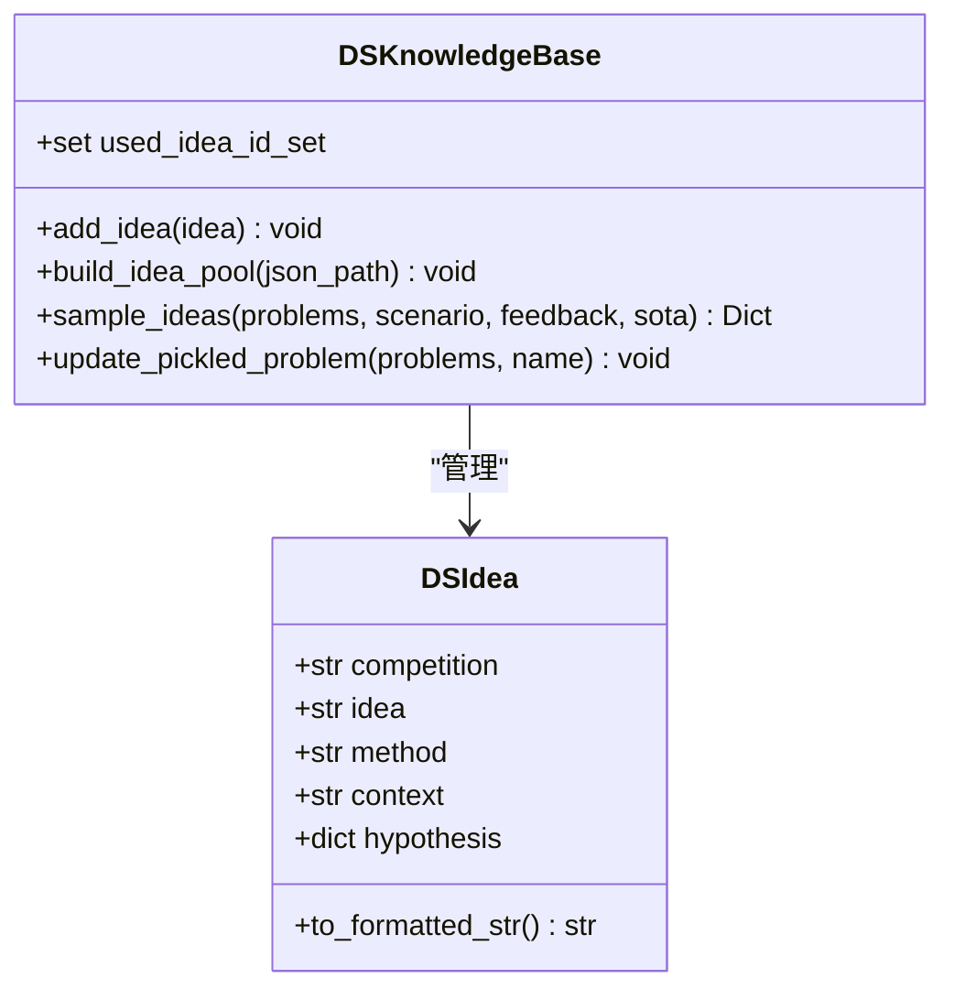

**图表来源**
- [idea_pool.py](file://rdagent/scenarios/data_science/proosal/exp_gen/idea_pool.py#L20-L80)

### 假设生成与验证

系统通过语义搜索和LLM辅助实现智能假设生成：

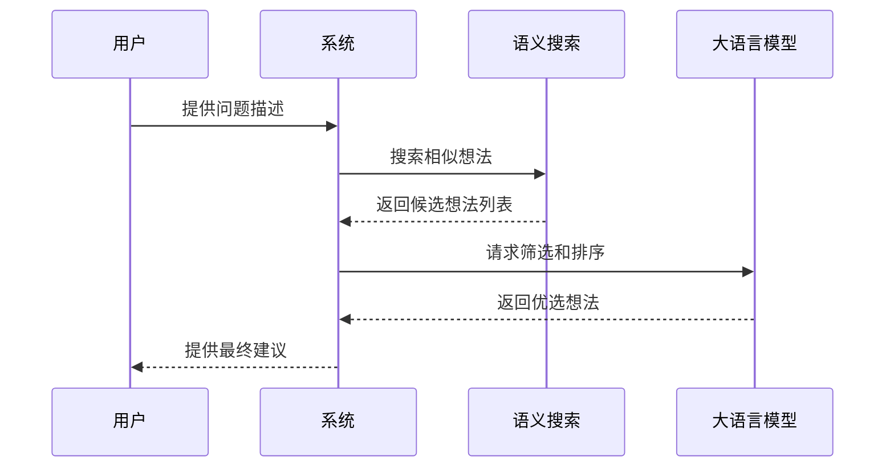

**图表来源**
- [idea_pool.py](file://rdagent/scenarios/data_science/proposal/exp_gen/idea_pool.py#L120-L185)

**段落来源**
- [idea_pool.py](file://rdagent/scenarios/data_science/proposal/exp_gen/idea_pool.py#L120-L185)

## 性能优化策略

### 缓存策略

系统实现了多层次的缓存机制：

1. **代码缓存**：避免重复生成相同代码
2. **知识缓存**：保存查询结果减少重复计算
3. **评估缓存**：缓存评估结果避免重复验证

### 并行执行配置

通过配置文件可以灵活调整并行度：

```python
# 配置示例
RD_AGENT_SETTINGS.multi_proc_n = 4  # 设置并行进程数
DS_RD_SETTING.coder_max_loop = 10   # 设置最大迭代次数
DS_RD_SETTING.runner_max_loop = 3   # 设置运行器最大迭代
```

### 超时管理

系统提供了完善的超时控制机制：

- **全局超时**：基于RD_Agent_TIMER_wrapper的全局计时
- **本地超时**：每个任务独立的超时控制
- **渐进式超时**：根据失败次数动态增加超时时间

**段落来源**
- [config.py](file://rdagent/components/coder/CoSTEER/config.py#L1-L43)
- [conf.py](file://rdagent/app/data_science/conf.py#L30-L50)

## 故障处理与解决方案

### 常见失败模式

系统识别并处理以下常见失败模式：

1. **陷入局部最优**
   - 解决方案：通过知识库的多样化检索避免重复路径
   - 实现：V2知识库的错误分析和交叉引用机制

2. **代码编译错误**
   - 解决方案：错误分析和自动修复建议
   - 实现：基于错误类型的智能诊断和恢复

3. **性能退化**
   - 解决方案：回退机制和检查点管理
   - 实现：fallback_evo_exp的使用和恢复机制

### 错误分析与恢复

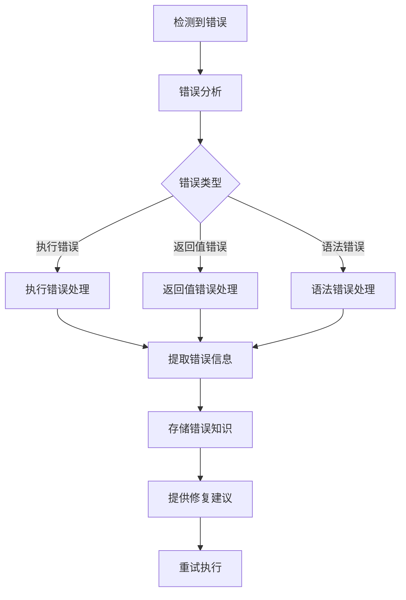

**图表来源**
- [knowledge_management.py](file://rdagent/components/coder/CoSTEER/knowledge_management.py#L400-L500)

### 容错机制

系统实现了多重容错保护：

1. **异常捕获**：捕获所有可能的运行时异常
2. **状态恢复**：在失败时恢复到稳定状态
3. **降级策略**：在资源不足时启用简化模式
4. **日志记录**：详细记录失败原因便于调试

**段落来源**
- [CoSTEER/__init__.py](file://rdagent/components/coder/CoSTEER/__init__.py#L150-L176)

## 总结

RD-Agent的进化代理系统通过CoSTEER框架实现了智能化的代码生成和优化。系统的核心优势包括：

1. **智能状态管理**：通过RAGEvoAgent实现复杂的迭代控制和状态维护
2. **高效知识管理**：V2知识库的先进检索和生成机制
3. **全面评估体系**：多维度评分和自动化指标相结合
4. **多样化提案生成**：基于语义搜索和LLM的创意池管理
5. **健壮的容错机制**：多层次的错误处理和恢复策略

该系统为数据科学任务的自动化开发提供了强大而灵活的解决方案，能够在保证质量的同时显著提升开发效率。通过持续的知识积累和智能优化，系统能够不断改进其性能和创新能力。