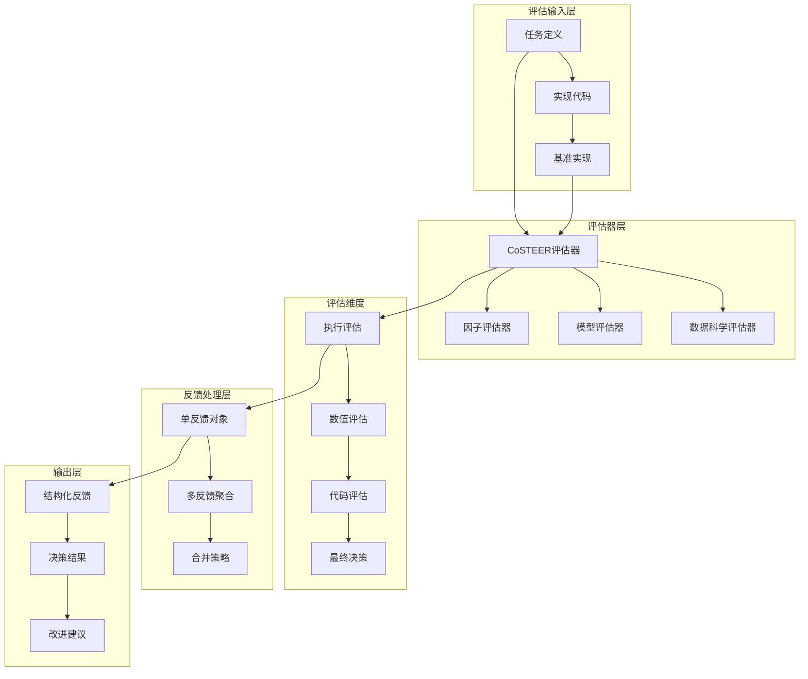
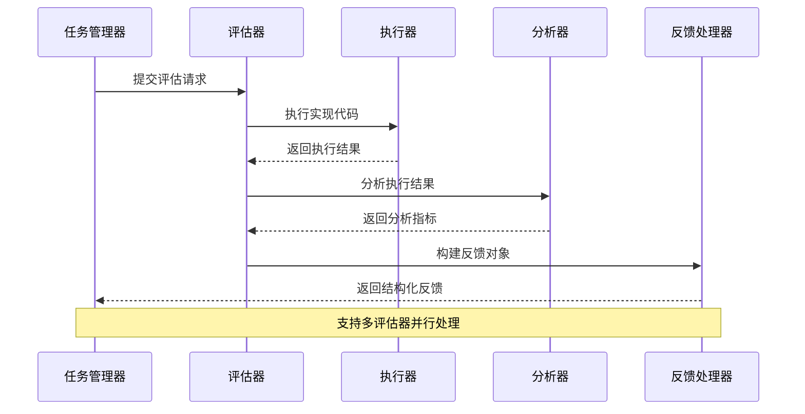
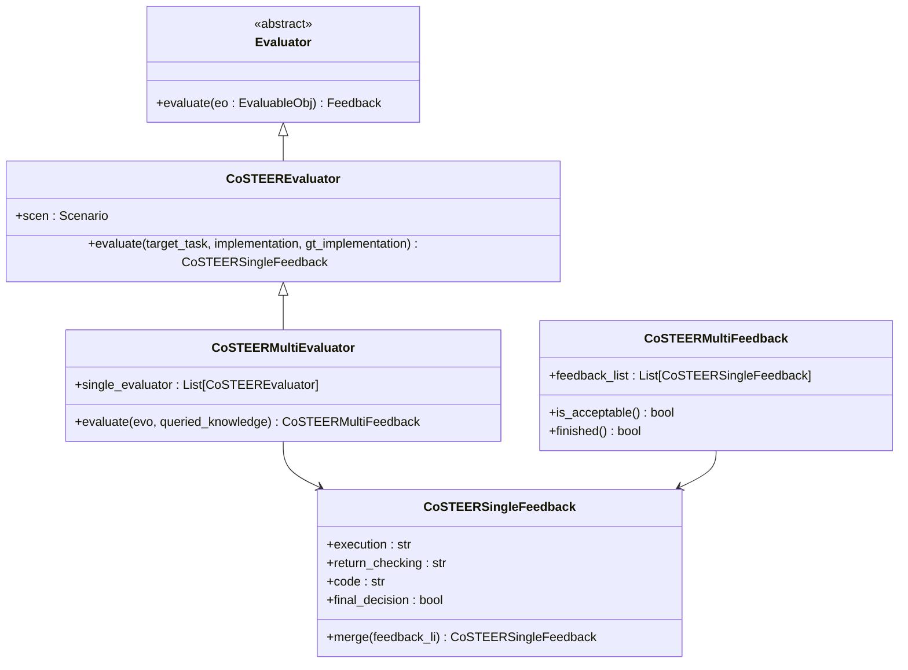
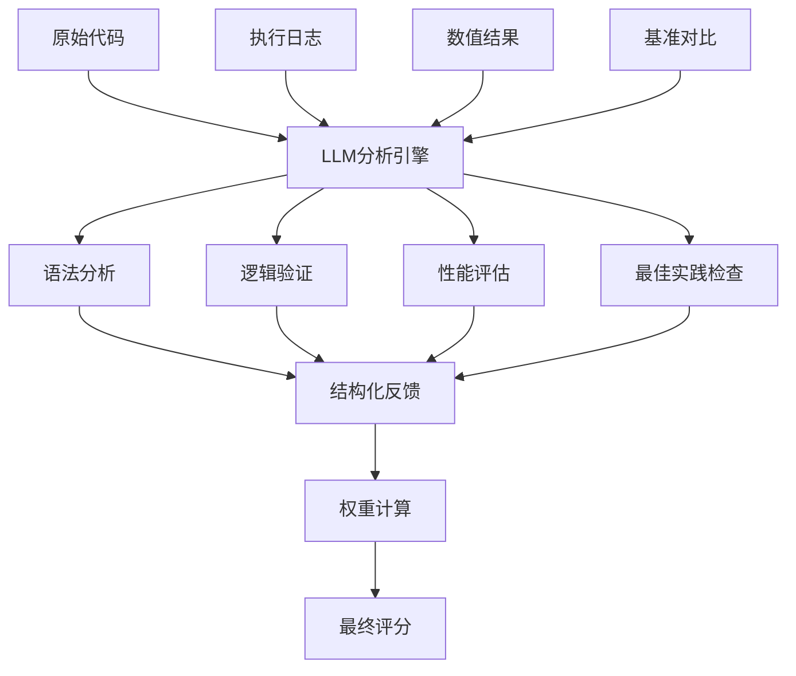
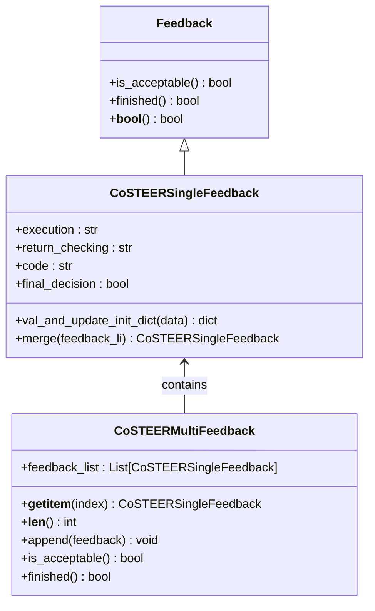
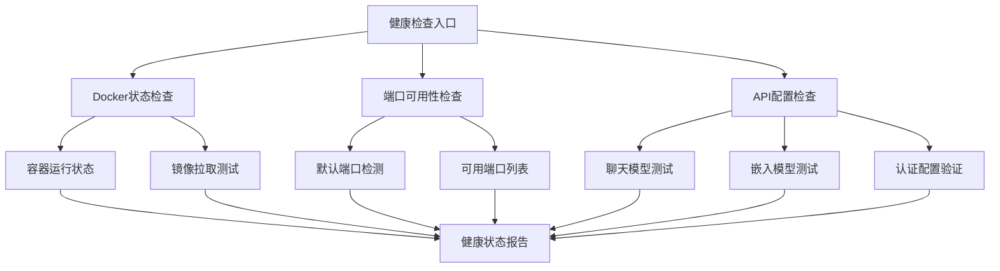
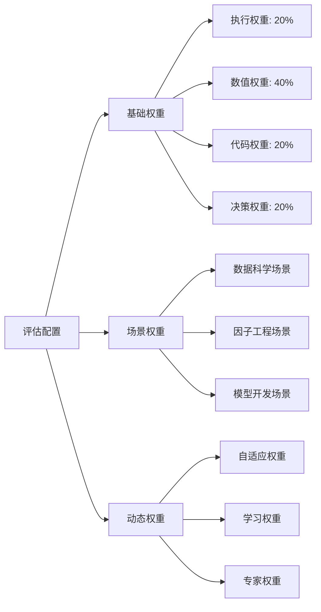
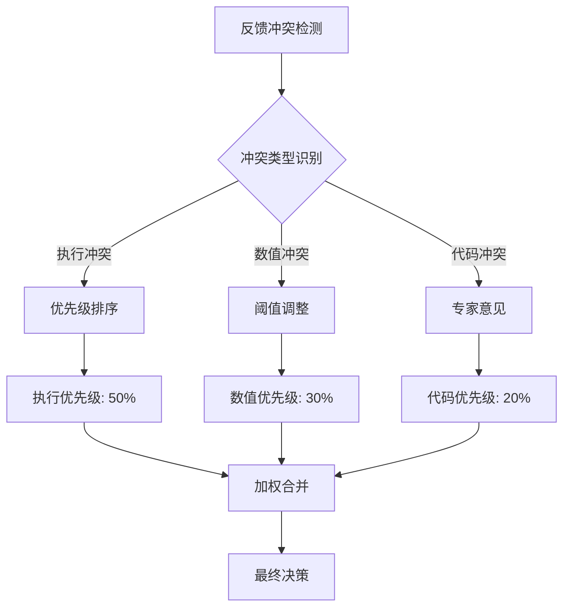

# 评估与反馈系统

<cite>
**本文档引用的文件**
- [evaluators.py](file://rdagent/components/coder/CoSTEER/evaluators.py)
- [eval_method.py](file://rdagent/components/benchmark/eval_method.py)
- [health_check.py](file://rdagent/app/utils/health_check.py)
- [evaluation.py](file://rdagent/core/evaluation.py)
- [factor_evaluators.py](file://rdagent/components/coder/factor_coder/evaluators.py)
- [model_evaluators.py](file://rdagent/components/coder/model_coder/evaluators.py)
- [data_science_eval.py](file://rdagent/components/coder/data_science/share/eval.py)
- [config.py](file://rdagent/components/coder/CoSTEER/config.py)
- [task.py](file://rdagent/components/coder/CoSTEER/task.py)
- [evolvable_subjects.py](file://rdagent/components/coder/CoSTEER/evolvable_subjects.py)
- [eva_utils.py](file://rdagent/components/coder/factor_coder/eva_utils.py)
- [model_eva_utils.py](file://rdagent/components/coder/model_coder/eva_utils.py)
</cite>

## 目录
1. [引言](#引言)
2. [系统架构概览](#系统架构概览)
3. [核心评估流程](#核心评估流程)
4. [CoSTEER框架评估器模块](#costeer框架评估器模块)
5. [多维度评分机制](#多维度评分机制)
6. [反馈信息处理与结构化](#反馈信息处理与结构化)
7. [系统健康度评估](#系统健康度评估)
8. [评估权重配置指南](#评估权重配置指南)
9. [问题诊断与解决方案](#问题诊断与解决方案)
10. [最佳实践建议](#最佳实践建议)

## 引言

评估与反馈系统是RD-Agent的核心组件，负责对生成的代码实现进行自动化评估和提供结构化反馈。该系统采用多层评估架构，结合自动化指标计算和LLM语义分析，为迭代优化提供精确指导。

系统主要特点：
- **多维度评估**：涵盖执行、数值、代码质量等多个维度
- **混合评估方法**：结合自动化测试和LLM语义分析
- **结构化反馈**：提供详细的改进建议和问题定位
- **自适应权重**：支持根据场景调整评估重点
- **健康监控**：内置系统健康度检查机制

## 系统架构概览

评估与反馈系统采用分层架构设计，从底层的评估器到顶层的反馈聚合，形成完整的评估流水线。

**图表来源**
- [evaluators.py](file://rdagent/components/coder/CoSTEER/evaluators.py#L1-L312)
- [evaluation.py](file://rdagent/core/evaluation.py#L1-L58)

**章节来源**
- [evaluators.py](file://rdagent/components/coder/CoSTEER/evaluators.py#L1-L50)
- [evaluation.py](file://rdagent/core/evaluation.py#L1-L30)

## 核心评估流程

评估流程遵循标准化的输入-处理-输出模式，确保评估的一致性和可重复性。

**图表来源**
- [evaluators.py](file://rdagent/components/coder/CoSTEER/evaluators.py#L200-L250)
- [factor_evaluators.py](file://rdagent/components/coder/factor_coder/evaluators.py#L25-L85)

### 评估阶段详解

1. **准备阶段**：验证输入参数，检查缓存状态
2. **执行阶段**：运行实现代码，收集执行结果
3. **分析阶段**：基于多种指标进行深度分析
4. **决策阶段**：综合所有维度做出最终判断
5. **反馈阶段**：生成结构化反馈信息

**章节来源**
- [evaluators.py](file://rdagent/components/coder/CoSTEER/evaluators.py#L200-L312)
- [factor_evaluators.py](file://rdagent/components/coder/factor_coder/evaluators.py#L25-L130)

## CoSTEER框架评估器模块

CoSTEER（Collaborative STEERING）框架提供了统一的评估器接口和多样的评估策略。

### 基础评估器架构

**图表来源**
- [evaluators.py](file://rdagent/components/coder/CoSTEER/evaluators.py#L150-L312)
- [evaluation.py](file://rdagent/core/evaluation.py#L1-L58)

### 多评估器协同工作

系统支持多个评估器同时工作，通过并行处理提高效率，并通过智能合并策略整合不同评估器的结果。

**章节来源**
- [evaluators.py](file://rdagent/components/coder/CoSTEER/evaluators.py#L200-L312)

## 多维度评分机制

系统实现了全面的多维度评分体系，涵盖技术指标和语义质量两个层面。

### 自动化指标评估

| 评估维度 | 具体指标 | 计算方法 | 权重 |
|---------|---------|---------|------|
| 执行评估 | 代码语法正确性 | 静态语法分析 | 20% |
| 执行评估 | 运行时稳定性 | 异常捕获率 | 15% |
| 数值评估 | 输出形状正确性 | 形状匹配度 | 25% |
| 数值评估 | 数值精度 | MAE/MSE计算 | 20% |
| 数值评估 | 相关性分析 | IC/RIC计算 | 15% |
| 代码评估 | 结构合理性 | 代码复杂度分析 | 15% |
| 代码评估 | 最佳实践遵循 | 规范符合度 | 10% |

### LLM语义反馈机制

**图表来源**
- [eva_utils.py](file://rdagent/components/coder/factor_coder/eva_utils.py#L50-L150)
- [model_eva_utils.py](file://rdagent/components/coder/model_coder/eva_utils.py#L50-L100)

**章节来源**
- [eva_utils.py](file://rdagent/components/coder/factor_coder/eva_utils.py#L1-L200)
- [model_eva_utils.py](file://rdagent/components/coder/model_coder/eva_utils.py#L1-L100)

## 反馈信息处理与结构化

反馈系统采用层次化的结构化设计，确保信息的有效传递和利用。

### 反馈对象层次结构

**图表来源**
- [evaluators.py](file://rdagent/components/coder/CoSTEER/evaluators.py#L25-L150)
- [evaluation.py](file://rdagent/core/evaluation.py#L10-L30)

### 反馈信息融合策略

系统实现了智能的反馈融合机制，能够处理来自不同评估器的异构反馈信息。

**章节来源**
- [evaluators.py](file://rdagent/components/coder/CoSTEER/evaluators.py#L60-L120)

## 系统健康度评估

健康检查系统确保评估环境的稳定性和可靠性。

### 健康检查组件

**图表来源**
- [health_check.py](file://rdagent/app/utils/health_check.py#L100-L170)

### 健康度指标

| 检查项目 | 检查内容 | 阈值标准 | 影响级别 |
|---------|---------|---------|---------|
| Docker服务 | 容器运行状态 | 正常运行 | 关键 |
| 网络连接 | 默认端口占用 | 未被占用 | 关键 |
| API配置 | 模型访问权限 | 可正常调用 | 关键 |
| 资源使用 | 内存占用率 | < 80% | 重要 |
| 缓存状态 | 评估缓存有效性 | 已初始化 | 一般 |

**章节来源**
- [health_check.py](file://rdagent/app/utils/health_check.py#L1-L171)

## 评估权重配置指南

系统提供了灵活的权重配置机制，允许用户根据具体场景调整评估重点。

### 配置参数说明

**图表来源**
- [config.py](file://rdagent/components/coder/CoSTEER/config.py#L1-L43)

### 场景特定权重调整

不同应用场景需要不同的评估侧重点：

1. **数据科学场景**：重视数值准确性和业务逻辑正确性
2. **因子工程场景**：强调计算效率和数值稳定性
3. **模型开发场景**：关注代码结构和最佳实践遵循

**章节来源**
- [config.py](file://rdagent/components/coder/CoSTEER/config.py#L1-L43)

## 问题诊断与解决方案

针对评估过程中常见的问题，系统提供了完善的诊断和解决机制。

### 评估结果不稳定问题

**问题表现**：
- 相同实现多次评估结果不一致
- 评估分数波动较大
- 反馈信息矛盾

**诊断步骤**：
1. 检查随机种子设置
2. 验证评估环境一致性
3. 分析LLM响应稳定性
4. 检查外部依赖状态

**解决方案**：
- 启用确定性模式
- 实施评估结果缓存
- 增加评估次数统计
- 实现结果平滑机制

### 反馈冲突问题

**问题表现**：
- 不同评估器给出相反结论
- 反馈信息相互矛盾
- 最终决策难以确定

**解决策略**：

**图表来源**
- [evaluators.py](file://rdagent/components/coder/CoSTEER/evaluators.py#L60-L120)

### 性能优化策略

1. **并行评估**：利用多进程并行处理多个评估器
2. **缓存机制**：缓存重复的评估结果
3. **增量更新**：只重新评估发生变化的部分
4. **资源调度**：智能分配计算资源

**章节来源**
- [evaluators.py](file://rdagent/components/coder/CoSTEER/evaluators.py#L200-L312)

## 最佳实践建议

### 评估器选择指南

1. **简单任务**：使用单一评估器，注重执行效率
2. **复杂任务**：组合多个评估器，确保全面覆盖
3. **生产环境**：启用缓存机制，避免重复计算
4. **调试阶段**：增加详细日志，便于问题定位

### 反馈质量提升

1. **明确目标**：确保评估目标清晰具体
2. **量化指标**：尽可能使用可量化的评估标准
3. **上下文信息**：提供充分的背景和约束信息
4. **持续改进**：基于历史反馈优化评估策略

### 系统维护建议

1. **定期健康检查**：建立自动化的健康监控机制
2. **版本控制**：跟踪评估器版本和配置变更
3. **性能监控**：监控评估系统的响应时间和资源使用
4. **故障恢复**：建立评估失败的自动恢复机制

通过合理配置和使用这些评估与反馈系统，可以显著提升代码质量和开发效率，为AI驱动的研发过程提供可靠的质量保障。