# 进化代理系统技术实现深度解析

<cite>
**本文档引用的文件**
- [evolving_agent.py](file://rdagent/core/evolving_agent.py)
- [experiment.py](file://rdagent/core/experiment.py)
- [scenario.py](file://rdagent/core/scenario.py)
- [evolving_framework.py](file://rdagent/core/evolving_framework.py)
- [evaluation.py](file://rdagent/core/evaluation.py)
- [developer.py](file://rdagent/core/developer.py)
- [costeer/__init__.py](file://rdagent/components/coder/CoSTEER/__init__.py)
- [evolving_strategy.py](file://rdagent/components/coder/CoSTEER/evolving_strategy.py)
- [knowledge_management.py](file://rdagent/components/coder/CoSTEER/knowledge_management.py)
- [config.py](file://rdagent/components/coder/CoSTEER/config.py)
- [conf.py](file://rdagent/core/conf.py)
</cite>

## 目录
1. [引言](#引言)
2. [系统架构概览](#系统架构概览)
3. [核心组件分析](#核心组件分析)
4. [状态机设计与迭代控制](#状态机设计与迭代控制)
5. [终止条件判断机制](#终止条件判断机制)
6. [闭环协作机制](#闭环协作机制)
7. [Experiment生命周期管理](#experiment生命周期管理)
8. [Scenario领域策略](#scenario领域策略)
9. [状态转换图示例](#状态转换图示例)
10. [调试方法与配置调优](#调试方法与配置调优)
11. [常见问题解决方案](#常见问题解决方案)
12. [总结](#总结)

## 引言

进化代理系统（EvolvingAgent）是RD-Agent框架中的核心组件，它通过智能迭代优化的方式解决复杂的研发任务。该系统采用状态机设计模式，实现了提案、编码、执行和评估的完整闭环，能够根据反馈不断改进解决方案。

## 系统架构概览

进化代理系统采用分层架构设计，主要包含以下核心层次：

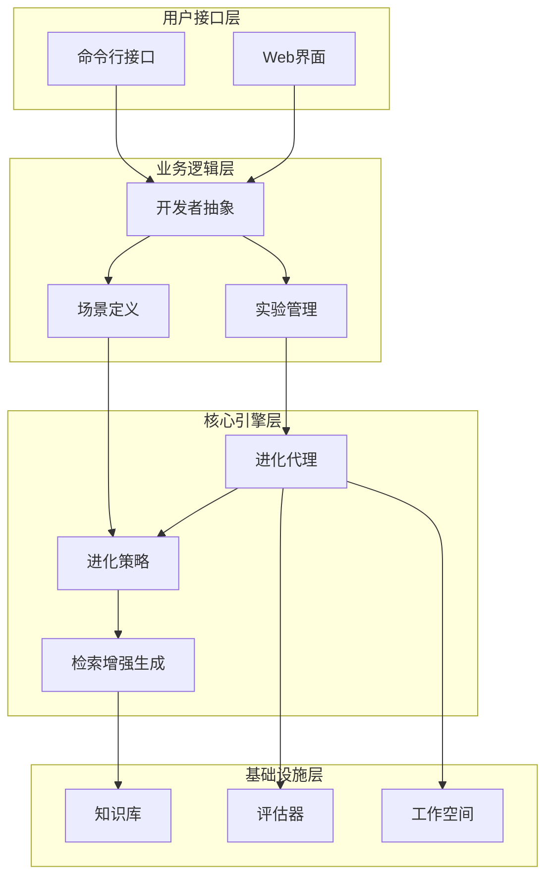

**图表来源**
- [developer.py](file://rdagent/core/developer.py#L1-L35)
- [experiment.py](file://rdagent/core/experiment.py#L1-L50)
- [evolving_agent.py](file://rdagent/core/evolving_agent.py#L1-L50)

**章节来源**
- [developer.py](file://rdagent/core/developer.py#L1-L35)
- [experiment.py](file://rdagent/core/experiment.py#L1-L100)
- [evolving_agent.py](file://rdagent/core/evolving_agent.py#L1-L116)

## 核心组件分析

### EvoAgent抽象基类

EvoAgent是进化代理系统的核心抽象类，定义了进化过程的基本接口：

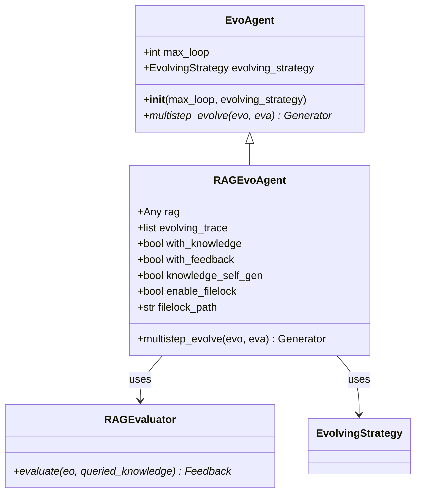

**图表来源**
- [evolving_agent.py](file://rdagent/core/evolving_agent.py#L15-L116)
- [evaluation.py](file://rdagent/core/evaluation.py#L1-L58)

### EvolvableSubjects与EvoStep

EvolvableSubjects代表可进化的对象，EvoStep记录每次进化步骤的状态：

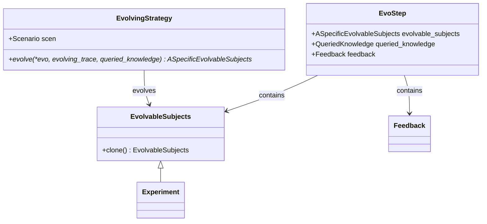

**图表来源**
- [evolving_framework.py](file://rdagent/core/evolving_framework.py#L30-L128)
- [experiment.py](file://rdagent/core/experiment.py#L150-L250)

**章节来源**
- [evolving_agent.py](file://rdagent/core/evolving_agent.py#L15-L116)
- [evolving_framework.py](file://rdagent/core/evolving_framework.py#L30-L128)

## 状态机设计与迭代控制

### 多步进化流程

RAGEvoAgent的multistep_evolve方法实现了完整的状态机控制：

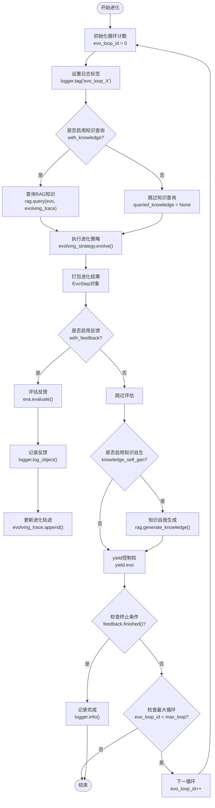

**图表来源**
- [evolving_agent.py](file://rdagent/core/evolving_agent.py#L78-L116)

### 循环控制机制

系统通过多个维度控制进化循环：

| 控制维度 | 实现方式 | 配置参数 |
|---------|---------|---------|
| 最大循环次数 | `tqdm(range(max_loop))` | `max_loop` |
| 时间限制 | `RD_Agent_TIMER_wrapper.timer.is_timeout()` | `max_seconds_multiplier` |
| 反馈终止 | `feedback.finished()` | 自动检测 |
| 超时处理 | `reached_max_seconds` | 内置逻辑 |

**章节来源**
- [evolving_agent.py](file://rdagent/core/evolving_agent.py#L78-L116)
- [costeer/__init__.py](file://rdagent/components/coder/CoSTEER/__init__.py#L80-L120)

## 终止条件判断机制

### 多重终止条件

系统实现了多层次的终止条件判断：

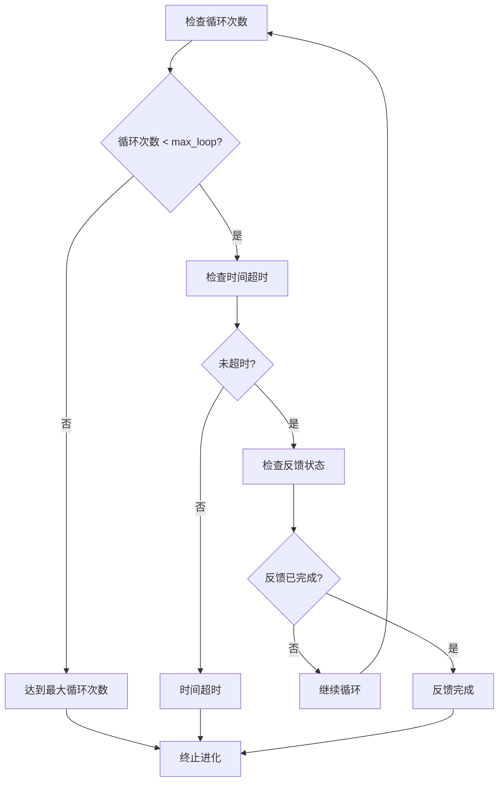

**图表来源**
- [evolving_agent.py](file://rdagent/core/evolving_agent.py#L105-L116)

### 终止条件优先级

终止条件按照以下优先级顺序检查：
1. **时间超时**：全局定时器检查
2. **最大循环**：预设的最大迭代次数
3. **反馈完成**：所有子任务都已完成

**章节来源**
- [evolving_agent.py](file://rdagent/core/evolving_agent.py#L105-L116)
- [costeer/__init__.py](file://rdagent/components/coder/CoSTEER/__init__.py#L95-L110)

## 闭环协作机制

### 提案-编码-执行-评估循环

进化代理系统形成了完整的闭环协作机制：

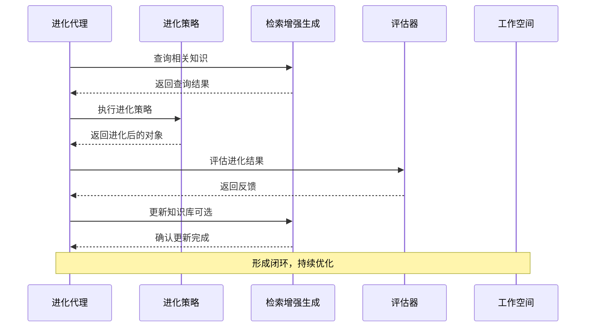

**图表来源**
- [evolving_agent.py](file://rdagent/core/evolving_agent.py#L78-L116)
- [costeer/__init__.py](file://rdagent/components/coder/CoSTEER/__init__.py#L80-L120)

### 协作组件关系

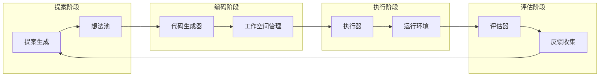

**图表来源**
- [costeer/__init__.py](file://rdagent/components/coder/CoSTEER/__init__.py#L80-L120)
- [evolving_framework.py](file://rdagent/core/evolving_framework.py#L50-L90)

**章节来源**
- [evolving_agent.py](file://rdagent/core/evolving_agent.py#L78-L116)
- [costeer/__init__.py](file://rdagent/components/coder/CoSTEER/__init__.py#L80-L176)

## Experiment生命周期管理

### Experiment类设计

Experiment类封装了单次实验的完整生命周期：

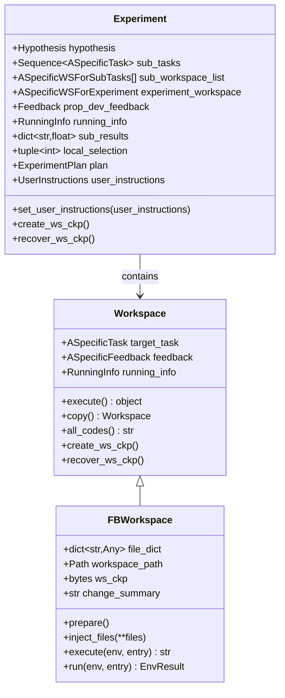

**图表来源**
- [experiment.py](file://rdagent/core/experiment.py#L250-L483)

### 生命周期阶段

Experiment的生命周期包含以下关键阶段：

| 阶段 | 主要活动 | 关键方法 |
|------|---------|---------|
| 初始化 | 创建实验结构 | `__init__()` |
| 准备 | 设置任务和工作空间 | `set_user_instructions()` |
| 执行 | 子任务实施 | `develop()` |
| 监控 | 进度跟踪 | `create_ws_ckp()`, `recover_ws_ckp()` |
| 总结 | 结果汇总 | `result`属性 |

**章节来源**
- [experiment.py](file://rdagent/core/experiment.py#L250-L483)

## Scenario领域策略

### Scenario抽象设计

Scenario类定义了不同领域的执行策略：

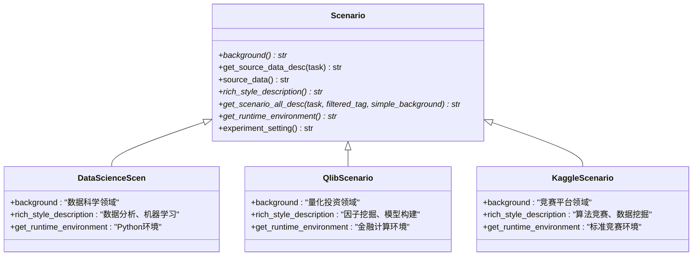

**图表来源**
- [scenario.py](file://rdagent/core/scenario.py#L1-L65)

### 领域特定策略

不同Scenario实现特定的领域策略：

| 场景类型 | 背景信息 | 运行环境 | 特殊功能 |
|---------|---------|---------|---------|
| 数据科学 | 分析、建模、可视化 | Python生态 | 特征工程支持 |
| 量化投资 | 因子挖掘、交易策略 | 金融计算环境 | 回测支持 |
| Kaggle竞赛 | 算法竞赛 | 竞赛标准环境 | 自动提交 |

**章节来源**
- [scenario.py](file://rdagent/core/scenario.py#L1-L65)

## 状态转换图示例

### 从初始假设到最终方案的演化路径

以下是典型的进化状态转换图：

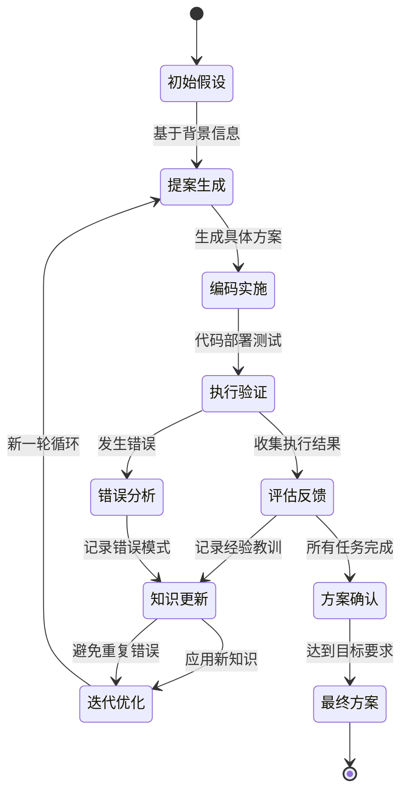

### 具体演化路径示例

以数据科学项目为例，展示完整的演化路径：

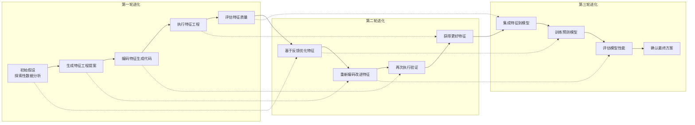

## 调试方法与配置调优

### 日志系统配置

系统提供了完善的日志记录机制：

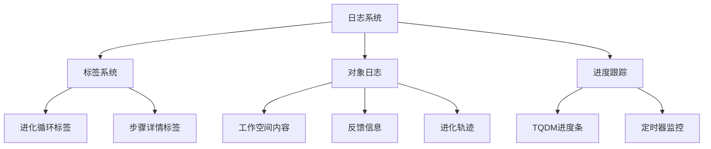

**图表来源**
- [evolving_agent.py](file://rdagent/core/evolving_agent.py#L85-L90)

### 配置调优参数

| 参数类别 | 关键参数 | 默认值 | 调优建议 |
|---------|---------|--------|---------|
| 循环控制 | `max_loop` | 10 | 根据复杂度调整 |
| 时间限制 | `max_seconds_multiplier` | 10^6 | 平衡精度与效率 |
| 知识管理 | `with_knowledge` | False | 启用以提高质量 |
| 自我生成 | `knowledge_self_gen` | False | 生产环境建议开启 |
| 文件锁 | `enable_filelock` | False | 并行环境必须开启 |

### 性能监控指标

系统内置多种性能监控指标：

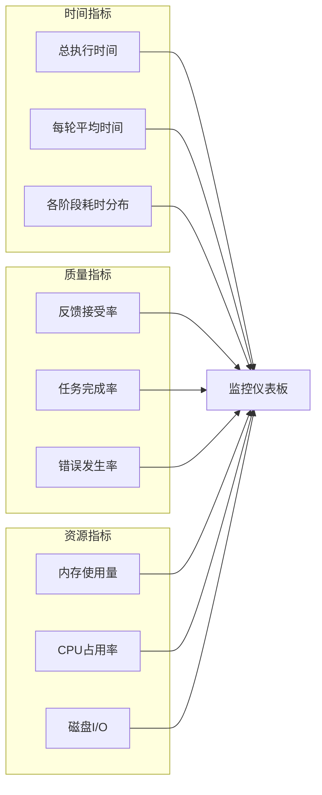

**章节来源**
- [conf.py](file://rdagent/core/conf.py#L1-L110)
- [config.py](file://rdagent/components/coder/CoSTEER/config.py#L1-L43)

## 常见问题解决方案

### 代理卡顿问题

**问题表现**：进化过程长时间无响应

**诊断方法**：
1. 检查日志中的TQDM进度条
2. 监控内存和CPU使用情况
3. 查看是否有死锁或无限循环

**解决方案**：
```python
# 配置超时保护
settings.max_seconds_multiplier = 300  # 5分钟超时
settings.enable_filelock = True  # 启用文件锁防止并发冲突
```

### 无限循环问题

**问题表现**：进化循环无法正常终止

**诊断方法**：
1. 检查`feedback.finished()`返回值
2. 验证最大循环次数设置
3. 确认时间超时机制

**解决方案**：
```python
# 设置合理的终止条件
class CustomEvolvingStrategy(EvolvingStrategy):
    def evolve(self, *evo, **kwargs):
        # 添加额外的终止检查
        if self.check_infinite_loop(evo):
            raise InfiniteLoopError("检测到无限循环")
        return super().evolve(*evo, **kwargs)
```

### 知识库同步问题

**问题表现**：多进程环境下知识库不一致

**解决方案**：
```python
# 使用文件锁确保知识库一致性
rag = CoSTEERRAGStrategyV2(
    settings=settings,
    enable_filelock=True,
    filelock_path="/tmp/rd_agent_knowledge.lock"
)
```

### 内存泄漏问题

**问题表现**：长时间运行后内存持续增长

**诊断方法**：
1. 监控`evolving_trace`列表大小
2. 检查工作空间清理机制
3. 验证对象引用计数

**解决方案**：
```python
# 定期清理进化轨迹
def cleanup_old_traces(agent, max_traces=100):
    if len(agent.evolving_trace) > max_traces:
        agent.evolving_trace = agent.evolving_trace[-max_traces:]
```

**章节来源**
- [evolving_agent.py](file://rdagent/core/evolving_agent.py#L105-L116)
- [costeer/__init__.py](file://rdagent/components/coder/CoSTEER/__init__.py#L120-L176)

## 总结

进化代理系统通过精心设计的状态机架构、多重终止条件判断机制和闭环协作流程，实现了智能化的研发任务自动化。系统的主要优势包括：

1. **模块化设计**：清晰的职责分离和可扩展的架构
2. **智能迭代**：基于反馈的持续优化机制
3. **容错能力**：多重保护机制确保系统稳定性
4. **性能监控**：完善的日志和监控体系
5. **领域适应**：灵活的Scenario设计支持不同领域

通过合理配置和调优，进化代理系统能够在各种复杂的研发场景中发挥出色的性能，为AI驱动的研发工作提供强有力的支持。