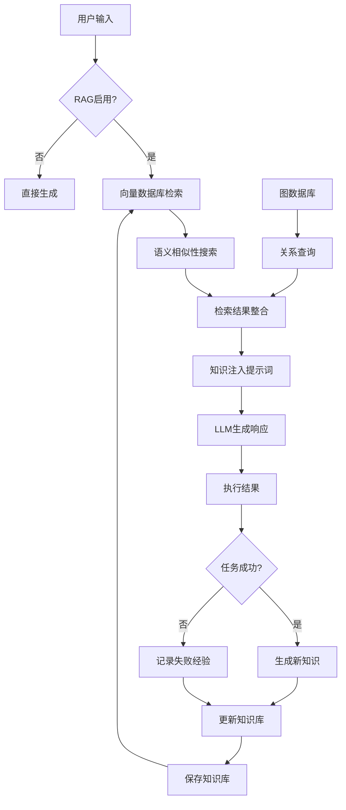

# RAG策略

<cite>
**本文档引用的文件**
- [vector_base.py](file://rdagent/components/knowledge_management/vector_base.py)
- [graph.py](file://rdagent/components/knowledge_management/graph.py)
- [knowledge_base.py](file://rdagent/core/knowledge_base.py)
- [conf.py](file://rdagent/components/agent/rag/conf.py)
- [knowledge_management.py](file://rdagent/components/coder/CoSTEER/knowledge_management.py)
- [proposal.py](file://rdagent/scenarios/data_science/proposal/exp_gen/proposal.py)
- [draft.py](file://rdagent/scenarios/data_science/proposal/exp_gen/draft/draft.py)
- [prompts.yaml](file://rdagent/components/proposal/prompts.yaml)
- [prompts_v2.yaml](file://rdagent/scenarios/data_science/proposal/exp_gen/prompts_v2.yaml)
</cite>

## 目录
1. [引言](#引言)
2. [知识库双模态设计](#知识库双模态设计)
3. [RAG策略协调机制](#rag策略协调机制)
4. [知识生成与存储流程](#知识生成与存储流程)
5. [提案生成案例分析](#提案生成案例分析)
6. [数据流图](#数据流图)
7. [配置与扩展指南](#配置与扩展指南)
8. [结论](#结论)

## 引言
检索增强生成（RAG）策略是RD-Agent系统的核心智能组件，它通过结合向量数据库和图数据库的双模态知识存储，显著提升了系统在数据科学研发任务中的决策能力和创新能力。本文档将深入解析RAG策略的技术实现，重点阐述`KnowledgeBase`的双模态设计、`RAGStrategy`的协调机制以及知识生成的完整流程。通过分析`scenarios/qlib/proposal/`中的提案生成过程，我们将展示RAG如何通过检索历史经验和实体关系来提升提案质量。

## 知识库双模态设计

RAG策略的核心是`KnowledgeBase`的双模态设计，它结合了向量数据库的语义相似性检索和图数据库的关系查询能力，为LLM提供全面的知识支持。

### 向量数据库实现
向量数据库基于`vector_base.py`文件中的`PDVectorBase`类实现，利用Pandas DataFrame存储文档及其嵌入向量。每个文档由`KnowledgeMetaData`类表示，包含内容、标签、唯一ID和嵌入向量。系统通过`APIBackend().create_embedding`方法生成文本的嵌入向量，并使用余弦相似度进行语义搜索。

当执行搜索时，系统首先为查询内容生成嵌入向量，然后计算其与知识库中所有文档嵌入向量的余弦相似度。搜索结果按相似度排序，并可设置相似度阈值和返回数量限制。这种设计使得系统能够高效地找到与当前任务语义相似的历史经验。

**Section sources**
- [vector_base.py](file://rdagent/components/knowledge_management/vector_base.py#L1-L208)

### 图数据库实现
图数据库在`graph.py`文件中通过`UndirectedGraph`类实现，采用无向图结构存储实体及其关系。图中的节点是`UndirectedNode`类的实例，继承自`KnowledgeMetaData`，并增加了邻居节点集合和附加信息字段。节点通过`add_neighbor`方法建立连接，形成知识网络。

图数据库支持多种查询方式，包括基于节点内容的语义搜索、基于图结构的邻域搜索以及多节点交集搜索。`get_nodes_within_steps`方法可以获取指定节点n步范围内的所有相关节点，而`query_by_content`方法则结合了语义搜索和图遍历，实现了更复杂的知识检索。

**Section sources**
- [graph.py](file://rdagent/components/knowledge_management/graph.py#L1-L497)

## RAG策略协调机制

`RAGStrategy`是协调向量检索和图检索的核心组件，它定义了如何将检索到的知识整合并注入到LLM的提示词中。

### 检索协调流程
`RAGStrategy`的协调流程始于`query`方法，该方法接收当前任务和演化轨迹作为输入。系统首先通过向量数据库检索语义相似的历史任务，然后利用图数据库探索这些任务相关的知识图谱。两种检索方式的结果被整合到一个`QueriedKnowledge`对象中，该对象包含了成功任务的知识、失败任务的信息以及相似任务的成功经验。

在CoSTEER框架中，`CoSTEERRAGStrategyV2`类实现了更高级的协调逻辑。它不仅检索直接相关的知识，还通过图遍历发现间接关联的知识节点。例如，系统可以找到与当前任务描述相似的成功实现节点，并通过图结构追溯其完整的实现路径。

### 提示词注入机制
检索到的知识通过`generate_RAG_content`函数注入到LLM的提示词中。该函数将检索结果格式化为字符串，并插入到预定义的提示模板中。在`prompts.yaml`文件中，`user_prompt`模板包含``条件块，当存在RAG内容时，系统会将其作为辅助信息提供给LLM。

这种注入机制确保了LLM在生成响应时能够参考相关的历史经验和最佳实践，从而做出更明智的决策。例如，在生成新的研究假设时，LLM可以参考过去类似场景下的成功实验设计和失败教训。

**Section sources**
- [knowledge_management.py](file://rdagent/components/coder/CoSTEER/knowledge_management.py#L54-L79)
- [proposal.py](file://rdagent/scenarios/kaggle/proposal/proposal.py#L57-L89)
- [prompts.yaml](file://rdagent/components/proposal/prompts.yaml#L14-L31)

## 知识生成与存储流程

知识生成是RAG策略的闭环环节，它将新的经验和教训存储到知识库中，为未来的检索提供素材。

### 触发机制
知识生成的触发机制与系统的演化循环紧密相关。在每次`evolve`循环结束后，如果任务成功完成或获得有价值的反馈，系统就会触发知识生成过程。`generate_knowledge`方法是这一过程的核心，它接收演化轨迹作为输入，并从中提取有价值的知识。

在`CoSTEERKnowledgeBaseV2`类中，知识生成过程更加精细化。系统不仅记录成功的实现方案，还分析任务之间的组件依赖关系，并将这些关系存储在图数据库中。例如，当一个任务成功实现时，系统会创建一个`task_success_implement`标签的节点，并将其与任务描述节点连接起来。

### 存储流程
知识存储流程遵循"加载-更新-保存"的模式。`KnowledgeBase`基类提供了`load`和`dump`方法，用于从文件系统加载和保存知识库状态。当系统启动时，它会尝试从指定路径加载已有的知识库；在每次知识更新后，系统可以选择将最新的状态保存到磁盘。

`CoSTEERRAGStrategy`类中的`dump_knowledge_base`方法实现了知识库的持久化。该方法首先检查输出路径是否存在，如果不存在则创建相应的目录，然后使用`pickle`模块将整个知识库对象序列化并保存到文件中。这种设计确保了知识的长期积累和跨会话共享。

**Section sources**
- [knowledge_management.py](file://rdagent/components/coder/CoSTEER/knowledge_management.py#L141-L176)
- [knowledge_base.py](file://rdagent/core/knowledge_base.py#L1-L27)
- [knowledge_management.py](file://rdagent/components/coder/CoSTEER/knowledge_management.py#L81-L104)

## 提案生成案例分析

以`scenarios/qlib/proposal/`中的提案生成过程为例，我们可以清晰地看到RAG策略如何提升提案质量。

### 因子提案生成
在因子提案生成场景中，系统首先通过`factor_proposal.py`文件中的逻辑分析当前市场状况和历史因子表现。RAG策略在此过程中发挥了关键作用：向量数据库帮助系统找到语义相似的过去市场环境，而图数据库则揭示了不同因子之间的依赖关系和演化路径。

例如，当系统需要为新的市场条件生成因子时，它会检索过去在类似市场条件下表现良好的因子设计。通过图数据库，系统可以发现这些成功因子通常与某些基础技术指标相关联，从而指导新因子的设计方向。

### 模型提案生成
在模型提案生成场景中，RAG策略帮助系统避免重复过去的错误并借鉴成功的架构。`model_proposal.py`文件中的逻辑利用图数据库追踪模型架构的演化历史，识别出哪些组件组合在过去取得了最佳性能。

系统通过`query_by_content`方法搜索与当前任务描述相似的成功模型实现，并分析其架构特点。这种基于历史经验的推理使得系统能够提出更具创新性和实用性的模型提案，而不是盲目尝试所有可能的架构组合。

**Section sources**
- [proposal.py](file://rdagent/scenarios/data_science/proposal/exp_gen/proposal.py#L633-L657)
- [draft.py](file://rdagent/scenarios/data_science/proposal/exp_gen/draft/draft.py#L270-L289)

## 数据流图



**Diagram sources**
- [vector_base.py](file://rdagent/components/knowledge_management/vector_base.py#L1-L208)
- [graph.py](file://rdagent/components/knowledge_management/graph.py#L1-L497)
- [knowledge_management.py](file://rdagent/components/coder/CoSTEER/knowledge_management.py#L54-L79)

## 配置与扩展指南

### 基本配置
RAG策略的基本配置在`conf.py`文件中定义。用户可以通过设置`url`和`timeout`参数来配置RAG服务的连接信息。`url`参数指定了MCP服务器的地址，而`timeout`参数设置了请求的超时时间（单位为秒）。

```python
class Settings(BaseSettings):
    url: str = "http://localhost:8124/mcp"
    timeout: int = 120
```

### 扩展向量数据库
要扩展向量数据库的功能，用户可以继承`VectorBase`基类并实现自己的存储后端。例如，可以将Pandas后端替换为更高效的向量数据库如ChromaDB或Pinecone。关键是要实现`add`和`search`方法，确保新的后端支持文档添加和基于相似度的搜索。

### 扩展图数据库
图数据库的扩展主要涉及`UndirectedGraph`类的定制。用户可以添加新的查询方法或修改现有的图遍历算法。例如，可以实现加权图以表示不同关系的重要性，或者添加时间戳以支持时序知识查询。

### 自定义知识生成
用户可以通过继承`CoSTEERKnowledgeBaseV2`类来自定义知识生成逻辑。在`generate_knowledge`方法中，可以添加特定领域的知识提取规则，例如从实验结果中自动提取性能指标模式或从代码变更中识别设计模式演化。

**Section sources**
- [conf.py](file://rdagent/components/agent/rag/conf.py#L1-L22)
- [vector_base.py](file://rdagent/components/knowledge_management/vector_base.py#L1-L208)
- [graph.py](file://rdagent/components/knowledge_management/graph.py#L1-L497)

## 结论
RAG策略通过创新的双模态知识库设计，为RD-Agent系统提供了强大的知识管理和推理能力。向量数据库和图数据库的结合使得系统既能进行高效的语义搜索，又能深入挖掘实体间的关系网络。`RAGStrategy`的协调机制确保了两种检索方式的无缝集成，而知识生成流程则实现了经验的持续积累和优化。通过`scenarios/qlib/proposal/`中的实际案例，我们看到了RAG策略如何显著提升提案质量和研发效率。未来的工作可以进一步优化检索算法，引入更多类型的知识源，并探索知识库的分布式共享机制。