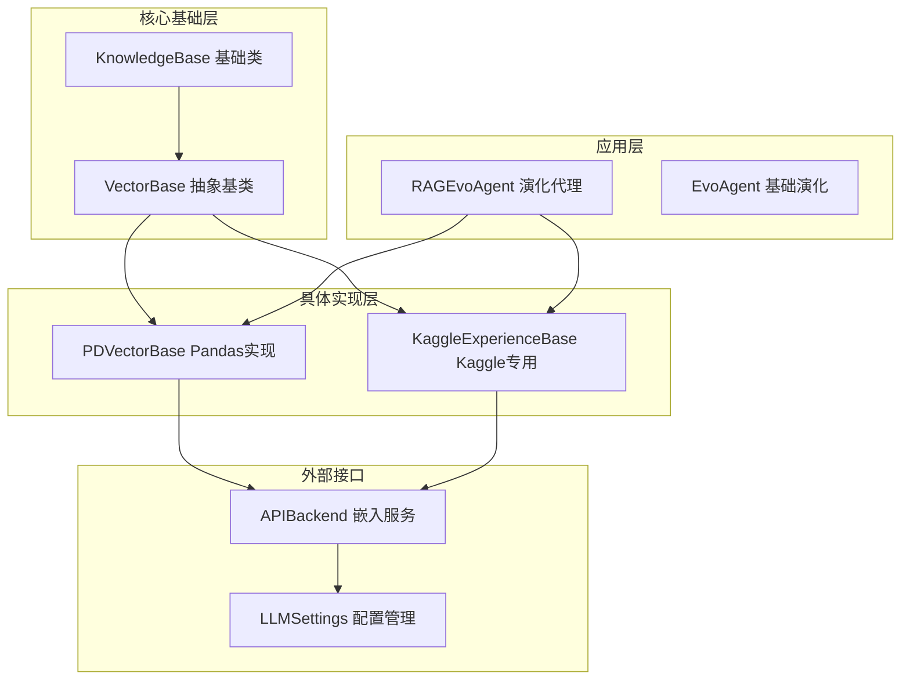
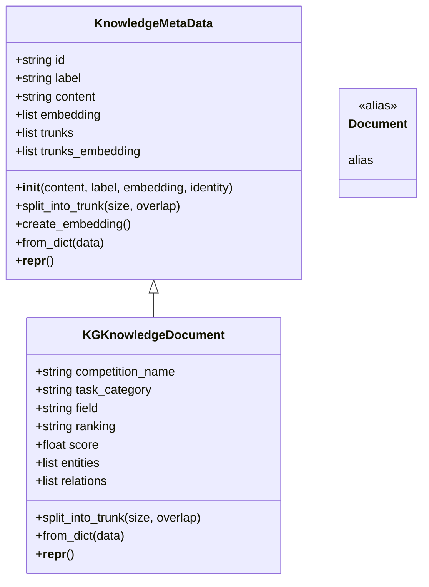
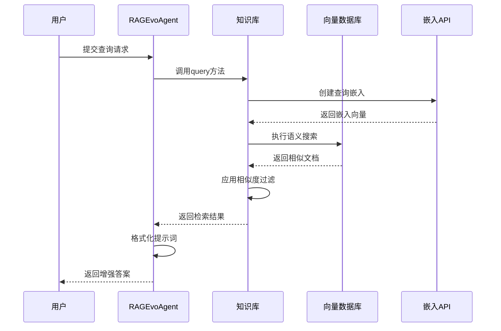
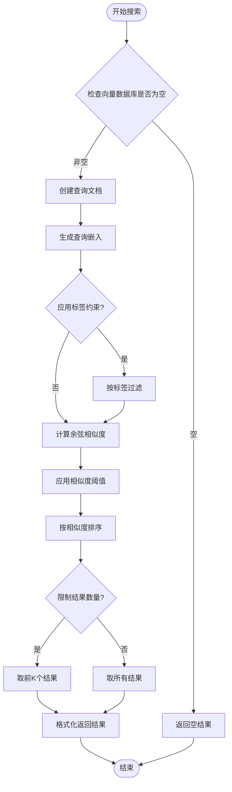
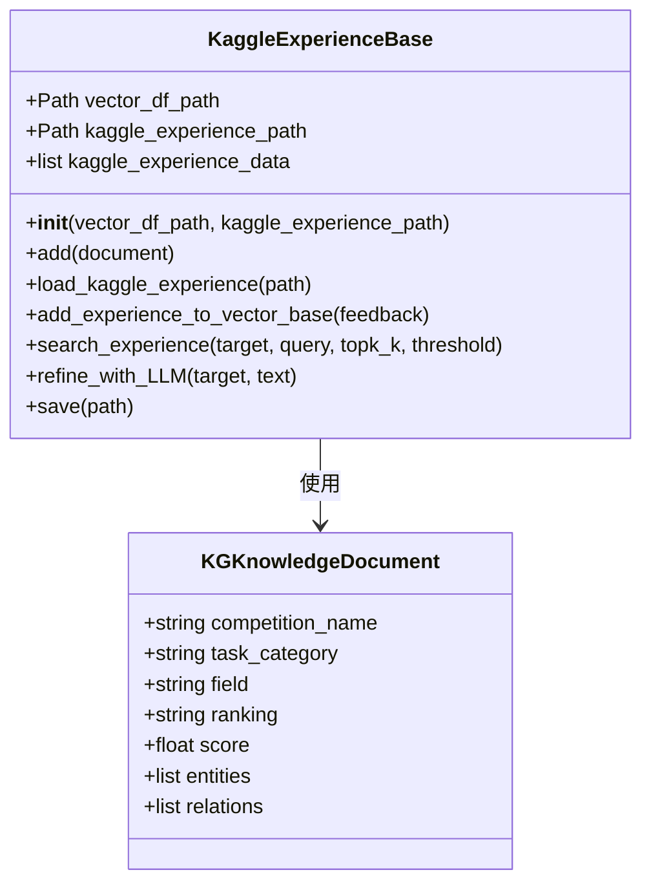
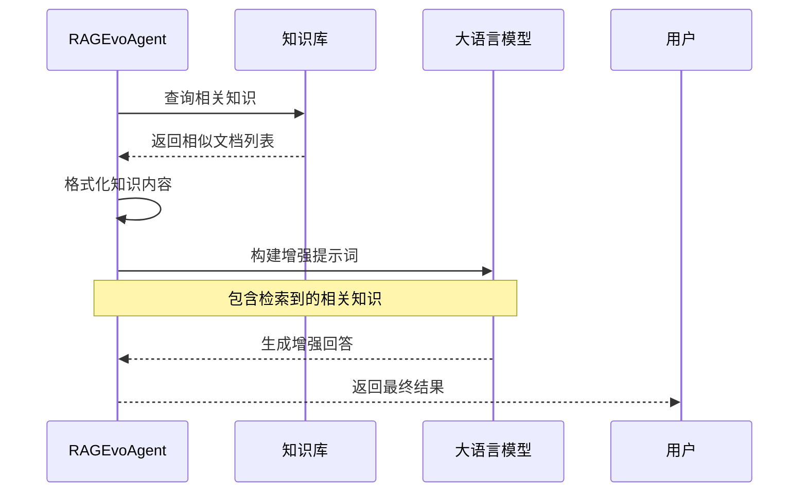
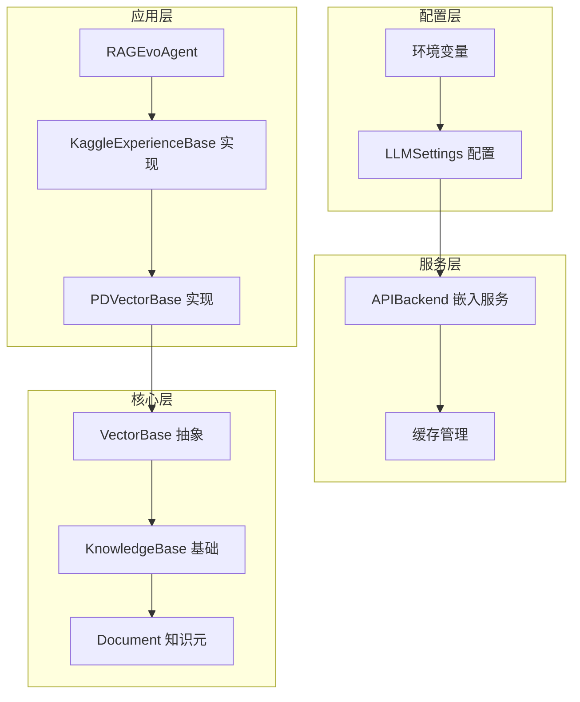

# 向量知识库

<cite>
**本文档中引用的文件**
- [vector_base.py](file://rdagent/components/knowledge_management/vector_base.py)
- [evolving_agent.py](file://rdagent/core/evolving_agent.py)
- [kaggle_vector_base.py](file://rdagent/scenarios/kaggle/knowledge_management/vector_base.py)
- [knowledge_base.py](file://rdagent/core/knowledge_base.py)
- [llm_conf.py](file://rdagent/oai/llm_conf.py)
- [embedding.py](file://rdagent/oai/utils/embedding.py)
- [kaggle_experiment.py](file://rdagent/scenarios/kaggle/experiment/kaggle_experiment.py)
</cite>

## 目录
1. [简介](#简介)
2. [项目结构](#项目结构)
3. [核心组件](#核心组件)
4. [架构概览](#架构概览)
5. [详细组件分析](#详细组件分析)
6. [依赖关系分析](#依赖关系分析)
7. [性能考虑](#性能考虑)
8. [故障排除指南](#故障排除指南)
9. [结论](#结论)

## 简介

RD-Agent的向量知识库系统是一个基于向量数据库的智能知识管理平台，专门设计用于存储、检索和利用历史实验、代码片段和反馈信息。该系统通过将非结构化文本转化为高维嵌入向量，实现了高效的语义相似性搜索，为机器学习和数据科学任务提供了强大的知识支撑。

系统的核心优势包括：
- **语义理解能力**：通过嵌入向量技术理解文本的深层含义
- **高效检索**：基于余弦相似度的快速向量搜索
- **多模态支持**：支持多种数据类型的嵌入表示
- **可扩展架构**：模块化设计便于集成新的向量数据库后端

## 项目结构

向量知识库系统采用分层架构设计，主要包含以下核心模块：

**图表来源**
- [knowledge_base.py](file://rdagent/core/knowledge_base.py#L1-L28)
- [vector_base.py](file://rdagent/components/knowledge_management/vector_base.py#L75-L100)
- [evolving_agent.py](file://rdagent/core/evolving_agent.py#L1-L50)

**章节来源**
- [knowledge_base.py](file://rdagent/core/knowledge_base.py#L1-L28)
- [vector_base.py](file://rdagent/components/knowledge_management/vector_base.py#L1-L209)

## 核心组件

### 知识元数据管理

系统的核心是`KnowledgeMetaData`类，它负责管理知识的基本属性和嵌入表示：

**图表来源**
- [vector_base.py](file://rdagent/components/knowledge_management/vector_base.py#L10-L50)
- [kaggle_vector_base.py](file://rdagent/scenarios/kaggle/knowledge_management/vector_base.py#L15-L80)

### 向量存储与检索

系统提供了两种主要的向量存储实现：

1. **PDVectorBase**：基于Pandas的数据框实现
2. **KaggleExperienceBase**：针对Kaggle竞赛场景优化的实现

**章节来源**
- [vector_base.py](file://rdagent/components/knowledge_management/vector_base.py#L101-L209)
- [kaggle_vector_base.py](file://rdagent/scenarios/kaggle/knowledge_management/vector_base.py#L85-L311)

## 架构概览

向量知识库系统采用多层架构，支持灵活的知识管理和检索：

**图表来源**
- [evolving_agent.py](file://rdagent/core/evolving_agent.py#L70-L90)
- [vector_base.py](file://rdagent/components/knowledge_management/vector_base.py#L140-L207)

## 详细组件分析

### 查询方法的语义相似性搜索

`PDVectorBase`的`search`方法实现了基于余弦相似度的语义搜索：

**图表来源**
- [vector_base.py](file://rdagent/components/knowledge_management/vector_base.py#L140-L207)

### Kaggle竞赛场景的特殊处理

`KaggleExperienceBase`针对Kaggle竞赛场景进行了专门优化：

**图表来源**
- [kaggle_vector_base.py](file://rdagent/scenarios/kaggle/knowledge_management/vector_base.py#L85-L150)

**章节来源**
- [kaggle_vector_base.py](file://rdagent/scenarios/kaggle/knowledge_management/vector_base.py#L215-L291)

### RAGEvoAgent的调用流程

在`RAGEvoAgent`中，向量知识库的检索结果被格式化并注入到LLM的提示词中：

**图表来源**
- [evolving_agent.py](file://rdagent/core/evolving_agent.py#L70-L90)

**章节来源**
- [evolving_agent.py](file://rdagent/core/evolving_agent.py#L50-L116)

## 依赖关系分析

系统的依赖关系展现了清晰的分层架构：

**图表来源**
- [llm_conf.py](file://rdagent/oai/llm_conf.py#L1-L50)
- [vector_base.py](file://rdagent/components/knowledge_management/vector_base.py#L1-L10)

**章节来源**
- [llm_conf.py](file://rdagent/oai/llm_conf.py#L1-L133)
- [vector_base.py](file://rdagent/components/knowledge_management/vector_base.py#L1-L209)

## 性能考虑

### 嵌入模型配置

系统支持多种嵌入模型，通过配置文件进行管理：

| 配置项 | 默认值 | 说明 |
|--------|--------|------|
| embedding_model | text-embedding-3-small | 嵌入模型名称 |
| embedding_max_length | 8192 | 最大输入长度 |
| embedding_max_str_num | 50 | 单次最大字符串数 |

### 相似度阈值优化

系统提供了灵活的相似度控制机制：

- **默认阈值**：0.0（无过滤）
- **推荐阈值**：0.1-0.3（平衡精度和召回率）
- **严格阈值**：0.5+（高质量但低召回）

### 分块策略

对于长文本，系统采用智能分块策略：

- **默认块大小**：1000字符
- **重叠长度**：0字符（可配置）
- **批量处理**：每次最多16个文本（OpenAI API限制）

## 故障排除指南

### 常见问题及解决方案

#### 1. 嵌入创建失败
**症状**：`create_embedding`方法抛出异常
**原因**：API密钥无效或网络连接问题
**解决**：检查`embedding_openai_api_key`配置

#### 2. 检索结果不相关
**症状**：搜索返回大量不相关文档
**原因**：相似度阈值设置过低
**解决**：提高`similarity_threshold`参数

#### 3. 性能问题
**症状**：搜索响应时间过长
**原因**：向量数据库过大或查询复杂度过高
**解决**：启用标签约束或减少搜索范围

**章节来源**
- [embedding.py](file://rdagent/oai/utils/embedding.py#L1-L95)
- [vector_base.py](file://rdagent/components/knowledge_management/vector_base.py#L140-L207)

## 结论

RD-Agent的向量知识库系统提供了一个强大而灵活的知识管理平台。通过将历史实验和经验转化为向量表示，系统能够智能地检索相关信息，显著提升机器学习项目的效率和质量。

### 主要优势

1. **语义理解**：超越关键词匹配的深度语义搜索
2. **可扩展性**：模块化设计支持多种向量数据库后端
3. **场景适配**：针对不同应用场景（如Kaggle竞赛）的专门优化
4. **性能优化**：智能分块和批量处理机制

### 发展方向

- 支持更多向量数据库后端（如FAISS、Milvus）
- 增强多模态知识表示能力
- 实现增量学习和知识更新机制
- 提供更丰富的知识图谱功能

这个向量知识库系统为RD-Agent提供了坚实的知识基础，使其能够在复杂的机器学习任务中做出更加明智的决策。