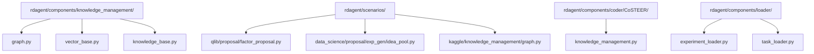
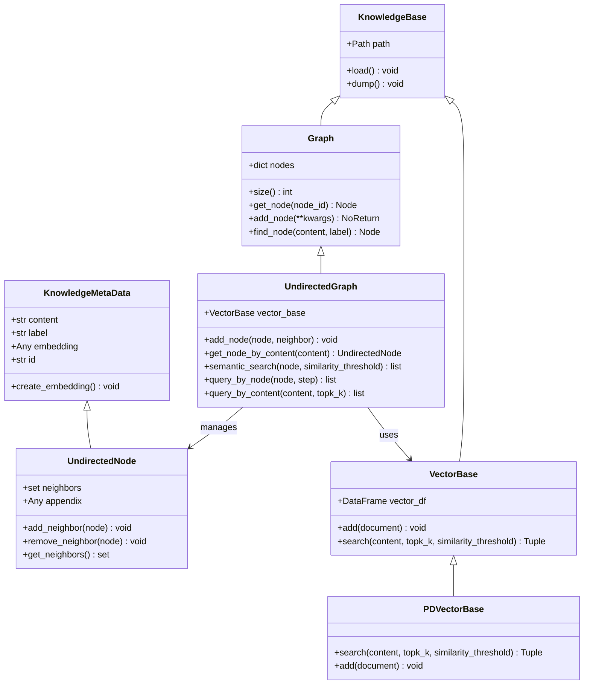
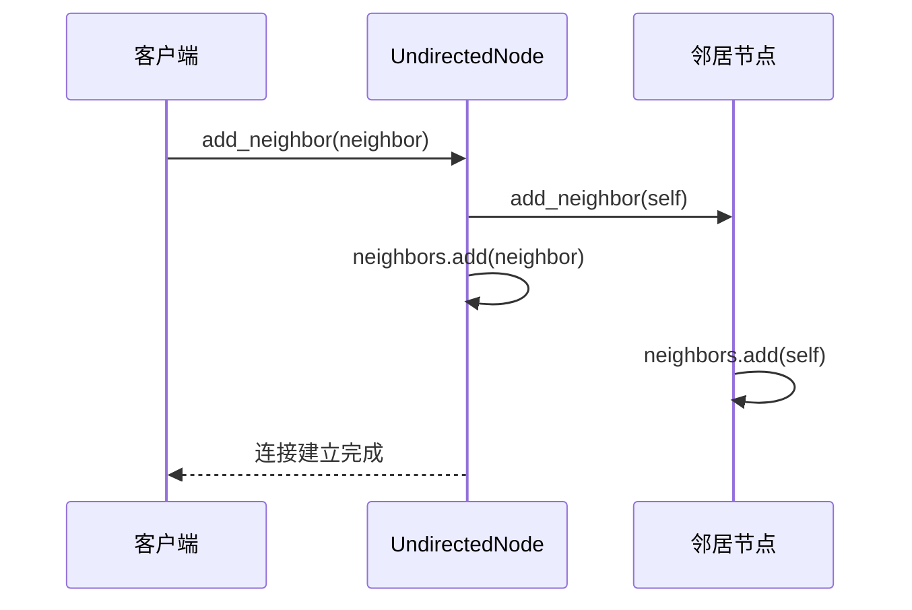
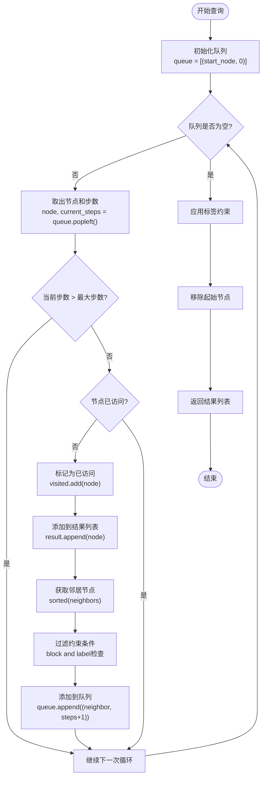
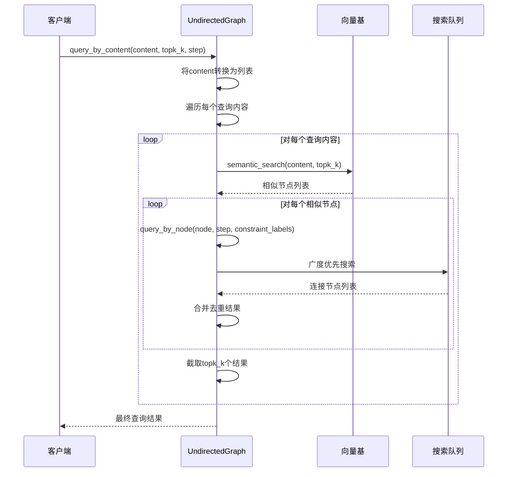
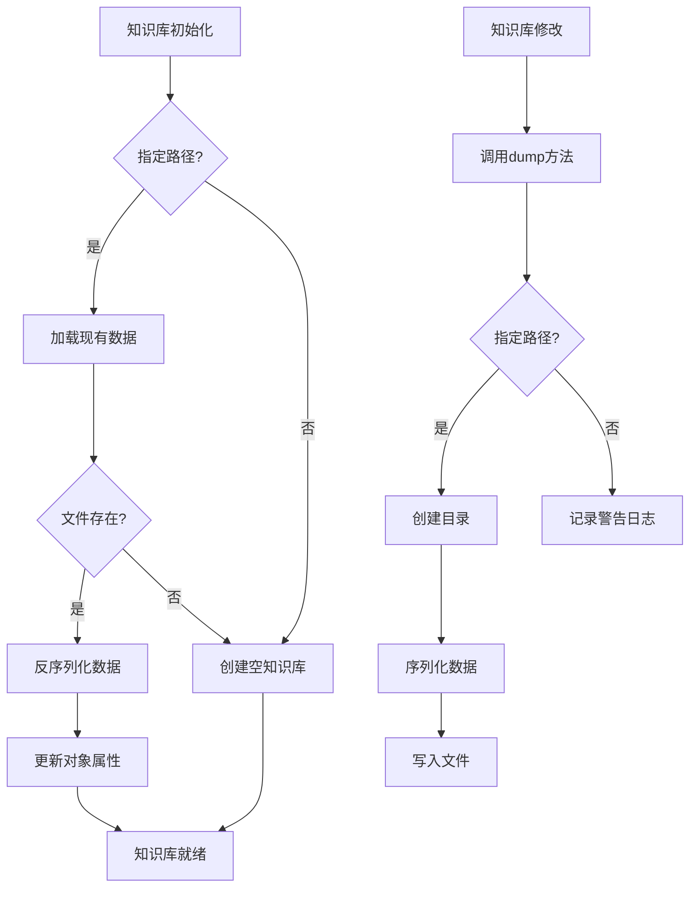
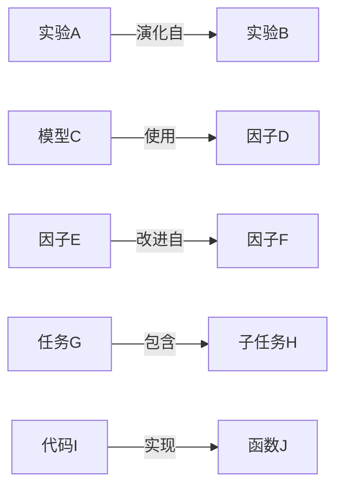
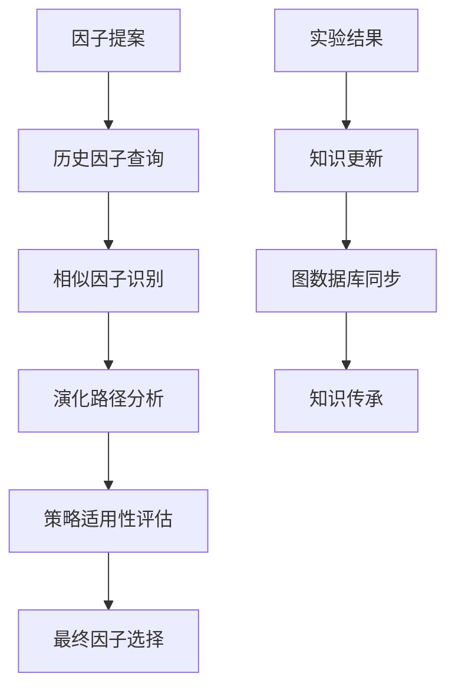

# 图知识库

<cite>
**本文档中引用的文件**
- [graph.py](file://rdagent/components/knowledge_management/graph.py)
- [knowledge_base.py](file://rdagent/core/knowledge_base.py)
- [vector_base.py](file://rdagent/components/knowledge_management/vector_base.py)
- [factor_proposal.py](file://rdagent/scenarios/qlib/proposal/factor_proposal.py)
- [knowledge_management.py](file://rdagent/components/coder/CoSTEER/knowledge_management.py)
- [experiment_loader.py](file://rdagent/components/loader/experiment_loader.py)
- [task_loader.py](file://rdagent/components/loader/task_loader.py)
</cite>

## 目录
1. [简介](#简介)
2. [项目结构](#项目结构)
3. [核心组件](#核心组件)
4. [架构概览](#架构概览)
5. [详细组件分析](#详细组件分析)
6. [图遍历与查询机制](#图遍历与查询机制)
7. [数据持久化与管理](#数据持久化与管理)
8. [自定义节点类型与关系](#自定义节点类型与关系)
9. [实际应用场景](#实际应用场景)
10. [性能考虑](#性能考虑)
11. [故障排除指南](#故障排除指南)
12. [结论](#结论)

## 简介

基于`graph.py`实现的图知识库是RD-Agent系统中的核心知识管理组件，它利用图结构（如NetworkX）建模实验、代码、因子和模型之间的复杂关系。该系统能够表示诸如"实验A演化自实验B"或"模型C使用了因子D"等复杂关系，并通过`query`方法执行图遍历操作，如查找祖先节点、最短路径等，以发现非语义层面的结构化关联。

图知识库的核心价值在于：
- **关系建模**：精确表示复杂的实体间关系
- **智能查询**：支持语义相似性和结构化路径查询
- **知识传承**：记录和重用成功的实验模式
- **演化追踪**：跟踪因子和模型的演进历史

## 项目结构

图知识库相关文件主要分布在以下目录结构中：



**图表来源**
- [graph.py](file://rdagent/components/knowledge_management/graph.py#L1-L50)
- [vector_base.py](file://rdagent/components/knowledge_management/vector_base.py#L1-L30)

**章节来源**
- [graph.py](file://rdagent/components/knowledge_management/graph.py#L1-L498)
- [knowledge_base.py](file://rdagent/core/knowledge_base.py#L1-L28)

## 核心组件

图知识库由三个核心组件构成，每个组件都有其特定的职责和功能：

### 1. 节点类（UndirectedNode）
节点类是图的基本组成单元，继承自`KnowledgeMetaData`，包含内容、标签、邻居集合等属性。

### 2. 图类（Graph）
图类提供了图的基本操作接口，包括节点添加、删除、查询等功能。

### 3. 向量基类（VectorBase）
向量基类负责语义搜索和嵌入计算，支持基于内容的相似性查询。

**章节来源**
- [graph.py](file://rdagent/components/knowledge_management/graph.py#L18-L81)
- [vector_base.py](file://rdagent/components/knowledge_management/vector_base.py#L1-L209)

## 架构概览

图知识库采用分层架构设计，确保了良好的可扩展性和维护性：



**图表来源**
- [graph.py](file://rdagent/components/knowledge_management/graph.py#L18-L180)
- [vector_base.py](file://rdagent/components/knowledge_management/vector_base.py#L15-L100)

## 详细组件分析

### UndirectedNode类分析

`UndirectedNode`类是图知识库的基础节点类，具有以下关键特性：

#### 核心属性
- **content**: 节点内容，字符串类型
- **label**: 节点标签，用于分类和过滤
- **neighbors**: 邻居节点集合，实现无向边连接
- **appendix**: 附加信息存储字段

#### 关键方法
- `add_neighbor()`: 添加邻居节点，建立双向连接
- `remove_neighbor()`: 移除邻居节点，断开连接
- `get_neighbors()`: 获取所有邻居节点



**图表来源**
- [graph.py](file://rdagent/components/knowledge_management/graph.py#L25-L40)

**章节来源**
- [graph.py](file://rdagent/components/knowledge_management/graph.py#L18-L81)

### UndirectedGraph类分析

`UndirectedGraph`类是图知识库的主要实现，提供了丰富的图操作功能：

#### 核心功能
- **节点管理**: 支持单个和批量节点添加
- **语义搜索**: 基于嵌入向量的内容相似性搜索
- **路径查询**: 支持多步距离的节点查询
- **交集运算**: 计算多个节点集合的交集

#### 查询方法详解

##### get_nodes_within_steps方法
该方法实现了广度优先搜索算法，用于查找指定距离内的所有节点：



**图表来源**
- [graph.py](file://rdagent/components/knowledge_management/graph.py#L195-L232)

**章节来源**
- [graph.py](file://rdagent/components/knowledge_management/graph.py#L119-L498)

## 图遍历与查询机制

图知识库的查询机制是其核心功能之一，支持多种查询模式：

### query_by_node方法

该方法基于节点连接关系进行查询，支持以下参数：
- **step**: 最大查询步数
- **constraint_labels**: 约束标签列表
- **constraint_node**: 约束节点
- **constraint_distance**: 约束距离阈值
- **block**: 是否仅允许特定标签的节点流动

### query_by_content方法

该方法结合语义相似性和连接关系进行查询：
1. 首先执行语义搜索，找到相似内容的节点
2. 然后基于连接关系筛选符合条件的节点
3. 支持批量内容查询



**图表来源**
- [graph.py](file://rdagent/components/knowledge_management/graph.py#L353-L434)

**章节来源**
- [graph.py](file://rdagent/components/knowledge_management/graph.py#L317-L434)

## 数据持久化与管理

图知识库采用基于pickle的数据持久化机制，确保知识的长期保存和恢复：

### 持久化流程



**图表来源**
- [knowledge_base.py](file://rdagent/core/knowledge_base.py#L10-L27)

### 自动更新机制

图数据库在实验成功后会自动更新，这一过程通常发生在以下场景：

1. **因子实验成功**：当因子实验获得显著收益时
2. **模型优化成功**：当模型性能达到预期标准时
3. **代码重构成功**：当代码改进带来性能提升时

**章节来源**
- [knowledge_base.py](file://rdagent/core/knowledge_base.py#L1-L28)

## 自定义节点类型与关系

图知识库支持灵活的节点类型定义和关系建模：

### 节点类型定义

系统支持多种预定义的节点标签：
- **IDEA**: 实验想法
- **COMPETITION**: 比赛名称
- **SCENARIO_PROBLEM**: 场景问题
- **FEEDBACK_PROBLEM**: 反馈问题
- **FACTOR**: 因子描述
- **MODEL**: 模型描述
- **CODE**: 代码片段
- **SUCCESS**: 成功标记

### 关系建模示例



**图表来源**
- [idea_pool.py](file://rdagent/scenarios/data_science/proposal/exp_gen/idea_pool.py#L76-L103)

### 自定义节点创建

开发者可以通过以下方式创建自定义节点：

```python
# 创建自定义节点
custom_node = UndirectedNode(
    content="自定义内容",
    label="CUSTOM_TYPE",
    appendix={"metadata": "额外信息"}
)

# 添加邻居关系
related_node = UndirectedNode(content="相关节点", label="RELATED")
custom_node.add_neighbor(related_node)
```

**章节来源**
- [idea_pool.py](file://rdagent/scenarios/data_science/proposal/exp_gen/idea_pool.py#L40-L103)

## 实际应用场景

### QLib因子提案场景

在QLib框架中，图知识库被用于因子的演化历史追踪和策略作用理解：

#### 因子演化追踪
通过图结构记录因子的演进过程，包括：
- 原始因子的提出
- 后续改进版本
- 不同场景下的应用
- 性能对比结果

#### 策略作用分析
图检索帮助代理理解因子在策略中的作用：
- 因子与其他因子的关联
- 因子在不同时间周期的表现
- 因子与市场特征的关系



**图表来源**
- [factor_proposal.py](file://rdagent/scenarios/qlib/proposal/factor_proposal.py#L1-L133)

**章节来源**
- [factor_proposal.py](file://rdagent/scenarios/qlib/proposal/factor_proposal.py#L1-L133)

## 性能考虑

### 嵌入计算优化
- 批量处理：每次最多处理16个内容项
- 缓存机制：避免重复计算相同内容的嵌入
- 异步处理：支持并发嵌入计算

### 查询性能优化
- 索引机制：基于标签的快速过滤
- 距离缓存：避免重复的距离计算
- 分层查询：先语义后结构的查询策略

### 内存管理
- 懒加载：按需加载节点和嵌入
- 垃圾回收：及时清理无用的临时对象
- 分页处理：大数据集的分批处理

## 故障排除指南

### 常见问题及解决方案

#### 1. 图数据库加载失败
**症状**: 初始化时无法加载现有数据
**原因**: 文件损坏或格式不匹配
**解决**: 检查文件完整性，必要时重建知识库

#### 2. 查询结果为空
**症状**: 查询返回空列表
**原因**: 
- 相似度阈值设置过高
- 约束条件过于严格
- 图数据库为空

**解决**: 
- 降低相似度阈值
- 松弛约束条件
- 检查数据导入

#### 3. 性能问题
**症状**: 查询响应缓慢
**原因**: 
- 图规模过大
- 嵌入计算密集
- 内存不足

**解决**: 
- 使用索引优化
- 减少查询深度
- 增加内存分配

**章节来源**
- [graph.py](file://rdagent/components/knowledge_management/graph.py#L83-L117)

## 结论

基于`graph.py`实现的图知识库为RD-Agent系统提供了强大的知识管理和推理能力。通过精心设计的图结构和查询机制，它能够有效建模复杂的实体关系，支持智能的知识检索和传承。

### 主要优势
1. **灵活的关系建模**：支持多种类型的节点和关系
2. **强大的查询能力**：结合语义和结构化查询
3. **自动化的知识更新**：实验成功后自动更新知识库
4. **可靠的数据持久化**：基于pickle的稳定存储机制

### 应用前景
图知识库在自动化机器学习、因子挖掘、模型优化等领域具有广阔的应用前景，为智能决策提供了坚实的理论基础和技术支撑。