# 性能监控

<cite>
**本文档引用的文件**
- [performance.py](file://rdagent/utils/performance.py)
- [benchmark.py](file://rdagent/utils/benchmark.py)
- [timer.py](file://rdagent/log/timer.py)
- [health_check.py](file://rdagent/app/utils/health_check.py)
- [logger.py](file://rdagent/log/logger.py)
- [storage.py](file://rdagent/log/storage.py)
- [base.py](file://rdagent/log/base.py)
- [ds_trace.py](file://rdagent/log/ui/ds_trace.py)
- [web.py](file://rdagent/log/ui/web.py)
- [utils.py](file://rdagent/log/ui/utils.py)
- [app.py](file://rdagent/log/ui/app.py)
- [ds_summary.py](file://rdagent/log/ui/ds_summary.py)
</cite>

## 目录
1. [简介](#简介)
2. [项目架构概览](#项目架构概览)
3. [核心性能监控组件](#核心性能监控组件)
4. [详细组件分析](#详细组件分析)
5. [监控系统架构](#监控系统架构)
6. [性能基准测试](#性能基准测试)
7. [健康检查系统](#健康检查系统)
8. [日志与追踪系统](#日志与追踪系统)
9. [实时监控仪表板](#实时监控仪表板)
10. [性能优化策略](#性能优化策略)
11. [故障排除指南](#故障排除指南)
12. [总结](#总结)

## 简介

RD-Agent 是一个先进的研究开发代理系统，内置了完整的性能监控体系。该系统提供了多层次的性能监控功能，包括实时性能指标收集、基准测试、健康检查、日志追踪和可视化仪表板。通过这些组件的协同工作，系统能够全面监控应用程序的性能表现，及时发现性能瓶颈，并提供优化建议。

## 项目架构概览

RD-Agent 的性能监控系统采用分层架构设计，包含以下主要层次：

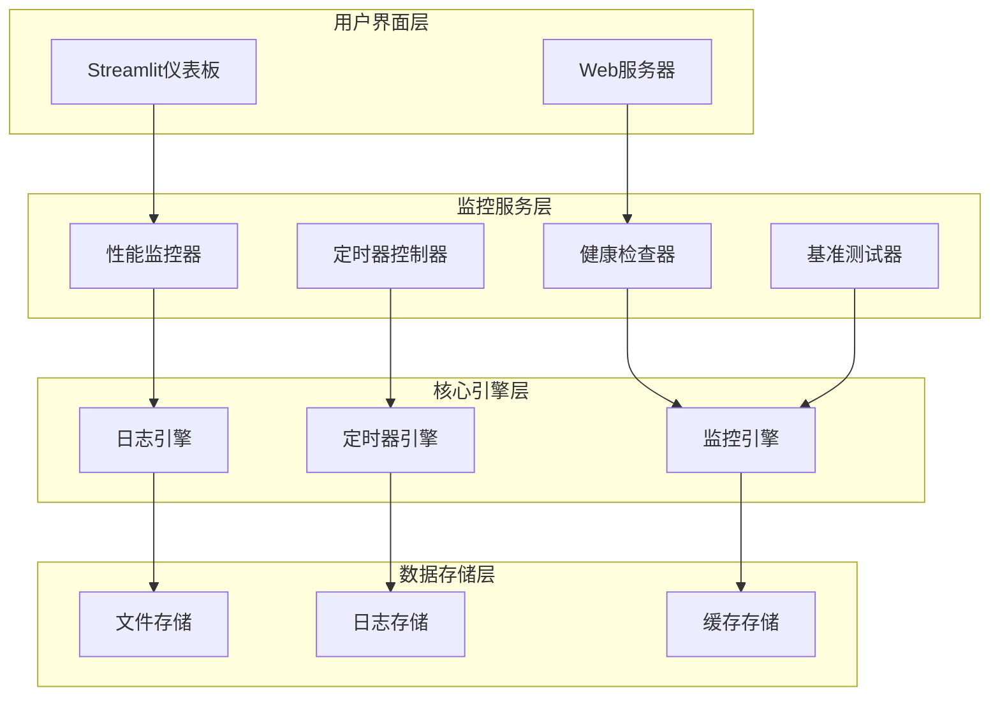

**图表来源**
- [performance.py](file://rdagent/utils/performance.py#L13-L146)
- [timer.py](file://rdagent/log/timer.py#L8-L87)
- [logger.py](file://rdagent/log/logger.py#L26-L137)

## 核心性能监控组件

### 性能监控器 (PerformanceMonitor)

性能监控器是系统的核心组件，提供函数级别的性能测量和指标收集功能。

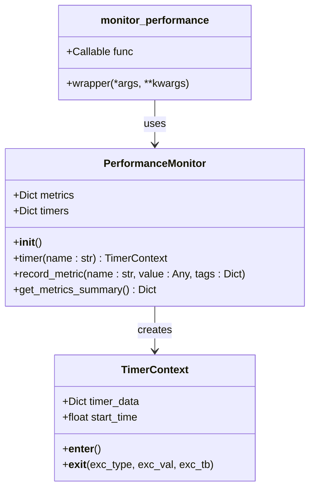

**图表来源**
- [performance.py](file://rdagent/utils/performance.py#L13-L146)

**章节来源**
- [performance.py](file://rdagent/utils/performance.py#L1-L146)

### 定时器系统 (RDAgentTimer)

定时器系统提供精确的时间管理和超时控制功能，支持多种时间单位和动态调整。

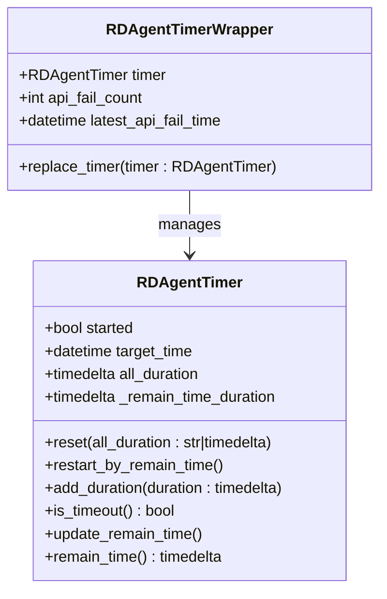

**图表来源**
- [timer.py](file://rdagent/log/timer.py#L8-L87)

**章节来源**
- [timer.py](file://rdagent/log/timer.py#L1-L87)

## 详细组件分析

### 性能监控器深度分析

性能监控器提供了两种使用模式：装饰器模式和手动模式。

#### 装饰器模式
```python
@monitor_performance
def my_function():
    time.sleep(0.1)
    return "completed"
```

#### 手动模式
```python
monitor = PerformanceMonitor()
with monitor.timer("my_function"):
    # 执行代码
    pass
```

#### 关键特性
- **多维度指标收集**：支持最小值、最大值、平均值、中位数、95%分位数等统计指标
- **上下文管理器支持**：支持嵌套计时和资源清理
- **异常处理**：自动记录执行过程中的异常信息
- **标签系统**：支持为指标添加自定义标签进行分类

**章节来源**
- [performance.py](file://rdagent/utils/performance.py#L13-L146)

### 基准测试系统

基准测试系统提供了标准化的性能评估功能，支持多轮测试和结果比较。

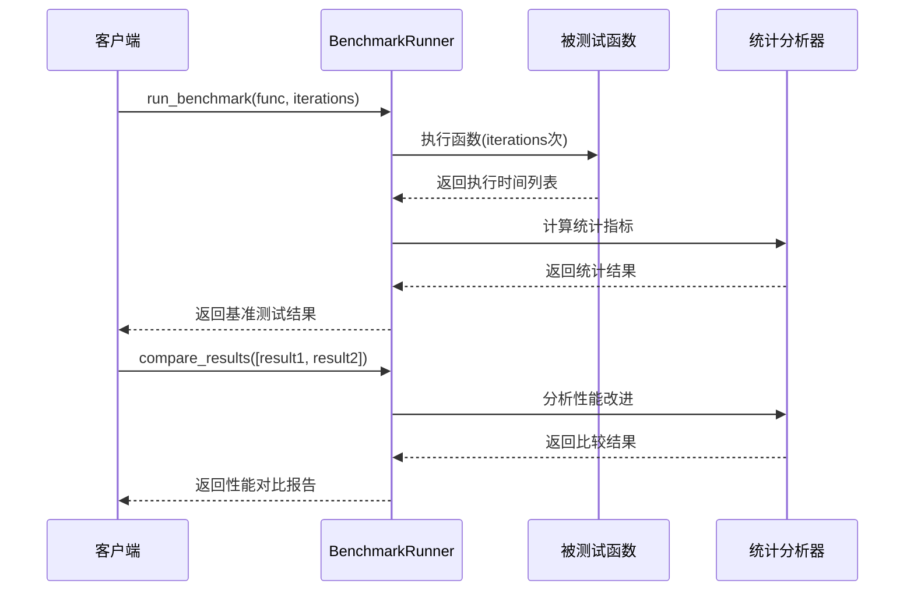

**图表来源**
- [benchmark.py](file://rdagent/utils/benchmark.py#L13-L109)

#### 基准测试指标
- **基础指标**：最小值、最大值、平均值、中位数
- **分布指标**：95%分位数、99%分位数、标准差
- **性能比较**：百分比改善/恶化分析

**章节来源**
- [benchmark.py](file://rdagent/utils/benchmark.py#L1-L109)

### 健康检查系统

健康检查系统确保系统各组件正常运行，提供多维度的系统状态检测。

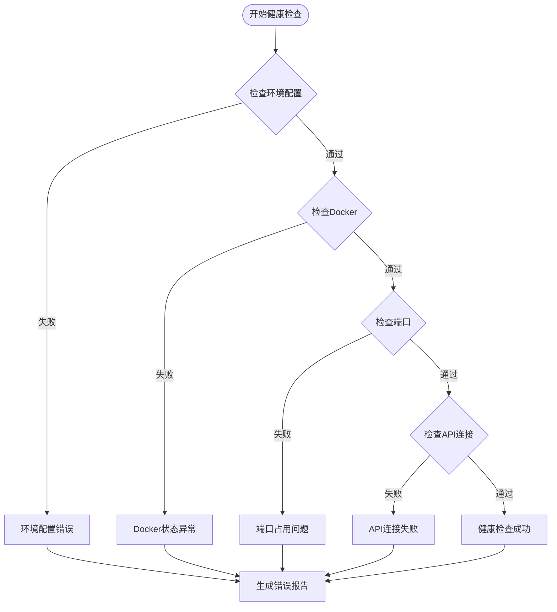

**图表来源**
- [health_check.py](file://rdagent/app/utils/health_check.py#L137-L171)

#### 健康检查项目
- **环境配置检查**：API密钥、模型配置验证
- **Docker状态检查**：容器运行状态和可用性
- **端口占用检查**：默认端口19899的可用性
- **网络连接检查**：LLM API连接测试

**章节来源**
- [health_check.py](file://rdagent/app/utils/health_check.py#L1-L171)

## 监控系统架构

### 数据流架构

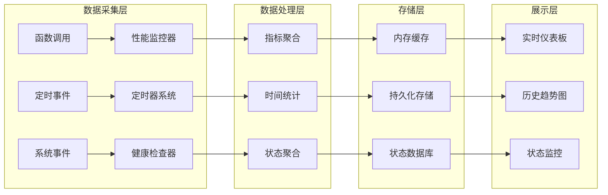

**图表来源**
- [logger.py](file://rdagent/log/logger.py#L26-L137)
- [storage.py](file://rdagent/log/storage.py#L28-L117)

### 存储架构

系统采用分层存储架构，支持多种存储格式和访问模式。

```mermaid
erDiagram
FileStorage {
Path path
str log_pattern
}
Message {
str tag
str level
datetime timestamp
str caller
str pid_trace
object content
}
Storage {
log(obj, tag, timestamp)
iter_msg(tag, pattern)
truncate(time)
}
View {
display(storage, watch)
}
FileStorage ||--|| Storage : implements
FileStorage ||--o{ Message : stores
View ||--|| Storage : consumes
```

**图表来源**
- [storage.py](file://rdagent/log/storage.py#L28-L117)
- [base.py](file://rdagent/log/base.py#L11-L104)

**章节来源**
- [storage.py](file://rdagent/log/storage.py#L1-L117)
- [base.py](file://rdagent/log/base.py#L1-L104)

## 性能基准测试

### 基准测试框架

基准测试系统提供了完整的性能评估解决方案，支持多种测试场景和分析维度。

#### 测试流程
1. **预热阶段**：初始化测试环境和依赖
2. **执行阶段**：重复执行被测函数指定次数
3. **统计阶段**：计算各项性能指标
4. **比较阶段**：与基线结果进行对比分析

#### 性能指标分析
- **执行时间分析**：提供详细的分布统计
- **吞吐量评估**：每秒执行次数计算
- **资源消耗监控**：CPU、内存使用情况
- **稳定性评估**：方差和变异系数分析

**章节来源**
- [benchmark.py](file://rdagent/utils/benchmark.py#L13-L109)

## 健康检查系统

### 多维度健康检查

健康检查系统提供全面的系统状态监控，确保各组件正常运行。

#### 检查项目详解

| 检查项目 | 描述 | 失败影响 | 解决方案 |
|---------|------|---------|---------|
| 环境配置 | API密钥、模型设置验证 | 功能受限 | 检查.env文件配置 |
| Docker状态 | 容器运行环境检查 | 容器相关功能不可用 | 重启Docker服务 |
| 端口占用 | 默认端口19899可用性 | UI无法启动 | 更换端口或停止占用进程 |
| API连接 | LLM服务连接测试 | AI功能失效 | 检查网络和API配置 |

#### 错误处理机制
- **优雅降级**：部分功能失效时的备用方案
- **重试机制**：临时性故障的自动恢复
- **告警通知**：严重问题的及时通知
- **诊断信息**：详细的错误原因说明

**章节来源**
- [health_check.py](file://rdagent/app/utils/health_check.py#L137-L171)

## 日志与追踪系统

### 结构化日志系统

日志系统采用结构化设计，支持多级别、多格式的日志输出和存储。

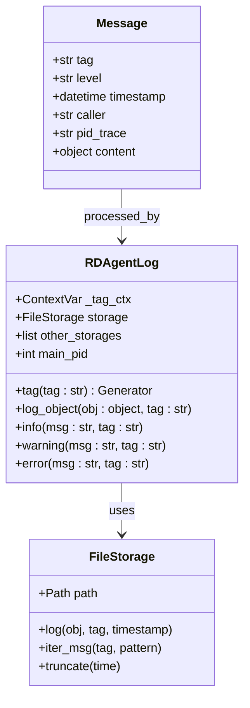

**图表来源**
- [logger.py](file://rdagent/log/logger.py#L26-L137)
- [storage.py](file://rdagent/log/storage.py#L28-L117)

#### 日志标签系统
- **层级结构**：支持多级标签组织
- **进程追踪**：完整的PID链追踪
- **时间戳精度**：微秒级时间戳记录
- **调用者信息**：精确到函数行号的调用栈

#### 存储格式支持
- **JSON格式**：结构化数据存储
- **二进制格式**：高性能序列化存储
- **文本格式**：可读性日志记录

**章节来源**
- [logger.py](file://rdagent/log/logger.py#L1-L137)
- [storage.py](file://rdagent/log/storage.py#L1-L117)

## 实时监控仪表板

### Streamlit可视化界面

监控仪表板提供实时的性能数据展示和交互式分析功能。

#### 仪表板组件

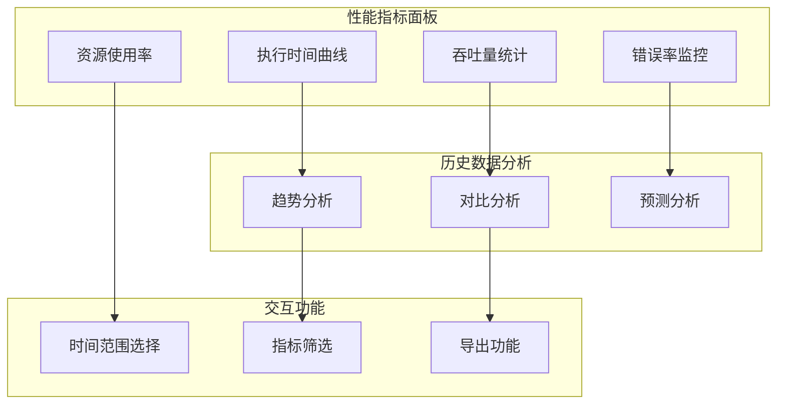

**图表来源**
- [app.py](file://rdagent/log/ui/app.py#L361-L624)
- [ds_summary.py](file://rdagent/log/ui/ds_summary.py#L1-L208)

#### 关键监控指标

| 指标类型 | 具体指标 | 展示方式 | 告警阈值 |
|---------|---------|---------|---------|
| 执行时间 | 函数执行耗时 | 折线图、柱状图 | >平均值×1.5 |
| 吞吐量 | 每秒请求数 | 实时计数器 | <预期值×0.8 |
| 错误率 | 异常发生比例 | 百分比图表 | >5% |
| 资源使用 | CPU、内存占用 | 仪表盘 | >80% |

#### 实时数据更新
- **WebSocket连接**：实时推送新数据
- **自动刷新**：定期更新统计数据
- **增量更新**：只传输变化的数据
- **缓存机制**：避免重复计算

**章节来源**
- [app.py](file://rdagent/log/ui/app.py#L1-L624)
- [ds_summary.py](file://rdagent/log/ui/ds_summary.py#L1-L208)

## 性能优化策略

### 多层缓存架构

系统实现了多层缓存策略，显著提升性能表现。

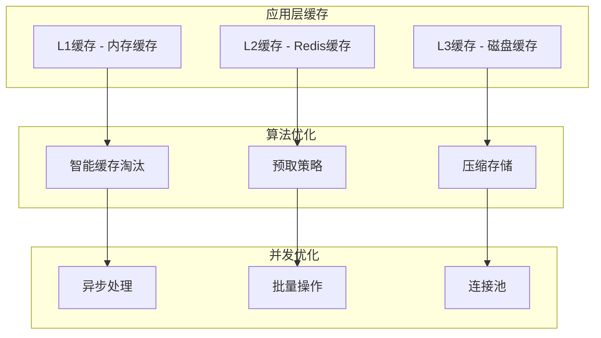

#### 缓存策略详解

| 缓存层级 | 存储介质 | 生命周期 | 适用场景 |
|---------|---------|---------|---------|
| L1缓存 | 内存 | 秒级 | 频繁访问的小数据 |
| L2缓存 | Redis | 分钟级 | 中等频率访问数据 |
| L3缓存 | 磁盘 | 小时级 | 大型数据集缓存 |

#### 性能优化技术
- **懒加载**：按需加载数据
- **预加载**：预测性数据加载
- **压缩存储**：减少存储空间占用
- **批量处理**：减少I/O操作次数

**章节来源**
- [utils.py](file://rdagent/log/ui/utils.py#L1-L200)

### 异步处理机制

系统采用异步处理架构，提高并发性能和响应速度。

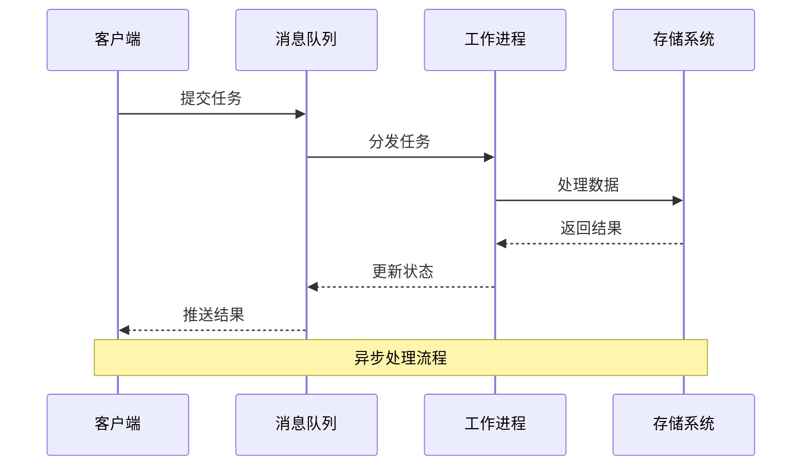

#### 异步处理优势
- **非阻塞操作**：避免长时间等待
- **资源利用率**：充分利用系统资源
- **响应速度**：即时返回任务状态
- **可扩展性**：支持水平扩展

## 故障排除指南

### 常见性能问题

#### 性能瓶颈识别

| 问题类型 | 症状表现 | 检查方法 | 解决方案 |
|---------|---------|---------|---------|
| CPU过载 | 响应缓慢、超时 | 查看CPU使用率 | 优化算法、增加资源 |
| 内存泄漏 | 内存持续增长 | 监控内存使用 | 修复内存泄漏、增加限制 |
| I/O阻塞 | 数据读取缓慢 | 分析I/O等待时间 | 使用异步I/O、优化存储 |
| 网络延迟 | API响应慢 | 网络监控工具 | 优化网络配置、CDN加速 |

#### 监控指标异常处理

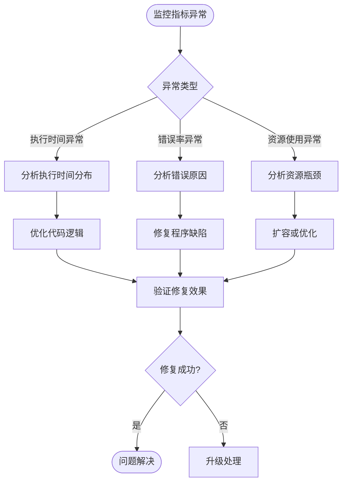

### 调试工具和技巧

#### 性能分析工具
- **内置性能监控器**：实时函数性能测量
- **基准测试器**：标准化性能评估
- **定时器系统**：精确时间测量
- **日志分析**：详细的执行轨迹追踪

#### 调试最佳实践
- **渐进式调试**：从简单到复杂逐步排查
- **隔离测试**：单独测试可疑组件
- **基准对比**：与历史数据对比分析
- **监控告警**：建立完善的监控体系

**章节来源**
- [ds_trace.py](file://rdagent/log/ui/ds_trace.py#L701-L721)

## 总结

RD-Agent 的性能监控系统是一个功能完整、设计精良的综合性监控解决方案。通过多层次的监控组件、实时的数据分析和直观的可视化界面，系统能够全面掌握应用程序的性能表现，及时发现和解决问题。

### 系统优势

1. **全面性**：涵盖性能监控、健康检查、日志追踪等多个方面
2. **实时性**：提供实时监控和即时告警功能
3. **可扩展性**：支持自定义监控指标和扩展新的监控组件
4. **易用性**：提供直观的可视化界面和详细的诊断信息
5. **可靠性**：具备完善的错误处理和容错机制

### 应用价值

- **开发阶段**：帮助开发者快速定位性能问题和优化方向
- **测试阶段**：提供标准化的性能评估和回归测试
- **生产环境**：确保系统稳定运行和及时故障响应
- **运维管理**：提供全面的系统状态监控和性能分析

通过持续的监控和优化，RD-Agent 的性能监控系统能够为用户提供高质量、高可靠性的研究开发体验，是现代AI应用不可或缺的重要组成部分。