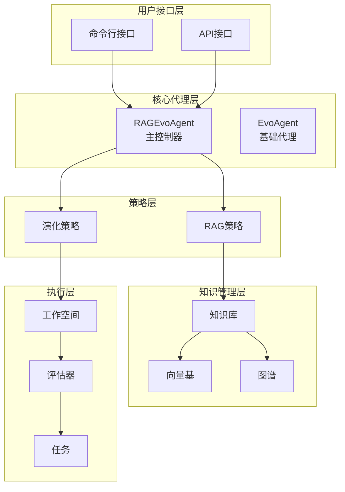
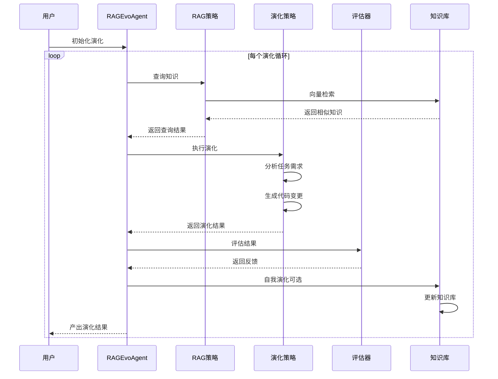
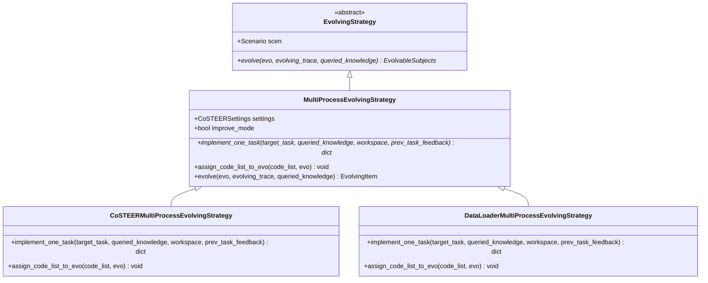
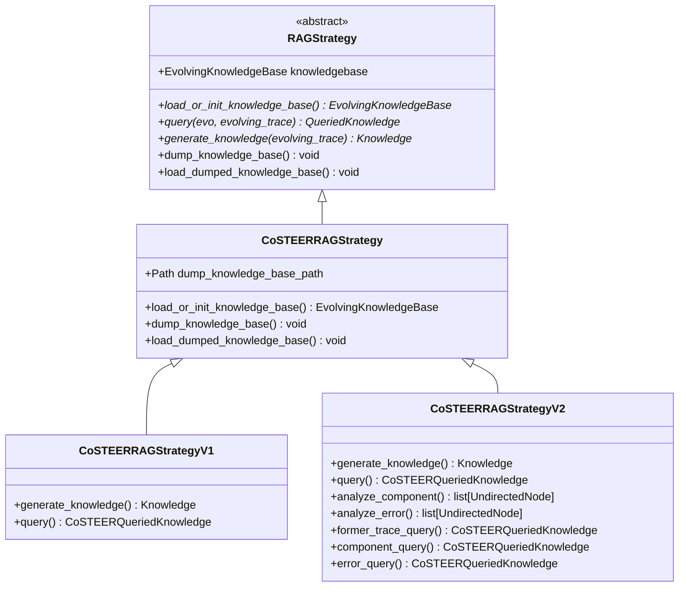
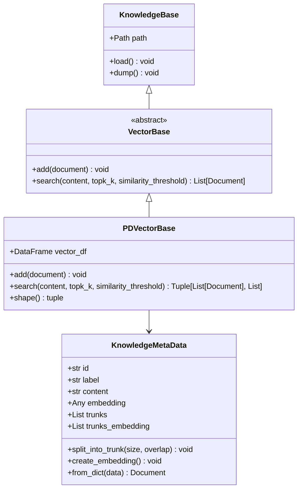
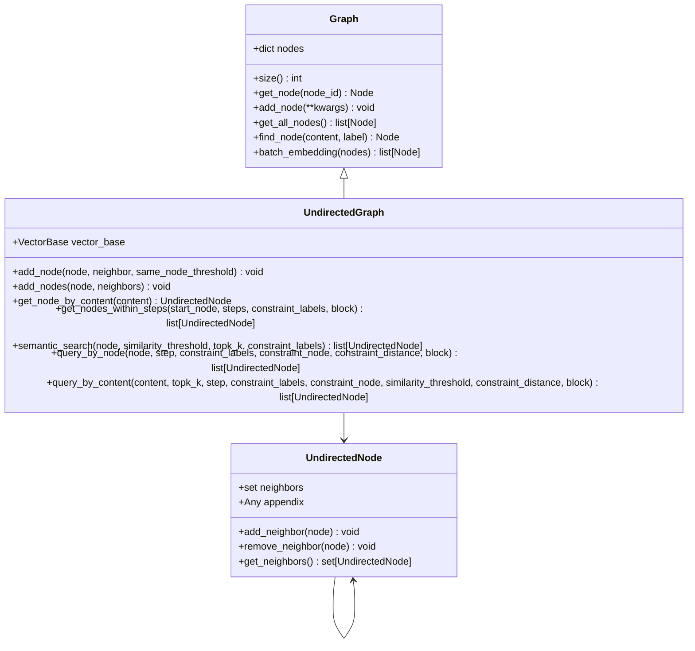
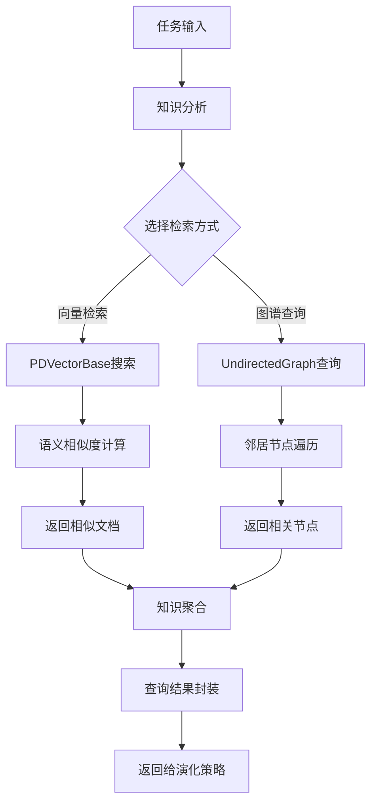
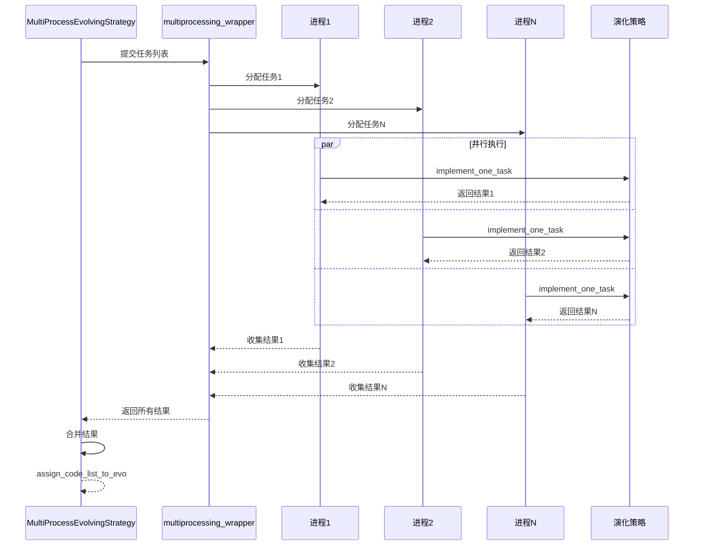
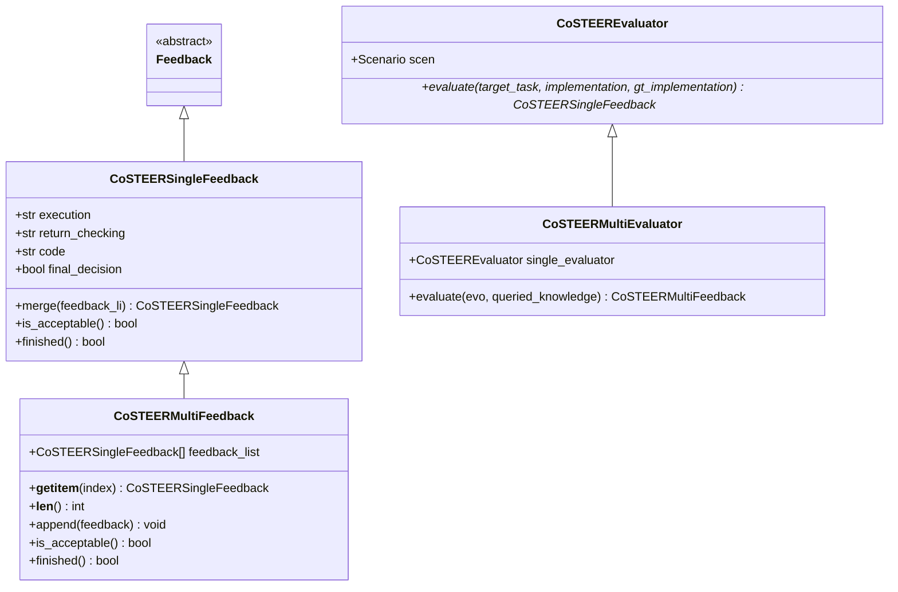
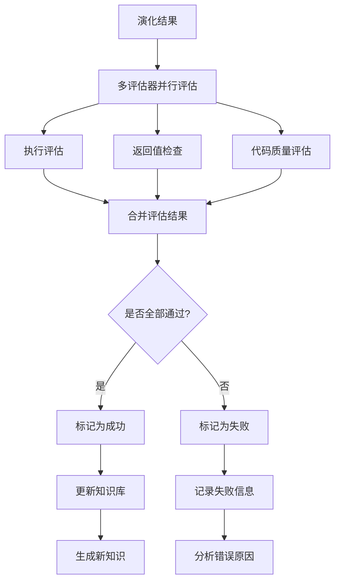

# 核心功能详解

<cite>
**本文档中引用的文件**
- [evolving_agent.py](file://rdagent/core/evolving_agent.py)
- [evolving_framework.py](file://rdagent/core/evolving_framework.py)
- [knowledge_management.py](file://rdagent/components/coder/CoSTEER/knowledge_management.py)
- [vector_base.py](file://rdagent/components/knowledge_management/vector_base.py)
- [graph.py](file://rdagent/components/knowledge_management/graph.py)
- [knowledge_base.py](file://rdagent/core/knowledge_base.py)
- [__init__.py](file://rdagent/components/coder/CoSTEER/__init__.py)
- [evolving_strategy.py](file://rdagent/components/coder/CoSTEER/evolving_strategy.py)
- [config.py](file://rdagent/components/coder/CoSTEER/config.py)
- [task.py](file://rdagent/components/coder/CoSTEER/task.py)
- [evaluators.py](file://rdagent/components/coder/CoSTEER/evaluators.py)
- [experiment.py](file://rdagent/core/experiment.py)
</cite>

## 目录
1. [引言](#引言)
2. [系统架构概览](#系统架构概览)
3. [RAGEvoAgent核心循环](#ragevoagent核心循环)
4. [EvolvingStrategy抽象设计](#evolvingstrategy抽象设计)
5. [RAG策略实现](#rag策略实现)
6. [知识管理系统](#知识管理系统)
7. [多进程演化策略](#多进程演化策略)
8. [评估与反馈机制](#评估与反馈机制)
9. [性能优化与并发控制](#性能优化与并发控制)
10. [总结](#总结)

## 引言

RD-Agent是一个基于检索增强生成（RAG）和演化策略的智能代码生成系统，其核心功能围绕`RAGEvoAgent`展开。该系统通过协调知识检索（RAGStrategy）和代码演化（EvolvingStrategy），实现了智能化的代码生成和优化过程。本文档深入剖析了这些核心组件的设计理念、实现细节和相互协作机制。

## 系统架构概览

RD-Agent采用分层架构设计，主要包含以下核心层次：



**图表来源**
- [evolving_agent.py](file://rdagent/core/evolving_agent.py#L48-L116)
- [evolving_framework.py](file://rdagent/core/evolving_framework.py#L63-L127)

**章节来源**
- [evolving_agent.py](file://rdagent/core/evolving_agent.py#L1-L116)
- [evolving_framework.py](file://rdagent/core/evolving_framework.py#L1-L128)

## RAGEvoAgent核心循环

`RAGEvoAgent`是RD-Agent的核心控制器，负责协调整个演化过程。其`multistep_evolve`方法实现了七步循环，每个步骤都有明确的职责和输入输出。

### 多步演化流程



**图表来源**
- [evolving_agent.py](file://rdagent/core/evolving_agent.py#L82-L114)

### 循环步骤详解

1. **知识检索阶段**：调用RAG策略查询相关知识
2. **代码演化阶段**：执行演化策略生成新代码
3. **结果封装**：将演化结果封装为EvoStep对象
4. **评估反馈**：运行评估器获得反馈
5. **轨迹更新**：更新演化轨迹记录
6. **知识自我演化**：根据反馈更新知识库
7. **完成检查**：判断是否达到终止条件

**章节来源**
- [evolving_agent.py](file://rdagent/core/evolving_agent.py#L82-L114)

## EvolvingStrategy抽象设计

`EvolvingStrategy`定义了代码演化的抽象接口，为不同的演化算法提供了统一的规范。

### 抽象类结构



**图表来源**
- [evolving_framework.py](file://rdagent/core/evolving_framework.py#L63-L75)
- [evolving_strategy.py](file://rdagent/components/coder/CoSTEER/evolving_strategy.py#L18-L134)

### evolve方法实现模式

所有具体的演化策略都遵循相同的实现模式：

```python
def evolve(self, *, evo: EvolvingItem, queried_knowledge: QueriedKnowledge, evolving_trace: list[EvoStep]) -> EvolvingItem:
    # 1. 分析查询到的知识
    # 2. 确定需要演化的任务
    # 3. 并行处理任务
    # 4. 应用代码变更
    # 5. 返回演化后的工作空间
```

**章节来源**
- [evolving_framework.py](file://rdagent/core/evolving_framework.py#L63-L75)
- [evolving_strategy.py](file://rdagent/components/coder/CoSTEER/evolving_strategy.py#L67-L134)

## RAG策略实现

RAG策略负责知识检索和管理，是连接外部知识库和演化过程的关键桥梁。

### RAG策略架构



**图表来源**
- [evolving_framework.py](file://rdagent/core/evolving_framework.py#L77-L127)
- [knowledge_management.py](file://rdagent/components/coder/CoSTEER/knowledge_management.py#L50-L964)

### 知识查询机制

RAG策略支持多种查询方式：

1. **历史轨迹查询**：查找类似任务的成功实现
2. **组件分析查询**：基于任务描述分析相关组件
3. **错误分析查询**：针对特定错误类型的知识检索

**章节来源**
- [knowledge_management.py](file://rdagent/components/coder/CoSTEER/knowledge_management.py#L400-L964)

## 知识管理系统

RD-Agent采用了混合知识管理策略，结合向量检索和图谱查询两种方式。

### 向量检索系统



**图表来源**
- [vector_base.py](file://rdagent/components/knowledge_management/vector_base.py#L15-L208)
- [knowledge_base.py](file://rdagent/core/knowledge_base.py#L8-L27)

### 图谱查询系统



**图表来源**
- [graph.py](file://rdagent/components/knowledge_management/graph.py#L40-L497)

### 知识存储与检索流程



**图表来源**
- [vector_base.py](file://rdagent/components/knowledge_management/vector_base.py#L150-L208)
- [graph.py](file://rdagent/components/knowledge_management/graph.py#L200-L497)

**章节来源**
- [vector_base.py](file://rdagent/components/knowledge_management/vector_base.py#L1-L209)
- [graph.py](file://rdagent/components/knowledge_management/graph.py#L1-L498)
- [knowledge_base.py](file://rdagent/core/knowledge_base.py#L1-L28)

## 多进程演化策略

为了提高演化效率，系统采用了多进程并行处理机制。

### 并行处理架构



**图表来源**
- [evolving_strategy.py](file://rdagent/components/coder/CoSTEER/evolving_strategy.py#L85-L105)

### 任务调度策略

系统根据任务状态智能调度：

```python
# 1. 找出需要演化的任务
to_be_finished_task_index = []
for index, target_task in enumerate(evo.sub_tasks):
    target_task_desc = target_task.get_task_information()
    if target_task_desc in queried_knowledge.success_task_to_knowledge_dict:
        # 已成功实现的任务直接使用缓存
        code_list[index] = queried_knowledge.success_task_to_knowledge_dict[target_task_desc].implementation.file_dict
    else:
        # 调度未完成的任务
        if target_task_desc not in queried_knowledge.failed_task_info_set:
            to_be_finished_task_index.append(index)
```

**章节来源**
- [evolving_strategy.py](file://rdagent/components/coder/CoSTEER/evolving_strategy.py#L85-L134)

## 评估与反馈机制

系统采用多层次的评估机制，确保演化质量。

### 反馈数据结构



**图表来源**
- [evaluators.py](file://rdagent/components/coder/CoSTEER/evaluators.py#L20-L311)

### 评估流程



**图表来源**
- [evaluators.py](file://rdagent/components/coder/CoSTEER/evaluators.py#L250-L311)

**章节来源**
- [evaluators.py](file://rdagent/components/coder/CoSTEER/evaluators.py#L1-L312)

## 性能优化与并发控制

系统在多个层面实现了性能优化和并发控制。

### 文件锁机制

```python
# 知识库并发安全
if self.knowledge_self_gen and self.rag is not None:
    with FileLock(self.filelock_path) if self.enable_filelock else nullcontext():
        self.rag.load_dumped_knowledge_base()
        self.rag.generate_knowledge(self.evolving_trace)
        self.rag.dump_knowledge_base()
```

### 配置参数优化

系统提供了丰富的配置选项：

| 参数 | 默认值 | 说明 |
|------|--------|------|
| max_loop | 10 | 最大演化循环次数 |
| fail_task_trial_limit | 20 | 失败任务最大尝试次数 |
| v2_query_component_limit | 1 | 组件查询限制 |
| v2_query_error_limit | 1 | 错误查询限制 |
| v2_query_former_trace_limit | 3 | 历史轨迹查询限制 |
| v2_knowledge_sampler | 1.0 | 知识采样率 |

**章节来源**
- [config.py](file://rdagent/components/coder/CoSTEER/config.py#L1-L43)
- [evolving_agent.py](file://rdagent/core/evolving_agent.py#L95-L105)

## 总结

RD-Agent的核心功能体现了现代AI代码生成系统的先进设计理念：

1. **模块化架构**：清晰的分层设计使得各组件职责明确，易于维护和扩展
2. **知识驱动**：通过RAG策略实现知识的智能检索和利用
3. **并行优化**：多进程并行处理显著提升了演化效率
4. **反馈闭环**：完善的评估和反馈机制确保演化质量
5. **自适应学习**：知识库的自我演化能力使系统能够持续改进

这种设计不仅满足了当前的代码生成需求，还为未来的功能扩展和性能优化奠定了坚实基础。对于高级用户而言，理解这些核心机制有助于更好地定制和扩展系统功能。