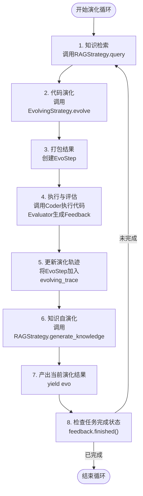
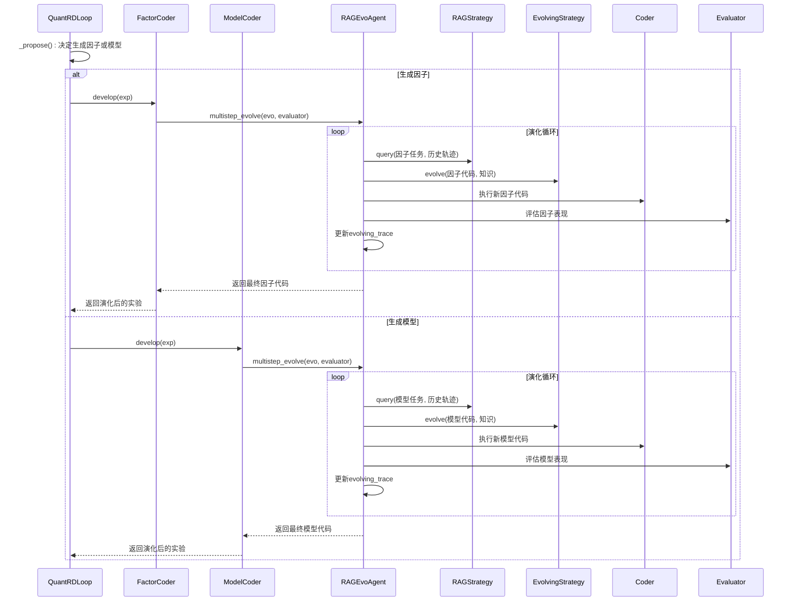

# 演化循环

<cite>
**本文档中引用的文件**  
- [RAGEvoAgent.py](file://rdagent/core/evolving_agent.py)
- [evolving_framework.py](file://rdagent/core/evolving_framework.py)
- [CoSTEER.py](file://rdagent/components/coder/CoSTEER/__init__.py)
- [evolving_strategy.py](file://rdagent/components/coder/CoSTEER/evolving_strategy.py)
- [quant.py](file://rdagent/app/qlib_rd_loop/quant.py)
- [conf.py](file://rdagent/app/qlib_rd_loop/conf.py)
- [rd_loop.py](file://rdagent/components/workflow/rd_loop.py)
</cite>

## 目录
1. [引言](#引言)
2. [演化循环核心流程](#演化循环核心流程)
3. [关键组件分析](#关键组件分析)
4. [量化联合演化场景应用](#量化联合演化场景应用)
5. [高级定制与扩展](#高级定制与扩展)
6. [结论](#结论)

## 引言
`RAGEvoAgent`的`multistep_evolve`方法是RD-Agent框架中实现自动化研发演化的核心机制。该循环通过结合检索增强生成（RAG）技术、代码演化策略、执行器和评估器，形成一个闭环的智能研发系统。本文档将深入剖析该演化循环的每一步执行流程，分析其在量化金融领域的具体应用，并为高级用户提供定制化指导。

## 演化循环核心流程
`multistep_evolve`循环是一个迭代过程，其核心执行流程如下：



**Diagram sources**
- [evolving_agent.py](file://rdagent/core/evolving_agent.py#L69-L114)

**Section sources**
- [evolving_agent.py](file://rdagent/core/evolving_agent.py#L69-L114)

### 1. 初始化EvoStep
循环的每一步都从初始化一个`EvoStep`对象开始。`EvoStep`是一个数据类，用于封装单次演化步骤的所有信息，包括：
- `evolvable_subjects`: 当前待演化的对象（如代码、因子、模型等）
- `queried_knowledge`: 从知识库检索到的相关知识
- `feedback`: 上一轮演化后生成的反馈信息

在循环开始时，`evo`参数作为初始的`evolvable_subjects`传入，而`queried_knowledge`和`feedback`则在后续步骤中逐步填充。

### 2. 调用RAGStrategy.query进行知识检索
当`with_knowledge=True`且`rag`对象存在时，系统会调用`RAGStrategy.query`方法进行知识检索。该方法接收当前待演化的对象`evo`和历史演化轨迹`evolving_trace`作为输入，从知识库中检索与当前任务最相关的信息。

```python
if self.with_knowledge and self.rag is not None:
    queried_knowledge = self.rag.query(evo, self.evolving_trace)
```

检索到的知识（`queried_knowledge`）将作为上下文信息，指导后续的代码生成过程，确保新生成的代码能够借鉴历史成功经验，避免重复犯错。

### 3. 调用EvolvingStrategy.evolve生成新代码
这是演化循环的核心逻辑。系统调用`evolving_strategy.evolve`方法，传入当前的演化对象、历史轨迹和检索到的知识，生成一个改进版本的演化对象。

```python
evo = self.evolving_strategy.evolve(
    evo=evo,
    evolving_trace=self.evolving_trace,
    queried_knowledge=queried_knowledge,
)
```

`EvolvingStrategy`是可插拔的策略模式，不同的场景（如数据科学、量化金融）可以实现不同的演化策略。例如，在`CoSTEER`框架中，`MultiProcessEvolvingStrategy`会并行处理多个子任务，并根据检索到的知识决定哪些任务需要重新实现。

### 4. 通过Coder执行代码
新生成的代码需要通过`Coder`组件进行执行。`Coder`负责将代码部署到执行环境中，运行代码并捕获执行结果（如输出、日志、错误信息等）。执行过程是验证代码正确性的关键环节。

### 5. Evaluator评估结果并生成Feedback
执行完成后，`Evaluator`组件会对结果进行评估。评估过程通常包括：
- **执行反馈**：检查代码是否成功运行，有无异常或错误。
- **返回值检查**：验证代码输出是否符合预期。
- **代码质量反馈**：对生成的代码进行审查，评估其可读性、效率和规范性。
- **最终决策**：综合各项指标，生成一个`Feedback`对象，明确指出本次演化的成功与否。

```python
if self.with_feedback:
    es.feedback = eva.evaluate(evo, queried_knowledge=queried_knowledge)
```

`Feedback`对象是驱动下一轮演化的核心驱动力，它包含了失败原因、改进建议等关键信息。

### 6. 根据反馈决定是否继续下一轮演化
循环的最后一步是检查终止条件：
- **循环次数**：检查是否已达到预设的最大循环次数`max_loop`。
- **任务完成状态**：如果`with_feedback=True`且最新的`feedback.finished()`返回`True`，则认为所有任务都已成功完成，循环提前终止。

```python
if self.with_feedback and es.feedback is not None and es.feedback.finished():
    logger.info("All tasks in evolving subject have been completed.")
    break
```

## 关键组件分析
### with_feedback和with_knowledge装饰器的作用
`with_feedback`和`with_knowledge`是`RAGEvoAgent`初始化时的关键参数，它们控制着演化循环的核心行为。

- **with_knowledge**: 当设置为`True`时，启用检索增强生成（RAG）机制。系统会在每轮演化前主动从知识库中检索相关信息，为代码生成提供上下文支持。这使得系统能够“记住”过去的经验，避免在相同问题上反复试错，显著提升演化效率。

- **with_feedback**: 当设置为`True`时，启用基于反馈的闭环演化。系统会在每轮演化后调用`Evaluator`生成`Feedback`，并将反馈信息用于指导下一轮演化。这是实现“智能迭代”的基础，确保演化过程是朝着优化目标前进的。

这两个参数共同构成了一个“检索-生成-评估-反馈”的完整闭环，是`RAGEvoAgent`实现自主智能研发的核心。

### EvoStep与演化轨迹
`EvoStep`是演化过程中的基本单元，它将一次演化操作的输入（`evolvable_subjects`, `queried_knowledge`）和输出（`feedback`）封装在一起。`RAGEvoAgent`维护一个`evolving_trace`列表，该列表按时间顺序记录了所有历史`EvoStep`。

```python
self.evolving_trace: list[EvoStep[ASpecificEvolvableSubjects]] = []
```

这个演化轨迹具有多重作用：
1. **为RAG提供上下文**：`RAGStrategy.query`可以利用历史轨迹来检索更精准的知识。
2. **为知识自演化提供数据**：`knowledge_self_gen`功能会分析整个演化轨迹，从中提炼出新的通用知识并存入知识库。
3. **支持调试与追溯**：开发者可以回溯整个演化过程，分析每一步的决策依据和结果。

**Section sources**
- [evolving_framework.py](file://rdagent/core/evolving_framework.py#L40-L55)
- [evolving_agent.py](file://rdagent/core/evolving_agent.py#L58)

## 量化联合演化场景应用
在`rdagent/app/qlib_rd_loop/quant.py`中，`QuantRDLoop`类展示了`multistep_evolve`循环在量化金融领域的具体应用。该场景实现了因子（Factor）和模型（Model）的联合演化。



**Diagram sources**
- [quant.py](file://rdagent/app/qlib_rd_loop/quant.py#L39-L98)
- [rd_loop.py](file://rdagent/components/workflow/rd_loop.py#L60-L74)

**Section sources**
- [quant.py](file://rdagent/app/qlib_rd_loop/quant.py#L39-L98)

### 具体流程分析
1. **任务决策**：`QuantRDLoop`首先通过`_propose()`方法决定本轮是生成新的因子还是优化现有模型。这个决策可以基于bandit算法、LLM或随机策略。
2. **任务分发**：根据决策结果，将任务分发给`factor_coder`或`model_coder`。
3. **启动演化**：`coder`组件内部会初始化一个`RAGEvoAgent`，并调用其`multistep_evolve`方法启动演化循环。
4. **知识共享**：无论是因子还是模型的演化，都可以从同一个知识库中检索信息。例如，一个成功的因子实现可以作为知识被模型演化过程所借鉴。
5. **结果整合**：演化完成后，将结果返回给`QuantRDLoop`，并记录到`trace`中，为下一轮决策提供依据。

这种联合演化模式使得因子发现和模型优化不再是孤立的过程，而是可以相互促进、协同进化的有机整体。

## 高级定制与扩展
对于高级用户，可以通过以下方式修改循环逻辑或注入自定义行为：

### 1. 自定义EvolvingStrategy
继承`EvolvingStrategy`基类，实现自己的`evolve`方法。例如，可以实现一个更复杂的任务调度算法，或者引入强化学习来优化演化路径。

```python
class CustomEvolvingStrategy(EvolvingStrategy):
    def evolve(self, evo, evolving_trace, queried_knowledge):
        # 自定义演化逻辑
        pass
```

### 2. 扩展RAGStrategy
通过实现`RAGStrategy`的抽象方法，可以集成不同的知识库（如向量数据库、图数据库）和检索算法（如语义搜索、关键词搜索）。

### 3. 修改反馈机制
可以重写`Evaluator`的`evaluate`方法，引入领域特定的评估指标。例如，在量化场景中，可以加入夏普比率、最大回撤等金融指标。

### 4. 注入自定义钩子
虽然`multistep_evolve`是一个生成器，但可以在其外部循环中注入自定义逻辑。例如，在每次`yield`之后，可以添加日志记录、外部通知或人工审核环节。

```python
for evolved_code in agent.multistep_evolve(initial_code, evaluator):
    # 在这里注入自定义行为
    log_progress(evolved_code)
    if need_human_review(evolved_code):
        send_for_review(evolved_code)
    # 继续下一轮演化
```

**Section sources**
- [evolving_strategy.py](file://rdagent/components/coder/CoSTEER/evolving_strategy.py#L30-L134)
- [evolving_framework.py](file://rdagent/core/evolving_framework.py#L70-L127)

## 结论
`RAGEvoAgent`的`multistep_evolve`循环是一个强大而灵活的自动化研发框架。它通过精心设计的“检索-生成-评估-反馈”闭环，实现了代码的智能迭代优化。在量化金融等复杂场景中，该循环能够有效整合因子和模型的演化过程，促进知识的复用和创新。通过理解其核心组件和工作流程，开发者可以对其进行深度定制，以满足特定领域的研发需求。