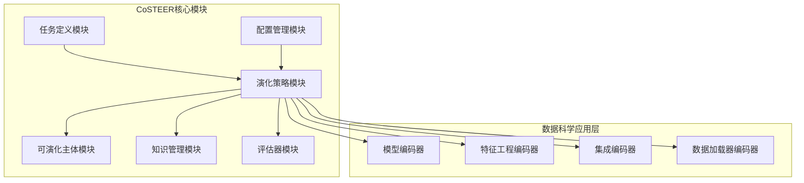
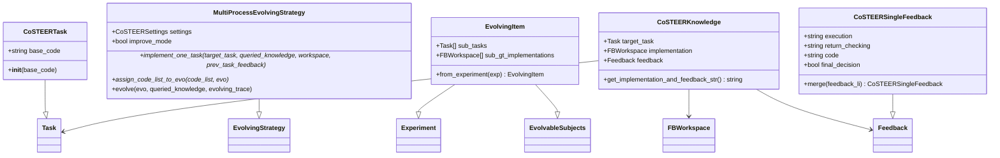
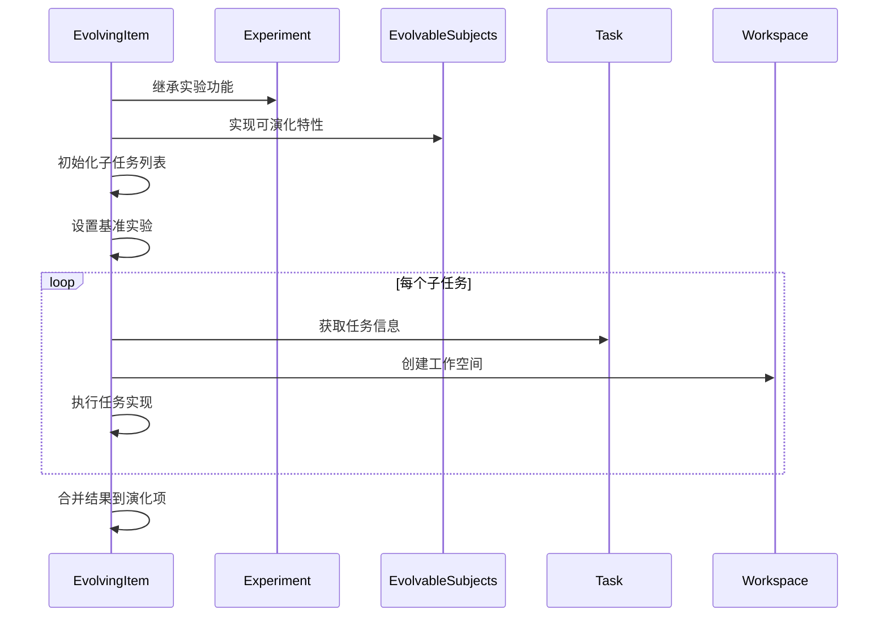
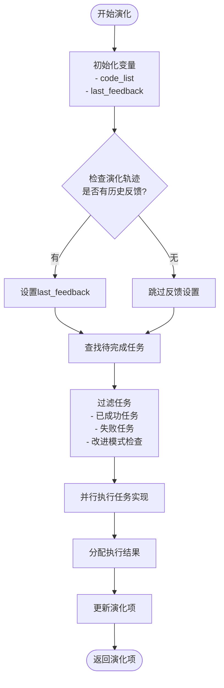
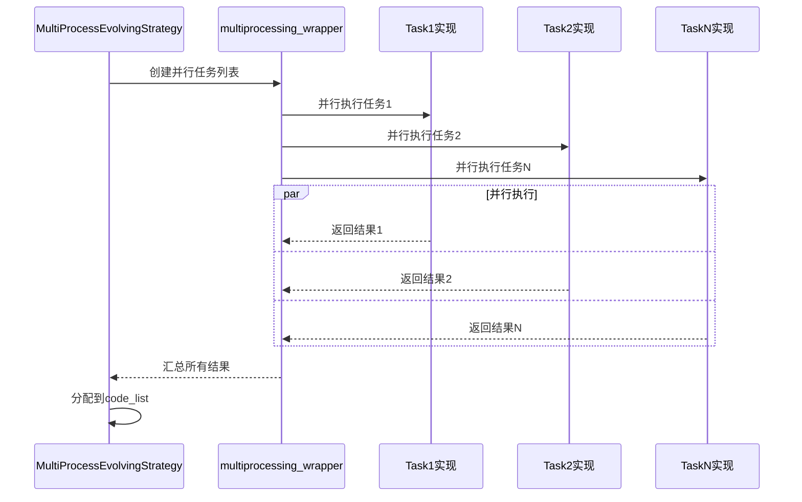
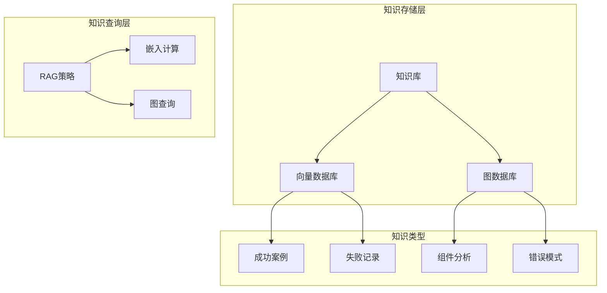
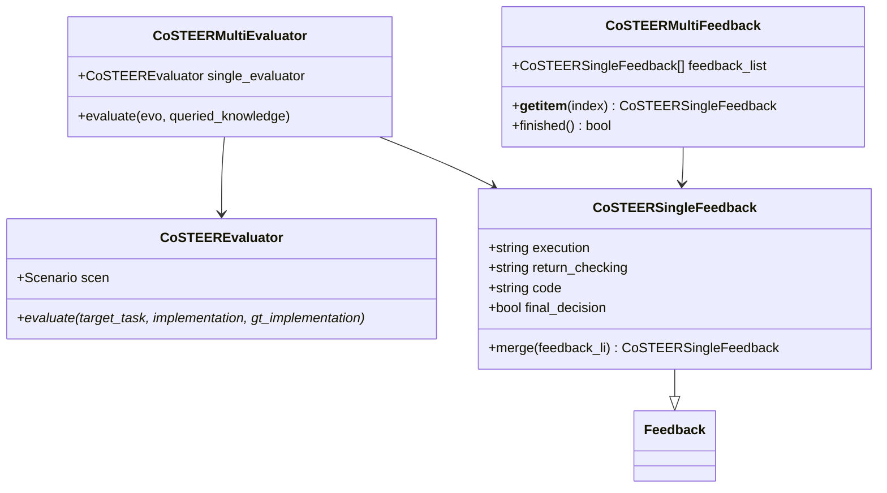
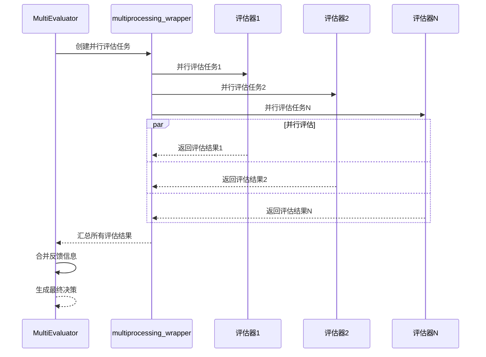
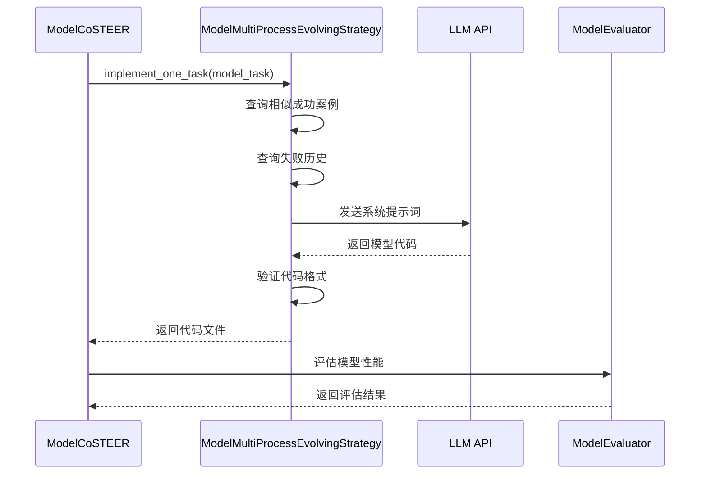

# CoSTEER策略技术文档

<cite>
**本文档中引用的文件**
- [task.py](file://rdagent/components/coder/CoSTEER/task.py)
- [evolving_strategy.py](file://rdagent/components/coder/CoSTEER/evolving_strategy.py)
- [evolvable_subjects.py](file://rdagent/components/coder/CoSTEER/evolvable_subjects.py)
- [knowledge_management.py](file://rdagent/components/coder/CoSTEER/knowledge_management.py)
- [evaluators.py](file://rdagent/components/coder/CoSTEER/evaluators.py)
- [config.py](file://rdagent/components/coder/CoSTEER/config.py)
- [model/__init__.py](file://rdagent/components/coder/data_science/model/__init__.py)
- [feature/__init__.py](file://rdagent/components/coder/data_science/feature/__init__.py)
- [ensemble/__init__.py](file://rdagent/components/coder/data_science/ensemble/__init__.py)
- [conf.py](file://rdagent/components/coder/data_science/conf.py)
- [ds_costeer.py](file://rdagent/components/coder/data_science/share/ds_costeer.py)
</cite>

## 目录
1. [引言](#引言)
2. [项目结构概览](#项目结构概览)
3. [核心组件架构](#核心组件架构)
4. [EvolvableSubject设计模式](#evolvablesubject设计模式)
5. [Evolution策略实现](#evolution策略实现)
6. [知识管理系统](#知识管理系统)
7. [评估器系统](#评估器系统)
8. [数据科学任务应用](#数据科学任务应用)
9. [性能调优与故障排除](#性能调优与故障排除)
10. [总结](#总结)

## 引言

CoSTEER（Collaborative Software Team Evolutionary Engine for Research）是一种先进的演化策略框架，专门设计用于数据科学领域的代码生成和优化。该策略通过模拟生物进化过程，实现了智能的代码演化和知识积累，为复杂的数据科学任务提供了强大的自动化解决方案。

CoSTEER策略的核心理念是通过多智能体协作、知识共享和迭代优化，实现代码质量的持续提升。它不仅能够处理单一任务的演化，还支持多个相关任务之间的协同进化，从而最大化知识复用和效率提升。

## 项目结构概览

CoSTEER策略采用模块化架构设计，主要分为以下几个核心模块：

**图表来源**
- [task.py](file://rdagent/components/coder/CoSTEER/task.py#L1-L10)
- [evolving_strategy.py](file://rdagent/components/coder/CoSTEER/evolving_strategy.py#L1-L135)
- [model/__init__.py](file://rdagent/components/coder/data_science/model/__init__.py#L1-L174)

**章节来源**
- [task.py](file://rdagent/components/coder/CoSTEER/task.py#L1-L10)
- [evolving_strategy.py](file://rdagent/components/coder/CoSTEER/evolving_strategy.py#L1-L135)
- [evolvable_subjects.py](file://rdagent/components/coder/CoSTEER/evolvable_subjects.py#L1-L33)

## 核心组件架构

CoSTEER策略的整体架构基于面向对象的设计原则，通过清晰的接口定义和模块化组织，实现了高度的可扩展性和维护性。

### 系统架构层次

**图表来源**
- [task.py](file://rdagent/components/coder/CoSTEER/task.py#L4-L10)
- [evolving_strategy.py](file://rdagent/components/coder/CoSTEER/evolving_strategy.py#L18-L135)
- [evolvable_subjects.py](file://rdagent/components/coder/CoSTEER/evolvable_subjects.py#L6-L33)
- [knowledge_management.py](file://rdagent/components/coder/CoSTEER/knowledge_management.py#L25-L40)
- [evaluators.py](file://rdagent/components/coder/CoSTEER/evaluators.py#L20-L100)

**章节来源**
- [task.py](file://rdagent/components/coder/CoSTEER/task.py#L1-L10)
- [evolving_strategy.py](file://rdagent/components/coder/CoSTEER/evolving_strategy.py#L1-L135)
- [evolvable_subjects.py](file://rdagent/components/coder/CoSTEER/evolvable_subjects.py#L1-L33)

## EvolvableSubject设计模式

### 设计理念

EvolvableSubject（可演化主体）是CoSTEER策略的核心抽象概念，它封装了可以进行自我演化的代码单元。这种设计模式借鉴了生物学中的进化理论，将软件组件视为具有适应能力的实体。

### 实现机制

**图表来源**
- [evolvable_subjects.py](file://rdagent/components/coder/CoSTEER/evolvable_subjects.py#L6-L33)

### 关键特性

1. **任务隔离**：每个EvolvingItem包含独立的任务列表，确保任务间的演化不会相互干扰
2. **基准对比**：支持与基准实现的对比，便于评估演化效果
3. **状态管理**：维护完整的演化历史和状态信息
4. **扩展性**：通过继承机制支持不同类型的任务演化

**章节来源**
- [evolvable_subjects.py](file://rdagent/components/coder/CoSTEER/evolvable_subjects.py#L1-L33)

## Evolution策略实现

### evolve方法核心逻辑

CoSTEER策略的`evolve`方法是整个演化过程的核心控制器，它协调各个组件的工作，实现智能的代码演化。

**图表来源**
- [evolving_strategy.py](file://rdagent/components/coder/CoSTEER/evolving_strategy.py#L60-L135)

### 并行处理机制

CoSTEER策略采用了高效的并行处理机制来加速演化过程：

**图表来源**
- [evolving_strategy.py](file://rdagent/components/coder/CoSTEER/evolving_strategy.py#L95-L115)

### 迭代优化控制流

演化过程中的控制流设计考虑了多种场景：

1. **正常演化模式**：对所有未完成的任务进行处理
2. **改进模式**：仅处理之前失败的任务，提供针对性优化
3. **知识驱动模式**：根据已有知识直接提供解决方案
4. **跳过模式**：对于重复或已知失败的任务进行跳过

**章节来源**
- [evolving_strategy.py](file://rdagent/components/coder/CoSTEER/evolving_strategy.py#L1-L135)

## 知识管理系统

### 向量和图数据库集成

CoSTEER的知识管理系统是一个复杂的多模态知识存储和检索系统，结合了向量相似度搜索和图数据库查询两种技术。

**图表来源**
- [knowledge_management.py](file://rdagent/components/coder/CoSTEER/knowledge_management.py#L1-L100)

### 知识检索集成点

知识管理系统提供了多层次的知识检索机制：

1. **组件分析**：基于任务描述识别相关组件
2. **相似任务匹配**：通过向量相似度找到类似的成功案例
3. **错误模式识别**：分析执行错误并关联相关解决方案
4. **历史轨迹查询**：检索之前的尝试记录和失败模式

### V2版本增强功能

CoSTEER V2版本引入了更先进的知识管理功能：

- **组件图谱**：构建任务组件之间的关系网络
- **错误分类**：自动识别和分类不同类型的错误模式
- **知识采样**：支持随机采样以避免过度依赖特定知识源
- **混合检索**：结合多种检索策略提高准确性

**章节来源**
- [knowledge_management.py](file://rdagent/components/coder/CoSTEER/knowledge_management.py#L1-L964)

## 评估器系统

### 评估器架构

CoSTEER的评估器系统采用分层设计，支持单任务和多任务评估：

**图表来源**
- [evaluators.py](file://rdagent/components/coder/CoSTEER/evaluators.py#L250-L312)

### 反馈信号机制

评估器系统通过多层次的反馈信号为演化提供指导：

1. **执行反馈**：代码执行过程中的错误信息
2. **返回值检查**：验证函数返回值是否符合预期
3. **代码质量评估**：检查代码风格和最佳实践
4. **最终决策**：综合判断任务是否成功完成

### 并行评估优化

为了提高评估效率，CoSTEER支持并行评估多个任务：

**图表来源**
- [evaluators.py](file://rdagent/components/coder/CoSTEER/evaluators.py#L280-L312)

**章节来源**
- [evaluators.py](file://rdagent/components/coder/CoSTEER/evaluators.py#L1-L312)

## 数据科学任务应用

### 编码器实例分析

CoSTEER策略在数据科学领域有多个具体的编码器实现，每个都针对特定的任务类型进行了优化。

#### 模型编码器（ModelCoder）

模型编码器专门处理机器学习模型的生成和优化：

**图表来源**
- [model/__init__.py](file://rdagent/components/coder/data_science/model/__init__.py#L20-L100)

#### 特征工程编码器（FeatureCoder）

特征工程编码器专注于数据预处理和特征生成：

- **任务理解**：分析数据特征和业务需求
- **知识检索**：查找相关特征工程模式
- **代码生成**：生成高质量的特征工程代码
- **质量验证**：确保特征质量和性能

#### 集成编码器（EnsembleCoder）

集成编码器处理模型组合和集成策略：

- **模型选择**：评估不同模型的性能
- **集成策略**：生成集成方案
- **性能优化**：优化集成后的模型性能
- **稳定性保证**：确保集成方案的稳定性

### 应用定制方法

CoSTEER策略支持灵活的定制：

1. **配置定制**：通过配置文件调整参数
2. **提示词定制**：自定义LLM提示词模板
3. **评估器定制**：添加领域特定的评估标准
4. **知识库定制**：扩展知识库的内容和结构

**章节来源**
- [model/__init__.py](file://rdagent/components/coder/data_science/model/__init__.py#L1-L174)
- [feature/__init__.py](file://rdagent/components/coder/data_science/feature/__init__.py#L1-L141)
- [ensemble/__init__.py](file://rdagent/components/coder/data_science/ensemble/__init__.py#L1-L165)

## 性能调优与故障排除

### 性能优化建议

#### 并行处理优化

1. **进程数量调优**：根据硬件资源调整`multi_proc_n`参数
2. **内存管理**：监控内存使用，避免内存泄漏
3. **I/O优化**：减少频繁的文件读写操作
4. **缓存策略**：合理使用缓存机制

#### 知识库优化

1. **索引优化**：定期重建向量索引
2. **存储压缩**：使用压缩算法减少存储空间
3. **增量更新**：实现知识库的增量更新机制
4. **查询优化**：优化图查询和向量搜索性能

### 常见问题排查

#### 演化停滞问题

**症状**：演化过程长时间没有进展
**原因分析**：
- 知识库缺乏相关成功案例
- 任务难度过高导致无法突破
- 评估标准过于严格

**解决方案**：
- 扩展知识库覆盖范围
- 调整评估标准的宽松程度
- 引入启发式搜索策略

#### 内存溢出问题

**症状**：程序运行过程中出现内存不足错误
**原因分析**：
- 并行进程过多
- 知识库过大
- 中间结果累积过多

**解决方案**：
- 减少并行进程数量
- 实现知识库的分页加载
- 定期清理中间结果

#### 评估不稳定问题

**症状**：相同代码在不同时间得到不同的评估结果
**原因分析**：
- 环境差异
- 随机因素影响
- 评估标准不一致

**解决方案**：
- 使用确定性环境配置
- 固定随机种子
- 标准化评估流程

### 调试工具和技巧

1. **日志分析**：启用详细日志记录，跟踪演化过程
2. **可视化工具**：使用图形化界面监控演化进度
3. **单元测试**：为关键组件编写单元测试
4. **性能分析**：使用性能分析工具识别瓶颈

**章节来源**
- [config.py](file://rdagent/components/coder/CoSTEER/config.py#L1-L43)
- [conf.py](file://rdagent/components/coder/data_science/conf.py#L1-L88)

## 总结

CoSTEER策略作为一种先进的演化算法框架，在数据科学领域展现出了强大的应用潜力。通过其独特的设计理念和技术实现，CoSTEER不仅提高了代码生成的质量和效率，还为复杂任务的自动化解决提供了新的思路。

### 核心优势

1. **智能化演化**：基于知识的学习和优化机制
2. **模块化设计**：高度可扩展和可维护的架构
3. **并行处理**：显著提升演化效率
4. **多维度评估**：全面的质量保证体系

### 应用前景

CoSTEER策略已经在多个数据科学任务中得到了成功的应用，包括但不限于：
- 机器学习模型的自动设计和优化
- 特征工程的自动化生成
- 模型集成策略的智能选择
- 数据预处理流程的优化

随着人工智能技术的不断发展，CoSTEER策略有望在更多领域发挥重要作用，为软件开发和数据分析提供更加智能和高效的解决方案。